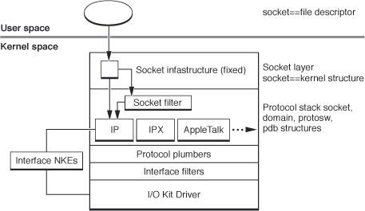

> 导航：[总目录](../../../README.md) · [documentation](../../../_indexes/documentation.md) · [Network Kernel Extensions Programming Guide](Introduction%20to%20Network%20Kernel%20Extensions%20Programming%20Guide.md)


[Next](IP%20Filters.md)[Previous](KEXT%20Controls%20and%20Notifications.md)

# Socket Filters

A socket filter is a filter associated with a particular socket, as shown in [Figure 4-1](#apple-f4xwc4dqnrsv64tfmyxwi33df52wszbpkridimbqgaytqnjyfvbuqmrshawugqkdi5euesse). These extensions can filter inbound or outbound traffic on a socket. They also can filter out-of-band communication, including calls to [setsockopt](https://developer.apple.com/library/archive/documentation/System/Conceptual/ManPages_iPhoneOS/man2/setsockopt.2.html#//apple_ref/doc/man/2/setsockopt), [getsockopt](https://developer.apple.com/library/archive/documentation/System/Conceptual/ManPages_iPhoneOS/man2/getsockopt.2.html#//apple_ref/doc/man/2/getsockopt), [ioctl](https://developer.apple.com/library/archive/documentation/System/Conceptual/ManPages_iPhoneOS/man2/ioctl.2.html#//apple_ref/doc/man/2/ioctl), [connect](https://developer.apple.com/library/archive/documentation/System/Conceptual/ManPages_iPhoneOS/man2/connect.2.html#//apple_ref/doc/man/2/connect), [listen](https://developer.apple.com/library/archive/documentation/System/Conceptual/ManPages_iPhoneOS/man2/listen.2.html#//apple_ref/doc/man/2/listen), and [bind](https://developer.apple.com/library/archive/documentation/System/Conceptual/ManPages_iPhoneOS/man2/bind.2.html#//apple_ref/doc/man/2/bind).

__Figure 4-1__  Socket filters in the Networking Stack



Socket filters can operate in one of two modes: programmatic or global. A global filter is automatically enabled for new sockets of the type specified for the filter. A programmatic filter is enabled only under program control by using [setsockopt](https://developer.apple.com/library/archive/documentation/System/Conceptual/ManPages_iPhoneOS/man2/setsockopt.2.html#//apple_ref/doc/man/2/setsockopt) on a specific socket. (Within the code itself, the only difference between global and programmatic filters is whether the flag [SFLT_GLOBAL](https://developer.apple.com/documentation/kernel/1645970-anonymous/sflt_global) or [SFLT_PROG](https://developer.apple.com/documentation/kernel/1645970-anonymous/sflt_prog) was set in the filter’s `sf_flags` field.)

When a KEXT calls [sock_socket](https://developer.apple.com/documentation/kernel/1396122-sock_socket) or an application calls [socket](https://developer.apple.com/library/archive/documentation/System/Conceptual/ManPages_iPhoneOS/man2/socket.2.html#//apple_ref/doc/man/2/socket) to create a socket, any global filters associated with the corresponding protocol are attached to the socket structure. Depending on whether the filter is filtering incoming or outgoing data, it will alter the data either just before the incoming data is stored into the socket’s buffer or just after outgoing data is retrieved from that buffer by the kernel.

Alternately, an application can call [setsockopt](https://developer.apple.com/library/archive/documentation/System/Conceptual/ManPages_iPhoneOS/man2/setsockopt.2.html#//apple_ref/doc/man/2/setsockopt) using socket option `SO_NKE` to insert a programmatic filter into that socket’s filter chain, as follows:

```
setsockopt(s, SOL_SOCKET, SO_NKE, &so_nke, sizeof (struct so_nke);
```

The `so_nke` structure is defined as follows:

```
struct so_nke {
    unsigned int nke_handle;
    unsigned int nke_where;
    int nke_flags;
};
```

The values of `nke_where` and `nke_flags` are ignored. These fields are maintained only for compatibility.

The `nke_handle` specifies the filter to be linked to the socket. It is the programmer's task to locate the KEXT containing the appropriate filter and make sure that it is loaded.

The `nke_handle` values are assigned by Apple Computer from the same name space as the type and creator codes used in Mac OS 8 and Mac OS 9 and using the same registration mechanism.

However, you can also use the kernel event ID allocation mechanism to get a unique handle value for a socket filter. A user-space application can then use the `[SIOCGKEVVENDOR](../../../Reference/usr_APIs/kern_event/CompositePage.md#apple-f4xwc4dqnrsv64tfmyxwgl3nmfrxe3zpkneu6q2hjncvmvsfjzce6uq)` ioctl on a kernel event socket to determine the dynamic handle value for a given socket filter. This mechanism is described in [Using the kern_event API for Kernel Notifications](KEXT%20Controls%20and%20Notifications.md#apple-f4xwc4dqnrsv64tfmyxwi33df52wszbpkridimbqgaytqnjyfvbuqmrsg4wugscejjdukskc).

The life cycle of a socket filter can be summed up as follows:

- Socket filters are installed in the kernel by calling [sflt_register](https://developer.apple.com/documentation/kernel/1433228-sflt_register), typically from the filter’s initialization routine.
- Later, when the filter is instantiated on a socket, the protocol calls the filter’s [sf_attach_func](https://developer.apple.com/documentation/kernel/sf_attach_func) callback. This callback may return a unique cookie through its first parameter that can be used for tracking storage specific to a given filter instance (attached to a specific socket).
- When the filter is detached (whether through the filter being unregistered, the socket being closed, or the filter being explicitly detached from the socket), the filter’s [sf_detach_func](https://developer.apple.com/documentation/kernel/sf_detach_func) callback is called. At this point, the filter should free any socket-specific resources that it has allocated (generally in [sf_attach_func](https://developer.apple.com/documentation/kernel/sf_attach_func)).
- The socket filter may, at some point, decide that it wishes to be unloaded. If so, it should call [sflt_unregister](https://developer.apple.com/documentation/kernel/1433241-sflt_unregister). This will prevent the filter from being attached to new sockets in the future and will begin the process of detaching the filter from existing sockets.

As part of the call to [sflt_register](https://developer.apple.com/documentation/kernel/1433228-sflt_register), your KEXT passes in a `struct` [sflt_filter](https://developer.apple.com/documentation/kernel/sflt_filter) object. This structure contains a number of fields that hold various callbacks and flags related to your filter.

Each socket filter contains a number of callbacks (function pointers). These callbacks are called automatically when the corresponding `socket` functions are called. The callbacks permit the filter to selectively intercept socket operations.

For example, the prototype for [sf_bind_func](https://developer.apple.com/documentation/kernel/sf_bind_func) looks like this:

```
int (*sf_bind_func)(void *cookie, socket_t so, const struct sockaddr *to);
```

The kernel's `sobind` function calls the filter’s [sf_bind_func](https://developer.apple.com/documentation/kernel/sf_bind_func) callback with the cookie value that the filter’s [sf_attach_func](https://developer.apple.com/documentation/kernel/sf_attach_func) callback returned when the filter was first attached, along with a socket instance (`so`) and the name of the local endpoint being bound (`to`).

Most of these callbacks can return an integer value (with the exception of `detach` and `notify`, which are assumed to always succeed). A return value of zero is interpreted to mean that the caller should continue processing as usual. A non-zero return value is interpreted as an error (as defined in `<sys/errno.h>`) that causes the processing of the packet or socket operation to halt; the error then propagates up through the stack.

The one exception is the return value `EJUSTRETURN`. If you return this value, the calling function (for example, `sobind`) returns at that point with a value of zero (no error). In this way, a filter can “swallow” a packet or an operation. A filter may reinject the data or operation at a later time. For other non-zero return values, the calling function returns the non-zero error code.

When any filter swallows and reinjects a packet or operation, it should expect the relevant filter function to be called again on the injected data or operation. This may occur multiple times—each time the packet is swallowed and reinjected.

Many filters (encapsulation, for example) naturally lend themselves to detecting reinjected packets. In other situations, you can use the mbuf tag functionality to make it easy to spot reinjected traffic.

To use mbuf tagging, you must first set a tag identifier for your KEXT in its start routine using the [mbuf_tag_id_find](https://developer.apple.com/documentation/kernel/1535795-mbuf_tag_id_find) function Then, at the entry to your [sf_data_in_func](https://developer.apple.com/documentation/kernel/sf_data_in_func) callback, use the [mbuf_tag_find](https://developer.apple.com/documentation/kernel/1535711-mbuf_tag_find) function to see if your filter has already tagged this packet. If not, it should process the packet. Otherwise, your filter function should return 0 immediately.

Once you have finished processing the packet, you should call [mbuf_tag_allocate](https://developer.apple.com/documentation/kernel/1535756-mbuf_tag_allocate) on the packet header mbuf to tag the packet, indicating that you have already processed it. When the mbuf is later freed, any tag references will also be deallocated.

The `tcplognke` sample provides an example of how to properly swallow and reinject packets.

The `tcplognke` filter is a socket filter which is invoked for each TCP socket. It records detailed information about each connection, including the number of bytes sent to and from the system, the time the connection was up, and the remote IP address.

The tcplog utility demonstrates the use of the `PF_SYSTEM` socket to enable/disable logging in the `tcplognke`, to read log information from the filter, and to specify different logging criteria.

When `tcplognke` is loaded and initialized, it installs itself as a global filter for the TCP protocol and registers a kernel control. The `tcplognke` filter then keeps a buffer of connection records. If no control program attaches to it, the buffer is continually overwritten as connections are established and terminated. To retain or view the information that the `tcplognke` filter gathers, use the enclosed `tcplog` command line utility. The tool configures the `tcplognke` filter to send log records to the `tcplog` program. The `tcplog` tool then loops, displaying and writing log records as the `tcplognke` filter creates them.

The source code for the `tcplognke` filter and for the `tcplog` command-line utility are available from the ADC sample code website. See the Read Me file with the _[tcplognke](https://developer.apple.com/library/archive/samplecode/tcplognke/Introduction/Intro.html#//apple_ref/doc/uid/DTS10003669)_ sample code for more instructions on the design and use of the sample KEXT.

[Next](IP%20Filters.md)[Previous](KEXT%20Controls%20and%20Notifications.md)

