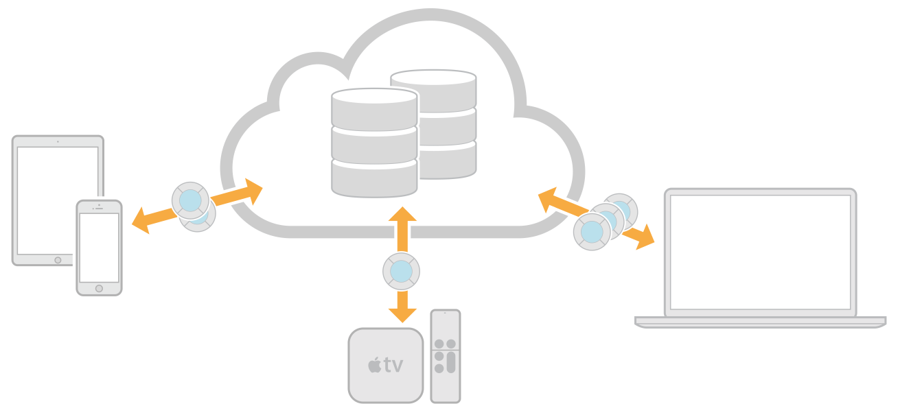

> 导航：[总目录](../../../README.md) · [documentation](../../../_indexes/documentation.md)

[Next](https://developer.apple.com/library/archive/documentation/DataManagement/Conceptual/CloudKitQuickStart/EnablingiCloudandConfiguringCloudKit/EnablingiCloudandConfiguringCloudKit.html)

# About This Document

This document gets you started creating a CloudKit app that stores structured app and user data in iCloud. Using CloudKit, instances of your app—launched by different users on different devices—have access to the records stored in the app’s database. Use CloudKit if you have model objects that you want to persist and share between multiple apps running on multiple devices. These model objects are stored as records in the database and can be provided by you or authored by the user.

You’ll learn how to:

- Enable CloudKit in your Xcode project and create a schema programmatically or with CloudKit Dashboard
- Fetch records and subscribe to changes in your code
- Use field types that are optimized for large data files and location data
- Subscribe to record changes to improve performance
- Test your CloudKit app on multiple devices before uploading it to the App Store, Mac App Store, or Apple TV App Store.
- Deploy the schema to production and keep it current with each release of your app

See [Glossary](Glossary.md#apple-f4xwc4dqnrsv64tfmyxwi33df52wszbpkridimbqge2dsobxfvbuqmjrfvjvomi) for the definition of database terms used in this book.

The following WWDC sessions provide more CloudKit architecture and API details:

- [WWDC 2014: Introducing CloudKit](https://developer.apple.com/videos/play/wwdc2014/208/) introduces the basic architecture and APIs used to save and fetch records.
- [WWDC 2014: Advanced CloudKit](https://developer.apple.com/videos/play/wwdc2014/231/) covers topics such as private data, custom record zones, ensuring data integrity, and effectively modeling your data.
- [WWDC 2015: CloudKit Tips and Tricks](https://developer.apple.com/videos/play/wwdc2015-715/) explore some of its lesser-known features and best practices for subscriptions and queries.
- [WWDC 2016: What's New with CloudKit](https://developer.apple.com/videos/play/wwdc2016/226/) covers the new sharing APIs that lets you share private data between iCloud users.
- [WWDC 2016: CloudKit Best Practices](https://developer.apple.com/videos/play/wwdc2016/231/) best practices from the CloudKit engineering team about how to take advantage of the APIs and push notifications in order to provide your users with the best experience.

The following documents describe web app APIs you can use to access the same data as your native app:

- _[CloudKit JS Reference](https://developer.apple.com/documentation/cloudkitjs)_ describes the JavaScript library you can use to access data from a web app.
- _[CloudKit Web Services Reference](https://developer.apple.com/library/archive/documentation/DataManagement/Conceptual/CloudKitWebServicesReference/index.html#//apple_ref/doc/uid/TP40015240)_ describes equivalent web services requests that you can use to access data from a web app.

The following documents provide more information about related topics:

- [Designing for CloudKit](https://developer.apple.com/library/archive/documentation/General/Conceptual/iCloudDesignGuide/DesigningforCloudKit/DesigningforCloudKit.html#//apple_ref/doc/uid/TP40012094-CH9) in _[iCloud Design Guide](../../General/iCloud%20Design%20Guide/About%20Incorporating%20iCloud%20into%20Your%20App.md#apple-f4xwc4dqnrsv64tfmyxwi33df52wszbpkridimbqgezdaoju)_ provides an overview of CloudKit.
- _App Distribution Quick Start_ teaches you how to provision your app for development and run your app on devices.
- _App Distribution Guide_ contains all the provisioning steps including configuring app services and submitting your app to the store.
- _[Start Developing iOS Apps (Swift)](https://developer.apple.com/library/archive/referencelibrary/GettingStarted/DevelopiOSAppsSwift/index.html#//apple_ref/doc/uid/TP40015214)_ introduces you to Xcode and the steps to create a basic iOS app.
[Next](https://developer.apple.com/library/archive/documentation/DataManagement/Conceptual/CloudKitQuickStart/EnablingiCloudandConfiguringCloudKit/EnablingiCloudandConfiguringCloudKit.html)

