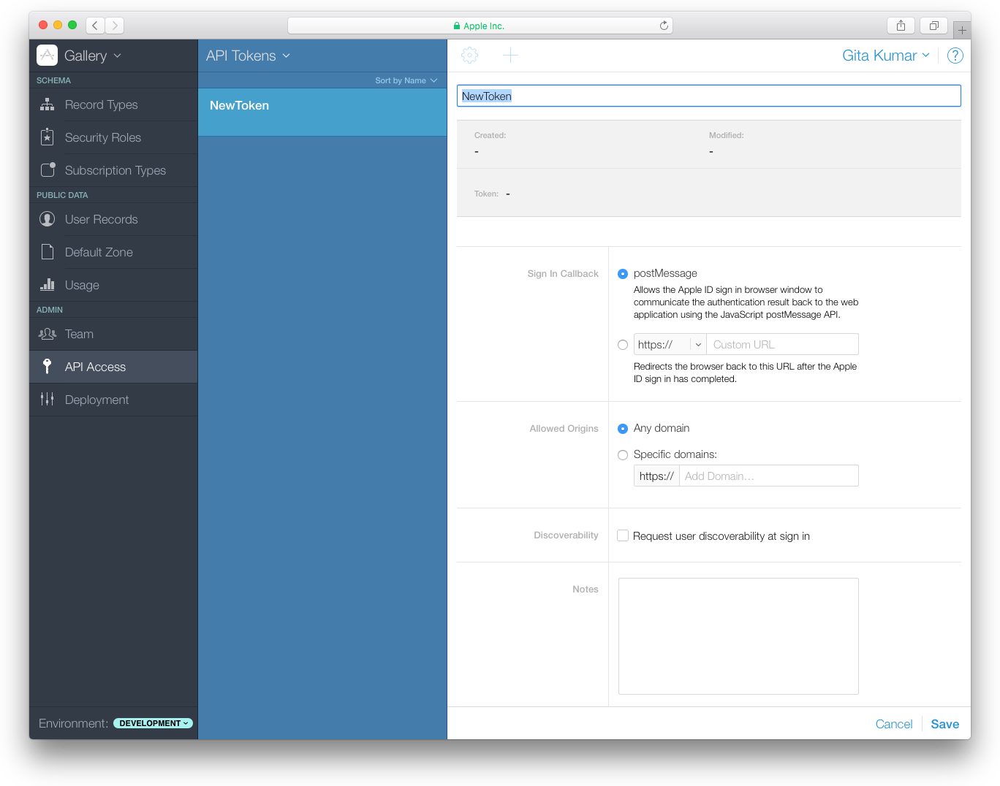
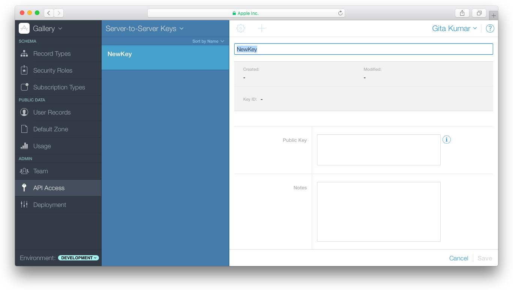

> 导航：[总目录](../../../README.md) · [documentation](../../../_indexes/documentation.md) · [CloudKit Web Services Reference](index.md)

## Composing Web Service Requests

CloudKit web service URLs have common components. Always begin the endpoints with the CloudKit web service path followed by `database`, the protocol version number, container ID, and environment. Then pass the operation subpath containing the credentials to access CloudKit using either an API Token or server-to-server key.

Use an API Token from a website or an embedded web view in a native app, or when you need to authenticate the user, described in [Accessing CloudKit Using an API Token](#apple-f4xwc4dqnrsv64tfmyxwi33df52wszbpkridimbqge2tenbqfvbuqmrufvjvomq). If the request requires user authentication, use the information in the response to authenticate the user. Use a server-to-server key to access the public database from a server process or script, described in [Accessing CloudKit Using a Server-to-Server Key](#apple-f4xwc4dqnrsv64tfmyxwi33df52wszbpkridimbqge2tenbqfvbuqmrufvjvonq).

Read the following chapters for the operation-specific JSON request and response dictionaries associated with each web service call.

### The Web Service URL

This is the path and common parameters used in all the CloudKit web service URLs:

`[path]/database/[version]/[container]/[environment]/[operation-specific subpath]`

|  |  |
| --- | --- |
| **_path_** | : The URL to the CloudKit web service, which is `https://api.apple-cloudkit.com`. |
| **_version_** | : The protocol version—currently, 1. |
| **_container_** | : A unique identifier for the app’s container. The container ID begins with `iCloud.`. |
| **_environment_** | : The version of the app’s container. Pass `development` to use the environment that is not accessible by apps available on the store. Pass `production` to use the environment that is accessible by development apps and apps available on the store. |
| **_operation-specific subpath_** | : The operation-specific subpath (provided in the following chapters). |

### Accessing CloudKit Using an API Token

To access a container as a user, append this subpath to the end of the web service URL. Provide an API token you created using CloudKit Dashboard and optionally, a web token to authenticate the user.

1. `?ckAPIToken=[API token]&ckWebAuthToken=[Web Auth Token]`

|  |  |
| --- | --- |
| **_API token_** | : An API token allowing access to the container. The `ckAPIToken` key is required.  To create an API token, read [Creating an API Token](#apple-f4xwc4dqnrsv64tfmyxwi33df52wszbpkridimbqge2tenbqfvbuqmrufvjvoni). |
| **_Web Auth Token_** | : The identifier of an authenticated user. The `ckWebAuthToken` key is optional, but if omitted and required, the request fails.  To authenticate the user and retrieve this token, read [Getting the Web Authentication Token](#apple-f4xwc4dqnrsv64tfmyxwi33df52wszbpkridimbqge2tenbqfvbuqmrufvjvomy). |

> [!NOTE]
> 

### Creating an API Token

Use CloudKit Dashboard to create the API token.

__To create an API token__

1. Sign in to [CloudKit Dashboard](https://icloud.developer.apple.com/dashboard).
2. In the upper left, from the pop-up menu, choose the container used by your app.

   API tokens are associated with a container.
3. In the left column, click API Access.
4. In the heading of the second column, choose API Tokens from the pop-up menu.
5. Click the Add button (+) in the upper-left corner of the detail area.
6. Enter a name for the API token.

   
7. (Optional) Specify a custom URL that is loaded after the user signs in using his or her Apple ID.

   In the Sign In Callback field, choose `http://` and enter a custom URL.
8. (Optional) Restrict the domains that can access your app’s container using CloudKit web services.

   In the Allowed Origins field, choose "Specific domains” and enter a domain.
9. (Optional) Enter a description in the Notes field.
10. Click Save.

### Use and Duration of the Web Authentication Token

Each token is intended for a single round trip to the server. Whenever a token is sent to the server, a new token is provided in the response from the server. Once the response is received, the previous token is no longer valid. It must be discarded and the new, returned token used in the next request.

By default, the web authentication token expires 30 minutes after it is created. If the user selects “Keep me signed in” during the sign-in window, the duration of the token is 2 weeks.

### Getting the Web Authentication Token

Some database operations require that users sign in using their Apple ID. Your web app will need to handle these authentication errors and present the user with a dialog to sign in. Apple will present the actual sign-in page through a redirect URL so that the user’s credentials remain confidential. If the user chooses to sign in, the response contains a web authentication token that you use in the subpath of subsequent requests.

__To authenticate a user__

1. Send a request (specifying the API token in the subpath) that requires a user to sign in.

   An `AUTHENTICATION_REQUIRED` error occurs, and the response contains a redirect URL.

   For example, send a request to get the current user, and append the API token.

   1. `curl "https://api.apple-cloudkit.com/database/1/[container]/[environment]/[database]/users/current?ckAPIToken=[API token]"`

   The response contains a dictionary similar to this one:

   1. `{`
   2. `"uuid":"4f02f7aa-fbb5-4cf8ae8e-4dd463793841",`
   3. `"serverErrorCode":"AUTHENTICATION_REQUIRED",`
   4. `"reason":"request needs authorization",`
   5. `"redirectURL":"[redirect URL]"`
   6. `}`
2. If you did not specify a custom URL when creating the API token, register an event listener with the window object to be notified when the user signs in.

   1. `window.addEventListener('message', function(e) {`
   2. `console.log(e.data.ckWebAuthToken);`
   3. `})`
3. Open the value for the `redirectURL` key that you received in the response.

   The Apple sign-in dialog appears displaying your app icon and name. If the user enters the Apple ID and password, the response contains a `ckWebAuthToken` string. If you specified a custom URL when creating the API token, the `ckWebAuthToken` string is passed to the custom URL, as in `https://[my-callback-url]/?ckWebAuthToken=[Web Auth Token]`.
4. Encode and append the `ckWebAuthToken` string that you received to future requests.

   To URL encode the `ckWebAuthToken` string, replace '+' with '%2B', '/' with '%2F', and '=' with '%3D'. For example, send a request to get the current user by appending the `ckWebAuthToken` string.

   1. `curl "https://api.apple-cloudkit.com/database/1/[container]/[environment]/[database]/users/current?ckAPIToken=[API token]&ckWebAuthToken=[Web Auth Token]"`

   The request succeeds and the response contains the `userRecordName` key, described in [Fetching Current User (users/current)](GetCurrentUser.md#apple-f4xwc4dqnrsv64tfmyxwi33df52wszbpkridimbqge2tenbqfvbuqmjsfvjvomi).

### Accessing CloudKit Using a Server-to-Server Key

Use a server-to-server key to access the public database of a container as the developer who created the key. You create the server-to-server certificate (that includes the private and public key) locally. Then use CloudKit Dashboard to enter the public key and create a key ID that you include in the subpath of your web services requests.

See _[CloudKit Catalog: An Introduction to CloudKit (Cocoa and JavaScript)](../../../samplecode/CloudKit%20Catalog-%20An%20Introduction%20to%20CloudKit%20%28Cocoa%20and%20JavaScript%29/CloudKit%20Catalog-%20An%20Introduction%20to%20CloudKit%20%28Cocoa%20and%20JavaScript%29.md#apple-f4xwc4dqnrsv64tfmyxwi33df52wszbpkridimbqge2dkojz)_ for a JavaScript sample that uses a server-to-server key.

### Creating a Server-to-Server Certificate

You create the certificate, containing the private and public key, on your Mac. The certificate never expires but you can revoke it.

__To create a server-to-server certificate__

1. Launch Terminal.
2. Enter this command:

   1. `openssl ecparam -name prime256v1 -genkey -noout -out eckey.pem`

   A `eckey.pem` file appears in the current folder.

You’ll need the public key from the certificate to enter in CloudKit Dashboard later.

__To get the public key for a server-to-server certificate__

1. In Terminal, enter this command:

   1. `openssl ec -in eckey.pem -pubout`

   The public key appears in the output.

   1. `read EC key`
   2. `writing EC key`
   3. `-----BEGIN PUBLIC KEY-----`
   4. `MFkwEwYHKoZIzj0CAQYIKoZIzj0DAQcDQgAExnKj6w8e3pxjtaOUfaNNjsnXHgWH`
   5. `nQA3TzMT5P32tK8PjLHzpPm6doaDvGKZcS99YAXjO+u5pe9PtsmBKWTuWA==`
   6. `-----END PUBLIC KEY-----`

> [!IMPORTANT]
> 

### Storing the Server-to-Server Public Key and Getting the Key Identifier

To enable server-to-server API access, enter the public key in CloudKit Dashboard. Later, you’ll use the key ID generated by CloudKit Dashboard in the subpath of your web services requests.

__To add a server-to-server key to the container__

1. Sign in to [CloudKit Dashboard](https://icloud.developer.apple.com/dashboard).
2. In the upper left, from the pop-up menu, choose the container used by your app.
3. In the left column, click API Access.
4. In the heading of the second column, choose Server-to-Server Keys from the pop-up menu.
5. Click the Add button (+) in the upper-left corner of the detail area.
6. Enter the public key for the server-to-server key that you created in [Creating a Server-to-Server Certificate](#apple-f4xwc4dqnrsv64tfmyxwi33df52wszbpkridimbqge2tenbqfvbuqmrufvjvony).

   
7. (Optional) Enter notes.
8. Click Save.

   Use the identifier that appears in the Key ID field in your requests. If you are using web services, pass the key ID as the `X-Apple-CloudKit-Request-KeyID` property in the header of your signed requests, described in [Authenticate Web Service Requests](#apple-f4xwc4dqnrsv64tfmyxwi33df52wszbpkridimbqge2tenbqfvbuqmrufvjvooi). If you are using CloudKit JS, set the `serverToServerKeyAuth.keyID` field in the [CloudKit.ContainerConfig](https://developer.apple.com/documentation/cloudkitjs/cloudkit/containerconfig) structure to the key ID.

### Authenticate Web Service Requests

> [!IMPORTANT]
> 

When using a server-to-server key, you sign the web service request.

__To create a signed request using the server-to-server certificate in your keychain__

1. Concatenate the following parameters and separate them with colons.

   1. `[Current date]:[Request body]:[Web service URL subpath]`

|  |  |
| --- | --- |
| **_Current date_** | : The ISO8601 representation of the current date (without milliseconds)—for example, `2016-01-25T22:15:43Z`. |
| **_Request body_** | : The base64 string encoded SHA-256 hash of the body. |
| **_Web service URL subpath_** | : The URL described in [The Web Service URL](#apple-f4xwc4dqnrsv64tfmyxwi33df52wszbpkridimbqge2tenbqfvbuqmrufvjvona) but without the `[path]` component, as in:  1. `/database/1/iCloud.com.example.gkumar.MyApp/development/public/records/query`   > [!NOTE] >  |
2. Compute the ECDSA signature of this message with your private key.
3. Add the following request headers.

   1. `X-Apple-CloudKit-Request-KeyID: [keyID]`
   2. `X-Apple-CloudKit-Request-ISO8601Date: [date]`
   3. `X-Apple-CloudKit-Request-SignatureV1: [signature]`

|  |  |
| --- | --- |
| **_keyID_** | : The identifier for the server-to-server key obtained from CloudKit Dashboard, described in [Storing the Server-to-Server Public Key and Getting the Key Identifier](#apple-f4xwc4dqnrsv64tfmyxwi33df52wszbpkridimbqge2tenbqfvbuqmrufvjvooa). |
| **_date_** | : The ISO8601 representation of the current date (without milliseconds). |
| **_signature_** | : The signature created in Step 2. |

For example, this `curl` command creates a signed request to lookup email addresses.

1. `curl -X POST -H "content-type: text/plain" -H "X-Apple-CloudKit-Request-KeyID: [keyID]” -H "X-Apple-CloudKit-Request-ISO8601Date: [date]" -H "X-Apple-CloudKit-Request-SignatureV1: [signature]" -d '{"users":[{"emailAddress":"[user email]"}]}' https://api.apple-cloudkit.com/database/1/[container ID]/development/public/users/lookup/email`

> [!IMPORTANT]
> 

[About CloudKit Web Services](index.md#apple-f4xwc4dqnrsv64tfmyxwi33df52wszbpkridimbqge2tenbqfvbuqnbrfvjvomi)

[Modifying Records (records/modify)](ModifyRecords.md#apple-f4xwc4dqnrsv64tfmyxwi33df52wszbpkridimbqge2tenbqfvbuqmrnknlts)
