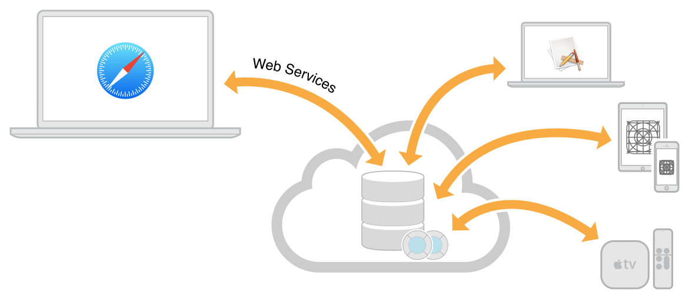

> 导航：[总目录](../../../README.md) · [documentation](../../../_indexes/documentation.md)

## About CloudKit Web Services

You use the CloudKit native framework to take your app’s existing data and store it in the cloud so that the user can access it on multiple devices. Then you can use CloudKit web services or CloudKit JS to provide a web interface for users to access the same data as your app. To use CloudKit web services, you must have the schema for your databases already created. CloudKit web services provides an HTTP interface to fetch, create, update, and delete records, zones, and subscriptions. You also have access to discoverable users and contacts. Alternatively, you can use the JavaScript API to access these services from a web app.

This document assumes that you are already familiar with CloudKit and CloudKit Dashboard. The following resources provide more information about CloudKit:

- _[CloudKit Quick Start](../CloudKit%20Quick%20Start/About%20This%20Document.md#apple-f4xwc4dqnrsv64tfmyxwi33df52wszbpkridimbqge2dsobx)_ and _[CloudKit Framework Reference](https://developer.apple.com/documentation/cloudkit)_ teach you how to create a CloudKit app and use CloudKit Dashboard.
- _[CloudKit JavaScript Reference](https://developer.apple.com/documentation/cloudkitjs)_ describes an alternative JavaScript API for accessing your app’s CloudKit databases from a web app.
- _[CloudKit Catalog: An Introduction to CloudKit (Cocoa and JavaScript)](../../../samplecode/CloudKit%20Catalog-%20An%20Introduction%20to%20CloudKit%20%28Cocoa%20and%20JavaScript%29/CloudKit%20Catalog-%20An%20Introduction%20to%20CloudKit%20%28Cocoa%20and%20JavaScript%29.md#apple-f4xwc4dqnrsv64tfmyxwi33df52wszbpkridimbqge2dkojz)_ sample code demonstrates CloudKit web services and CloudKit JS. For the interactive hosted version of this sample, go to [CloudKit Catalog](https://cdn.apple-cloudkit.com/cloudkit-catalog/).
- _[iCloud Design Guide](../../General/iCloud%20Design%20Guide/About%20Incorporating%20iCloud%20into%20Your%20App.md#apple-f4xwc4dqnrsv64tfmyxwi33df52wszbpkridimbqgezdaoju)_ provides an overview of all the iCloud services available to apps submitted to the store.

[Composing Web Service Requests](SettingUpWebServices.md#apple-f4xwc4dqnrsv64tfmyxwi33df52wszbpkridimbqge2tenbqfvbuqmrufvjvomi)
