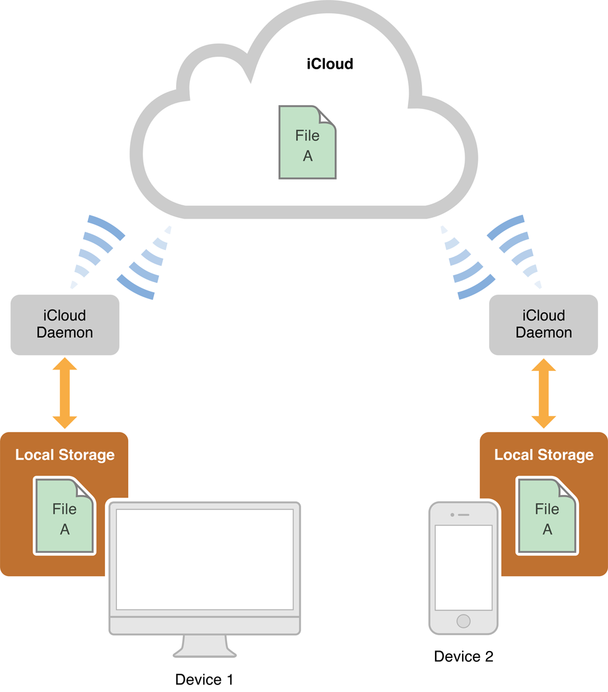

> 导航：[总目录](../../../README.md) · [documentation](../../../_indexes/documentation.md)

[Next](Designing%20a%20Document-Based%20App.md)

# About the Cocoa Document Architecture

In OS X, a Cocoa subsystem called the _document architecture_ provides support for apps that manage documents, which are containers for user data that can be stored in files locally and in iCloud.

Document-based apps handle multiple documents, each in its own window, and often display more than one document at a time. Although these apps embody many complex behaviors, the [document architecture](https://developer.apple.com/library/archive/documentation/General/Devpedia-CocoaApp-MOSX/DocArchitecture.html#//apple_ref/doc/uid/TP40009448-CH17) provides many of their capabilities “for free,” requiring little additional effort in design and implementation.

### The Model-View-Controller Pattern Is Basic to a Document-Based App

The Cocoa document architecture uses the [Model-View-Controller](https://developer.apple.com/library/archive/documentation/General/Conceptual/DevPedia-CocoaCore/MVC.html#//apple_ref/doc/uid/TP40008195-CH32) (MVC) design pattern in which model objects encapsulate the app’s data, view objects display the data, and controller objects act as intermediaries between the view and model objects. A document, an instance of an `NSDocument` subclass, is a controller that manages the app’s data model. Adhering to the MVC design pattern enables your app to fit seamlessly into the document architecture.

### Xcode Supports Coding and Configuring Your App

Taking advantage of the support provided by Xcode, including a document-based application template and interfaces for configuring app data, you can create a document-based app without having to write much code. In Xcode you design your app’s user interface in a graphical editor, specify entitlements for resources such as the App Sandbox and iCloud, and configure the app’s property list, which specifies global app keys and other information, such as document types.

### You Must Subclass NSDocument

Document-based apps in Cocoa are built around a subclass of `NSDocument` that you implement. In particular, you must override one document reading method and one document writing method. You must design and implement your app’s data model, whether it is simply a single text-storage object or a complex object graph containing disparate data types. When your reading method receives a request, it takes data provided by the framework and loads it appropriately into your object model. Conversely, your writing method takes your app’s model data and provides it to the framework’s machinery for writing to a document file, whether it is located only in your local file system or in iCloud.

### NSDocument Provides Core Behavior and Customization Opportunities

The Cocoa document architecture provides your app with many built-in features, such as autosaving, asynchronous document reading and writing, file coordination, and multilevel undo support. In most cases, it is trivial to opt-in to these behaviors. If your app has particular requirements beyond the defaults, the document architecture provides many opportunities for extending and customizing your app’s capabilities through mechanisms such as delegation, subclassing and overriding existing methods with custom implementations, and integration of custom objects.

Before you read this document, you should be familiar with the information presented in _[Mac App Programming Guide](../../General/Mac%20App%20Programming%20Guide/About%20OS%20X%20App%20Design.md#apple-f4xwc4dqnrsv64tfmyxwi33df52wszbpkridimbqgeydknbt)_.

See _[Document-Based App Programming Guide for iOS](../Document-Based%20App%20Programming%20Guide%20for%20iOS/About%20Document-Based%20Applications%20in%20iOS.md#apple-f4xwc4dqnrsv64tfmyxwi33df52wszbpkridimbqgeytcnbz)_ for information about how to develop a document-based app for iOS using the `UIDocument` class.

For information about iCloud, see _[iCloud Design Guide](../../General/iCloud%20Design%20Guide/About%20Incorporating%20iCloud%20into%20Your%20App.md#apple-f4xwc4dqnrsv64tfmyxwi33df52wszbpkridimbqgezdaoju)_.

_[File Metadata Search Programming Guide](../../Carbon/File%20Metadata%20Search%20Programming%20Guide/About%20File%20Metadata%20Queries.md#apple-f4xwc4dqnrsv64tfmyxwi33df52wszbpkridimbqgaytqnbr)_ describes how to conduct searches using the `NSMetadataQuery` class and related classes. You use metadata queries to locate an app’s documents stored in iCloud.

For information about how to publish your app in the App Store, see _App Distribution Guide_.

[Next](Designing%20a%20Document-Based%20App.md)

