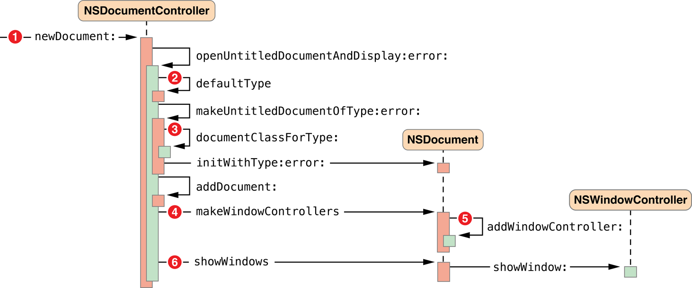
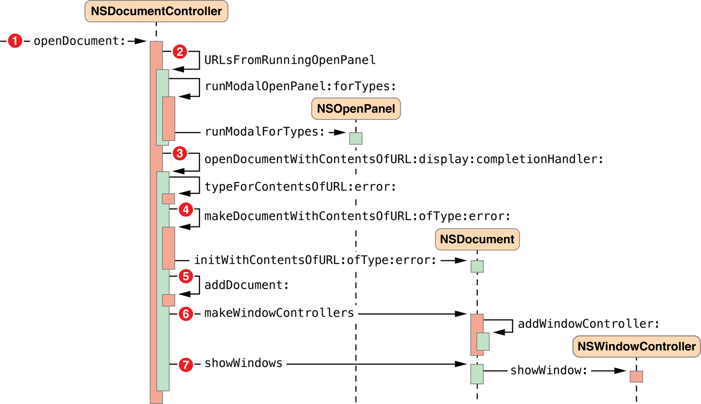
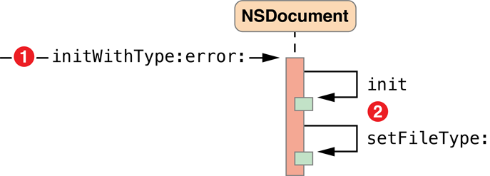
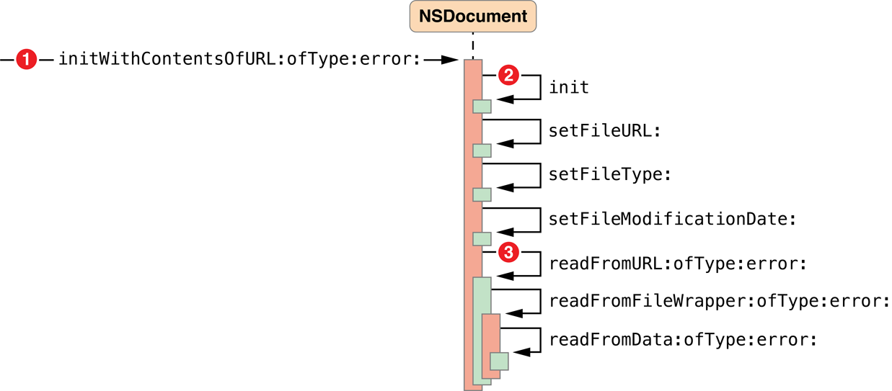
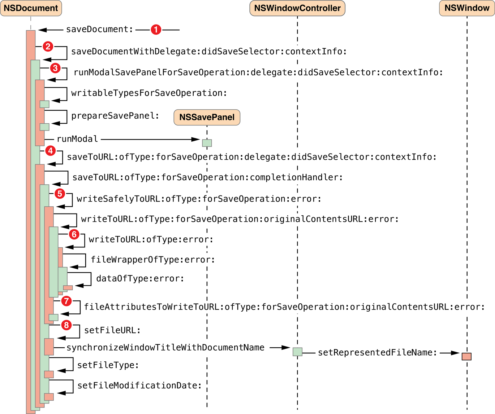

> 导航：[总目录](../../../README.md) · [documentation](../../../_indexes/documentation.md) · [Document-Based App Programming Guide for Mac](About%20the%20Cocoa%20Document%20Architecture.md)


[Next](Document%20Revision%20History.md)[Previous](Core%20App%20Behaviors.md)

# Alternative Design Considerations

Most document-based apps can use the information presented in other chapters of this document. However, some apps have particular requirements necessitating alternate techniques, some of which are discussed in this chapter.

There are situations in which the simplest solution for document reading, overriding the data-based reading method, [readFromData:ofType:error:](https://developer.apple.com/documentation/appkit/nsdocument/1515198-readfromdata), as described in [Reading Document Data](Creating%20the%20Subclass%20of%20NSDocument.md#apple-f4xwc4dqnrsv64tfmyxwi33df52wszbpkridimbqgeytcnzzfvbuqnbnknltcny), is not sufficient. In such cases, you can override another `NSDocument` reading method instead, such as the URL-based and file package reading methods.

If your app needs access to the URL of a document file, you should override the [readFromURL:ofType:error:](https://developer.apple.com/documentation/appkit/nsdocument/1515144-readfromurl) method instead of [readFromData:ofType:error:](https://developer.apple.com/documentation/appkit/nsdocument/1515198-readfromdata), as in the example implementation shown in Listing 6-1.

This example assumes that the app has an `NSTextView` object configured with an `NSTextStorage` object to display the document’s data. The `NSDocument` object has `text` and `setText:` accessors for the document’s `NSAttributedString` data model.

__Listing 6-1__  URL-based document-reading method implementation

```objc
- (BOOL)readFromURL:(NSURL *)inAbsoluteURL ofType:(NSString *)inTypeName
                                            error:(NSError **)outError {
    BOOL readSuccess = NO;
    NSAttributedString *fileContents = [[NSAttributedString alloc]
                                initWithURL:inAbsoluteURL options:nil
                                documentAttributes:NULL error:outError];
    if (fileContents) {
        readSuccess = YES;
        [self setText:fileContents];
    }
    return readSuccess;
}
```

If your app needs to manipulate directly a document file that is a file package, you should override the [readFromFileWrapper:ofType:error:](https://developer.apple.com/documentation/appkit/nsdocument/1515044-readfromfilewrapper) method instead of [readFromData:ofType:error:](https://developer.apple.com/documentation/appkit/nsdocument/1515198-readfromdata). For example, if your document contains an image file and a text file, you can store both in a file package. A major advantage of this arrangement is that if only one of those objects changes during an editing session, you don’t need to save both objects to disk but can save just the changed one. Figure 6-1 shows a file package containing an image file and an object archive.

__Figure 6-1__  File package containing an image

!

When opening a document, the method looks for the image and text file wrappers. For each wrapper, the method extracts the data from it and keeps the file wrapper itself. The file wrappers are kept so that, if the corresponding data hasn't been changed, they can be reused during a save and thus the source file itself can be reused rather than rewritten. Keeping the file wrapper avoids the overhead of syncing data unnecessarily. Listing 6-3 shows an override of the `NSDocument` file wrapper reading method [readFromFileWrapper:ofType:error:](https://developer.apple.com/documentation/appkit/nsdocument/1515044-readfromfilewrapper).

The example code in Listing 6-3 (and its corresponding file wrapper writing override shown in [Listing 6-5](#apple-f4xwc4dqnrsv64tfmyxwi33df52wszbpkridimbqgeytcnzzfvbuqnznknlti)) assume the existence of some auto-synthesized properties and constants, such as those shown in Listing 6-2; of course, a complete `NSDocument` implementation also requires some additional program logic.

__Listing 6-2__  File wrapper example properties and constants

```objc
@property (assign) IBOutlet NSTextView *textView;
@property (nonatomic, strong) NSImage *image;
@property (strong) NSString *notes;
@property (strong) NSFileWrapper *documentFileWrapper;

NSString *ImageFileName = @"Image.png";
NSString *TextFileName = @"Text.txt";
NSStringEncoding TextFileEncoding = NSUTF8StringEncoding;
```


__Listing 6-3__  File wrapper document-reading method implementation

```objc
- (BOOL)readFromFileWrapper:(NSFileWrapper *)fileWrapper
                     ofType:(NSString *)typeName
                      error:(NSError **)outError {

    NSDictionary *fileWrappers = [fileWrapper fileWrappers];
    NSFileWrapper *imageFileWrapper = [fileWrappers objectForKey:ImageFileName];
    if (imageFileWrapper != nil) {

        NSData *imageData = [imageFileWrapper regularFileContents];
        NSImage *image = [[NSImage alloc] initWithData:imageData];
        [self setImage:image];
    }

    NSFileWrapper *textFileWrapper = [fileWrappers objectForKey:TextFileName];
    if (textFileWrapper != nil) {

       NSData *textData = [textFileWrapper regularFileContents];
       NSString *notes = [[NSString alloc] initWithData:textData
                                               encoding:TextFileEncoding];
       [self setNotes:notes];
    }

    [self setDocumentFileWrapper:fileWrapper];

    return YES;
}
```

If the data related to a file wrapper changes (a new image is added or the text is edited), the corresponding file wrapper object is disposed of and a new file wrapper created on save. See [Listing 6-5](#apple-f4xwc4dqnrsv64tfmyxwi33df52wszbpkridimbqgeytcnzzfvbuqnznknlti) which shows an override of the corresponding file writing method, [fileWrapperOfType:error:](https://developer.apple.com/documentation/appkit/nsdocument/1515089-filewrapperoftype).

As with document reading, there are situations in which the simplest solution for document writing, overriding the data-based writing method, [dataOfType:error:](https://developer.apple.com/documentation/appkit/nsdocument/1515205-data), as described in [Writing Document Data](Creating%20the%20Subclass%20of%20NSDocument.md#apple-f4xwc4dqnrsv64tfmyxwi33df52wszbpkridimbqgeytcnzzfvbuqnbnknltcmq), is not sufficient. In such cases, you can override another `NSDocument` writing method instead, such as the URL-based and file package writing methods.

If your app needs access to the URL of a document file, you should override the `NSDocument` URL-based writing method, [writeToURL:ofType:error:](https://developer.apple.com/documentation/appkit/nsdocument/1515076-write), as shown in Listing 6-4. This example has the same assumptions as [Listing 6-1](#apple-f4xwc4dqnrsv64tfmyxwi33df52wszbpkridimbqgeytcnzzfvbuqnznknltg).

__Listing 6-4__  URL-based document-writing method implementation

```objc
- (BOOL)writeToURL:(NSURL *)inAbsoluteURL ofType:(NSString *)inTypeName
                                           error:(NSError **)outError {
    NSData *data = [[self text] RTFFromRange:NSMakeRange(0,
                    [[self text] length]) documentAttributes:nil];
    BOOL writeSuccess = [data writeToURL:inAbsoluteURL
                               options:NSAtomicWrite error:outError];
    return writeSuccess;
}
```

If your override cannot determine all of the information it needs from the passed-in parameters, consider overriding another method. For example, if you see the need to invoke `fileURL` from within an override of [writeToURL:ofType:error:](https://developer.apple.com/documentation/appkit/nsdocument/1515076-write), you should instead override [writeToURL:ofType:forSaveOperation:originalContentsURL:error:](https://developer.apple.com/documentation/appkit/nsdocument/1515203-write). Override this method if your document writing machinery needs access to the on-disk representation of the document revision that is about to be overwritten. This method is responsible for doing document writing in a way that minimizes the danger of leaving the disk to which writing is being done in an inconsistent state in the event of a software crash, hardware failure, or power outage.

If your app needs to directly manipulate a document file that is a file package, you should override the [fileWrapperOfType:error:](https://developer.apple.com/documentation/appkit/nsdocument/1515089-filewrapperoftype) method instead of [dataOfType:error:](https://developer.apple.com/documentation/appkit/nsdocument/1515205-data). An example file wrapper writing method implementation is shown in Listing 6-5. In this implementation, if the document was not read from a file or was not previously saved, it doesn't have a file wrapper, so the method creates one. Likewise, if the document file wrapper doesn’t contain a file wrapper for an image and the image is not `nil`, the method creates a file wrapper for the image and adds it to the document file wrapper. And if there isn’t a wrapper for the text file, the method creates one.

__Listing 6-5__  File wrapper document-writing method override

```objc
- (NSFileWrapper *)fileWrapperOfType:(NSString *)typeName
                               error:(NSError **)outError {

    if ([self documentFileWrapper] == nil) {
        NSFileWrapper * documentFileWrapper = [[NSFileWrapper alloc]
                                              initDirectoryWithFileWrappers:nil];
        [self setDocumentFileWrapper:documentFileWrapper];
    }

    NSDictionary *fileWrappers = [[self documentFileWrapper] fileWrappers];

    if (([fileWrappers objectForKey:ImageFileName] == nil) &&
        ([self image] != nil)) {

         NSArray *imageRepresentations = [self.image representations];
        NSData *imageData = [NSBitmapImageRep
                            representationOfImageRepsInArray:imageRepresentations
                                                   usingType:NSPNGFileType
                                                  properties:nil];
        if (imageData == nil) {
            NSBitmapImageRep *imageRep = nil;
            @autoreleasepool {
                imageData = [self.image TIFFRepresentation];
                imageRep = [[NSBitmapImageRep alloc] initWithData:imageData];
            }
            imageData = [imageRep representationUsingType:NSPNGFileType
                                               properties:nil];
        }

        NSFileWrapper *imageFileWrapper = [[NSFileWrapper alloc]
                                          initRegularFileWithContents:imageData];
        [imageFileWrapper setPreferredFilename:ImageFileName];

        [[self documentFileWrapper] addFileWrapper:imageFileWrapper];
    }

    if ([fileWrappers objectForKey:TextFileName] == nil) {
        NSData *textData = [[[self textView] string]
                                           dataUsingEncoding:TextFileEncoding];
        NSFileWrapper *textFileWrapper = [[NSFileWrapper alloc]
                                         initRegularFileWithContents:textData];
        [textFileWrapper setPreferredFilename:TextFileName];
        [[self documentFileWrapper] addFileWrapper:textFileWrapper];
    }
    return [self documentFileWrapper];
}
```


If your app has a large data set, you may want to read and write increments of your files as needed to ensure a good user experience. Consider the following strategies:

- __Use file packages.__ If your app supports document files that are file packages, then you can override the file-wrapper reading and writing methods. File wrapper (`NSFileWrapper`) objects that represent file packages support incremental saving. For example, if you have a file package containing text objects and graphic objects, and only one of them changes, you can write the changed object to disk but not the unchanged ones.
- __Use Core Data.__ You can subclass `NSPersistentDocument`, which uses Core Data to store your document data in a managed object context. Core Data automatically supports incremental reading and writing of only changed objects to disk.

For more information about reading and writing files, see _[File System Programming Guide](../../File%20Management/File%20System%20Programming%20Guide/About%20Files%20and%20Directories.md#apple-f4xwc4dqnrsv64tfmyxwi33df52wszbpkridimbqgeydmnzs)_.

The document architecture provides support for apps that handle multiple types of documents, each type using its own subclass of `NSDocument`. For example, you could have an app that enables users to create text documents, spreadsheets, and other types of documents, all in a single app. Such different document types each require a different user interface encapsulated in a unique `NSDocument` subclass.

If your multiple-document-type app opens only existing documents, you can use the default `NSDocumentController` instance, because the document type is determined from the file being opened. However, if your app creates new documents, it needs to choose the correct type.

The `NSDocumentController` action method [newDocument:](https://developer.apple.com/documentation/appkit/nsdocumentcontroller/1514997-newdocument) creates a new document of the first type listed in the app’s array of document types configured in the `Info.plist` file. But automatically creating the first type does not work for apps that support several distinct types of document. If your app cannot determine which type to create depending on circumstances, you must provide a user interface allowing the user to choose which type of document to create.

You can create your own new actions, either in your app’s delegate or in an `NSDocumentController` subclass. You could create several action methods and have several different New menu items, or you could have one action that asks the user to pick a document type before creating a new document.

Once the user selects a type, your action method can use the `NSDocumentController` method [makeUntitledDocumentOfType:error:](https://developer.apple.com/documentation/appkit/nsdocumentcontroller/1514963-makeuntitleddocument) to create a document of the correct type. After creating the document, your method should add it to the document controller’s list of documents, and it should send the document [makeWindowControllers](https://developer.apple.com/documentation/appkit/nsdocument/1515220-makewindowcontrollers) and [showWindows](https://developer.apple.com/documentation/appkit/nsdocument/1515049-showwindows) messages.

Alternatively, if you subclass `NSDocumentController`, you can override the [defaultType](https://developer.apple.com/documentation/appkit/nsdocumentcontroller/1514986-defaulttype) method to determine the document type and return it when the user chooses New from the File menu.

If your app has some document types that it can read but not write, you can declare this by setting the role for those types to `Viewer` instead of `Editor` in Xcode. If your app has some types that it can write but not read, you can declare this by using the `NSExportableTypes` key. You can include the `NSExportableTypes` key in the type dictionary for another type that your document class supports, usually the type dictionary for the most native type for your document class. Its value is an array of UTIs defining a supported file type to which this document can export its content.

The Sketch sample app uses this key to allow it to export TIFF and PDF images even though it cannot read those types. Write-only types can be chosen only when doing Save As operations. They are not allowed for Save operations.

Sometimes an app might understand how to read a type, but not how to write it, and when it reads documents of that type, it should automatically convert them to another type that you can write. An example would be an app that can read documents from an older version or from a competing product. It might want to read in the old documents and automatically convert them to the new native format. The first step is to add the old type as a read-only type. By doing this, your app is able to open the old files, but they come up as untitled files.

If you want to automatically convert them to be saved as your new type, you can override the `readFrom...` methods in your `NSDocument` subclass to call `super` and then reset the filename and type afterwards. You should use [setFileType:](https://developer.apple.com/documentation/appkit/nsdocument/1515121-filetype) and [setFileURL:](https://developer.apple.com/documentation/appkit/nsdocument/1515038-fileurl) to set an appropriate type and name for the new document. When setting the filename, make sure to strip the filename extension of the old type from the original filename, if it is there, and add the extension for the new type.

By default, when `NSDocument` runs the Save dialog and the document has multiple writable document types, `NSDocument` inserts an accessory view near the bottom of the dialog. This view contains a pop-up menu of the writable types. If you don’t want this pop-up menu, override [shouldRunSavePanelWithAccessoryView](https://developer.apple.com/documentation/appkit/nsdocument/1515183-shouldrunsavepanelwithaccessoryv) to return `NO`. You can also override [prepareSavePanel:](https://developer.apple.com/documentation/appkit/nsdocument/1515094-preparesavepanel) to customize the Save dialog.

Subclasses of `NSDocument` sometimes override [displayName](https://developer.apple.com/documentation/appkit/nsdocument/1515077-displayname) to customize the titles of windows associated with the document. That is rarely the right thing to do because the document’s display name is used in places other than the window title, and the custom value that an app might want to use as a window title is often not appropriate. For example, the document display name is used in the following places:

- Error alerts that may be presented during reverting, saving, or printing of the document
- Alerts presented during document saving if the document has been moved, renamed, or move to the Trash
- The alert presented when the user attempts to close the document with unsaved changes
- As the default value shown in the "Save As:" field of Save dialog

To customize a document’s window title properly, subclass `NSWindowController` and override [windowTitleForDocumentDisplayName:](https://developer.apple.com/documentation/appkit/nswindowcontroller/1528112-windowtitle). If your app requires even deeper customization, override [synchronizeWindowTitleWithDocumentName](https://developer.apple.com/documentation/appkit/nswindowcontroller/1524667-synchronizewindowtitlewithdocume).

If a document has multiple windows, each window has its own window controller. For example, a document might have a main data-entry window and a window that lists records for selection; each window would have its own `NSWindowController` object.

If you have multiple window controllers for a single document, you may want to explicitly control document closing. By default, a document closes when its last remaining window controller closes. However, if you want the document to close when a particular window closes—the document’s “main” window, for example—then you can send the main window controller a [setShouldCloseDocument:](https://developer.apple.com/documentation/appkit/nswindowcontroller/1526933-shouldclosedocument) message with a value of `YES`.

The objects that form the document architecture interact to perform the activities of document-based apps, and those interactions proceed primarily through messages sent among the objects via public APIs. This message flow provides many opportunities for you to customize the behavior of your app by overriding methods in your `NSDocument` subclass or other subclasses.

This section describes default message flow among major objects of the document architecture, including objects sending messages to themselves; it leaves out various objects and messages peripheral to the main mechanisms. Also, these messages are sent by the default implementations of the methods in question, and the behavior of subclasses may differ.

The document architecture creates a new document when the user chooses New from the File menu of a document-based app. This action begins a sequence of messages among the `NSDocumentController` object, the newly created `NSDocument` object, and the `NSWindowController` object, as shown in Figure 6-2.

__Figure 6-2__  Creating a new document



The sequence numbers in Figure 6-2 refer to the following steps in the document-creation process:

1. The user chooses New from the File menu, causing the [newDocument:](https://developer.apple.com/documentation/appkit/nsdocumentcontroller/1514997-newdocument) message to be sent to the document controller (or an Apple event, for example, sends an equivalent message).
2. The [openUntitledDocumentAndDisplay:error:](https://developer.apple.com/documentation/appkit/nsdocumentcontroller/1515014-openuntitleddocumentanddisplay) method determines the default document type (stored in the app’s `Info.plist` file) and sends it with the [makeUntitledDocumentOfType:error:](https://developer.apple.com/documentation/appkit/nsdocumentcontroller/1514963-makeuntitleddocument)message.
3. The [makeUntitledDocumentOfType:error:](https://developer.apple.com/documentation/appkit/nsdocumentcontroller/1514963-makeuntitleddocument) method determines the `NSDocument` subclass corresponding to the document type, instantiates the document object, and sends it an initialization message.
4. The document controller adds the new document to its document list and, if the first parameter passed with [openUntitledDocumentAndDisplay:error:](https://developer.apple.com/documentation/appkit/nsdocumentcontroller/1515014-openuntitleddocumentanddisplay) is `YES`, sends the document a message to create a window controller for its window, which is stored in its nib file. The `NSDocument` subclass can override [makeWindowControllers](https://developer.apple.com/documentation/appkit/nsdocument/1515220-makewindowcontrollers) if it has more than one window.
5. The document adds the new window controller to its list of window controllers by sending itself an [addWindowController:](https://developer.apple.com/documentation/appkit/nsdocument/1515179-addwindowcontroller) message.
6. The document controller sends the document a message to show its windows. In response, the document sends the window controller a `showWindow:` message, which makes the window main and key.

If the first parameter passed with [openUntitledDocumentAndDisplay:error:](https://developer.apple.com/documentation/appkit/nsdocumentcontroller/1515014-openuntitleddocumentanddisplay) is `NO`, the document controller needs to explicitly send the document [makeWindowControllers](https://developer.apple.com/documentation/appkit/nsdocument/1515220-makewindowcontrollers) and [showWindows](https://developer.apple.com/documentation/appkit/nsdocument/1515049-showwindows) messages to display the document window.

The document architecture opens a document, reading its contents from a file, when the user chooses Open from the File menu. This action begins a sequence of messages among the `NSDocumentController`, `NSOpenPanel`, `NSDocument`, and `NSWindowController` objects, as shown in [Figure 6-3](#apple-f4xwc4dqnrsv64tfmyxwi33df52wszbpkridimbqgeytcnzzfvbuqnznknltcny).

There are many similarities between the mechanisms for opening a document and creating a new document. In both cases the document controller needs to create and initialize an `NSDocument` object, using the proper `NSDocument` subclass corresponding to the document type; the document controller needs to add the document to its document list; and the document needs to create a window controller and tell it to show its window.

Opening a document differs from creating a new document in several ways. If document opening was invoked by the user choosing Open from the File menu, the document controller must run an Open dialog to allow the user to select a file to provide the contents of the document. An Apple event can invoke a different message sequence. In either case, the document must read its content data from a file and keep track of the file’s meta-information, such as its URL, type, and modification date.

__Figure 6-3__  Opening a document



The sequence numbers in Figure 6-3 refer to the following steps in the document-opening process:

1. The user chooses Open from the File menu, causing the [openDocument:](https://developer.apple.com/documentation/appkit/nsdocumentcontroller/1515005-opendocument) message to be sent to the document controller.
2. The URL locating the document file must be retrieved from the user, so the `NSDocumentController` object sends itself the [URLsFromRunningOpenPanel](https://developer.apple.com/documentation/appkit/nsdocumentcontroller/1514972-urlsfromrunningopenpanel) message. After this method creates the Open dialog and sets it up appropriately, the document controller sends itself the [runModalOpenPanel:forTypes:](https://developer.apple.com/documentation/appkit/nsdocumentcontroller/1514960-runmodalopenpanel) message to present the Open dialog to the user. The `NSDocumentController` object sends the [runModalForTypes:](https://developer.apple.com/documentation/appkit/nsopenpanel/1584364-runmodalfortypes) message to the `NSOpenPanel` object.
3. With the resulting URL, the `NSDocumentController` object sends itself the [openDocumentWithContentsOfURL:display:completionHandler:](https://developer.apple.com/documentation/appkit/nsdocumentcontroller/1514992-opendocument) message.
4. The `NSDocumentController` object sends itself the [makeDocumentWithContentsOfURL:ofType:error:](https://developer.apple.com/documentation/appkit/nsdocumentcontroller/1514949-makedocument) message and sends the [initWithContentsOfURL:ofType:error:](https://developer.apple.com/documentation/appkit/nsdocument/1515097-init) message to the newly created `NSDocument` object. This method initializes the document and reads in its contents from the file located at the specified URL. [Document Initialization Message Flow](#apple-f4xwc4dqnrsv64tfmyxwi33df52wszbpkridimbqgeytcnzzfvbuqnznknltcoa) describes document initialization in this context.
5. When [makeDocumentWithContentsOfURL:ofType:error:](https://developer.apple.com/documentation/appkit/nsdocumentcontroller/1514949-makedocument) returns an initialized `NSDocument` object, the `NSDocumentController` object adds the document to its document list by sending the [addDocument:](https://developer.apple.com/documentation/appkit/nsdocumentcontroller/1515013-adddocument) message to itself.
6. To display the document’s user interface, the document controller sends the [makeWindowControllers](https://developer.apple.com/documentation/appkit/nsdocument/1515220-makewindowcontrollers) message to the `NSDocument` object, which creates an `NSWindowController` instance and adds it to its list using the [addWindowController:](https://developer.apple.com/documentation/appkit/nsdocument/1515179-addwindowcontroller) message.
7. Finally, the document controller sends the [showWindows](https://developer.apple.com/documentation/appkit/nsdocument/1515049-showwindows) message to the `NSDocument` object, which, in turn, sends the [showWindow:](https://developer.apple.com/documentation/appkit/nswindowcontroller/1534037-showwindow) message to the `NSWindowController` object, making the window main and key.
8. If the [URLsFromRunningOpenPanel](https://developer.apple.com/documentation/appkit/nsdocumentcontroller/1514972-urlsfromrunningopenpanel) method returned an array with more than one URL, steps 3 through 7 repeat for each URL returned.

Steps in the document-initialization process for document creation are shown in Figure 6-4. Document initialization in the context of document opening is noteworthy because it invokes the document's location-based or data-based reading and writing methods, and you must override one of them. Steps in the document-initialization process for document opening are shown in [Figure 6-5](#apple-f4xwc4dqnrsv64tfmyxwi33df52wszbpkridimbqgeytcnzzfvbuqnznknltema).

__Figure 6-4__  Document initialization for document creation



The sequence numbers in Figure 6-4 refer to the following steps in the document-initialization process:

1. The `NSDocumentController` object begins document initialization by sending the [initWithType:error:](https://developer.apple.com/documentation/appkit/nsdocument/1515159-initwithtype) message to the newly created `NSDocument` object.
2. The `NSDocument` object sends the [init](https://developer.apple.com/documentation/appkit/nsdocument/1515181-init) message to itself, invoking its designated initializer, then sets its filetype by sending itself the message [setFileType:](https://developer.apple.com/documentation/appkit/nsdocument/1515121-filetype).

__Figure 6-5__  Document initialization for document opening



The sequence numbers in Figure 6-5 refer to the following steps in the document-opening process:

1. The `NSDocumentController` object begins document initialization by sending the [initWithContentsOfURL:ofType:error:](https://developer.apple.com/documentation/appkit/nsdocument/1515097-init) message to the newly created `NSDocument` object.
2. The `NSDocument` object sends the [init](https://developer.apple.com/documentation/appkit/nsdocument/1515181-init) message to itself, invoking its designated initializer, then sets its metadata about the file it is about to open by sending itself the messages [setFileURL:](https://developer.apple.com/documentation/appkit/nsdocument/1515038-fileurl), [setFileType:](https://developer.apple.com/documentation/appkit/nsdocument/1515121-filetype), and [setFileModificationDate:](https://developer.apple.com/documentation/appkit/nsdocument/1515039-filemodificationdate).
3. The `NSDocument` object reads the contents of the file by sending the [readFromURL:ofType:error:](https://developer.apple.com/documentation/appkit/nsdocument/1515144-readfromurl) message to itself. That method gets a file wrapper from disk and reads it by sending the [readFromFileWrapper:ofType:error:](https://developer.apple.com/documentation/appkit/nsdocument/1515044-readfromfilewrapper) message to itself. Finally, the `NSDocument` object puts the file contents into an `NSData` object and sends the [readFromData:ofType:error:](https://developer.apple.com/documentation/appkit/nsdocument/1515198-readfromdata) message to itself.

   Your `NSDocument` subclass _must_ override one of the three document-reading methods (`readFromURL:ofType:error:`, `readFromData:ofType:error:`, or `readFromFileWrapper:ofType:error:`) or every method that may invoke `readFromURL:ofType:error:`.

The document architecture saves a document—writes its contents to a file—when the user chooses one of the Save commands or Export from the File menu. Saving is handled primarily by the document object itself. Steps in the document-saving process are shown in Figure 6-6.

__Figure 6-6__  Saving a document



The sequence numbers in Figure 6-6 refer to the following steps in the document-saving process:

1. The user chooses Save As (document has never been saved) or Save a Version (document has been saved before) from the File menu, causing the [saveDocument:](https://developer.apple.com/documentation/appkit/nsdocument/1515147-savedocument) message to be sent to the `NSDocument` object.
2. The `NSDocument` object sends the [saveDocumentWithDelegate:didSaveSelector:contextInfo:](https://developer.apple.com/documentation/appkit/nsdocument/1515048-save) message to itself.

   If the document has never been saved, or if the user has moved or renamed the document file, then the `NSDocument` object runs a modal Save dialog to get the file location under which to save the document.
3. To run the Save dialog, the `NSDocument` object sends the [runModalSavePanelForSaveOperation:delegate:didSaveSelector:contextInfo:](https://developer.apple.com/documentation/appkit/nsdocument/1515180-runmodalsavepanel) message to itself. The document sends [prepareSavePanel:](https://developer.apple.com/documentation/appkit/nsdocument/1515094-preparesavepanel) to itself to give subclasses an opportunity to customize the Save dialog, then sends [runModal](https://developer.apple.com/documentation/appkit/nssavepanel/1525357-runmodal) to the NSSavePanel object.
4. The `NSDocument` object sends the [saveToURL:ofType:forSaveOperation:delegate:didSaveSelector:contextInfo:](https://developer.apple.com/documentation/appkit/nsdocument/1515148-savetourl) and, in turn, [saveToURL:ofType:forSaveOperation:error:](https://developer.apple.com/documentation/appkit/nsdocument/1515187-savetourl) to itself.
5. The `NSDocument` object sends the [writeSafelyToURL:ofType:forSaveOperation:error:](https://developer.apple.com/documentation/appkit/nsdocument/1515150-writesafely) message to itself. The default implementation either creates a temporary directory in which the document writing should be done, or renames the old on-disk revision of the document, depending on what sort of save operation is being done, whether or not there’s already a copy of the document on disk, and the capabilities of the file system to which writing is being done. Then it sends the [writeToURL:ofType:forSaveOperation:originalContentsURL:error:](https://developer.apple.com/documentation/appkit/nsdocument/1515203-write) message to the document.
6. To write the document contents to the file, the `NSDocument` object sends itself the [writeToURL:ofType:error:](https://developer.apple.com/documentation/appkit/nsdocument/1515076-write) message, which by default sends the document the [fileWrapperOfType:error:](https://developer.apple.com/documentation/appkit/nsdocument/1515089-filewrapperoftype) message. That method, in turn, sends the document the [dataOfType:error:](https://developer.apple.com/documentation/appkit/nsdocument/1515205-data) message to create an `NSData` object containing the contents of the document. (For backward compatibility, if the deprecated [dataRepresentationOfType:](https://developer.apple.com/documentation/appkit/nsdocument/1515081-datarepresentationoftype) is overridden, the document sends itself that message instead.)

   The `NSDocument` subclass _must_ override one of its document-writing methods ([dataOfType:error:](https://developer.apple.com/documentation/appkit/nsdocument/1515205-data), [writeToURL:ofType:error:](https://developer.apple.com/documentation/appkit/nsdocument/1515076-write), [fileWrapperOfType:error:](https://developer.apple.com/documentation/appkit/nsdocument/1515089-filewrapperoftype), or [writeToURL:ofType:forSaveOperation:originalContentsURL:error:](https://developer.apple.com/documentation/appkit/nsdocument/1515203-write)).
7. The `NSDocument` object sends the [fileAttributesToWriteToURL:ofType:forSaveOperation:originalContentsURL:error:](https://developer.apple.com/documentation/appkit/nsdocument/1515062-fileattributestowrite) message to itself to get the file attributes, if any, which it writes to the file. The method then moves the just-written file to its final location, or deletes the old on-disk revision of the document, and deletes any temporary directories.
8. The `NSDocument` object updates its location, file type, and modification date by sending itself the messages [setFileURL:](https://developer.apple.com/documentation/appkit/nsdocument/1515038-fileurl), [setFileType:](https://developer.apple.com/documentation/appkit/nsdocument/1515121-filetype), and [setFileModificationDate:](https://developer.apple.com/documentation/appkit/nsdocument/1515039-filemodificationdate) if appropriate.

[Next](Document%20Revision%20History.md)[Previous](Core%20App%20Behaviors.md)

