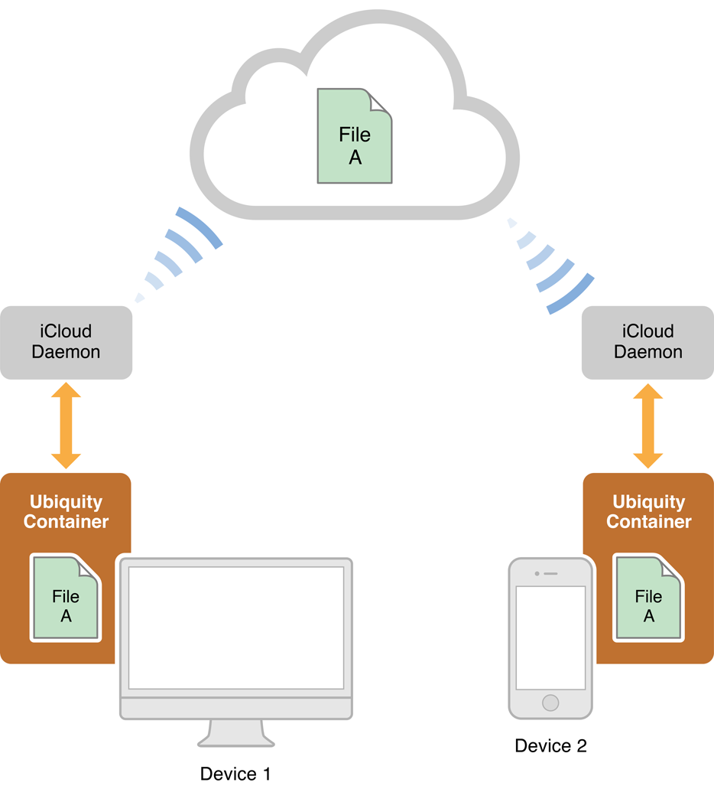

> 导航：[总目录](../../../README.md) · [documentation](../../../_indexes/documentation.md)

[Next](Designing%20a%20Document-Based%20Application.md)

# About Document-Based Applications in iOS

The UIKit [framework](https://developer.apple.com/library/archive/documentation/General/Conceptual/DevPedia-CocoaCore/Framework.html#//apple_ref/doc/uid/TP40008195-CH56) offers support for applications that manage multiple documents, with each document containing a unique set of data that is stored in a file located either in the application sandbox or in iCloud.

Central to this support is the [UIDocument](https://developer.apple.com/documentation/uikit/uidocument) class, introduced in iOS 5.0. A document-based application must create a subclass of `UIDocument` that loads document data into its in-memory data structures and supplies `UIDocument` with the data to write to the document file. `UIDocument` takes care of many details related to document management for you. Besides its integration with iCloud, `UIDocument` reads and writes document data in the background so that your application’s user interface does not become unresponsive during these operations. It also saves document data automatically and periodically, freeing your users from the need to explicitly save.

Although a document-based application is responsible for a range of behaviors, making an application document-based is usually not a difficult task.

### Document Objects Are Model Controllers

In the [Model-View-Controller](https://developer.apple.com/library/archive/documentation/General/Conceptual/DevPedia-CocoaCore/MVC.html#//apple_ref/doc/uid/TP40008195-CH32) design pattern, document objects—that is, instances of subclasses of `UIDocument`—are model controllers. A document object manages the data associated with a document, specifically the model objects that internally represent what the user is viewing and editing. A document object, in turn, is typically managed by a view controller that presents a document to users.

__Relevant Chapter:__ [Designing a Document-Based Application](Designing%20a%20Document-Based%20Application.md#apple-f4xwc4dqnrsv64tfmyxwi33df52wszbpkridimbqgeytcnbzfvbuqmrnknlte)

### When Designing an Application, Consider Document-Data Format and Other Issues

Before you write a line of code you should consider aspects of design specific to document-based applications. Most importantly, what is the best format of document data for your application, and how can you make that format work for your application in iOS _and_ Mac OS X? What is the most appropriate document type?

You also need to plan for the view controllers (and views) managing such tasks as opening documents, indicating errors, and moving selected documents to and from iCloud storage.

__Relevant Chapters:__ [Designing a Document-Based Application](Designing%20a%20Document-Based%20Application.md#apple-f4xwc4dqnrsv64tfmyxwi33df52wszbpkridimbqgeytcnbzfvbuqmrnknlte), [Document-Based Application Preflight](Document-Based%20Application%20Preflight.md#apple-f4xwc4dqnrsv64tfmyxwi33df52wszbpkridimbqgeytcnbzfvbuqmznknltc)

### Creating a Subclass of UIDocument Requires Two Method Overrides

The primary role of a document object is to be the “conduit” of data between a document file and the model objects that internally represent document data. It gives the `UIDocument` class the data to write to the document file and, after the document file is read, it initializes its model objects with the data that `UIDocument` gives it. To fulfill this role, your subclass of `UIDocument` must override the [contentsForType:error:](https://developer.apple.com/documentation/uikit/uidocument/1619978-contentsfortype) method and the [loadFromContents:ofType:error:](https://developer.apple.com/documentation/uikit/uidocument/1619971-loadfromcontents) method, respectively.

__Relevant Chapter:__ [Creating a Custom Document Object](Creating%20a%20Custom%20Document%20Object.md#apple-f4xwc4dqnrsv64tfmyxwi33df52wszbpkridimbqgeytcnbzfvbuqobnknltc)

### An Application Manages a Document Through Its Life Cycle

An application is responsible for managing the following events during a document’s lifetime:

- Creation of the document
- Opening and closing the document
- Monitoring changes in document state and responding to errors or version conflicts
- Moving documents to iCloud storage (and removing them from iCloud storage)
- Deletion of the document

__Relevant Chapter:__ [Managing the Life Cycle of a Document](Managing%20the%20Life%20Cycle%20of%20a%20Document.md#apple-f4xwc4dqnrsv64tfmyxwi33df52wszbpkridimbqgeytcnbzfvbuqnbnknltc)

### An Application Stores Document Files in iCloud Upon User Request

Applications give their users the option for putting all document files in iCloud storage or all document files in the local sandbox. To move document files to iCloud, they compose a file URL locating the document in an iCloud container directory of the application and then call a specific method of the [NSFileManager](https://developer.apple.com/documentation/foundation/filemanager) class, passing in the file URL. Moving document files from iCloud storage to the application sandbox follows a similar procedure.

__Relevant Chapter:__ [Managing the Life Cycle of a Document](Managing%20the%20Life%20Cycle%20of%20a%20Document.md#apple-f4xwc4dqnrsv64tfmyxwi33df52wszbpkridimbqgeytcnbzfvbuqnbnknltc)

### An Application Ensures That Document Data is Saved Automatically

`UIDocument` follows the saveless model and automatically saves a document’s data at specific intervals. A user usually never has to save a document explicitly. However, your application must play its part in order for the saveless model to work, either by implementing undo and redo or by tracking changes to the document.

__Relevant Chapter:__ [Change Tracking and Undo Operations](Change%20Tracking%20and%20Undo%20Operations.md#apple-f4xwc4dqnrsv64tfmyxwi33df52wszbpkridimbqgeytcnbzfvbuqnjnknltc)

### An Application Resolves Conflicts Between Different Document Versions

When documents are stored in iCloud, conflicts between versions of a document can occur. When a conflict occurs, UIKit informs the application about it. The application must attempt to resolve the conflict itself or invite the user to pick the version he or she prefers.

__Relevant Chapter:__ [Resolving Document Version Conflicts](Resolving%20Document%20Version%20Conflicts.md#apple-f4xwc4dqnrsv64tfmyxwi33df52wszbpkridimbqgeytcnbzfvbuqnrnknltc)

Before you start writing any code for your document-based application, you should at least read the first two chapters, [Designing a Document-Based Application](Designing%20a%20Document-Based%20Application.md#apple-f4xwc4dqnrsv64tfmyxwi33df52wszbpkridimbqgeytcnbzfvbuqmrnknlte) and [Document-Based Application Preflight](Document-Based%20Application%20Preflight.md#apple-f4xwc4dqnrsv64tfmyxwi33df52wszbpkridimbqgeytcnbzfvbuqmznknltc). These chapters talk about design and configuration issues, and give you an overview of the tasks required for well-designed document-based applications

Before you read _Document-Based Application Programming Guide for iOS_ you should become familiar with the information presented in _[App Programming Guide for iOS](https://developer.apple.com/library/archive/documentation/iPhone/Conceptual/iPhoneOSProgrammingGuide/Introduction/Introduction.html#//apple_ref/doc/uid/TP40007072)_.

The following documents are related in some way to _Document-Based Application Programming Guide for iOS_:

- _[Uniform Type Identifiers Overview](../../File%20Management/Uniform%20Type%20Identifiers%20Overview/Introduction%20to%20Uniform%20Type%20Identifiers%20Overview.md#apple-f4xwc4dqnrsv64tfmyxwi33df52wszbpkridimbqgaytgmjz)_ and the related reference discuss Uniform Type Identifiers (UTIs), which are the primary identifiers of document types.
- _[File Metadata Search Programming Guide](../../Carbon/File%20Metadata%20Search%20Programming%20Guide/About%20File%20Metadata%20Queries.md#apple-f4xwc4dqnrsv64tfmyxwi33df52wszbpkridimbqgaytqnbr)_ describes how to conduct searches using the [NSMetadataQuery](https://developer.apple.com/documentation/foundation/nsmetadataquery) class and related classes. You use metadata queries to locate an application’s documents stored in iCloud.
- _[iCloud Design Guide](../../General/iCloud%20Design%20Guide/About%20Incorporating%20iCloud%20into%20Your%20App.md#apple-f4xwc4dqnrsv64tfmyxwi33df52wszbpkridimbqgezdaoju)_ provides an introduction to iCloud document support.
[Next](Designing%20a%20Document-Based%20Application.md)

