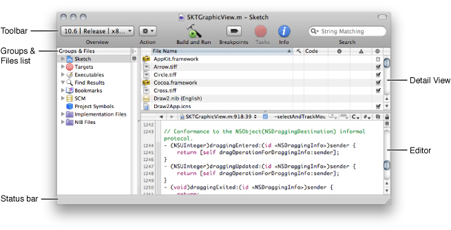
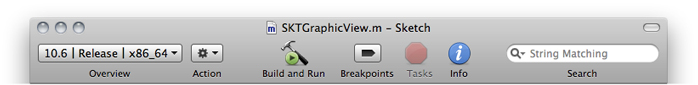
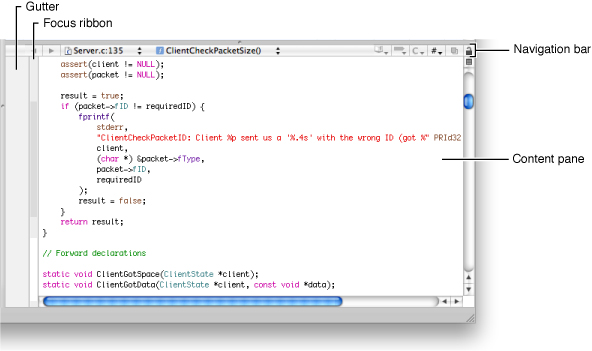
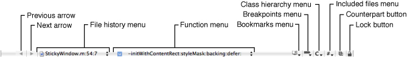

> 导航：[总目录](../../../README.md) · [documentation](../../../_indexes/documentation.md) · [A Tour of Xcode](Introduction.md)

[Next](Xcode%20Workflow%20Tutorial.md)[Previous](Introduction.md)

# Xcode Features Overview

Xcode is a highly customizable integrated development environment (IDE) with many features that let you create a pleasant and efficient working environment. This overview introduces you to Xcode features by looking at an existing Xcode project—_[CFLocalServer](../../../samplecode/CFLocalServer/CFLocalServer.md#apple-f4xwc4dqnrsv64tfmyxwi33df52wszbpirkfgmjqgaydgnrvgi)_, which builds client and server programs using UNIX domain sockets. Don’t worry—you don’t need to know anything about UNIX. You’ll be looking at this project just to learn the layout of an Xcode project. This project builds more than one product, which is why it’s an interesting one to look at.

Before you get started, download _[CFLocalServer](../../../samplecode/CFLocalServer/CFLocalServer.md#apple-f4xwc4dqnrsv64tfmyxwi33df52wszbpirkfgmjqgaydgnrvgi)_ from the ADC Mac OS X Reference Library. Double-click the `CFLocalServer.xcodeproj` file to open the project in Xcode.

Every software product starts out as a project. A project is the repository for all the elements used to design and build your product—including source files, user interface specifications, sounds, images, and links to supporting frameworks and libraries. The most visible type of software product you can create with Xcode is an application, but that’s not the only kind of project you can create. You can also develop Automator actions, command-line tools, frameworks, plug-ins, and kernel extensions.

The project window is the control center for an Xcode project. This section briefly describes each of the components in this window, except for the editing pane, which is described in [Text Editor](#apple-f4xwc4dqnrsv64tfmyxwi33df52wszbpkridgmbqgaydqojqfvbuqmrsgawvgvzr).

The project window toolbar (identified in contains buttons and other controls you can use to perform common operations.

- The Overview pop-up menu lets you choose the active software development kit (SDK), configuration, target, executable, and architecture.
- The Action pop-up menu lists tasks you can perform on the currently selected item. You get the same menu when you Control-click an item.
- The Build and Run button compiles, links, and launches your application.
- The Breakpoints button turns on any breakpoints that you’ve set and changes the Build and Run button to Build and Debug.
- The Tasks button allows you to stop any operation in progress.
- The Info button opens a window that displays information and settings for groups, files, and targets in your project. You can change many settings in an Info window.
- The search text field filters the items currently displayed in the detail view.

You can customize what’s available on the toolbar.

Groups organize the files and information in a project—they don’t necessarily reflect the actual structure of the project directory or the way the build system views the files. Their purpose is to help you organize your project and quickly find project components and information. You can customize some of the default groups in the list and define groups of your own.

Xcode provides several built-in groups such as Targets, Executables, Bookmarks, and SCM (source control management). The first group listed is always the project group, which organizes all the components needed to build your product. The project group typically contains subgroups for your project’s source files, resource files, frameworks, and products.

To the right of the Groups & Files list is the detail view. The detail view is a flattened list of all the items that are currently selected in the Groups & Files list. You can quickly search and sort the items in the detail view, gaining rapid access to important information in your project.

In addition to displaying content that you can edit, the text editor provides a navigation bar at the top, and a gutter and focus ribbon to the left of the content. You can view and edit a source file within the project window by selecting the file in the Groups & Files list. If you prefer to view and edit a source file in its own window, double-click the file in the Groups & Files list.

The gutter displays line numbers, as well as information about the location of breakpoints, errors, or warnings in the file.

The focus ribbon, as its name suggests, helps you to concentrate your attention on parts of your code by:

- Identifying the scope of a block of code
- Allowing you to hide and show blocks of code

The bar along the top of the editor contains several menus and buttons that let you move between files you’ve viewed, jump to symbols, and switch to other open files.

__Figure 1-1__  Text editor navigation bar

Although you can hold the pointer over each item to see a tooltip that provides a description of each item, these items need more explanation:

- The function menu shows the function and method definitions in the current file. When you choose a definition from this menu, the editor scrolls to the location of that definition. The menu lets you jump to many points in the current file, including any identifier declared or defined in the file. You can also add items that aren’t definitions or declarations.
- The class hierarchy menu is especially useful if you are new to Objective-C. You can quickly access the header files of the superclasses of any class in your application, which lets you investigate inherited methods and properties.
- The included files menu lists files included by the current file as well as the files that include the current file. Choosing a file from this menu opens that file in the editor.
- The Counterpart button opens the counterpart of the current file or jumps to the symbolic counterpart of the currently selected symbol.

  Clicking the Counterpart button opens the related header or source file for the file currently open in the text editor. For example, if the file currently open in the editor is `MyFile.c`, clicking this button opens `MyFile.h`, and vice versa.

  Option-clicking the Counterpart button displays the counterpart of the currently selected symbol—class, method, function, and so on—opening the corresponding file and scrolling to the appropriate section within it if necessary. If the selected symbol is a class, method, or function declaration, the editor scrolls to the definition for that item. If a class, function, or method definition is currently selected, the editor scrolls to the symbol’s declaration.

Two other text editor important features—code completion and Quick Help—are described next.

Code completion offers you an alternative to typing long method names, argument lists, and other symbols. When you’ve entered enough letters for Xcode to make a reasonable guess, you’ll see the suggestion appear as dimmed text. To accept the suggestion, press Tab. To see a list of all possible completions, press the Esc key.

For symbols that include parameters, such as methods, Xcode optionally inserts placeholders for the arguments. To move to the next placeholder, press Control–/.

To disable or enable code completion, use the Automatically Suggest menu in the Code Sense pane of Xcode preferences.

Finding technical information about an unfamiliar technology or API symbol is an important and often time-consuming activity for software developers. To view the reference documentation for a symbol in your code, Option–double-click it. Quick Help opens inline to show you the reference documentation for that symbol. If you prefer to view the header file for the symbol, click the .h button at the top of the Quick Help window. If you would like to see the complete reference document, click the book icon.

Quick Help closes automatically when you start typing again. If you want to keep Quick Help open so you can use it like an inspector, simply move it.

You can use the Documentation window to search through all developer documentation (API reference, guides, sample code, technical notes, release notes, and technical Q&A documents). As you enter a term in the search field, Xcode simultaneously performs API reference, document title, and full text searches.

A target contains the instructions for building a finished product from a set of files in a project—for example, a framework, library, application, or command-line tool. A simple Xcode project has just one target that produces one product. A larger development effort with multiple products may require a more complex project containing several related targets. For example, a project for a client-server software package may contain targets that create a client application, a server application, command-line tool versions of the client and server functionality, and a private framework that all the other targets use.

Build phases are instructions that Xcode follows to build a target. Each build phase consists of a list of input files and a task to be performed on each of those files. Common build phases include compiling files, linking object files, and copying resource files.

The CFLocalServer project has three targets. One builds a server program, one builds a client application, and another is a target whose purpose is to sequentially build the other targets. You can customize how a project is built by adding phases. To add a phase, choose Project > New Build Phases.

A build setting is a variable that contains information used to build a product. For each operation performed in the build process—such as compiling Objective-C source files—build settings control how that operation is performed. For example, the information in a build setting specifies the options Xcode passes to the tool—in this case, the compiler.

Each target can specify one or more sets of build settings, called build configurations. Targets are preconfigured with two build configurations, debug and release. The debug build configuration specifies build settings that generate products containing information that is useful during development, such as debug symbols. The release build configuration specifies build settings appropriate for products that are ready to deploy to your customers.

By default, Xcode places the built application bundle inside your project’s build folder. You can run a built application from the Finder by double-clicking the application icon located in Debug or Release folder in your project’s build folder. Which folder depends on whether the active build configuration is debug or release.

Xcode preferences let you customize just about everything in the development environment including the behavior of the text editor, where build products are stored, code colors and indentation, code repositories, and the content shown in Quick Help.

One popular set of preferences is Key Bindings, which lets you change the keyboard shortcuts for actions accessible through menu items or the keyboard, such as paging through a document or moving the cursor. You can choose a predefined set of keyboard shortcuts for menu items and other tasks, or you can create your own set. The predefined sets include sets that mimic BBEdit, Metrowerks, and MPW.

[Next](Xcode%20Workflow%20Tutorial.md)[Previous](Introduction.md)

