> 导航：[总目录](../../../README.md) · [documentation](../../../_indexes/documentation.md) · [A Tour of Xcode](Introduction.md)


[Next](Recommended%20Reading.md)[Previous](Xcode%20Features%20Overview.md)

# Xcode Workflow Tutorial

This short tutorial shows how to create an Xcode project for a Cocoa application called Hello that prints “Hello, World!” inside a window. Its primary purpose is to show you the workflow that you'll use for creating your own software with Xcode—from creating a project to getting an application to run. You'll also see how to fix compile-time errors and get an introduction to the debugger. Before reading this chapter, you should read [Xcode Features Overview](Xcode%20Features%20Overview.md#apple-f4xwc4dqnrsv64tfmyxwi33df52wszbpkridgmbqgaydqojqfvbuqmrsgawvgvzt) so that you are familiar with Xcode terminology and how to use its major features.

Hello World is a simple application. When the user opens the application, a window appears that displays the text “Hello, World!” similar to what you see in Figure 2-1. Under the hood, the user interface consists of a window that contains a view object. View objects know how to display data. These objects have a built-in method that automatically draws to the view. You need to provide the code that draws “Hello World!”

__Figure 2-1__  The Hello World application

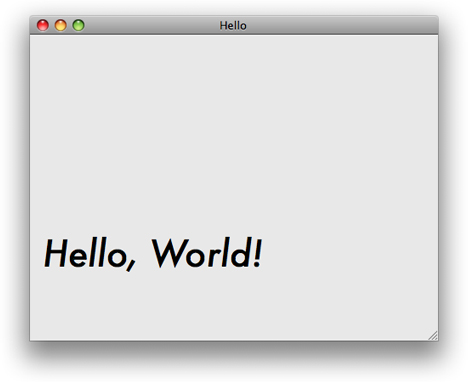

You’ll use Cocoa, Apple’s object-oriented language, to create a view object and implement the drawing routine. You don’t need to know Cocoa to complete this tutorial, but you should be familiar with programming in some language, preferably a C-based or object-oriented language.

Xcode includes a set of built-in project templates configured for building specific types of software products. A template project sets up the basic application environment by creating an application object, connecting to the window server, establishing the run loop, and so on.

To create an Xcode project for the Hello application using a template:

1. Open Xcode. (It’s in the `/Developer/Applications` directory.)
2. In the Welcome to Xcode window, click “Create a new Xcode Project.”

   If the Welcome to Xcode window does not appear, choose File > New Project.

   If you’re curious, browse through the list of templates to see the variety of software products Xcode can build.
3. In the list on the left, select Application under Mac OS X.

   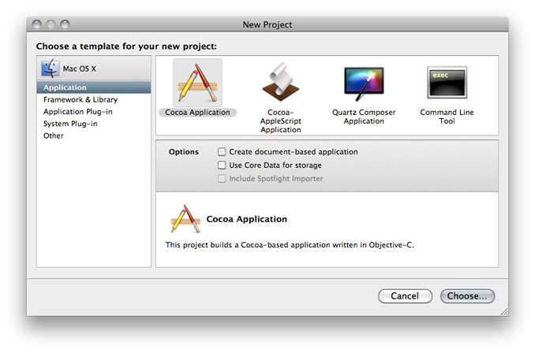
4. Select the Cocoa Application template and click the Choose button. (You don’t need to select any of the options.)
5. Navigate to the location where you want the Xcode application to create the project folder.
6. Type `Hello` in the Save As field. Then click Save.

   The Xcode application creates the project and displays the project window described in the next section.
7. Open the `main.m` file and look at the `main` function.

   Xcode automatically provides the `main` function. You don’t need to modify it, but it’s a good idea to understand its purpose.

   This call performs most of the work of setting up the application and creates an instance of `NSApplication`:

```
return NSApplicationMain (argc, (const char **) argv);
```

   The `NSApplicationMain` function also scans the application’s `Info.plist` file, which is a dictionary that contains information about the application such as its name and icon.

Now it’s time to get to the heart of creating the Hello World application—editing source files and setting up the user interface.

To modify the behavior of the application to print “Hello, World!” in its main window you need to:

- Create a view object (a subclass of `NSView`) to which you will later draw the “Hello, World!” greeting. You’ll do this in Xcode.
- Add a view object user-interface element to the Hello application window. You’ll do this in Interface Builder.
- Implement the drawing method provided by the `NSView` class. You’ll do this in Xcode.

The following sections describe these tasks in detail.

Cocoa always draws to objects known as views. The basic functionality of a view is implemented by the `NSView` class. This class defines the basic drawing, event handling, and printing architecture of an application. You typically don’t interact with `NSView` directly. Instead, you create a custom subclass that inherits from `NSView` and then override the methods you need. The AppKit framework automatically invokes these methods.

Right now, all you need to do is create a subclass of `NSView`. Later, you’ll write the code that performs drawing.

1. In the Groups & Files list of the Hello project window, select Classes.
2. Choose File > New File. The New File dialog appears.

   If you’re curious, browse through the list of templates to see the variety of files Xcode can create for you.
3. Click Cocoa Class under Mac OS X, select the Objective-C class template, choose NSView from the Subclass menu, and click Next.

   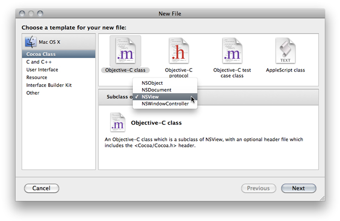
4. Enter `HelloView.m` in the File Name field. Make sure the option “Also create HelloView.h” is selected.
5. Click Finish.

   The Xcode application creates the source files and places them inside the Classes group in your project. You’ll take a closer look at these later. Right now however, you’ll turn your attention to the user interface.

Interface Builder is Apple’s graphical editor that you use to design user interfaces. It doesn’t generate source code; instead it allows you to manipulate objects directly and then save those objects in an archive called a nib file. At runtime, when a nib file is loaded the objects are unarchived and restored to the state they were in when you saved the file.

You need to add an instance of the `HelloView` class that you just created in Xcode to the application window.

1. Open Interface Builder by double-clicking the `MainMenu.xib` file, which you can find in the detail view for the project group.
2. Double-click the Window icon located in the MainMenu.xib window.

   When the user opens the Hello World application that you create, this is the window that appears.
3. Click inside the Window title bar and then choose Tools > Attributes Inspector.

   The inspector lets you look at and modify characteristics of the user interface elements you add to your application. Notice that your window already has default settings that dictate its behavior.

   Take a moment to click the buttons at the top of the inspector to see the other window characteristics—effects, size, bindings, connections, identity, and AppleScript. Later you’ll change some of these other characteristics.

   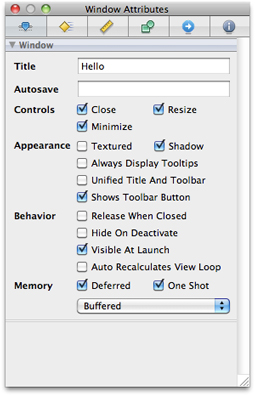

   The window acts as a container for other user interface elements, like buttons, sliders, views, and text fields. For this application, you’ll need to add a view to the window. It’s the view that your application will draw to.
4. Choose Tools > Library to display the Interface Builder library.

   The library contains prebuilt user interface objects and media that you can add to your application. Take a moment to look through the variety of objects that are available. As you select groups, you see icons for the objects that you can choose from. When you select an object, you see its description.

   For the Hello World application, you need a custom view to draw to. You’ll add that to the window next.
5. In the Library pop-up menu, choose Layout Views and then locate the Custom View icon.
6. Drag the Custom View element from the library to the Hello window.

   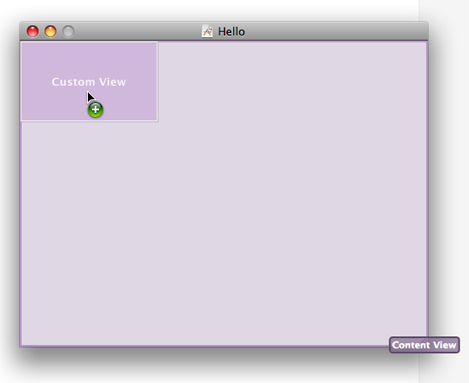

   A custom view is a subclass of `NSView`. Later, in your code, you’ll implement the drawing method (`drawRect:`) for the `HelloView` class that will draw to the custom view in the user interface.
7. Resize the Custom View element so that it occupies the entire content area of the Hello window.
8. Choose Tools > Identity Inspector. Then choose `HelloView` from the Class pop-up menu.

   Recall that `HelloView` is a class that you created in Xcode. Interface Builder and Xcode communicate with each other behind the scenes. Classes you create in Xcode are known to Interface Builder, which is why you can choose it from the Class pop-up menu. Notice that the label for the view in the window changes from `Custom View` to `HelloView`.

   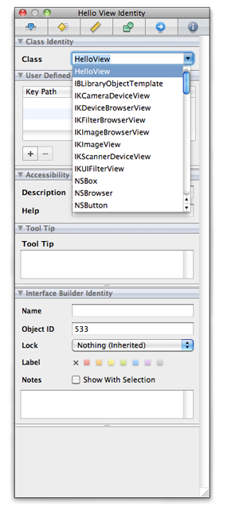

   You resized the view so it is the same size as the window, but what happens if the user resizes the window? In some cases you might want the view to stay the same size. But in this case, you want the view to expand and contract with the window. You’ll set that behavior next.
9. Select the view, and then choose Tools > Size Inspector.

   The inspector provides information about the object that’s currently selected. Now that you have two objects in your user interface—a window and a view, you want to make sure you have the appropriate one selected when using the inspector.

   The Size inspector lets you enter precise values for positioning and sizing objects. You can also set the layout simply by moving and resizing the objects onscreen. Autosizing lets you specify how (and whether) objects change size as the enclosing window changes size. You’ll set up autosizing next.

   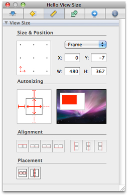
10. On the left side of the Autosizing area, click the vertical and horizontal lines in the inner square.

    Notice the dotted lines change to solid ones. Solid lines indicate the direction that the view should resize automatically. In this case, the view resizes automatically in both directions when the user changes the window size.
11. Save the Interface Builder file and quit Interface Builder.

There is much more to Interface Builder than you’ve seen here. When you write more advanced applications, you’ll use the inspector to set bindings and connections to associate the code you write with the user interface objects that trigger that code.

To edit the source code for the Hello project:

1. Open the Hello project window and select the Classes group.

   Your two custom source files—`HelloView.m` and `HelloView.h`—should be listed in the detail view.
2. Open `HelloView.m` in a separate window by double-clicking it in the detail view.

   The file should look something like Listing 2-1.

   Notice that Xcode automatically created the `initWithFrame:` and `drawRect:` methods for you.

   __Listing 2-1__  Initial Implementation of the `HelloView` class

```objc
#import "HelloView.h"

@implementation HelloView

- (id)initWithFrame:(NSRect)frame {
    self = [super initWithFrame:frame];
    if (self) {
        // Initialization code here.
    }
    return self;
}

- (void)drawRect:(NSRect)rect {
    // Drawing code here.
}

@end
```

   The method `initWithFrame:` is the designated initializer for the `NSView` class. It returns an initialized object. If your application needs to perform any other initializations related to the `HelloView` object, you’d add code to this method. Hello World is a simple application that doesn’t require any custom initialization.

   The `drawRect:` method is called automatically whenever the view needs to be drawn. The default implementation does nothing. You need to add whatever drawing code is appropriate for your application. You’ll do that next.
3. Insert these code lines as the body of the `drawRect:` method:

```
NSString* hello = @"Hello, World!";
NSPoint point = NSMake
```

   The first line creates the string that you’ll draw into the view.

   The second line is incomplete, but next you’ll see how to get help completing this line.
4. Position the cursor right after `NSMake` and press Esc. In the pop-up menu that appears, double-click `NSMakePoint` to choose it.

   The menu contains the symbols Xcode knows about whose name start with `NSMake`.

   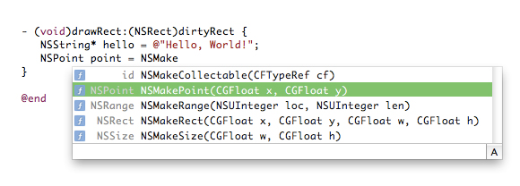
5. Enter `15` for the `CGFloat x` parameter and `75` for the `CGFloat y` parameter. Then add a semicolon (`;`) to the end of the code line.

   This call creates a point at the coordinates values that you specify. This point will be the starting point for drawing the Hello, World text.
6. Complete the implementation of the `drawRect:` method so it looks like the one shown in Listing 2-2.

   This implementation draws the “Hello, World!” string starting at the view coordinates of `(15, 75)`, using the Futura-Medium Italic font, size 42. The font name and size are added to a dictionary object, which is then passed to the `drawAtPoint:withAttributes:` method. This method does the actual drawing, using the attributes to added to the dictionary. After drawing the text, the `drawRect:` method releases the dictionary object to ensure proper memory management in Cocoa.

   __Listing 2-2__  Implementation of the `drawRect:` method

```objc
- (void) drawRect:(NSRect) rect
{
    NSString* hello = @"Hello, World!";
    NSPoint point = NSMakePoint(15, 75);
    NSMutableDictionary* font_attributes = [NSMutableDictionary new];
    NSFont* font = [NSFont fontWithName:@"Futura-MediumItalic" size:42];
    [font_attributes setObject:font forKey:NSFontAttributeName];

    [hello drawAtPoint:point withAttributes:font_attributes];

    [font_attributes release];
}
```
7. Choose File > Save.

The build system in Xcode handles the complex process of creating a finished product based on build settings and rules specified in each of the project’s targets. When you initiate a build, Xcode begins a process that starts with the source files in your project directory and ends with a complete product. Along the way, Xcode performs various tasks such as compiling source files, linking object files, copying resource files, and so forth. After Xcode finishes building the product (and if it doesn’t encounter any errors along the way), it displays “Build succeeded” in the status bar at the bottom of the project window.

To verify that the application runs:

1. Click the Build and Run button in the project window toolbar.
2. Verify that the application opens a window and displays “Hello,World!”
3. Press Command-Q to quit.

If you copied everything correctly, you won’t have any compile-time errors.

Projects are rarely flawless from the start. By introducing a mistake into the source code for the Hello project, you can discover the error-checking features in Xcode.

To see how error checking works:

1. Open the `HelloView.m` file.
2. Remove the semicolon from the `point` definition code line, creating a syntax error.
3. Choose File > Save to save the modified file.
4. Choose Build > Build. As expected, this time the build fails.
5. The error and warning messages are displayed inline in the editor window.

   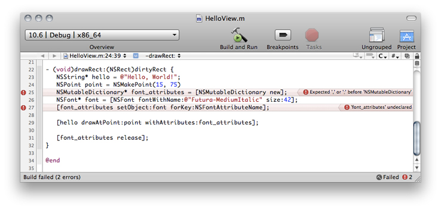
6. Fix the error in the source file, save, and build again. Notice that the error messages from the previous build are gone.

Xcode provides a graphical user interface for GDB, the GNU source-level debugger. Debugging is an advanced programming topic that’s beyond the scope of this tutorial, but it’s useful to try out the debug command to see how it works. When you debug an application, you should make sure that Debug is the active build configuration.

To set a breakpoint and step through a block of code:

1. Open the `HelloView.m` file.
2. Find the line that defines the `hello` variable.
3. Set a breakpoint by clicking in the column to the left of the code line.

   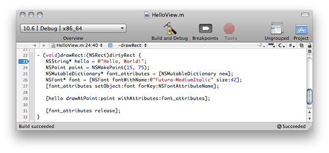
4. Choose Run > Debugger. Xcode opens the debugger.
5. Click Breakpoints and then click Build and Debug to have Xcode run the application in debug mode.

   Your application pauses at the breakpoint you set.

   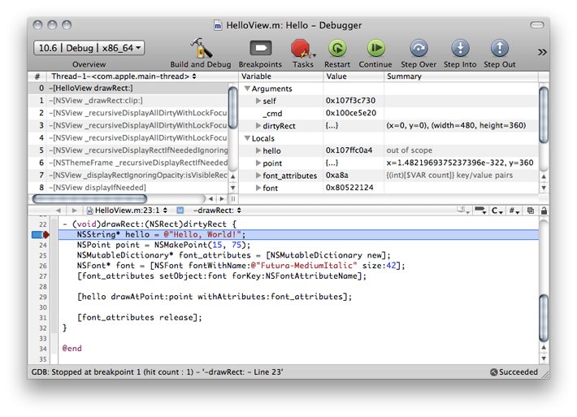
6. Using the Step Over button in the debugger toolbar, begin stepping through the code. As each line of code executes, you can examine the program’s state. The value of a variable is sometimes drawn in red to indicate that the value was modified in the last step.

   Notice that the debugger pauses before executing the indicated line. After each pause, you can add additional breakpoints or choose Debug > Restart to terminate the application and start a new debugging session.

Normally, Xcode just stops the execution of the program when it encounters a breakpoint. By specifying breakpoint actions, you make Xcode perform other actions, such as logging output to the console.

To add a breakpoint action to the breakpoint you added earlier:

1. Choose Run > Show > Breakpoints. Xcode displays the Breakpoints window.
2. In the detail view in the Breakpoints window, click the triangle to the left of the breakpoint you added earlier.
3. Click the add (+) button that appears below the breakpoint.
4. From the pop-up menu that appears in the line below the breakpoint, choose Sound.
5. From the second pop-up menu, choose the sound you want Xcode to play when it reaches that breakpoint.

   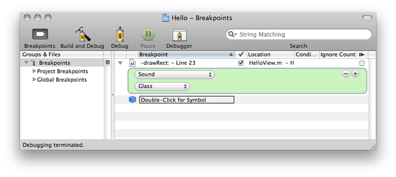

   Now when execution reaches the breakpoint, Xcode plays a sound in addition to stopping the program.

For more information on breakpoints, see [Managing Program Execution](https://developer.apple.com/library/archive/documentation/DeveloperTools/Conceptual/XcodeDebugging/200-Managing_Program_Execution/program_execution.html#//apple_ref/doc/uid/TP40007057-CH8) in _[Xcode Debugging Guide](../Xcode%20Debugging%20Guide/Introduction.md#apple-f4xwc4dqnrsv64tfmyxwi33df52wszbpkridimbqga3tanjx)_.

[Next](Recommended%20Reading.md)[Previous](Xcode%20Features%20Overview.md)

