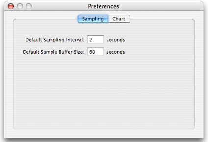
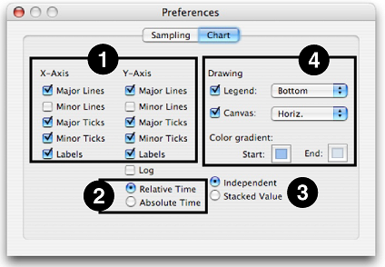
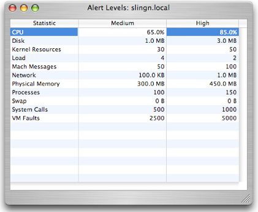

> 导航：[总目录](../../../README.md) · [documentation](../../../_indexes/documentation.md) · [Big Top User Guide](Introduction.md)

[Next](Document%20Revision%20History.md)[Previous](Using%20BigTop.md)

# Preferences

Global preferences for BigTop are set using two different windows: the normal application _Preferences_ window (see [Preferences Window](#apple-f4xwc4dqnrsv64tfmyxwi33df52wszbpkridimbqga2temzufvbuqnbnknltc)) and the _Alert Levels_ window, described in [Alert Levels Editor Window](#apple-f4xwc4dqnrsv64tfmyxwi33df52wszbpkridimbqga2temzufvbuqnbnknlte), which controls the resource levels used to trigger resource alert indicators in the _System Window_ (see [The Systems Summary Table](Using%20BigTop.md#apple-f4xwc4dqnrsv64tfmyxwi33df52wszbpkridimbqga2temzufvbuqmznknltm)).

BigTop’s general preferences are accessed from the _BigTop→Preferences..._ menu item and allow you to set persistent preferences that will be restored each time BigTop is launched. BigTop’s preference panel is divided into two tabbed views: _Sampling_ and _Chart_, which are described in the following two subsections.

The _Sampling_ tab, illustrated in Figure 2-1, allows you to modify the default sampling interval and sampling buffer sizes for the graphs in new _System Windows_ by specifying new values for these two numbers in the supplied text boxes. As indicated, all values are in seconds.

__Figure 2-1__  Sampling Preferences

The _Chart_ tab, illustrated in Figure 2-2, provides controls to change the appearance of the charts displayed in each _System Window_. The options are divided into four groups, which are discussed in turn below.

__Figure 2-2__  Chart preferences

1. __Axis Appearance__— This group of controls sets the appearance of the two axes in each chart. Separate but identical sets of controls are supplied for each axis. All options are simple on-off flags, chosen with checkboxes:

   - __Major Lines__— If checked, puts lines on the major divisions of the chart’s axis.
   - __Minor Lines__— If checked, puts lines on the minor divisions of the chart’s axis.
   - __Major Ticks__— If checked, puts small lines on the axis line to show where the major divisions are.
   - __Minor Ticks__— If checked, puts small lines on the axis line to show where the minor divisions are.
   - __Labels__— If checked, puts displays text on the axis next to each major division that describes the division. In general, you will almost always want this for the Y-axis, but it is usually less useful for the X-axis.
2. __X Axis Time Display__— This is just a single set of radio buttons that controls how time is displayed on the X axis:

   - __Relative Time__— If selected (the default), BigTop displays time relative to the point in time that statistics collection was initiated. You will see the time start at 0 in each new window and progress upwards. This mode is useful when you start BigTop and your workload off simultaneously.
   - __Absolute Time__— If selected, BigTop will print the 24-hour wall-clock time along the X axis, allowing you to see the actual time-of-day when the statistics were taken. This mode is better for monitoring a system continually over extended periods of time.
3. __Y Axis Numerical Display__— These controls vary how numbers are presented on the Y axis. The controls consist of a mixture of a checkbox and a set of radio buttons:

   - __Log__— Normally BigTop uses a linear graph scale on the Y-axis. If checked, changes the vertical axis to be logarithmic. This may be useful in some cases where you are tracking two different trends that are orders of magnitude apart in value.
   - __Independent__— If selected (the default), each data line is plotted independently as a distance from the 0 point on the y-axis.
   - __Stacked value__— If selected, BigTop plots the lines more like a stacked-bar or area plot. The first data line is plotted as the distance from the 0 point on the y-axis. The second data line is plotted as a distance from the first data line on the y-axis. This continues for each subsequent data line. This mode is more useful when you are interested in the sum of the parts instead of each individual part
4. __Drawing Controls__— These modulate options relating to how Bigtop draws its chart:

   - __Legend__— When checked, BigTop displays a box containing a description of what each data line represents. Using the pop-up menu to the right, you can choose the position for this legend: to the top, bottom (the default), left, or right of the chart itself.
   - __Canvas__— When checked, BigTop fills the background of the chart with a color or gradient, using the colors supplied in the color wells just below. The plain “start” or “end” colors may be selected, or you can choose gradients between “start” and “end” running in several directions: vertical (bottom-to-top), horizontal (left-to-right), diagonal-right (lower left to upper right), or diagonal-left (upper right to lower left).
   - __Start Color__— When using a gradient background, this well sets the “start” color. Clicking it brings up the standard Mac OS X color picker.
   - __End Color__— This is the “end” color for any background gradients.

The _System Table_ in BigTop’s _Main Window_ provides a quick and effective way to see the status of a large number of systems just by glancing at a single table. However, if the thresholds (or “alert level settings”) for indicating low/medium/high utilization do not match your typical usage patterns, then the usefulness of this table can be greatly diminished.

As a result, BigTop lets you adjust these alert thresholds to your liking. The alert thresholds can be set on a per-machine basis by highlighting a system in the _System Table_ within the _Main Window_ and selecting _View→Edit Alert Levels..._ (_Command-Shift-A_). You will be presented with the Figure 2-3, where you can double-click on any threshold in the “medium” or “high” columns and adjust the levels at which the indicators switch from green→yellow and yellow→red, respectively, for the resource in question. In addition, the default alert levels used for _all_ new systems may be edited by choosing this command after closing the _Main Window_ completely.

__Figure 2-3__  Alert Levels Editor Window

[Next](Document%20Revision%20History.md)[Previous](Using%20BigTop.md)

