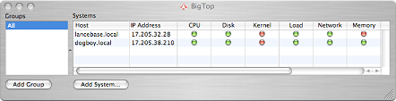
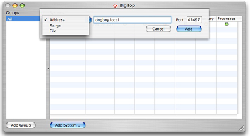
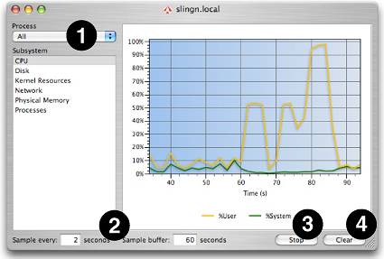

> 导航：[总目录](../../../README.md) · [documentation](../../../_indexes/documentation.md) · [Big Top User Guide](Introduction.md)

[Next](Preferences.md)[Previous](Introduction.md)

# Using BigTop

After launching BigTop for the first time you will be presented with the _Main Window_, as described in [The Main Window](#apple-f4xwc4dqnrsv64tfmyxwi33df52wszbpkridimbqga2temzufvbuqmznknlti), and a _System Window_, as described in [The System Window](#apple-f4xwc4dqnrsv64tfmyxwi33df52wszbpkridimbqga2temzufvbuqmznknltk), for the local machine. This chapter gives an overview of how you can use the controls and graphs in these two windows to examine how your system is being used. In addition, it covers some of the ways that you can customize the display to make it fit your needs.

The _Main Window_, illustrated in Figure 1-1, gives a brief overview of all monitored machines and allows you to open up _System Windows_ for any systems that you would like to investigate in more detail. Normally this window is open at all times while you are using BigTop, but if you close it then you can return it to the screen at any time by using the _Window→Network Monitor_ (_Command-1_) menu command.

__Figure 1-1__  Main Window

By default, there is only a single machine (the local system) listed in the _Systems Table_, which occupies the right part of the main window. You can add additional machines to monitor by pressing the _Add System..._ button at the bottom of the window and then using the sheet (see Figure 1-2) that appears.

__Figure 1-2__  Add System Dialog

Using the menu at the left end of the sheet, you can choose to add one or more systems to the list in three different ways:

- __Address__— You can select individual machines connected via the Internet by typing in their IP addresses into the blank, either numerically or by name. Machines on the local network should generally be connected using their short names used for Apple file sharing (such as “dogboy.local”) instead of their full Internet names (such as “dogboy.mycompany.com”), as this method will work even if the local computers have temporary IP addresses acquired via a DHCP server. You may also choose a different IP port number using the text box to the right, if the default value of 47497 is blocked by your firewall.
- __Range__— You can select an entire range of numeric IP addresses to monitor. This is an excellent way to add an entire cluster of machines at once. As with the individual address option, you may also choose a different IP port number using the text box to the right, if the default value of 47497 is blocked by your firewall.
- __File__— You can select a text file containing a list of Internet addresses (name or number), one address per line. You can enter the name of the file manually in the text box, or press the “Select” button that appears at the right end of the sheet to This is a fast and effective way of adding a common set of computers. Alternate ports may be selected using the standard Internet notation of adding `:<port number>` to the end of each address.

Any machine that is added must have the `/usr/libexec/statsCollector` daemon running, as this daemon is responsible for actually doing the underlying statistics collection and shoveling data through the network to any copies of BigTop that are listening. BigTop will automatically start this daemon when the application is started, allowing both the local copy of BigTop and any remote systems to monitor that computer. You should note, however, that on systems where you cannot run BigTop — such as headless servers — you will need to start this daemon manually. The `-p <port #>` option should be used to set the port number if the default of 47497 is blocked.

The _Systems Table_ alone is great if you just want to examine a few systems. For larger collections of computers, however, you may need more organization. The _Groups Table_, which occupies the left half of the main window, gives you a way to manage logical collections of machines on your network without continually adding and deleting those systems from the _Systems Table_. By default, BigTop shows you all of the machines being monitored (the “All” group). You can add groups to the _Groups Table_ by selecting the _Add Group_ button at the bottom of the window. Double-click on the new group in the _Groups Table_ to edit the name. After creating a group, you can add machines to it by selecting the main (“All”) list and then dragging and dropping systems from the _Systems Table_ to the group name. You can delete groups by selecting them in the _Groups Table_ and selecting _Edit→Delete_ (_Delete_).

The _Systems Table_ lists all of the monitored machines (one per row) with a summary icon for each subsystem, allowing you to get a quick overview of the status of many machines at once:

- __CPU__— This gives an indication about the % of time that the processor(s) are active.
- __Disk__— This indicates the total number of bytes read from and written to disk per second.
- __Kernel__— The gives an indication of the number of kernel-managed threads currently executing on the system.
- __Network__— This indicates the total number of bytes coming in from and going out to the active network interfaces on this computer each second.
- __Memory__— This gives an indication about the % of the main memory that has been allocated.
- __Processes__— This gives an indication of the total number of processes.

Three additional types of statistics may be displayed or hidden by selecting the _View→Show/Hide Advanced Statistics_ (_Command-Shift-M_):

- __Load__— This gives an indication of average system load (number of active, non-blocked threads) on the system.
- __Swap__— This indicates the % of available disk space that can be used for virtual memory page swapping has already been allocated.
- __VM__— This gives an indication of the number of page faults that are occurring per second on the system.

The availability of some kinds of advanced statistics depends on the version of the operating system running on the machine being monitored.

The state of each sub-system is summarized with an icon:

- Disconnected
- Low Utilization
- Medium Utilization
- High Utilization

The exact meaning of these various icons can be controlled using the “Alert Levels” editing function, as explained in [Alert Levels Editor Window](Preferences.md#apple-f4xwc4dqnrsv64tfmyxwi33df52wszbpkridimbqga2temzufvbuqnbnknlte).

Each monitored system can be examined in detail by double-clicking its row in the _Systems Table_ to bring up a Figure 1-3.

__Figure 1-3__  System Window

The system window shows a graph of the selected subsystem’s performance metrics over time. By selecting different options from the _Subsystem List_ at the left side of the window, you can choose to examine a variety of different types of system statistics, most of which correspond to summary icons in the _Main Window_:

- __CPU__— This shows the breakdown in CPU utilization between user, system, and idle time.
- __Disk__— This indicates the total number of bytes read from and written to disk per second.
- __Kernel Resources__— The shows the number of kernel-managed threads currently executing on the system.
- __Network__— This indicates the total number of bytes coming in from and going out to the active network interfaces on this computer each second.
- __Physical Memory__— This shows how the main memory is being used, showing the major types of memory breakdowns used by Mac OS X:

  - _Resident Memory_— This read-write part of main memory is allocated to single processes on a page-by-page basis, privately, and can be paged off to disk, if necessary.
  - _Shared Resident Memory_— This read-only section of main memory is allocated to multiple processes at once on a page-by-page basis, and can be paged off to disk if necessary.
  - _Private Resident Memory_— This is the size of the private, paged “resident memory” plus all private memory allocated to the OS at startup time for core kernel functions, which is never paged. Normally, this will just be a fixed offset above the _Resident Memory_ line.
  - _Idle Memory_— You can determine the amount of idle memory by subtracting the _Shared Resident Memory_ and _Private Resident Memory_ figures from the total amount of main memory in the system.
- __Processes__— This shows the total number of processes, and breaks these down into active and sleeping processes.

Four additional types of statistics may be displayed or hidden by selecting the _View→Show/Hide Advanced Statistics_ (_Command-Shift-M_):

- __Load__— This displays average system load (number of active, non-blocked threads) over the past minute, five minutes, and fifteen minutes.
- __Shared Libraries__— This displays the memory size devoted to code, data, and LinkEdit information associated with the currently loaded Mac OS X dynamically-linked shared libraries. There is no equivalent for this entry among the icons in the main window.
- __Swap__— This displays the amount of used and remaining disk space that can be used for virtual memory page swapping.
- __VM Faults__— This displays the total number of virtual memory page faults per second and breaks them down into the various kinds possible with Mac OS X:

  - _Page Ins_— The desired page was not resident in memory, and had to be brought in from disk.
  - _Page Outs_— A page had to be forced out of memory to disk in order to free up space. These faults are usually accompanied by one of another type that indicates the kind of space needed.
  - _Zero-Fill Faults_— A new page of blank, uninitialized memory was allocated.
  - _Copy-on-Write Faults_— A read-only page shared among two or more processes was written by one of the sharers, forcing the OS to make a private, read-write copy of the page for that process.
  - _Page Cache Reactivations_— The desired page was present in memory, but not listed in the system page tables. The OS just needed to add the entry back into the page tables before letting the process continue.

In addition, there are several other, more minor ways that you can choose to modify this display using the other controls scattered around the periphery of the window:

1. __Process Popup Menu__— By default, statistics are shown for the entire system. You can zero in on a specific application’s behavior by selecting it from this menu. The same set of performance metrics may not be available for both the system-wide and per-process views.
2. __Sample Rate and Buffer Size__— By default, performance data is sampled every two seconds and the last sixty seconds worth of samples are displayed. However, these two values can be changed locally with the two text boxes in the bottom-left part of the window, or globally in the preferences (see [Sampling Preferences](Preferences.md#apple-f4xwc4dqnrsv64tfmyxwi33df52wszbpkridimbqga2temzufvbuqnbnknltm)).
3. __Stop Button__— If you are done examining a system with BigTop, you can stop the `statsCollector` daemon on that system with the _Stop_ button. Note that once you press this button, you will need to restart BigTop on the system in order to restart the daemon.
4. __Clear Button__— This clears the buffer used to display data in the graph. You may want to use it after BigTop has been running for awhile.

[Next](Preferences.md)[Previous](Introduction.md)

