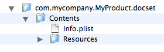

> 导航：[总目录](../../../README.md) · [documentation](../../../_indexes/documentation.md) · [Documentation Set Guide](Introduction.md)


[Next](Supporting%20API%20Lookup%20in%20Documentation%20Sets.md)[Previous](Creating%20Documentation%20Sets.md)

# Configuring Documentation Sets

A documentation set bundle contains documentation content and indexes into that content. There are two files that identify a documentation set to Xcode and describe its content:

- `Info.plist`: Specifies the general characteristics of the documentation set, including its name, provider, bundle identifier, and so forth.

  This file must be contained in a documentation set; otherwise, Xcode doesn’t recognize the bundle as a documentation set.
- `Nodes.xml`: Describes the structure and contents of the documentation set.

  This file is needed only to create the documentation set’s index. It’s not required for publication.

The following sections describe these two files and show how to use them to describe the documentation set.

Every documentation set needs to include an `Info.plist` file that identifies the documentation set.

You can create the `Info.plist` file manually, using the Property List Editor application (`<Xcode>/Applications/Utilities`), or programmatically, using the `NSDictionary` Cocoa class. This section assumes that you create the `Info.plist` file using Property List Editor.

When you launch Property List Editor, it automatically creates a file for you and populates it with a root element. You can add new child or sibling items, depending on the currently selected item. For more information, see _[Property List Programming Guide](../../Cocoa/Property%20List%20Programming%20Guide/Introduction%20to%20Property%20Lists.md#apple-f4xwc4dqnrsv64tfmyxwi33df52wszbpgeydambqga2dq2i)_.

The `Info.plist` file follows the standard OS X conventions for property list files, described in _[Runtime Configuration Guidelines](../../Mac%20OSX/Runtime%20Configuration%20Guidelines/Introduction.md#apple-f4xwc4dqnrsv64tfmyxwi33df52wszbpgeydambqge3ta2i)_.

The property list keys that are relevant to documentation sets are described in [Documentation-Set Property List Key Reference](Documentation-Set%20Property%20List%20Key%20Reference.md#apple-f4xwc4dqnrsv64tfmyxwi33df52wszbpkridimbqga2tenrwfvbuqnbnknltc). However, in order for Xcode to properly recognize your documentation set, Apple recommends that you provide values for all the following keys in your `Info.plist` file, even those marked optional:

- __DocSetPublisherName.__ The publisher name specifies the name of the publisher to which the documentation set belongs. It provides an umbrella under which multiple documentation sets from a single publisher can be grouped. In Xcode's Documentation Preferences pane, documentation sets are grouped under the publisher name, as provided by this key. This key is optional.
- __DocSetPublisherIdentifier.__ Specifies the unique identifier for the publisher. All documentation sets that have the same publisher identifier are grouped under the same publisher name, even if the documentation sets are provided by different feeds. The identifier should be a reverse domain-name style string. For example, `com.mycompany.documentation`. This key is optional.
- __CFBundleName.__ Specifies the name of the documentation set, as it appears under the publisher name in Documentation preferences.
- __CFBundleIdentifier.__ A string that uniquely identifies the documentation set bundle. This should be a reverse domain-name style string. For example, `com.mycompany.MyDocSet`.

  Xcode uses this identifier to match an installed documentation set bundle to an entry in the Atom feed specified by the [DocSetFeedURL](Documentation-Set%20Property%20List%20Key%20Reference.md#apple-f4xwc4dqnrsv64tfmyxwi33df52wszbpkridimbqga2tenrwfvbuqnbnknlte) key. This value is assumed to be unique. As it searches for documentation sets on a user’s file system, Xcode loads only sets with identifiers it hasn’t loaded before. Therefore, if there are more than one documentation set with the same bundle identifier on a user’s file system, only one of them (Either the one with the greatest version number or the first one found) is loaded.

A minimal `Info.plist` file might look like that shown in Listing 3-1; you can get output like this by saving the file as an XML plist and then opening it in a text editor.

__Listing 3-1__  A minimal `Info.plist` file

```xml
<?xml version="1.0" encoding="UTF-8"?>
<!DOCTYPE plist PUBLIC "-//Apple Computer//DTD PLIST 1.0//EN" "http://www.apple.com/DTDs/PropertyList-1.0.dtd">
<plist version="1.0">
<dict>
     <key>CFBundleName</key>
     <string>My Product Documentation</string>
     <key>CFBundleIdentifier</key>
     <string>com.mycompany.MyProduct.docset</string>
     <key>DocSetPublisherIdentifier</key>
     <string>com.mycompany.documentation</string>
     <key>DocSetPublisherName</key>
     <string>My Company</string>
</dict>
</plist>
```

When you are done creating the `Info.plist` file, place it in the documentation set bundle directly inside the `Contents` directory, as shown in Figure 3-1.

__Figure 3-1__  Placement of the `Info.plist` file



To generate the necessary index files for your documentation set using the `docsetutil` tool, you must include a single nodes file (`Nodes.xml`). The _nodes file_ describes the hierarchical structure of the documentation set.

The structure of a documentation set consists of one or more documentation nodes, each represented by a `Node` element. This section describes documentation nodes and shows how to construct a node definition. It then goes on to describe how to build a table of contents from one or more nodes. Finally, this section shows how to create a library of node definitions, independent of the structure of the table of contents, and reference those nodes.

A _documentation node_ represents a single entry in the document hierarchy of the documentation set. A documentation node may contain a list of other documentation nodes, or subnodes. These lists of subnodes recursively define the structure of the documentation set.

A documentation node corresponds to a documentation file or a folder of files within the documentation set. Each documentation node is associated with a location that identifies the file to display when the user selects that node in the Documentation window [Documentation Set Development Workflow](Documentation%20Sets.md#apple-f4xwc4dqnrsv64tfmyxwi33df52wszbpkridimbqga2tenrwfvbuqmjtfvjvomi).

A single documentation node is represented by the `Node` element. The key information provided by the `Node` element includes:

- The name of the documentation node.
- The type of the documentation node. If you do not explicitly specify the type of the node, Xcode assumes a default value.
- The location of the file or files that the node represents. The location tells Xcode what file to load when the user selects the documentation node and tells `docsetutil` which files to index.

The `Node` element also lists the documentation node’s subnodes, if any. In addition, if you want to reference the node from elsewhere in the documentation set, you can assign a unique identifier to that node. The following sections show how to define a node element and specify its name, type, and location.

Every documentation node must have a name, which is used to display the node in the path shown in the status field at the bottom of the Documentation window. To specify the name of a documentation node, use the `Name` element, as shown in Listing 3-2. The `Name` element is required.

__Listing 3-2__  Assigning a name to a node

```
<Node>
   <Name>A Documentation Node</Name>
</Node>
```


The type of the node tells Xcode and the indexing tool whether the node represents a single file or a folder of files.

There are three types of documentation nodes:

- _File nodes_ represent a single file in the documentation set.
- _Folder nodes_ represent a folder or folder hierarchy of documentation files.
- _Bundle nodes_ represent a bundle-style folder hierarchy following the conventions of the `CFBundle` opaque type, described in _[Bundle Programming Guide](../../Core%20Foundation/Bundle%20Programming%20Guide/Introduction.md#apple-f4xwc4dqnrsv64tfmyxwi33df52wszbpgeydambqgezdg2i)_. In this folder hierarchy, documentation content may be localized into multiple languages.

The type of a node determines how the node location is interpreted and how the documentation files at that location are indexed for full-text search by the `docsetutil` tool.

You specify the type of a documentation node using the `type` attribute of the `Node` element. For example, Listing 3-3 shows how you might specify the type of a node representing a folder of files that comprise a single document in a documentation set.

__Listing 3-3__  Specifying the type of a node

```
<Node type="folder">
   <Name>My Document</Name>
</Node>
```

The `type` attribute is optional. If you do not specify the type of a node, it is assumed to be a file node.

As mentioned earlier, after you have defined a documentation node, you can reference that node from other locations in your `Nodes.xml` file or, if you choose to support API lookup, from a token definition in the tokens file, as described in [Supporting API Lookup in Documentation Sets](Supporting%20API%20Lookup%20in%20Documentation%20Sets.md#apple-f4xwc4dqnrsv64tfmyxwi33df52wszbpkridimbqga2tenrwfvbuqmjsfvjvomi).

If you want to reference a given documentation node, however, you must assign that node a unique identifier. You assign an ID to a node using the `id` attribute of the `Node` element. The value assigned to this attribute can be any 32-bit integer value; however, it must be unique within the `Nodes.xml` file.

```
<Node id="5">
   <Name>A Documentation Node</Name>
</Node>
```


One of the most important pieces of information associated with a documentation node is the location of the documentation represented by that node. A documentation node’s location tells Xcode and `docsetutil`:

- What page to load and display when the user selects the node from a list of search results
- Which file or files to index and include when performing full-text searches

The location of a documentation node consists of several parts, each of which is represented by its own element inside the `Node` element. The parts of a node’s location are:

- `URL`: The _base URL_ of the node. Use this element to specify an alternate location for nodes whose documentation files reside on the web, instead of in the installed documentation set bundle or the documentation set’s _fallback web location_ (see [Downloading and Indexing Web Content](Indexing%20Documentation%20Sets.md#apple-f4xwc4dqnrsv64tfmyxwi33df52wszbpkridimbqga2tenrwfvbuqnznknltg)).

  You do not need to explicitly specify a URL. If you do not, the base URL for the node is assumed to be the `Documents` directory of the documentation set bundle.
- `Path`: The _path_ to the page to display when the user selects the node or to the folder containing that page. This path is interpreted relative to the node’s base URL.

  For bundle nodes, the path identifies the bundle folder.
- `File`: The _filename_ of the file to display when the user selects the node. Xcode and `docsetutil` look for this file at the location specified by the node’s base URL and path, if any.

  For bundle nodes, Xcode resolves this filename against the localizations available in the bundle associated with the node.
- `Anchor`: An optional _anchor_ within the specified HTML file. When loading the node’s landing page, Xcode scrolls to the location of this anchor.

When the user selects a node in the Xcode Documentation window, Xcode looks up the node and attempts to locate the file specified by that node. For file and folder nodes, Xcode attempts to load the page at `<url>/<path>/<filename>`. If no URL is explicitly specified, Xcode uses the default base URL—the Documents folder of the current documentation set. Either `<path>` or `<file>` or both may be empty, indicating that no `Path` or `File` element, respectively, exists for the node.

For bundle nodes, Xcode looks for the bundle at `<url>/<path>`. To find the file to load, it resolves the contents of the `File` element against the locations available within that bundle. For more information, see [Internationalizing Individual Documents](Internationalizing%20Documentation%20Sets.md#apple-f4xwc4dqnrsv64tfmyxwi33df52wszbpkridimbqga2tenrwfvbuqnrnknltc).

In addition to specifying the node landing page, the node location also specifies which file or files the `docsetutil` indexing tool indexes for full-text searches. The `docsetutil` tool interprets the node location differently, based on the type of the node:

- For file nodes, `docsetutil` indexes only the single file to which the node points—the node landing page.
- For folder nodes, `docsetutil` recursively searches for and indexes all HTML files within the folder pointed to by the node. The `docsetutil` tool assumes that this folder is at `<url>/<path>`. Again, if no base URL is explicitly specified, `docsetutil` uses the default value. If no path is specified, `<path>` is empty.
- For bundle nodes, `docsetutil` identifies all localized versions of the node’s landing page inside the bundle at `<url>/<path>`. It indexes each directory of localized content inside this bundle.

To illustrate some of the ways in which you might describe a node’s location, imagine a fictional documentation set with the following contents:

__Listing 3-4__  Structure of a fictional documentation set

```
com.mycompany.MyProduct.docset
   Contents
      Resources
        Documents
          MyApplication
            index.html ```  ``` 
            Tutorial ```  ``` 
            ReleaseNotes.html ```  ``` 
            UserGuide ```  ``` 
              Contents
                 Resources
                   en.lproj
                   ja.lproj
            QuickReference.pdf          // Remote node ```  ``` 
```

This documentation set contains four documents, each of which must be represented by a documentation node. These nodes are:

- `Tutorial` is a folder node. This directory contains the HTML files for a single document.
- `ReleaseNotes.html` is a file node.
- `UserGuide` is a bundle node.
- `QuickReference.pdf` is a node whose file resides on the web.

Listing 3-5 shows how you might describe the node representing the content in the `Tutorial` directory.

__Listing 3-5__  A folder node

```
<Node id="3" type="folder">
    <Name>Tutorial</Name>
    <Path>MyApplication/Tutorial</Path>
    <File>index.html</File>
</Node>
```

This node uses the `Path` element to specify the path to the folder containing the document’s files. As no URL is specified, this path is interpreted relative to the documentation set’s `Documents` directory. The `File` element indicates that the landing page for the documentation node—that is, the page that Xcode loads when the user selects this node—is a file named `index.html` inside the `Tutorial` directory. When `docsetutil` runs, this file and all other HTML files inside of the `Tutorial` directory are indexed for full-text search.

The user guide in the example documentation set is localized. You can represent this in the `Nodes.xml` file by creating a bundle node. The `Node` element describing the user guide might look something like that shown in Listing 3-6.

__Listing 3-6__  A bundle node

```
<Node id="2" type="bundle">
    <Name>User Guide</Name>
    <Path>MyApplication/UserGuide</Path>
    <File>index.html</File>
</Node>
```

In this case, the `Path` element specifies only the path to the directory that contains the localized bundle structure; that is, it contains the path to the `UserGuide` directory. This directory’s hierarchy must follow the `CFBundle` opaque type conventions described in _[Bundle Programming Guide](../../Core%20Foundation/Bundle%20Programming%20Guide/Introduction.md#apple-f4xwc4dqnrsv64tfmyxwi33df52wszbpgeydambqgezdg2i)_.

The `File` element specifies the landing page to load, `index.html`. However, when the user accesses the documentation node that represents the user guide document, the actual file that Xcode displays depends on the user’s language preferences. If, for example, the user’s primary language is Japanese, Xcode looks for a file named `index.html` inside the `ja.lproj` directory.

The next node represents a single document, the `ReleaseNotes.html` file shown in [Listing 3-4](#apple-f4xwc4dqnrsv64tfmyxwi33df52wszbpkridimbqga2tenrwfvbuqmjrfvjvooa). One way to describe this node is shown in Listing 3-7.

__Listing 3-7__  A file node

```
<Node id="4">
    <Name>Release Notes</Name>
    <Path>MyApplication</Path>
    <File>ReleaseNotes.html</File>
</Node>
```

Because the type of the node is not explicitly declared, it is assumed to be a file node. This means that only the file at `MyApplication/ReleaseNotes.html`, as specified by the `Path` and `File` elements, is indexed. Alternatively, you can simply use the `Path` element to specify the entire path to the file, as shown in Listing 3-8.

__Listing 3-8__  Another way to describe a file node

```
<Node id="4">
    <Name>Release Notes</Name>
    <Path>MyApplication/ReleaseNotes.html</Path>
</Node>
```

Documentation sets can include nodes whose files reside outside the installed documentation set bundle. This allows you to install a smaller subset of files onto the user’s file system and still be able to access the other files.

As mentioned earlier, the `QuickReference.pdf` file in [Listing 3-4](#apple-f4xwc4dqnrsv64tfmyxwi33df52wszbpkridimbqga2tenrwfvbuqmjrfvjvooa) is not actually present in the installed documentation set bundle on the user’s file system but exists on the company’s website. A node representing this file would look similar to that shown in Listing 3-9.

__Listing 3-9__  A node with web-based content

```
<Node id="6">
    <Name>My Application Quick Reference</Name>
    <URL>http://mycompany.com/Documentation/pdfs/QuickReference.pdf</URL>
</Node>
```

Here, the `URL` element specifies an alternate path for a PDF file that lives on the company’s website.

Every node can have a list of _subnodes_, which are nodes that appear beneath the current node in the document hierarchy. For example, the fictional documentation set introduced in [Specifying the Location of a Documentation Node](#apple-f4xwc4dqnrsv64tfmyxwi33df52wszbpkridimbqga2tenrwfvbuqmjrfvjvomy) has four documents that describe the same application. Each of those documents is represented by a node. Assuming that they are grouped together, those nodes are subnodes of the node representing the application.

Use the `Subnodes` element to specify a node’s list of subnodes. The `Subnodes` element contains one or more nodes, represented by a `Node` (or `NodeRef`) element. Listing 3-10 shows how the node representing the entry for My Application might appear; all the documents in this category appear as subnodes of that node.

__Listing 3-10__  Specifying subnodes

```
<Node> ```  ``` 
   <Name>My Application</Name> ```  ``` 
   <Path>MyApplication</Path> ```  ``` 
   <File>index.html</File> ```  ``` 
   <Subnodes> ```  ``` 
      <Node id="2" type="bundle">
         <Name>User Guide</Name>
         <Path>MyApplication/UserGuide</Path>
         <File>index.html</File>
      </Node>
      <Node id="4">
         <Name>Release Notes</Name>
         <Path>MyApplication/ReleaseNotes.html</Path>
      </Node>
      <Node id="3" type="folder">
         <Name>Tutorial</Name>
         <Path>MyApplication/Tutorial</Path>
         <File>index.html</File>
      </Node>
      <Node id="6">
         <Name>My Application Quick Reference</Name>
         <URL>http://mycompany.com/Documentation/pdfs/QuickReference.pdf</URL>
      </Node>
   </Subnodes> ```  ``` 
</Node> ```  ``` 
```

Each of the documentation nodes in the `Subnodes` element can itself contain a list of subnodes.

Previous sections show how to construct a documentation node using the `Node` element; this section describes how to turn a node definition into a table of contents. Although the Documentation window in Xcode 3.2 does not provide a browser view that displays a table of contents, it is a requirement that the `Nodes.xml` file contains a `TOC` element.

The primary purpose of the `Nodes.xml` file is to define the structure of the documentation set. The structure defines the path Xcode shows for the content that’s currently displayed in the Documentation window.

The `TOC` element contains a single `Node` element—that is, a single documentation node—which represents the root node of the documentation set. The root node represents the topmost entry for the documentation set. It identifies the landing page of the entire documentation set.

The root node contains a list of its subnodes. As you saw in [Specifying Subnodes](#apple-f4xwc4dqnrsv64tfmyxwi33df52wszbpkridimbqga2tenrwfvbuqmjrfvjvomjt), each of these subnodes can have its own list of subnodes. In this way, you can recursively define the documentation set’s structure. Listing 3-11 shows how the TOC structure for the fictional documentation set introduced in [Specifying the Location of a Documentation Node](#apple-f4xwc4dqnrsv64tfmyxwi33df52wszbpkridimbqga2tenrwfvbuqmjrfvjvomy) might look.

__Listing 3-11__  Building the TOC structure

```
<TOC>
   <Node>                                  <!-- Root node -->
      <Name>My Documentation Set</Name>
      <File>index.html</File>
      <Subnodes>
         <Node>
            <Name>My Application</Name>
            <Path>MyApplication</Path>
            <File>index.html</File>
            <Subnodes>
               <Node id="2" type="bundle">
                  <Name>User Guide</Name>
                  <Path>MyApplication/UserGuide</Path>
                  <File>index.html</File>
               </Node>
               ...
               <!--Remaining node definitions here--!>
               ...
            </Subnodes>
         </Node>
      </Subnodes>
    </Node>
</TOC>
```


After you define a documentation node in the `Nodes.xml` file, you can reference that node. You can use a node reference to:

- Make a single node or document appear multiple times in the documentation set’s document hierarchy. Apple uses this feature to assign a document to multiple locations within the Reference Library.
- Easily import nodes into the TOC. As described in [Creating a Library of Node Definitions](#apple-f4xwc4dqnrsv64tfmyxwi33df52wszbpkridimbqga2tenrwfvbuqmjrfvjvomjy), you can create a collection of node definitions, independent of the TOC. You can do the work of defining a documentation node once and simply link to it when constructing the document hierarchy later. This makes it easy to make changes to the structure.
- Associate documentation nodes with symbols in the `Tokens.xml` file.

A node reference is represented by a `NodeRef` element. This element has a single required attribute, `refid`, which is the unique identifier assigned to the referenced node. Thus, to reference a documentation node, you must have already assigned a value to the `id` attribute of the `Node` element representing that node’s defining instance. [Listing 3-12](#apple-f4xwc4dqnrsv64tfmyxwi33df52wszbpkridimbqga2tenrwfvbuqmjrfvjvomjx) shows an example of a `NodeRef` definition.

In addition to the required `TOC` element, the `Nodes.xml` file can contain a collection, or library, of node definitions that exist independently of the document hierarchy. Having a separate library of documentation nodes makes it easy to make changes to your documentation set’s TOC. Particularly for large documentation sets, it is often easier to define documentation nodes in the the library section of the `Nodes.xml` file, and then quickly construct or alter the structure in the `TOC` element by referencing the nodes you’ve already defined.

Use the `Library` element to create a _node definition library_. The `Library` element appears after the `TOC` element in the `Nodes.xml` file and contains one or more `Node` elements. For example, you can rewrite the `Nodes.xml` file for the documentation set introduced in [Specifying the Location of a Documentation Node](#apple-f4xwc4dqnrsv64tfmyxwi33df52wszbpkridimbqga2tenrwfvbuqmjrfvjvomy) so that the nodes representing the set’s documents are defined in the library, and the TOC simply references those nodes. Listing 3-12 illustrates this configuration.

__Listing 3-12__  Creating a library of nodes

```
<TOC>
  <Node>
    <Name>My Documentation Set</Name>
    <File>index.html</File>
    <Subnodes>
      <Node>
        <Name>My Application</Name>
        <Path>MyApplication</Path>
        <File>index.html</File>
        <Subnodes>
          <NodeRef refid="2"/>
          <NodeRef refid="4"/> <!-- instead of defining node here, simply reference library definition --> ```  ``` 
          <NodeRef refid="3"/>
          <NodeRef refid="6"/>
        </Subnodes>
      </Node>
    </Subnodes>
  </Node>
</TOC>
<Library> ```  ``` 
  <Node id="2" type="bundle">
    <Name>User Guide</Name>
    <Path>MyApplication/UserGuide</Path>
    <File>index.html</File>
  </Node>
  <Node id="4"> <!-- Definition of referenced node --> ```  ``` 
    <Name>Release Notes</Name> ```  ``` 
    <Path>MyApplication/ReleaseNotes.html</Path> ```  ``` 
  </Node> ```  ``` 
  <Node id="3" type="folder">
    <Name>Tutorial</Name>
    <Path>MyApplication/Tutorial</Path>
    <File>index.html</File>
  </Node>
  <Node id="6">
    <Name>My Application Quick Reference</Name>
    <URL>http://mycompany.com/Documentation/pdfs/QuickReference.pdf</URL>
  </Node>
</Library> ```  ``` 
```


A documentation set must contain a `Nodes.xml` file with at least one node, the root node. The root node identifies the landing page of the entire documentation set. Listing 3-13 shows an example of such a file.

__Listing 3-13__  A minimal `Nodes.xml` file

```xml
<?xml version="1.0" encoding="UTF-8"?>
<DocSetNodes version="1.0">     <!-- Root element --> ```  ``` 
    <TOC>
        <Node type="folder">    <!-- Root node --> ```  ``` 
            <Name>Root</Name>
            <Path>index.html</Path>
        </Node>
    </TOC>
</DocSetNodes>
```

A `Nodes.xml` file such as that shown in Listing 3-13 is sufficient, along with a minimal `Info.plist` file like that shown in [Listing 3-1](#apple-f4xwc4dqnrsv64tfmyxwi33df52wszbpkridimbqga2tenrwfvbuqmjrfvjvomru) and a full set of documentation files, to build a documentation set that can be loaded by the Documentation window and that supports full-text search of its HTML-based documentation.

The root element of the `Nodes.xml` file is the `DocSetNodes` element. This element in turn contains a single `TOC` element, which describes the structure of the documentation set. The `TOC` element must have a single `Node` (or `NodeRef`) element as its child. This element defines the topmost entry of the documentation set.

Expanding on the documentation set example shown in [Listing 3-4](#apple-f4xwc4dqnrsv64tfmyxwi33df52wszbpkridimbqga2tenrwfvbuqmjrfvjvooa), imagine that that documentation set also includes documentation for an accompanying framework that exports an API for interfacing with your company’s application. Listing 3-14 shows these documents and their accompanying HTML files.

__Listing 3-14__  An expanded documentation set

```
com.mycompany.MyProduct.docset
   Contents
      Resources
        Documents
          index.html
          MyApplication
            ...
          MyFramework ```  ``` 
            index.html ```  ``` 
            Reference ```  ``` 
            Overview ```  ``` 
```

In addition to the nodes for the `MyApplication` entry and its accompanying documents, described in [Specifying the Location of a Documentation Node](#apple-f4xwc4dqnrsv64tfmyxwi33df52wszbpkridimbqga2tenrwfvbuqmjrfvjvomy) and [Specifying Subnodes](#apple-f4xwc4dqnrsv64tfmyxwi33df52wszbpkridimbqga2tenrwfvbuqmjrfvjvomjt), the `Nodes.xml` file must include the following nodes:

- __My Documentation Set:__ The root node of the documentation set.
- __My Framework:__ Umbrella group for documents targeted at readers using the corresponding framework to interface with the application. It is also a file node which corresponds to a single HTML file.
- __Overview:__ File node that corresponds to a single HTML file.
- __Reference:__ Folder node that corresponds to a folder of HTML files that comprise a single document.

Listing 3-15 shows how the entire `Nodes.xml` file for the expanded documentation set might look.

__Listing 3-15__  An expanded `Nodes.xml` file

```xml
<?xml version="1.0" encoding="UTF-8"?>
<DocSetNodes version="1.0">
    <TOC>
      <Node>
        <Name>My Documentation Set</Name>
        <File>index.html</File>
        <Subnodes>
          <Node>
            <Name>My Application</Name>
            <Path>MyApplication</Path>
            <File>index.html</File>
            <Subnodes>
              <Node id="2" type="bundle">
                <Name>User Guide</Name>
                <Path>MyApplication/UserGuide</Path>
                <File>index.html</File>
              </Node>
              <Node id="4">
                <Name>Release Notes</Name>
                <Path>MyApplication/ReleaseNotes.html</Path>
              </Node>
              <NodeRef refid="3"/>
              <NodeRef refid="6"/>
            </Subnodes>
          </Node>
          <Node>
            <Name>My Framework</Name>
            <Path>MyFramework</Path>
            <File>index.html</File>
            <Subnodes>
              <NodeRef refid="7"/>
              <NodeRef refid="5"/>
            </Subnodes>
          </Node>
        </Subnodes>
    </Node>
  </TOC>
  <Library>
    <Node id="3" type="folder">
      <Name>Tutorial</Name>
      <Path>MyApplication/Tutorial</Path>
      <File>index.html</File>
    </Node>
    <Node id="6">
      <Name>My Application Quick Reference</Name>
      <URL>http://mycompany.com/Documentation/pdfs/QuickReference.pdf</URL>
    </Node>
    <Node id="5" type="folder">
      <Name>Reference</Name>
      <Path>MyFramework/Reference</Path>
      <File>index.html</File>
    </Node>
    <Node id="7" type="file">
      <Name>Overview</Name>
      <Path>MyFramework/Overview</Path>
      <File>index.html</File>
    </Node>
  </Library>
</DocSetNodes>
```

The `TOC` element, contains the root node representing the documentation set. This root node has two subnodes, representing the entries for `My Application` and `My Framework`. Each of these two nodes in turn have their own lists of subnodes, which represent the documents in those categories.

In this case, the nodes representing the _Tutorial_, _Quick Reference_, and both of the framework-related documents are defined in the `Library` element and simply imported into the TOC using node references (represented by the `NodeRef` element). This makes it easy for the documentation provider to rearrange the structure of the documentation set without having to move or modify the canonical definition of these nodes.

[Next](Supporting%20API%20Lookup%20in%20Documentation%20Sets.md)[Previous](Creating%20Documentation%20Sets.md)

