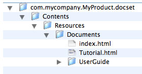

> 导航：[总目录](../../../README.md) · [documentation](../../../_indexes/documentation.md) · [Documentation Set Guide](Introduction.md)

[Next](Configuring%20Documentation%20Sets.md)[Previous](Documentation%20Sets.md)

# Creating Documentation Sets

A documentation set is a standard OS X bundle that packages a set of HTML (or PDF) documentation files, along with the information needed to access and display that documentation in the Xcode Documentation window. This chapter describes the directory hierarchy, naming conventions, and file-system locations of a documentation set bundle.

The first step in creating a documentation set is to create and populate the folder hierarchy of the documentation set bundle. The documentation set structure that you create should look similar to that shown in Figure 2-1.

__Figure 2-1__  Creating the bundle hierarchy

You must place all of a documentation set’s documentation files inside the `Resources/Documents` directory.

Within the `Documents` directory, you can use any arbitrary hierarchy to organize your documentation files. In this example (see Figure 2-2), the documentation set contains a `Tutorial.html` file and a directory of additional documentation files, `UserGuide`.

__Figure 2-2__  Organizing documentation files

Xcode and `docsetutil` indexing tool support both HTML and PDF documentation files. Your documentation set can contain files in either format.

The `Documents` directory, like any other bundle resource, can be localized. For the structure of a localized documentation set bundle, see [Internationalizing a Documentation Set Bundle](Internationalizing%20Documentation%20Sets.md#apple-f4xwc4dqnrsv64tfmyxwi33df52wszbpkridimbqga2tenrwfvbuqnrnknltm).

Because documentation sets are installed in standard locations, documentation set bundle names should be chosen to minimize the chance of conflicts. You should choose a name for each documentation set that conforms to the uniform type identifier (UTI)–style used for the `CFBundleIdentifier` property, as described in Property List Key Reference.

Documentation set bundle names must include the `docset` extension. So, for example, a documentation set bundle name would look like this:

`com.mycompany.MyDocSet.docset`

Note that the bundle name is separate from the displayed name, which is controlled by the `CFBundleName` property of the `Info.plist`.

When it first displays the Documentation window, Xcode scans for all installed documentation sets. It searches for these documentation sets in the following locations, listed in the order in which they are searched:

1. `<Xcode>/Documentation/DocSets`.

   In Xcode 3.0 through Xcode 4.2.1, users can install multiple versions of Xcode on a single computer. Xcode always searches for documentation sets within the `<Xcode>` directory in which the active Xcode binary resides. For example, if the user has installed Xcode 3.0 at `/Xcode 3.0`, Xcode searches for documentation sets at `/Xcode 3.0/Documentation/DocSets`. (The default location for Xcode is `/Developer`.)
2. `Applications/Xcode.app/Contents/Developer/Documentation/DocSets`.

   In Xcode 4.3 and later, Xcode has been repackaged as a single app bundle, eliminating the need for the `/Developer` directory. This location contains documentation sets packaged with the app.
3. `~/Library/Developer/Shared/Documentation/DocSets`. This location contains documentation sets specific to the user that is currently logged in to the system.
4. `/Library/Developer/Shared/Documentation/DocSets`. This location contains documentation sets viewable by all users of the current system.
5. `/Network/Library/Developer/Shared/Documentation/DocSets`. This location contains documentation sets used by a group of people on the same network.
6. `/System/Library/Developer/Shared/Documentation/DocSets`. You should not install files in the system domain.

If the same documentation set appears in more than one location, Xcode uses the most recent version. It they have the same version, then Xcode uses the first instance that it finds.

You should install your documentation set in the same file system domain as the software product that it documents. For example, if your product is installed in the local domain—say, at `/Applications/MyProduct`—your documentation set should be installed at `/Library/Developer/Shared/Documentation/DocSets`.

In some cases, you may want to install your documentation set in a location other than the standard documentation set locations. You can make sure that Xcode finds and accesses your documentation set by creating a symbolic link (symlink) to your documentation set and placing that symlink in one of the standard documentation locations.

After the initial installation, users can move any documentation set—with the exception of the Developer Tools documentation set provided by Apple—to any of the standard locations.

[Next](Configuring%20Documentation%20Sets.md)[Previous](Documentation%20Sets.md)

