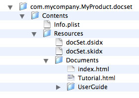

> 导航：[总目录](../../../README.md) · [documentation](../../../_indexes/documentation.md) · [Documentation Set Guide](Introduction.md)

[Next](Creating%20Documentation%20Sets.md)[Previous](Introduction.md)

# Documentation Sets

The Xcode IDE includes a full-featured documentation viewer that lets you view the installed developer documentation. The Documentation window of Xcode, available starting in Xcode 1.0, provides integrated searching and viewing of Apple’s developer documentation. Xcode also provides Quick Help, which is a lightweight window for displaying reference documentation within Xcode’s text editor.

Starting with Xcode 3.0, you can integrate documentation for your own products into the Xcode Documentation window, by packaging your documentation as a documentation set. Users can take advantage of all the Xcode documentation-viewing features to search for and look at information in your documents.

This chapter describes the documentation-set bundle and provides an overview of how to construct a documentation set. For a description of how documentation sets appear to the user and how users get them, see [Documentation Access](https://developer.apple.com/library/archive/documentation/DeveloperTools/Conceptual/XcodeWorkspace/200-Documentation_Access/documentation_access.html#//apple_ref/doc/uid/TP40006920-CH260) in _[Xcode Workspace Guide](../Xcode%20Workspace%20Guide/Introduction.md#apple-f4xwc4dqnrsv64tfmyxwi33df52wszbpkridimbqga3dsmrq)_.

A _documentation set_ is a standard OS X bundle. The structure of a documentation set follows the conventions described in _[Bundle Programming Guide](../../Core%20Foundation/Bundle%20Programming%20Guide/Introduction.md#apple-f4xwc4dqnrsv64tfmyxwi33df52wszbpgeydambqgezdg2i)_. Therefore, a documentation set’s content, including documentation files, can be localized.

The basic structure of an installed documentation set bundle is similar to that shown in Figure 1-1.

__Figure 1-1__  The structure of an installed documentation set bundle

The documentation set bundle contains the following (for the structure of a localized documentation set bundle, see [Internationalizing Documentation Sets](Internationalizing%20Documentation%20Sets.md#apple-f4xwc4dqnrsv64tfmyxwi33df52wszbpkridimbqga2tenrwfvbuqnrnknlto)):

- An information property list (`Info.plist`) file. This file describes the documentation set bundle. Xcode uses this file to:

  - Display the publisher name in documentation preferences
  - Display the documentation set name in the documentation set list in Documentation preferences
  - Display information about the availability of updates to the documentation set and optionally download and install those updates
- HTML documentation files. These must be placed inside the `Documents` directory.
- Generated index files. The `docSet.dsidx` and `docSet.skidx` files are binary files that describe the symbols and documents in the documentation set. Xcode uses the information in these files to:

  - Display the documentation set’s contents in the Documentation window
  - Carry out full-text searches of the HTML documentation files
  - Associate symbol names with locations in the HTML documentation
  - Provide symbol information that is displayed in the Quick Help window

To generate the index files, you must also include several XML metadata files in your documentation set bundle. These files, which describe the contents of the documentation set, are:

- A `Nodes.xml` file. This file describes the structure of the documentation set. This file is required.
- One or more `Tokens.xml` files. These files (known as _tokens files_) associate symbol names with locations in the documentation and are used to create the symbol index for a documentation set. Although optional, you must include a tokens file to support fast API lookup.

These metadata files must reside within the documentation set bundle when you index the documentation set, but can then be removed.

The basic steps for creating a documentation set are:

1. Organize documentation files into the bundle structure.

   The first step to building a documentation set is to create the directory hierarchy of the documentation set bundle and populate it with your HTML documentation files.
2. Describe the documentation set and its structure.

   The next step in building a documentation set is to create an `Info.plist` file and `Nodes.xml` file for the documentation set. The `Info.plist` file describes the overall characteristics of the documentation set, such as its name and version number. The `Nodes.xml` file describes the structure of the documentation set.
3. Support API lookup.

   If you wish to support API lookup for your documentation set, you must also include one or more `Tokens.xml` files.
4. Localize the documentation set.

   If you provide documentation in more than one language, you can localize all or part of the documentation set bundle. This step is optional.
5. Index the documentation set.

   The `docsetutil` tool generates the full-text (`docSet.skidx`) and API (`docSet.dsidx`) indexes that Xcode uses to access your documentation.
6. Provide an RSS or Atom feed.

   You can take advantage of automatic documentation updates in Xcode by providing an RSS or Atom feed that publishes updated versions of your documentation set. This step is optional.
7. Test, package, and distribute the documentation set.

   When your documentation set is complete, you can test it in Xcode simply by placing it in one of the standard documentation locations. You can also use the `docsetutil` tool to test the generated index files. After you have made sure that the documentation set and its indexes are complete and correct, you can use `docsetutil` to package the documentation set bundle as an XAR archive for distribution. The `docsetutil` tool can also generate or update the Atom feed that advertises your documentation set to Xcode users.

[Next](Creating%20Documentation%20Sets.md)[Previous](Introduction.md)

