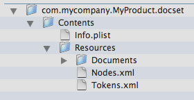

> 导航：[总目录](../../../README.md) · [documentation](../../../_indexes/documentation.md) · [Documentation Set Guide](Introduction.md)

[Next](Internationalizing%20Documentation%20Sets.md)[Previous](Supporting%20API%20Lookup%20in%20Documentation%20Sets.md)

# Indexing Documentation Sets

To make the contents of your documentation set accessible and searchable in Xcode, you must index the documentation set using the `docsetutil` command-line tool. You can find the `docsetutil` tool in the Xcode directory at `<Xcode>/usr/bin` by default. This chapter describes the `docsetutil` tool and how to use it to generate indexes.

The `docsetutil` tool takes the information that you have provided about the structure and symbols in your documentation set and creates index files. These indexes are used by Xcode to search and access your documentation.

The `docsetutil` tool expects to find a `Nodes.xml` file and, if you support API lookup for your documentation set, one or more `Tokens.xml` files. Before you can index your documentation set, you must place these files inside the documentation set bundle. Figure 5-1 shows the structure of a typical documentation set bundle before running the indexing tool.

__Figure 5-1__  A documentation set bundle before indexing

To create full-text and API indexes for a self-contained documentation set, run the `docsetutil` tool from the command line, using a command such as the following:

`<Xcode>/usr/bin/docsetutil index com.mycompany.MyProduct.docset`

The `docsetutil` tool loads the `Nodes.xml` and `Tokens.xml` XML metadata files and generates a full-text index (`docSet.skidx`) and an API and document data store (`docSet.dsidx`). It places the generated index files in the Resources folder of the documentation set bundle.

The `docsetutil` tool provides several options, which let you specify a localization for indexing, an alternate location for remote content, and so forth. For the full list of indexing options, see [docsetutil Reference](docsetutil%20Reference.md#apple-f4xwc4dqnrsv64tfmyxwi33df52wszbpkridimbqga2tenrwfvbuqmjvfvjvomi).

If you have documentation set content located on the web, you must also index that content. The `docsetutil` tool provides options to help you index web content.

If you have specified a fallback web location for the entire documentation set bundle, using the `DocSetFallbackURL` property, you must index a local copy of the web content. Use the `-fallback` option to specify the location of the local copy of the web content. For example, the following command creates full-text and API indexes for a documentation set whose content resides in the documentation set bundle as well as on the web. The `CopyOfPublicWebsite` directory must correspond to the location indicated by the `DocSetFallbackURL` property in the documentation set’s `Info.plist` file.

`<Xcode>/usr/bin/docsetutil index com.mycompany.MyProduct.docset -fallback /Documents/CopyOfPublicWebsite`

If `docsetutil` doesn’t find the documentation for a node in the documentation set bundle, it looks in the location specified using the `-fallback` option. For more on specifying an alternate web location using the `DocSetFallbackURL` property, see [DocSetFallbackURL](Documentation-Set%20Property%20List%20Key%20Reference.md#apple-f4xwc4dqnrsv64tfmyxwi33df52wszbpkridimbqga2tenrwfvbuqnbnknltg).

If your documentation set contains individual nodes that specify an Internet address as the location of their landing page, use the `-download` option to have `docsetutil` download and index those landing pages. For example, the following command generates indexes for a documentation set, downloading any web-based nodes:

`<Xcode>/usr/bin/docsetutil index -download com.mycompany.MyProduct.docset`

For any node in the nodes file that specifies a web address using the `URL` element, `docsetutil` downloads the node’s landing page and includes it in the index. The `docsetutil` tool downloads only the specified landing page. If the node is a folder or bundle node, `docsetutil` does not download the entire folder of documentation represented by the node.

[Next](Internationalizing%20Documentation%20Sets.md)[Previous](Supporting%20API%20Lookup%20in%20Documentation%20Sets.md)

