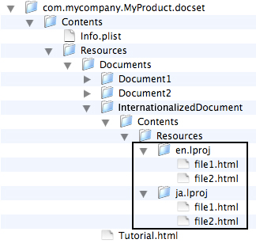

> 导航：[总目录](../../../README.md) · [documentation](../../../_indexes/documentation.md) · [Documentation Set Guide](Introduction.md)


[Next](Acquiring%20Documentation%20Sets%20Through%20Web%20Feeds.md)[Previous](Indexing%20Documentation%20Sets.md)

# Internationalizing Documentation Sets

To internationalize a documentation set, you can localize all or part of the content in a documentation set bundle into more than one language. There are two ways to provide localized content in a documentation set:

1. For large documentation sets containing only a couple of internationalized documents, you can localize individual documentation nodes.
2. For documentation sets that have a larger percentage of their content internationalized, you can localize the whole documentation set bundle, including both the HTML files as well as the index files.

This chapter describes how to localize individual documents or the entire documentation set bundle. It also shows how to run `docsetutil` to create indexes for a particular locale. For information about product internationalization in OS X, see _[Internationalization and Localization Guide](../../Mac%20OSX/Internationalization%20and%20Localization%20Guide/About%20Internationalization%20and%20Localization.md#apple-f4xwc4dqnrsv64tfmyxwi33df52wszbpgeydambqge3tc2i)_.

If you need to internationalize only one or two documents in your documentation set, it may make sense to localize the individual documentation nodes that represent these documents. You can do so by:

1. Creating a file bundle to contain the HTML files for the localized document.
2. Defining a bundle node to represent the document in the `Nodes.xml` file.

For example, a documentation set that contains several documents, of which only one is internationalized, may be organized as shown in Figure 6-1.

__Figure 6-1__  Internationalized node in a documentation set



The internationalized document is available in Japanese and English; the `InternationalizedDocument` directory uses the standard bundle conventions to organize two subdirectories containing the localized HTML files. The `en.lproj` directory contains the English language versions of the HTML-based documentation files and the `ja.lproj` directory contains the Japanese language version of these same files. See _[Internationalization and Localization Guide](../../Mac%20OSX/Internationalization%20and%20Localization%20Guide/About%20Internationalization%20and%20Localization.md#apple-f4xwc4dqnrsv64tfmyxwi33df52wszbpgeydambqge3tc2i)_ for more information on the structure of internationalized bundles.

Once you have the bundle hierarchy established, you need to define a `Node` element to represent the internationalized bundle. Returning to the example documentation set in Figure 6-1, you can represent a node with this structure using a `Node` definition such as the one shown in Listing 6-1.

__Listing 6-1__  An internationalized `Node` element

```
<Node type="bundle">
    <Name>My Internationalized Document</Name>
    <Path>InternationalizedDocument</Path>
    <File>file1.html</File>
</Node>
```

The `Path` element specifies the path—relative to the `Documents` directory in the documentation set—to the bundle containing the localized content. The `File` element specifies the name of the HTML file to load for that node; in this case, `file1.html`. When the user accesses the content represented by this node, Xcode determines which `.lproj` directory to load files from based on the user’s preferred language, using the same process outlined in _[Internationalization and Localization Guide](../../Mac%20OSX/Internationalization%20and%20Localization%20Guide/About%20Internationalization%20and%20Localization.md#apple-f4xwc4dqnrsv64tfmyxwi33df52wszbpgeydambqge3tc2i)_.

When you index a documentation set with internationalized nodes, `docsetutil` indexes all available localizations for those nodes and includes that information in the `docSet.skidx` and `docSet.dsidx` files that it generates. If Xcode finds a search result in multiple localizations—that is, in localized versions of the same file—the Documentation window shows only the result corresponding to the user’s preferred language.

Because it is a standard OS X bundle, you can use standard internationalization techniques to localize a documentation set bundle into one or more languages. Any of the documentation set resources can be localized, including the following:

- `Tokens.xml` files
- `Nodes.xml` file
- `Documents` directory
- Generated index files (`docSet.skidx` and `docSet.dsidx`)
- `Info.plist` property values

You can localize all of these resources, or just some of them. To localize a documentation set, you must:

1. Construct a standard localized bundle hierarchy.

   The `Resources` directory in the documentation set can contain one or more locale-specific folders, named using the `<locale>.lproj` convention. These subfolders can contain localized versions of the `Documents` directory. They can also optionally contain localized versions of the metadata files, the index files, or `InfoPlist.strings` files, which localize one or more values in the `Info.plist` file.
2. Optionally localize the nodes or tokens files.

   Although you do not need to localize the `Nodes.xml` and `Tokens.xml` files, doing so allows you to support searching in additional languages. That is, when users perform searches in the Documentation window, they will see localized titles of documents in the search results. Localizing the tokens files lets you provide token-related information—for features such as Quick Help—in multiple languages.
3. Localize the `Info.plist` file.

   The `Info.plist` file also contains strings that appear in the user interface. To localize this content, place an `InfoPlist.strings` file with the localized string values in the appropriate locale-specific subdirectory, as described in “Strings Files.”
4. Run `docsetutil` once for each locale you wish to support. [Creating Indexes for Specific Locales](#apple-f4xwc4dqnrsv64tfmyxwi33df52wszbpkridimbqga2tenrwfvbuqnrnknltq) describes how to run docsetutil for a specific locale.

By default, `docsetutil` produces global indexes and stores them at the top level of the `Resources` directory. To produce indexes for particular locales, you must run `docsetutil` with a specific locale, using the `-localization` option. For example, to produce a set of Japanese language indexes for the documentation set shown in [Listing 6-2](#apple-f4xwc4dqnrsv64tfmyxwi33df52wszbpkridimbqga2tenrwfvbuqnrnknlti), you would invoke the `docsetutil` tool like this:

`<Xcode>/usr/bin/docsetutil index com.mycompany.MyProduct.docset -localization ja`

The `docsetutil` tool generates indexes using the XML files and `Documents` directory for the specified locale and stores the indexes in the appropriate directory—`ja.lproj`, in this case.

You must run the `docsetutil` tool separately for each locale that you wish to support.

For example, a small documentation set with a handful of documents that are localized into both English and Japanese might have a bundle structure—before indexing—similar to that shown in Listing 6-2.

__Listing 6-2__  An internationalized documentation set before indexing

```
com.mycompany.MyProduct.docset
   Contents
      Resources
         en.lproj
            Nodes.xml
            Tokens.xml
            InfoPlist.strings
            Documents
               Document1
               Document2
               Document3.html
         ja.lproj
            Nodes.xml
            Tokens.xml
            InfoPlist.strings
            Documents
               Document1
               Document2
               Document3.html
```

After indexing with the `-localization ja` command-line argument, the resulting bundle would look like that shown in Listing 6-3.

__Listing 6-3__  An internationalized documentation set after indexing

```
com.mycompany.MyProducet.docset/
   Contents
      Resources
         en.lproj
            Nodes.xml
            Tokens.xml
            InfoPlist.strings
            Documents
               Document1
               Document2
               Document3.html
         ja.lproj
            docSet.skidx ```  ``` 
            docSet.dsidx ```  ``` 
            Nodes.xml
            Tokens.xml
            InfoPlist.strings
            Documents
               Document1
               Document2
               Document3.html
```

[Next](Acquiring%20Documentation%20Sets%20Through%20Web%20Feeds.md)[Previous](Indexing%20Documentation%20Sets.md)

