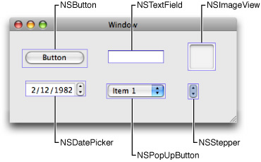
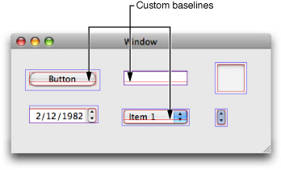

> 导航：[总目录](../../../README.md) · [documentation](../../../_indexes/documentation.md) · [Interface Builder Plug-In Programming Guide](Introduction.md)


[Next](Document%20Revision%20History.md)[Previous](Inspector%20Objects.md)

# Advanced Techniques

The Interface Builder Kit provides support for tweaking the behavior of your plug-in in many different ways. The following sections provide information about some of the more common ways to modify your plug-in. For information about additional ways to tweak your plug-in, see the objects and methods of _Interface Builder Kit Framework Reference_.

Layout is an important feature of Interface Builder. Users need to be able to position views and controls visually to make sure they line up properly and in accordance with the Aqua style guidelines. To help with alignment, Interface Builder provides dynamic guides that become visible when a view or control is in close proximity to an appropriate boundary of another object.

By default, Interface Builder uses a view’s frame as the alignment boundaries for the view. This may be appropriate for some views but may not be for others. Many controls have frames that are actually bigger than the main visual component of the control. This is often done to allow room for drawing shadows and other visual effects. Figure 6-1 shows several controls along with their actual frame rectangles, which are in blue. In most cases, the frame rectangles are slightly larger than the drawn portion of the control.

__Figure 6-1__  Frame boundaries for assorted views and controls.



Rather than using a view’s frame rectangle for alignment, it is generally preferable to align views and controls by other means. Most commonly, you would align controls according to the boundaries of their main visual component. For controls with text, you might also want to align the control using the baseline of the text. Figure 6-2 shows the frame rectangles of a set of controls but also shows the inset rectangles and custom baselines of those controls in red. For the user, it makes more sense to use these boundaries to align controls.

__Figure 6-2__  Inset boundaries and custom baselines



In Interface Builder, you can provide custom baselines and inset values for each of your custom views. You do this by overriding category methods defined on the `NSView` class in the Interface Builder Kit framework. Information about the information to provide in these methods is in the sections that follow.

To specify inset boundaries for a view, you must override your view’s `ibLayoutInset` method. This method is a category method provided by the Interface Builder Kit framework and is described in detail in _NSView Interface Builder Kit Additions Reference_. In your implementation of this method, return an `IBInset` structure containing the inset values needed to arrive at the correct bounding rectangle for your view. The inset values `{0, 0, 0, 0}` result in a rectangle that matches the original frame rectangle of your view. Positive inset values move this rectangle inward towards the center of the view. You should rarely (if ever) specify negative inset values because doing so aligns your view along boundaries that lie outside of its frame rectangle. For example, to specify the inset values for the `NSButton` control shown in [Figure 6-2](#apple-f4xwc4dqnrsv64tfmyxwi33df52wszbpkridimbqga2dgmrtfvbuqobnknltg), you would write your `ibLayoutInset` method as follows:

```objc
- (IBInset)ibLayoutInset
{
    IBInset inset = {8, 6, 6, 4};
    return inset;
}
```

For information about the `IBInset` data type, see _Interface Builder Kit Data Types Reference_.

If your view renders text strings, you can specify custom baselines for each of those strings. Custom baselines let the user align your control using its text content instead of its frame or inset boundaries. This kind of alignment is frequently used when aligning text in different types of controls. Baselines are also the more commonly used way to align text-only fields such as labels.

To provide Interface Builder with baseline information, you must override the `ibBaselineCount` and `ibBaselineAtIndex:` methods in your custom view. The `ibBaselineCount` method returns the number of baselines available in your view. The `ibBaselineAtIndex:` method returns the y-axis offset value (relative to the y-origin of the view’s frame rectangle) for one of those baselines. You can change the number of baselines your view supports dynamically if you wish. If you do so, however, the `ibBaselineAtIndex:` method must return a valid value for each index it receives.

For more information about the `ibBaselineCount` and `ibBaselineAtIndex:` methods, see _NSView Interface Builder Kit Additions Reference_.

If your view is capable of acting as a container view, you should override the `ibDesignableContentView` method in your custom view. Returning a valid view object from this method tells Interface Builder to treat that view as a container at design time and let the user add child views to it. For most views, you would simply override this method and return `self`, to indicate that the current view is the container, but this need not be the case. If your main view is not the view you want to use as the container, you could return an associated subview. For example, a scroll view contains a clip view, which in turn contains the document view to be scrolled. In that situation, the scroll view would return its clip view object as the container view.

Although container views allow their children to be moved and resized freely for the most part, you can alter this behavior by overriding the `ibIsChildViewUserMovable:` and `ibIsChildViewUserSizable:` methods in your container view. You should only need to override these methods if allowing the user to move or resize child views would cause problems for your view. For example, scroll views do not allow users to move or resize their contained scrollers. The position and size of the scrollers remains fixed based on the scroll view’s frame and cannot be changed by the user at design time.

For more information about these methods see _NSObject Interface Builder Kit Additions Reference_ and _NSView Interface Builder Kit Additions Reference_.

In each document, Interface Builder distinguishes between objects that can be selected and inspected by the user and those that are simply there in a supporting role. Objects that can be selected and inspected are considered “first-class” objects and are the only objects users actually see in a document. Supporting objects are present in the nib file but cannot be configured by the user and are generally not visible. Both first-class objects and supporting objects are saved as part of the resulting nib file.

For each library entry, Interface Builder exposes only the represented object of the entry as a first-class object by default. (For more about the structure of library entries, see Configuring a Library Object Template.) The actual implementation of a represented object can have any number of associated child objects, however, all of which are relegated to supporting roles by default. To change child objects into first-class objects, you expose them to Interface Builder by overriding the `ibDefaultChildren` method of their nearest parent object.

The `ibDefaultChildren` method simply returns a list of objects to expose as first-class children of the receiver. For each exposed child, Interface Builder calls the child’s own `ibDefaultChildren` method to give that child a chance to expose its own children. When exposing child objects, give careful consideration to which objects you want to expose. Views in a view hierarchy commonly expose configurable child views. They may also expose cell objects, which although not views do contain configurable attributes, outlets, and actions. It is rare for non-view objects to expose child objects—that is, you typically would not expose any child objects from a controller object.

The sections that follow discuss some of the ways a parent view can manipulate the information surrounding its child objects. For more information about implementing the `ibDefaultChildren` method or any of the methods discussed in the following sections, see _NSObject Interface Builder Kit Additions Reference_.

The position and size attributes of a view are controlled by its parent (or container) view. The resizing and repositioning of child views within their parent view is handled automatically by the default editor object of the parent view. To change this behavior, simply override the `isChildViewUserMovable:` or `isChildViewUserSizable:` method to disable the behavior for the specified view.

Normally, when the user clicks in a window at design time, Interface Builder tries to select the object that is directly under the mouse. For some complex view hierarchies, this might involve selecting an object deep inside the view hierarchy, which may not always be useful. If you expect users to use your view hierarchy primarily as a group, you might want the first click to select the top-level object, making it easier to drag or resize the entire group of views. To make sure the initial mouse click selects your top-level view, you can override the `ibIsChildInitiallySelectable:` method and return `NO`. Overriding this method does not prevent the child from being selected, it just forces the user to select the parent view first and then select the child afterwards.

Interface Builder objects are stored in the IBDocument tree, and also by their natural relationships. For example, a button in a box is a child of the box in the Interface Builder document tree, but it is also a subview of the box's content view. In this context, the remove action means to remove objects from their natural relationships, not from the document tree.

Interface Builder calls the `ibCanRemoveChildren:` method to determine whether it can remove a parent’s child objects. Unless this method is used to specify otherwise, Interface Builder assumes it can remove an object. You should override this method if your object has a child object that should not be removed.

Your implementation of this method should never return `YES`. You should either return `NO` because you know that one of the objects cannot be removed, or you should call the superclass implementation of this method and return the result.

A typical implementation on [NSPopUpButtonCell](https://developer.apple.com/documentation/appkit/nspopupbuttoncell) might look like this:

```objc
- (BOOL)ibCanRemoveChildren:(NSSet *)children {
    BOOL deny = [children containsObject:[self menu]];
    return deny ? NO : [super ibCanRemoveChildren:children];
}
```

Interface Builder calls the `ibRemoveChildren:` method to remove a parent's child objects. If your object has child objects, and you didn't override `ibCanRemoveChildren:` to block their removal, then you must override this method to remove them. In the override, the receiver is responsible for actually removing references to each of the passed in children.

Overrides of this method should check for the presence of their removable children in the passed in set. If the set contains the children, the children should be removed from the receiver’s natural relationships. For example, if the receiver is an NSView-based object and the passed in set contains a subview, the receiver would typically remove that object from its subview list.

The passed in objects may be a heterogeneous group of children. For example, if a pop up button cell has a formatter and allows removal of its menu, the passed in objects could include both the formatter and the menu.

A typical implementation on [NSCell](https://developer.apple.com/documentation/appkit/nscell) might look like this:

```objc
- (void)ibRemoveChildren:(NSSet *)children {
    if ([self formatter] && [children containsObject:[self formatter]]) {
        [self setFormatter:nil];
    }
    [super ibRemoveChildren:children];
}
```


Although Interface Builder knows how to identify views at design time, it needs help when it comes to your custom non-view objects. If you use non-view objects in the view hierarchy, you should override the `ibRectForChild:inWindowController:` and `ibObjectAtLocation:inWindowController:` methods to provide Interface Builder with the geometry information it needs for your custom objects.

Interface Builder sends notifications to your custom objects whenever they are added to or removed from a user’s document. You can implement the `ibAwakeInDesignableDocument:`, `ibDidAddToDesignableDocument:` and `ibDidRemoveFromDesignableDocument:` methods in your custom object to receive these notifications. You might use these notifications to perform additional configuration steps involving other objects in the document. For example, you could create or remove connections between your custom objects and the File’s Owner, First Responder, or Application object of the document.

For more information about these notification methods, see _NSObject Interface Builder Kit Additions Reference_.

[Next](Document%20Revision%20History.md)[Previous](Inspector%20Objects.md)

