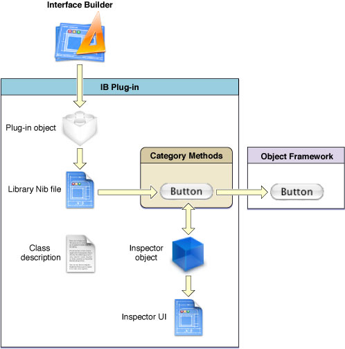

> 导航：[总目录](../../../README.md) · [documentation](../../../_indexes/documentation.md) · [Interface Builder Plug-In Programming Guide](Introduction.md)

[Next](Plug-in%20Quick%20Start.md)[Previous](Introduction.md)

# Anatomy of a Plug-In

This chapter provides a high-level overview of the plug-in model used by Interface Builder and discusses some of the terminology associated with building plug-ins. If you are interested in integrating any custom objects into the Interface Builder environment, you should read this chapter to get a basic understanding of how Interface Builder plug-ins work.

Interface Builder is a tool for building application user interfaces visually from a standard set of user interface components, including windows, menus, views, controls, formatters, and controller objects. The Interface Builder application comes configured with the standard controls available to all Cocoa and Carbon applications. Although the standard controls are useful for many applications, they may not be sufficient in all cases. You might want to create new controls or customize the appearance of the standard system views and controls. Instead of creating new controls, you might want to speed your design process creating customized configurations of the standard controls. For all of these goals, you can use Interface Builder plug-ins.

You install plug-ins from Interface Builder’s preferences window. Once installed, the plug-in acts as a liaison between Interface Builder and the code for your custom views and objects. The plug-in specifies the initial configuration of your views and objects and provides the means to manipulate the attributes of those views and objects at runtime. The plug-in is therefore responsible for the following basic jobs:

- It identifies which of your custom objects to add to the Interface Builder library window.
- It tags various attributes of your custom objects as being user manipulable. (Interface Builder uses this information to implement several housekeeping tasks related to your objects.)
- It provides the user interface required to manipulate the attributes of your objects.

Before creating an Interface Builder plug-in for your own custom objects, you should think about whether a plug-in is an effective use of time for you. In particular, carefully consider the following:

- Are your custom objects going to be used by only one application?
- Do your custom objects rely on state information found only in your application?
- Would it be problematic to encapsulate your custom views in a standalone library or framework?

If you answered yes to any of the preceding questions, your objects may not be good candidates for a plug-in. The main purpose of integrating custom views and controls into Interface Builder is to streamline the process of creating and customizing your user interfaces. However, putting your views and controls in a plug-in takes effort too. If you plan to use a view for only one application, it might not be worth the extra effort needed to create a plug-in for it. Similarly, if your views are too tightly entwined in your application logic, extracting them from that logic may require more effort than is worthwhile. Custom objects must be able to operate outside of your application environment so that they can be integrated into Interface Builder.

The views and controls that make good candidates for inclusion in a plug-in are those that can stand on their own and be used by multiple applications. Each view or control you design should be self-contained and not make any assumptions about the state of its host application. Whenever possible, views should also avoid making assumptions about the existence or state of other views, although in some cases knowing about other views may be necessary. For example, a scroll view is typically grouped with other views, including a clip view and scrollers. If you do have views whose behavior is tightly intertwined, you may need to deliver them as a preconfigured group rather than as separate pieces.

An Interface Builder plug-in is a bundle that contains a loadable executable file and some supporting resources. Nearly all Interface Builder plug-ins actually contain at least one nib file and many can contain several nib files. (Interface Builder relies on nib files whenever possible to simplify the plug-in creation process.) The bundle directory for an Interface Builder plug-in must have the `.ibplugin` extension.

Figure 1-1 shows the high-level structure of an Interface Builder plug-in and some of the other code modules with which it interacts. A plug-in bundle links against the object framework that contains the code for the objects being added to Interface Builder. Inside the plug-in itself are the handful of objects and files (including the plug-in object, inspector objects, nib files, and class descriptions) that bridge the gap between Interface Builder and your custom framework. Any category methods that are related to Interface Builder but defined on your custom objects should similarly be included as part of your plug-in and not as part of your object framework.

__Figure 1-1__  Objects associated with an Interface Builder plug-in

The pathways through the preceding figure show the routes taken by Interface Builder to discover objects inside of your plug-in. Once acquired, Interface Builder may cache references to various objects for easier access later. For inspector objects, the route is shown as bidirectional to reflect the interactive nature of those objects with the current selection.

From the figure, you can see that the discovery of all custom objects occurs through the plug-in object and its associated library nib files. Interface Builder integrates the contents of each library nib file into the library window. As items are dragged out of the library window and into a document, Interface Builder uses the category methods of the dragged object to locate other needed objects. For example, when an instance of your object is selected in a document, Interface Builder checks the category methods to see if an associated inspector is available, and if so, assembles the pieces of the inspector user interface needed to represent your control.

The following sections describe some of the key objects from [Figure 1-1](#apple-f4xwc4dqnrsv64tfmyxwi33df52wszbpkridimbqga2dgmrtfvbuqnbnknlte) that you are responsible for creating. For more information about the classes used to create these objects, see _Interface Builder Kit Framework Reference_.

The plug-in object is the main entry point to your plug-in. Interface Builder uses this object to obtain your plug-in’s name and the list of custom objects to integrate into the library window. This object also manages some general plug-in features, such as your plug-in’s preferences. Every Interface Builder plug-in must have a plug-in object, which is a subclass of the `IBPlugin` class.

At a minimum, every `IBPlugin` object must implement the `libraryNibNames` method, which returns the names of the library nib files containing the objects you want to integrate into the library window. There are other methods of the `IBPlugin` class you can implement, such as the `label` method, to return information about your plug-in or its configuration. Beyond those basic tasks, however, your plug-in object requires little work to implement.

For more information about the plug-in object and how you use it to manage your plug-in, see [The Plug-in Object](The%20Plug-in%20Object.md#apple-f4xwc4dqnrsv64tfmyxwi33df52wszbpkridimbqga2dgmrtfvbuqmjqfvjvomi).

Rather than ask your plug-in for the names of the objects it supports, Interface Builder uses nib files to gather that information. This visual approach to reporting your plug-in’s contents makes it possible to add new objects to your plug-in quickly and without writing any code. It also makes it possible to support the following features easily:

- You can use a placeholder view to provide a different visual representation of your object, if desired.
- You can see how your custom objects and views will look in the library window.
- Interface Builder provides a simple way to specify visual representations for non-visual objects (such as controllers).

For more information on library nib files and how you configure them, see [Configuring the Library Nib Files](The%20Plug-in%20Object.md#apple-f4xwc4dqnrsv64tfmyxwi33df52wszbpkridimbqga2dgmrtfvbuqmjqfvjvomq).

Class description files are property lists that detail the outlets and actions exposed by any custom objects in your plug-in. Because it does not have explicit access to your object code, Interface Builder uses this information to populate the connections inspector and connections panel whenever a user attempts to create a connection to or from your objects.

You create class description files using Xcode and place them in your plug-in’s `Resources` directory. When your plug-in is loaded, Interface Builder automatically scans your plug-in bundle for these files and reads in their information. You do not have to tell Interface Builder to do this explicitly.

For more information on how to create class description files for your objects, see [Creating Your Class Description Files](Preparing%20Your%20Custom%20Objects.md#apple-f4xwc4dqnrsv64tfmyxwi33df52wszbpkridimbqga2dgmrtfvbuqmznknlte).

The inspector window is where Interface Builder displays the current state of an object’s attributes. Interface Builder uses inspector objects to synchronize the contents of the inspector window with the actual properties of the selected objects. An inspector object is an instance of the `IBInspector` class. If your custom objects contain attributes that should be modifiable at design time, you can create a custom inspector object and accompanying user interface to allow the manipulation of those attributes.

In Interface Builder 3.0 and later, attributes are organized by class and displayed in sections inside the inspector window. This approach differs from the one used by previous versions of the software, which presented a panel containing intermingled attributes from various parent classes of the selected object. The class-based organization offers some key advantages over the older approach. Now, your inspector objects need manage only the attributes defined in your custom subclasses, as opposed to all attributes of the class. This approach also makes it possible for Interface Builder to handle multiple selected objects gracefully, allowing the user to modify the attributes that are common to all selected objects. The use of collapsible sections also makes it possible for the user to make more space in the inspector window by hiding unneeded attributes.

For information on how to implement an inspector object and user interface for your custom objects, see [Inspector Objects](Inspector%20Objects.md#apple-f4xwc4dqnrsv64tfmyxwi33df52wszbpkridimbqga2dgmrtfvbuqnrnknltc).

The Interface Builder Kit framework (`InterfaceBuilderKit.framework`) provides the infrastructure needed to create plug-ins for Interface Builder 3.0 and later. When building a plug-in, you must always link your plug-in bundle against this framework. This framework contains the following support beyond just the key classes (`IBPlugin`, `IBInspector`) that you use to implement your plug-in object:

- The framework defines category methods for both `NSObject` and `NSView` that provide a way for Interface Builder to discover information about your custom objects. Many of these methods provide suitable default implementations but you must override some of them to implement specific features.
- The `IBDocument` class provides support for accessing the data structures of a nib file. You can use instances of this class to locate and manipulate the objects in a nib file, create new connections between objects, and work with pasteboard data.

For more information about the classes of the Interface Builder Kit framework, see _Interface Builder Kit Framework Reference_.

Xcode provides a number of templates for creating plug-ins for Interface Builder 3.0. Among these templates are a project template that includes targets for your plug-in bundle and a separate framework for your custom object code. Xcode also includes templates for some of the standard types of files you might add to your plug-in project.

For plug-in development, Xcode also offers improved integration with the Interface Builder environment, providing the ability to create nib files directly from Xcode.

Plug-in code is called only as needed by Interface Builder, and you should have no need to create additional threads. Your plug-in should run code only in the current thread, which is determined for you by Interface Builder. In other words, you should execute all of your code serially and not use operation objects, blocks, or separate threads to manipulate real data sets or perform other computationally-intensive tasks. If you want to display placeholder data, do so using a data set that you load from a resource file.

The Interface Builder application does not use garbage collection for its memory management and your plug-ins should not use garbage collection either. By extension, this also means that the framework that implements your plug-in’s objects must be able to run without garbage collection enabled. Because your framework could be linked into a garbage collected application by a client, however, most custom frameworks must be designed as dual-mode frameworks.

A dual-mode framework is one that can operate both with and without garbage collection enabled. To implement a dual-mode framework, you must first configure your framework’s Objective-C Garbage Collection build setting so that garbage collection is “supported” and not required. Your framework code then needs to support both memory programming models. In other words, your code must continue to retain and release objects but it must also maintain strong references to objects and abide by other garbage collection guidelines. At runtime, the system essentially “ignores” memory management calls that are not relevant to the current memory mode.

To create a dual-mode framework, you should implement the following guidelines at a minimum. For detailed information about creating a dual-mode framework, see _[Garbage Collection Programming Guide](../../Cocoa/Garbage%20Collection%20Programming%20Guide/Introduction%20to%20Garbage%20Collection.md#apple-f4xwc4dqnrsv64tfmyxwi33df52wszbpkridimbqgazdimzr)_.

- Enable the garbage collection build setting for your framework target.
- Continue to retain and release your objects as you would for a non-garbage collected application. Do not override the `retain`, `release`, and `autorelease` methods in your custom objects, however.
- Make sure you keep strong references to objects in addition to retaining them.
- Do not allocate objects in custom memory zones.
- Initiate collection sweeps only if the `isEnabled` method of `NSGarbageCollector` returns `YES`.
- Implement `dealloc` and `finalize` methods only as necessary. Try to architect your framework to avoid them whenever possible. (For more information about deallocation and garbage collection, see _[Garbage Collection Programming Guide](../../Cocoa/Garbage%20Collection%20Programming%20Guide/Introduction%20to%20Garbage%20Collection.md#apple-f4xwc4dqnrsv64tfmyxwi33df52wszbpkridimbqgazdimzr)_.)

When creating a dual-mode framework, be sure to test your framework in both garbage collected and non garbage collected applications to ensure that it behaves correctly.

How you deploy your Interface Builder plug-in to clients depends heavily on how you deploy your custom controls to those same clients. Apple recommends that you deploy custom controls using a custom framework. A custom framework makes plug-in integration almost trivial for yourself and for the clients of your framework. If you are unable to use a custom framework, however, users can load your plug-in manually into the Interface Builder environment.

Table 1-1 lists the different ways to load a plug-in into interface Builder at runtime.

__Table 1-1__  Plug-in deployment situations

| Situation | Deployment option |
| At development time… | If you used the standard Xcode template project, you can load your plug-in into Interface Builder by simply building and running your plug-in target. The template project is configured to open Interface Builder automatically and load your plug-in. You can use this option to test your plug-in and make sure its items appear in the library and inspector windows. |
| If you have a custom framework… | If you are shipping a custom framework with your controls, simply include your Interface Builder plug-in in your framework’s `Resources` directory. When clients add your framework to their Xcode projects, Interface Builder automatically loads the associated plug-in for any nib files associated with that project. |
| If you do not have a custom framework… | You can instruct users to load your plug-in manually using the Interface Builder preferences window. The user can add your plug-in using the provided controls or drag the plug-in bundle into the window. In either case, the plug-in must link against (or contain) the code for your custom controls. |

For more information about loading plug-ins, see _[Interface Builder User Guide](../Interface%20Builder%20User%20Guide/Introduction.md#apple-f4xwc4dqnrsv64tfmyxwi33df52wszbpkridimbqga2tgnbu)_.

[Next](Plug-in%20Quick%20Start.md)[Previous](Introduction.md)

