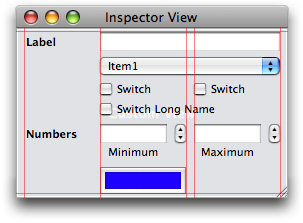

> 导航：[总目录](../../../README.md) · [documentation](../../../_indexes/documentation.md) · [Interface Builder Plug-In Programming Guide](Introduction.md)


[Next](Advanced%20Techniques.md)[Previous](The%20Plug-in%20Object.md)

# Inspector Objects

The inspector window in Interface Builder provides the user with access to the attributes of the currently selected objects. The inspector window is divided into several different panes, which are selected using controls at the top of the window (Figure 5-1). Plug-in developers can customize the attributes pane and the size pane.

__Figure 5-1__  The inspector window for Cocoa controls


The attributes pane displays the design-time attributes of the currently selected objects. The attributes themselves are divided up and displayed in “sections”, which are collapsible regions consisting of a title bar and content area. The content area of each section contains the attributes associated with a given class in the selected object’s lineage. For example, an instance of the `NSButton` class contains sections displaying the `NSView` attributes, `NSControl` attributes, and `NSButton` attributes.

The advantage of sections is that they promote greater editability when multiple objects are selected. When multiple objects are selected, Interface Builder displays all of the inspectors that are common among the selected objects. Thus, if an `NSButton` and `NSTextField` object are selected, the user sees the Control, View, and Object inspectors. This lets the user modify any of the attributes that are common to the objects in the selection.

Each section in the attributes pane is managed by an inspector object. An inspector object ensures that the controls in the section’s content view remain synchronized with the attributes of the currently selected objects. When one of your custom objects is selected, Interface Builder queries it for the names of the inspector classes needed to display its attributes. Interface Builder provides inspector classes for all of the standard Cocoa classes so you need to provide inspectors only for those classes you use to implement your custom objects. In addition, an inspector class is needed only if your custom view or object classes have attributes that are configurable at design time. If they do not, you do not need to create an inspector class.

The steps for creating an inspector object are as follows:

1. Define a custom subclass of `IBInspector`.
2. Create a nib file with the user interface of your inspector section.
3. Configure the bindings or write the code needed to synchronize your inspector interface with the currently selected objects.
4. Register your inspector class with Interface Builder.

The `IBInspector` class provides the default controller interface for implementing your custom inspector objects. Custom inspectors are needed only for classes that have custom design-time attributes that you want to be configurable in Interface Builder. If your classes do not expose any public attributes, you do not need to create an inspector class.

Every inspector class has the following responsibilities:

- Provide an interface for viewing and setting attributes.
- Synchronize the controls in its view with the attributes of the current selection.

The `viewNibName` method of `IBInspector` is the preferred way to provide the interface for your inspector class. This method returns the name of the nib file containing your inspector’s interface. You can also create your user interface programmatically if you prefer. The steps for creating your user interface are discussed in [Creating Your Inspector’s User Interface](#apple-f4xwc4dqnrsv64tfmyxwi33df52wszbpkridimbqga2dgmrtfvbuqnrnknlts).

For information on how to synchronize your inspector’s interface with the current selection, see [Synchronizing Your Inspector’s Interface](#apple-f4xwc4dqnrsv64tfmyxwi33df52wszbpkridimbqga2dgmrtfvbuqnrnknltk).

There are two ways to create your inspector’s user interface: programmatically or using a nib file. Using a nib file is by far the simplest way to create your inspector’s interface. In fact, if you use Cocoa bindings, it is possible to create your inspector with little or no code at all. Whereas, creating your inspector interface programmatically is complicated and requires much more effort and testing to ensure the correct positioning and layout of any controls.

All new plug-in projects in Xcode come with an inspector nib file for you to customize. To create additional inspector nib files, you use Interface Builder. Interface Builder’s new document dialog includes an IB Kit tab that contains plug-in related template nib files. From this tab, selecting the Inspector template creates a nib file with the default content view shown in Figure 5-2. This view includes several guides to help you line up your custom controls with the controls found in other inspectors. The view also includes some default controls that you can use for your inspector (or delete if they are not needed). Although you should not change the width of your inspector view, you can (and should) change its height to match the space used by your controls.

__Figure 5-2__  Default inspector view template



To configure the nib file containing your inspector’s user interface, do the following:

1. Open your plug-in project in Xcode. (This ensures that your class header files are accessible in Interface Builder.)
2. Open your project’s existing inspector nib file (or create a new one).
3. Add or remove any needed controls in your inspector view.

   Typically, you would provide a single control for each design-time attribute of your object you want to expose. The type of the control would be determined by the type of data represented by the underlying attribute.

   - String values are typically represented by text fields.
   - Numerical values may be displayed in a text field but might also have an optional stepper control to increment or decrement the value.
   - Boolean values are typically represented using check boxes.
   - Enumerated type lists may be represented by radio buttons or pop-up menus.
4. Select the Files Owner placeholder object and open the identity pane of the inspector window.
5. Set the class name of File’s Owner to your `IBInspector` subclass. (You set this information in the identity pane of the inspector window.)
6. If it is not already connected, connect the `inspectorView` outlet of Files Owner to your inspector view. (This outlet is provided for you by the `IBInspector` class and should be connected already.)
7. Create any other connections or bindings required by your code. (For example, you might want to connect any outlets or actions to their targets.)
8. Save your nib file and add it to your Xcode project (if it has not yet been added).

Nearly all inspector nib files require some additional connections beyond the `inspectorView` outlet of File’s Owner. You use these connections to make it possible to synchronize changes as the user changes the current selection and modifies controls in your inspector. Cocoa bindings provide the simplest type of connection by automatically synchronizing the current selection with your inspector’s controls. You can also use outlets and actions if you prefer, however. For more information on using both of these techniques, see [Synchronizing Your Inspector’s Interface](#apple-f4xwc4dqnrsv64tfmyxwi33df52wszbpkridimbqga2dgmrtfvbuqnrnknltk).

If you want to create your inspector view programmatically, you can do so by implementing a custom `view` method in your `IBInspector` subclass. In your implementation of this method, you would create the view object you want your inspector to display and configure it as required by your custom object. In addition to overriding this method, you must override the `viewNibName` method and have it return `nil` to prevent Interface Builder from automatically looking for a nib file.

Interface Builder relies on your inspector object to coordinate the synchronization of the currently selected objects to your inspector’s user interface. Cocoa bindings are the preferred (and simplest) way to synchronize data but you can also use outlets and actions if you prefer. Which technique you choose may also depend on the complexity of your objects and how much logic is required to synchronize them with the inspector controls. Synchronization is required in the following situations:

- The user changes the current selection.
- The user changes the value of one of your inspector’s controls.

When multiple objects are selected, the inspector window displays only those inspector sections that are common to all of the selected objects. Your inspector objects must be prepared to handle this situation gracefully by displaying appropriate values in the controls of their user interfaces. Although there are options for situations where handling multiple selected objects is difficult or impossible, you are highly encouraged to design your inspector interface in a way that allows it to display at least some information when multiple objects are selected.

The following sections guide you through the steps to implement the synchronization code for your inspectors. Remember that you can choose to use bindings, outlets and actions, or a combination of both.

Bindings provide a sophisticated and elegant way to synchronize your inspector interface with the currently selected objects. Bindings are especially easy to use with inspectors since the whole point of an inspector is to reflect the values in the current selection—a task for which bindings are well suited.

To establish a binding, select one of the controls in your inspector view and open the inspector window. In the bindings pane, configure your binding to the File’s Owner object and use the `inspectedObjectsController.selection` string as the initial part of the model key path. The `inspectedObjectsController` property of the `IBInspector` class is a key-value observable property that returns an `NSArrayController` object with the current selection. Binding through this object provides you with access to the currently selected objects. If your synchronization logic is more complex, you can also include additional controller objects in your nib file and bind to them as needed to implement your logic.

To bind a checkbox to a Boolean value in your custom object, you would do the following:

1. Select the checkbox and open the inspector window.
2. In the bindings pane, expand the Value binding so that you can configure it.

   1. Set the Bind to property to the File’s Owner object.
   2. Set the Model Key Path field to a value similar to the following:

      `inspectedObjectsController.selection.`_MyObjectProperty_

      where _MyObjectProperty_ is the name of a KVO-compliant attribute in the target object.
3. Configure any other bindings as desired.

For more information about establishing bindings between objects, see _[Cocoa Bindings Programming Topics](../../Cocoa/Cocoa%20Bindings%20Programming%20Topics/Introduction%20to%20Cocoa%20Bindings%20Programming%20Topics.md#apple-f4xwc4dqnrsv64tfmyxwi33df52wszbpgeydambqge3do2i)_.

If you prefer use actions and outlets to synchronize your interface, you must do the following to implement your synchronization code:

- Define action methods in your inspector object that synchronize changes in your inspector’s controls with the objects in the current selection.
- Implement the `refresh` method of your inspector object to respond to changes in the current selection.

Implementing action methods for your inspector’s controls is a relatively straightforward task. When invoked, your action method should get the value from the control that initiated the action and write that value to each of the selected objects. To get the currently selected objects, use the `inspectedObjects` method of `IBInspector`.

Compared to bindings, implementing your `refresh` method involves a little more work, especially to support multiple selected objects. Interface Builder calls your `refresh` method any time the application state changes in a way that might require you to refresh your inspector. These state changes typically involve the user changing the selection but they might also be triggered by the active undo manager or other circumstances.

One of the first things your `refresh` method should do is see how many objects are in the current selection. If only one object is selected, you can simply extract the attribute values from that object and use them to set the state of your inspector’s interface. If multiple objects are selected, you need to determine what to display. If all of the values are the same, you should display the common value. If the values are different, you need to convey a multi-selection state in the appropriate controls.

Listing 5-1 shows a `refresh` method for an inspector whose interface contains a single text field, which is assigned to the `titleField` outlet of the inspector object. When a single object is selected, the refresh method simply sets the value of the text field to the value of the object in the array. If multiple objects are selected and all their titles match, this method displays the common title string in the text field. If there is a mismatch in any of the titles, a placeholder string is displayed instead.

__Listing 5-1__  Handling multiple objects in the refresh method

```objc
- (void)refresh
{
    NSArray*        objects = [self inspectedObjects];
    NSString*       newTitle;
    NSInteger       numObjects = [objects count];

    if (numObjects == 1)
    {
        newTitle = [[objects objectAtIndex:0] title];
        [titleField setStringValue:newTitle];
    }
    else if (numObjects > 1)
    {
        NSString*    tempString;
        NSInteger    i;
        BOOL        allMatch = YES;

        // See if the titles are all the same.
        newTitle = [[objects objectAtIndex:0] title];
        for (i = 1; i < numObjects; i++)
        {
            tempString = [[objects objectAtIndex:i] title];
            if (![newTitle isEqualToString:tempString])
            {
                allMatch = NO;
                break;
            }
        }

        // Set the value of the text field.
        if (allMatch)
            [titleField setStringValue:newTitle];
        else
        {
            [titleField setStringValue:@""];
            [(NSTextFieldCell*)[titleField cell] setPlaceholderString:@"<multiple>"];
        }
    }

    [super refresh];
}
```

When implementing a custom `refresh` method, you must invoke `super` at some point in your implementation. Interface Builder uses the `refresh` message to update some of its own internal objects, such as the inspected objects controller. Invoking `super` ensures these objects are updated properly.

When multiple objects are selected, Interface Builder displays only those inspectors that are common among all of the selected objects. Although the types are the same, the attributes of each object may not be the same, however. If the current selection contains multiple objects, your inspector needs to check the values in the objects and determine an appropriate way to convey that information. There are two basic scenarios that can occur:

- All of the objects contain the same value for a given attribute.
- At least one object has a different value for an attribute.

If all of the objects contain the same value, you should display the common value. If the values differ in any way, you need to convey this status to the user somehow. Some controls support the ability to display a mixed state indicator, but others may require that you simply show no value. The following list shows some of the standard controls used in inspectors and how you might use them to display mixed state information:

- Check boxes - display the mixed state setting for the checkbox.
- Text fields - display a placeholder string with the value “_Mixed_“ or “_<multiple>_“.
- Pop-up buttons and combo boxes - display a blank menu item—that is, a menu item with no text.
- Segmented controls - deselect all segments.
- Radio buttons - deselect all buttons in the group.
- Color wells - display a default color

If your inspector object cannot inspect a selection with multiple objects, you can tell Interface Builder not to display your inspector when multiple objects are selected. To do this, override the `supportsMultipleObjectInspection` method in your `IBInspector` subclass and return `NO`.

Returning `NO` from the `supportsMultipleObjectInspection` method should be avoided if at all possible. You might use this option, however, when no reasonable alternative exists for reflecting the data of multiple objects. For example, if your inspector displays tabular data or some other complex data that cannot be represented easily for more than one object at a time, you could use this option. Doing so should still be avoided whenever possible, however. Instead, you might consider disabling your table or temporarily replacing it with a text field and the words “Multiple selection”.

If it is easy to reflect a multi-object selection for some attributes but not others, it is preferable to disable the one or two problematic controls when multiple objects are selected than disable your entire inspector interface. Disabling the problematic controls lets the user continue to modify other attributes of the object, even when multiple objects are selected.

Before it can display your inspector interface, Interface Builder needs to know which objects use it. You provide this information by implementing the `ibPopulateAttributeInspectorClasses:` and `ibPopulateSizeInspectorClasses:` methods on your custom object. In your implementation of these methods, you add the list of inspector classes that can be used to edit your object to the provided array. Interface Builder then creates inspector objects based on the set of classes you return.

When implementing these methods, be sure to call `super` before adding any custom classes to the `classes` array. The order in which you add classes to the array defines the resulting order of the inspector sections in the inspector window. The first class in the array appears at the bottom of the inspector window, while the last class appears at the top. This means that you should generally add any inherited inspectors first and add your custom inspectors after that.

Listing 5-2 shows a sample implementation of the `ibPopulateAttributeInspectorClasses:` method for a custom view. This view has a single custom inspector, called `MyInspector`, that it adds to the inherited inspector list.

__Listing 5-2__  Returning the attribute inspectors for an object

```objc
@implementation MyCustomView (InspectorIntegration)
- (void)ibPopulateAttributeInspectorClasses:(NSMutableArray *)classes
{
    [super ibPopulateAttributeInspectorClasses:classes];
    [classes addObject:[MyInspector class]];
}
@end
```

A sample implementation of the `ibPopulateSizeInspectorClasses:` method is similar. For more information about these two methods, see _NSObject Interface Builder Kit Additions Reference_.

[Next](Advanced%20Techniques.md)[Previous](The%20Plug-in%20Object.md)

