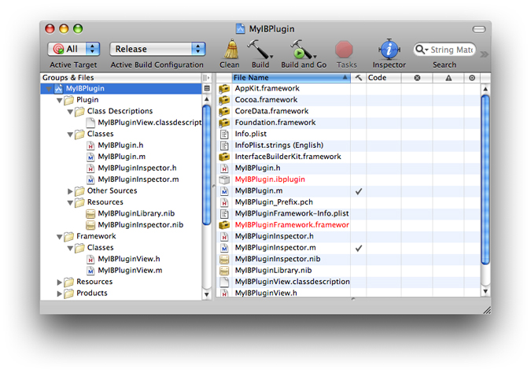
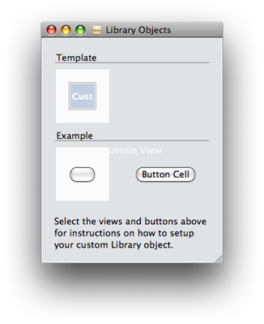
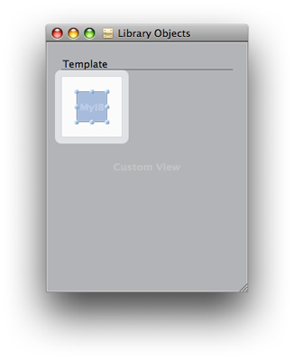
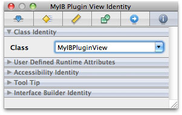
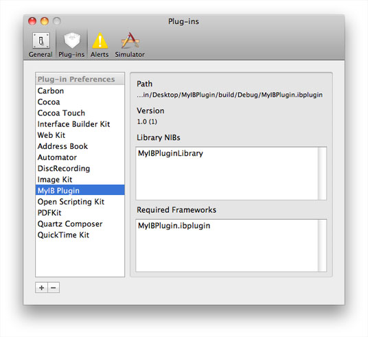

> 导航：[总目录](../../../README.md) · [documentation](../../../_indexes/documentation.md) · [Interface Builder Plug-In Programming Guide](Introduction.md)


[Next](Preparing%20Your%20Custom%20Objects.md)[Previous](Anatomy%20of%20a%20Plug-In.md)

# Plug-in Quick Start

If you already have a custom object, creating a basic Interface Builder plug-in for that object takes only a few minutes. This chapter walks you through the creation of a plug-in for a simple `NSButton` subclass. After completing the steps and installing your plug-in, a user should be able to drag your custom button out of the library, add it to a nib file, resize it, reposition it, and save it with the nib file. The user will also be able to customize the basic attributes of the button, since it is derived from the `NSButton` class. The steps for creating the plug-in are as follows:

1. Create your plug-in project using Xcode.
2. Set up your custom button.
3. Configure the library nib file that comes with the project.
4. Build your plug-in and load it into Interface Builder.

This chapter does not cover the steps needed to set up an inspector panel. That information is covered in a later chapter.

Xcode provides a custom project template for creating an Interface Builder plug-in. To create a new plug-in project, do the following:

1. In Xcode, select File > New Project.
2. In the New Project dialog, in the Application Plug-in section, select the “Interface Builder Plug-in” project template and click Choose.
3. Enter the project name and location and click Save.
4. In the new project window, double-click your plug-in target to open the inspector window for that target.
5. In the Properties tab of the inspector window, type a custom bundle identifier name in the Identifier field.

   The bundle identifier differentiates your plug-in from other Interface Builder plug-ins and should contain a string that includes your company name in reverse-DNS format. For more information about bundle identifiers, see _[Runtime Configuration Guidelines](../../Mac%20OSX/Runtime%20Configuration%20Guidelines/Introduction.md#apple-f4xwc4dqnrsv64tfmyxwi33df52wszbpgeydambqge3ta2i)_.

The project template includes default targets for your plug-in bundle and for a custom framework you can use to encapsulate the code for your custom objects. The code associated with the plug-in target consists of a default subclass of `IBPlugin`(your plug-in’s main class) and a basic nib file ready for you to customize.

__Figure 2-1__  Xcode project for Interface Builder plug-ins



The default plug-in target is configured to build a plug-in bundle with the `.ibplugin` extension. Your plug-in bundle must have this extension for it to be recognized by Interface Builder. If you create a custom Xcode project for your plug-in, you should specify this extension in the Wrapper Extension build setting for your plug-in target.

The Xcode project you created includes a framework target that you can use to package your custom objects. Along with this target is a source file you can use for your custom object. This button class should already have a custom name but its parent class is set to `NSView` by default. You need to change the parent class to `NSButton`. Thus, the header file for your new widget should look something like the following:

```objc
#import <Cocoa/Cocoa.h>
@interface MyIBPluginView : NSButton {
}
@end
```

You do not need to add any additional code to your custom button class.

Each new plug-in project contains a library nib file whose name is of the form “_plugin_name_`Library.nib`", where _plugin_name_ is the name you give to your Xcode project. Interface Builder looks in this nib file for the custom objects that you want to integrate into the Interface Builder library window. You can use this nib file to integrate both views and non-view objects. Inside the nib file is a default container view called “Library Objects”. This view contains one or more library object templates, which are a special type of view used to store the contents of a single library entry.

The library nib file that comes with your Xcode project should already contain two library object template views. One template contains a custom view while the other contains a button and a button cell. Although one of the templates already contains a button, the purpose of the example is to show you how to configure any view. The following steps show you how to configure the template with the custom view.

1. Open the library nib file for your plug-in project in Interface Builder 3.0.
2. In the nib file, double-click the Library Objects view to open it in its own window. Figure 2-2 shows this view, which contains two library object templates (one with a custom view and one with a button).

   __Figure 2-2__  Default view in the library nib file

   
3. Select the bottom library object template (the one with the button) and its surrounding content and delete it.
4. Select the custom view inside the remaining library object template. Your view should look similar to the one in Figure 2-3.

   __Figure 2-3__  Removing the unneeded items in the library nib file

   
5. Open the inspector window and select the identity pane; see Figure 2-4.

   __Figure 2-4__  Identity pane of the inspector window

   
6. In the Class field of the Inspector window, type the name of your custom button subclass. (From the preceding section, this would be the `MyIBPluginView` class name.)
7. Save the nib file.

Once you have saved your nib file, you can proceed to build your plug-in and load it in Interface Builder.

To build your project, select the All target and press the Build & Go button in the toolbar (or select Build > Build & Run from the menu). The plug-in target comes configured with a dependency on the framework target. Xcode builds your framework in the default build directory and builds your plug-in inside the framework itself. It then launches Interface Builder and loads your plug-in automatically. Your custom button should appear in the library and the preferences window should show your plug-in listing; see Figure 2-5.

__Figure 2-5__  Interface Builder preferences panel



Xcode builds a plug-in in its corresponding framework directory to facilitate easy distribution of that plug-in to end users. When the user opens a nib file, Interface Builder automatically scans the linked-in frameworks of the associated Xcode project to see if they contain plug-ins. If it finds any, Interface Builder automatically loads those plug-ins to ensure that any custom objects in the nib file can be read. For more information about the runtime integration between Xcode and Interface Builder, see _[Interface Builder User Guide](../Interface%20Builder%20User%20Guide/Introduction.md#apple-f4xwc4dqnrsv64tfmyxwi33df52wszbpkridimbqga2tgnbu)_.

If you need to load your plug-in manually for any reason, you can do so from the Interface Builder preferences window. To load your plug-in manually, do the following:

1. Open the Preferences window in Interface Builder.
2. Select the Plug-ins pane.
3. Click the “+“ icon at the bottom of the window.
4. Navigate to your plug-in from the sheet and click Open. (Your plug-in should be located inside your framework.)

[Next](Preparing%20Your%20Custom%20Objects.md)[Previous](Anatomy%20of%20a%20Plug-In.md)

