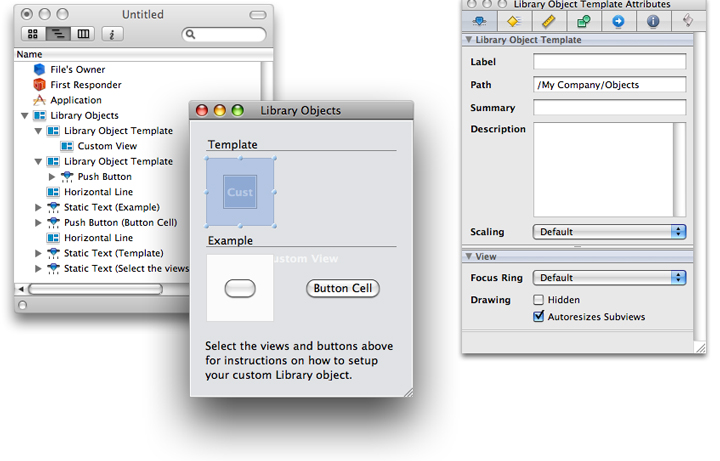
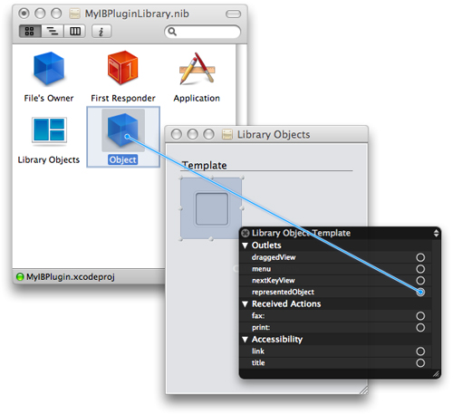

> 导航：[总目录](../../../README.md) · [documentation](../../../_indexes/documentation.md) · [Interface Builder Plug-In Programming Guide](Introduction.md)


[Next](Inspector%20Objects.md)[Previous](Preparing%20Your%20Custom%20Objects.md)

# The Plug-in Object

The plug-in object is Interface Builder’s initial entry point into your plug-in and is represented by the `IBPlugin` class. You must provide a subclass of this object in your plug-in and configure it as the primary class of your plug-in bundle. Your plug-in object has one critical responsibility: provide the list of nib files identifying the objects your plug-in represents. Beyond that, you use the plug-in object to provide support for other features of your plug-in. For example, you use the plug-in object to implement a preferences window or customize objects as they are dragged out of the library window.

The following sections describe the tasks you can perform from your custom plug-in object. For additional information about the methods of the `IBPlugin` class, see _IBPlugin Class Reference_.

The main job of the plug-in object is to provide Interface Builder with information about the custom objects it supports. It does this by returning a set of nib file names from its `libraryNibNames` method. These “library nib files” are so named because they contain the objects to be integrated into Interface Builder’s library window. Inside the nib file are one or more _library object templates_, which are special containers that hold the visual representation of the objects. Because not all objects have a direct visual representation, library template objects have accommodations for specifying both the real object and a visual placeholder for that object.

The best way to understand how the library object templates inside of a library nib file work is to look at an example. Figure 4-1 shows the default nib file that is created whenever you create a plug-in project using the Xcode template. This nib file contains two library object templates. The first of these objects contains a generic `NSView` object. The second contains an `NSButton` object that acts as a placeholder for an `NSButtonCell` object. If you were to build and install the plug-in without modifying this nib file, Interface Builder would add two objects to the library window: a generic `NSView` object and a button cell (represented visually by an `NSButton` object). Dragging one of these objects out of the library window would instantiate the corresponding real object (either the `NSView` or `NSButtonCell`) in the user’s document. Because they are existing Cocoa objects, the user could then select and configure those objects before saving them with the document.

__Figure 4-1__  Default library nib file for a sample project



There is no magic to how library object templates work. They are simply views used to identify entries for the library window. The library object template itself is just a container into which you place a single child view. This child view provides the visual appearance of your library entry at runtime. In most cases, this child view is your custom view object. If your object does not descend from `NSView`, or if it is a view but is too large or complex to recognize when scaled to fit the library window, you can instead place an image view in the library object template and use that view to display an iconic representation of your object. You can then use the `representedObject` and `draggedView` outlets of the library object template to associate the real objects to be added to the user’s nib file.

The `representedObject` outlet of a library object template points to the object that should be added to a user’s nib file in place of the visual representation displayed in the library window. For custom objects that do not descend from `NSView`, you would connect this outlet to an instance of your object that you added to the nib file. Similarly, if you use an image view to draw an iconic version of a view, you would connect this outlet to the actual view that should be added to the user’s nib file. If you do not configure this outlet, Interface Builder assumes the view embedded in your library object template is the object that should be added to the user’s nib file.

The `draggedView` outlet points to the view that should be used during drag operations from the library window. Dragged views are commonly used to show the user the actual size of views as they are dragged out of the library window. If your plug-in contains a custom object that might be difficult to represent in the limited space available in the library window, you could use a custom icon for the library window and assign the actual view to the `draggedView` outlet. In such a situation, your dragged view would also be the represented object of the entry, unless you specified a different object in the `representedObject` outlet. For more information about setting up dragged views, see [Using a Custom Dragged VIew](#apple-f4xwc4dqnrsv64tfmyxwi33df52wszbpkridimbqga2dgmrtfvbuqmjqfvjvooi).

Each new library nib file contains two library object templates already configured with some sample objects. You can reuse these existing templates or delete them and start from scratch. To reuse them, simply replace the contents of those templates with an appropriate view (usually either a generic view or an image view) and configure that view for your custom object.

To add new library object template, do the following in Interface Builder:

1. Open the Library Objects view in your nib file.
2. In the library window, select the Library > IB SDK group. This group contains a single entry, which is a library object template.
3. Drag the library object template from the library window to your Library Objects view. (If you want to resize the library object template, you can do so from the size pane of the inspector window. The width and height of a library object template are typically set to 80 pixels.)
4. Configure the Label, Path, Summary, and Description attributes in the inspector window. For information about what to put in these attributes, see [Providing User Documentation for Your Custom Objects](Preparing%20Your%20Custom%20Objects.md#apple-f4xwc4dqnrsv64tfmyxwi33df52wszbpkridimbqga2dgmrtfvbuqmznknltm).
5. Continue configuring the library object template for your view or object as described in the sections that follow.

Once you have an empty library object template, you can begin configuring it. For each library object template, you should fill in the label, summary, and description fields in the inspector window. These fields provide help information to the user at runtime and are displayed in the library window. The label field provides the basic name of the item while the description field provides detailed information about its purpose. The summary field contains tool tip information and is displayed when the user hovers the mouse over the item.

To configure a library object template with a custom object that descends from `NSView`, do the following:

1. Locate the generic Custom View object. (It is normally found in the Cocoa > Views & Cells > Layout Views group.)
2. Drag a custom view from the library window and drop it into an empty library object template. (Make sure you drop the custom view so as to make it a child of the template view.)
3. Select the custom view you just dropped and open the inspector window.
4. In the identity pane of the inspector, type the class name of your custom view in the Class field.
5. Save your nib file.

To configure a library object template with a custom object that does not descend from `NSView`, do the following:

1. Configure the object’s visual representation:

   1. If you have not already done so, add the image you want to use for your object to your Xcode project. (Make sure the image is included in the Copy Bundle Resources build phase of your plug-in target.)
   2. In Interface Builder, locate the Image Well object in the library window. (It is an instance of the `NSImageView` class and is normally found in the Cocoa > Views & Cells > Inputs & Values group.)
   3. Drag an image well from the library window and drop it into an empty library object template.
   4. Select the image well and open the inspector window.
   5. In the attributes pane of the inspector, select None from the Border popup menu.
   6. In the Image field of the inspector, type the name of the image.
2. Configure the represented object:

   1. In the library window, locate the generic Object. (It is normally found in the Cocoa > Objects & Controllers > Controllers group.)
   2. Drag a generic Object from the library window to your document window, making it a top-level object of your nib file.
   3. In the identity pane of the inspector, type the name of your custom object in the Class field.
3. Create the connection between the visual representation of your object and the actual object:

   1. Control-click (or right-click) the library object template to display its connections panel.
   2. Click and drag from the `representedObject` outlet to the custom object in your document window, as shown in Figure 4-2.

      __Figure 4-2__  Connecting the represented object of a library entry

      

When the user drags your custom object out of the library window, Interface Builder uses the view inside the library-object template as the default drag image. If you want to use a custom drag image, you can do so by configuring the `draggedView` outlet of the library object template.

A dragged view lets you provide the user with a more appropriately configured view. You might use a dragged view to provide a larger view than the one that appears in the library window. You might also use a dragged view to support a more complex view hierarchy. For example, for a table view item, you might display a table icon in the library window but assign a full-size table view embedded in a scroll view to the `draggedView` outlet. The use of an icon in the library would let you provide a clear visual indicator of what your view represented while the dragged view provides the actual view.

The view you assign to the `draggedView` outlet can be any size you like but must not be embedded inside a library object template. In most cases, you can simply place the view next to your library object template in your nib file, but you can also place it elsewhere in your nib file if doing so is more convenient. Once in your nib file, configure the view the way you want it to appear when dragged from the window.

To assign a dragged view, do the following:

1. Add a new view to your nib file to act as the dragged view. (Size it appropriately.)
2. Control-click (or right-click) the library template object containing your custom object to bring up its connection panel.
3. Click the circle next to the `draggedView` outlet and drag to your dragged view to create a connection.

If you are building a plug-in for a large library of controls, you can use multiple library nib files to organize your plug-in contents. Interface Builder lets you specify any number of library nib files in a single plug-in project, and each nib file can in turn contain multiple library object templates. For example, you could have five library nib files with one library object template each, or you could have one library nib file with five library object templates. Although there is no limit to the number of library nib files your project can include, there is a performance cost to loading many small nib files, so it is recommended that you use a reasonable number of nib files. Creating hundreds of library nib files would not only slow down the loading of your plug-in but would also be a lot of extra work.

You create library nib files the way you would create any nib file in Interface Builder. The new document panel includes an IB Kit tab that when selected shows you the types of nib files you can create for your plug-in. To create a new library nib file, select the Library object and click Choose. Interface Builder creates a new nib file like the one shown in [Figure 4-1](#apple-f4xwc4dqnrsv64tfmyxwi33df52wszbpkridimbqga2dgmrtfvbuqmjqfvjvona).

After you configure your library nib file and add it to your Xcode project, you need to update the `libraryNibNames` method of your `IBPlugin` subclass. Listing 4-1 shows a sample implementation of this method that returns the names of two custom nib files. You can return as many nib files from your own implementation of this method as you want. Each library nib file can contain one object or multiple objects.

__Listing 4-1__  The libraryNibNames method

```objc
- (NSArray *)libraryNibNames
{
    return [NSArray arrayWithObjects:@"myLibraryNibFile1", @"myLibraryNibFile2", nil];
}
```


When you build your plug-in, you link it against the framework containing the code for your custom objects. Thus, when Interface Builder loads your plug-in at design time, it automatically loads your custom object frameworks as well. This is fine for manipulating your objects at design time but causes a problem during simulation. When the user simulates a window, Interface Builder launches an entirely separate process—one that does not load your plug-in code and therefore does not know about your object frameworks. In order to ensure that your objects work properly in the simulator environment, you should override the `requiredFrameworks` method and return the list of frameworks containing your custom objects. Interface Builder passes this list to the simulator environment, which loads the corresponding frameworks as needed to run the simulation.

Listing 4-2 shows a sample implementation of the `requiredFrameworks` method that searches for the desired framework using its bundle identifier string.

__Listing 4-2__  Returning the required frameworks of a plug-in

```objc
- (NSArray*)requiredFrameworks
{
    NSBundle*    frameworkBundle = [NSBundle bundleWithIdentifier:@"com.mycompany.MyFramework"];

    return [NSArray arrayWithObject:frameworkBundle];
}
```


Most plug-ins should not require any special initialization, but if yours does, the `IBPlugin` class provides notification methods to let you know when your plug-in is loaded into (or removed from) the Interface Builder environment:

- `didLoad`
- `willUnload`

Most plug-ins should have little need to use either of these methods. If you do use them, do not assume that calls to the `didLoad` method will be balanced by calls to the `willUnoad` method. Although Interface Builder calls the `didLoad` method whenever your plug-in is loaded, it calls the `willUnload` method only when the user explicitly removes your plug-in from the list of plug-ins in the preferences window. Therefore, you should not use your `didLoad` method to acquire resources and the `willLoad` method to release them. You may end up leaking those resources if you do. Instead, release any resources in the `dealloc` or `finalize` method of your plug-in object.

When the user selects your plug-in in the preferences window, Interface Builder displays additional information about the plug-in to the right of the plug-in list. By default, Interface Builder shows the list of library nib files and frameworks found in your plug-in but you can use this space to display custom preferences. Doing so is not required, however.

To display a custom preferences view, you must do the following:

1. Create a nib file with an `NSView` object as a top-level object.
2. Set the File’s Owner of the nib file to your `IBPlugin` subclass. Your plug-in object should be configured to act as the controller for your preferences view.
3. Add your custom content to the view object and connect any outlets and actions to Files Owner.
4. Override the `preferencesView` method in your `IBPlugin` subclass. In your implementation, load your nib file and return the view object you created.

Your plug-in object should contain all of the outlets, actions, or binding points needed to manage your preferences view. Other objects in your plug-in can access the information in your plug-in object by obtaining the shared plug-in object (using the `sharedInstance` class method of `IBPlugin`) and calling its methods.

Your custom `IBPlugin` subclass must be the principal class of your plug-in bundle. If you created your project using the Interface Builder 3.x Plugin project template, this information should be configured for you automatically. If you created your project without using the template or renamed your plug-in subclass, you must configure this information manually by doing the following:

1. Open an inspector window for your plug-in target.
2. Select the Properties tab.
3. In the Principal Class field, enter the name of your custom `IBPlugin` subclass.

[Next](Inspector%20Objects.md)[Previous](Preparing%20Your%20Custom%20Objects.md)

