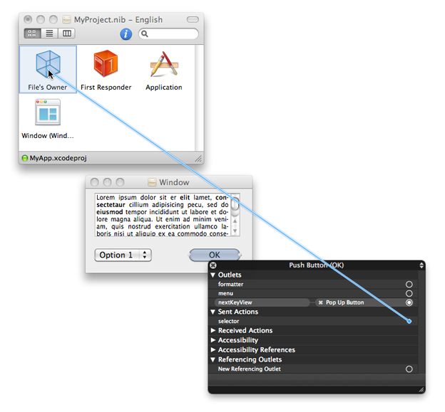
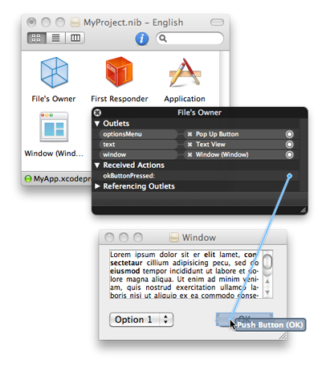
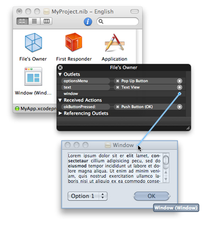
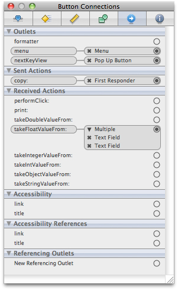
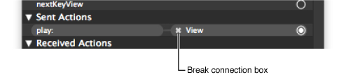
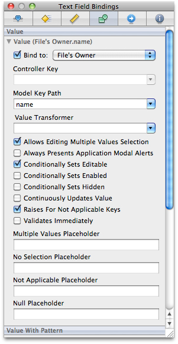
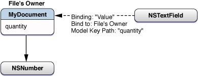
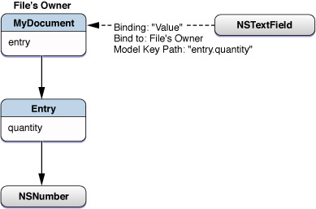
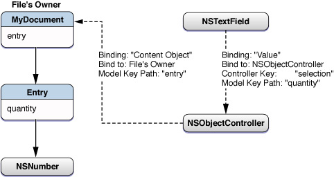
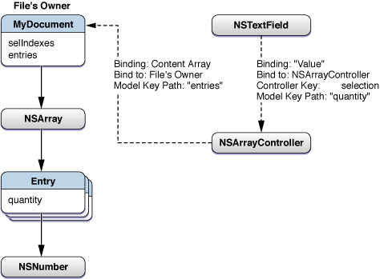

> 导航：[总目录](../../../README.md) · [documentation](../../../_indexes/documentation.md) · [Interface Builder User Guide](Introduction.md)

[Next](Xcode%20Integration.md)[Previous](Object%20Attributes.md)

# Connections and Bindings

For Mac OS X and iOS developers, the ability to connect objects at design time is a key part of the rapid development aspect of applications. Many Cocoa classes use connections to implement basic behaviors, including event handling, window management, focus management, and action dispatch. Connections are therefore an important consideration in the design of your Mac OS X Cocoa and iOS applications.

This chapter covers the techniques for creating connections and bindings using Interface Builder.

There are four fundamental types of connections you can create in a Mac OS X or iOS application:

- Outlet connections
- Action connections (Mac OS X only)
- Event connections (iOS only)
- Bindings (Mac OS X only)

An _outlet_ connection is a special type of instance variable that you specify in your source files and configure using Interface Builder. You use outlets to store references to important objects in your nib file, such as important views, controls, and controller objects. Your view classes can similarly use outlets to store references to related objects. For example, many Cocoa views use outlets to locate the data formatters, delegates, and contextual menus they should use. Because they are instance variables, you can modify outlets programmatically if you wish, but doing so is unusual. In most cases, you connect an outlet to its target object in Interface Builder and do not change the outlet later.

An _action_ connection is a message-passing relationship between a control and a target object in a Cocoa application. Whenever the user interacts with a control in a predetermined way or selects a menu item from a menu, the control or menu invokes the action method of its associated target object. You can use action methods to perform whatever tasks are needed to respond to the given interaction. For example, if the user clicked an Apply button in a panel, your action method could apply the specified settings to your application’s data structures. Clicking a push button, checking or unchecking a checkbox, or selecting an item from a pop-up menu button are all examples of control interactions that generate action messages.

An _event_ connection is similar in nature to an action connection but is specific to iOS applications. Controls in the UIKit framework can send different action messages for different types of interactions within a control. For example, a control can send separate messages when the user first touches the control and then subsequently lifts that finger from the screen. In addition each event can have multiple target objects, so that when the event occurs, different action messages are sent to each object.

Cocoa _bindings_ are a way to connect your application’s user interface to its underlying data without writing a lot of glue code to synchronize the two. Bindings take advantage of the key-value coding (KVC) and key-value observing (KVO) protocols to bridge the data in your data structures with the views you create in Interface Builder. Whenever the user changes a value in a view, the bindings code automatically propagates that change down to the associated data structure. Similarly, if your program changes the data by calling an accessor method, the bindings code propagates that change back to the associated view.

You can manage outlet, action, and event connections in Interface Builder using the inspector window or the connections panel. These two tools provide the same basic behavior but do so in slightly different ways. The Connections pane of the inspector window displays the connections associated with the currently selected object. Only the connections for the currently selected object are displayed and changing the selection changes the contents of the inspector. The connections panel, on the other hand, is an on-demand window that you can create for one or more objects simultaneously. Unlike the inspector, a connections panel displays the connections for the same object until the panel is dismissed. Its contents do not change to match the current selection.

The connection creation behavior in Interface Builder is designed to be as flexible as possible. The sections that follow describe the techniques you can use to create connections in your nib files.

If you want to make a single outlet or action connection quickly, you can do so directly from the design surface or your Interface Builder document window.

1. Control-click (or right-click) the source object of the connection and do not release the mouse button.
2. While holding the mouse button, drag to the target object.
3. Release the mouse button over the target. Interface Builder displays a prospective list of actions and outlets.
4. Select the desired outlet (of the source object) or the desired action or event (of the target object) to create the connection.

When you use the control-drag gesture to create a connection for an action, the final part of the drag involves picking the action name from a list of actions. Outlets have a similar list of outlets. If there are previous connections that have the same name, the menu items to pick those names will be flagged. If an identical connection to the one being made already exists, the menu item will be flagged with a dot. If a connection exists with that name, but to a different object, it will be flagged with a dash.

For action connections in Cocoa, this technique is equivalent to opening the connections panel and configuring the source object’s sent actions connection. Because a source object in Cocoa can send its action message to only one target object, you should use this technique only once to configure a given source object’s action connection. Repeating the process for the same source object would break the old connection before establishing the new one. You can use this technique, however, to configure each of the source object’s outlets.

The connections panel is a convenient way to create multiple connections for the same object in quick succession. To use the connections panel, do the following:

1. Control-click (or right-click) an object and release the mouse button to display the panel.
2. Click in the circle to the right of the action, outlet, or event you want to connect and begin dragging.
3. Drag the mouse over the target object for the connection. (If the target of a connection is not visible, hovering over its parent object causes the parent to open and reveal its children.)

   The target object should highlight to indicate a connection is possible. If it does not highlight, the target object is not of the right type and cannot be connected to the source object in that way.
4. If the target object highlights, release the mouse button to create the connection.
5. If you are using the connections panel to configure the sent action or referencing outlet for the object, Interface Builder displays a list of the target object’s action methods or outlets. Select the desired action method or outlet from the list to finish the connection.

   Other types of connections do not require this configuration step.

After you establish a connection, the connections panel fills the circle next to that action or outlet and displays information about the connection. Each connection also includes a close box icon that you can use to break the connection. If a received action has multiple source objects associated with it, the panel displays a disclosure triangle, which you can use to reveal the individual connections. If you select a connection, Interface Builder displays a path control at the bottom of the panel and a ‘take me there’ button for the selected connection.

The connections panel remains visible as long as you use it. If you click outside the panel (by selecting a different object in your window, for example) Interface Builder dismiss the panel automatically to get it out of your way. You can also dismiss the panel explicitly by clicking its close box.

If you want to select other objects in your nib file but do not want the connections panel to disappear, simply drag the panel to a new location. (You do not have to drag the window far; even dragging it a single pixel is sufficient.) Dragging the panel lets Interface Builder know that you want to continue using it. If you do this, however, you must dismiss the window yourself by clicking its close box when you are done.

There are two ways to create connections using the connections panel:

- You can start at the source object:

  - For Cocoa applications, connect from the sent action selector.
  - For iOS applications, connect from one of the specified events.
- You can start at the target object and connect one of its action methods to the desired source object.

To create a connection starting at the source object, Control-click it to display the connections panel and scroll to the appropriate entry. Click in the circle next to the entry and drag to the desired target object that you want to receive the action or event message, as shown in Figure 7-1. When you let go of the mouse over a valid target object, Interface Builder displays a second connections panel that lists the action methods of the target object. Selecting a method from the list completes the connection.

__Figure 7-1__  Connecting from source to target

To create a connection starting at the target object (the one that defines the action method), control-click the target object to display its connections panel. Click in the circle next to the desired action method and drag to the source object, as shown in Figure 7-2. When dragging from the target to the source object in a Cocoa application, Interface Builder does not need to display a second panel at the source object. For iOS applications, however, it displays a second panel so that you can choose the event you want to trigger the action message.

__Figure 7-2__  Connecting from target to source

When connecting from target to source, you can connect each action method multiple times. After you make the first connection, the circle next to the action method is filled to show that there is an associated source object. To connect an additional source object, simply click in the circle again and drag to the desired object. Performing this action does not remove the original connection.

Like action connections, you can create outlet connections starting at either the source or target object. Figure 7-3 shows an example of connecting an outlet starting at the outlet’s source, which in this case is the File’s Owner object. Control-clicking the File’s Owner object brings up its connections panel. From there, it is a matter of dragging from the circle next to the window outlet to the window object.

__Figure 7-3__  Connecting an outlet to the target

To connect an outlet starting at the target object, open the connections panel and click in the circle next to the New Referencing Outlet entry. From there, drag to the object that contains the desired outlet and release the mouse over that object. When you release the mouse, Interface Builder prompts you to select the outlet from a list of available outlets on the source object. Selecting an item from that list completes the connection.

The Connections pane of the inspector window (Figure 7-4) provides a summary of the outlets and actions (or events) of the selected object. You can use the inspector window to view the status of connections, to create new connections, and to break existing connections.

__Figure 7-4__  Connections inspector

To make a connection, do the following:

1. Select an object and open the connections inspector.
2. Click in the circle next to the entry you want to connect and hold the mouse button down.
3. Drag the mouse over the target object for the connection. (If the target of a connection is not visible, hovering over its parent object causes the parent to open and reveal its children.)

   The target object should highlight to indicate a connection is possible. If it does not highlight, the target object is not of the right type and cannot be connected to the source object in that way.
4. If the target object highlights, release the mouse button to create the connection.
5. If you are using the connections inspector to configure the sent action or referencing outlet for the object, Interface Builder displays a list of the target object’s action methods or outlets. Select the desired action method or outlet from the list to finish the connection.

   Other types of connections do not require this configuration step.

After you establish a connection, the connections inspector fills the circle next to that entry and displays information about the connection. Each connection also includes a close box icon that you can use to break the connection. If a received action has multiple source objects associated with it, the panel displays a disclosure triangle, which you can use to reveal the individual connections.

To break a connection using the connections panel, do the following:

1. Control-click the desired object to display its connections panel.
2. Locate the outlet or action whose connection you want to break.
3. Click the "Break connection box” next to the name of the connected object.

   

An alternative to using the connections panel is to break connections using the inspector window. The Connections pane of the inspector window lists all of the connections for the currently selected objects. To break a connection using the inspector window, you locate the connection and click its break connection box. For more information about the connections inspector, see [Making Connections Using the Inspector](#apple-f4xwc4dqnrsv64tfmyxwi33df52wszbpkridimbqga2tgnbufvbuqnznknltcmq).

The First Responder placeholder object acts as a placeholder for an object that is determined dynamically at runtime. The AppKit and UIKit frameworks use several factors to determine which object should be the First Responder, including which window is frontmost, which view has the focus, or which view is designated as the initial responder.

In Cocoa applications, many First Responder actions are initiated by menu items and other objects of your program that operate on the application, the current document, or the frontmost window. Typical actions that are dispatched to the First Responder include the following:

- Document-level operations (such as undo, save, and print)
- Pasteboard operations
- Text-manipulation operations
- Selection management operations (such as select all)
- Application-level operations (open document, hide, unhide, show help)
- Custom actions that you define

In iOS applications, touch events are delivered to the first responder initially and then passed down the responder chain as needed until an object handles the event. In most cases, the first responder is the view in which a touch occurred, but it can be other views or objects in the application.

If you have an action message that should be handled by the First Responder, you can use the First Responder placeholder object as the target object for your action. By default, the First Responder knows about the action messages supported by the system (if any) and those defined in your Xcode source files. If you want to add new action messages, you must add those messages to the First Responder’s supported list by doing the following:

1. Select the First Responder placeholder object in your Interface Builder document.
2. Open the inspector window and select the Identity pane.
3. Click the plus (+) button in the First Responder Actions section to create a new action method entry. (The new method name is selected by default.)
4. Type a new name for the method. (The syntax of the method must match the expected syntax for action methods on the given platform; see [Defining Action Methods](Xcode%20Integration.md#apple-f4xwc4dqnrsv64tfmyxwi33df52wszbpkridimbqga2tgnbufvbuqmjyfvjvomjv) for more information.)
5. Press Return to save the action method.
6. Repeat as needed to add additional action methods.

Adding action methods to the First Responder placeholder object does not add the corresponding method definition to your Xcode source files. All it does is let Interface Builder know that such a method exists in one of your program’s objects. It is up to you to ensure the method names you add to the First Responder placeholder match the names of the methods in your code. Interface Builder does not validate these method names for you. At runtime, if a method name is misspelled or does not exist in an object, the corresponding action message will never be received by the target object.

Interface Builder does not prevent you from deleting the standard system messages associated with the First Responder placeholder. Doing so removes the message name from the current nib file only.

There are two common techniques for handling menu commands in a Cocoa application:

- Connect the corresponding menu item to a First Responder method.
- Connect the menu item to a method of your custom application object or your application delegate object.

Of these two techniques, the first is somewhat more common given that many menu commands act on the current document or its contents, which are part of the responder chain. The second technique is used primarily to handle commands that are global to the application, such as displaying preferences or creating a new document. It is possible for a custom application object or its delegate to dispatch events to documents, but doing so is generally more cumbersome and prone to errors.

The behavior for connecting a menu command to an appropriate target is the same as for creating other types of connections. You can use the connections panel or do a quick connection by Control-clicking and dragging from the menu item to the desired target. For information about creating connections using these techniques, see [Making Connections Using the Connections Panel](#apple-f4xwc4dqnrsv64tfmyxwi33df52wszbpkridimbqga2tgnbufvbuqnznknltcmy) and [Making Quick Connections By Dragging](#apple-f4xwc4dqnrsv64tfmyxwi33df52wszbpkridimbqga2tgnbufvbuqnznknltcna).

Introduced in Mac OS X v10.3, Cocoa bindings are a controller-layer mechanism used to synchronize the view and model layers of your Cocoa application. Bindings establish a mediated connection between a view and a piece of data, binding them in such a way that a change in one is reflected in the other. You can use bindings to replace the traditional glue code (action messages and custom synchronization code) that you would normally write to synchronize your application’s user interface. For example, you might use bindings to tie a property in one of your custom data objects to a text field in your user interface. As the user changes the value in that field, the bindings code automatically updates the corresponding data object; conversely, if you change the property programmatically, bindings propagate the change back to the text field.

One of the advantages of using bindings over traditional glue code is that you can use Interface Builder to configure them. Objects with bindable properties can expose those properties in Interface Builder through their Interface Builder plug-in object. For each exposed binding, Interface Builder creates an interface that lets the user configure that binding directly using the bindings inspector. The configured bindings are then saved in the nib file and recreated at runtime like other types of connections.

You configure bindings in Interface Builder by starting at the object that exposes a bindable property. Typically, this object is a Cocoa view or controller object, although you can also expose bindable properties from your own custom objects using an Interface Builder plug-in. You then use the Bindings pane of the inspector window to specify the target of the binding and the binding options. You must configure each binding separately and each binding can be attached to a different target object if desired. The target of a binding is always one of the recognized controller objects in your nib file, which typically includes the File’s Owner, the application, the shared user defaults controller, and any custom controller objects (especially `NSController` objects) you add to the nib file.

For more information about how Cocoa bindings work, see _[Cocoa Bindings Programming Topics](../../Cocoa/Cocoa%20Bindings%20Programming%20Topics/Introduction%20to%20Cocoa%20Bindings%20Programming%20Topics.md#apple-f4xwc4dqnrsv64tfmyxwi33df52wszbpgeydambqge3do2i)_.

In Interface Builder, you typically bind Cocoa views and controller objects in your nib file to the data in your custom controller objects. The high-level process for creating a binding in Interface Builder is as follows:

1. Create the views needed to display your data.
2. Create any intermediate controller objects needed to manage your data. (Typical controller objects include instances of your custom `NSDocument` or `NSWindowController` subclasses, `NSController` subclasses, or custom `NSObject` subclasses that you create to manage your data structures.)
3. Use the Bindings pane of the inspector window (Figure 7-5) to configure each desired binding.

   __Figure 7-5__  Bindings inspector

   

Although each binding displays several configuration options, the most important part of a binding is the target of the binding. You must configure, at a minimum, the following fields for any given binding:

- Bind to
- Model Key Path

The Bind to field specifies the controller object to use as the starting point for accessing the target data. The Model Key Path field contains a string representing the key path for the desired data. Key path strings are of the form `<property_name>[.<property_name>]*`. The first property name in this string is a property on the controller object specified by the Bind to field. Each subsequent property name corresponds to a property of the object returned by the previous property name. Say, for example, that you have a custom controller object and the key path string “`person.address.street`“. The `person` property returns the person object of the bound controller. The `address` property returns the address of the corresponding person object. And the `street` property returns the desired data value stored in the address object.

Because key paths are dependent on your data model, the best way to understand how to configure them in Interface Builder is to go through some examples. The following sections show how to bind a text field to an `NSNumber` object so as to display the number value in that text field. In each successive example, the data model used to access the number value gets progressively more complex, and so the bindings must be adjusted to compensate for the increased complexity.

For additional bindings examples, see _[Cocoa Bindings Programming Topics](../../Cocoa/Cocoa%20Bindings%20Programming%20Topics/Introduction%20to%20Cocoa%20Bindings%20Programming%20Topics.md#apple-f4xwc4dqnrsv64tfmyxwi33df52wszbpgeydambqge3do2i)_. For information about the key fields in the bindings inspector, see [Configuring the Attributes of a Binding](#apple-f4xwc4dqnrsv64tfmyxwi33df52wszbpkridimbqga2tgnbufvbuqnznknltcni).

Figure 7-6 shows a simple relationship between a document object and some data. In this case, the document object contains an instance variable called `quantity` that contains a pointer to an `NSNumber` object. (The document also implements the `quantity` and `setQuantity:` accessor methods, which are the KVC-compliant methods for accessing the data.) To display the value from `quantity` in the text field, you would configure the “value” binding for the text field. For this binding, you would set the target object to the document (File's Owner) and the model key path to the string “quantity”.

__Figure 7-6__  A simple bindings example

The following example builds on the example in [Binding Directly to the Value](#apple-f4xwc4dqnrsv64tfmyxwi33df52wszbpkridimbqga2tgnbufvbuqnznknltcny) by introducing an intermediate object between the document and the `NSNumber` object. In this case, the document now contains an `Entry` object, which is a generic data object based on the `NSObject` class.

Figure 7-7 shows the data model relationships for the document and also shows one way to bind a text field to the `quantity` attribute of the `Entry` object. In this case, the text field binds to the document (File's Owner) and has a key path that includes both the `entry` property of the document and the `quantity` property of the `Entry` object.

__Figure 7-7__  Binding through another data object

Although the preceding example would work when the document’s `entry` property is non-`nil`, a problem arises if `entry` ever becomes `nil`. When Cocoa encounters a `nil` value in the middle of a key path, it generates a runtime error. This error does not abort your program but it does prevent Cocoa from retrieving and setting the bound value, which is certainly undesirable.

Rather than binding the text field directly to the File’s Owner, as in the previous example, a better solution is to bind the text field to the value through an `NSObjectController` object. Controller objects act somewhat like a buffer layer between your views and data object. In this case, the controller object acts as a placeholder for the document’s current `Entry` object, providing a valid binding target even if the document’s `entry` property is `nil`.

Figure 7-8 therefore shows the newly introduced object controller and the revised bindings paths. Now, the text field binds to the object controller as if it were the document’s `Entry` object. The object controller, in turn, binds to the `entry` property of the document.

__Figure 7-8__  Binding through an object controller

Because it knows about controllers and their properties, Interface Builder displays the bindable properties of the selected controller object in the Controller Key popup menu. You typically set the value of this field to either `selection` or `selectedObjects`, depending on your needs. To finish your binding, you add the target property in the Model Key Path field, which in this case is `quantity`. Cocoa combines the strings in the Controller Key and Model Key Path fields to get the final key path. In this case, the final key path would be `selection.quantity`.

Using controller objects, it is as simple to bind to a collection of objects as it is to bind to a single object. In fact, the bindings themselves are almost identical. In the example at hand, instead of binding to a single `Entry` object, you would bind the text field to a collection of `Entry` objects through an `NSArrayController` object. The array controller manages both the collection of objects and the list of indexes corresponding to the selected objects and uses that information to provide an appropriate value to the text field.

Figure 7-9 shows the data model for the revised document, which now contains an array of `Entry` objects. You would then bind the text field to an `NSArrayController` object’s selection property, which represents the currently selected `Entry` object, and specify the `quantity` string for the key path to finish the binding.

__Figure 7-9__  Binding to an array of objects

Although the array controller manages the selection indexes for you, you can bind an `NSMutableIndexSet` object to the array controller if you want to keep track of the currently selected indexes. You might store the selected index information as part of your document format. You can also use the index set to change the currently selected objects (instead of using the methods of the `NSArrayController` class). When modifying your bound index set directly, however, you must do so in a KVO-compliant manner by calling the `willChangeValueForKey:` and `didChangeValueForKey:` methods before and after you make your changes. If you forget to call these methods, the array controller may not notice your changes.

Although the bindings inspector may seem complex at first, for many bindings, you need to configure only a few options initially. You may not need to configure every option every time (except for the Bind to and Model Key Path fields). During your initial design phase, you can probably leave most of the options configured with their default values. As you improve your design, you can customize the options more until you have the behavior you want.

Table 7-1 lists some of the key attributes used in most binding entries. Except where noted otherwise, all attributes are optional.

__Table 7-1__  Common binding attributes

| Binding attribute | Description |
| Bind to: | (Required) The controller object in your nib file that serves as the starting point of the binding. The first entry in the corresponding key path must correspond to a property in this object. |
| Controller Key | An attribute of an `NSController` object. When binding to an `NSController` object, you use this field to select the first entry in the key path. The menu associated with this field displays the properties available on the selected controller object as a convenience. You can type the name of the property or simply select it from the provided list. |
| Model Key Path | (Required) The key path to the desired data value. The string you enter into this field is a period-separated list of keywords, each of which represents a property of an object in the path. The objects and properties represented by this key path must exist or Cocoa will be unable to bind to the value. If you specified a value in the Controller Key field, that value is added to the beginning of this string during resolution of the key path. The format of entries in this field is `<property_name>[.<property_name>]*`. |
| Value Transformer | The name of the value transformer object you want to use to use with this binding. Value transformers let the Cocoa bindings code adjust unknown data formats to a format compatible with the corresponding view. The name you specify in this field corresponds to the name under which your value transformer object is registered in your code, which may or may not correspond to the actual class name. For more information about creating and using value transformers, see _[Value Transformer Programming Guide](../../Cocoa/Value%20Transformer%20Programming%20Guide/Introduction%20to%20Value%20Transformers.md#apple-f4xwc4dqnrsv64tfmyxwi33df52wszbpgeydambqge3tk2i)_. |
| Multiple Values Placeholder | The behavior of a view when the binding is associated with multiple objects. The exact configuration of this field depends on the type of the object exposing the binding. For views and controls, you use this field to specify the default behavior (or value) of the view when multiple objects are selected. |
| No Selection Placeholder | The behavior of a view when the binding is associated with a valid set of objects but none of them are actually selected. The exact configuration of this field depends on the type of the object exposing the binding. For views and controls, you use this field to specify the default behavior (or value) of the view when there is no selection. |
| Not Applicable Placeholder | The behavior of a view when an exception is raised because the key of an object cannot be applied for some reason. This might occur if the specified object is not key-value coding compliant for the specified key. |
| Null Placeholder | The behavior of a view when the binding is associated with a `nil` object. The exact configuration of this field depends on the type of the object. For views and controls, you can use this field to specify a default value to display. |

For an exact list of bindings available for a given view or controller object, see _[Cocoa Bindings Reference](../../Cocoa/Cocoa%20Bindings%20Reference/Introduction%20to%20Cocoa%20Bindings%20Reference.md#apple-f4xwc4dqnrsv64tfmyxwi33df52wszbpgeydambqge4ds2i)_.

Although you can bind the views of your user interface to any key-value coding (KVC) and key-value observing (KVO) compliant object, it is strongly recommended that you use an intermediate Cocoa controller object to manage the bindings for you. Cocoa controller objects are instances of the `NSController` class that manage bindings-related behavior. These objects provide several very important features, including the following:

- Controller objects manage their own current selection and placeholder values, providing appropriate values if the selection is empty.
- Controller objects implement the `NSEditor` and `NSEditorRegistration` protocols, which provide the associated view with a way to negotiate uncommitted changes between itself and the controller.
- Controller objects eliminate the need for complex management code. Nearly all of your controller object setup is done in Interface Builder.
- Most controllers provide default actions for manipulating the managed content.

Cocoa provides controller objects for managing several different types of data objects. Most of these controllers enable you to manage collections of objects, with the controller object itself managing things like the currently selected objects. Table 7-2 lists the available controller object classes along with information about when you might use each one and how you configure its attributes.

__Table 7-2__  Cocoa controller objects

| Class | Description |
| `NSObjectController` | Manages any single `NSObject` instance. Use this controller to manage a single custom object and its properties. When configuring the attributes for this controller, the Class Name field (in the Attributes pane of the inspector) should contain the class of the object being managed. |
| `NSArrayController` | Manages the contents of an `NSArray` or `NSSet` object. (You can also use this controller to manage custom data objects that implement ordered sets of data. For more information, see _[Cocoa Bindings Programming Topics](../../Cocoa/Cocoa%20Bindings%20Programming%20Topics/Introduction%20to%20Cocoa%20Bindings%20Programming%20Topics.md#apple-f4xwc4dqnrsv64tfmyxwi33df52wszbpgeydambqge3do2i)_.) An array controller tracks not only the contents of the array or set but also the subset of objects in the set that represent the current selection. When configuring the attributes for this controller, the Class Name field (in the Attributes pane of the inspector) should contain the class of the objects in the array and not the class of the array itself. |
| `NSTreeController` | Manages a custom set of objects organized in a tree structure. When configuring this controller, you must specify the keys used to access child objects in the tree. In addition, the Class Name field (in the Attributes pane of the inspector) should contain the class of the objects in the tree. For more information, see [Configuring an NSTreeController Object](#apple-f4xwc4dqnrsv64tfmyxwi33df52wszbpkridimbqga2tgnbufvbuqnznknltemy). |
| `NSUserDefaultsController` | Provides your application with access to the application’s defaults database. You typically use this controller to implement preferences panels by binding the controls in your preferences window to keys in the defaults database. The user defaults controller does not use object class name information. For more information, see [Using the Shared User Defaults Controller](#apple-f4xwc4dqnrsv64tfmyxwi33df52wszbpkridimbqga2tgnbufvbuqnznknltena). |
| `NSDictionaryController` | Introduced in Mac OS X v10.5, this controller manages the keys and values inside an `NSDictionary` object. The controller turns the contents of the dictionary into an array of key-value pairs that can be bound to user interface items, such as columns in a table view. For more information about using this object, see _[NSDictionaryController Class Reference](https://developer.apple.com/documentation/appkit/nsdictionarycontroller)_. |

When creating bindings in your nib file, you should always use Cocoa controller objects when you are binding through some intermediate object. In other words, unless you are binding directly to a scalar type, you should probably be using a Cocoa controller object to manage the objects in your binding key path.

In the Attributes pane of the inspector window, many controllers let you specify a list of key names. These keys represent the properties of the managed object to which clients can bind themselves. Adding keys to this list is a shortcut that eliminates the need to type the key name each time you want to bind to them. Interface Builder displays the key names in the Model Key Path field’s popup menu whenever you bind to the corresponding controller object. To finish the binding, simply select the key from this menu.

For more information about object management in controllers, see _[Cocoa Bindings Programming Topics](../../Cocoa/Cocoa%20Bindings%20Programming%20Topics/Introduction%20to%20Cocoa%20Bindings%20Programming%20Topics.md#apple-f4xwc4dqnrsv64tfmyxwi33df52wszbpgeydambqge3do2i)_.

If your program contains a custom tree data structure, you can use an `NSTreeController` object to coordinate bindings to the objects in that data structure. Tree controllers are often used to bind data objects to an `NSBrowser` or `NSOutlineView` object in order to display hierarchical sets of data to the user.

To configure a tree controller object, do the following:

1. Add the tree controller object to your document and select it.
2. Open the inspector window and select the Attributes pane.
3. Fill in the Object Controller section.

   - In Class Name field, specify the class name of the objects in the tree.
   - Optionally, specify any custom keys of the tree objects that you want to expose in the Model Key Path field of the bindings inspector.
4. Fill in the Tree Controller section.

   - In the Children field, specify the key path for the property that identifies the child nodes of a given tree object.
   - In the Count field, specify the key path for the property that indicates how many children a given tree object has. (This key path is optional.)
   - In the Leaf field, specify the key path for the property that identifies whether the current tree object is a leaf node. (This key path is optional but recommended because it can improve the tree controller’s performance as it navigates your tree at runtime.)

For more information on using tree controllers, see _[Cocoa Bindings Programming Topics](../../Cocoa/Cocoa%20Bindings%20Programming%20Topics/Introduction%20to%20Cocoa%20Bindings%20Programming%20Topics.md#apple-f4xwc4dqnrsv64tfmyxwi33df52wszbpgeydambqge3do2i)_.

An `NSUserDefaultsController` object is most often used when implementing a preferences window or in any situation where you want to bind a view to values in the defaults database. Although you can add a new `NSUserDefaultsController` objects to your nib file, you generally do not need to do so. Interface Builder provides a shared user defaults controller object that you can use to bind to your application’s preferences.

To use the shared defaults controller to implement your application’s preferences window, you would do the following:

1. Select the control you want to bind to a preference.
2. Open the inspector window and select the Bindings pane.
3. In the appropriate binding for your control, set the Bind to field to Shared User Defaults Controller.
4. In the Model Key Path field, enter the key name of the preference you want to associate with the control.

By default, the shared user defaults controller sets the value in the Controller Key field to "values”. Individual preference values are accessed through this property on the user defaults controller, so you should leave this field configured as is.

For more information on configuring user defaults bindings, see [User Defaults and Bindings](https://developer.apple.com/library/archive/documentation/Cocoa/Conceptual/CocoaBindings/Concepts/NSUserDefaultsController.html#//apple_ref/doc/uid/TP40001092) in _[Cocoa Bindings Programming Topics](../../Cocoa/Cocoa%20Bindings%20Programming%20Topics/Introduction%20to%20Cocoa%20Bindings%20Programming%20Topics.md#apple-f4xwc4dqnrsv64tfmyxwi33df52wszbpgeydambqge3do2i)_.

Copying and pasting objects also copies and pastes outlets, actions, and bindings. If the logical source of the connection is copied and pasted, the paste operation duplicates the connection. Action connections are duplicated to and from the pasteboard with the control but not the controller. Outlet connections are duplicated to and from the pasteboard with the object that declares the outlet, not the object the outlet points to. Bindings are duplicated to and from the pasteboard with the bound objects, not the controllers the objects are bound to.

Here are some examples:

- Duplicating a table view would duplicate the delegate and data source outlets.
- Duplicating a "My Application Delegate" controller object would duplicate all of its outlet connections.
- Duplicating a table view would duplicate all of its bindings to controllers.

[Next](Xcode%20Integration.md)[Previous](Object%20Attributes.md)

