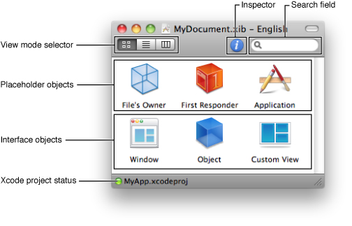
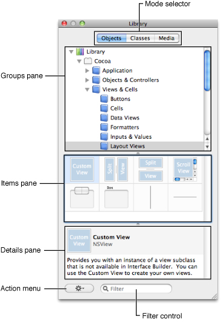
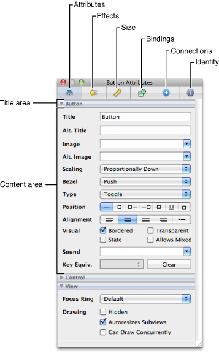
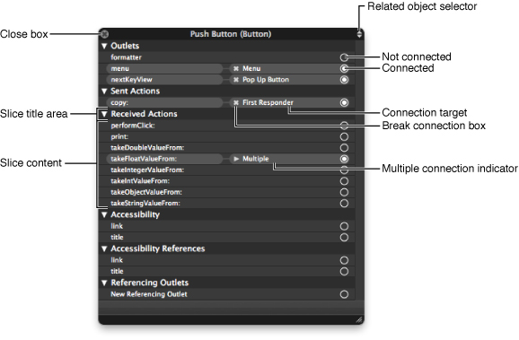
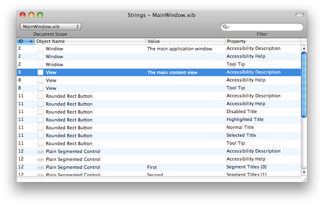
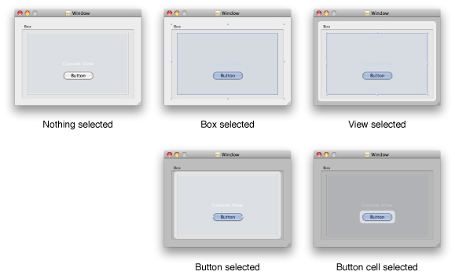
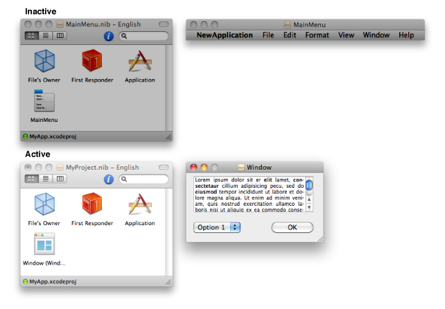

> 导航：[总目录](../../../README.md) · [documentation](../../../_indexes/documentation.md) · [Interface Builder User Guide](Introduction.md)

[Next](Nib%20File%20Management.md)[Previous](Interface%20Builder%20Quick%20Start.md)

# Interface Builder Basic Concepts

Interface Builder is the application you use to assemble the visual components (such as windows and menus) of your application. In Interface Builder, you assemble your windows and menus by dragging preconfigured objects into an Interface Builder document. You can reposition those objects and change their attributes as needed to achieve the desired look for your interface. For some application types, you can even create explicit relationships between those objects, which ultimately result in the creation of links between objects at runtime.

This chapter provides a high-level overview of the concepts surrounding the Interface Builder application, including an introduction to nib files (the Interface Builder document type) and the basic features of the Interface Builder application. If you have never used Interface Builder before, you should read this chapter at least once to familiarize yourself with these fundamental concepts. While reading this chapter, you may also want to have the Interface Builder application open so that you can explore features as you read about them.

Each Interface Builder document stores information about one or more objects you want to create at runtime in your application. Most of these objects are visual in nature. Typical objects include windows, views, controls, and menus. Some application types let you specify non-visual objects as well, such as the controller objects your application uses to manage its windows and views.

Figure 2-1 shows a sample Interface Builder document along with some of the objects it contains. The toolbar includes several controls to help you manage the contents of the document and the status bar contains information about the document’s association with an Xcode project (if any).

__Figure 2-1__  Interface Builder document window

Table 2-1 lists the key controls in the Interface Builder document’s toolbar and how you use them to manage the document’s contents.

__Table 2-1__  Interface Builder document controls

| Control | Description |
| View mode selector | Lets you pick between Icon, Outline, and Browser modes for viewing your document contents. Icon mode shows the key objects of your nib file only. Outline mode displays the objects in a hierarchical tree that reflects the parent-child relationships between the objects. Browser mode also shows the parent-child relationships between objects but using a browser control. |
| Information button | Displays basic information about the document’s configuration, including which platform and OS versions it supports. |
| Library button | Displays the Interface Builder Library window. See [The Library Window](#apple-f4xwc4dqnrsv64tfmyxwi33df52wszbpkridimbqga2tgnbufvbuqmznknltcoa). |
| Inspector button | Displays the Interface Builder inspector window. See [The Inspector Window](#apple-f4xwc4dqnrsv64tfmyxwi33df52wszbpkridimbqga2tgnbufvbuqmznknltcny). |
| Search field | Lets you search for objects in the document by name. Search results are automatically displayed in the Outline view mode. |

In addition to the document toolbar, Interface Builder includes a View menu that you can use to modify the presentation of the document. This menu contains commands that perform the same functions as the toolbar’s view mode selector. In addition, you can use this menu to customize the toolbar in various ways.

The content area of the document displays the objects that are created or referenced when the document is loaded by your application at runtime. There are two basic types of objects that can appear in this area: interface objects and placeholder objects. _Interface objects_ are the objects that are actually created when the document is loaded and typically comprise the bulk of the objects. _Placeholder objects_ are used to refer to objects that live outside of the document but which are intimately tied to the contents of the document.

When you save an Interface Builder document, you save it using either the xib file or nib file format. Both formats store the same information but do so in different ways. _Xib files_ are intermediate XML–based files that are intended for use only during the development of your project. Because they are text-based, you can save them in your source-code management system and perform diffs on them. During deployment, xib files are converted to _nib files_, which contain a binary version of the document data and are what your application actually loads at runtime. For any new projects, you should save your documents as xib files. For existing projects, you can also save your documents directly to the nib file format.

For more information about the objects you put in your nib files, including interface and placeholder objects, see [Nib Objects](Nib%20Objects.md#apple-f4xwc4dqnrsv64tfmyxwi33df52wszbpkridimbqga2tgnbufvbuqmjsfvjvomi). For more information about the xib and nib file formats and when you should use each one, see [About Nib and Xib Files](Nib%20File%20Management.md#apple-f4xwc4dqnrsv64tfmyxwi33df52wszbpkridimbqga2tgnbufvbuqmjrfvjvomq).

Interface Builder provides several tools to help you create your nib files. The following sections provide an overview of these tools and how you use them.

The Library window contains the objects and resources you add to your Interface Builder documents. The Library window has three modes that distinguish the type of items you can access. When object mode is selected, the window displays the objects you use to build the user interface of your application; this mode includes windows, menus, views, controls, and many other types of objects. In classes mode, the window displays the classes you can use to build the user interface in your project, including your custom classes. In media mode, the window displays the image and sound resources you can refer to from your objects.

Figure 2-2 shows the Library window in object mode. In all three modes, the window is organized into three primary panes. The Organization pane lists the groups (some of which are organized hierarchically) containing individual items. The Item pane displays the items in the currently selected groups. The Detail pane shows information about the currently selected item.

__Figure 2-2__  The Library window

The Library window is context sensitive, always showing you the objects supported by the currently active Interface Builder document. You can organize the contents of the Library window in several different ways, including the following:

- Type a string in the Filter field to display only those items whose name or type matches the specified text.
- Select one or more groups in the Organization pane to display items from only those groups.
- Create custom groups and add specific items to those groups.
- Create smart groups to display items that match dynamically-determined criteria, such as when they were last used.
- Rearrange items within a custom group.

For more information on how to customize the Library window, including its contents, see [Customizing the Library Window](Interface%20Builder%20Customization.md#apple-f4xwc4dqnrsv64tfmyxwi33df52wszbpkridimbqga2tgnbufvbuqmjwfvjvomq).

To add objects or media to your document, simply drag the desired items out of the Library window’s Item pane and drop them where you want them in your document. Some items, such as windows and menus, can be added only at the top-level of your document. Other items can be dropped onto other items. For example, if you already have a window object in your document, you can drop views and controls directly onto that window (as opposed to on your document). Interface Builder provides feedback about valid drop destinations to help you determine where to place items.

The Library window provides a central place to view and manage classes. Experienced users of Interface Builder may recognize some of the same features found in the class hierarchy browser in Interface Builder 2.x.

You can use the classes tab to:

- Instantiate a class
- View the lineage of a class
- Find out where a class is defined
- Open a class definition file in Xcode
- View the actions and outlets for a class
- Define custom classes for a project
- Add actions and outlets to a custom class
- Write out updated class files

The classes tab in the Library window contains a hierarchical view of all the classes that Interface Builder knows about for a given Xcode project. This class information is drawn from four sources: project headers, Interface Builder plugins, linked frameworks, and the Interface Builder document itself. These four different sources are reflected in the definitions detail view.

When you select a class, the details pane displays information about the selected class such as its inheritance (lineage detail view), the sources from which Interface Builder has gathered information about the class (definitions detail view), class outlets (outlets detail view), and class actions (actions detail view).

A useful by-product of this central repository of class information is that you can easily instantiate classes that are not defined in an Interface Builder plugin. When Interface Builder builds the list of classes, it looks for the actual objects in the Objects library that most closely match the classes. If you create a subclass of `NSButton` in your code and call it `MyButton`, for example, and you drag `MyButton` out of the Classes library, you drag out an `NSButton`, not just an `NSObject` instance.

Even though Interface Builder has a central place for class management, the definition of your custom classes (changing the superclass, adding outlets and actions, and so on) should be done in Xcode. The ability to add new classes by subclassing in the classes tab or adding actions and outlets is more a prototyping benefit.

Because the classes tab makes it easy to instantiate your custom classes, the recommended workflow becomes:

1. Create your custom classes in Xcode.
2. Instantiate them in Interface Builder by dragging them out of the Classes library.

This eliminates the need to drag out a generic view or object and then set its custom class.

The inspector window displays the attributes for the currently selected objects along with controls for adjusting those attributes. Because most objects have a large number of configurable attributes, the inspector window is divided into multiple panes, each of which displays a specific set of attributes. Each pane is then further divided into sections, which can be collapsed to save space.

Figure 2-3 shows the Attributes pane of the inspector window for a Cocoa button. Clicking one of the mode icons along the top of the window selects that pane and displays the associated attribute sections. Changes made in the inspector window take effect immediately for the selected object.

__Figure 2-3__  The inspector window

Table 2-2 lists the different panes found in the standard inspector windows and describes their behavior. Cocoa inspectors use all of the panes listed in this table. Cocoa Touch and Carbon inspectors use a subset of panes, which are indicated in the table. This table lists the panes in left-to-right order as they appear in the inspector window.

__Table 2-2__  Inspector pane behavior

| Inspector pane | Description |
| Attributes | Displays the object-specific configuration attributes. For Cocoa and Cocoa Touch objects, the sections in this pane reflect the classes in the inheritance hierarchy of the selected object. For Carbon objects, the sections reflect opaque type groupings. For more information, see [Object Attributes](Object%20Attributes.md#apple-f4xwc4dqnrsv64tfmyxwi33df52wszbpkridimbqga2tgnbufvbuqmrqfvjvomi). |
| Effects | Displays the Core Animation–based and Core Graphics–based attributes associated with the object. You can use this pane to add transparency and shadow effects and apply other types of effects and filters. This pane applies to Cocoa objects only. For more information, see [Attaching Graphical Effects in Mac OS X](Object%20Attributes.md#apple-f4xwc4dqnrsv64tfmyxwi33df52wszbpkridimbqga2tgnbufvbuqmrqfvjvomq). |
| Size | Displays information about the size and position of the object and also displays alignment controls and autosizing attributes. This pane applies only to objects that have this information, typically visual objects such as windows, views, and cells. For more information, see [Interface Layout](Interface%20Layout.md#apple-f4xwc4dqnrsv64tfmyxwi33df52wszbpkridimbqga2tgnbufvbuqmjzfvjvomi). |
| Bindings | Displays the available bindings for an object and provides an interface for binding those objects to one or more controllers. This pane applies to Cocoa objects only. For more information, see [Connections and Bindings](Connections%20and%20Bindings.md#apple-f4xwc4dqnrsv64tfmyxwi33df52wszbpkridimbqga2tgnbufvbuqnznknltc). |
| Connections | Displays the outlets and actions of the object along with information about which ones are currently connected to other objects. In addition to viewing these connections, you can also use this pane to remove a connection. This pane applies to Cocoa and Cocoa Touch objects only. For more information, see [Connections and Bindings](Connections%20and%20Bindings.md#apple-f4xwc4dqnrsv64tfmyxwi33df52wszbpkridimbqga2tgnbufvbuqnznknltc). |
| Identity | Displays information that helps identify the object, either at design time or runtime. You use this pane to set the exact type of an object and assign other descriptive information. This information is usually set once and never changed. For more information, see [Object Attributes](Object%20Attributes.md#apple-f4xwc4dqnrsv64tfmyxwi33df52wszbpkridimbqga2tgnbufvbuqmrqfvjvomi). |

Each pane of the inspector window displays as much information as possible when multiple objects are selected. The Attributes pane in particular displays all of the sections that are common to the currently selected objects. For example, if a Cocoa text field and button are selected, the inspector window displays the Control and View sections but does not display the Button or Text Field sections. If a given pane cannot display any relevant information, it instead displays a message to that effect.

For documents used on the Cocoa and Cocoa Touch platforms, the _connections panel_ is a quick way to create and manage the connections for a particular object. (You can also use the Connections pane of the inspector window.) You display the connections panel by Control-clicking (or right-clicking) an object. The panel is organized into several sections that identify the different types of connections that can be made to and from the object. You use it to create connections for outlets and actions only; to configure Cocoa bindings, you must use the inspector window.

Figure 2-4 shows the connections panel for a button and [Table 2-3](#apple-f4xwc4dqnrsv64tfmyxwi33df52wszbpkridimbqga2tgnbufvbuqmznknltq) lists the sections that may be displayed by the panel. If an outlet or action is currently connected, information about that connection is displayed to the right of the outlet or action name. You can create new connections by clicking in the circle to the right of the outlet or action name and dragging to the target object. To break existing connections, click in the break connection box next to the connection target.

__Figure 2-4__  Connections panel

__Table 2-3__  Connections panel section descriptions

| Section | Description |
| Outlets | Lists the outlets exposed by the object. An _outlet_ is a member variable of the class that has the `IBOutlet` keyword associated with it. Outlets let you create inter-object references from within Interface Builder. For information about adding outlets to an object, see [Defining Outlets](Xcode%20Integration.md#apple-f4xwc4dqnrsv64tfmyxwi33df52wszbpkridimbqga2tgnbufvbuqmjyfvjvomjt). |
| Sent Actions | Shows the target of a control’s action message. An _action_ is a message that is sent by a control in response to a user interaction. For example, when a user clicks a button, the button object sends its action message to the associated target object.  In Mac OS X applications, a control sends its action message to a single target object. In iOS applications, a control may send several different action messages in response to different types of user interaction with the control and it may send those messages to multiple target objects. |
| Received Actions | Lists the incoming actions that the current object is capable of handling. Each of these entries corresponds to a member method of the object. A received action may be associated with multiple objects. For information about defining an object’s action methods, see [Defining Action Methods](Xcode%20Integration.md#apple-f4xwc4dqnrsv64tfmyxwi33df52wszbpkridimbqga2tgnbufvbuqmjyfvjvomjv). |
| Accessibility | Lists standard outlets for storing accessibility related information. These outlets are present for all visual elements. |
| Accessibility References | Lists the source objects that refer directly to the selected object through an accessibility connection. |
| Referencing Outlets | Lists the source objects that currently refer to this object through an outlet. This section can list multiple sources. |

When you control-click an object, the connections panel appears at the point where you clicked. If you click another object without moving the panel, the panel disappears automatically. This is convenient if you want to make a connection quickly and then work on other objects. To keep the panel from disappearing automatically, simply drag the panel away from its original position. Any change in position causes the panel to remain visible. To close a panel that is still visible, click its close box.

Although the connections panel displays the outlets and actions for the clicked object, you can use the same panel to display the outlets and actions for nearby objects as well. The popup menu in the upper-right corner of the panel lists all of the objects at the current mouse location. You can use this menu to access objects that overlap each other on the design surface and might otherwise be hard to click on directly.

For more information about creating and managing connections in an Interface Builder document, see [Connections and Bindings](Connections%20and%20Bindings.md#apple-f4xwc4dqnrsv64tfmyxwi33df52wszbpkridimbqga2tgnbufvbuqnznknltc).

Objects in nib files can have many associated strings. If your application has many nib files, or one large nib file, you may want to ensure that you name similar objects consistently. The easiest way to ensure the consistency of the strings in your nib files is to edit them using the strings window, shown in Figure 2-5. To view this window, choose Tools > Strings.

__Figure 2-5__  The strings window

The strings window displays the strings from all objects in all open nib files by default. There are a few ways to narrow the list of strings though:

- Use the Document Scope control to show the strings from only the selected nib file.
- Use the Filter control to list only entries that match the specified text.
- Use the Filter control’s menu to exclude strings that do not have a value.
- Choose Edit > Find > Find to locate strings whose value matches the specified text.

You can edit strings directly from the Strings window by double-clicking the value of an entry and typing a new value. To sort the strings, click on the appropriate column header.

Interface Builder provides extensive support for undo, drag-and-drop, and pasteboard operations. All actions described in this document are undoable unless otherwise noted. In addition to basic support for these features, Interface Builder also supports several common interaction behaviors. The following sections describe these behaviors.

Interface Builder uses the standard modifier keys to modify the way it treats objects. For a summary of modifier key actions, see [Modifier Keys](Interface%20Builder%20Gesture%20Guide.md#apple-f4xwc4dqnrsv64tfmyxwi33df52wszbpkridimbqga2tgnbufvbuqmrtfvjvoni).

Interface Builder helps you select exactly what you want with as few clicks as possible. In most cases, when you click in a window, Interface Builder selects the object directly under the mouse, even if that object is embedded in one or more container views.

In some cases, however, clicking an object might not select that object directly. For example, clicking on a scroller in a scroll view always selects the scroll view first. This happens because the scroll view is considered more important than the scroller. Similarly, when clicking a control, the control, and not its cell, is selected first. The parent object in each case decides whether it wants to handle the initial click. If it does, you can use the _click-wait-click_ approach to select the child object:

1. Click the parent object to select it.
2. Wait for a second or so.
3. Click the child object to select the child object.

Most other selection behaviors work the same way in Interface Builder as they do in other applications. For example, you can use the Shift and Command keys to extend or toggle the selection of items. Interface Builder does impose some restrictions when selecting multiple objects, however. All objects in a selection must have the same parent object.

Figure 2-6 shows how Interface Builder reflects the currently selected item in a window. The selected item is drawn with one or more resize handles and an optional change in shading. The parent of the selected item is drawn normally, but everything outside of that parent’s frame is shaded. You can use these visual cues, along with the title of the inspector window, to help determine which item is currently selected.

__Figure 2-6__  Appearance of selected items

For the most part, you select objects by clicking directly on them directly from the design surface. In some cases, however, it might be difficult to click an object directly. For example, a tab-less tab view acts as a container for multiple subviews but only one subview at a time is visible. What’s more, the tab view itself is typically obscured by its own subview. In such a case, you can select any of the obscured views using one of the following techniques:

- Set the viewing mode of your Interface Builder document window to Outline or Browser mode and select the object there.
- Control-Shift click (or Shift right-click) the object obscuring the desired view and select the desired object from the menu that appears.

Control-Shift clicking an object is a way to select any of the objects that lie directly beneath the mouse. When you do it, Interface Builder displays a menu, from which you can select the desired object.

Although you can have multiple Interface Builder documents open at the same time, only one can be active at any given time. To avoid confusion during editing, any windows that belong to an inactive document are dimmed to indicate their relationship to their state (see Figure 2-7). This makes it easier to determine which windows belong to the current document and which document is currently active. Even if a particular document is inactive, you can still drag and drop items between it and other documents, however. Doing so copies the item from the active document to the target document. You can also use the pasteboard to move items.

__Figure 2-7__  Shading of active and inactive documents

[Next](Nib%20File%20Management.md)[Previous](Interface%20Builder%20Quick%20Start.md)

