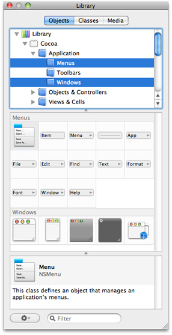
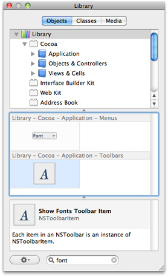
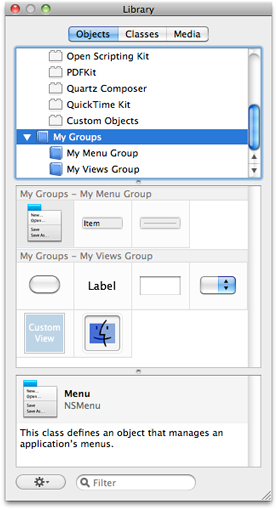
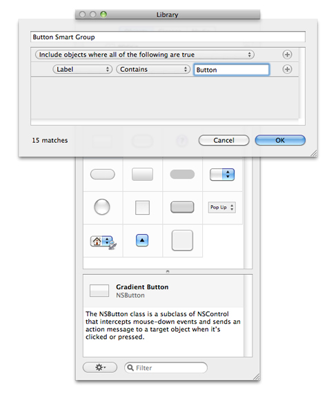
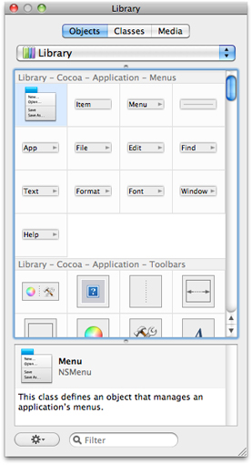

> 导航：[总目录](../../../README.md) · [documentation](../../../_indexes/documentation.md) · [Interface Builder User Guide](Introduction.md)

[Next](Interface%20Builder%20Gesture%20Guide.md)[Previous](Localization.md)

# Interface Builder Customization

Interface Builder supports a number of customizations to its workflow environment that are designed to make working with the tool easier. Most of these changes are designed to help you find the information you need quickly. This chapter covers some of the more prevalent techniques designed to make working with the library easier. It also covers the basic Interface Builder preferences and explains how you can integrate your custom objects into the Library window.

The Library window can be customized in numerous ways to make it easier to find the objects you need. These customizations can be temporary (as in the case of filtering) or persistent (as in the case of custom folders). The following sections describe these customizations and how you make them.

There are two ways to limit the number of items displayed in the Library window:

- Select a subset of library groups.
- Use the filter control at the bottom of the Library window.

In the groups pane of the Library window, the Library group contains all of the objects currently integrated into Interface Builder. The contents of the Library group are further subdivided based on the currently loaded plug-ins. Each plug-in can provide further groupings for the controls it defines. Selecting one or more of these subgroups limits the items displayed in the items pane to those in the selected groups. Figure 11-1 shows the window with two groups selected and the resulting list of items that are displayed.

__Figure 11-1__  Selecting multiple groups

To select a group, simply click it. To add groups to the current selection, hold down the Command key and click on each group. To select a range of groups, hold down the Shift key when clicking.

You can also filter the list of displayed objects using the filter control at the bottom of the Library window. The filter control always operates on the entire library and cannot be combined with other filtering options. Typing the name of an object or a textual description of it restricts the current list of items to those that match the specified string. For example, typing the word `Font` in the default library displays two items, as shown in Figure 11-2.

__Figure 11-2__  Filtering the contents of the Library window

In addition to the predefined groups provided by each plug-in object, you can create custom groups to organize objects any way you want. To create a new custom group, choose New Group from the action menu at the bottom of the Library window. To add objects to your group, select the Library group (or any of its subgroups) and drag items from the items pane into your group. You can mix objects of any type inside a custom group.

You might use custom groups to store a set of frequently used objects or to implement a different organization for the contents of the main library. Custom groups always appear below the main library, as shown in Figure 11-3. You can arrange your custom groups however you want (including hierarchically) by dragging them around. As with the Library group, selecting a custom group displays the objects in that group plus the objects in its contained child groups.

__Figure 11-3__  Custom groups in the Library window

Smart groups are custom groups whose contents are determined by a set of dynamic filtering criteria. You can use smart groups to track recently used objects or objects from across the library that match specific criteria. Because the filtering criteria is dynamic, Interface Builder regularly updates the contents of your smart groups to reflect the current environment.

To create a new smart group, choose New Smart Group from the action menu at the bottom of the Library window. You must specify the filtering criteria for your smart group when you create it. Figure 11-4) shows the rule editor sheet that you use to specify your filtering criteria. As you edit your rules, the sheet displays the current number of objects that match your criteria.

__Figure 11-4__  Creating smart groups

You can build smart groups to accommodate a variety of conditions. For example, you can build groups that filter based on the object’s description or type, or you can build a smart group that displays the objects you used most recently. Table 11-1 lists the types of rules you can configure in the rule editor and describes how Interface Builder matches objects using those rules.

__Table 11-1__  Rule editor search criteria

| Search type | Description | Example |
| Label | Matches the specified string against the label of the object. You can specify whether the label should start with, end with, or contain the specified string. | Searching the string “Font” yields the “Font Menu item” and the “Show Fonts Toolbar item”. |
| Used Within | Matches objects that were dragged from the Library window within the specified time period. You can use this criteria to show frequently used items. | Specifying a setting of 1 day yields the objects dragged from the library within the most recent 24-hour period of time. |
| Search Criteria Matches | Matches the specified string against the label or class name of the object. The object must simply contain the string to match. | Specifying the string “NSP” matches objects with types such as `NSPopUpButton`, `NSProgressIndicator`, and `NSPredicateEditor`. |
| Categories | Matches the specified string against generic keywords indicating the type of an object. You might use this criteria in combination with others to limit filters to a particular type of object. | Specifying the string “toolbar” with the “Contains Something Like” operator matches toolbar and toolbar item objects. |
| Is a Kind Of | Matches objects against the specified class name. | Specify "NSControl” to match only those objects that are descendants of the `NSControl` class. You must specify whole class names and not just part of a class name. |

To remove a group or smart group from the Library window, select the group in the groups pane of the Library window and do one of the following:

- Press the Delete key.
- Choose Remove Group from the action menu.

You can rearrange objects in a custom group by dragging them around in the items pane. As you drag an item, the items pane provides feedback as to the proposed new location of the item. When dropped, the pane animates the position change of the affected objects.

You can move objects only within custom groups that contain no child groups of their own. You cannot rearrange objects in smart groups or in any of the main library groups regardless of hierarchy.

Although you normally drag items out of the Library window and into your user interface, you can also drag your custom configurations of those objects back into the Library window. Doing this lets you retrieve those custom objects later without having to reconfigure them.

To add a custom object to the library, do the following:

1. In your window, configure the object as you would like it.
2. Press and hold the Option key and drag the object to the Library window.
3. In the organization pane of the Library window, drop the object on the Custom Objects group or on a custom group you created. Interface Builder prompts you for information about the dropped object.
4. Fill in the information about your object and press OK.

You can use this technique to drag one object or a group of objects. When dragging more than one object, the entire group becomes a single item in the Library window. Dragging that item back out of the library creates all of the original objects.

The items you add to the library persist between Interface Builder sessions so that you can use them over and over again. To remove a custom item from the Library window, do the following:

1. Select the Custom Objects group in the library to see the items in that group.
2. Select your custom item.
3. Press the Delete key.

You must remove custom items from the Custom Objects group in order to remove them from the Library window. Removing items from your custom group folders removes them from the group but not the library.

In addition to adding custom configurations of objects to the library, you can also add entirely new objects to the library through an Interface Builder plug-in. Plug-ins are typically used in situations where you want to be able to configure and edit the attributes of your custom classes. For more information, see [Using Plug-ins to Integrate New Objects into the Library](#apple-f4xwc4dqnrsv64tfmyxwi33df52wszbpkridimbqga2tgnbufvbuqmjwfvjvomjs).

You can make room for more items and descriptive information in the Library window by minimizing the organization pane. To do this, drag the split bar for that pane up to the pane’s top edge. As you near the top, the pane is automatically replaced by a pop-up menu; see Figure 11-5. You can continue to select the currently displayed group using the pop-up menu. Doing so, however, limits you to selecting one group at a time.

__Figure 11-5__  Minimizing the organization pane

To return to the full organization pane, drag the split bar back down until the pane appears.

The Interface Builder preferences window displays application wide settings and configuration options. You use this window to customize the basic application behavior and to load plug-ins containing custom controls. Table 11-2 lists the configuration options found in the preferences window and their purpose.

__Table 11-2__  Interface Builder preferences

| Preference pane | Description |
| General | Contains preferences for document handling. |
| Plug-ins | Displays the list of plug-ins currently loaded into the Interface Builder application. You can also use this pane to install or remove plug-ins containing custom controls. |
| Alerts | Displays preferences for deciding what constitutes errors, warnings, and noteworthy events in a nib file. |
| Simulator | Displays preferences for managing the simulator user defaults cache. Objects can use the simulator user defaults as a source of initial data. For example, the user defaults controller object takes information from the user defaults database. |

Interface Builder can be extended to support custom views and objects that you or a third party defines. New views and objects are integrated into the application using plug-ins. A plug-in provides a list of objects to be incorporated into the library along with information about their attributes, outlets, actions, and initial configuration of those objects. The plug-in can also provide custom inspectors so that users can configure the object’s attributes.

You can add plug-ins for third-party controls using the preferences window in Interface Builder. In many cases, however, you might not have to worry about doing so. System and third-party frameworks that define custom controls can include the Interface Builder plug-in for those controls inside their framework bundle. When you add such a framework to your Xcode project, Interface Builder automatically loads the associated plug-in. If your nib file is not associated with an Xcode project, you must load the plug-in manually using the preferences window.

In addition to using plug-ins to load third-party or custom controls, you can also use them to load custom configurations of standard controls. If you commonly use a set of nested views that must be configured in the same way every time, you can create a plug-in that contains those views configured the way you want them. At design time, you can then simply drag those views out of the library and drop them into your windows without having to do any further configuration. If the views are standard views, all you have to do is configure the library nib file of an Xcode plug-in project and build your plug-in. The default project template for plug-ins includes nearly all of the basic code required to load your plug-in. All you have to do is configure a nib file. For information about how to create a custom plug-in, see _[Interface Builder Plug-In Programming Guide](../Interface%20Builder%20Plug-In%20Programming%20Guide/Introduction.md#apple-f4xwc4dqnrsv64tfmyxwi33df52wszbpkridimbqga2dgmrt)_.

Interface Builder 3.2 or later is a 64-bit application. Consequently, you should modify your plug-in to use 64-bit addressing. For general information about conversion to 64-bit addressing, see _[64-Bit Transition Guide](../../Darwin/64-Bit%20Transition%20Guide/Introduction%20to%2064-Bit%20Transition%20Guide.md#apple-f4xwc4dqnrsv64tfmyxwi33df52wszbpkridimbqgaytanru)_. Both Interface Builder and ibtool can auto-relaunch in 32-bit mode to load 32-bit plug-ins.

[Next](Interface%20Builder%20Gesture%20Guide.md)[Previous](Localization.md)

