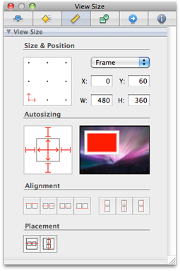
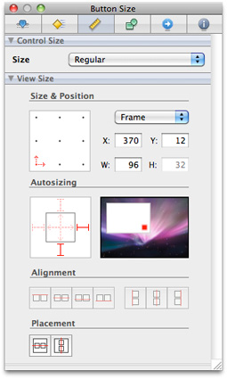

> 导航：[总目录](../../../README.md) · [documentation](../../../_indexes/documentation.md) · [Interface Builder User Guide](Introduction.md)


[Next](Interface%20Builder%20Basic%20Concepts.md)[Previous](Introduction.md)

# Interface Builder Quick Start

Interface Builder is Apple's graphical editor for designing and testing application user interfaces. This chapter provides a quick tour of Interface Builder, including a hands-on tutorial. If you have used Interface Builder before, you may want to proceed to the next chapter, [Interface Builder Basic Concepts](Interface%20Builder%20Basic%20Concepts.md#apple-f4xwc4dqnrsv64tfmyxwi33df52wszbpkridimbqga2tgnbufvbuqmznknltc).

There are several ways to open Interface Builder:

- You can open Interface Builder by double-clicking its application icon in the Finder. The Interface Builder application is located in _<Xcode>_`/Applications`, where _<Xcode>_ is the root directory of your Xcode installation. (The default root directory for an Xcode installation is the `/Developer` directory.)
- You can open Interface Builder by double-clicking an Interface Builder document in the Finder. Interface Builder documents are files with the extension `.nib` or `.xib`. These documents are often referred to as _nib files_.
- You can open Interface Builder by double-clicking the name of an Interface Builder document in an Xcode project window.

When you’re developing a new application, you generally start by creating an Xcode project using a project template. New projects come with a basic set of Interface Builder files (also called _documents_). As you continue to develop your project, you'll most likely need to create new Interface Builder documents. You can do that in the Xcode New File dialog, or in Interface Builder by choosing File > New. Figure 1-1 illustrates Interface Builder’s new document dialog on a system being used for iOS or Mac OS X development.

__Figure 1-1__  New document dialog

!

For each new document you create, Interface Builder prompts you to select a starting template. These templates define the initial set of objects to use in your document. Interface Builder provides several different templates, listed in Table 1-1, each geared toward a different goal. You can use the Empty template if you want to add a specific set of objects to your document manually. For any of the templates, you can also remove objects you do not want.

__Table 1-1__  Interface Builder document templates

| Platform | Product | Template | Description |
| iOS | iPhone | Application | Creates a document you can use to design an interface for a Cocoa Touch application. The document includes a window. |
|  |  | View | Creates a document you can use to design a view for a Cocoa Touch application. |
|  |  | Window | Creates a document you can use to design a window for a Cocoa Touch application. |
|  |  | Empty | Creates a document to which you can add your own interface objects. To learn how to select and add these objects, see [Workflow Tools](Interface%20Builder%20Basic%20Concepts.md#apple-f4xwc4dqnrsv64tfmyxwi33df52wszbpkridimbqga2tgnbufvbuqmznknltcnq). |
| iOS | iPad | Application | Creates a document suitable for creating an iPad application, including an application delegate and window. |
|  |  | View | Creates a document you can use to design a view for an iPad application. |
|  |  | Window | Creates a document you can use to design a window for an iPad application. |
|  |  | Empty | Creates a document to which you can add your own interface objects. To learn how to select and add these objects, see [Workflow Tools](Interface%20Builder%20Basic%20Concepts.md#apple-f4xwc4dqnrsv64tfmyxwi33df52wszbpkridimbqga2tgnbufvbuqmznknltcnq). |
| Mac OS X | Cocoa | Application | Creates a document you can use to design an interface for a Cocoa application. The document includes a menu bar and a window. |
|  |  | Main Menu | Creates a document you can use to design a menu bar for a Cocoa application. |
|  |  | View | Creates a document you can use to design a view for a Cocoa application. |
|  |  | Window | Creates a document you can use to design a window for a Cocoa application. |
|  |  | Empty | Creates a document to which you can add your own interface objects. To learn how to select and add these objects, see [Workflow Tools](Interface%20Builder%20Basic%20Concepts.md#apple-f4xwc4dqnrsv64tfmyxwi33df52wszbpkridimbqga2tgnbufvbuqmznknltcnq). |
| Mac OS X | Carbon | Application | Creates a document you can use to design an interface for a Carbon application. The document includes a menu bar and a window. |
|  |  | Dialog | Creates a document you can use to design a dialog for a Carbon application. |
|  |  | Main Menu | Creates a document you can use to design a menu bar for a Carbon application. |
|  |  | Window | Creates a document you can use to design a window for a Carbon application. |
|  |  | Empty | Creates a document to which you can add your own interface objects. To learn how to select and add these objects, see [Workflow Tools](Interface%20Builder%20Basic%20Concepts.md#apple-f4xwc4dqnrsv64tfmyxwi33df52wszbpkridimbqga2tgnbufvbuqmznknltcnq). |
| Interface Builder Kit | - | Inspector | Creates a document you can use to design an inspector for an Interface Builder plug-in. |
|  | - | Library | Creates a document you can use to design library components for an Interface Builder plug-in. |

Interface Builder provides several windows to allow you to display and modify the objects in your user interface. This section introduces you to four of these windows. You’ll learn more about them in the next chapter, [Interface Builder Basic Concepts](Interface%20Builder%20Basic%20Concepts.md#apple-f4xwc4dqnrsv64tfmyxwi33df52wszbpkridimbqga2tgnbufvbuqmznknltc).

Each Interface Builder document stores information about one or more objects you want to create at runtime in your application. Most of these objects correspond to elements displayed on the screen, such as windows, views, controls, and menus. Some objects do not correspond to displayed elements, such as the controller objects your application uses to manage its windows and views.

The document window lists the objects in a document. Figure 1-2 shows an example of a document window.

__Figure 1-2__  The document window

!

The Library window contains the objects and resources you add to your Interface Builder documents. Figure 1-3 shows the Library window with a set of Cocoa button objects. You can drag a button object onto a design surface such as a window or view.

__Figure 1-3__  The Library window

!

The inspector window makes it easy to display and adjust the settings for the currently selected objects. You use the mode icons along the top of the window to select a pane and display the associated settings. Figure 1-4 shows the Attributes pane for a Cocoa button.

__Figure 1-4__  The inspector window

!

A connection is a way to associate interface elements with source code. For documents used on the Cocoa and Cocoa Touch platforms, the connections panel is a quick way to create and manage the connections for a particular object.

__Figure 1-5__  The connections panel

!

Quartz Composer (QC) is a development tool for processing and rendering graphical data. Its visual programming environment lets you develop graphic processing modules, called _compositions_, without writing a single line of code.

In this tutorial, you’ll create a simple application for viewing QC compositions in Mac OS X. The name of this application is QCDemo. The QCDemo window contains a view to display a composition, a button to load a new composition, and a button to toggle between play and pause. Here’s what the QCDemo window looks like:

__Figure 1-6__  QCDemo window

!

The first task is to create a simple Quartz Composer viewer.

1. Open Xcode and create a project using the Mac OS X Cocoa application template. Name the project QCDemo.
2. Add the Quartz framework to the project’s target.

   1. In the Groups & Files list, open the Targets group and select the QCDemo target.
   2. Press Command-I to display the Target Info window.
   3. Click General.
   4. Under linked libraries, click the plus (+) button. A dialog appears with a list of libraries.
   5. Choose `Quartz.framework` from the list and click the Add button.
   6. Close the Target Info window.
3. Open The QCDemo project’s Interface Builder document.

   1. In the project’s Groups & Files list, open the Resources group.
   2. Find the file `MainMenu.xib`.
   3. Double-click `MainMenu.xib` to open the document.
4. Set the size attributes of the QCDemo window.

   1. In the document window, select the window object.
   2. Press Command-3 to open the Size pane of the inspector window.
   3. Set the window’s width and height to 480 x 420.
   4. Select the Minimum Size option.
   5. Set the minimum size to the current size by clicking the Use Current button.
5. Add a Quartz Composer view to the QCDemo window.

   1. Press Command-Shift-L to open the Library window.
   2. Click Objects and enter `quartz` in the search field at the bottom of the window.
   3. Drag the Quartz Composer view object from the Library window to the QCDemo window.
6. Set the size attributes of the Quartz Composer view.

   1. In the QCDemo window, select the Quartz Composer view object.
   2. Press Command-3 to open the Size pane of the inspector window.
   3. Set the view’s position X and Y to 0 x 60.
   4. Set the view’s width and height to 480 x 360.
   5. Set the view’s autosizing control as shown in Figure 1-7. To learn more about this control, see [Setting a View’s Autosizing Behavior](Interface%20Layout.md#apple-f4xwc4dqnrsv64tfmyxwi33df52wszbpkridimbqga2tgnbufvbuqmjzfvjvomjx).

   __Figure 1-7__  Autosizing the Quartz Composer view

   
7. Select an initial composition for the Quartz Composer view.

   1. In the QCDemo window, select the Quartz Composer view object.
   2. Press Command-1 to open the Attributes pane of the inspector window.
   3. Click the Load button.
   4. Select the composition at the following location:

```
/System/Library/Screen Savers/Shell.qtz
```
8. Save the Interface Builder document.
9. Run a simulation of the QCDemo user interface.

   1. Press Command-R to start the simulation and display the composition.
   2. Try resizing the QCDemo window and observe what happens to the composition.
   3. Press Command-Q to quit the simulation.
10. In Xcode, build and run the QCDemo application.

    1. Click Build and Run.
    2. Verify that the application runs correctly.
    3. Press Command-Q or click Stop to quit the application.

The next task is to add a button that toggles between pause and play.

1. Add a push button to the user interface.

   1. In the Interface Builder Library window, click Objects.
   2. Type `push` in the search field.
   3. Drag a push button from the Library window to the open area at the bottom of the QCDemo window.
   4. Use the horizontal and vertical guides to position the button in the lower-right corner of the window.
2. Set the attributes of the push button.

   1. Press Command-1 to open the Attributes pane.
   2. Set the button’s title to Pause and its alternate title to Play.
   3. Change the button type to Toggle.
   4. The settings in the Attributes pane should look like [Figure 1-4](#apple-f4xwc4dqnrsv64tfmyxwi33df52wszbpkridimbqga2tgnbufvbuqmrsfvjvomjt).
3. In the Size pane, set the button’s autosizing control as shown in Figure 1-8.

   __Figure 1-8__  Autosizing the pause/play button

   
4. Connect the button to the QC view’s `play:` action.

   1. Hold down the Control key.
   2. Drag from the Pause/Play button to the QC view.
   3. Select the `play:` action from the list that appears.
5. Save the Interface Builder document.
6. Run a simulation of the user interface.

   1. Press Command-R to start the simulation.
   2. Try out the button and verify its behavior.
   3. Resize the QCDemo window and make sure the button retains its correct position.
   4. Press Command-Q to quit the simulation.
7. In Xcode, build and run the QCDemo application.

   1. Click Build and Run.
   2. Verify that the application runs correctly.
   3. Press Command-Q or click Stop to quit the application.

The third task is to create a class in the Xcode project. The purpose of this class is to load QC compositions.

1. Create the source files for a new objective-C class.

   1. In the Xcode project window, select the Classes group.
   2. Choose File > New File.
   3. In the New File dialog, choose the Mac OS X Cocoa Objective-C class template and click Next.
   4. Name the file `AppController.m` and click Finish. Xcode creates the files `AppController.m` and `AppController.h`.
2. Add the code in Listing 1-1 to the `AppController.h` source file.

   __Listing 1-1__  AppController class interface

```objc
#import <Cocoa/Cocoa.h>
#import <Quartz/Quartz.h>

@interface AppController : NSObject
{
    IBOutlet NSWindow* qcWindow;
    IBOutlet QCView* qcView;
}

- (IBAction) loadComposition:(id)sender;

@end
```
3. Save the `AppController.h` source file.
4. Add the code in Listing 1-2 to the `AppController.m` source file.

   __Listing 1-2__  AppController class implementation

```objc
#import "AppController.h"

@implementation AppController

- (IBAction) loadComposition:(id)sender
{
    void (^handler)(NSInteger);

    NSOpenPanel *panel = [NSOpenPanel openPanel];

    [panel setAllowedFileTypes:[NSArray arrayWithObjects: @"qtz", nil]];

    handler = ^(NSInteger result) {
        if (result == NSFileHandlingPanelOKButton) {
            NSString *filePath = [[[panel URLs] objectAtIndex:0] path];
            if (![qcView loadCompositionFromFile:filePath]) {
                NSLog(@"Could not load composition");
            }
        }
    };

    [panel beginSheetModalForWindow:qcWindow completionHandler:handler];
}

@end
```
5. Save the `AppController.m` source file.
6. Build the QCDemo application (to verify that the code you just added is free of errors.)

   1. In Xcode, click Build or press Command-B.
   2. Verify that the message “Build succeeded” appears at the bottom of the project window.

The next task is to add an instance of the new class to the Interface Builder document and connect the class outlets.

1. Create an instance of the AppController class.

   1. In the Interface Builder Library window, click Classes.
   2. Locate the AppController class.
   3. Drag this class into the document window to create an instance named App Controller.
2. Connect the App Controller’s `qcWindow` outlet to the design window.

   1. Hold down the Control key.
   2. In the document window, drag from the App Controller to the Window object.
   3. Select the `qcWindow` outlet from the list that appears.
3. Connect the App Controller’s `qcView` outlet to the QC view in the design window.

   1. Hold down the Control key.
   2. Drag from the App Controller to the QC view in the design window.
   3. Select the `qcView` outlet from the list that appears.

The final task is to add a button that allows the user to select and load another composition.

1. Add a second push button to the user interface.

   1. In the Library window, click Objects.
   2. Type `push` in the search field.
   3. Drag a push button from the Library window to the open area at the bottom of the QCDemo window.
   4. Position the new button to the left of the Pause/Play button.
2. In the Attributes pane of the inspector, set the button’s title to Load.
3. In the Size pane of the inspector, set the button’s autosizing control as shown in [Figure 1-8](#apple-f4xwc4dqnrsv64tfmyxwi33df52wszbpkridimbqga2tgnbufvbuqmrsfvjvooi).
4. Connect the button to the App Controller’s `loadComposition:` action.

   1. Hold down the Control key.
   2. Drag from the Load button to the App Controller.
   3. Select the `loadComposition:` action from the list that appears.
5. Save the Interface Builder document.
6. Run a simulation of the user interface.

   1. Press Command-R to start the simulation.
   2. Verify that the QCDemo window looks like the window shown in [Figure 1-6](#apple-f4xwc4dqnrsv64tfmyxwi33df52wszbpkridimbqga2tgnbufvbuqmrsfvjvomru).
   3. Press Command-Q to quit the simulation.
7. In Xcode, build and run the QCDemo application.

   1. Click Build and Run. The QCDemo window appears.
   2. Click Load. A sheet dialog appears.
   3. Use the dialog to load another Quartz Composer composition. For example, load:

```
/System/Library/Screen Savers/Arabesque.qtz
```
   4. Press Command-Q to quit the application.

Now you can begin to explore the Interface Builder application in more detail.

[Next](Interface%20Builder%20Basic%20Concepts.md)[Previous](Introduction.md)

