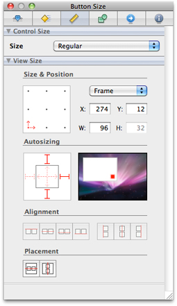
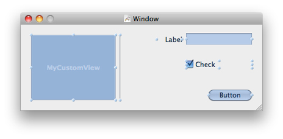
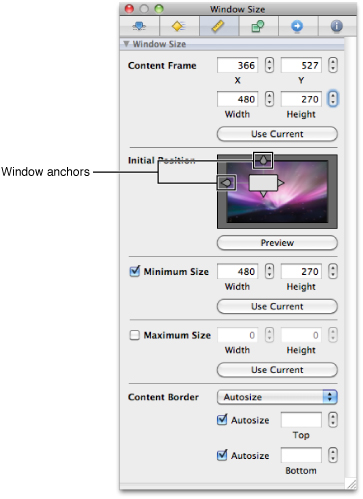
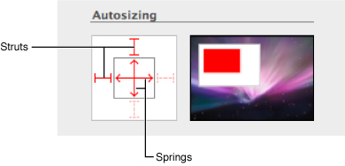
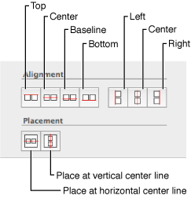
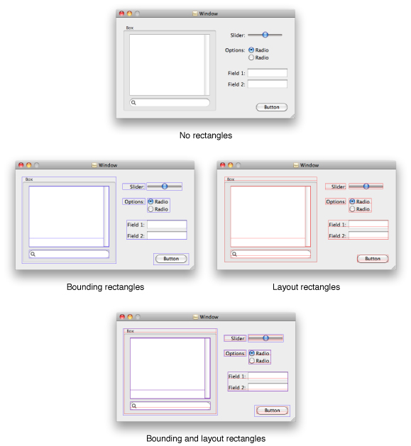
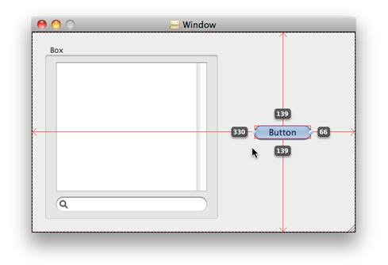
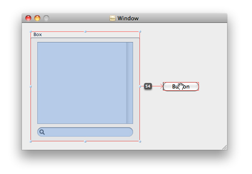
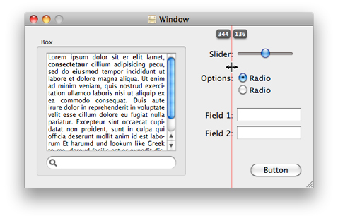
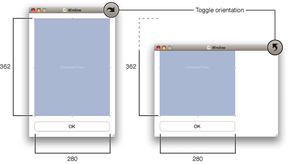

> 导航：[总目录](../../../README.md) · [documentation](../../../_indexes/documentation.md) · [Interface Builder User Guide](Introduction.md)


[Next](Object%20Attributes.md)[Previous](Nib%20Objects.md)

# Interface Layout

Interface Builder helps you experiment with different user interface designs by providing you with tools that make it easy to add and change the layout of the windows and views that comprise your interface. You make most of your layout changes directly using the mouse. You start by dragging objects out of the library and into your Interface Builder document. You then use the mouse to position those objects, resize them, and edit their attributes either inline or from the inspector window.

In situations where the mouse does not offer the level of control you need, Interface Builder provides other tools to give you precise control over the size and position of individual objects or groups of objects. The following sections describe the layout tools available for you to use along with guidelines on how to use those tools effectively.

Table 5-1 lists the layout tools that are available for you to use in Interface Builder.

__Table 5-1__  Tools to help with laying out user interfaces

| Tool | Description |
| The mouse | The mouse is the tool you use to make coarse adjustments in the position or size of an item. As you move the mouse, the cursor image changes to reflect the action that would occur if you clicked at the current point. For example, a hand cursor indicates that you can drag an item. |
| Size inspector | The size inspector contains field for fine tuning the size and position of items. It also contains tools for aligning and positioning multiple objects relative to one another. |
| Guides | Guides provide alignment information for items on the design surface. You can use the automatic layout guides, custom fixed guides, and instantaneous guides. For information about using guides, see [About Alignment Guides](#apple-f4xwc4dqnrsv64tfmyxwi33df52wszbpkridimbqga2tgnbufvbuqmjzfvjvomrs). |
| Outline view mode | In outline view mode, an Interface Builder document displays the hierarchy of the objects in that document. While in this mode, you can rearrange view hierarchies by dragging and dropping objects. |

Interface Builder provides several different techniques for moving and resizing windows and views. These techniques are discussed in the sections that follow.

There are several different ways to change the position of a view relative to its parent view:

- If the view is unselected, click and drag it to its new location.
- If the view is selected, move the cursor over the view until the open hand cursor appears. With that cursor visible, click and drag the view to reposition it.
- If the view is selected, change the values in the X and Y fields of the inspector window (Figure 5-1).
- If the view is selected, use the arrow keys to nudge it one pixel in any direction.

__Figure 5-1__  The Size pane of the inspector



Moving and resizing operations do not automatically change a view’s relationship to its parent view. If you click and drag a view that is embedded in another view, Interface Builder moves the dragged view within its parent view’s frame and clips the dragged view appropriately. For information on how to disassociate a view from its parent so that you can drag it elsewhere in a window, see [Changing a View’s Parent to Another View](#apple-f4xwc4dqnrsv64tfmyxwi33df52wszbpkridimbqga2tgnbufvbuqmjzfvjvomzu).

When moving views using the inspector, you can use the grid control (in the Size & Position section) to position the view relative to different points in its frame. For example, instead of specifying the position of the view’s lower-left corner, you could specify the position of its center. To do that, you would click the middle point in the grid control to establish that the X and Y values should reflect the center point of the view’s frame. Changes to those values would then change the position of the view so that it’s center point matched the new values.

To nudge an object by more than one pixel at a time, you can either hold down the arrow key or use it in combination with the Shift key. Holding down an arrow key nudges the selected view repeatedly at the same speed as the current key repeat rate. Holding down the Shift key increases the nudge increment from one pixel to five pixels.

For information on moving windows, see [Moving and Resizing Windows](#apple-f4xwc4dqnrsv64tfmyxwi33df52wszbpkridimbqga2tgnbufvbuqmjzfvjvomju).

After selecting a view, there are two ways to resize it:

- Drag one of its selection handles.
- Change the width and height values in the size inspector.

Figure 5-2 shows the selection handles created for several different types of views in Mac OS X. You can use a view’s selection handles to resize that view in any of the available directions. Moving the mouse over a selection handle changes the cursor to indicate that a click would initiate a resize operation.

__Figure 5-2__  Examples of selection handles



During a resize operation, the current width and height of the view (in points) are displayed. If you press the Shift key while diagonally resizing a view with the mouse, Interface Builder maintains the initial aspect ratio of the view. Figure 5-3 illustrates both of these features.

__Figure 5-3__  A resize operation

!

If a control is too small—for example, if the control’s title is too wide to be displayed—Interface Builder draws a plus icon over the control. Clicking the plus icon sizes the control to fit. If you want to disable this behavior, uncheck the Show Clipping Indicators menu item in the Layout menu.

When a window is loaded from a nib file, the nib-loading code uses the window’s frame rectangle to position it on the user’s screen. Because the screen you use at design time may be a different size than the user’s screen, Interface Builder disassociates the load-time position of the window from its position on your screen while you work on it.

When you drag a window from the library to the desktop, Interface Builder adds the window to the active nib file and uses the drop location as the initial load-time position of the window. Once it is in your nib file, however, dragging the window around your screen does not change its load-time position. The only way to change the window’s load-time position is using the window size inspector.

Figure 5-4 shows the size inspector for a window in a Cocoa application. To change the window’s load-time position, change the X and Y values in the Content Frame section of this inspector. (You can also click the Use Current button to use the window’s current position on your screen as the new load-time position.) To compensate for variances in the user’s screen size, you can use the provided window anchors to assign a fixed distance to the space between the window and the corresponding edge of the screen. Because a window’s origin is in the lower-left corner of its frame, specifying the window position based solely on the window origin would result in the window being positioned differently on different size screens. Window anchors ensure the window appears at the same relative location regardless of screen size.

__Figure 5-4__  Size inspector for windows



To change the size of a window, you can do any of the following:

- Click and drag the resize handle in the lower-right corner of the window.
- Change the width and height values in the Content Frame section of the size inspector.

Pressing the Shift key while dragging a window’s resize handle constrains the resizing operation to the current dragging direction. A horizontal drag keeps the window’s height fixed but changes the width, while a vertical drag resizes only the window height. A diagonal drag resizes the window proportionally in both the horizontal and vertical directions.

In addition to setting the window’s size and initial position, you can use this inspector to configure both a minimum and maximum size for the window. Setting these values is recommended, especially if making your window too small or too large might cause controls to be obscured or the layout of your window’s contents to change drastically.

You can also use this inspector to modify the window’s content border. If you choose autosize, Interface Builder uses a standard content border. In some cases, you can customize this border by entering the desired inset value in the bottom or top fields. This section maps directly to two methods in the [NSWindow](https://developer.apple.com/documentation/appkit/nswindow) class:

```
setAutorecalculatesContentBorderThickness:forEdge:
setContentBorderThickness:forEdge:
```

The `NSWindow` API supports modifying the content border thickness for all four window edges, but the current implementation only supports setting the bottom, and in some cases the top. Because of this, Interface Builder only shows inspector elements to configure the top and bottom inset values.

Mac OS X supports different sizes for controls to accommodate different size interfaces. The size of a control determines both the size of the control itself and how much space must be left between it and other controls. For many controls, control size also imposes a fixed height or width. For example, buttons typically have a variable width but a fixed height that is determined by the control size.

To set the size of a control, use the size inspector ([Figure 5-4](#apple-f4xwc4dqnrsv64tfmyxwi33df52wszbpkridimbqga2tgnbufvbuqmjzfvjvomjv)). In the Control Size section, select the desired size from the pop-up menu. All Mac OS X controls support the regular size but not all controls support other sizes. Because the controls in a single window should all be the same size, you should check to see whether the correct size is available for all controls you plan to use before starting your design.

When the user’ resizes a window, the system automatically resizes the views inside that window according to their autosizing rules. (Autosizing also occurs for views, such as split views, that themselves can change dynamically in size.) All iOS and Mac OS X applications support autosizing rules so as to avoid the need for you to write code to resize those views manually. The _autosizing rules_ determine whether a view expands or contracts to fill the new space and whether there is a fixed or variable amount of space between its frame and the frame of its parent view.

In Interface Builder, you configure the default autosizing rules for your views using the size inspector, as shown in Figure 5-5. The springs and struts in the autosizing control define the selected view’s relationship to its parent frame. A _spring_ causes the view to resize itself proportionally based on the width or height of its superview. A _strut_ causes the view to maintain a fixed distance between itself and its superview along the given edge. As you change the springs and struts in the inspector, the animation to the right of the control provides a visual depiction of the resulting autosizing behavior of the view.

__Figure 5-5__  Configuring the autosizing rules of a view



In addition to configuring your view’s autosizing behavior in Interface Builder, you can also configure it programmatically. For UIView objects, you do so using the `autoresizingMask` property of the view. For `NSView` objects, you use the [setAutoresizingMask:](https://developer.apple.com/documentation/appkit/nsview/1483281-autoresizingmask) method of the view. In Carbon, you use the `HIViewSetLayoutInfo` function.

Interface Builder offers two behaviors for resizing windows:

- You can resize just the window.
- You can resize the window and all of its contents.

By default, resizing a window resizes just the window. To resize the window and its contents, hold down the Command key while you click and drag the window’s resize handle. Holding down the Command key causes Interface Builder to apply the autoresizing behavior currently in place for the window’s contained views. This technique lets you view the runtime resizing behavior of your window or scale the window and its contents to a desired size.

You can toggle the default resizing mode by choosing Layout > Live Autoresizing from the menu. When toggled, holding down the Command key resizes just the window.

Interface Builder provides numerous tools to help you position objects precisely in your view. The following sections discuss these tools and how to use them.

Interface Builder provides several different types of alignment guides to help you position content in your windows and views. There are three basic types of guides: automatic, dynamic, and custom.

_Automatic guides_ appear and disappear automatically as you drag views around the design surface. Automatic guides reflect the spacing needed to lay out items according to the appropriate interface guidelines for the platform. The guides take into account the size of the controls involved as well as the guidelines for inter-view spacing. During dragging, Interface builder snaps your view to the nearest automatic guide to simplify placement. You can always tweak the placement of your view later by nudging it, as described in [Moving Views](#apple-f4xwc4dqnrsv64tfmyxwi33df52wszbpkridimbqga2tgnbufvbuqmjzfvjvomjq). You can enable or disable automatic guides using the Snap To Guides menu item in the Layout menu.

_Dynamic guides_ provide details about the position of a view relative to the edge of the window or another view. You must hold down the Option key to display dynamic guides. The exact set of guides that appear is based on the current selection (if any) and the position of the mouse. For more detailed information about using dynamic guides, see [Getting Dynamic Layout Information](#apple-f4xwc4dqnrsv64tfmyxwi33df52wszbpkridimbqga2tgnbufvbuqmjzfvjvomrx).

_Custom guides_ are guides that you place on the design surface yourself. You can use custom guides to align multiple views along some arbitrary boundary in your window and you can create both horizontal and vertical guides. Custom guides are the only guides that are saved with your nib file’s design-time information. For more information about using them, see [Using Custom Guides](#apple-f4xwc4dqnrsv64tfmyxwi33df52wszbpkridimbqga2tgnbufvbuqmjzfvjvomzq).

Layout information for Mac OS X applications is available in _Apple Human Interface Guidelines_. Layout information for iOS applications is available in _iPhone Human Interface Guidelines_ and _iPad Human Interface Guidelines_.

To align controls relative to each other, or relative to the center of the window, select the items you want to align and do one of the following:

- Choose the desired alignment from the Layout > Alignment menu.
- Choose the desired alignment command from the size inspector.

Figure 5-6 shows the buttons in the size inspector that you use to align views. (These buttons reflect the same set of commands available in the menus.) Most of the alignment controls require you to select at least two views but the group placement controls can be used with only one selected view. The vertical and horizontal alignment controls use the layout rectangles of the selected views to perform their layout. The group placement controls center the selected views as a unit along the horizontal or vertical centerline of the window.

__Figure 5-6__  Alignment controls in the Size pane of the inspector



The baseline vertical alignment control lets you align controls along the baseline of any text in the control. If a control does not contain any text, Interface Builder uses the bottom edge of the control in place of the baseline. If a control has multiple baselines, Interface Builder uses the first baseline returned by the control.

The appearance of a view onscreen is not always an accurate reflection of its true size. Many views incorporate extra space in their frame rectangle so that they can draw shadow effects and other special adornments. The apparent size difference between the view’s content and its actual frame can cause problems during layout. Specifically, if you were to lay out views based on their frame rectangles, the results might not look very good. Interface Builder compensates for this difference by letting views specify their preferred layout rectangle.

As its name implies, the layout rectangle of a view defines the bounding box to use when aligning the view with other views. Interface Builder uses layout rectangles to determine the appropriate spacing between views and to decide when to display layout guides. Interface Builder also provides a way to view both the layout rectangle and the bounding rectangle of your views:

- To display the bounding rectangle for all views, choose Layout > Show Bounds Rectangles.
- To display the layout rectangles for all views, choose Layout > Show Layout Rectangles.

Interface Builder draws bounding rectangles in blue and layout rectangles in red as shown in Figure 5-7. You can display one or both sets of rectangles at any given time or display neither of them. You can use the information provided by these rectangles to assist you during layout.

__Figure 5-7__  Bounding and layout rectangles for a window



Interface Builder displays dynamic layout information on the design surface through the use of dynamic guides. When you press and hold the Option key, Interface Builder displays different types of dynamic guides depending on what is selected or being dragged:

- To display guides that show distance from a view’s layout rectangle to the edge of the window’s content view, select the view, press the Option key, and move the mouse over the content view. Figure 5-8 shows a selected button and the dynamic guides that appear.

  __Figure 5-8__  Option dragging a control

  
- To display guides that show the distance from the currently selected view to any other view, press the Option key and move the mouse over the other view. Figure 5-9 shows a window with a selected box and the distance from that box to a button in the window.

  __Figure 5-9__  Showing the distance between two views

  

You can use the Option key in combination with most other modifier keys and keyboard shortcuts to display layout information while you modify the views. For example, holding down the Option key while using the arrow keys lets you see your layout information while moving a view pixel by pixel.

In addition to the layout guides that Interface Builder displays automatically, you can add custom horizontal and vertical guides to a window and use them during layout. Custom guides are a useful tool for aligning groups of controls whose layout rectangles vary. You can also use them in situations where the default layout guides do not provide the alignment you want for your interface.

To add a guide to the frontmost window, choose Layout > Add Horizontal Guide or Layout > Add Vertical Guide from the menu.

By default, custom guides are placed at the center of the window to which they are added. Moving the mouse over the guide changes the cursor to either a horizontal or vertical resize cursor. When the cursor appears, you can click the guide and drag it anywhere in your window to position it. As you drag, the guide displays its distance from the relevant edges of the content view to give you more precision over its placement (Figure 5-10). To remove a guide, drag it off of the window’s content view area.

__Figure 5-10__  Custom layout guides



In iOS, applications can support multiple orientations for their window content. Most applications support either portrait-mode orientation or a landscape-mode orientation, but applications can support both if they want. When designing your interface in Interface Builder, however, you must target your design for the orientation you plan to use when your nib file is first loaded.

To make it easier to design in either portrait or landscape mode, window objects in iOS-based nib files include a control in the upper right corner for toggling the window orientation. Interface Builder creates all windows in portrait mode by default, but clicking the control rotates the window to landscape mode. Clicking it again rotates the window back to orientation mode. Figure 5-11 shows the same window in both portrait and landscape orientations.

__Figure 5-11__  Changing the orientation of an iPhone window



When you change the orientation of your window, Interface Builder does not attempt to resize your views to fit the new orientation. Because nib files reflect the state of your user interface at load time, you must choose one orientation up front and design for that orientation. As a result, you should always set your window orientation prior to adding any views.

Interface Builder imposes a flexible relationship between parent and child views at design time. When you first drag a view out of the Library window, it has no parent. As soon as you drop it onto your window, however, it obtains one—the view that receives the drop. From that point on, the behavior of the view is affected by its parent view, just as it would be at runtime. In particular, the following attributes of the view are affected by its parent:

- Its visible rectangle
- Its position within the window
- Its autosizing behavior

Whenever you move a parent view, its child views move with it, always staying in the same position relative to the parent view’s frame. Similarly, if you delete a view, or cut or copy it, that view’s children are deleted, cut, or copied as well.

Although these relationships are set when you drop the view, you can still change the relationship of a child view to its parent if needed. The following sections describe the different ways to modify the parent of a view.

Although you can drag views into a parent container, an easier way to configure some views is using Layout > Embed Objects In menu. This menu provides options for embedding the currently selected views in one of several standard system container views. In Mac OS X, container views include the box view, scroll view, split view, and tab view. You can also embed a view inside a custom view for which you provide the implementation. In iOS, the only supported container view is the standard `UIView` class, which you can customize or use as is.

When you embed objects in another view, Interface Builder inserts that view between the selected views and their current parent. All views in the selection must have the same parent object to use this command. The new container view is made as small as possible while still containing the selected views.

If you use the Layout > Embed Objects In > Split View command to create a new split view in a Mac OS X window, Interface Builder uses the relative positions of the two views to determine the orientation of the split view. Thus, if two views are side-by-side, Interface Builder creates the split view with a vertical split bar. If one view is positioned above the other view, Interface Builder creates the split view with a horizontal split bar. In both cases, Interface Builder may reposition one or both of the embedded views so that they are aligned.

To change the parent of an existing view, simply drag the view to the new parent view. Dragging a view temporarily disassociates it from its parent, while dropping the view reattaches it to the new underlying view.

If you are not sure of the parent-child relationships in one of your windows, you can change the view mode of your Interface Builder document to outline or browser mode. Switching away from icon mode lets you navigate your window and view hierarchies and examine the relationships they contain. In outline mode, you can also rearrange the parent-child relationships of your objects by dragging them around the Interface Builder document window.

The `ibtool` command-line program is capable of outputting large amounts of detail for each object in your nib file. One of the options you can specify is the `--export` option, which writes out information about the nib file’s objects to a property list file.

To generate this information:

1. Create a property list that specifies the objects and properties of interest. For more information, see the `ibtool` manual page.
2. Use a command similar to the following:

```
ibtool --export mynib.plist MyNib.nib
```

Exporting nib-file information is useful if you want to view that information or use it as a template for other interfaces. For example, a Carbon developer could use the output of a nib file to gather metrics for laying out windows and controls programmatically. Because the exported data is XML, you can parse it using the XML support found in Cocoa and Core Foundation. You can also open this file using the Property List Editor application (located in `<Xcode>/Applications/Utilities`).

If after exporting your nib object information you want to reimport some changes, you can do so with the `--import` option in `ibtool`. For example, to reimport the modified property list from the previous example, you would use the following command:

```
ibtool --import mynib.plist --write MyNewNib.nib MyNib.nib
```

When modifying exported properties, you should be aware that setting a property might alter other properties in the nib file upon reimport. During reimport, you should always use the `--write` option to output the changes to a copy of your nib file.

Apple provides human interface guidelines for both Mac OS X and iOS that describe the preferred layout approaches to use when designing your user interfaces. These guidelines are there to help you create user interfaces that are both effective for users and consistent with the overall look and feel of the underlying platform.

The following sections summarize some key guidelines for layout-related scenarios that you are likely to encounter as you use Interface Builder. For information and guidance about laying out the interface of a Mac OS X application, see _Apple Human Interface Guidelines_. For information and guidance about interfaces for iOS applications, see _iPhone Human Interface Guidelines_ and _iPad Human Interface Guidelines_.

The automatic layout guides provided by Interface Builder stress proper spacing and alignment for views and their associated content. As you drag views around a design surface, Interface Builder displays these guides to help you position views according to the human interface guidelines for the target platform. Although Interface Builder does not force you to place views according to the guides, it is always a good idea to pay attention to them and use them whenever possible.

In Mac OS X, windows use a center-equalized layout, whereby controls are aligned with the vertical center of the window. If a control has an associated label, that label should appear to the left of the control and have right-aligned text. The control’s text should be left aligned to create the centered appearance.

If you have groups of controls in a vertical column in your window, it is also important to make the width of those controls the same whenever possible. Consistent sizing of the control bounding boxes creates cleaner lines and is generally more visually appealing.

In Mac OS X, an effective interface design uses visual cues to highlight the relationship of different views and controls. Views that are located close together have a relatively strong association with one another. Views that are separated from each other by some sort of divider have a weaker association. You can use these visual associations to convey information about the purpose of different views and their relative importance to the user’s current task.

Mac OS X windows have several different options for creating visual associations. Table 5-2 lists these options and the associations they create along with any limitations they impose on layout. For more information about organizing the visual content of your user interface, see _Apple Human Interface Guidelines_.

__Table 5-2__  Techniques for grouping controls

| Group delimiter | Notes |
| Boxes | Provides the strongest group association but also requires the most space within a window. |
| Separator line | Provides strong group associations when space is at a premium. |
| Whitespace | Provides good group associations when space is less of an issue. Typically, you would use this technique for smaller groups of controls. |

[Next](Object%20Attributes.md)[Previous](Nib%20Objects.md)

