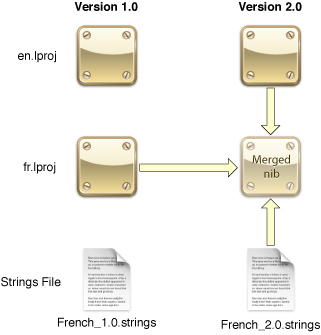

> 导航：[总目录](../../../README.md) · [documentation](../../../_indexes/documentation.md) · [Interface Builder User Guide](Introduction.md)


[Next](Interface%20Builder%20Customization.md)[Previous](Testing%20and%20Validation.md)

# Localization

After you finish your application’s user interface, you can hand off completed nib files to your localization team for translation into other languages. The localization team can use the `ibtool` command-line program to extract any localizable strings from your nib files and create matching nib files in your product’s target languages. The team can also use Interface Builder to lock nib files to prevent engineers from making further changes that might impact in-progress localizations. The following sections discuss how to use these features in Interface Builder.

When you finalize the contents of a nib file in your development language, you can tell Interface Builder to lock the contents of that nib file. Locking a nib file prevents users from making accidental changes that might impact localization efforts. When locked, the inspector window displays all relevant properties of the object as read-only. For properties that can be changed by direct manipulation, Interface Builder also prevents the user from editing those properties directly.

Interface Builder supports several different levels of locking to give you flexibility on what can and cannot be edited in your nib file. Table 10-1 lists the available locking options and what impact they have on your objects.

__Table 10-1__  Locking options for nib-file objects

| Locking option | Description |
| Nothing | All properties of the object are modifiable. |
| All properties | All properties of the object are locked. |
| Localizable properties | The user may not change any user-visible strings and may not change a limited set of other attributes, such as the object’s size. The user may make other changes, though. For example, the user could change the enabled state of a control or cell. |
| Non-localizable properties | The user may change user-visible strings and attributes such as the size of the object, but may not change any other attributes of the object. The localization team can use this mode to incorporate translations without accidentally changing other object attributes. |

You can apply lock attributes to your entire nib file or on an object-by-object basis. By default, nib-file objects are configured to inherit their lock attribute from their parent object, with top-level objects inheriting their lock attribute from the nib file itself. Changing the lock attribute for a given object affects the selected object and all of its children. Thus, you can use this behavior to lock specific portions of your user interface while still allowing you to work on other portions.

To change the lock attribute for a single object, do the following:

1. Select the object.
2. Open the inspector window and select the Identity pane.
3. In the Interface Builder Identity section, select the desired locking option from the Lock pop-up menu.

To change the lock attributes for your entire nib file, do the following:

1. Select the nib document window.
2. Select Window > Document Info to open the information panel.
3. Select the desired locking option from the Document Locking pop-up menu.

If you want to remove any custom lock attributes from the objects in your nib file, you can do so manually by modifying the individual objects, or you can use the Reset All Objects button in the nib information window. Clicking this button returns all nib-file objects to their default state, whereby they inherit their lock attribute from their parent object. You can use this button to ensure that all nib-file objects are set to a known state.

Because the contents of nib files are seen by end users, you must localize them along with your other project resources. The localization process for nib files involves the following steps:

1. From the original nib file, extract the set of localizable strings in that nib file.
2. Translate a copy of the strings file into the target language.
3. Merge the translated strings file back into a new language-specific version of the nib file.
4. Go back through each language-specific nib file and make any needed layout adjustments to account for changes in string length.

The following sections describe the steps for extracting the localizable strings from your nib file and for reincorporating them later. This process is accomplished using `ibtool`, which is a command-line program used to manipulate nib files. This tool is included with Xcode 3.0 and later, and is located in the `<Xcode>/usr/bin` directory.

Each time you run it, `ibtool` outputs a status report to the Terminal window. The status report contains any information you requested about the nib file along with any errors that were encountered. The output is formatted as an XML-based property list file, which you can copy and paste into a text file with a `.plist` file and then open using the Property List Editor application (located in `<Xcode>/Applications/Utilities`). For more about the types of information you can include in this property list, see the `ibtool` man page.

The `ibtool` program supports the XLIFF format when working with strings files. XLIFF is a file format than is used to exchange information between many localization tools. For more information about this format, see [XLIFF 1.2 specification](http://docs.oasis-open.org/xliff/xliff-core/xliff-core.html).

To extract the set of localizable strings from your nib file, you use a command similar to the following in Terminal:

```
ibtool --generate-stringsfile MyNib.strings MyNib.nib
```

The `--generate-stringsfile` option causes `ibtool` to parse the specified nib file and generate a strings file containing all of the strings that should be localized, including things such as control titles, tool tips, placeholder text, and accessibility information. The strings file is written out using the UTF-16 encoding, which is the recommended encoding for strings files. For each entry, the file includes comments indicating the object that contains the string, the object’s ID, and the current string if one is set.

After you translate the exported strings, you use `ibtool` to merge the translations back into your nib file. In Terminal, you should invoke `ibtool` using a command similar to the following:

```
ibtool --strings-file MyNib.strings --write MyNewNib.nib MyNib.nib
```

Using these parameters, `ibtool` copies the specified nib file, merges in the contents of the strings file, and writes out a new nib with the changes. When using the `--strings-file` option, `ibtool` updates only those strings that are listed in the specified strings file. If you added any strings to your nib file after extracting the initial strings file, those new strings are not touched during the merge. The `--write` option specifies the name of the new nib file to write out with the localized strings.

Localization is a time-consuming and potentially expensive process. A way to save both time and money during localization is to reuse your previously localized content as much as possible. If you make changes to one of your program’s master nib files, you can use `ibtool` to merge your changes into the localized versions of the same nib file. This technique is particularly effective for incorporating minor changes to your layout because it saves having to modify each of your translated nib files by hand. If the updated nib file includes new content (including new strings or new localizations of old strings), you can also merge any new translations into the nib files at the same time you make your other layout changes.

Figure 10-1 shows the files involved in an incremental localization update. In this example, changes were made to the English nib file in version 2.0 of the program. The updated English nib file also contains a handful of new controls, the strings for which have been translated into French and incorporated into an updated version of the French strings file.

__Figure 10-1__  Merging changes into a localized nib file



During the merge, `ibtool` pulls information from both the original and the new versions of the English nib file, plus the original French nib file and updated strings file, to create the new French nib file. The command you would use in Terminal to perform this merge would look similar to the following (without the extra formatting):

```
ibtool --previous-file ./old/Resources/en.lproj/MyNib.nib
       --incremental-file ./old/Resources/fr.lproj/MyNib.nib
       --strings-file ./new/Resources/fr.lproj/French_2.0.strings
       --localize-incremental
       --write ./new/Resources/fr.lproj/MyNib.nib
       ./new/Resources/en.lproj/MyNib.nib
```

The `--previous-file` and `--incremental-file` options specify the master and translated nib files from the previous release. In this case, these are the original English nib file and its French counterpart. The input file for `ibtool` is the updated master nib file containing the new content for the new version of your application. The `--strings-file` parameter is optional and only necessary when you want to incorporate updated or new translations into the merged nib file. The `--write` option specifies the name of the file you want to create based on these inputs.

As it performs the merge, `ibtool` starts with a copy of the new master nib file and then migrates changes from the older translated nib file based on a fixed set of rules. Using the English and French nib files from [Figure 10-1](#apple-f4xwc4dqnrsv64tfmyxwi33df52wszbpkridimbqga2tgnbufvbuqmjtfvjvomq) to provide context, these rules are as follows:

1. The `ibtool` program copies version 2.0 of the English nib file and uses that as the starting point for the new version 2.0 French nib file.
2. The `ibtool` program compares the objects in versions 1.0 and 2.0 of the English nib files.

   - If the properties of an object are the same in both versions of the English nib file, `ibtool` copies the corresponding object from version 1.0 of the French nib file into version 2.0 of the French nib file (replacing the English version of that object). The assumption here is that if nothing changed between the English versions, the object from the older French nib file can be used as is.
   - If version 2.0 contains an object that is not present in version 1.0, `ibtool` does nothing. (This means that the version 2.0 of the French nib file contains the new object but with English content.)
   - If version 1.0 contains an object that is not present in version 2.0, `ibtool` does nothing. (The object was removed, so it does not need to be merged into the new nib file.)
3. If a strings file was specified, `ibtool` merges the strings into version 2.0 of the French nib file.

When the merge is complete, what you receive is a new nib file that contains all of your new views and controls but also contains as much translated content as possible. Any new objects you added to your interface must still be translated, assuming you did not provide translations in a strings file during the merge, but at least the number of objects requiring translation is reduced.

[Next](Interface%20Builder%20Customization.md)[Previous](Testing%20and%20Validation.md)

