> 导航：[总目录](../../../README.md) · [documentation](../../../_indexes/documentation.md) · [Interface Builder User Guide](Introduction.md)


[Next](Interface%20Layout.md)[Previous](Nib%20File%20Management.md)

# Nib Objects

The editing environment of Interface Builder is organized around the direct manipulation of objects. How you manipulate a given object, though, depends on the type of the object and its typical relationship to other objects.

Views are the most common type of object used in Interface Builder. Views are rectangular regions that provide some visual content and optional event-handling behavior. Controls are a special type of view that respond to user interactions and send runtime messages to an interested target object when those interactions occur.

Windows and menus are also the main building blocks of many Interface Builder nib files. Most nib files are created around a specific window, menu, or view, and all of the other objects in that nib file are there to support that window, menu, or view.

In addition to visual objects such as windows, views, and menus, nib files used with Mac OS X and iOS applications can also include non-visual objects. Because Mac OS X and iOS applications use the Model-View-Controller design paradigm, most non-visual objects are controller objects whose job is to manage all or part of the user interface stored in the nib file.

The following sections introduce you to the key objects you are going to find in a nib file and how you use them to build your interface. These sections are not intended as a comprehensive catalog of all the objects you can add to a nib file. Instead, these sections group together objects with similar behavior and treat them as one in order to simplify the explanations of how they work.

This section describes the objects typically available on the iOS platform. Many objects available on the Mac OS X platform are also available in iOS, although in several cases the way you use those objects is slightly different. In addition, iOS introduces several new types of objects that have special behaviors and usage patterns. The following sections provide you with information about the objects available on the iOS platform and how you use them.

A typical iOS application has only one window, which provides the backdrop for all of the application’s content. Applications can include additional windows, if desired, but doing so is rare and generally not recommended.

Because it is an integral part of the application’s interface, you usually put your application’s main window in the main nib file so that it is loaded at launch time. The main nib file typically comes preconfigured with a window object that you can simply modify. You can also use the Application and Window nib file templates to create a new nib file with a window. To add a window to your nib file manually, drag a window object from the library and either drop it onto the desktop or onto your Interface Builder document.

Dropping a window object onto the desktop adds that window to the top level of the active Interface Builder document window. In iOS, windows do not have title bars or other visual elements that would require different window styles and Interface Builder automatically sets the size of each window to the size of the device’s screen. In addition, if your window is configured to display a status bar, Interface Builder displays a mock status bar to help you position your content. This status bar is not saved with your nib file.

When you double-click a window object, Interface Builder opens that window on the desktop (or makes it the active window if it is already open). The content area of the window represents the _design surface_ and is where you build the appearance of your window.

To remove a window from your nib file:

1. Select the window in your Interface Builder document window.
2. Press the Delete key (or choose Edit > Delete from the menu).

Removing a window removes the window, its contents, and any connections to other objects from the nib file.

In iOS, everything that appears onscreen descends from the [UIView](https://developer.apple.com/documentation/uikit/uiview) class. In practical terms, views and controls are rectangular regions that display data and are capable of handling events. Buttons, text fields, image views, and table views are all examples of views, with buttons being a specific type of view called a control.

It's unusual to add views to an iOS application’s main window, set up in the `MainWindow` nib file. Instead, iOS applications generally contain one or more additional nib files (where the File's Owner is a view controller), each with a view at the top level of the file. In the top-level view, you place other subviews (buttons, text fields and so on). Applications use these additional nib files to display different screens’ worth of content in the main window. To learn more about using these files, see [View Controllers](#apple-f4xwc4dqnrsv64tfmyxwi33df52wszbpkridimbqga2tgnbufvbuqmjsfvjvomru).

To add a subview to a nib file, you do the following:

1. Open the nib file’s top-level view so that its design surface is visible.
2. Open the library and locate the desired view or control. (Views and controls are grouped into categories to help you find them. You can also type the control name in the Filter box to search for items.)
3. Drag the view or control out of the Library window.
4. Drop it onto the design surface.

As you drag a view onto the design surface, Interface Builder highlights different portions of the surface to show you where the drop would occur. Upon dropping the view, the highlighted object becomes the parent of the dropped view.

To remove a view from the top level of your nib file:

1. Select the view.
2. Press the Delete key (or choose Edit > Delete from the menu).

Removing a view removes its subviews and any connections and bindings to other objects from the nib file.

Although the standard system views and controls provide a variety of choices for building an interface, there are many times when you may want to provide customized behavior for your application. If your nib document is associated with a Cocoa Touch project, Interface Builder is aware of any custom views declared in your source code. You can find your custom views listed in the Classes tab of the Library window. Dragging a custom view object to a window (or to the top level of your nib document) creates an unadorned rectangular area representing the space occupied by the object. Interface Builder sets the object’s class name in the identity inspector, as illustrated in Figure 4-1. To learn about setting the class identity of a generic view object, see [Setting the Class of an Object](Xcode%20Integration.md#apple-f4xwc4dqnrsv64tfmyxwi33df52wszbpkridimbqga2tgnbufvbuqmjyfvjvooa).

__Figure 4-1__  Custom UIView object

!!

Toolbars contain a collection of buttons representing frequently used commands in an application. Toolbars are typically located along the bottom edge of your user interface. You can configure the appearance of a toolbar in different styles to suit your interface needs. You can also configure the buttons in a toolbar using several different styles, which are shown in Figure 4-2.

__Figure 4-2__  Bar button items in a toolbar

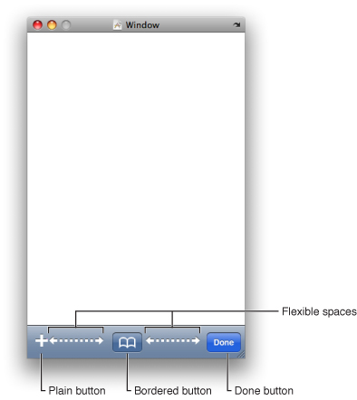

To add a toolbar to your user interface, drag a tool bar view from the library and drop it in your window or view. The default toolbar contains a single bar button item, but you can add additional items by dragging them from the library. You can configure the properties of each bar button item using the inspector. You can also edit the title of a bar button item by double-clicking it on the design surface.

Bar button items you drag from the library are configured as custom buttons by default. You can specify a title for the button or specify a custom image you want to use in the button instead. Before specifying an image for your bar button item, you must add it to the associated Xcode project. Interface Builder provides a list of the available images in the combo box associated with the Image field of the inspector.

In addition to custom buttons, you can configure bar button items using several standard images and titles. When a bar button item is selected, the Identifier field of the Attributes inspector lists the type of the button. Choosing a type other than Custom lets you create buttons representing standard system actions.

As you add new buttons to a toolbar, Interface Builder places them at the left edge of the toolbar by default. If you want to position buttons along the right edge of the toolbar, or space them out along the entire toolbar length, you must use a specially configured button to insert the appropriate amount of space. You can configure buttons to occupy a flexible or fixed amount of space.

Flexible-space buttons expand to fill the available space on the toolbar, pushing other buttons all the way to the right edge of the toolbar. Fixed-space buttons fit the available space as best they can initially and can be reconfigured later to specify the desired amount of space you want. To change the size of a fixed-space item, open the Size inspector and change the value in the Width field located in the Bar Button Item Size section. Flexible-space buttons ignore the value in this field.

When the user taps a bar button item in your toolbar, the item delivers an action message to a designated target object. The way in which you configure the action message of a bar button item is different from how you configure the events for other iOS controls. (In fact, the process is more like the target-action connections created between controls and objects in Mac OS X.) A bar button item sends its action message to a single target object only and sends it only when the user’s finger lifts from the button surface. The handler method that your target object uses to receive the message must have the following format:

```objc
- (IBAction)myActionHandler:(id)sender;
```

You connect the bar button item to its target object using either the Connections inspector or the connections panel. The bar button item has a single `selector` action that you can connect to the action method of the designated target object. You can initiate the connection either from the bar button item or the target object. When initiating a connection from the bar button item, you must start from the selector action and release the mouse button over the target object, selecting the desired method of that object to complete the connection.

For more information about creating connections between objects, see [Connections and Bindings](Connections%20and%20Bindings.md#apple-f4xwc4dqnrsv64tfmyxwi33df52wszbpkridimbqga2tgnbufvbuqnznknltc).

In addition to visual objects, Cocoa Touch nib files can include any type of custom object (including non-visual objects) needed by an application. The ability to include any instance of `NSObject` is typically used as a way to facilitate the Model-View-Controller design pattern used by iOS applications. The non-visual objects in a nib file act as controllers for the visual objects.

Figure 4-3 shows the basic object types you can add to a Cocoa Touch nib file. In addition to the generic object type, Cocoa Touch nib files can include two other special object types. View controller objects provide custom management for an application’s user interface and are used heavily in iOS applications. Because an application’s interface may be spread over multiple nib files, Interface Builder also includes a placeholder object, which you can use to represent any additional objects that are distinct from the File’s Owner placeholder.

__Figure 4-3__  Controllers and custom objects in Cocoa Touch nib files

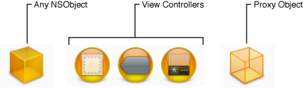

Because an iOS application has only one window, the application changes the window’s content by changing the content views displayed in the window. The _content view_ is the portion of an iOS window that you use to display your application’s custom content. The content view is not necessarily a single view but may in fact comprise several views embedded inside a parent (or root) view.

Management of the content view is the responsibility of a view controller object, which coordinates the movement of that content on and off the screen. Because it is a controller, you can also add custom logic to your view controller classes to manage interactions between the content view and your application’s data model.

In addition to providing navigation and tab bar controller objects, Interface Builder provides a generic view controller object that you can use for managing individual views. The most common way to use a view controller is as the File’s Owner of a nib file, but you can also instantiate them inside your nib file as needed.

To use a view controller as the File’s Owner of your nib file, do the following:

1. Create a nib file using the Cocoa Touch View template and configure it as follows:

   1. Set the class of the File’s Owner placeholder object to the class of your custom view controller.
   2. Connect the view outlet of File’s Owner to the view provided by the template.
2. Open the view and add any additional subviews to it to define your user interface.
3. Connect any additional outlets and actions.
4. Save the new nib file and add it to your Xcode project.

Nib files configured in this way are associated with the corresponding view controller class at runtime. When you create a new instance of your view controller, you pass the name of your nib file to the [initWithNibName:bundle:](https://developer.apple.com/documentation/uikit/uiviewcontroller/1621359-initwithnibname) method of the `UIViewController` class. The first time your application asks the view controller for its view, the view controller loads the associated nib file and returns the view attached to its `view` outlet. The view controller continues to manage the contents of the nib file internally, purging the views as needed during low-memory conditions and reloading them later as needed.

Nib files configured in this manner are often used to implement tab bar and navigation-style interfaces. The content view for each distinct screen is stored in its own nib file and associated with a view controller class. The navigation and tab bar controllers then manage the loading and unloading of each view controller and its associated nib file.

If you add a view controller to the top level of your nib file, double-clicking that controller object opens the editor window shown in Figure 4-4. This window acts as the design surface for your view controller’s view. Views you add to it are embedded as child objects of the view controller object in your Interface Builder document. The root view of your hierarchy is also assigned to the `view` outlet of the view controller by default.

__Figure 4-4__  View controller editor window

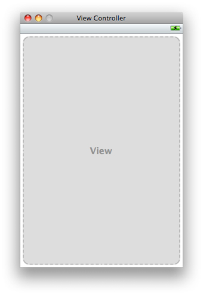

The view controller editor displays a status bar (and other top bars and bottom bars) if the properties of that view controller indicate that one is present. These elements are not saved with your nib file and are provided to help you position your views and other content. You should configure the attributes of your view controller to match the presence of the status bar or other elements in your application window.

Tab bars give the user a way to switch between different user interface modes in an application. Tab bars are typically used by applications to manage large amounts of information or to present information in different ways for the user. For example, the Clock application uses a tab bar to change between different clock-related utilities, as shown in Figure 4-5. Pressing each button in the tab bar displays a unique interface for that mode.

__Figure 4-5__  Interface modes of the Clock application

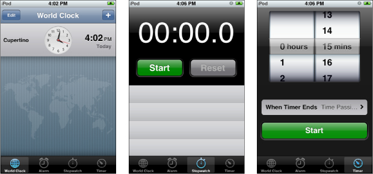

In Interface Builder, the way to configure a tab bar interface is not by adding views to your window. Instead, you need to add a tab bar controller object to the top level of your nib file and configure your views using the custom editor for that object. When you add a tab bar controller object to your document, Interface Builder actually adds several other objects. In addition to the tab bar controller, it adds a tab bar view and two generic view controllers, each of which contains its own tab bar item. Interface Builder groups these objects together under the tab bar controller, as shown in Figure 4-6.

__Figure 4-6__  A tab bar controller and its default set of objects

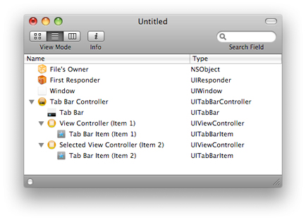

The grouping of the tab bar objects as children under a tab bar controller reflects the object graph relationships between those objects. A tab bar controller’s children consist of its tab bar view and the view controllers used to manage each of its tabs. The view controllers are actually stored in the [viewControllers](https://developer.apple.com/documentation/uikit/uitabbarcontroller/1621185-viewcontrollers) property of the tab bar controller object, which can also be set programmatically. The tab bar view is added to the overall view associated with the tab bar controller, which is stored in the controller’s [view](https://developer.apple.com/documentation/uikit/uiviewcontroller/1621460-view) property.

The relationship of objects in the document window also reflects the way those objects are presented by Interface Builder. When you double-click a tab bar controller object, Interface Builder displays the tab bar controller editor window, shown in Figure 4-7. This editor window reflects the child objects of the tab bar controller and is where you configure your tab-based user interface. Items you add using this interface are similarly added as children to the tab bar controller or the view controller that owns them.

__Figure 4-7__  Tab bar controller editor window

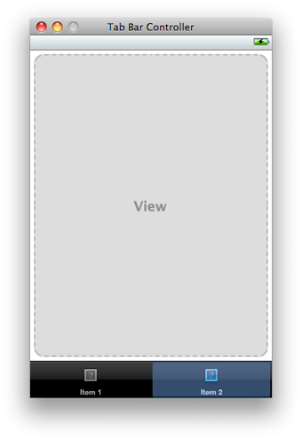

The tab bar controller editor displays a status bar (and other top bars and bottom bars) if the properties of that view controller indicate that one is present. These elements are not saved with your nib file and are provided to help you position your views and other content. You should configure the attributes of your tab bar controller to match the presence of the status bar or other elements in your application window.

Selecting one of the tab bar items in the tab bar controller editor window shows the views associated with the corresponding tab. In fact, clicking a tab bar item once selects the view controller that manages that item. Clicking the same item again selects the actual tab bar item.

Although the tab bar controller lets you edit the objects associated with the tab bar interface, simply editing those objects does not make them appear in your application window. To display your tab bar interface, you must programmatically retrieve the tab bar controller’s view and add it to your window as a subview. For example, if your application delegate has outlets referring to your tab bar controller object and application window, its [applicationDidFinishLaunching:](https://developer.apple.com/documentation/uikit/uiapplicationdelegate/1623053-applicationdidfinishlaunching) method would need to look something like the following:

```objc
- (void)applicationDidFinishLaunching:(UIApplication *)application
{
    [window addSubview:[myTabBarController view]];
}
```

For information about configuring tab bars and tab bar controllers programmatically in your application, see Tab Bar Controllers in _[View Controller Programming Guide for iOS](https://developer.apple.com/library/archive/featuredarticles/ViewControllerPGforiPhoneOS/index.html#//apple_ref/doc/uid/TP40007457)_.

There are several ways to add a new tab to your tab bar interface:

- Drag the desired view controller from the library and drop it onto the tab bar in the tab bar editor window.
- Select the tab bar controller object and add a new tab using the plus (+) button in the Attributes inspector.
- Drag a tab bar item from the library and drop it on the tab bar editor window.

Whenever you add a new tab to your interface, Interface Builder adds both a new tab bar item and a view controller to your nib file. When dragging items over the editor window, Interface Builder shows you the proposed placement for the new item. You can rearrange items later by dragging them around the tab bar or by modifying the order of the view controllers in your document window.

If you want an existing tab to use a different view controller class, select the tab bar controller object and open the Attributes inspector. The Tab Bar Controller section contains a table listing the view controller objects associated with the tab bar. To change the class of one of these view controllers, use the provided pop-up menu in the Class column. If you are adding a new tab, as opposed to modifying an existing tab, drag the desired controller object from the Library window and drop it directly onto the tab bar in the tab bar editor window.

To remove a tab from your interface, select the corresponding tab bar item and choose Edit > Delete or simply press the Delete key.

Each tab bar item can be configured with a name, an image, and a badge value. You can configure all of these properties using the Attributes inspector. Before setting the image for a tab bar item, you must first add that image to the associated Xcode project. (Interface Builder provides a list of the available images in the combo box associated with the Image field of the inspector.) You can also double-click the title string of a tab bar item to edit the title in place.

In addition to specifying custom strings and images for your tab bar items, Interface Builder provides a list of standard tab bar items that you can use in your applications. To use one of these items, select the appropriate value from the Identifier menu. It is important to remember that these standard items determine only the appearance of the tab bar item. Your application is still responsible for providing the associated content views and behavior of all items on the tab bar.

Because of the way tab bar items are organized, clicking an item in the editor window selects the view controller that owns that item. Clicking that item again selects the tab bar item associated with that view controller. You can select either the tab bar item or the view controller directly from your Interface Builder document window while it is in the outline or browser view mode.

Each tab bar item has an associated view controller to manage the set of views displayed while in the given mode. There are two ways to configure the views associated with a single tab:

- Use one or more separate nib files to specify the views. (Recommended)
- Embed the views in the same nib file that contains the view controller.

By their nature, tab bar interfaces add complexity (and many more views) to an application’s user interface. Although you can embed all of your application’s views in the same nib file as your tab bar controller object, doing so is not terribly efficient. Storing all of those views in the same nib file causes them to be loaded into memory at launch time and never unloaded. Using one or more nib files for each distinct tab makes it possible to load and dispose of the views in that tab on demand, potentially reducing your application’s memory footprint.

How many nib files you use to specify the interface for a tab depends on the contents of the tab. The basic [UIViewController](https://developer.apple.com/documentation/uikit/uiviewcontroller) class is designed to manage a single content view, which corresponds to a screen’s worth of your application’s custom content. (Thus, for simple interfaces with only one screen, you would need only one nib file.) For complex view controllers such as navigation controllers, you may need multiple nib files, each one representing the interface for a single distinct screen. At a minimum, every tab should have one nib file that you use to specify the root view for the tab.

To configure the root view for a tab, do the following:

1. Create a new nib file and configure it as described in [Using a View Controller as File’s Owner of a Nib File](#apple-f4xwc4dqnrsv64tfmyxwi33df52wszbpkridimbqga2tgnbufvbuqmjsfvjvonrw).
2. In the nib file containing your tab bar controller object, select the view controller for the appropriate tab. (You can also select the view controller by clicking the appropriate tab bar item once in the editor window.)
3. Open the Attributes inspector.
4. In the Nib Name field of the inspector, enter the name of the nib file (without any filename extension) you just created.
5. Save your nib file.

Configuring the Nib Name property of your view controller object in this manner is similar to creating your view controller programmatically using the [initWithNibName:bundle:](https://developer.apple.com/documentation/uikit/uiviewcontroller/1621359-initwithnibname) method. Whenever your application code requests its associated view, the view controller loads the specified nib file if it is not already in memory. Specifying the nib file name also gives the view controller the option of releasing the contents of that nib file when they are not in use. It might do this in situations where the amount of free memory is running low. It can always reload the nib file again later if needed.

If you would rather create the views for the tab in the same nib file as your tab bar controller, simply select the tab in the tab bar controller editor window and drag the views into the provided space. The first view you add to the editor becomes the root view for your view hierarchy. If you intend to use multiple views, you should add a generic `UIView` object that can span the entire visible area and act as a parent for other views. Your remaining views would then be children of this root view.

Navigation bars are a visual element used in conjunction with a navigation controller object to navigate complex data hierarchies quickly and easily. The navigation bar displays the current location in the navigation hierarchy, provides an optional button for navigating back to the previous location, and provides an optional button for manipulating data at the current level. Figure 4-8 shows these components in the navigation bar used by the Mail application.

__Figure 4-8__  Components of a navigation bar interface

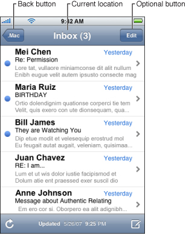

Although the navigation bar conveys contextual information to the user, the navigation controller provides the driving force behind displaying that interface and managing the view controllers that coordinate each screen’s content view. Therefore, to configure a navigation interface in your nib file, you add a navigation controller object to the top level of your nib file.

When you add a navigation controller object to your Interface Builder document, you actually get several objects. In addition to the navigation controller, you get a navigation bar and a generic view controller. Interface Builder groups these objects together under the navigation controller, as shown in Figure 4-9.

__Figure 4-9__  A navigation controller and its default set of objects

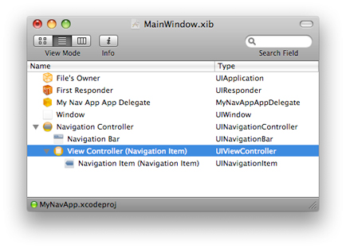

When you double-click a navigation controller object, Interface Builder displays the navigation controller editor window, which is shown in Figure 4-10. This editor window displays the child objects of the navigation controller object and is where you configure the root view of your navigation-based user interface.

__Figure 4-10__  Navigation controller editor window

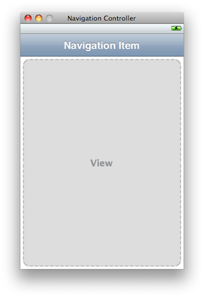

The navigation controller editor displays a status bar (and other top bars and bottom bars) if the properties of that view controller indicate that one is present. These elements are not saved with your nib file and are provided to help you position your views and other content. You should configure the attributes of your navigation controller to match the presence of the status bar or other elements in your application window.

Although the navigation controller lets you edit the objects associated with the navigation-style interface, simply editing those objects does not make them appear in your application window. To display your navigation interface, you must programmatically retrieve the navigation controller’s view and add it to your window as a subview. For example, if your application delegate has outlets referring to your navigation controller object and application window, its [applicationDidFinishLaunching:](https://developer.apple.com/documentation/uikit/uiapplicationdelegate/1623053-applicationdidfinishlaunching) method would need to look something like the following:

```objc
- (void)applicationDidFinishLaunching:(UIApplication *)application
{
    [window addSubview:[myNavBarController view]];
}
```

If your navigation-style interface is used in conjunction with a tab bar interface, you would show the tab bar controller’s view in your delegate’s [applicationDidFinishLaunching:](https://developer.apple.com/documentation/uikit/uiapplicationdelegate/1623053-applicationdidfinishlaunching) method instead of your navigation interface. Whenever you combine navigation and tab bar interfaces, the tab bar interface must be used for the root level of your window. You can embed navigation controllers inside of a tab bar interface but you cannot do the reverse.

For information about configuring navigation bars and navigation controllers programmatically in your application, see Navigation Controllers in _[View Controller Programming Guide for iOS](https://developer.apple.com/library/archive/featuredarticles/ViewControllerPGforiPhoneOS/index.html#//apple_ref/doc/uid/TP40007457)_.

Each navigation item in a navigation bar can be configured with a title, a prompt string (if any), and a string to use for the back button that returns the user to the screen containing that item. You can configure all of these properties using the Attributes inspector. In addition, double-clicking the title string of a navigation item in the controller’s editor window lets you edit the title in place.

Each navigation level in a navigation interface has its own view controller and set of views for displaying the information at that level. The nib file containing the navigation controller object also contains the root view controller for hierarchy. There are two ways to configure the views associated with the root view controller:

- Use a separate nib file to specify the views. (Recommended)
- Embed the views in the same nib file that contains the root view controller.

Although you can embed the views for the root view controller in the same nib file as your navigation controller object, doing so requires those views to stay resident in memory when they are not in use. Storing the root views in a separate nib file makes it possible to load and dispose of those views on demand.

To create the view hierarchy for the root view controller using a separate nib file, do the following:

1. Create a new nib file and configure it as described in [Using a View Controller as File’s Owner of a Nib File](#apple-f4xwc4dqnrsv64tfmyxwi33df52wszbpkridimbqga2tgnbufvbuqmjsfvjvonrw).

   The class of the nib’s File’s Owner should be the same as your root view controller’s class.
2. In the nib file containing your navigation controller, select the root view controller embedded inside the navigation controller object.
3. Open the Attributes inspector.
4. Set the class of the root view controller to your custom class.
5. In the Nib Name field of the inspector, enter the name of the nib file (without any filename extension) you just created.
6. Save your nib file.

Configuring the Nib Name property of your view controller object in this manner is similar to creating your view controller programmatically using the [initWithNibName:bundle:](https://developer.apple.com/documentation/uikit/uiviewcontroller/1621359-initwithnibname) method. Whenever your application code requests its associated view, the view controller loads the specified nib file if it is not already in memory. This gives the view controller the option of releasing the contents of the nib file when they are not in use and the amount of free memory is running low.

If you would rather create your the views for the root level of your navigation interface in the same nib file as your navigation controller, simply drag the desired views into the navigation controller editor window. The first view you add to the editor becomes the root view for your view hierarchy. If you intend to use multiple views, you should add a generic `UIView` object that can span the entire visible area and act as a parent for other views. Your remaining views would then be children of this root view.

A navigation controller works by pushing new view controllers on to a stack as the user navigates further down the navigation hierarchy. Each new view controller manages the contents at the specified level of the hierarchy. Because the contents of the hierarchy are usually determined dynamically, you typically create the needed view controllers and push them on the navigation stack programmatically.

Each time you push a view controller, you must push the one that contains the desired interface for the target navigation level. If you use the same views in multiple levels of your navigation interface, you can create a new instance of one of your existing view controller classes to manage the content at the new navigation level.

Each new view controller you create must either load its views from a nib file or create them programmatically. Storing the views in a separate nib file makes it possible to load and dispose of those views on demand and is generally the recommended approach. For each distinct set of views you plan to use for your navigation interface, you must define a new subclass of [UIViewController](https://developer.apple.com/documentation/uikit/uiviewcontroller) and a nib file to contain the views.

To create the nib file for one of your view controller subclasses, follow these steps:

1. Create a nib file using the Cocoa Touch View template and configure it as follows:

   1. Set the class of the File’s Owner placeholder object to the class of your custom view controller.
   2. Connect the view outlet of File’s Owner to the view provided by the template.
2. Open the view and add any additional subviews to it to define your user interface.
3. Connect any additional outlets and actions.
4. Save the new nib file and add it to your Xcode project.

To push a new view controller at runtime, create a new instance of your custom `UIViewController` subclass, initialize it with the nib file you created for it, and push it on the navigation controller stack. For example:

```
MyViewController* vc = [[[MyViewController alloc]
                            initWithNibName:@"MyViewController"
                            bundle:nil] autorelease];
[myNavController pushViewController:vc animated:YES];
```

The new instance manages its views and content separate from any other instances you created previously. For more information on how to push view controllers on the navigation stack, see Navigation Controllers in _[View Controller Programming Guide for iOS](https://developer.apple.com/library/archive/featuredarticles/ViewControllerPGforiPhoneOS/index.html#//apple_ref/doc/uid/TP40007457)_.

This section describes the objects typically found in Cocoa and Carbon nib files. Objects in these nib files are intended for use in Mac OS X applications. For more information on the views and controls available for use in Mac OS X applications, see _Apple Human Interface Guidelines_.

Windows and panels provide the backdrop for drawing your application’s content. Every application that has a graphical user interface has at least one window associated with it. Some applications may use multiple windows in different styles to present primary content (such as user data) or secondary content (such as inspectors or other utility windows).

In Cocoa applications, windows are based on the [NSWindow](https://developer.apple.com/documentation/appkit/nswindow) class of the AppKit framework. In Carbon applications, views are based on the `WindowRef` data type.

Windows and panels are top-level objects. In other words, you can add them only to the top level of your nib file. To add a window or panel to your nib file, do the following:

1. Open your nib file (or make it the active Interface Builder document).
2. Open the Library window and locate the desired window or panel object. (The library contains several different window and panel configurations. For tips on finding items in the Library window, see [Customizing the Library Window](Interface%20Builder%20Customization.md#apple-f4xwc4dqnrsv64tfmyxwi33df52wszbpkridimbqga2tgnbufvbuqmjwfvjvomq).)
3. Drag the window or panel from the library and drop it either onto the desktop or onto your Interface Builder document window.

Dropping a window object onto the desktop adds that window to the top level of the active Interface Builder document window. The place where you drop the window becomes the window’s initial position at load time. Once a window is associated with an Interface Builder document, dragging it around the desktop does not change its load-time position. Instead, dragging it around simply moves it out of the way and makes it easier to organize your workspace. To change the load-time position of the window from its initial setting, use the Size pane of the inspector window, as described in [Moving and Resizing Windows](Interface%20Layout.md#apple-f4xwc4dqnrsv64tfmyxwi33df52wszbpkridimbqga2tgnbufvbuqmjzfvjvomju).

When you double-click a window object, Interface Builder opens that window on the desktop (or makes it the active window if it is already open). The content area of the window represents the _design surface_ and is where you build the appearance of your window.

To remove a window from your nib file:

1. Select the window in your Interface Builder document window.
2. Press the Delete key (or choose Edit > Delete from the menu).

Removing a window removes the window, its contents, and any connections and bindings to other objects from the nib file.

Views are the most commonly used objects in Interface Builder. The standard system views display data, respond to user input, and implement standard interface paradigms such as scrollable areas, controls, and many others. Applications can also create custom views and use them to display custom visual content and respond to user interactions.

In Cocoa applications, views are based on the [NSView](https://developer.apple.com/documentation/appkit/nsview) class of the AppKit framework. In Carbon applications, views are based on the `HIViewRef` data type.

You can add views to your nib file in the following ways:

- You can drag a view out of the library and drop it onto a window.
- In Cocoa nib files, you can drag the view to the top level of the nib file.

As you drag a view around your window, Interface Builder highlights different portions of the window to show you where the drop would occur. Upon dropping the view, the highlighted object becomes the parent of the dropped view. Interface Builder inserts the dropped view into the parent’s view hierarchy and applies the parent’s clipping rectangle. You can drag the view around the design surface to position it or change its parent view as needed.

You might place a view at the top level of your nib file in situations where you want to load only a view and not an entire window, such as when creating content for an accessory panel. When placing views at the top level of your document, be sure to assign them to an outlet of your File’s Owner object so that you can dispose of them properly later. For more information about memory management and the objects in your nib file, see _[Resource Programming Guide](../../Cocoa/Resource%20Programming%20Guide/About%20Resources.md#apple-f4xwc4dqnrsv64tfmyxwi33df52wszbpgeydambqga2tc2i)_.

In addition to adding standard system views to your window, you can also add views for which your Xcode project provides the view implementation. If you add such a view to your window, you must set the class of that view so that the proper object is created at load time. For more information about configuring custom views, see [Custom Views](#apple-f4xwc4dqnrsv64tfmyxwi33df52wszbpkridimbqga2tgnbufvbuqmjsfvjvomzr).

To remove a view from a window or the top level of your nib file:

1. Select the view.
2. Press the Delete key (or choose Edit > Delete from the menu).

Removing a view removes the view, its child objects, and any connections and bindings to other objects from the nib file.

Although the standard system views and controls provide a variety of choices for building an interface, there are many times when you may want to provide customized behavior for your application. If your nib document is associated with a Cocoa project, Interface Builder is aware of any custom views declared in your source code. You can find your custom views listed in the Classes tab of the Library window. Dragging a custom view object to a window (or to the top level of your nib document) creates an unadorned rectangular area representing the space occupied by the object. Interface Builder sets the object’s class name in the identity inspector, as illustrated in Figure 4-11. To learn about setting the class identity of a generic view object, see [Setting the Class of an Object](Xcode%20Integration.md#apple-f4xwc4dqnrsv64tfmyxwi33df52wszbpkridimbqga2tgnbufvbuqmjyfvjvooa).

__Figure 4-11__  Custom NSView object

!!

Because a custom view is one you are in the process of creating in your Xcode project, Interface Builder does not attempt to draw anything other than a generic box at design time. If you want to see the appearance of your custom view as it would appear at runtime, you must incorporate the finished view into an Interface Builder plug-in and load that plug-in. For more information about plug-ins, see [Using Plug-ins to Integrate New Objects into the Library](Interface%20Builder%20Customization.md#apple-f4xwc4dqnrsv64tfmyxwi33df52wszbpkridimbqga2tgnbufvbuqmjwfvjvomjs).

A control is just a type of view that handles a specific user interaction pattern and delivers messages to your application when that pattern occurs at runtime. When the user interacts with a control, the control object notifies your application in a way that is appropriate for the application type. Controls in a Cocoa application deliver a message to a target object. Controls in a Carbon application post an event to the application’s designated event handler routine.

In Cocoa, the behavior of a control is provided by its cell object. Cells are lightweight objects that draw the control’s contents and respond to user events within the control’s frame. Prior to Interface Builder 3.0, controls and cells were treated as a single unit. In Interface Builder 3.0 and later, however, it is possible to manipulate cell objects independent of their owning control. You can select a cell and inspect its attributes (although in most cases, the attributes are shared with the control) and you can create connections to the outlets and actions of a cell independent of the the parent control object. The only time you might do this, however, is for the `NSMatrix` class, which can contain multiple cells. In most other cases, you should treat a control and its cell as a single entity.

You add controls to your window and remove them in the same manner as views. If you define custom cell classes, however, you can also substitute your custom cell for the standard cell of a control. To change the class of a cell, do the following:

1. Select the cell using the click-wait-click action on the control. (Alternatively, select the cell from the document window while it is in outline mode.)
2. Open the inspector window and choose the Identity pane.
3. In the Class field of the Class Identity section, enter the new class name for the cell. (If the class is defined in the associated Xcode project, Interface Builder automatically displays any outlets and actions defined by the custom cell class.)

When you save your Cocoa nib file, Interface Builder archives the custom cell information with the control. When the nib file is loaded at runtime, the nib loading code automatically creates your custom cell object instead of the standard one and assigns it to the control. This alleviates the need for you to set the cell object in your `awakeFromNib` method and also makes it easier to use different cell types for each control.

Prior to Interface Builder 3.2, the library contained only specific `NSCell` subclasses such as `NSTextFieldCell`. This made it impossible to use a class that descended directly from `NSCell` in Interface Builder. The custom cell solves this problem.

A custom cell is analogous to a custom view. You can use a custom cell to represent any `NSCell` subclass.

Toolbars provide the user with a convenient way to access frequently used commands without leaving the current window. A toolbar occupies the space between the title bar of a window and the window’s content view. It spans the width of the window and displays one or more commands using a combination of icons and text. Toolbars are configurable by the user at runtime and developers use a very similar technique at design time to create the initial toolbar configuration in Interface Builder.

To add a toolbar to a window, simply drag the toolbar item from the Library window and drop it on your window, as shown in Figure 4-12. The default toolbar comes configured with several standard items, including a color panel item, fonts panel item, print item, separator item, and fixed and variable spacer items.

__Figure 4-12__  Adding a toolbar to a window

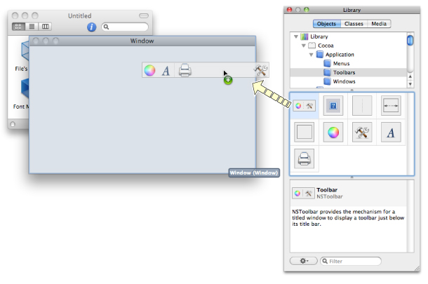

To customize a toolbar, double-click the toolbar in your window. Doing so opens up the toolbar customization sheet, which you can use to add, remove, and rearrange items in the toolbar (Figure 4-13). This sheet is similar to the customization panel the user sees when configuring a toolbar at runtime and works in much the same way.

__Figure 4-13__  Customizing a toolbar

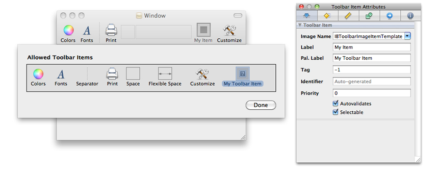

To add a new custom item to the toolbar, do the following:

1. Drag an Image Toolbar Item from the Library window and drop it onto the customization sheet.
2. Select the Image Toolbar Item and open the inspector window.
3. In the Attributes pane of the inspector window, set the following attributes:

   - The name of the image to use for the item (Image Name attribute)
   - The item text as it appears in the toolbar (Label attribute)
   - The name of the item as it appears in the user customization sheet (Pal. Label attribute)
4. Position the item in the customization sheet by dragging it to the desired location.
5. If you want the item to be part of the default toolbar, drag it to the toolbar.
6. Click Done to close the customization sheet.

The image name you specify should correspond to an image resource from your associated Xcode project. When specifying the image name in the inspector window, you do not need to include the filename extension. Your images should be sized appropriately for the size of the toolbar you plan to use. Regular size toolbars use images that are 32 by 32 pixels. Small toolbars use images that are 24 by 24 pixels. If an image file contains multiple image representations, the Image Toolbar item chooses the one that is closest to the toolbar size and then scales it as needed.

To remove an item from the toolbar, drag it off of the toolbar or the customization sheet. Dragging an item off of the toolbar removes it from the toolbar but not from the customization sheet. Dragging an item off of the customization sheet removes it from both places.

To respond to user clicks in toolbar items, you must configure each item to send its action message to an appropriate target object. You configure the toolbar actions using the connections panel. Control-clicking a toolbar item opens the panel and lists the actions available for the toolbar. Most items have just one action that you use to connect the toolbar to a target object. In addition to configuring the item’s action, you can also set its enabled state using Cocoa bindings. For more information about creating connections, see [Connections and Bindings](Connections%20and%20Bindings.md#apple-f4xwc4dqnrsv64tfmyxwi33df52wszbpkridimbqga2tgnbufvbuqnznknltc).

To remove a toolbar from your window:

1. Select the toolbar. (The customization sheet must be closed.)
2. Press the Delete key (or choose Edit > Delete from the menu).

Menus are an important part of Mac OS X applications. Every application displays a menu bar with commands for manipulating the application and its data. Menus can also appear in more localized parts of your application. For example, applications often use context-sensitive menus to store commands relevant to the object underneath the cursor. All of these types of menus are represented in Interface Builder using menu resources.

A menu resource is a special type of object that holds a collection of menu items. Menu items represent the actual commands included in the menu. You can also insert submenu items in situations where you want to create a hierarchical organization for your menu items. Figure 4-14 shows the menu objects that appear in the Library window. In addition to the basic menu resource and menu item objects, the library contains preconfigured menu resources representing standard system menus, such as the Font and Window menus.

__Figure 4-14__  Menu objects in the library

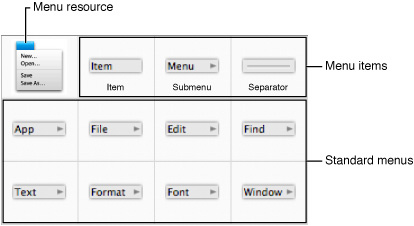

The following sections describe the standard ways to create and organize menu bar and menu resources. For information on how to tie those menu items to specific parts of your application code, see [Connecting Menu Items to Your Code](Connections%20and%20Bindings.md#apple-f4xwc4dqnrsv64tfmyxwi33df52wszbpkridimbqga2tgnbufvbuqnznknlteoi).

A menu bar resource is a special type of resource used to store the application menus. Because an application has only one menu bar, you do not create menu bar resources by dragging them out of the Library window. When you create a new Xcode project, the application’s main nib file already comes with a menu bar resource that you can modify.

If you create your project from scratch or somehow delete the main nib file from your Xcode project, you can create a new nib file with a menu bar resource. Interface Builder provides template nib files for Carbon and Cocoa applications that include a preconfigured menu bar resource. When you create your nib file, select either the Application or Main Menu template from the template picker.

Once you have a menu bar resource, you can add and remove menus and menu items accordingly. To add, remove, and manage menus in a menu bar, you do the following:

- To add a new custom menu to the menu bar, drag a Submenu Menu Item from the library and drop it on the menu bar. (You must use the Submenu item and not the Menu resource when adding menus to a menu bar.)
- To add a standard Mac OS X menu (File, Edit, Window, and so on) to the menu bar, drag the appropriate menu object from the library to the menu bar.
- To select a menu, click the menu title, wait, and then click the title again so that the menu is selected but its underlying menu is closed.
- To remove an existing menu, select the menu and choose Edit > Delete (or simply press the Delete key). (The menu must be closed before you can delete it.)
- To change the name of a menu, double-click its title to edit the name in place, or select the menu and change its title in the inspector window.

When adding new menus to a menu bar, if an existing menu is already open, hold the mouse over the menu bar for a few seconds until the current menu closes. At that point, you can drop the new menu on the menu bar. For information about modifying the individual items in a menu, see [Creating and Modifying Menus](#apple-f4xwc4dqnrsv64tfmyxwi33df52wszbpkridimbqga2tgnbufvbuqmjsfvjvomjv)

Menu resource objects live at the top level of your Interface Builder document and are not the same as a menu bar resource. You cannot use a menu resource to specify menus in the menu bar. Instead, you use menu resources for menus in places other than the menu bar. For example, if a control has a context-sensitive menu, you would use a menu resource to provide the contents of that menu.

To add a menu resource to your nib file, simply drag it from the library and drop it on your Interface Builder document window. Double-clicking the menu resource opens up an editor window containing some default menu items. You can change the names of these items, add new items, or delete the existing items to form your menu. For more information about building the contents of your menus, see [Creating and Modifying Menus](#apple-f4xwc4dqnrsv64tfmyxwi33df52wszbpkridimbqga2tgnbufvbuqmjsfvjvomjv).

Menu bar and menu resources organize the menu items associated with your application. Menu bar resources are created with your nib file but you can add new menu resources to your nib file to store context-sensitive menus. Once you have a menu resource in your nib file, you can move or remove existing items and add new submenus and menu items from the library.

To add, remove, and rearrange menu items in a menu, do the following:

- To add an item to a menu, drag the item from the library and drop it on the menu. If the target menu is closed, hold the item over the menu title (if in the menu bar) or menu resource until the menu opens automatically. As you drag the item, Interface Builder shows you the target location for the item in the menu.
- To select a menu item, click the menu item title. If the item represents a submenu, you must click the item again to close the submenu and select the item.
- To remove a menu item, select it and choose Edit > Delete (or simply press the Delete key).
- To rearrange items in a menu, drag them to the desired location in the menu.
- To embed an existing menu item in a new submenu, select the item (or items) and choose Layout > Embed Objects In > Submenu.
- To change the title of an item, double-click its title string to edit the title in place or select the item and change its title in the inspector window.
- To edit the item’s attributes, select the item and make the changes in the inspector window.

In Mac OS X v10.5 and later, you use collection view objects to manage a grid of `NSView` objects in a Cocoa application. You can use a collection view in situations where using `NSCell` objects in a matrix would be insufficient. Because they are full-fledged views (and not cells), the views in a collection view can handle events, perform mouse tracking, and do anything else a view could normally do without having to write a lot of custom code.

When you drag a collection view to one of your windows, Interface Builder creates two additional objects at the top level of your nib file:

- A generic `NSView` object, which acts as a template view for the items in the collection.
- An `NSCollectionViewItem` object, which is a controller that manages the relationship between a model object and a single view in the collection.

These two objects serve as the prototype for each item in the collection view. The collection view uses the prototype view as a template for creating each new view in the collection. Each time it creates a new view at runtime, it also creates the corresponding `NSCollectionViewItem` object to manage that view.

Configuring a collection view involves configuring the template view and setting up bindings between it and the corresponding controller object. The contents of your view can be anything you want. You could even use a tab-less tab view to create different interfaces for different views. The controls in your view are then bound to the `NSCollectionViewItem` object through its `representedObject` binding.

To provide the actual data behind the `representedObject` binding, you must set the content of the collection view object itself (not the `NSCollectionViewItem` controller). You can do so directly using the `setContent:` method of the `NSCollectionView` class, or you can set the content using Cocoa bindings. The content attribute of `NSCollectionView` stores an array of data objects, each of which contains the custom data to be displayed by one view in the collection. As it populates the grid of views, the collection view automatically associates the items in this array with the corresponding `NSCollectionViewItem` objects used to manage the grid views. Each collection view item then exposes its particular piece of data through its `representedObject` attribute. If the custom data objects you set as the content for your collection view are KVC and KVO compliant, you can bind to their exposed attributes. For example, if your custom data object exposed a `name` attribute, you could bind a text field in your template view to the collection item controller using the key path “`representedObject.name`“.

In addition to visual objects, Cocoa nib files can include any type of custom object (including non-visual objects) needed by an application. The ability to include any instance of `NSObject` is typically used as a way to facilitate the Model-View-Controller design pattern used by Cocoa applications. The non-visual objects in a nib file act as controllers for the visual objects.

Including controller objects directly inside a nib file has many advantages over creating them separately. Cocoa nib files are typically managed by a single object (known as the File’s Owner) that exists outside of the nib file itself. However, it is often convenient to use additional controller objects to manage portions of the nib file contents. In particular, Cocoa bindings make extensive use of custom controller objects to manage the interactions between the views and the application’s underlying data model.

Figure 4-15 shows the types of custom objects you can add to a Cocoa nib file. The generic `NSObject` type lets you create an instance of any object that descends from the `NSObject` class. In addition to this type, Interface Builder provides specialized objects representing specific `NSController` subclasses for managing Cocoa bindings. The Core Data objects provide a way to incorporate managed object contexts and interfaces for your Core Data entities into your nib files.

__Figure 4-15__  Controllers and custom objects

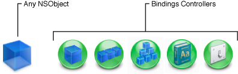

To add a generic `NSObject` instance to your nib file, simply drag the Object item from the library and drop it on your Interface Builder document window. (Custom objects cannot be embedded inside other objects in your nib file; they must reside at the top level of the Interface Builder document window.) After adding a generic object to your nib file, you should specify the intended class of that object right away. Doing so lets you connect any outlets or actions of that object to other objects in your nib file. For information on how to set the class of an object, see [Setting the Class of an Object](Xcode%20Integration.md#apple-f4xwc4dqnrsv64tfmyxwi33df52wszbpkridimbqga2tgnbufvbuqmjyfvjvooa).

Like generic objects, you must drag controller objects to the top level of your Interface Builder document window. Unlike generic objects, you should not change the class of a bindings controller object. For information on how to configure the bindings controllers, see [Using Cocoa Controller Objects](Connections%20and%20Bindings.md#apple-f4xwc4dqnrsv64tfmyxwi33df52wszbpkridimbqga2tgnbufvbuqnznknltcmi).

Applications with only one window often change their content by changing the content views displayed in that window. The _content view_ is the portion of a window that you use to display your application’s custom content. The content view is not necessarily a single view but may in fact comprise several views embedded inside a parent (or root) view. Management of the content view is the responsibility of a view controller object, which coordinates the movement of that content on and off the screen. Because it is a controller, you can also add custom logic to your view controller classes to manage interactions between the content view and your application’s data model.

Interface Builder provides a generic view controller object that you can use for managing individual views. The most common way to use a view controller is to instantiate it inside your nib file, but you can also use it as the File’s Owner of the nib file.

To add a view controller to the top level of your nib file, drag it from the objects tab of the library into the document window. The view controller is configured a bit differently from many other objects—it has a nib name property that identifies a second nib to load at runtime.

To use a view controller as the File’s Owner of your nib file, do the following:

1. Create a new nib file using the Cocoa View template and configure it as follows:

   1. Set the class of the File’s Owner placeholder object to the class of your custom view controller.
   2. Connect the view outlet of File’s Owner to the view provided by the template.
2. Open the view and add any additional subviews to it to define your user interface.
3. Connect any additional outlets and actions.
4. Save the new nib file and add it to your Xcode project.

Nib files configured in this way are associated with the corresponding view controller class at runtime. When you create a new instance of your view controller, you pass the name of your nib file to the [initWithNibName:bundle:](https://developer.apple.com/documentation/uikit/uiviewcontroller/1621359-initwithnibname) method of the [NSViewController](https://developer.apple.com/documentation/appkit/nsviewcontroller) class. The first time your application asks the view controller for its view, the view controller loads the associated nib file and returns the view attached to its `view` outlet. The view controller continues to manage the contents of the nib file internally, purging the views as needed during low-memory conditions and reloading them later as needed.

Nib files configured in this manner are often used to implement tab bar and navigation-style interfaces. The content view for each distinct screen is stored in its own nib file and associated with a view controller class. The navigation and tab bar controllers then manage the loading and unloading of each view controller and its associated nib file.

Interface Builder works with Xcode to support the creation of user interfaces based on Core Data entities. After creating your data model in Xcode, all you have to do to create an interface for that entity’s data is drag a Core Data Entity object into one of your windows. Interface Builder steps you through the creation of your interface using a series of design panels, which let you pick what you want to display and show you the appearance of the resulting user interface. Upon completion, Interface Builder adds the appropriate views to your nib file and connects them to the corresponding entities in your data model. If you want to manage the data in your Core Data database yourself, you can also add managed object contexts to the top level of your nib file. Figure 4-16 shows the managed object context and entity items as they appear in the library.

__Figure 4-16__  Core Data objects

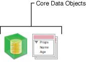

For more information about creating user interfaces for Core Data applications, see _[Xcode Tools for Core Data](../Xcode%20Tools%20for%20Core%20Data/Xcode%20Entity%20Modeling%20Tools%20for%20Core%20Data.md#apple-f4xwc4dqnrsv64tfmyxwi33df52wszbpkridimbqga3dqnbw)_. For more information about creating Core Data programs, see _[Core Data Programming Guide](https://developer.apple.com/library/archive/documentation/Cocoa/Conceptual/CoreData/index.html#//apple_ref/doc/uid/TP40001075)_.

Cocoa applications can use formatter objects to automatically format data displayed in text-based controls. Cocoa provides built-in formatters for number and date values. The formatters themselves use a set of predetermined rules to format the values they receive into something more understandable for the user. For example, you can use a number formatter to display a number as a currency value, with the appropriate separator characters and monetary indicator included in the resulting string.

For information about how to apply formatters to your Cocoa objects, see [Applying Formatters](Object%20Attributes.md#apple-f4xwc4dqnrsv64tfmyxwi33df52wszbpkridimbqga2tgnbufvbuqmrqfvjvomjx).

In Cocoa and Cocoa Touch nib files, a _placeholder object_ is a placeholder for an object that is used in a nib file but not stored in it. (Placeholder objects are not available in Carbon nib files.) It is important to remember that a nib file is simply a set of objects stored in an archival format. When you load a nib file, the nib-loading code unarchives the objects, effectively reconstituting them inside your application. Without placeholder objects, however, those objects would be isolated from the rest of your application code. The presence of placeholder objects inside a nib file provides a bridge between the code you define in your application and the objects in your nib file.

The following sections describe the standard placeholder objects that are provided automatically by Interface Builder where appropriate. For information about how to create custom placeholder objects in iOS nib files, see [Custom Placeholder Objects](#apple-f4xwc4dqnrsv64tfmyxwi33df52wszbpkridimbqga2tgnbufvbuqmjsfvjvomq). For additional information about how placeholder objects are replaced by actual objects at load time, see _[Resource Programming Guide](../../Cocoa/Resource%20Programming%20Guide/About%20Resources.md#apple-f4xwc4dqnrsv64tfmyxwi33df52wszbpgeydambqga2tc2i)_.

File’s Owner is the most commonly used placeholder object in nib files and is supported by both Cocoa and Cocoa Touch nib files. In essence, the File’s Owner placeholder is the main bridge between your application and the contents of a nib file. In a nib file, the File’s Owner placeholder is a placeholder for an object that you plan to specify when you load the nib file. The object does not exist in the nib file itself and is not created when the nib file is loaded.

When you load your nib file into memory, the nib-loading methods expect you to pass along an object that you want to designate as the nib-file owner. The class of the object you specify must match the class of the File’s Owner placeholder in the nib file. As the nib file is loaded into memory, the nib-loading code substitutes the object you provide for any references to the File’s Owner placeholder in the nib file. This substitution results in your object’s outlets and actions being automatically connected to the objects inside the nib file.

You can designate any of your application objects as the File’s Owner of a nib file. Typically, the File’s owner object is a controller object that manages the interactions with the views and other controller objects inside the nib file. Table 4-1 lists some of the standard classes that are commonly used to represent File’s Owner in applications.

__Table 4-1__  Typical classes used for File’s Owner

| Class | Description |
| `NSDocument` | Cocoa document-based applications store the document window and other required interface objects in a nib file. The File’s Owner of this nib file is traditionally the document object itself (a subclass of `NSDocument`). When the user requests a new document, Cocoa creates the `NSDocument` object and uses its associated `NSWindowController` object to load and manage the associated nib file contents. Each document in the application receives its own custom copy of the nib file objects so as to avoid unwanted interactions between documents. |
| `NSWindowController` | In Cocoa applications, it is common to use a subclass of `NSWindowController` to manage custom alert panels, modeless panels, and other windows. Window controllers provide a great deal of automatic management for nib files and are especially useful when your nib file contains only one window and perhaps some supporting objects or controls. |
| `NSViewController` | In Cocoa applications, a view controller manages custom accessory views and other view-based content. For example, printing accessory panels rely on the use of a view controller to manage the printing behavior. |
| `UIViewController` | In iOS applications, separate nib files are often used to manage the content view for each distinct screen’s worth of content. The manager for this content view is a custom `UIViewController` object, which also provides automatic nib-loading and purging support. |
| Any custom `NSObject` subclass | If you want to manage a nib file manually, you can use practically any object you like. You might use a custom subclass in situations where you want more control over the management of the nib-file objects. It is up to you to define the relationships between this object and the objects in your nib file. |

To configure the File's Owner placeholder, select it in the Interface Builder document window and open the Identity inspector. In the Class field of the Class Identity section, set the value to the corresponding class in your application. Once the class is set, Control-clicking the File's Owner object displays the outlets and actions defined by that class. You can use these outlets and actions to connect other objects to File's Owner. You can use File's Owner as a target for your bindings. For information about configuring and connecting to File's Owner, see [Connections and Bindings](Connections%20and%20Bindings.md#apple-f4xwc4dqnrsv64tfmyxwi33df52wszbpkridimbqga2tgnbufvbuqnznknltc).

Cocoa and Cocoa Touch applications use the First Responder placeholder object as a placeholder for the first object in the responder chain. The First Responder typically corresponds to the currently selected object or the object with the current focus in the frontmost window. You use the First Responder as a target for any messages that operate on the current selection or need to be handled by the frontmost window or document. For example, if you wanted a menu command to be handled by the frontmost window, you would dispatch that command to the First Responder object.

The First Responder is not required to respond to a given message. If the First Responder does not respond to a given message, Cocoa passes that message to other objects in the responder chain until one does respond. If no object responds, the message is ignored. It is the responsibility of the objects in your responder chain to implement action methods for messages you want to handle.

The First Responder placeholder initially displays all of the actions that are either supported natively by Cocoa or defined in your Xcode source files. If you want to add action methods to the First Responder that are not present in either of these locations, you can do so using the Identity inspector. The First Responder Actions section of the Identity inspector includes a plus (+) button for adding new actions to the available list. For information on how to make connections to the First Responder placeholder, see [Establishing Connections to the First Responder](Connections%20and%20Bindings.md#apple-f4xwc4dqnrsv64tfmyxwi33df52wszbpkridimbqga2tgnbufvbuqnznknltgmq).

For more information about event handling and the responder chain in Mac OS X applications, see _[Cocoa Event Handling Guide](../../Cocoa/Cocoa%20Event%20Handling%20Guide/Introduction.md#apple-f4xwc4dqnrsv64tfmyxwi33df52wszbpgeydambqga3da2i)_. For information about the role of the responder chain in iOS applications, see _[App Programming Guide for iOS](https://developer.apple.com/library/archive/documentation/iPhone/Conceptual/iPhoneOSProgrammingGuide/Introduction/Introduction.html#//apple_ref/doc/uid/TP40007072)_.

In Cocoa nib files, the Application placeholder object gives you a way to connect the outlets of your application’s shared `NSApplication` object to custom objects in your nib file. The default application object has outlets for its delegate object and, in Cocoa applications, the application menu bar. If you define a custom subclass of `NSApplication`, you can connect to any additional outlets and actions defined in your subclass.

At load time, the nib-loading code automatically replaces the application placeholder object with the shared application object from your application. You do not need to specify this object explicitly when loading your nib files.

The objects in an iOS application’s user interface tend to be much more intertwined than they are on other platforms. Many iOS application interfaces are organized around view controller objects, which manage a hierarchy of views. These view controller objects may then have to interact with several other controllers and views that are already present in the running application. To accommodate the presence of these extra controllers, Interface Builder supports the specification of custom placeholder objects for iOS applications.

You configure custom placeholder objects in the same way that you configure a generic object. You add the placeholder object to the top-level of your Interface Builder document, set its class, assign it a name, connect its outlets and actions, and save it with the rest of your document to a nib file. At load time, however, the nib-loading code does not instantiate a new instance of your placeholder object. Instead, your call to load the nib must be accompanied by a pointer to the real object that represents the placeholder. The nib-loading code then swaps in the real object for the placeholder and proceeds to reconnect the outlets and actions of that object. You can include any number of custom placeholder objects in your nib file.

The key to replacing a placeholder object at load time is in naming the object. The nib-loading code requires you to specify both the replacement object and the name of that object in a dictionary. You specify the name of the object in the Name field of the Identity inspector. Placeholder object names in your nib file must be unique in order to ensure the correct objects are connected to the right placeholder. The rest of the placeholder object configuration is the same as it is for other objects. You set the class as described in [Setting the Class of an Object](Xcode%20Integration.md#apple-f4xwc4dqnrsv64tfmyxwi33df52wszbpkridimbqga2tgnbufvbuqmjyfvjvooa) and configure the actions and outlets as usual.

For information about how to replace placeholder objects with real objects at load time, see _[Resource Programming Guide](../../Cocoa/Resource%20Programming%20Guide/About%20Resources.md#apple-f4xwc4dqnrsv64tfmyxwi33df52wszbpgeydambqga2tc2i)_.

Interface Builder provides several tools to make it easier to find objects in the Interface Builder document window or on the associated design surfaces. These tools are convenient in situations where your nib file has many objects or those objects are deeply nested inside a view hierarchy.

- To find objects in the document window:

  - Type the name of the object in the search field.
  - Select the object on the design surface and choose Tools > Reveal in Document Window.
- To find objects on the design surface, select the object in the document window and choose Tools > Reveal in Workspace.

The following sections provide some tips for organizing your user interface into nib files.

Deciding what objects go into a nib file is an important consideration. Because nib files are resource files, it is generally better for performance if a nib file contains only the immediately needed objects. If your nib file contains several unrelated windows and menus, you pay an upfront memory penalty when loading that nib file. Any objects in a nib file that are not put to immediate use remain in memory and increase your application’s footprint. In addition, if an object is paged to disk before it is even used, you pay a penalty for having to load it from disk twice.

Cocoa nib files are typically organized around a single window or menu resource. Cocoa Touch nib files are typically organized around a single window or content view resource. All other objects in the nib file are those that are needed to support the given window, menu, or view resource. For example, the nib file might contain any additional controller objects needed to manage the resource.

If you already have nib files with many unrelated resources, you can use the built-in refactoring tools to break your nib file up into smaller, independent nib files. For information about using the refactoring tools, see [Refactoring Your Nib Files](Nib%20File%20Management.md#apple-f4xwc4dqnrsv64tfmyxwi33df52wszbpkridimbqga2tgnbufvbuqmjrfvjvomjz).

Interface Builder makes it easy to embed existing views in your interface inside other views quickly. Rather than dragging a new container view into your window and copying your objects into it, you can use the Layout > Embed Objects In menu instead to create the desired container relationship. This option is the most effective way to create embedded relationships for most container views.

[Next](Interface%20Layout.md)[Previous](Nib%20File%20Management.md)

