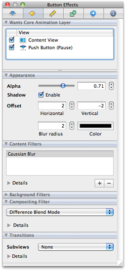
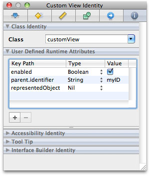

> 导航：[总目录](../../../README.md) · [documentation](../../../_indexes/documentation.md) · [Interface Builder User Guide](Introduction.md)


[Next](Connections%20and%20Bindings.md)[Previous](Interface%20Layout.md)

# Object Attributes

One of the biggest advantages of using nib files in an application is that when you load that nib file, the objects inside retain the same attribute values that you set in Interface Builder. Rather than have to reconfigure your objects programmatically, the nib-file objects are ready to go almost immediately after being loaded into your program.

You configure most object attributes using the inspector window. The attributes and identity inspectors expose the more commonly configured attributes for an object. Other panes may also expose important attributes for configuring the visual style of a view. There are a handful of views that support direct editing of text-related attributes on the design surface. Finally, some text-oriented views also support the use of a formatter object, which defines rules for presenting the text in that view.

The following sections describe the different techniques for modifying object attributes in Interface Builder. These sections do not cover the specific attributes of the objects themselves. Object attributes are tied to the exposed attributes of the underlying class, and therefore the class reference documentation and human interface guidelines for the target platform are the definitive source for that information.

There are several ways to modify an object’s basic attributes:

- Select the object and change the desired value in the inspector window.
- Select the object and change the desired font or color using the font or color panel. (Not available for all views.)

  To display the font panel, choose Font > Show Fonts. To display the color panel, choose Font > Show Colors. For example, to change the background color of a table view, select the view, bring the color panel forward, and choose the desired color.
- Double-click the object in the design surface to edit relevant attributes. (Not available for all views.)

  If an object displays any text, double-clicking the text string usually opens a field editor that you can use to change the text. For controls such as checkboxes that display a selection state, clicking the control lets you set the default state. Double-clicking a control with a menu (such as a pop-up button) opens the menu for editing.

Changes you make in the inspector window take effect immediately. To revert a change, use the Undo command or change the value in the inspector again.

If multiple objects are selected, the inspector window lets you change as many attributes as makes sense for the selection. If all of the selected objects have the exact same underlying class, the inspector shows you all of the same information you would get if just one object were selected. If the classes differ, the inspector shows you all of the attributes that the selected objects have in common. For example, selecting a push button and a text field shows only the control and view attributes in the Attributes pane, while other panes display reduced sets of information.

In Mac OS X v10.5 and later, you can associate graphical effects with your views using the Effects pane of the inspector window. Graphical effects change the visual appearance of a view. For example, you can use the Effects pane to make a view partially transparent or to apply a Core Image filter to its content. You can also assign transition behaviors to the view to change the way subviews appear and disappear when they are added to or removed from the view.

Most of the animation and filter effects behaviors are implemented using Core Animation. Core Animation is a lightweight drawing layer that combines the power of Quartz, Core Image, and OpenGL with the simplicity of Cocoa views. Core Animation takes advantage of the available graphics hardware to accelerate rendering operations and make it possible to apply complex visual effects in real time.

For more information about Core Animation effects and how you use them in your Cocoa applications, see _[Core Animation Programming Guide](../../Cocoa/Core%20Animation%20Programming%20Guide/About%20Core%20Animation.md#apple-f4xwc4dqnrsv64tfmyxwi33df52wszbpkridimbqga2dkmju)_.

You use the effects inspector (Figure 6-1) to apply Core Animation effects to your views. The inspector is organized into several subsections containing different types of visual effects.

__Figure 6-1__  Effects inspector



The Effects pane of the inspector window is divided into several sections, each of which lets you add specific visual effects to your view. Table 6-1 summarizes the sections available in the inspector and the visual effects each one applies.

__Table 6-1__  Supported effects

| Section | Description |
| Wants Core Animation Layer | Lists the selected view and its parent views. Clicking the check boxes in this section enables layers for the given view and any child views. |
| Appearance | Lists the basic visual effects you can apply to your view. You use this section to apply transparency and shadow effects to your view. Shadow effects that fall outside the bounds of your view are clipped by non Core Animation superviews. |
| Content Filters | Applies Core Image effects to the selected view and its subviews. |
| Background Filters | Applies Core Image effects to the content located behind the view. These filters are applied to any background content prior to compositing that content with your view. |
| Compositing Filter | Applies a Core Image filter that specifies how your view should be composited with a background image or with the content behind your view. Compositing lets you blend your view contents with other views or images. |
| Transitions | Adds transition effects to the selected view. These effects are applied to subviews whenever those subviews are added to or removed from the view. Transitions represent an expanded version of the behavior offered by the `NSViewAnimation` class. |

For information about how to apply the Core Animation effects associated with your views in your nib file, see _[Core Animation Programming Guide](../../Cocoa/Core%20Animation%20Programming%20Guide/About%20Core%20Animation.md#apple-f4xwc4dqnrsv64tfmyxwi33df52wszbpkridimbqga2dkmju)_.

To enable graphical effects for a view, click the check box for that view in the Rendering Tree section of the effects inspector. This section lists the currently selected view and its superviews. Graphical effects require the presence of a Core Animation layer. Enabling a view’s check box adds such a layer to that view and all of its child views and is equivalent to setting the `wantsLayer` property of the view to `YES`.

When you enable layers for a view, Interface Builder displays some of the graphical effects you configure in the effects inspector, but may not display them all. Most effects involve input from your application that may not be available in Interface Builder. For example, transitions are not shown in Interface Builder because they are triggered only when you add or remove subviews at runtime.

Filters let you apply interesting visual effects to the contents of your views. You can use filters to create a specific look for your user interface, to highlight specific portions of your interface, or to apply visual effects to user-defined or dynamically changing content. The advantage of using filters is that you do not have to render the content in advance. You simply add the desired filter to your view and Core Animation composites the filter along with the rest of your view’s content. This allows you to create and update your content in real time while still providing stunning visual effects.

You can use the effects inspector to configure three basic types of filter for your views:

- Content filters
- Background filters
- Compositing filters

A view can have only one compositing filter but may have multiple content and background filters. To enable a compositing filter, select the desired filter from the list and configure its options. To configure content and background filters, do the following:

1. In either of the Content Filters or Background Filters sections, click the plus (+) button to add a new filter. A filter selection sheet appears.
2. From the filter selection sheet, select the filter you want to apply and click OK. The filter should appear in the corresponding filter table of the section.
3. To configure the new filter, select it and expand the Details section below the table to display the filter attributes.
4. Change the filter attributes as desired.

You can apply multiple content and background filters to a single view. The filters you add are applied in the order listed in the content filters or background filters tables. To delete a filter, select it from the appropriate table and click the minus (-) sign.

View transitions are a way to provide the user with visual feedback whenever you change your view hierarchy by adding or removing views. View transitions make adding and removing views less jarring for the user. For example, removing a view whose parent has an attached fade transition causes the view’s opacity to decrease gradually to 0, at which point the view is actually removed from the view hierarchy. The transition provides a visual cue to the user that the view has been removed.

In the effects inspector, you specify the transition type to use whenever subviews are added to or removed from the selected view. Transitions are not inherited by child views. They apply only to the immediate children of the selected view.

To activate a transition at runtime, simply add or remove subviews from the parent view. The Core Animation framework automatically applies the associated transition to the affected views without further prompting from your code. View transitions themselves are simply Core Image transition effects associated with the Core Animation layer of a view. Core Image provides a set of default transitions for you to use and you can extend this set to include custom transitions you create.

For information on how to implement Core Image transitions, see _[Core Image Programming Guide](../../Graphics%20Imaging/Core%20Image%20Programming%20Guide/About%20Core%20Image.md#apple-f4xwc4dqnrsv64tfmyxwi33df52wszbpkridgmbqgaytcobv)_.

Formatters are special objects that modify the textual representations of Cocoa objects. Formatters provide a fast and easy way to format complex text information without writing any code. For example, you might use a formatter in a text field to format a sequence of numbers as a currency or date value. For controls that can accept text input from users, formatters not only reformat the entered text, they also validate it to ensure it does not contain any illicit characters.

Cocoa defines two concrete formatter classes that you can use as-is in your interfaces. The `NSNumberFormatter` class lets you format strings containing integers, floating-point values, currency values, percentage values, and so on. The `NSDateFormatter` class lets you format strings containing date and time information. You do not have to write any code to use these objects. Instead, each object supports a flexible notation that you enter in the inspector to specify how you want text formatted. When subsequently attached to an object, the formatter automatically formats the corresponding object’s contents based on the parameters you specified.

If you want to format something other than number or date values, you can create your own custom formatters and integrate them into Interface Builder using plug-ins. The `NSFormatter` class provides the basic interface used by formatters to interact with Cocoa controls and cells. For information on how to create a custom formatter, see _[Data Formatting Guide](../../Cocoa/Data%20Formatting%20Guide/Introduction%20to%20Data%20Formatting%20Programming%20Guide%20For%20Cocoa.md#apple-f4xwc4dqnrsv64tfmyxwi33df52wszbpgeydambqgazds2i)_.

In Cocoa applications, there are two ways to attach a formatter to an object:

- Drag the formatter object from the Library window and drop it on the control. (Recommended)
- Drag the formatter object to the top level of the nib document window and connect it to the `formatter` outlet of the target control.

When you drag a formatter object around your window, Interface Builder highlights any controls that can accept that formatter. Essentially, you can attach a formatter to any Cocoa object whose cell defines a `formatter` outlet. When you drop a formatter onto an object, Interface Builder attaches the formatter to the cell but does not mark its `formatter` outlet as connected. Instead, it configures the outlet lazily at runtime when the nib file is loaded. To show that the object does have a formatter, Interface Builder displays a badge next to the object when it is selected. To select the formatter, click its badge.

Dropping a formatter on a control associates the formatter with that control, configuring all of the necessary connections automatically. From that point, all you have to do is configure the formatter parameters in the inspector and you are done. In addition to being easier to configure initially, this technique reduces the overhead required to manage the formatter object at runtime. Formatters attached directly to an object are released automatically when the object itself is released. Dragging a formatter object to the nib document window adds that formatter to the top level of your nib file. Objects at the top level of the nib file are not released automatically and must be released explicitly by the code that loaded them.

The only time you might want to place a formatter object at the top level of your nib file is in cases where several objects need to share the same formatter object. Objects that share a formatter also share the same formatting behavior, and any changes you make to the formatter affect all connected objects. For information on how to connect objects to outlets, see [Creating and Managing Outlet and Action Connections](Connections%20and%20Bindings.md#apple-f4xwc4dqnrsv64tfmyxwi33df52wszbpkridimbqga2tgnbufvbuqnznknlte).

To remove a formatter that you dragged to an object, select its badge and choose Edit > Delete or press the Delete key.

After adding a formatter to a Cocoa object, you should select that formatter and configure its settings. The default Cocoa formatters provide a flexible notation for specifying how strings are formatted at runtime. For number formatters, you use this notation to specify the number and type of digits to use, whether to include special symbols, and any potential limits on the number’s value.

The `NSNumberFormatter` class supports two syntaxes for formatting strings:

- In Mac OS X v10.4 and later, formatters support the conventions defined in [Unicode Technical Standard #35](http://unicode.org/reports/tr35/tr35-6.html#Number_Format_Patterns). (Recommended)
- In all versions of Mac OS X, formatters support a set of custom conventions defined in Number Format String Syntax (Mac OS X Versions 10.0 to 10.3) in _[Data Formatting Guide](../../Cocoa/Data%20Formatting%20Guide/Introduction%20to%20Data%20Formatting%20Programming%20Guide%20For%20Cocoa.md#apple-f4xwc4dqnrsv64tfmyxwi33df52wszbpgeydambqgazds2i)_.

The Unicode conventions include significant enhancements over the older conventions and are recommended for use in any new applications you create. Collection Views lists the key field groups in the inspector and how you use them to configure your format strings.

__Table 6-2__  Inspector fields for modern formatters

| Para | Para |
| Style | Default styles for standard types of numerical formatting. Selecting a value from the pop-up menu populates other inspector fields with reasonable starting values. |
| Format | The core format strings for positive and negative values. These fields reflect the current format string derived from the other inspector options. You can also use these fields to modify the format string directly. |
| Padding | The padding to apply to the prefix or suffix portion of the format. Each string format can have a prefix, a numeric part, and a suffix. The prefix and suffix portions usually correspond to things like currency or percent symbols that are integral to the format but not part of the numerical portion. You can use the controls associated with this field to specify how many padding characters (and which character) to include before or after the prefix or suffix. Padding may be inserted at only one of the specified locations. Changes you make to this field are reflected in the Format fields. |
| Rounding and Increment | The rounding rules to apply to the number. You can round numbers up or down in various ways and can specify the rounding increment to use. For example, using the half-even setting with an increment of 50, the value 1230 would round to 1250. Changes you make to this field are reflected in the Format fields. |
| Multiplier | The factor to use when converting between numerical values and the corresponding strings. Multipliers allow the formatted value to be different than the value used internally by your program. For more information, see _[NSNumberFormatter Class Reference](https://developer.apple.com/documentation/foundation/numberformatter)_. |
| Grouping | The number of digits to group together between separator characters. The primary grouping represents the digits immediately to the left of the decimal point. Secondary groupings represent the spacing for the remaining digits to the left of the first separator. Specify 0 for the secondary grouping value to use the primary grouping throughout. You can also use the grouping checkboxes to configure additional grouping-related options. Changes you make to this field are reflected in the Format fields. |
| Constraints | The constraints to apply to the resulting number. You can set limits on the value itself or on the number of digits it contains. You can also specify the default symbols to use, although typically these are obtained from the current locale. |

For additional information and examples on how to specify formatting strings using the older notation, see _[Data Formatting Guide](../../Cocoa/Data%20Formatting%20Guide/Introduction%20to%20Data%20Formatting%20Programming%20Guide%20For%20Cocoa.md#apple-f4xwc4dqnrsv64tfmyxwi33df52wszbpgeydambqgazds2i)_. For more information on formatting strings using the Unicode conventions, see [Unicode Technical Standard #35](http://unicode.org/reports/tr35/tr35-4.html#Number_Format_Patterns).

After adding a formatter to an object, you should select that formatter and configure its settings. The default Cocoa formatters provide easy-to-use tools for configuring format options from a collection of tokens. If you prefer to use the advanced notation defined in [Unicode Technical Standard #35](http://unicode.org/reports/tr35/tr35-6.html#Date_Format_Patterns), an advanced editor is also available for configuring your formatter using a specially-formatted string.

For each date formatter object, you must specify the versions of Mac OS X your nib file must support. The implementation of the `NSDateFormatter` object has improved over time to support more advanced features. Most nib files should support the conventions from Mac OS X v10.4 and later, but if you need to support earlier versions of the system that option is available.

For additional information and examples of how to specify formatting strings, see _[Data Formatting Guide](../../Cocoa/Data%20Formatting%20Guide/Introduction%20to%20Data%20Formatting%20Programming%20Guide%20For%20Cocoa.md#apple-f4xwc4dqnrsv64tfmyxwi33df52wszbpgeydambqgazds2i)_.

In Carbon and Cocoa nib files, you can associate key equivalents with a button to facilitate pressing that button more quickly. Typically, this feature is used to associate the Return or Escape key with the button to indicate its status as the default button or the designated cancel button of a window. In Cocoa nib files, you can assign other keys to buttons to create shortcuts as well.

To assign a key equivalent for a Cocoa button, do the following:

1. Select the button.
2. Open the attributes inspector.
3. Click the Key Equiv. field so that it is highlighted.
4. On the keyboard, press the key (or key combination) you want to assign to that button.

   You can assign key combinations by pressing any combination of the Command, Control, Option, or Shift modifier keys in addition to the desired key.

Carbon nib files support the configuration of the default and cancel buttons on a window but do not support arbitrary key assignments. The default button is triggered when the Return key is pressed and the cancel button is triggered when the Escape key is pressed. To assign either of these equivalents to a button, open the attributes inspector for the button and select the appropriate value from the Type field.

Tabbing between views is a common way for the user to move quickly between a set of text fields in a window, enabling the fast entry of data using only the keyboard. When the user presses the tab key, focus moves from view to view, usually in a circular pattern. For Carbon developers, the code to manage this change in keyboard focus must be written manually in Xcode. For Cocoa developers, however, Interface Builder lets you configure the tab order using outlet connections in the `NSView` class.

When the user presses the tab key, Cocoa uses the `nextKeyView` outlet of the view that currently has the focus to determine where the focus should move to next. To set up the tab order for a particular window, all you have to do is configure this outlet for each view. It is recommended that you configure all of your views at once, moving from one view to the next to ensure that the chain is really circular and comes back to the right starting point.

To specify the view that should receive the focus when the window is first shown, connect the `initialFirstResponder` outlet of the window to the desired view.

For more information about configuring outlet connections, see [Creating and Managing Outlet and Action Connections](Connections%20and%20Bindings.md#apple-f4xwc4dqnrsv64tfmyxwi33df52wszbpkridimbqga2tgnbufvbuqnznknlte).

Providing users with information about your interface can significantly improve the user experience. From Interface Builder, you can configure two different types of help information:

- Help tags (also known as tool tips)
- Accessibility information

Help tags are short strings that appear when the user hovers the mouse over a control in Mac OS X applications. You can use help tags to provide the user with basic information about the purpose of a view or give some indication of how it should be used. You specify the help tag for a given control using the Identity pane of the inspector.

- For Cocoa nib files, use the Tool Tip section of the identity inspector to set the help tag text.
- For Carbon nib files, use the fields in the Object Help Identity section of the identity inspector to set help tags

For Carbon controls you can specify both a simple help tag and an extended help description. You use the Help field to specify the basic help text that appears when the user hovers the mouse over a view. You use the Extended Help field to provide an extended version of the help text that appears when the user presses the Command key. Cocoa controls support only the basic help tag information. Nib files in iOS do not support help tags.

For Cocoa nib files, another way you can provide assistance is by adding Section 508 information (also known as accessibility information) to your controls and views. System technologies such as VoiceOver use accessibility information to describe user interface features to users with impaired vision or other disabilities. Accessibility support is an important feature for many industries and is mandatory if you sell your software into the government sector.

You specify accessibility text using the Identity pane of the inspector window. Use the Description field to provide the user with information about an object’s purpose. You can also use the Help string to provide a short hint on how to handle the object, although Cocoa uses the view’s help tag by default if this field is empty. For more information about accessibility and Cocoa, see _[Accessibility Programming Guidelines for Mac](../../Cocoa/Accessibility%20Programming%20Guidelines%20for%20Mac/Introduction%20to%20Accessibility%20Programming%20Guidelines%20for%20Cocoa.md#apple-f4xwc4dqnrsv64tfmyxwi33df52wszbpgeydambqgeytq2i)_.

This feature is useful for a custom object that doesn’t have its own Interface Builder inspector. You can configure the custom object to initialize a list of attributes when the nib file is loaded. You specify the list in a table in the identity inspector called “User Defined Runtime Attributes”. Each entry in this table results in `setValue:forKeyPath:` being called against the inspected object when the nib file is loaded.

For example, if you add the following entries in the identity inspector for a custom view:



The custom view will get these messages when the nib is loaded:

```
[customView setValue:[NSNumber numberWithBoolean:YES] forKeyPath:@"enabled"];
[customView setValue:@"myID" forKeyPath:@"parent.identifier"];
[customView setValue:nil forKeyPath:@"representedObject"];
```


You can use Interface Builder to create nib files containing HIToolbox types for your Carbon applications. Carbon nibs support the inclusion of window and menu resources only, which simplifies the nib creation process somewhat. Rather than create connections between objects at design time, you use Interface Builder to assemble the visual appearance of your windows and menus and then implement all of the behavior for those objects in your code. For information on how to attach controller code to your user interface, see _[Handling Carbon Windows and Controls](../../Carbon/Handling%20Carbon%20Windows%20and%20Controls/Introduction%20to%20Handling%20Carbon%20Windows%20and%20Controls.md#apple-f4xwc4dqnrsv64tfmyxwi33df52wszbpkridgmbqgaytambu)_.

Command IDs correspond to the high-level actions an application should take. You can associate command IDs with the controls and menu items in your Carbon nib file to indicate what action should be taken when that control or menu item is used. Whereas a Control ID is unique for a given control, the same command ID can be assigned to multiple objects. For example, you could could associate the Zoom command with a Zoom menu item, a Zoom button in your document window, and the Command-Z keyboard equivalent.

You associate a command ID with a particular control or menu item using the inspector window. Carbon defines several standard command IDs that you can reuse, or you can define custom codes to represent the actions the user can take in your application. To assign a Command ID to a control or menu item, do the following:

1. Select the control or menu item.
2. Open the inspector window and select the Attributes pane.
3. From the command pop-up menu, select the command you want to associate with the object. You can use one of the predefined IDs provided by Carbon or choose `<other>` to enter the four-character corresponding to your custom command.

For more information about command IDs and how they are used, see _[Carbon Event Manager Programming Guide](../../Carbon/Carbon%20Event%20Manager%20Programming%20Guide/Introduction%20to%20Carbon%20Event%20Manager%20Programming%20Guide.md#apple-f4xwc4dqnrsv64tfmyxwi33df52wszbpkridgmbqgaydsobz)_.

To access controls from your application, you need to assign each control a signature and control ID. The signature is a four-character code that typically is the same as the application signature. The control ID is an integer you use to identify the control. The combination of these values uniquely identify the control to your application..

To assign a signature and control ID:

1. In your nib file, select the control.
2. Open the inspector window and select the Attributes pane.
3. In the View section, set values for the Control Signature and ID fields.

For more information about working with Carbon controls, see _[Handling Carbon Windows and Controls](../../Carbon/Handling%20Carbon%20Windows%20and%20Controls/Introduction%20to%20Handling%20Carbon%20Windows%20and%20Controls.md#apple-f4xwc4dqnrsv64tfmyxwi33df52wszbpkridgmbqgaytambu)_.

The inspectors for Carbon controls and HIView objects provide tables where you can associate custom properties with your controls and views. Custom properties are application-defined pieces of data that your code uses to configure the control at runtime. For example, if you have a text field control, you might include a property that signifies that the control supports only numerical values. At runtime, your validation code could look for this property and use it to restrict the values entered in this control by the user.

You can add auxiliary properties to both Carbon controls and HIView objects using the Attributes pane of the inspector window. Each property consists of a creator code, tag code, type, and value. The creator and tag codes are four-byte values you use to identify the property at runtime. The creator code is typically the same as your application’s four-byte creator signature. Although Carbon treats properties as generic blocks of untyped data at runtime, Interface Builder uses the type information you provide to help package the data appropriately in your nib file.

To load a property at runtime, you use the `GetControlProperty` function of the Carbon Control Manager. When calling this function, you specify the creator and tag codes for the desired property and get back a buffer containing the value for that property (if it is present). For more information about using this function to load properties, see _Control Manager Reference_.

If your nib files contain any custom HIView objects, you can associate custom parameters with those views in addition to any auxiliary properties. When your view is initialized at runtime, the parameters you specify in the nib file are included as parameters to the `kEventHIObjectInitialize` event. You can use these parameters to initialize your view much like you would use auxiliary properties; see [Adding Auxiliary Properties](#apple-f4xwc4dqnrsv64tfmyxwi33df52wszbpkridimbqga2tgnbufvbuqmrqfvjvomzq).

HIView parameters consist of a parameter name, type, and value. The parameter name is a four-byte code that uniquely identifies the type of parameter to your application. The type and value information specify the actual data for the parameter and their contents are left for you to determine. To retrieve an event parameter at runtime, use the `GetEventParameter` function, defined in _Carbon Event Manager Reference_.

When building your interface, you should consider the intended use of the windows and menus in your application. Although Interface Builder helps you to create good looking user interfaces in many ways, it is still just a tool that does what you ask it to do. It is up to you to make appropriate design choices as you build your interface.

A good source of information about interface design is the human interface guidelines for the target platform:

- _Apple Human Interface Guidelines_ for Mac OS X
- _iPhone Human Interface Guidelines_ and _iPad Human Interface Guidelines_ for iOS

All interface designers should read the human interface guidelines at least once to understand the basic design principles for the platform. The following sections provide additional guidance for you to consider as you create your windows and menus in Interface Builder.

In Mac OS X, controls support up to three different sizes: regular (or large size), small, and mini. Some controls support all three sizes, and some support only the regular and small sizes. Although choice is great, mixing controls of different sizes in the same window is not. Mixing different sized controls looks strange and makes aligning those controls more difficult.

Rather than use controls of different sizes, you should always choose a size that is appropriate for your window and stick with it. Using controls of the same size ensures that the baselines and bounding rectangles used during layout match and create a consistent appearance. Although Interface Builder does not warn you when you mix control sizes, the ability to edit the properties of multiple objects simultaneously makes it easy for you to adjust the size of nonconforming controls later. For more information, see [Changing the Size of a Control](Interface%20Layout.md#apple-f4xwc4dqnrsv64tfmyxwi33df52wszbpkridimbqga2tgnbufvbuqmjzfvjvomjw).

Although not part of most guidelines, naming your nib file objects can make it easier to edit and localize your nib files later. By default, new objects added to a nib document receive a generic name, such as “Window” or “Custom View”. If your nib file contains multiple objects of the same type, it can be hard to distinguish one from another quickly. Assigning unique names to your objects rectifies this problem. Names can also help translators understand the purpose of a particular object, which can aid in making the appropriate translation.

To set the name of an object, do the following:

1. Select the object.
2. Open the identity inspector.
3. In the Interface Builder Identity section, type the desired name in the Name field.

Names you specify in the identity inspector do not appear in your actual user interface. They are simply cues that Interface Builder displays when you edit your nib file.

In addition to assigning names, you can also add notes to your objects. Notes can provide even more help to translators by offering additional context about how an object is used in your user interface. Like names, notes reside in your nib file and never appear in your user interface.

[Next](Connections%20and%20Bindings.md)[Previous](Interface%20Layout.md)

