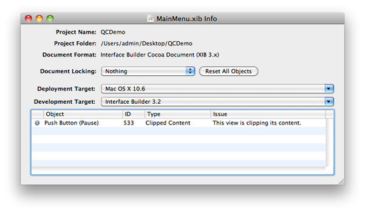

> 导航：[总目录](../../../README.md) · [documentation](../../../_indexes/documentation.md) · [Interface Builder User Guide](Introduction.md)

[Next](Localization.md)[Previous](Xcode%20Integration.md)

# Testing and Validation

Interface Builder provides tools to help you validate the contents of your documents against the platform on which you plan to use them. In addition to testing the behavior of your interface in the simulator, you can also verify that the operating system on which you plan to run your software supports all of your nib file objects. Different versions of an operating system may support different objects or different attributes for those objects. If your nib files contain objects that are not available on the current platform, your program may crash.

The following sections show you how to use Interface Builder to test your nib files.

To display general information about a nib file, open the nib information window by choosing Window > Document Info. Among other things, this window displays the following pieces of information:

- The associated Xcode project information
- The document format (nib or xib)
- The lock attributes for the nib file; see [Locking Down Your Nib File](Localization.md#apple-f4xwc4dqnrsv64tfmyxwi33df52wszbpkridimbqga2tgnbufvbuqmjtfvjvona)
- The intended deployment and development targets
- Any design errors, warnings, and notes

Figure 9-1 shows an information window with a design time issue. Double-clicking an item in this table selects the item and brings it to the foreground.

__Figure 9-1__  Nib information window

For each nib file in your project, you should:

- Set the deployment target value to match the deployment target of the Xcode target that uses the nib file.

  Interface Builder uses deployment targets to identify potential problems with your nib file. For example, if your deployment target is set to Mac OS X v10.3 but a window includes a control that was introduced in Mac OS X v10.5, Interface Builder reports the inclusion of the control as an error. Correcting deployment errors ensures that the nib file can be loaded successfully on the target platform.

  The deployment target has a default setting which you can “set and forget.” The default setting is tied to the associated Xcode project's SDK setting. When you change the project’s base SDK, the deployment target of the NIB file changes automatically.
- Set the development target value to indicate which versions of Interface Builder can use the file.

  If the development target is set to 3.2, the file will be usable with Interface Builder 3.2 and later. If the target is set to 3.0, the file will be usable with Interface Builder 3.0, 3.1, and 3.2. For example, if your development target is set to 3.0 and you have a custom object with user-defined runtime attributes (a feature introduced in 3.2), Interface Builder reports an error. Correcting development errors ensures that the nib file can be edited successfully with the target version of Interface Builder.

You must remove errors before saving your nib file and should try to remove warnings as well. Although you can change the severity of different types of design issues from the Interface Builder preferences window, you should do so only when you know that it will not affect the ability to load and use your nib file.

Prior to saving your nib file, it is a good idea to set the deployment target and see whether the file generates any errors or warnings. Although Interface Builder does not prevent you from saving a nib that contains errors and warnings, those conditions may cause problems when you load the nib into your application. For example, if your nib contains controls that were introduced in Mac OS X v10.4, your nib-loading code would not be able to load the nib on a computer running Mac OS X v10.3.

To view the errors and warnings in your nib file, you use the information window (see [Figure 9-1](#apple-f4xwc4dqnrsv64tfmyxwi33df52wszbpkridimbqga2tgnbufvbuqmrrfvjvomy)). From this window, you can set the intended deployment target for the nib file and see whether it contains an errors or warnings that might prevent the nib file from loading. Double-clicking the entries in the table takes you directly to the object that is causing the problem.

Although Interface Builder displays your views almost exactly as they appear in your application, it is primarily intended for designing interfaces and therefore adds adornments and other visual cues to help you manipulate your views and controls. The simulator presents your views exactly as they would appear when loaded by your application. In addition, the simulator provides the following behaviors:

- The resizing rules of your window work exactly as they would at runtime.
- Cocoa bindings are active. Any views bound to user defaults or other views display the appropriate data.
- Actions that occur relative to other views in the window can be exercised.

To enter simulation mode for a window, select the window and choose File > Simulate Interface. To exit simulation mode, choose Quit from the simulator application menu or press Command-Q. Upon quitting the simulator, you are returned to Interface Builder.

If your interface is designed for an iOS device, you may want to simulate the interface for a different device, iPhone or iPad. For an iPhone interface, choose File > Simulate as iPhone/iPod touch. For an iPad interface, choose File > Simulate as iPad.

[Next](Localization.md)[Previous](Xcode%20Integration.md)

