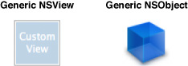
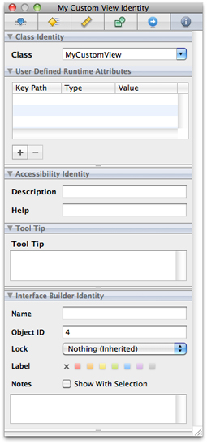

> 导航：[总目录](../../../README.md) · [documentation](../../../_indexes/documentation.md) · [Interface Builder User Guide](Introduction.md)


[Next](Testing%20and%20Validation.md)[Previous](Connections%20and%20Bindings.md)

# Xcode Integration

Interface Builder itself is not a coding environment; it is a visual design environment. Although you can use it to define new Objective-C classes, and to add outlets and actions to existing classes, the preferred approach is to use Xcode for those tasks. Interface Builder is tightly integrated with Xcode and is able to retrieve information about the classes in a project and make that information available to you as you work on the project’s associated nib files.

To make the most of Interface Builder’s integration with Xcode, you should do the following during development:

1. Keep your Xcode project open while editing your nib files.
2. Whenever you want to create a new class, or add an outlet or action to an existing class, do it in Xcode.
3. To set the class of an object, simply type its name in the Identity pane of the inspector window.

The Xcode integration works best if both Xcode and Interface builder are running at the same time. If your Xcode project is open, Interface Builder periodically queries it for information about new classes or changes to existing classes. You can tell if a document is associated with an Xcode project by looking at status bar along the bottom edge of the document window. This bar displays the name of the associated Xcode project and an indicator that lights up green when the project is available.

If Xcode is not running, Interface Builder supports alternate ways to associate your class information with your nib files. The following sections describe these techniques and show you how to use the Xcode integration to build your user interfaces efficiently. The Xcode integration is supported only for applications that use the AppKit or UIKit frameworks and is not supported for Carbon applications. For additional information about working in the Xcode environment, see _[Xcode Workspace Guide](../Xcode%20Workspace%20Guide/Introduction.md#apple-f4xwc4dqnrsv64tfmyxwi33df52wszbpkridimbqga3dsmrq)_.

Although most objects in the library are provided by the platform and have a known type, the library also contains generic objects (Figure 8-1) that you can use to represent any class in your project. Using these generic objects lets you incorporate custom code that is not otherwise part of the Interface Builder library. Placeholder objects, like File’s Owner, are another type of generic object whose class you must set prior to use.

__Figure 8-1__  Generic objects



To add a custom view or object to your Interface Builder document, do the following:

1. Drag the desired object from the library.

   - For a generic view, drop it onto your window’s design surface. (You can also drop views onto the Interface Builder document window if you just want a view resource without a surrounding window.)
   - For a generic object, drop it into your Interface Builder document window.
2. Select the view or object.
3. Open the identity inspector.
4. Use the available controls to configure the class information.

   - In Cocoa and Cocoa Touch nib files, configure the class name using the Class Identity section of the identity inspector; see Figure 8-2. Type the name of your class in the Class field or use the combo box control to select the class from the current list of known classes.

     __Figure 8-2__  Setting the class of an object

     
   - In Carbon nib files, specify the Class ID of the class in the Class Identity section of the identity inspector.

If your nib file is associated with an Xcode project, Interface Builder attempts to complete the class name automatically as you type it. When the class is set, Interface Builder displays the known outlets and actions for that class in the inspector. If your nib file is not associated with an Xcode project, Interface Builder displays the class name but does not display any outlets or actions initially. You can add outlet and action information using the appropriate sections of the inspector if you like. If you do so, however, you must manually add those same outlets and actions to your source files later. For information about using Interface Builder to define outlets and actions, see [Defining Outlets and Actions in Interface Builder](#apple-f4xwc4dqnrsv64tfmyxwi33df52wszbpkridimbqga2tgnbufvbuqmjyfvjvonq).

Because the Classes library makes it easy to instantiate your custom classes, the recommended workflow is:

1. Create your custom classes in Xcode.
2. Instantiate them in Interface Builder by dragging them out of the Classes library.

This eliminates the need to drag out a generic view or object and then set its custom class.

In Cocoa and Cocoa Touch applications, outlets and actions are a way to create dedicated connections among the objects that exist both inside and outside of a nib file. Outlets are essentially instance variables that refer to other objects. Actions are messages that objects send to an associated target object in response to certain events. You identify outlets and actions in your code using the `IBOutlet`, `IBOutletCollection`, and `IBAction` keywords as described in the following sections.

The `IBOutlet` and `IBOutletCollection` keywords signal to Interface Builder that you want to populate a variable with real objects when a nib file is loaded. Outlets can be weakly typed or strongly typed in your code. Weakly typed outlets (those whose type is `id`) can be connected to any object in your nib file. Strongly typed outlets can be connected only to an object whose class matches the type of the outlet.

To add an outlet to a class, you can insert the `IBOutlet` keyword in front of its instance variable declaration, as shown in the following example:

```objc
@interface MyClass : NSObject
{
    IBOutlet id        aGenericOutlet;
    IBOutlet NSView*   aViewOutlet;
}
@end
```

If you use this approach, you should define accessor methods that ensure the objects are retained at runtime.

In Mac OS X and in iOS 3.2 and earlier, you can connect an outlet to only a single object. However, starting with iOS 4.0, you can connect an outlet to multiple objects. To do so, use the `IBOutletCollection` keyword. For example, to connect a view controller to multiple objects of type `UILabel`, you could add the following code in Xcode:

```objc
@interface MyController : UIViewController {
    IBOutletCollection (UILabel) NSArray* multipleLabels;
}
@end
```

If the output targets are not all the same kind of object, use `id` for the object type in the declaration, or omit the object type in the parentheses following `IBObjectCollection`; for example:

```objc
@interface MyController : UIViewController {
    IBOutletCollection (id) NSArray* multipleObjects;
}
@end
```

A better approach is to declare each outlet as a property. The `IBOutlet` or `IBOutletCollection` keyword goes immediately before the property’s type information and after any parenthetical attributes, as shown in this example:

```objc
@interface MyClass : NSObject
{
    id        aGenericOutlet;
    NSView*   aViewOutlet;
    NSArray*  multipleLabels;
    NSArray*  multipleObjects;
}
@property (nonatomic, retain) IBOutlet id aGenericOutlet;
@property (nonatomic, retain) IBOutlet NSView* aViewOutlet;
@property (nonatomic, retain) IBOutletCollection (UILabel) NSArray *mutipleLabels;
@property (nonatomic, retain) IBOutletCollection (id) NSArray *mutipleObjects;
@end
```

For more information about properties, see _[The Objective-C Programming Language](../../Cocoa/The%20Objective-C%20Programming%20Language/Introduction.md#apple-f4xwc4dqnrsv64tfmyxwi33df52wszbpkridgmbqgaytcnrt)_.

An action message sent by an object to its target results in the invocation of an action method on the target object. In essence, this is just another way of saying that the object that sends an action message does so simply by calling a method of its target object. Therefore, in order to define an action, you actually define an action method on the corresponding target object. The definition of this method is where you respond to the action. For example, if the user clicks or taps a button, the corresponding action method is where you would write the code to respond to the button interaction.

In Cocoa applications, an action method takes a single parameter of type `id` and returns the type `IBAction`, which is defined as `void`. The name of the action method can be anything you want but is typically evocative of the action being performed. For example, to respond to a click in a button, you might define the following method in the controller object that manages the button:

```objc
- (IBAction)respondToButtonClick:(id)sender;
```

In Cocoa Touch applications, an action method can take one of three forms, shown here:

```objc
- (IBAction)respondToButtonClick;
- (IBAction)respondToButtonClick:(id)sender;
- (IBAction)respondToButtonClick:(id)sender forEvent:(UIEvent*)event;
```

Action methods do not require a one-to-one correspondence with the controls in your interface. You can define one action method for each control in your interface or several controls can share a single action method. When present, the _sender_ parameter in an action method contains the object that sent the action and can be used to help process the action. In iOS, the optional _event_ parameter conveys additional details about the specific type of event that triggered the action.

If you subclass standard system classes, you should check the definitions for any parent class before adding your own custom action methods. For example, many Cocoa classes already implement `cut:`, `copy:`, and `paste:` action methods to respond to pasteboard actions. Using inherited action methods lets you respond to messages sent by your own code and also messages sent by the system. In general, you should implement custom action methods only when the action methods provided by parent classes are insufficient or do not provide the behavior you need.

If your Interface Builder document is already associated with an Xcode project, you do not have to do anything to synchronize the two. When you change your source files in Xcode and save those changes to disk, Interface Builder automatically detects those changes and updates its internal copy of the information. In other words, if you add an outlet to a custom view in Xcode and then switch to Interface Builder, that outlet will appear automatically in the connections panel and inspector windows for that view. Of course, the Xcode syncing support is contingent upon the ability to parse your code successfully. If your code contains syntax errors, Interface Builder may not be able to read the changes.

If you disable the automatic syncing option in the Interface Builder preferences, you can sync your Xcode project manually by choosing File > Reload All Class Files. This command forces Interface Builder to reread any source files containing relevant class definitions.

Although Xcode is the preferred environment for creating new classes, there may be cases where you want to define your nib file first, including the definitions for any custom classes. The following sections show you how to do this in Interface Builder.

The ability to reference unknown classes in Interface Builder lets you rapidly prototype your user interface without worrying about the underlying code. You can change the class name and change the names of outlets and actions as needed. Once you are satisfied with your prototype, you can generate source files for any unknown classes from Interface Builder and begin writing the code for those classes. After generating the source files, you can also specify the superclass for your class. For information about generating class files, see [Generating Source Files for New Classes](#apple-f4xwc4dqnrsv64tfmyxwi33df52wszbpkridimbqga2tgnbufvbuqmjyfvjvomy).

In Interface Builder 3.2 and later, to define a new Objective-C class do the following:

1. In the Library window, click the classes tab and select the class you want to subclass.
2. From the action menu, choose New Subclass.
3. Enter the name of the subclass and whether or not to immediately generate source code files.

   If you plan to add outlets and actions to the subclass, wait and generate the source code files later.
4. Click OK (or press Return) to define the new class.

In Interface Builder versions earlier than 3.2, to define a new Objective-C class do the following:

1. Select the object whose class you want to set.
2. Open the inspector window and select the Identity pane.
3. In the Class field, type the full name of the class.
4. Press Return (or select another field) to apply the class name.

When you type the name of an unknown class in the identity inspector, Interface Builder assumes that this class exists somewhere outside the nib file. After creating the class, you can define outlets and actions for it as described in [Defining Outlets and Actions in Interface Builder](#apple-f4xwc4dqnrsv64tfmyxwi33df52wszbpkridimbqga2tgnbufvbuqmjyfvjvonq) and use those outlets and actions to create connections in your nib file. Classes created in this manner have an unknown superclass and exist only within Interface Builder.

When present, the Class Outlets and Class Actions sections of the Library window display the known outlets and actions of the currently selected class. In addition to viewing the existing list of outlets and actions, you can also add new ones using the controls found in these sections. You would typically use this feature during prototyping, when your nib file does not yet have an associated Xcode project. For example, you might create a new class for your prototype and add outlets and actions to get a sense of what behaviors you would need in your code.

__Figure 8-3__  Defining outlets and actions in the Library window

!

To add an outlet or action, do the following:

1. Click the plus (`+`) button in the appropriate section to add the new action or outlet.
2. Type a new name.

   As you type the name of an action method, Interface Builder displays warnings in the Class Actions section of the inspector to let you know if you are specifying an invalid method name.

   In Mac OS X, action methods take a single parameter and therefore the method name must end with a colon (“:”) character.

   In iOS, action methods may take zero, one, or two parameters.
3. Optionally, specify a custom type for outlets by typing the appropriate class name. (You can also change the parameter type of action methods, although `id` is the standard parameter type.)

To remove a custom defined outlet or action, select it in the identity inspector and click the minus (`-`) button. You can remove only those outlets and actions you previously added using Interface Builder. You cannot remove outlets and actions you created in your Xcode source files or those defined in a Cocoa parent class.

The outlets and actions you add using the Library window remain local to Interface Builder and your Interface Builder document. Interface Builder does not attempt to merge these outlets and actions back into your Xcode source files; you must do that manually. You can write out source and header files containing the outlet and action definitions for your class by choosing File > Write Class Files. You can then use the generated files as your initial source or merge their contents in with your existing source files using your favorite merge tool, such as the FileMerge application.

If you create new classes using the Library window, you can ask Interface Builder to create an initial set of source files for those classes. When generating source files, Interface Builder also generates the appropriate set of member variables and methods corresponding to the outlets and actions of the class. This feature helps your prototyping efforts by eliminating the need to recreate your class definitions manually in Xcode.

To generate source files for a class you defined in Interface Builder:

1. Select the object that uses the desired class.
2. Choose File > Write Class Files.

   Interface Builder prompts you to save the new source files.
3. Open the header file.
4. Specify the superclass information for the class.

Beginning in Interface Builder 3.2, you can generate or update source files using the classes tab in the Library window:

1. Select the class for which you want to generate or update source files.
2. Display the action menu and choose Write Updated Class Files or Generate Class Files.

After generating the source files, you should add them to your Xcode project and make any future changes from there. Changes made to source files in your Xcode project are automatically picked up by Interface Builder, but the reverse is not true. Interface Builder does not update source files after it generates them. Instead, you must incorporate any additional changes into the source files manually from Xcode.

As much as possible, Interface Builder relies on Xcode to provide it with information about your project’s custom classes. If you are writing a Cocoa or Cocoa Touch application and that information is not available, however, you can provide it manually by doing one of the following:

- Drag the class header files from Xcode or the Finder and drop them onto your Interface Builder document window.
- From Interface Builder, choose File > Read Class Files and select the header files.

When you use either of these techniques, Interface Builder parses the provided header files for information and caches that information in your Interface Builder document. The cached information remains valid until the next time you import header files or until Interface Builder accesses the class information from the associated Xcode project.

If the header files you import refer to other custom classes, you should import the header files for those other classes as well. This is especially important if the parent of your custom class is also a custom class. Without the full parent class hierarchy, Interface Builder cannot build a complete picture of the outlets and actions of the class. However, you do not need to import classes defined in the AppKit or UIKit frameworks or those that are defined in an Interface Builder plug-in.

You can use Interface Builder for more than just native Mac OS X and iOS applications. Interface Builder also provides support for applications built using the Ruby, Python, and AppleScript scripting languages and can parse script files that contain the appropriate keywords.

If you are a Ruby, Python, or AppleScript developer, you can take advantage of the Cocoa scripting bridge to write your application code and use nib files to create your application’s user interface. As you build your interface, you associate elements from that interface with objects in your scripts much like you would associate them with Objective-C objects. For information about how to use the Cocoa scripting bridge, including the keywords you need to add to your script, see _[Scripting Bridge Programming Guide](../../Cocoa/Scripting%20Bridge%20Programming%20Guide/Introduction%20to%20Scripting%20Bridge%20Programming%20Guide%20for%20Cocoa.md#apple-f4xwc4dqnrsv64tfmyxwi33df52wszbpkridimbqga3dcmbu)_ and _[Ruby and Python Programming Topics for Mac](../../Cocoa/Ruby%20and%20Python%20Programming%20Topics%20for%20Mac/Introduction%20to%20Ruby%20and%20Python%20Programming%20Topics%20for%20OS%20X.md#apple-f4xwc4dqnrsv64tfmyxwi33df52wszbpkridimbqga2dsmzw)_.

[Next](Testing%20and%20Validation.md)[Previous](Connections%20and%20Bindings.md)

