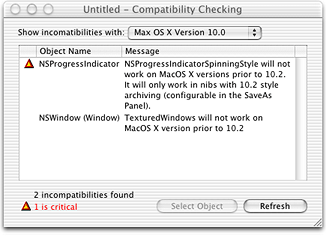

> 导航：[总目录](../../../README.md) · [documentation](../../../_indexes/documentation.md) · [Interface Builder](Introduction%20to%20Interface%20Builder.md)

[Next](Cocoa%20Custom%20Views.md)[Previous](Introduction%20to%20Interface%20Builder.md)

# Compatibility Checking

Interface Builder stores your user interface design in one or more resource files called nib files. A nib file contains a representation of a set of interface objects and their relationships. With Mac OS X v10.2, Interface Builder started using a new format for Cocoa nib files. The older format is not capable of archiving some interface elements introduced with Mac OS X v 10.2 and later versions of Mac OS X. However, Mac OS X v10.1 and earlier systems cannot unarchive nib files saved with the newer format. Therefore, it is necessary to save your nib files in the format that is appropriate to your target version of Mac OS X (that is, the earliest version of Mac OS X on which you certify your application to run). For Carbon applications, there is only one nib file format, which is used for all versions of Mac OS X.

In addition, for both Carbon and Cocoa, new interface elements are introduced from time to time with new versions of the operating system. These elements are not available to programs running on older versions of Mac OS X, regardless of which nib file format is used.

Interface Builder lets you specify which format to use when saving a Cocoa nib file. It also provides a way to check the interface elements in your GUI for compatibility with specific versions of Mac OS X.

For Cocoa applications, three file formats exist for Interface Builder documents: “pre-10.2,” “10.2 and beyond,” and “both.” The pre-10.2 format uses sequential archiving; the 10.2 and later format uses keyed archiving. See [Archives and Serializations](https://developer.apple.com/library/archive/documentation/Cocoa/Conceptual/Archiving/Archiving.html#//apple_ref/doc/uid/10000047) in Cocoa Data Management Documentation for details about these two archiving methods.

When you are editing your UI in Interface Builder, its default behavior is to preserve the file format of the current document. For example, if the existing nib file is in the old format, re-saving will use the old format. If the current nib file exists in both formats, then re-saving will use both formats.

To specify the format in which to save a new Cocoa nib file, open the General pane of the Interface Builder Preferences dialog and select one of the following options:

- Pre-10.2 format
- 10.2 and later format
- Both formats

If you select Pre-10.2 format, Interface Builder cannot archive any new types of objects introduced since Mac OS X 10.1 (such as the circular progress indicator or the brushed-metal, textured window appearance).

If you select 10.2 and later format, Interface Builder can archive all new features, but your application is not guaranteed to run in versions of Mac OS X prior to version 10.2.

If you select Both formats, Interface Builder saves the nib file twice, once in each format. When the user runs the application, the runtime environment automatically selects the appropriate nib file. In this case, you can add new features to your GUI; however, when the program runs in Mac OS X v10.1 or earlier systems, the new features will not be available. For example, a brushed-metal window displays with the older appearance instead. If you want to use the Both formats feature with newer interface elements, you need to test your application in Mac OS X v10.0 or v10.1 to make sure that the appearance and function of the windows and controls are satisfactory in all cases.

When you re-save an existing nib file, Interface Builder’s default behavior is to retain the original format of the file, regardless of the format setting in Preferences. To change the format of the nib file, select File > Save As and select the format you want in the Save dialog.

New interface elements and attributes are added to Mac OS X from time to time and are represented in Interface Builder by new widgets and, sometimes, new palettes. Some elements are not supported by older version of Cocoa or Carbon.

Before saving a Cocoa nib file, Interface Builder performs a compatibility check to make sure that all of the objects in the nib can be archived using the nib’s current format. Specifically, if the nib file format is “Pre-10.2”, Interface Builder makes sure that each object in the nib can be fully archived using sequential archiving. If newer objects (that use keyed archiving only) are present in the nib, Interface Builder does not allow the save and displays an alert dialog indicating that saving with an incompatible nib format would result in data loss for the objects in question. To save such a nib, its format must be changed to “10.2 and later” or “Both.”

Keep in mind that, although saving in both formats preserves the data in the nib file, newer keyed-archived objects will not work properly at runtime on older versions of Mac OS X. To check your Carbon or Cocoa nib file for compatibility with different versions of Mac OS X, select File > Compatibility Checking. This check will give warnings based on the operating system version you specify in the popup menu at the top of the dialog. If a feature you used in your nib will not work with the version of Mac OS X you specified, you will receive a warning. If your application will not be able to run using this nib file on this version of Mac OS X, the error is flagged as critical. Figure 1 illustrates the Compatibility Checking dialog.

__Figure 1__  Compatibility Checking Dialog

Note that the interface elements available in Carbon are not identical to those available in Cocoa, and that similar elements might have been introduced at different times for these two development environments. To avoid unpleasant surprises, if your application is targeted to any version of Mac OS X older than the current version, run the compatibility checker before you finalize your design.

[Next](Cocoa%20Custom%20Views.md)[Previous](Introduction%20to%20Interface%20Builder.md)

