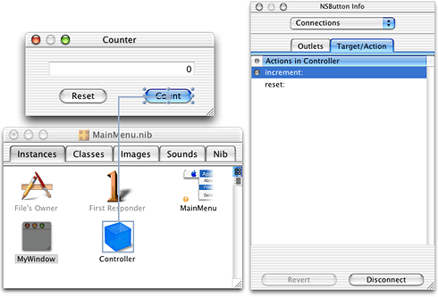
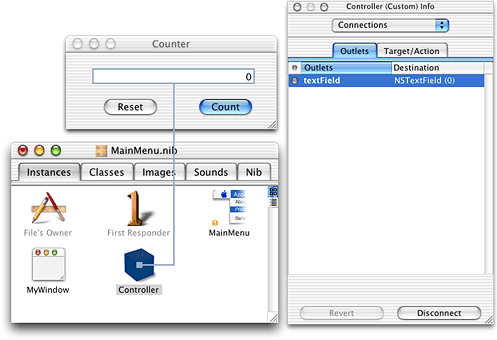
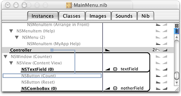

> 导航：[总目录](../../../README.md) · [documentation](../../../_indexes/documentation.md) · [Interface Builder](Introduction%20to%20Interface%20Builder.md)


[Next](Frequently%20Asked%20Questions.md)[Previous](Cocoa%20Custom%20Views.md)

# Making Connections in Cocoa Applications

For Cocoa-based applications, you can use Interface Builder to connect UI elements to each other and to your controller code so they can pass messages back and forth. Any object (and controllers in particular) can have an outlet, which is an instance variable pointing to some other object. It is often useful to have your program's controller objects have outlets to specific user interface elements, so that the controller can tell the UI elements to change their state, display text, and so forth.

Controls have a special way they can connect to other objects: they can assign an object to be the target of the control, and a particular method inside that object to be the action that gets called when the control is triggered. How the control looks and functions are handled by the Cocoa infrastructure, so that all you have to implement are the target objects and their action messages. For more information on the target-action paradigm, see Communicating With Objects in Cocoa Design Guidelines Documentation.

To establish either outlet or target-action connections, you control-click the object that will be the source of the messages and drag to the object that will be the destination of the messages. Interface Builder displays a gray line between the two objects, with a square at one end showing the origin of the message. When the connection is displayed, you can open the Connections pane in the Info window to see lists of the available outlets and actions in the inspector, select the outlet or action you want, and click the Connect button to establish the connection. The key thing to remember is to always control-drag in the direction that messages will flow.

Certain objects in your user interface, when manipulated by the user, send a message to another object (the _target_) telling it to perform some _action_. For example, a button can send a message to a drawer, telling it to open or close. For Cocoa applications, Interface Builder makes it easy to “wire up” these relationships. To do so, you Control-click on the object that sends the message (the control) and drag to the object that performs the action (the target). The Connections pane in the Info window then shows a list of the actions the target knows how to perform. Select the action you want and click Connect.

Actions are methods implemented by the target. When you connect a control to a target and select an action, that tells the control to send a message (containing any necessary data) to the target telling it to perform that method when the user manipulates the control. To summarize: for target-action connections, the action message is sent from a control to a target; the action method is implemented in the target.

For example, Figure 1 shows the connection of a button labeled “Count” to the Controller object so that the `increment:` action will be called when the button is clicked. You do this by control-dragging from the button to the controller, selecting “increment:” in the Target/Action tab of the Connections pane, and clicking Connect.

__Figure 1__  Connecting an action to the Controller



In many cases, the target already has an implementation of the action method you need and you do not have to write any code to make this connection work. For example, the Drawer object has implementations of the actions `open:`, `close:`, and `toggle:`. However, to perform an action not already provided, you must add the action to the target before you make the connection.

To add actions to a target in your project, you use one of the following conventions for the method prototype in your code:

```objc
-(void) myActionMethod: (id)sender;-(IBAction) myActionMethod:(id)sender;
```

In the example in Figure 1, the `increment:` action is prototyped in the Controller code as:

```objc
- (IBAction)increment:(id)sender;
```

Select the class to which you want to add the action in the Classes pane of the Nib file window and select Classes > Add Action to [_name of class_].

For more information on the target-action paradigm, see Communicating With Objects in Cocoa Design Guidelines Documentation.

An outlet is an instance variable in one object that can be linked, through an ID, with another object. When you make an outlet connection, you are in effect telling the object that contains the instance variable the location of the object to which you are making the connection.

For example, in Figure 1, the `increment:` message is sent from the button to the Controller object. The Controller object executes the `increment:` method. In this example, the application increments an integer and then displays the new value in a text field. In order for the Controller object to send a message to the text field telling it to display this data, it must have a pointer to that control at runtime. To give the Controller that pointer, you Control-click the Controller object and drag to the text field. You then select the outlet in the Outlets tab of the Connections pane (`textField` in Figure 2) and click Connect. That tells Interface Builder that the instance variable `textField` in the Controller is the outlet; that is, it should contain a pointer to that text field. At runtime, when an instance of the Controller object is created, the outlet `textField` is given a pointer to the text field.

__Figure 2__  Connecting an outlet



Many objects include instance variables that can be used as outlets. For example, an NSDrawer object has the outlets `contentView`, `delegate`, and `parentWindow`. If the object you are using doesn’t already have the outlets you need, you can add your own outlets to it. To add outlets to your project, you use one of the following conventions for the variable declaration in your code:

```
id aDynamicallyTypedInstanceVariable;IBOutlet NSButton* aStaticallyTypedInstanceVariable;
```

For example, the `textField` outlet is declared in the Controller code as:

```
id textField;
```

Select the class to which you want to add the outlet in the Classes pane of the Nib file window and select Classes > Add Outlet to [_name of class_].

The runtime code uses the list of outlets you generated in Interface Builder. For example, if you specified an outlet called `textField`, Interface Builder first investigates the class containing the outlet to see if it responds to `setTextField:(id)`. If it does, that method is called with the pointer to the text field you established in Interface Builder. If `setTextField:(id)` doesn’t exist, the instance variable `textField` itself is filled with the pointer. The object with the outlet must know how to send data to the object pointed to by `textField`. For standard outlets listed for an object in an Interface Builder palette, see the documentation for the class of that object to find out what you can use the outlets for. If you are writing your own custom subclass or your own controller, look at the documentation for the class of the receiving object to find out what messages it can handle.

Connections are a fundamental part of an application’s object infrastructure. That is, object-oriented code depends as much on the messages sent between objects as on the definitions of the objects themselves. Once you have developed and debugged an application, therefore, it is highly desirable to keep the connections from being inadvertently altered. Towards this end, Interface Builder has a preference that locks all connections for a user. You might use this feature, for example, if you are localizing a nib and do not want to accidentally change any connections. This setting is on the Editing pane of the Preferences dialog.

First Responder is your portal to the responder chain. You can add actions to First Responder in the Classes pane of the nib file window. Then, connect buttons and menu items to First Responder so that they call the desired action. The first object in the responder chain that understands this action will be called.

Because keystrokes do not point anywhere on the screen, all keystrokes are sent to the first responder. You can designate the first responder as the target of a control by connecting the control to the First Responder icon in the Instances pane of the Nib file window. When you do so, you can choose from the list of supplied actions, or you can add your own actions to the project and use one of those for the First Responder.

The responder chain is discussed in the programming topic [Introduction to Cocoa Event-Handling Guide](https://developer.apple.com/library/archive/documentation/Cocoa/Conceptual/EventOverview/Introduction/Introduction.html#//apple_ref/doc/uid/10000060i-CH1) in the Cocoa Events and Other Input documentation area.

File’s Owner represents the object that will be passed in for owner in the method `[NSBundle loadNibNamed: owner]`. That is, File’s Owner is a proxy for an object that exists outside of the nib file but that can be connected to objects in the nib file. You can use the Custom Class Info Panel to specify what kind of object File’s Owner is. Once you’ve indicated what File’s Owner is, Interface Builder knows what outlets and actions are available for it and you can make connections to it.

Items in menus are connected to objects in your application in a similar fashion to that used for controls and views. As an example, the following procedure could be used for multi-document applications with multiple nibs.

Use the following procedure to make connections from the menu bar to your window controller:

1. In your main nib, instantiate a subclass (usually of NSObject or NSDocument) to use as your window controller.
2. Select the FirstResponder class in the Classes pane of the Nib file window (or double-click the First Responder icon in the Instances pane) and add the actions that you want to connect to a menu item.
3. Control-drag from the menu item in the Menu Editor window to the First Responder icon in the Instances pane of the Nib file window.
4. Connect the action you want the menu item to initiate.

At runtime when one of your nib file windows is key, its window controller will be in the responder chain (because the window controller is the delegate of the window) and the menu item will work. This is one of the reasons for the existence of the FirstResponder class.

You can make connections in outline view as well as in icon view. There are some advantages to outline view: you can see multiple connections at one time, you can find deeply-nested subclasses more easily, and you can tell which objects have both outlet and target-action connections. Figure 3 shows an example of connections displayed in outline view.

__Figure 3__  Making connections in outline view



In the figure, the two outlet connections for the Controller object are highlighted by clicking on the right-facing triangle with the 2 next to it. The left-facing triangle on the same line highlights the one target-action connection that has the Controller object as a target. A new connection is being made from the Controller object to the NSButton(Count) object, as indicated by the gray line. To make the connection, you Control-click on the origin of the connection and drag to the class name representing the object to which you want to connect.

Use the icon at the top of the vertical scroll bar to toggle between icon view and outline view.

[Next](Frequently%20Asked%20Questions.md)[Previous](Cocoa%20Custom%20Views.md)

