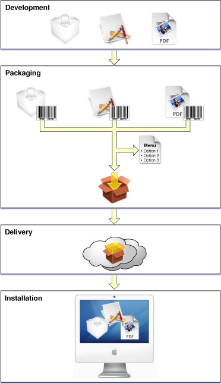

> 导航：[总目录](../../../README.md) · [documentation](../../../_indexes/documentation.md) · [PackageMaker User Guide](Introduction%20to%20PackageMaker%20User%20Guide.md)

[Next](Packaging%20Workflow.md)[Previous](Introduction%20to%20PackageMaker%20User%20Guide.md)

# Packaging Overview

Packaging is one of the processes that make up the OS X software-delivery model. An _installation package_ is a file package that contains product files (the _payload_), instructions on how to add them to an OS X–based system, and information used to create an appropriate install experience for the user. When users open your installation package, the Installer application guides them through the installation process, which ensures that their computer meets the installation requirements defined in the package before placing the payload on the user’s file system, among other tasks.

The preferred software delivery mechanism for a self-contained application is the _manual install_, where users drag the product from its container, a disk image, onto their file system. The installation package–based mechanism is the preferred method for delivering a multicomponent product that isn't self-contained in a bundle. A _managed install_, which is steered by the Installer application after the user opens an installation package, can take advantage of advanced features such as better package management through the Installer package database, downloadable packages, and certificate-based signing. OS X leverages these features to provide users an improved install experience.

There are two types of installation packages: product packages and component packages. _Product packages_ contain the payload for an entire product, either as a single component or distributed among several component packages. _Component packages_ enclose a single component of a product and are generally contained within product packages. In addition, product packages can refer to external component packages through _package references_.

PackageMaker is the application you use to create installation packages. Figure 1-1 shows the packaging process within the software development-packaging-delivery-installation workflow. The rest of this document focuses on the packaging process.

__Figure 1-1__  The packaging process

To package a product:

1. Identify and collect the product’s components
2. Create a PackageMaker project
3. Add the product’s components to the project
4. Configure component packages
5. Configure the product package
6. Define install options (in multicomponent products)
7. Build and test the product package

[Packaging Workflow](Packaging%20Workflow.md#apple-f4xwc4dqnrsv64tfmyxwi33df52wszbpkridimbqga2tgnzrfvbuqmjqgayc2u2xge) describes the packaging workflow in detail.

[Next](Packaging%20Workflow.md)[Previous](Introduction%20to%20PackageMaker%20User%20Guide.md)

