> 导航：[总目录](../../../README.md) · [documentation](../../../_indexes/documentation.md) · [PackageMaker User Guide](Introduction%20to%20PackageMaker%20User%20Guide.md)

[Next](Glossary.md)[Previous](Packaging%20Overview.md)

# Packaging Workflow

PackageMaker is used to create installation packages. Download the DeveloperUtilities app from [http://developer.apple.com/downloads](https://developer.apple.com/downloads). Figure 2-1 shows the PackageMaker project window. The list following the figure describes the items identified in it.

__Figure 2-1__  PackageMaker project window

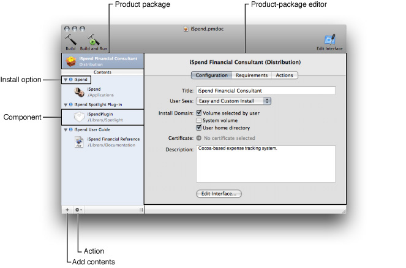

- The left side of the window contains the _package list_. The first item in the list represents the _product package_ the project generates. The items in the Contents pane represent _component packages_ and, in product packages with more than one component package, install choices (the items with a blue dot next to them).
- The right side of the project window contains an editor for the item selected in the package list. Figure 2-1 shows the product-package editor.
- The plus sign (+) icon at the bottom-left corner of the window is the _Add Contents button_.
- The gear icon is the Action pop-up menu (also known as the _shortcut menu_). Its contents correspond to possible actions on the selected item.

The following sections depict the workflow you should follow when creating installation packages.

A PackageMaker project is where you identify a product to be packaged and define the install experience for the users of the product. To create a PackageMaker project, choose:

PackageMaker displays the Install Properties dialog, shown in Figure 2-2.

__Figure 2-2__  Install Properties dialog

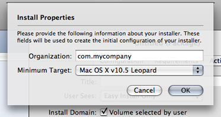

In this dialog you specify the following package properties:

- __Provider Identifier (Organization):__ Identifies the entity responsible for the package’s contents. PackageMaker uses the provider identifier to generate default package identifiers for the contained component packages. See [Component Package Configuration Pane](#apple-f4xwc4dqnrsv64tfmyxwi33df52wszbpkridimbqga2tgnzrfvbuqmjqgayc2u2xge2a).
- __Target OS (Minimum Target):__ The earliest OS X release on which you intend the package to be installed.

To define the package’s payload, locate the product components to be included in the package and add them to the Contents pane in the project window. You can add components by dragging them from a Finder window or by choosing:

After adding a second component to a project, PackageMaker creates an install choice for each component you add to the project, unless you add it directly to an existing install choice.

You configure a component package in the _component package editor_, which contains four panes: Configuration, Contents, Components, and Scripts. They are described in the following sections.

The Component Package Configuration pane (shown in Figure 2-3) is where you specify essential information about the component package and its install experience. The list following the figure describes the items it specifies.

__Figure 2-3__  Component Package Configuration pane

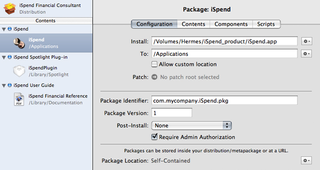

- __Component source (Install):__ Pathname to the component’s root directory. This is the location of the component’s files on your file system. These files make up the component package’s payload.
- __Destination (To):__ Location in the target computer’s file system where the component is to be placed.
- __Custom destination consent (Allow custom location):__ Specifies whether the user installing the component package can specify a different destination.
- __Package identifier:__ String, in the form of a universal type identifier (UTI), that identifies the component package. For example, `com.apple.iSpend.pkg`.
- __Package version number:__ Positive integer that specifies the iteration of the component package. (This version number is not related to any versioning information specified in the payload.)
- __Finalization action (Post-install):__ Action to require the user perform after the installation process is complete. The available actions are log-out, restart, and shutdown.
- __Administrator-authentication requirement (Require admin authorization):__ Specifies whether the user must authenticate as an administrator of the computer before performing the install. This is needed when the user can install a product in one of the privileged file-system domains, such as the local domain (for example, `/Applications`). You don’t need to select this option when the user can install your package only on their home directory (see [Product Package Configuration Pane](#apple-f4xwc4dqnrsv64tfmyxwi33df52wszbpkridimbqga2tgnzrfvbuqmjqgayc2u2xge3a) for more information).

The Component Package Contents pane (shown in Figure 2-4) is where you specify the ownership and access permissions of each of the files that make up the component.

__Figure 2-4__  Component Package Contents pane

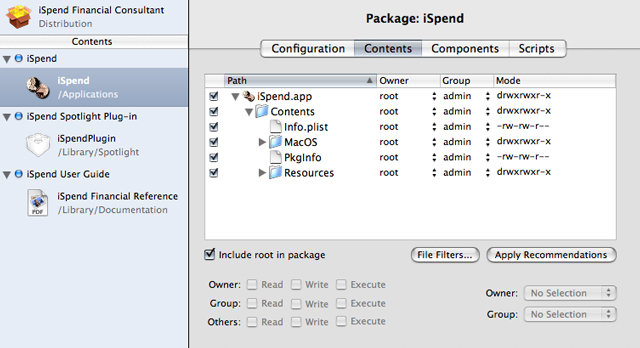

In most cases, the owner should be `root` and the group `admin`. Also, PackageMaker can set the owner, group, and access permissions of the component files to those that work best in OS X, according to the component type.

The Component Package Components pane (shown in Figure 2-5) specifies whether the component is relocatable or downgradable.

__Figure 2-5__  Component Package Components pane

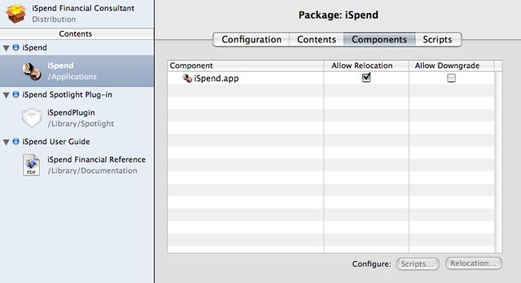

A _relocatable component_ is one that may be moved by the user after it’s installed. For example, after installing an application into `/Applications`, a user with administrator privileges may move it to `/Volumes/Family/Applications`. When the user installs a relocatable component a second time on the same computer, the Installer application searches for the component’s existing files in additional locations in the file system, not just the location at which the component was installed, according to the Installer package database).

In this pane you also specify whether a component can be downgraded. A _downgradable component_ is one that can be replaced with an earlier version during an install. When the user reinstalls a earlier version of an existing downgradable component, Installer replaces component files that exist in both the payload and the target computer with the ones in the payload and deletes files that are not present in the payload.

The Component Package Scripts pane (shown in Figure 2-6) specifies install operations—which are implemented as executable files—to perform before (preinstall) or after (postinstall) the component is installed.

__Figure 2-6__  Component Package Scripts pane

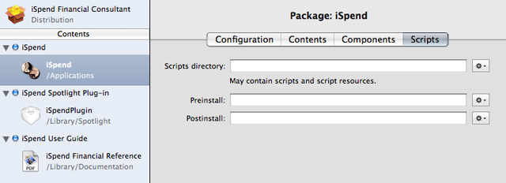

For detailed information about install operations, see _Software Delivery Guide_.

When you select the product package in the package list, the _product package editor_ appears on the right side of the project window. In this editor you define the product’s packaging details and some installation information. The following sections describe the panes in the product-package editor.

The Product Package Configuration pane (shown in Figure 2-7) is where you enter information about the product package, such as its title and description. You can also add other product description files, such as the Welcome, Read Me, License, and Conclusion files (see _Software Delivery Guide_ for details).

__Figure 2-7__  Product Package Configuration pane

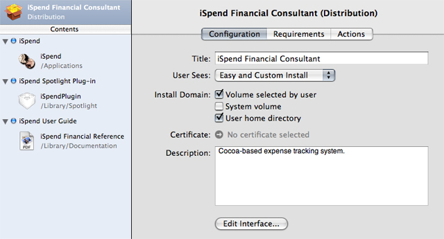

This pane also lets you specify which type of install the user can perform on the product package: easy, custom, or both. In addition, you can specify the locations into which the user can install the product: any volume, the system volume, or the user’s home directory.

A _package requirement_ is a test the Installer application performs at the beginning of the installation process. These requirements may be optional. Any unmet, non-optional package requirement prevents the installation process from continuing. Figure 2-8 shows the Product Package Requirements pane, where you specify these requirements. In this case, the package has two requirements, one required and one optional. Their definition and install effects are described in Table 2-1.

__Figure 2-8__  Product Package Requirements pane

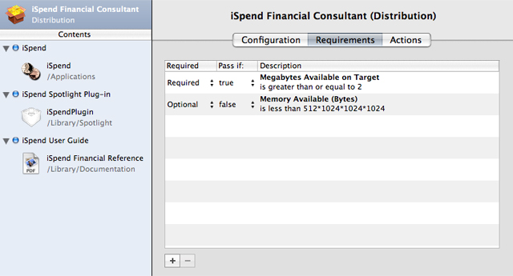

__Table 2-1__  Product package installation requirement examples

| Description | Required | Pass if | Install effect |
| Disk space on target volume is at least 2MB | Yes | `true` | Prevents install unless destination volume has at least 2MB of free space. |
| Computer RAM is less than 512MB | No | `false` | Displays a warning when the computer has less than 512MB of RAM. |

You may want to tell the Installer application to perform a particular action before or after the product package is installed. _Installation actions_ let you specify such tasks. For example, you can instruct Installer to show the installed payload in a Finder window, as shown in Figure 2-9.

__Figure 2-9__  Product Package Actions pane

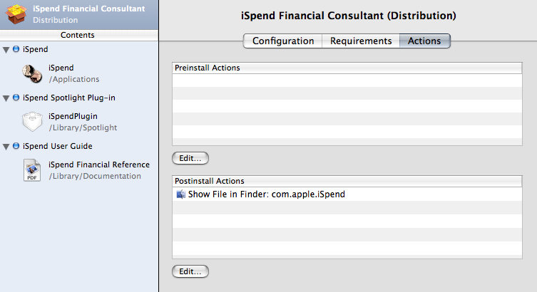

This postinstall action opens a Finder window displaying one of the installed product’s components.

When your product contains multiple components, it may be appropriate to let the user decide which components to install. For example, a particular user of your product may not want to install a documentation or example component. In this case, the user should be able to remove unwanted components from the install process. PackageMaker and the Installer application allow you to define install choices to accomplish such outcome.

_Install choices_ allow users of your product package to customize the install by selecting the components to be installed (unselected components are not installed). For example, if your product includes an application and a user guide as separate components, you may allow the user not to install the user guide by having the application and the user guide under separate choices. In the _install customization pane_ (the Custom Install pane in the Installer application), the user selects the components to be installed.

You configure an install choice by selecting it in the Contents pane in the project window and setting values for its properties in the _choice editor_, which contains two panes: Configuration and Requirements. Figure 2-10 shows the Choice Configuration pane.

__Figure 2-10__  Choice Configuration pane

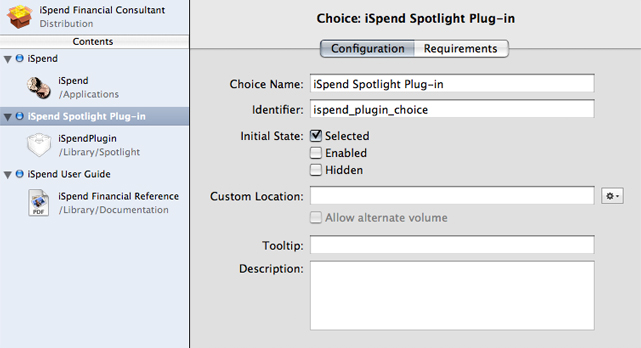

This pane lets you specify the following choice properties:

- __Choice Name:__ The text the user sees in the install customization pane.
- __Identifier:__ Identifies the choice within the package.
- __Initial State:__ Specifies the value of three user-interface properties (selected, actionable, and visible) of the choice the first time the user arrives at the install customization pane:

  - __Selected:__ Specifies whether the choice is selected.
  - __Enabled:__ Specifies whether the user can change the selected state of the choice directly.
  - __Hidden:__ Specifies whether the user can see the choice.
- __Destination (Custom Location):__ Specifies the destination of the choice’s components. Defining a choice destination overrides the destination specified for the choice’s components in the component package editor (see [Component Package Configuration Pane](#apple-f4xwc4dqnrsv64tfmyxwi33df52wszbpkridimbqga2tgnzrfvbuqmjqgayc2u2xge2a)). You may also allow the user to choose a different destination by selecting “Allow alternate volume.“ You should always specify a destination for every choice with product components.
- __Tooltip:__ Short message (15 words or fewer) that appears when the user hovers the pointer over the choice in the install customization pane.
- __Description:__ Information that appears in the install customization pane when the user selects the choice.

As described earlier, a choice has user-interface properties that define the level of interaction the user has with the choice in the install customization pane. While you can specify a value for each UI property in the package, there may be choices that need information about the computer to determine the value of such properties. For example, if an optional plug-in component can work only in certain releases of OS X, you may want to display the choice that contains the component only when the computer is running an appropriate operating system version. Here’s where choice requirements can help.

A _choice requirement_ is a test that compares a system property against a value and sets the initial and dynamic values of the choice’s UI properties based on the test result. (The Installer application sets the dynamic values of the UI properties as the user selects or deselects choices in the install customization pane; see _Software Delivery Guide_ for details.) Figure 2-11 shows the _choice requirement editor_, which lets you define the test and the resulting values of the choice UI properties if the test fails.

__Figure 2-11__  Choice requirement editor

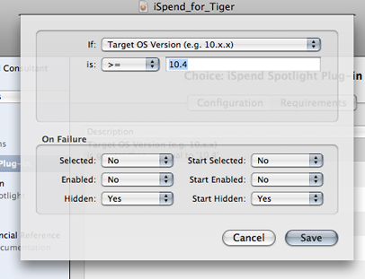

To build the package, choose:

A dialog appears asking for the name and location of the package.

Open the generated installation package in the Installer application and ensure that the resulting install experience is what you expect and that your product is installed correctly. You should perform comprehensive tests involving as many of the system configurations your product supports as possible. See _Software Delivery Guide_ for more information.

[Next](Glossary.md)[Previous](Packaging%20Overview.md)

