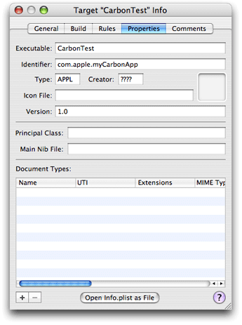

> 导航：[总目录](../../../README.md) · [documentation](../../../_indexes/documentation.md) · [Porting CodeWarrior Projects to Xcode](Introduction%20to%20Porting%20CodeWarrior%20Projects%20to%20Xcode.md)


[Next](Using%20PowerPlant%20in%20Universal%20Binaries.md)[Previous](Importing%20a%20CodeWarrior%20Project%20Into%20Xcode.md)

# After Importing a Project

Importing into Xcode is a good starting point for converting your project, but you’ll typically have some work to do before it successfully builds and runs. For example, the Xcode importer does a good job of duplicating the structure of a CodeWarrior project, but you’ll need to make sure the build settings it chooses are correct for your project. It’s likely that you are the best judge of settings such as compiler optimization, and you should check other build settings as well.

Of course if you prepared your code carefully before importing your project, and if your code is already fantastically clean and standard, you will have fewer changes to make after importing. But you are still likely to face some of the simple problems or some of the more subtle issues described in this chapter.

Once you’ve imported your project into Xcode, use one of the commands from the Build menu, such as Command-B, to build it. To view the full build report, choose Build > Build Results (or type Command-Shift-B). In the resulting Build Results window, you can open the build log to show the most detailed results; to do so, click the button to the left of the arrow, below the top pane of the window. This group of buttons allow you to control the amount of information displayed.

You can also view any errors or warnings generated during the build in the Errors and Warnings group in the project window. See the section [The GCC Compiler](Xcode%20From%20a%20CodeWarrior%20Perspective.md#apple-f4xwc4dqnrsv64tfmyxwi33df52wszbpgiydambrg4ydslkciffekr2civdq) for information on how to control the actual level of warnings generated by GCC.

The following are some common steps you may need to take to get your project to build:

- Specify a prefix file. For an overview, see [Precompiled Headers and Prefix Files](Xcode%20From%20a%20CodeWarrior%20Perspective.md#apple-f4xwc4dqnrsv64tfmyxwi33df52wszbpgiydambrg4ydslkcifbesskfjfeq). For the actual steps, see [Using Precompiled Headers and Prefix Files](Xcode%20From%20a%20CodeWarrior%20Perspective.md#apple-f4xwc4dqnrsv64tfmyxwi33df52wszbpgiydambrg4ydslkukbmferkgge2dm).
- Your application may require compiler settings for GCC that the importer does not pick up. See [The GCC Compiler](Xcode%20From%20a%20CodeWarrior%20Perspective.md#apple-f4xwc4dqnrsv64tfmyxwi33df52wszbpgiydambrg4ydslkciffekr2civdq) for information about working with compiler settings.
- You may need to add a Mac OS library to the project. You typically only need to explicitly include a library if you are statically linking your software.

  You will also need to rename any static libraries so that they match the format `lib*.a`. Otherwise, Xcode will not link them.
- For additional issues, see these sections:

  - [C and C++ Libraries](Xcode%20From%20a%20CodeWarrior%20Perspective.md#apple-f4xwc4dqnrsv64tfmyxwi33df52wszbpgiydambrg4ydslkcifbemrcci5aq)
  - [Runtime and Library Issues](Xcode%20From%20a%20CodeWarrior%20Perspective.md#apple-f4xwc4dqnrsv64tfmyxwi33df52wszbpgiydambrg4ydslkcifbeir2eijea)
  - [Migrate from MSL to System C and C++ Libraries](Preparing%20a%20CodeWarrior%20Project%20for%20Importing.md#apple-f4xwc4dqnrsv64tfmyxwi33df52wszbpgiydambrg4ytalkukbmferkggeztk)

You may get undefined symbol errors when you build an Xcode project imported from CodeWarrior. This is most likely because the import process did not pick up a needed source file or framework. To add these items:

- You can drag any missing source files into the project group in the Groups & Files list of the project window or add them with Project > Add to Project.

  In either case, Xcode adds a reference to the file to your project. You also get a chance to specify whether to copy the file into the project directory, and to specify which targets to add the file to.
- Add any needed frameworks to the project, by dragging them to the External Frameworks and Libraries group or using Project > Add to Project, which displays an Open dialog. Again, you will also specify which target to add the framework to.

This section describes a number of code changes you may need to make to ensure compatibility with GCC version 4.0. It also includes some changes related to switching from MSL libraries to the standard Mac OS X C and C++ libraries. See also [Code Differences](Xcode%20From%20a%20CodeWarrior%20Perspective.md#apple-f4xwc4dqnrsv64tfmyxwi33df52wszbpgiydambrg4ydslkukbmferkgge2dq) for a brief list of code differences.

Applications that change from using Universal Interfaces to using framework-style include statements (in either CodeWarrior or Xcode), must conform to the C99 standard. This is required because the header `MacTypes.h` defines the `bool` type as defined in the C99 standard. This header is included into frameworks such as the Carbon and Cocoa frameworks, and thus a large percentage of Mac OS software projects. Projects that pick up the header `MacTypes.h` through framework headers (for example, with `#include <Carbon/Carbon.h>`) don't have a choice to not include individual header files.

Because C99 is largely a superset of the C89 standard, most code that conforms to the C89 standard should compile with the C99 setting. To avoid compilation errors, however, observe the following restrictions:

- The `main()` function must be type `int` and have an argument list of either `(void)` or `(int argc, char * argv)`.
- Some implicit conversions that are valid in C89/C90 are illegal in C99.
- Keywords (such as `bool`, `true`, and `false`) that are free for use by developer code in C89/C90 are defined by the compiler or standard headers in C99 and may cause redefined-symbol errors.

Inlining is an optimization the compiler performs to trade off code size for speed. On the theory that function call overhead can be high for small functions called within loops, inlining places the body of the function “in line” with the caller, so no function call overhead is needed.

The trade-off of code size for speed can backfire, however, if it generates too much inlined code; the bloat in code size can itself become a performance problem. Both CodeWarrior and GCC allow control of how much inlining is enough, but the two mechanisms differ substantially, and there's no direct correlation between them. When moving a project from CodeWarrior to GCC you may need to experiment with the inlining settings to get the results you want.

CodeWarrior allows control of inlining depth: if an inlined function calls another inlined function, both are expanded in line. CodeWarrior lets you set the depth at which inlining stops.

The GCC compiler has no specific control over inlining depth, but does let you control the total expanded size of inlined functions. By default, inlined functions over 600 “pseudo-instructions” will not be inlined, regardless of whether the size is a result of deep inlining or not. The custom compiler flag `-finline-limit=n` lets you control the maximum size of inlined functions. You can set this compiler flag in the Other C Flags build setting in the Build pane in the target inspector window.

Before reading this section, you should be familiar with the information in [Pragma Statements](Xcode%20From%20a%20CodeWarrior%20Perspective.md#apple-f4xwc4dqnrsv64tfmyxwi33df52wszbpgiydambrg4ydslkukbmferkgge2ti), which describes some of the differences in how pragmas are used by the CodeWarrior and GCC compilers.

In general, GCC supports only a small number of pragmas, including those for structure alignment, and instead uses compiler settings to accomplish similar tasks. Unsupported pragma statements are generally ignored, depending on the current warning settings. Compiler settings can be set on a per-project or a per-file basis.

GCC does not support `#pragma export on` and `#pragma export off`. See [Exporting Symbols](Xcode%20From%20a%20CodeWarrior%20Perspective.md#apple-f4xwc4dqnrsv64tfmyxwi33df52wszbpgiydambrg4ydslkcifbemqsijbda) for information on how to work with exported symbols.

If you have header files that use the statement `#pragma options(!pack_enums), enum=int, enumsalwaysint on`, you can instead add the flag `-fshort-enums` for those files by enabling the Short Enumeration Constants build setting.

If you need to isolate GCC-specific or CodeWarrior-specific code, use the conditional statements described in [Code Differences](Xcode%20From%20a%20CodeWarrior%20Perspective.md#apple-f4xwc4dqnrsv64tfmyxwi33df52wszbpgiydambrg4ydslkukbmferkgge2dq).

This section lists some packing and alignment differences between the CodeWarrior compiler and GCC.

GCC gives all enums `int` (4-byte) size and alignment. By default, CodeWarrior bases the size and alignment of enums on the smallest integer type able to contain the declared range of values. However, you can use the CodeWarrior C/C++ Language setting “Enums Always Ints” to specify the use of int-sized enums.

GCC gives doubles 8-byte alignment only when they are the first member of a struct. CodeWarrior gives all doubles appearing at the “top level” in a struct 8-byte alignment if the first member of the struct is a double. In some unusual cases, such as the example shown in Listing 4-1, this can lead to different alignment.

__Listing 4-1__  A structure definition that is interpreted differently

```
struct s { double f1; char f2; double f3; };
```

With this code, GCC will give the variable `f3` 4-byte alignment, while CodeWarrior will give it 8-byte alignment.

When compiling the code in Listing 4-2, GCC and CodeWarrior disagree on the proper size of the following struct when compiled with `power` alignment. For CodeWarrior, `sizeof(ValueRangeCriteriaData) = 68`, while for GCC, `sizeof(ValueRangeCriteriaData) = 72`.

__Listing 4-2__  Code that generates a size incompatibility

```
#pragma options align=power
struct ValueRangeCriteriaValue
{
    SInt64 value;
    SInt64 valueOffset;
    SInt64 valueOffsetMultiplier;
};
typedef struct ValueRangeCriteriaValue ValueRangeCriteriaValue;

struct ValueRangeCriteriaData
{
    ValueRangeCriteriaValue startValue;
    ValueRangeCriteriaValue endValue;
    UInt32              reserved[5];
};
typedef struct ValueRangeCriteriaData ValueRangeCriteriaData;
```


When compiling the code in Listing 4-3, Codewarrior packs the data for the variable `i` into the high two bytes of the register, but GCC packs the data into the low two bytes of the register. This causes an incompatibility wherever a type like this is used.

__Listing 4-3__  Code that generates a register difference

```
union Opaque16 {
    char   b[2];
    short  notanInt
};

void bar (Opaque16 i)
{
printf("i = %d\n");
}

void main (void)
{
  Opaque16 i;

  i = 5;
  bar(i);
}
```


In GCC 4.0, the default size of a `bool` variable is four bytes. In CodeWarrior, the size is one byte. You should avoid using code that counts on the size of a `bool`. You should also use care in working with `bool` pointers.

There are cases where if you explicitly include individual Mac OS X system headers from C++ code, you’ll get link failures with the system libraries. To prevent this, you should isolate your header includes by adding this at the beginning of your file, after the include guard:

```
#ifdef __cplusplus
extern "C" {
#endif
```

and this at the end, before the include guard:

```
#ifdef __cplusplus
}
#endif
```


With GCC, a class declared as a friend of a template specialization does not have access to private members.

The ANSI C standard states that the result of converting an unrepresentable floating point value to integer is undefined, but most implementations produce a result that can be usefully detected. However, for some such conversions, GCC 3.3 produces a meaningless result. For example, consider the results of the following casts:

```
d = -1.79769e+308;
(long)d                  // result: -2147483648 (should be -2147483648)
(int64_t)d               // result: 1 (should be -9223372036854775808)
(long long)d             // result: 1 (should be -9223372036854775808)
(unsigned char)d         // result: 0 (should be 0)
```


In some cases in GCC, C style casts or functional style casts do not work correctly in an argument list because argument conversions are applied before the cast conversion is applied.

With GCC, standard C library functions are in the global namespace, not in `std::`.

The `vec_ld` (vector load indexed) intrinsic is not const correct, and generates an unclear diagnostic message. For example, the code in Listing 4-4 generates the error message

```
invalid conversion from `vector <anonymous>*' to `vector <anonymous>*'
```

As shown in the listing, you can use a cast to eliminate the warning.

__Listing 4-4__  Code that generates error

```
const vector unsigned char* srcPtr;
    ...
    // This line gives an INCORRECT warning
    vector unsigned charv1 = vec_ld(0, srcPtr);

    // casting away the constness gets rid of the warning,
    //  but shouldn’t be necessary and complicates the code
    vector unsigned charv2 = vec_ld(0, const_cast<vector unsigned char*>(srcPtr));
```


CodeWarrior allows unused arguments to C functions to have their names omitted.

```
int foo(float)
{
  return 0;
}
```

This is allowed by the C99 standard, but generates a warning in GCC.

The CodeWarrior compiler treats “true” the same as “1” in `#define` statements, but GCC treats them differently. For example, in [Listing 4-5](#apple-f4xwc4dqnrsv64tfmyxwi33df52wszbpgiydambrg4ytelkdivdusq2cirea), both code snippets generate the same result in CodeWarrior. With GCC, however, <some code> doesn’t get executed in the first snippet.

__Listing 4-5__  `#define` test code

```
// Snippet 1: <some code> executed only in CodeWarrior
#define MY_FEATURE true

#if MY_FEATURE
<some code>
#endif

// Snippet 2: <some code> executed in CodeWarrior or GCC

#define MY_FEATURE 1

#if MY_FEATURE
<some code>
#endif
```

GCC also does not currently provide a warning when an undefined identifier is evaluated in a `#if` directive (Snippet 1).

Compilers support intrinsics as an alternative to using asm statements within functions. However, in some cases GCC uses macros, not true functions, so they can’t substitute arguments. As a result, code that compiles on CodeWarrior generates an error with GCC.

For example, compiling the following line with GCC generates an error that the number of parameters does not match (expected 5, got 3):

```
sFlags = __rlwimi(sFlags, inValue, INSERT_HALT);
```

However, `INSERT_HALT` is a `#define`:

```
#define INSERT_HALT 8,23,23
```

To work around this, you can replace the define with the actual value:

```
sFlags = __rlwimi(sFlags, inValue, 8,23,23);
```

Para

In CodeWarrior, you can use << and >> as shift operators in a resource file, but Xcode’s version of Rez doesn’t currently support using these symbols as operators.

Any packaged Mac OS X software requires an information property list file named `Info.plist`. CodeWarrior projects that create similar types of software use a `.plc` file to supply this information. You can read about differences between these approaches in [The Information Property List and .plc Files](Xcode%20From%20a%20CodeWarrior%20Perspective.md#apple-f4xwc4dqnrsv64tfmyxwi33df52wszbpgiydambrg4ydslkcineueq2iinfa).

When you import a project into Xcode, the importer does extract property list setting information from the CodeWarrior project, but you should check the information and make any necessary additions or modifications. If your CodeWarrior project doesn’t have a `.plc` file, you’ll have to supply all the necessary information.

In Xcode, you supply or modify this information by opening a target editor and making changes in the Properties pane. Figure 4-1 shows the Properties pane after importing a project based on CodeWarrior project stationery.

You can also move property list entries from your CodeWarrior project to your Xcode project by the following steps:

1. In CodeWarrior, verify that the Property List Compiler Output pop-up on the Property List pane of the target settings window is set to “Output as file.”
2. Build your CodeWarrior project, so that it creates an `Info.plist` file from the `.plc` file. The property list file is part of the application bundle, so it is not typically visible in the Finder.
3. Open the `Info.plist` file as text. You can do this by Control-clicking the application file and choosing Show Package Contents, navigating to the file within the `Contents` folder, and double-clicking it (which should open the file in a CodeWarrior editor window).
4. In the project window of your Xcode project, open the Resources group within the project group in the Groups & Files list. You should see an `Info.plist` file.
5. Double-click the `Info.plist` file to open it in an Xcode editor window.
6. You can cut and paste key-value entries from the CodeWarrior property list to the Xcode property list. Of course, you’ll have to observe the XML format.

__Figure 4-1__  The Properties pane in a target editor



If your project uses PowerPlant, importing the project should include all the PowerPlant source files. To build successfully with GCC 4.0, however, you’ll have to make a few changes to the code.

To build PowerPlant in your Xcode project, you perform these steps, described in the following sections:

1. Add PowerPlant’s headers to the project and target.
2. Create a prefix file in Xcode that includes the PowerPlant headers and the necessary definitions.
3. Make minor changes to the PowerPlant code to build with the GCC 4.0 compiler.

For related information in other sections, see [The GCC Compiler](Xcode%20From%20a%20CodeWarrior%20Perspective.md#apple-f4xwc4dqnrsv64tfmyxwi33df52wszbpgiydambrg4ydslkciffekr2civdq), [Framework-Style Headers](Xcode%20From%20a%20CodeWarrior%20Perspective.md#apple-f4xwc4dqnrsv64tfmyxwi33df52wszbpgiydambrg4ydslkciffeiskkirba), and [Precompiled Headers and Prefix Files](Xcode%20From%20a%20CodeWarrior%20Perspective.md#apple-f4xwc4dqnrsv64tfmyxwi33df52wszbpgiydambrg4ydslkcifbesskfjfeq).

This requirement should be taken care of automatically when you use the Xcode project importer to import a project that uses PowerPlant. If you find that any files are missing when you attempt to build the project, you can drag them into the project from the Finder, or use Project > Add to Project in Xcode.

After adding the PowerPlant header files, you need to disentangle the header files from the CodeWarrior precompiled header mechanism. To do this, you need to create a prefix header for PowerPlant in Xcode that includes information from the following PowerPlant files: `CommonMach-OPrefix.h`, `DebugMach-OPrefix.pch++`, `PP_ClassHeaders.cp`, `PP_DebugHeaders.cp`, and `PP_MacHeadersMach-O.c`.

Listing 4-6 shows a header file that contains the needed definitions and include statements from these CodeWarrior header files. You can use this header file for a debug or a final target. See [Creating Debug and Non-Debug Products](Xcode%20From%20a%20CodeWarrior%20Perspective.md#apple-f4xwc4dqnrsv64tfmyxwi33df52wszbpgiydambrg4ydslkukbmferkggezds) for more information.

__Listing 4-6__  An Xcode prefix header file for PowerPlant

```c
/*
 *  PP_Xcode.h
 *
 *  Created on Wed Jan 29 2003.
 *  Copyright (c) 2003 __MyCompanyName__. All rights reserved.
 *
 */

#define _STD std
#define _CSTD std
#define __dest_os __mac_os_x

#define PP_Target_Carbon 1

#define PP_Target_Classic (!PP_Target_Carbon)


// ------------------------------------------------------------------
//  Options

#define PP_Uses_PowerPlant_Namespace 0
#define PP_Supports_Pascal_Strings 1
#define PP_StdDialogs_Option PP_StdDialogs_NavServicesOnly

#define PP_Uses_Old_Integer_Types 0
#define PP_Obsolete_AllowTargetSwitch 0
#define PP_Obsolete_ThrowExceptionCode 0
#define PP_Warn_Obsolete_Classes 1

#define PP_Suppress_Notes_2 211

//
// Carbon headers
#include <Carbon/Carbon.h>
//
// PowerPlantheaders
    // Action Classes
#include <LAction.h>
#include <LUndoer.h>
#include <UTETextAction.h>
#include <UTEViewTextAction.h>
    // AppleEvent Classes
#include <LModelDirector.h>
#include <LModelObject.h>
#include <LModelProperty.h>
#include <UAppleEventsMgr.h>
#include <UExtractFromAEDesc.h>
    // Array Classes
#include <LArray.h>
#include <LArrayIterator.h>
#include <LComparator.h>
#include <LRunArray.h>
#include <LVariableArray.h>
#include <TArray.h>
#include <TArrayIterator.h>
    // Commander Classes
#include <LApplication.h>
#include <LCommander.h>
#include <LDocApplication.h>
#include <LDocument.h>
#include <LSingleDoc.h>
    // Feature Classes
#include <LAttachable.h>
#include <LAttachment.h>
#include <LBroadcaster.h>
#include <LDragAndDrop.h>
#include <LDragTask.h>
#include <LEventDispatcher.h>
#include <LListener.h>
#include <LPeriodical.h>
#include <LSharable.h>
    // File & Stream Classes
#include <LDataStream.h>
#include <LFile.h>
#include <LFileStream.h>
#include <LHandleStream.h>
#include <LStream.h>
    // Pane Classes
#include <LButton.h>
#include <LCaption.h>
#include <LCicnButton.h>
#include <LControl.h>
#include <LDialogBox.h>
#include <LEditField.h>
#include <LFocusBox.h>
#include <LGrafPortView.h>
#include <LListBox.h>
#include <LOffscreenView.h>
#include <LPane.h>
#include <LPicture.h>
#include <LPlaceHolder.h>
#include <LPrintout.h>
#include <LRadioGroupView.h>
#include <LScroller.h>
#include <LStdControl.h>
#include <LTabGroupView.h>
#include <LTableView.h>
#include <LTextEditView.h>
#include <LView.h>
#include <LWindow.h>
#include <UGWorld.h>
#include <UQuickTime.h>
    // PowerPlant Headers
#include <PP_Constants.h>
#include <PP_KeyCodes.h>
#include <PP_Macros.h>
#include <PP_Messages.h>
#include <PP_Prefix.h>
#include <PP_Resources.h>
#include <PP_Types.h>
                                    // Support Classes
#include <LClipboard.h>
#include <LFileTypeList.h>
#include <LGrowZone.h>
#include <LMenu.h>
#include <LMenuBar.h>
#include <LRadioGroup.h>
#include <LString.h>
#include <LTabGroup.h>
#include <UDesktop.h>
                                    // Utility Classes
#include <UAttachments.h>
#include <UCursor.h>
#include <UDebugging.h>
#include <UDrawingState.h>
#include <UDrawingUtils.h>
#include <UEnvironment.h>
#include <UException.h>
#include <UKeyFilters.h>
#include <UMemoryMgr.h>
#include <UModalDialogs.h>
#include <UPrinting.h>
#include <UReanimator.h>
#include <URegions.h>
#include <URegistrar.h>
#include <UScrap.h>
#include <UScreenPort.h>
#include <UTextEdit.h>
#include <UTextTraits.h>
#include <UWindows.h>
```


To build PowerPlant in Xcode with GCC 4.0, you need to make a relatively small number of changes to the source code. These changes are described here, with accompanying code listings. The line numbers are based on source files from CodeWarrior Pro version 8.3.

To avoid a GCC error, in the file `LGATabsControlImp.cp`, starting at line 964, move the declaration of `tabButton` outside the `kControlTabEnabledFlagTab` case, as shown in Listing 4-7.

__Listing 4-7__  Modified switch statement in `LGATabsControlImp.cp`

```swift
    switch (inTag) {

//      case kControlTabContentRectTag: {
//          Rect contentRect = *(Rect *)inDataPtr;
                    // ••• Now what do we do with this? Do we resize the
                    // control to fit the content rect?
//          break;
//      }

        LGATabsButton*tabButton;
        case kControlTabEnabledFlagTag: {
            Boolean enableIt = *(Boolean *)inDataPtr;
            tabButton = GetTabButtonByIndex(inPartCode);
            if (tabButton != nil) {
                if (enableIt) {
                    tabButton->Enable();
                } else {
                    tabButton->Disable();
                }
            }
            break;
        }

        case kControlTabInfoTag: {
            tabButton = GetTabButtonByIndex(inPartCode);
            if (tabButton != nil) {
                ControlTabInfoRec*info = (ControlTabInfoRec*) inDataPtr;
                tabButton->SetDescriptor(info->name);
                tabButton->SetIconResourceID(info->iconSuiteID);
            }
            break;

        default:
            LGAControlImp::SetDataTag(inPartCode,
                                inTag, inDataSize, inDataPtr);
            break;
        }
    }
```

In `LStream.h`, you’ll need to enclose several method definitions in conditional directives to avoid redefinition with GCC. Listing 4-8 shows the first change, at line 152.

__Listing 4-8__  `LStream.h` modifications at line 152

```
#ifndef __GNUC__
    LStream&operator << (long double inNum)
                        {
                            (*this) << (double) inNum;
                            return (*this);
                        }

    LStream&operator << (short double inNum)
                        {
                            (*this) << (double) inNum;
                            return (*this);
                        }
#endif
```

Listing 4-9 shows the second change to `LStream.h`, at line 172.

__Listing 4-9__  `LStream.h` modifications at line 172

```
#ifndef __GNUC__
    LStream&operator >> (long double &outNum)
                        {
                            doublenum;
                            (*this) >> num;
                            outNum = num;
                            return (*this);
                        }

    LStream&operator >> (short double &outNum)
                        {
                            double num;
                            (*this) >> num;
                            outNum = (short double) num;
                            return (*this);
                        }
#endif
```

You’ll also have to make a change to `LException.h` for GCC. Change the definition of the class destructor to agree with the standard C++ library exception definition, as shown in Listing 4-10. The class listing begins at line 23, while the changes begin at line 33.

__Listing 4-10__  `LException.h` modifications at line 33

```
class LException : public PP_STD::exception {
public:
                        LException(
                                SInt32      inErrorCode,
                                ConstStringPtrinErrorString = nil);

                        LException( const LException& inException );

    LException& operator = ( const LException& inException );

#ifndef __GNUC__
    virtual         ~LException();
#else
    virtual         ~LException() throw();
#endif
    virtual const char*what() const throw();
```

You’ll also have to change the implementation of the class destructor to agree with standard C++ library exception definition, as shown in Listing 4-11. The class listing begins at line 90, while the changes begin at line 94.

__Listing 4-11__  `LException.cp` modifications at line 94

```
// ------------------------------------------------------------------
//  • ~LException               Destructor        [public]
// ------------------------------------------------------------------

#ifdef __GNUC__
LException::~LException() throw()
#else
LException::~LException()
#endif
{
}
```


The following changes are required after importing a CodeWarrior PowerPlant project with a Debug target.

In `LDebugStream.cp`, you’ll have to modify the following (occurring at line 1150):

```
UInt8* theFirstByte = static_cast<UInt8*>(const_cast<UInt8*>(inPtr));
```

You can instead use the line shown in Listing 4-12:

__Listing 4-12__  `LDebugStream.cp` modification at line 1150

```
const UInt8* theFirstByte = ((const UInt8*) inPtr);
```

In `LCommanderTree.cp` (at line 87) and in `LPaneTree.cp` (at line 81), you’ll have to modify the following lines (which have a slightly different error message in `LPaneTree.cp`):

```c
#if __option(RTTI)
    #include <typeinfo>
#else
    #error "RTTI option disabled -- Must be enabled for LCommanderTree to function"
#endif
```

You can instead use the lines shown in Listing 4-13:

__Listing 4-13__  Modification to `LCommanderTree.cp` at line 87 (and to `LPaneTree.cp` at line 81)

```c
#ifdef __GNUC__
    #include <typeinfo>
#else
    #if __option(RTTI)
        #include <typeinfo>
    #else
        #error "RTTI option disabled -- Must be enabled for LCommanderTree
to function"
    #endif
#endif
```

[Next](Using%20PowerPlant%20in%20Universal%20Binaries.md)[Previous](Importing%20a%20CodeWarrior%20Project%20Into%20Xcode.md)

