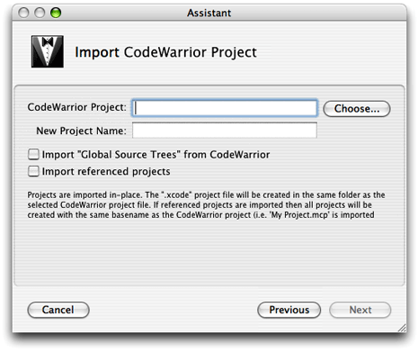

> 导航：[总目录](../../../README.md) · [documentation](../../../_indexes/documentation.md) · [Porting CodeWarrior Projects to Xcode](Introduction%20to%20Porting%20CodeWarrior%20Projects%20to%20Xcode.md)

[Next](After%20Importing%20a%20Project.md)[Previous](Preparing%20a%20CodeWarrior%20Project%20for%20Importing.md)

# Importing a CodeWarrior Project Into Xcode

This chapter provides a brief walk-through of importing a CodeWarrior project into Xcode. It assumes you’ve read [Xcode From a CodeWarrior Perspective](Xcode%20From%20a%20CodeWarrior%20Perspective.md#apple-f4xwc4dqnrsv64tfmyxwi33df52wszbpgiydambrg4ydslkukbmferkggeydc) and taken any appropriate preparatory steps listed in [Preparing a CodeWarrior Project for Importing](Preparing%20a%20CodeWarrior%20Project%20for%20Importing.md#apple-f4xwc4dqnrsv64tfmyxwi33df52wszbpgiydambrg4ytalkukbmferkggeydc).

The project importer in Xcode communicates with CodeWarrior through Apple events. Once you’ve specified a CodeWarrior project to import, the importer tells CodeWarrior to make a copy of the project, then sets various settings and performs other operations to prepare the copy. The importer tells CodeWarrior to export the copied project, then reads the exported XML and uses that information to set up the new Xcode project. The importer displays a status dialog while importing. On completion, the status dialog is dismissed and the new project opens.

Some other features include:

- By default, the CodeWarrior importer adds a Source Tree entry to your Xcode preferences named “CodeWarrior”. This entry maps to CodeWarrior’s `{Compiler}` relative path access path. The importer will not overwrite an existing source tree of the same name.
- The importer can optionally import global source tree data from CodeWarrior.
- The new project uses the Xcode native build system for all imported CW targets. This system is described in [Native Build System](Xcode%20From%20a%20CodeWarrior%20Perspective.md#apple-f4xwc4dqnrsv64tfmyxwi33df52wszbpgiydambrg4ydslkcifbesrsgijda).
- The importer supports importing cross-project references.
- The importer supports importing dependent projects automatically.
- You can write an AppleScript script to automate importing CodeWarrior projects, using the `import` AppleScript command (in the Xcode Application Suite).

For best results when importing, you should follow these steps:

- Some import steps can be CPU-intensive and time-consuming—for example, importing multiple projects (due to dependent projects) can launch many threads, while searching for included files in a large project can take some time.

  Avoid performing other compute-intensive tasks during large imports. If possible, allow the machine to work only on the import.
- Use CodeWarrior Pro version 8.3 or later for projects that you will import into Xcode. The earlier your version of CodeWarrior, the more likely it is that problems will occur.

The following are some problems that have been observed. For the latest information, see the _[Xcode Release Notes](../../../releasenotes/Developer%20Tools/Xcode%20Release%20Notes/Xcode%20Release%20Notes.md#apple-f4xwc4dqnrsv64tfmyxwi33df52wszbpkridimbqgaytanjr)_.

- The importer does not currently support bringing in CW Targets that use the Java Linker or the Mac OS Merge Linker.
- A successful import does not imply that your project will build successfully, since (by design) the importer does not modify source files. See [After Importing a Project](After%20Importing%20a%20Project.md#apple-f4xwc4dqnrsv64tfmyxwi33df52wszbpgiydambrg4ytelkukbmferkggeydc) for additional steps you may need to take.
- It may happen that an AppleScript or CodeWarrior error occurs during the import. If so, check the Console for details and try importing again.

  One possible cause is that you previously quit CodeWarrior with a project open, then moved or deleted that project. When the importer sends an Apple event to launch CodeWarrior, CodeWarrior puts up an error dialog reporting it can’t find the previously open project. That freezes the process, and eventually the Apple event times out and the import stops. The importer status dialog may remain on screen until you next quit and relaunch Xcode.

  If an import fails repeatedly, please file a bug with as much detail as possible. See [Feedback and Mail List](Introduction%20to%20Porting%20CodeWarrior%20Projects%20to%20Xcode.md#apple-f4xwc4dqnrsv64tfmyxwi33df52wszbpkridimbqgayteobwfvbecssgijdegsa) for information on filing bugs.
- If CodeWarrior prompts you to install the Interface Builder connection and your project fails to import, make sure that you have CodeWarrior running before trying the import again.
- Even though your CodeWarrior application uses Carbon, if it doesn’t use framework-style headers, the importer may not add the Carbon framework to the new Xcode project.

Importing a CodeWarrior project is very straightforward. First, make sure you’ve read the information in [For Best Results When Importing](#apple-f4xwc4dqnrsv64tfmyxwi33df52wszbpgiydambrg4ytclkdjbceqr2jijca) and [Known Issues With the Importer](#apple-f4xwc4dqnrsv64tfmyxwi33df52wszbpgiydambrg4ytclkdjbceuq2bijfa). Then follow these steps:

1. Choose File > Import Project, which opens the Import Project assistant.
2. Select Import CodeWarrior Project and click the Next button to bring up the pane shown in Figure 3-1.

   __Figure 3-1__  The Import CodeWarrior Project pane

   
3. Click the Choose button and navigate to the CodeWarrior project file to import (or type in the path and filename).

   When you choose or type a project file to import, Xcode automatically uses the same name for the new project. However, you are free to change the project name in the New Project Name field. The new project is created in the same folder as the CodeWarrior project file, and has the extension `.xcodeproj`. (If you are using Xcode 2.0 or earlier, the project has the extension `.xcode` .)
4. When you import a project, Xcode determines the location of the CodeWarrior root folder (commonly referred to as `{Compiler}` in CodeWarrior’s access paths) and adds it to the Source Trees list in the Preferences window, with the Setting Name “CodeWarrior” and Display Name “CodeWarrior Folder”.

   Select the checkbox Import “Global Source Trees” from CodeWarrior if you want the importer to add any global source trees from CodeWarrior’s preferences to the Source Trees list in Xcode. For more information about Source Trees, see [Source Trees](Xcode%20From%20a%20CodeWarrior%20Perspective.md#apple-f4xwc4dqnrsv64tfmyxwi33df52wszbpgiydambrg4ydslkcifbeqrkiindq).

   If you select the checkbox “Import referenced projects,” Xcode also imports any projects that the selected CodeWarrior project references. For any referenced projects it imports, the importer uses the name of the referenced CodeWarrior project, with an extension of `.xcodeproj`.
5. Click the Finish button to dismiss the assistant and start the import.
6. You can follow the process of the import in the Import status window. Once the import is complete, the new project window opens, and in some cases asks you to choose an encoding.

   In most cases, you should be able to choose the suggested encoding (in this case, “Western (Mac OS Roman)”). If you are unsure, click the Give Me Advice button for more information.

For most projects, it is unlikely that the software will build and run immediately after importing. See [After Importing a Project](After%20Importing%20a%20Project.md#apple-f4xwc4dqnrsv64tfmyxwi33df52wszbpgiydambrg4ytelkukbmferkggeydc) for steps you may need to take to get your imported CodeWarrior project to build in Xcode.

[Next](After%20Importing%20a%20Project.md)[Previous](Preparing%20a%20CodeWarrior%20Project%20for%20Importing.md)

