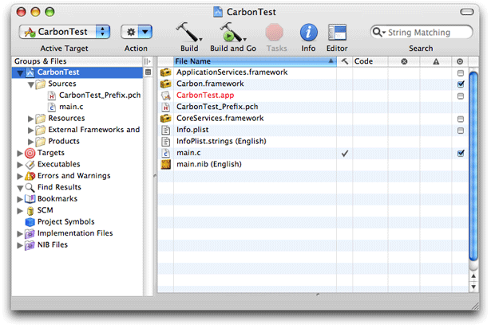
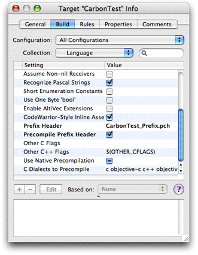
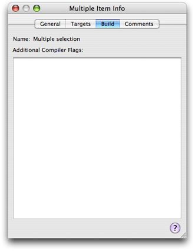
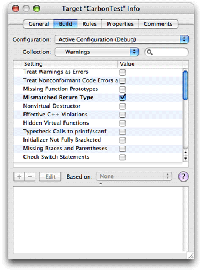
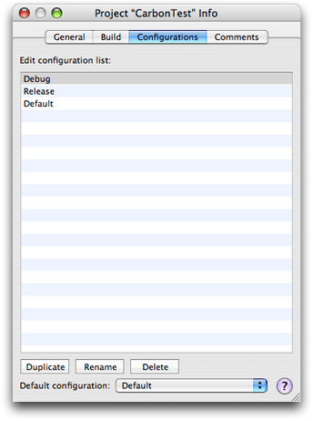
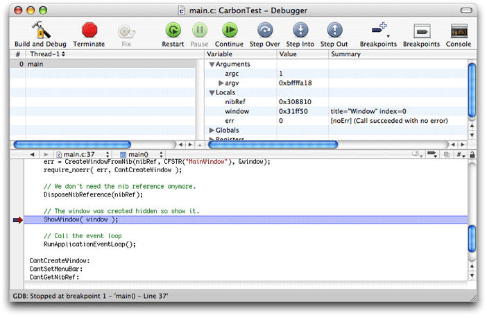

> 导航：[总目录](../../../README.md) · [documentation](../../../_indexes/documentation.md) · [Porting CodeWarrior Projects to Xcode](Introduction%20to%20Porting%20CodeWarrior%20Projects%20to%20Xcode.md)


[Next](Preparing%20a%20CodeWarrior%20Project%20for%20Importing.md)[Previous](Introduction%20to%20Porting%20CodeWarrior%20Projects%20to%20Xcode.md)

# Xcode From a CodeWarrior Perspective

This chapter introduces key features of Xcode from the perspective of CodeWarrior users. Understanding the similarities and differences in these features should help you put your CodeWarrior experience to work in Xcode. It will also be useful in converting your CodeWarrior projects.

Though there are many minor differences between Xcode and CodeWarrior, you’ll find that Xcode supports most of the features CodeWarrior users are familiar with. Xcode also provides a great deal of flexibility in organizing the environment for the way you like to work, as described in [Customizing the Environment](#apple-f4xwc4dqnrsv64tfmyxwi33df52wszbpgiydambrg4ydslktk4yti).

Like CodeWarrior, Xcode is focused on the use of projects, targets, and files. But it also takes advantage of some of the popular user interface features found in iTunes and other Apple consumer applications, such as useful grouping of files and other items, fast searching for items, and a clean, relatively simple interface.

The development environments for Xcode and CodeWarrior contain the same major components, including project window, text editor, build system, debugger, symbol navigation, find facilities, and help system. One significant difference is that Xcode includes a number of open source components, including the GCC compiler and GDB debugger, as well as other tools written by the UNIX open-source community.

Behind the user interface, Xcode performs many tasks by launching command-line tools as Mach processes. That allows Xcode to implement features such as distributed and multiprocessor builds, where each GCC compile can be handled by a separate CPU, even on separate machines.

Xcode supports several features with no exact equivalent in CodeWarrior, and others that put a new twist on everyday features. For details on how to use these features, as well as possible limitations, see _Xcode 2.2 User Guide_.

Making life easier for many common tasks:

- _Fast searching_ allows you to quickly find a file, symbol, warning, error, or other item in a list by filtering out any items that don’t match the characters you type. You can search using string matching, regular expressions, or wildcard patterns.
- _Smart groups_ let you intelligently organize your project’s content and data, using groups that match a certain rule or pattern. For example, built-in smart groups include the Errors and Warnings group and the Find Results group.
- _Inspectors_ allow you to examine and edit the objects in your project.
- _Integrated Mac OS X API documentation_ provides full access to all installed Mac OS X documentation, with rapid API searching by language. It includes many searching and viewing options to help find the programming information you need. Automatic detection of documentation updates lets you download the latest technical information from Apple.

For improving your building and debugging experience:

- _Distributed builds_ can dramatically reduce build time for large projects by distributing compiles to available computers on the network.
- _ZeroLink_ shortens link time for development builds and allows you to very quickly relaunch your application after making changes.
- _Fix and Continue_ improves your debugging efficiency by allowing you to change the source in a file, recompile just that file, and run the changed code without stopping the current debugging session. (The Fix icon looks like a tape dispenser.)

Figure 1-1 shows the Xcode project window for a simple Carbon application.

__Figure 1-1__  Xcode project window for a simple Carbon application



You can get a complete listing of Xcode features in _Xcode 2.2 User Guide_, but the following list highlights some of the most frequently used interface features.

- Instead of tabs (as in CodeWarrior and Project Builder), the default project window in Xcode uses a hierarchical list of groups in the Groups & Files list. Xcode includes several different project window layouts, however, including one that provides a tabbed interface to your project's contents.
- The contents of the selected item or items in the Groups & Files list are listed in a detail view.
- Text you type in the Search field is used to filter items in the detail view. The Search field supports simple string matching, regular expressions, and wildcard patterns.
- For source files, the detail view shows build status, SCM status, size, errors, warnings, and so on.
- Some of the items that can appear in the Groups & Files list include:

  - The project group, at the top of the Groups & Files list, shows all of the files, frameworks, and libraries included in the project. The previous figure shows the project group "CarbonTest."

    Source groups, identified by yellow folder icons, can contain other source groups. They help you organize the files in your project into more manageable chunks.
  - The Targets group contains all the targets in the project.
  - The Executables group contains all of the executable environments defined in the project. Executable environments specify the executable file that is launched when you run or debug; typically, this corresponds to a product that the project builds.

  The following items in the Groups & Files list are smart groups:

  - The Errors and Warnings group lists the errors and warnings generated when you build your project.
  - The SCM group lets you view the project files currently under version control, as well as their current state.
  - The Bookmarks group contains all of the locations you have saved as bookmarks for this project.
  - The Find Results group contains the results of any searches you perform in your project. Each search creates a new entry in this group.
  - The Project Symbols group lists all of the symbols defined in your project.
  - The NIB Files group contains any `.nib` files used to create your product's user interface.
  - The Implementation Files group contains all of the implementation files in your project, such as those ending in `.cpp` , `.c` , and `.m` .

  You can define your own smart groups and the rules for what they contain. User-defined smart groups are indicated with a purple folder icon.
- Inspector windows and Info windows handle much of the interesting work, allowing you to easily display and edit project data. (These windows differ in that inspector windows are floating utility windows that track the current selection, while Info windows are standard windows that continue to display information about the same item.)

  Among other things, you can use these windows to:

  - display per-project settings
  - display per-target settings

    Figure 1-2 shows the target inspector. A useful feature of the build settings interface is a section below the build settings table that provides a description of the currently selected build setting. If this section isn’t visible, you can display it by dragging the separator bar.

    __Figure 1-2__  Inspector window showing Language settings in Build pane

    
  - display per-file settings and information, such as location, encoding, tab settings, line endings, and so on
  - select multiple project items—such as files or targets—and change settings on all of them (for settings for which this makes sense)
- The Find string is persistent across dialogs (and even many Mac OS applications).
- Xcode uses shell paths (slash-delimited) exclusively, not colon-delimited paths.
- Xcode supports per-file compiler settings.
- The Xcode editor supports code completion; as you type identifiers and keywords, Xcode suggests likely matches based on the current context.

If your fingers are hard-wired for CodeWarrior keystroke equivalents (or BBEdit, or even MPW), don’t worry. Xcode provides many features you can customize to fit the way you like to work. These include all the standard features you can set up in the Xcode Preferences window, such as indentation style, syntax coloring, Source Code Management (SCM) options, and so on.

Xcode provides additional control over your environment with the following features:

- You can customize Command-key equivalents for menu items, as well as keystroke equivalents for editing tasks, to use the keystrokes you are most familiar with. Xcode provides predefined sets that are compatible with BBEdit, CodeWarrior, and even MPW (Macintosh Programmer’s Workshop, the Apple development environment for Mac OS 9). To learn more about customizing keystroke equivalents, see [Customizing Key Equivalents](https://developer.apple.com/library/archive/documentation/DeveloperTools/Conceptual/XcodeUserGuide20/Contents/Resources/en.lproj/custom_key_equivalents/custom_key_equivalents.html#//apple_ref/doc/uid/TP40001440-CH260) in _Xcode 2.2 User Guide_.
- You can select from a number of different project window layouts, to choose the configuration that works best for you. These layouts are:

  - Condensed. This layout provides a project window that contains tabs for Files, Targets, and all other smart groups. You use separate windows for tasks other than project navigation. This layout should be the most familiar to CodeWarrior users.
  - All-In-One. This layout provides a single window for all of the tasks typical of software development, such as debugging, viewing build results, and searching.
  - Default. This layout provides the default Xcode project window, described in [The Project Window](#apple-f4xwc4dqnrsv64tfmyxwi33df52wszbpgiydambrg4ydslkukbmferkgge2tm).

  For more on project window layouts, see The Project Window in _Xcode 2.2 User Guide_.
- You can choose what information Xcode displays in the project window, by customizing the set of smart groups that appear there. You can rearrange, show, and hide any of the groups that appear in the project window.
- You can choose the editors to use for files in your project. You can use the Xcode editor or use an external editor such as BBEdit or Emacs. Or you can choose to open a file with the application chosen for it by the Finder.
- You can easily customize the toolbar for any project window, adding or removing items, or choosing the default set.
- You can conveniently use shell scripts in Xcode in several ways:

  You can select text in any file and execute it as a shell command.You can have Xcode run a startup shell script each time you launch it.A default version of the startup script creates the User Scripts menu from any available menu definition files (which are just shell scripts). Xcode provides default menu definition files that add useful items to the User Scripts menu and demonstrate how to work with menu scripts.You can customize the built-in startup script and menu definition files, or you can create your own.Xcode provides a number of built-in script variables and utility scripts you can use in menu scripts or other user scripts.You can add a shell-file build phase that lets you add the execution of shell script files to the build process for a target. (Select a target and choose Project > New Build Phase > New Run Script Build Phase.)

For details on how to customize, see Customizing Xcode in _Xcode 2.2 User Guide_.

Throughout this document, you will find comparisons between CodeWarrior and Xcode, including differences, issues, and in many cases, alternate approaches. This section lists some Xcode limitations to be aware of, with links to further information where available.

- Compile and build speed are greatly improved, and will get faster, but do not yet equal CodeWarrior.
- GCC provides limited support for CodeWarrior pragmas.

  See [Pragma Statements](#apple-f4xwc4dqnrsv64tfmyxwi33df52wszbpgiydambrg4ydslkukbmferkgge2ti).
- There is no support for `wchar_t` and `wstring` prior to Mac OS X version 10.3 (Panther).

  See [Support for wchar_t and wstring](#apple-f4xwc4dqnrsv64tfmyxwi33df52wszbpgiydambrg4ydslkukbmferkgge2dg).
- There is no projectwide graphical tree browser; however, Xcode 2.0 and later include a class modeling tool that you can use to make individual graphical models of your project's classes.

While not strictly a limitation, there are many differences between GCC and the Metrowerks compilers. Information on these differences is provided in many places in this document. For a jumping-off point, see [The GCC Compiler](#apple-f4xwc4dqnrsv64tfmyxwi33df52wszbpgiydambrg4ydslkciffekr2civdq).

CodeWarrior provides the Constructor application for designing user interfaces based on the PowerPlant framework. Xcode provides the Interface Builder application for creating graphical user interfaces for Mac OS X applications. Interface Builder works with both Carbon and Cocoa applications and lets you lay out interface objects (including windows, controls, menus, and so on), resize them, set their attributes, and make connections to other objects and to source code. The layout tools in Interface Builder include built-in support for the Aqua interface guidelines. You can, of course, continue to use Constructor even when moving your code to Xcode.

To learn more about using Interface Builder with Carbon applications, see _[Unarchiving Interface Objects With Interface Builder Services](../../Carbon/Unarchiving%20Interface%20Objects%20With%20Interface%20Builder%20Services/Introduction%20to%20Unarchiving%20Interface%20Objects%20With%20Interface%20Builder%20Services.md#apple-f4xwc4dqnrsv64tfmyxwi33df52wszbpkridgmbqgaytambv)_ and _Interface Builder Services Reference_.

CodeWarrior provides the Profiler application for examining the behavior of a running application and fine-tuning performance. Xcode Tools includes the Shark and Sampler profiling tools. For tracking memory usage and bugs, Xcode provides the MallocDebug application, which helps debug memory problems that you would debug on Mac OS 9 with CodeWarrior’s ZoneRanger. To learn more about performance optimization and available tools, see _[Performance Overview](../../Performance/Performance%20Overview/Introduction.md#apple-f4xwc4dqnrsv64tfmyxwi33df52wszbpkridimbqgaytimjq)_.

For a CodeWarrior project, you don’t have to explicitly add header files. Instead, you can add recursive access paths, and as long as the header files are somewhere on a specified path, CodeWarrior will find them. (You may notice that this causes a delay on opening projects and can cause errors if you have different headers with the same name.)

Xcode also supports recursive search paths; however, it is generally recommended that your project include explicit references to its header files. For example, when you add a `.c` file to your Xcode project, you don’t typically add a search path for the associated header file. Instead, you drag the actual header file into a group in the Groups & Files list in the project to add a reference to the header.

The Build pane in the target and project inspector windows includes build settings for Header, Framework, and Library search paths. By default, these paths are empty; access paths defined in your CodeWarrior project are not brought over by the importer. If you specify a search path in one of these build settings, Xcode uses that path to locate header files during compiling and linking.

To have Xcode search the contents of the entire directory tree located at a given path, select the Recursive option next to that path. This option is not enabled by default when you add a new search path. You should be aware, however, that using recursive search paths can result in longer build times and cause problems if you have multiple files with the same name. For more on using search paths in Xcode, see Build Settings in _Xcode 2.2 User Guide_.

One important transition in moving to Mac OS X development is the switch from including individual headers to including framework-style headers in your source code files. A framework is a type of bundle that packages shared resources, such as a dynamic shared library and its associated resource files, header files, and reference documentation. An umbrella framework is a framework that includes a number of related frameworks. The Carbon framework (`Carbon.framework`) is an umbrella framework that contains just one header, `Carbon.h`. That header in turn includes headers from many additional frameworks, such as Core Services, HIToolbox, and others.

A framework-style include statement specifies a framework (typically an umbrella framework) and its main header file. For example, a Carbon source file should use the statement `#include <Carbon/Carbon.h>`, rather than separate include statements for each individual header file it may require. Using framework-style includes will help ensure that your project builds correctly and remains reliable over time.

For related information, see [Header Files](#apple-f4xwc4dqnrsv64tfmyxwi33df52wszbpgiydambrg4ydslktk4ytg), [Precompiled Headers and Prefix Files](#apple-f4xwc4dqnrsv64tfmyxwi33df52wszbpgiydambrg4ydslkcifbesskfjfeq), [Cross-Development](#apple-f4xwc4dqnrsv64tfmyxwi33df52wszbpgiydambrg4ydslkcineuuq2ijfeq), [Use Framework Headers](Preparing%20a%20CodeWarrior%20Project%20for%20Importing.md#apple-f4xwc4dqnrsv64tfmyxwi33df52wszbpgiydambrg4ytalkukbmferkggezti), and [Use C99 Standard in Language Settings](Preparing%20a%20CodeWarrior%20Project%20for%20Importing.md#apple-f4xwc4dqnrsv64tfmyxwi33df52wszbpgiydambrg4ytalkciveekqkfizba). For more information on frameworks in Mac OS X, see _[Framework Programming Guide](../../Mac%20OSX/Framework%20Programming%20Guide/Introduction%20to%20Framework%20Programming%20Guide.md#apple-f4xwc4dqnrsv64tfmyxwi33df52wszbpgeydambqge4dg2i)_.

Cross-development refers to the ability to develop software that can be deployed on, and take advantage of features from, specified versions of Mac OS X, including versions different from the one you are developing on. CodeWarrior provides some support for cross-development for versions of the Mac OS through Universal Interfaces, but those headers have not been updated for recent versions of Mac OS X.

Xcode supports cross-development for various versions of Mac OS X. You can specify which version of Mac OS X headers and libraries to build with, as well as the earliest Mac OS X system version on which the software will run.

To use cross-development for a target in an Xcode project, you make two selections:

- In the General pane of the inspector window for the project group, you use the Cross-Develop Using Target SDK pop-up to select an OS version to develop for, such as Mac OS X 10.4.0. All targets in the project are built as though you were building in that version of the operating system.
- In the Build pane of the inspector window for the target or project, you choose a Mac OS X deployment version, such as 10.2. For this target or project, this specifies the earliest Mac OS X system version on which your software will run.

You can also use the SDK headers and libraries to support cross-development in CodeWarrior projects. For details, see [Maintaining Parallel Projects in Xcode and CodeWarrior](#apple-f4xwc4dqnrsv64tfmyxwi33df52wszbpgiydambrg4ydslkcifbemrkkjjdq).

For detailed documentation on cross-development, see _[SDK Compatibility Guide](../SDK%20Compatibility%20Guide/Introduction.md#apple-f4xwc4dqnrsv64tfmyxwi33df52wszbpgeydambqge3dg2i)_.

Precompiled headers are binary files that represent the compiler's intermediate form of the headers required to compile a source file. Generally, all source files in a given target use a large common subset of system and project headers, so by precompiling these headers into intermediate form once and reusing it for many source files, the compiler can build source files more quickly.

CodeWarrior users must manage precompiled headers manually. In CodeWarrior, you can use a precompiled header interchangeably with a normal header file. It can be included in an `#include` directive or used as a prefix header in a target's Target Settings. You can create a precompiled header file using the Precompile menu item, or by including a `.pch` file in your project (you use a `#pragma` directive in that file to define the name of the precompiled header itself, which usually has a `.mch` suffix). In many larger projects, developers have separate targets (or even whole projects) that just build common precompiled headers that are shared among multiple projects.

In Xcode, precompiled headers are generated automatically and invisibly by the development environment. By setting the Prefix Header build setting of a target to your `.pch` file (or any other header file that contains `#include` statements for your framework headers and common target headers), Xcode will generate the precompiled header file and use it when compiling every source file in that target. (The Precompile Prefix Header build setting must also be enabled.)

The precompiled header is regenerated whenever any files it depends on are changed, so you don't need to manually build or maintain the precompiled header.

You can see the Prefix Header and Precompile Prefix Header build settings in the Build pane in [Figure 1-3](#apple-f4xwc4dqnrsv64tfmyxwi33df52wszbpgiydambrg4ydslkukbmferkgge2tk). For more information on using precompiled headers in Xcode, see Optimizing the Edit-Build-Debug Cycle in _Xcode 2.2 User Guide_.

A pragma statement is a directive for providing additional information to the preprocessor or compiler beyond what is conveyed in the language itself. There are a small number of pragma types defined by the C standard; individual compilers may support any number of additional types and values.

The CodeWarrior compiler supports a number of pragmas, including pragma equivalents for most of the compiler settings you can set in the user interface. It also supports some pragmas you can’t set in the user interface. Some examples of pragmas CodeWarrior supports are `#pragma unused` and `#pragma once`. In CodeWarrior, pragmas can turn a feature on and off within an individual compilation unit. For example, you can use the pragma statements `#pragma export on` and `#pragma export off` in a source file to bracket any symbols you want to export from a shared library.

Xcode supports some CodeWarrior-defined pragmas. However, Xcode supplies build settings for many of the features the CodeWarrior compiler supports through pragmas. These settings should be set automatically when you import a CodeWarrior project, but you can also add, delete, or modify build settings. Figure 1-3 shows some of the Language settings you can set for a target in the Build pane in an inspector window in Xcode.

__Figure 1-3__  Some GCC build settings in an inspector window


Although language settings can be set on a file, target, or project basis, you cannot use them for inline control of compiler options. As a result, the smallest unit for which you can set a compiler option is a single source file. To modify build settings on a target-wide basis, select the target in the Groups & Files list and open an Info window (by clicking the Info button or by choosing File > Get Info). Select the Build pane, then make your changes.

Xcode provides a different interface for modifying options for a single file (or several files). You can add additional compiler flags for one or more files with the following steps:

1. Open the target in the Groups & Files list.
2. Open the Compile Sources build phase.
3. Select the file (or files) for which you want to modify the settings.
4. Open an Info window by choosing File > Get Info.
5. Select the Build pane (shown in Figure 1-4 for a multiple selection).

   __Figure 1-4__  Adding compiler flags for one or more files

   
6. Add any desired compiler flags. Multiple flags should be separated by spaces.

If your CodeWarrior project follows the common pattern of placing pragmas in a header file that is included by other source files, you won’t have to make changes to individual files—you can just set the corresponding values for an entire target or a subset of files. However, if you have code that uses pragmas to turn settings on and off within a single file, and if you need to maintain that level of control, you may need to break up some files so that code that shares common build settings is in one file.

For additional information on modifying your source files, see [Maintaining Parallel Projects in Xcode and CodeWarrior](#apple-f4xwc4dqnrsv64tfmyxwi33df52wszbpgiydambrg4ydslkcifbemrkkjjdq). For information on using pragmas with respect to identifying export symbols, see [Exporting Symbols](#apple-f4xwc4dqnrsv64tfmyxwi33df52wszbpgiydambrg4ydslkcifbemqsijbda).

For further information on setting per-target and per-file compiler options in Xcode, see Build Settings in _Xcode 2.2 User Guide_. For a list of pragmas supported by GCC, see the sections "Pragmas" in _GNU C 4.0 Preprocessor User Guide_ and "Pragmas Accepted by GCC" in _GNU C/C++/Objective-C 4.0 Compiler User Guide_.

For more information on code changes you may need to make as a result of pragma statements in your CodeWarrior code, see [Create a Prefix File for PowerPlant](After%20Importing%20a%20Project.md#apple-f4xwc4dqnrsv64tfmyxwi33df52wszbpgiydambrg4ytelktk4za).

When you create Carbon applications in CodeWarrior, you can link against MSL C and C++ libraries (in debug and nodebug variants) to create CFM-style executables that can run in Mac OS 9 or Mac OS X. There is no system-supplied C library in Mac OS 9, so your application relies on the development environment, which for CodeWarrior, means the MSL libraries.

In Mac OS X, there are system-supplied C and C++ libraries. The C library comes in static and dynamic variants. The dynamic version is strongly recommended for most software, though you may need to link the static version in certain situations (such as for KEXTs, which must load when the dynamic loader isn’t available).

Beginning with Mac OS X 10.3.9, the standard C++ library is packaged as a dynamic shared library. In prior versions of Mac OS X, the C++ library is packaged as a static library. Packaging the standard C++ library as a dynamic shared library provides a number of benefits, such as smaller binaries and improved performance. To link against the shared library version, `libstdc++.dylib`, you must use GCC 4.0. If your application must run on versions of Mac OS X prior to 10.3.9, however, you must link against the static library, `libstdc++.a` . To learn more about the C++ runtime and using the shared library version of `libstdc++` , see _[C++ Runtime Environment Programming Guide](../C%2B%2B%20Runtime%20Environment%20Programming%20Guide/Introduction.md#apple-f4xwc4dqnrsv64tfmyxwi33df52wszbpkridimbqgaytmnrw)_.

CodeWarrior also supplies MSL libraries to create Mach-O style executables that run on Mac OS X only. In some cases, the MSL library calls through to the Mac OS X System framework library, and in some cases it provides missing features (such as `wchar_t` support, not available in Mac OS X prior to Panther).

If your CodeWarrior project is already building a Mach-O style executable, you should have an easier time in moving it to Xcode. If not, you should consider converting it, as described in [Preparing a CodeWarrior Project for Importing](Preparing%20a%20CodeWarrior%20Project%20for%20Importing.md#apple-f4xwc4dqnrsv64tfmyxwi33df52wszbpgiydambrg4ytalkukbmferkggeydc). You’ll primarily be changing linker settings, access paths, and precompiled headers. In addition, if you load plug-ins via CFM, you’ll need to rewrite that code to use the CFBundle or CFPlugin APIs.

For related information, see [The GCC Compiler](#apple-f4xwc4dqnrsv64tfmyxwi33df52wszbpgiydambrg4ydslkciffekr2civdq).

The following are some runtime and library issues you may encounter in switching from MSL libraries to the Mac OS X C and C++ libraries:

- There is no runtime support for `wchar_t` and `wstring` prior to Mac OS X version 10.3 (Panther). For details, see [Support for wchar_t and wstring](#apple-f4xwc4dqnrsv64tfmyxwi33df52wszbpgiydambrg4ydslkukbmferkgge2dg).
- While CodeWarrior supplies nonstandard flags to perform diagnostics on use of the standard template library (STL), Xcode does not include a debug version of the STL.
- Some code will be larger when built with the Xcode standard C and C++ libraries because, unlike the MSL library, they do not currently support container optimization for templates.
- The standard C library function `clock` (or `ctime` for C++) returns a value of type `clock_t` in units of `CLOCKS_PER_SEC`, defined in `time.h`. This constant currently has a value of 100, which results in a low resolution that is inadequate for some tasks. CodeWarrior defines `CLOCKS_PER_SEC` as 1000000, for microsecond resolution.
- The function `itoa` is not a standard C library function and it is not included in the system libraries provided by Mac OS X. CodeWarrior does supply this function, in the header `extras.h`. If your code uses this function, you should replace it with `printf` or some other equivalent function.

The standard C and C++ wide character type `wchar_t` and the `wstring` template class that makes use of it are supported in the system libraries for Mac OS X version 10.3 and later. As a result, you can freely use these data types in software created with Xcode that will run only in Panther and later. However, if you need to use these data types in software that will run in versions of Mac OS X prior to Panther, you should obtain a third-party standard C library, such as the one available from [Dinkumware, Ltd.](http://www.dinkumware.com/).

CodeWarrior supports `wchar_t` and `wstring` for CFM applications because they are supported in the MSL C and C++ libraries for CFM. However, because MSL libraries for Mach-O in CodeWarrior do not anticipate `wchar_t` support in the Apple standard C libraries, `wchar_t` support is turned off in the MSL Mach-O standard library projects. This means that if you use CodeWarrior in Mac OS X v.10.3 or later, you'll get build errors when you rebuild the CodeWarrior MSL libraries because `wchar_t` support is turned off but the Mac OS X headers now use `wchar_t`.

To resolve this issue, when rebuilding your MSL libraries on Panther, you should select the “Enable wchar_t Support” checkbox in the C/C++ Language settings for the Mach-O library projects.

CodeWarrior provides a proprietary compiler that supports C and C++ and includes support for Altivec. CodeWarrior and Xcode C and C++ libraries are discussed in [C and C++ Libraries](#apple-f4xwc4dqnrsv64tfmyxwi33df52wszbpgiydambrg4ydslkcifbemrcci5aq).

Xcode uses the open-source GNU C Compiler, or GCC. When you compile C, C++, Objective-C, or Objective-C++ code in Xcode, you’re using GCC. The default version of GCC for Xcode 2.2 is 4.0. For versions of Xcode earlier than Xcode 2.0, the default version of GCC is 3.3. If necessary, you can choose from the the available GCC versions by selecting a target in the project window, opening an inspector window, and selecting the Rules pane. There you can use the pop-up menus to view the current system rules and to add rules for which compiler to use for C, C++, and other types of files in that target. For related information, see [More on GCC Compiler Versions](#apple-f4xwc4dqnrsv64tfmyxwi33df52wszbpgiydambrg4ydslkcifbeirscirba).

When you import a CodeWarrior project, the rule for processing C files is left unchanged. This means that C files are compiled with the current system version of GCC, which depending on the system, is either 3.3 or 4.0. This document assumes that you will use version 4.0 to build your imported project.

Compile speed has improved dramatically in GCC 3.3 and 4.0, but does not yet quite equal CodeWarrior. However, Xcode sports features such as distributed and multiprocessor builds, where each compile is handled by a separate CPU, even on separate machines. These features can dramatically reduce build time for large projects. Xcode also provides additional features to improve the overall development process, including ZeroLink and Fix and Continue, described in [Some Special Features of Xcode](#apple-f4xwc4dqnrsv64tfmyxwi33df52wszbpgiydambrg4ydslkukbmferkgge2de).

[Figure 1-3](#apple-f4xwc4dqnrsv64tfmyxwi33df52wszbpgiydambrg4ydslkukbmferkgge2tk) shows some GCC build settings in an inspector window for an Xcode target. Build settings in the Xcode user interface are converted to command-line options to GCC when you compile your source code. If you want to use a feature of GCC that isn’t available in the Xcode user interface, you can add flags to the Other C Flags setting. To view this setting, see the detailed steps provided in [Inline ASM](#apple-f4xwc4dqnrsv64tfmyxwi33df52wszbpgiydambrg4ydslkukbmferkgge2tc). Multiple flags should be separated by spaces.

There are a number of significant differences between GCC and the CodeWarrior compiler. One that you’re likely to notice right away is that GCC has a reputation for strictness, and is likely to generate many warnings for code that may produce few warnings in CodeWarrior. Because C and C++ are very permissive languages, most of these warnings have been found to be useful over the years. Getting a compiler error or warning about suspect code can save days or even weeks of difficult debugging.

Still, you have options to reduce the number of warnings. To change the warnings for a selected target, open the inspector window, select the Build pane, and choose Warnings under GNU C/C++ Compiler in the Collections menu. You can then select any of the warning settings and see a description for it displayed beneath the list of settings, as shown in Figure 1-5.

__Figure 1-5__  Warnings settings in an inspector window



You can also set additional GCC warnings by modifying the Other Warning Flags build setting in the Build pane.

The C++ ABI changed between GCC 4.0 and GCC 3.3 (the default compiler for Xcode 1.5 and earlier). The GCC 3.3 compiler in turn has a different ABI than either the GCC 3.1 compiler (the default compiler for the December 2002 release of the Developer Tools) or the GCC 2.95 compiler (the default compiler for earlier releases of the Developer Tools). All your C++ code, including libraries and frameworks, must be built with the same compiler. Note that you should not use the GCC 4.0 compiler to build C++ programs for versions of Mac OS X prior to 10.3.9.

IOKit-based device drivers and other kernel extensions built with the GCC 4.0 compiler will run in Mac OS X versions 10.2 through 10.4. You must use GCC 2.95.2 for kernel extensions that need to run on Mac OS X version 10.1.

Additional compiler-related differences are described throughout this document, especially in the following sections:

- [C++ Code in C Files](#apple-f4xwc4dqnrsv64tfmyxwi33df52wszbpgiydambrg4ydslkcifbemrkginca)
- [Inline ASM](#apple-f4xwc4dqnrsv64tfmyxwi33df52wszbpgiydambrg4ydslkukbmferkgge2tc)
- [C and C++ Libraries](#apple-f4xwc4dqnrsv64tfmyxwi33df52wszbpgiydambrg4ydslkcifbemrcci5aq)
- [Precompiled Headers and Prefix Files](#apple-f4xwc4dqnrsv64tfmyxwi33df52wszbpgiydambrg4ydslkcifbesskfjfeq)
- [Pragma Statements](#apple-f4xwc4dqnrsv64tfmyxwi33df52wszbpgiydambrg4ydslkukbmferkgge2ti)
- [Cross-Development](#apple-f4xwc4dqnrsv64tfmyxwi33df52wszbpgiydambrg4ydslkcineuuq2ijfeq)
- [Support for wchar_t and wstring](#apple-f4xwc4dqnrsv64tfmyxwi33df52wszbpgiydambrg4ydslkukbmferkgge2dg)
- [Code Differences](#apple-f4xwc4dqnrsv64tfmyxwi33df52wszbpgiydambrg4ydslkukbmferkgge2dq)
- [Migrate from MSL to System C and C++ Libraries](Preparing%20a%20CodeWarrior%20Project%20for%20Importing.md#apple-f4xwc4dqnrsv64tfmyxwi33df52wszbpgiydambrg4ytalkukbmferkggeztk)
- [Use C99 Standard in Language Settings](Preparing%20a%20CodeWarrior%20Project%20for%20Importing.md#apple-f4xwc4dqnrsv64tfmyxwi33df52wszbpgiydambrg4ytalkciveekqkfizba)
- [Make Code Changes for GCC Compatibility](After%20Importing%20a%20Project.md#apple-f4xwc4dqnrsv64tfmyxwi33df52wszbpgiydambrg4ytelkdjbceeskhi5ba)
- [Make Changes to PowerPlant](After%20Importing%20a%20Project.md#apple-f4xwc4dqnrsv64tfmyxwi33df52wszbpgiydambrg4ytelkukbmferkgge3dm)

Current documentation for GCC (through version 4.0) is available in [Tools Documentation](https://developer.apple.com/library/archive/navigation/redirect.html#//apple_ref/doc/uid/TP30000436).

GCC is literal in its interpretation of file suffixes. While CodeWarrior applies the C++ preprocessor and parser to C++ and C files alike, GCC will emit errors if C++ code is used in `.c` files. You can override this by changing the file's type to a C++ filetype (`sourcecode.cpp`) in the General pane of the file inspector. As long as the Compile Sources As (GCC_INPUT_FILETYPE) build setting is set to According to File Suffix, changing the filetype will cause Xcode to use the `-x c++` option when compiling files whose type is a C++ filetype. Any explicitly set value for the Compile Sources As build setting overrides the filetype you specify in the General pane of the file inspector.

By default, when you import a CodeWarrior project, the Compile Sources As build setting is set to According to File Suffix. However, if you have Force C++ compilation set in your CodeWarrior target settings, the importer in Xcode 2.2 sets the Compile Sources As build setting for that target to `sourcecode.cpp.cpp`.

GCC supports CodeWarrior-style inline asm code. To enable this support, you add the following flag to your build settings:

```
-fasm-blocks
```

When you import a CodeWarrior project that uses inline asm into Xcode, this flag is not set automatically, so you will have to add it yourself. You can do so with the following steps:

1. Select a target in the project window.
2. Open an inspector window like the one shown in [Figure 1-3](#apple-f4xwc4dqnrsv64tfmyxwi33df52wszbpgiydambrg4ydslkukbmferkgge2tk) by clicking the Info button or choosing File > Get Info.
3. Select the Build pane.
4. If the GNU C/C++ Compiler settings aren’t visible, select GNU C/C++ Compiler from the Collection menu.
5. Click the checkbox in the Value column next to the CodeWarrior-Style Inline Assembly setting.

In general, the GCC implementation works the same as the CodeWarrior implementation, and any discrepancies you note should be reported as bugs (see [Feedback and Mail List](Introduction%20to%20Porting%20CodeWarrior%20Projects%20to%20Xcode.md#apple-f4xwc4dqnrsv64tfmyxwi33df52wszbpkridimbqgayteobwfvbecssgijdegsa)). For example, if your project contains hand-tweaked asm code, it should work correctly in the new project, unless your code specifically targets CFM-related features. (CFM refers to the executable architecture supported by the Code Fragment Manager in Mac OS 9.)

Function calls, such as `bl foo`, don’t currently work, and are treated as though `foo` is a label whose definition is missing.

Calling conventions are generally the same as for CFM, but global variables are not available through the TOC register `r2`. For instance, in CFM, if `aglob` is a global, then `lwz aglob(r2)` works to get the value of `aglob` into `r3`. The Mach-O equivalent is complicated, involving multiple internal labels, and at present can’t be handled with inline asm.

GCC passes the inline asm through to the assembler and doesn’t interpret it, so any errors reported from the asm code come from the assembler. In unusual cases, such as when a typedef has the same name as an op code, GCC may parse the code differently from CodeWarrior. For example, the code in listing Listing 1-1 will result in warnings and a body with one `nop` if using CodeWarrior, and a body with two instructions (`mr r1,r2` and `nop 0` if using GCC. (This should probably be considered a bug in GCC’s implementation.)

__Listing 1-1__  A typedef with the same name as an op code

```
typedef int mr;
asm int foo()
{
 mr r1,r2;
 nop
}
```

For a related issue, see [Inlining Thresholds](After%20Importing%20a%20Project.md#apple-f4xwc4dqnrsv64tfmyxwi33df52wszbpgiydambrg4ytelkukbmferkgge3tc).

In CodeWarrior, you can choose from among several linkers in the Target Settings pane. The “Macintosh PowerPC linker” creates executables based on the format specified by the Code Fragment Manager (CFM) architecture. The “Apple Mach-O PowerPC linker” makes use of Apple’s `ld` linker and `libtool` command-line tool. The “Mac OS X PowerPC Mach-O linker” also creates Mach-O executables, but uses the Metrowerks Mac OS linker.

Xcode uses the `ld` linker, which is designed to work with Mach-O object files, and supports dynamic shared libraries, two-level and flat name spaces, and other features.

The `ld` linker supports the automatic stripping of unused (dead) code beginning with the June 2004 release of the Xcode tools. For more information, see [Dead Code Stripping](#apple-f4xwc4dqnrsv64tfmyxwi33df52wszbpgiydambrg4ydslkcifbegsscjjea). Using the `ld` linker may also result in larger binary files than in your CodeWarrior project. You can display man page documentation for the linker in Xcode with Help > Open man page, or in a Terminal window by typing `man ld`.

The CodeWarrior linker supports dead code stripping (the removal of unused code). Beginning with version 1.5, Xcode also supports dead code stripping. To enable dead code stripping in your project, do the following:

1. Select a target in the project window.
2. Open an inspector window like the one shown in [Figure 1-3](#apple-f4xwc4dqnrsv64tfmyxwi33df52wszbpgiydambrg4ydslkukbmferkgge2tk) by clicking the Info button or choosing File > Get Info.
3. Select the Build pane.
4. If the Linking settings aren’t visible, select Linking from the Collection menu.
5. Click the checkbox in the Value column next to the Dead Code Stripping setting.

In versions of Xcode prior to Xcode 1.5, a project may generate errors at link time because it contains unused code that refers to undefined symbols. For more information on this issue, see [Resolve Undefined Symbols](After%20Importing%20a%20Project.md#apple-f4xwc4dqnrsv64tfmyxwi33df52wszbpgiydambrg4ytelkukbmferkgge3dq).

You can of course take your own steps to eliminate code you know will never be called. Or, if you have reasons for not stripping certain unused code, you can take steps to avoid exporting symbols for that code. For example, if you create an order file, you can increase the likelihood that dead code in your application will never actually be loaded.

From a performance standpoint, it is always worthwhile to reduce both your code size and the number of exported symbols. For more information in this document, see [Exporting Symbols](#apple-f4xwc4dqnrsv64tfmyxwi33df52wszbpgiydambrg4ydslkcifbemqsijbda). The document _[Code Size Performance Guidelines](../../Performance/Code%20Size%20Performance%20Guidelines/Introduction%20to%20Code%20Size%20Performance%20Guidelines.md#apple-f4xwc4dqnrsv64tfmyxwi33df52wszbpgeydambqge2ds2i)_ contains the following sections:

- [Improving Locality of Reference](https://developer.apple.com/library/archive/documentation/Performance/Conceptual/CodeFootprint/Articles/ImprovingLocality.html#//apple_ref/doc/uid/20001862) describes how to create an order file.
- [Minimizing Your Exported Symbols](https://developer.apple.com/library/archive/documentation/Performance/Conceptual/CodeFootprint/Articles/ReducingExports.html#//apple_ref/doc/uid/20001864) describes how to reduce the symbols exported by your application.

To learn more about support for dead code stripping in Xcode see “Dead Code Stripping” in the chapter Linking in _Xcode 2.2 User Guide_.

Any packaged Mac OS X software, including applications, bundles, plug-ins, and frameworks, requires an information property list file named `Info.plist`. That file contains key-value pairs that specify various information that is used at runtime, such as the version number for the software. This information is used by the application and by Launch Services (an API for launching applications in Mac OS X) as well.

In CodeWarrior, projects that create packaged Mac OS X software use a `.plc` file to specify information for the `Info.plist` file. For example, if you use CodeWarrior project stationery to create a project for a Mach-O based Mac OS X application or a bundled Carbon application, the project includes a default `.plc` file. CodeWarrior reads the `.plc` file at build time, follows any included header files or prefix file chains, and creates a property list from it, according to settings you specify in the Property List pane of the target settings window.

An advantage of this approach is that you can define symbols in header files and include them into both your code and your `.plc` file. As a result, you can be confident you are using the same data in both your code and your `Info.plist` file.

Xcode provides a user interface for directly specifying property list settings, but it does not support conversion of a `.plc` file into an information property list, so you cannot share symbols between your code and your property list file. However, Xcode does obtain information for the property list from your CodeWarrior project during the import process.

You supply or modify property list information by opening an Inspector window for a target, and making changes in the Properties pane. Xcode also supports preprocessing of the `Info.plist` file using the GNU C preprocessor; you can include headers, use conditional statements, and define preprocessor macros for use when preprocessing the file. You can also reference any build settings in effect for the target; Xcode evaluates those build settings and replaces them with the appropriate value at build time. For more information on editing property lists in Xcode, see _Xcode 2.2 User Guide_. For details, see [Move Settings From the .plc File to an Info.plist File](After%20Importing%20a%20Project.md#apple-f4xwc4dqnrsv64tfmyxwi33df52wszbpgiydambrg4ytelkukbmferkgge3dk).

CodeWarrior and Xcode both work with Resource Manager `.r` and `.rsrc` resource files. In CodeWarrior, you can set Rez Options, Derez Options, and Common Options in the Rez target settings pane. In Xcode, you can set Resource Manager settings in the Build pane of a target inspector window. If you drag resources into your Xcode project, or import them as part of a CodeWarrior project, Xcode should place those resources in the Build ResourceManager Resources build phase. Xcode compiles `.r` files in this build phase and copies any `.rsrc` files into the product bundle. For more information on build phases in Xcode, see Build Phases in _Xcode 2.2 User Guide_.

Xcode does not provide a user interface to rez and derez individual files, but the Rez and DeRez tools are available in `/Developer/Tools` and you can run them from the command line and in scripts. There are man pages for Rez and DeRez, but documentation for the rez language is a bit hard to find. It’s documented in Appendix C of [Building and Managing Programs with MPW](https://developer.apple.com/tools/mpw-tools/books.html#Building).

In Mac OS X and for Carbon applications generally, resources should be put in the data fork of a separate resource file, not in the resource fork of the executable, as described in the section "_Move Resources to Data Fork–Based Files_" in _[Carbon Porting Guide](../../Carbon/Carbon%20Porting%20Guide/Introduction%20to%20Carbon%20Porting%20Guide.md#apple-f4xwc4dqnrsv64tfmyxwi33df52wszbpkridgmbqgaydsojr)_. The primary reason for moving application resources out of resource forks is to enable applications to be seamlessly moved around different file systems without loss of their resources.

In addition to using `.r` and `.rsrc` files for resources, Carbon applications can use Interface Builder resource files (called nib files because they have an extension of `.nib`). When you create a new project in Xcode, the Carbon Application project template creates a nib-based Carbon application. Interface Builder provides an easy-to-use graphical method for designing and implementing a GUI, so there is potentially a lot to gain by using nib files for your resources. Interface Builder is described in [Companion Applications](#apple-f4xwc4dqnrsv64tfmyxwi33df52wszbpgiydambrg4ydslkukbmferkgge2da). To learn more about using Interface Builder with Carbon applications, see _[Interface Builder](../Interface%20Builder/Introduction%20to%20Interface%20Builder.md#apple-f4xwc4dqnrsv64tfmyxwi33df52wszbpgeydambqge3ts2i)_, _[Unarchiving Interface Objects With Interface Builder Services](../../Carbon/Unarchiving%20Interface%20Objects%20With%20Interface%20Builder%20Services/Introduction%20to%20Unarchiving%20Interface%20Objects%20With%20Interface%20Builder%20Services.md#apple-f4xwc4dqnrsv64tfmyxwi33df52wszbpkridgmbqgaytambv)_ and _Interface Builder Services Reference_.

Mac OS X also provides a very useful mechanism for storing language-dependent resources in localized directories within an application or other bundle. By using APIs such as CFBundle, your application can work with localized resources in a seamless manner. For more information on resources, application packaging, and bundles, see the document _[Mac Technology Overview](../../Mac%20OSX/Mac%20Technology%20Overview/About%20Developing%20for%20Mac.md#apple-f4xwc4dqnrsv64tfmyxwi33df52wszbpkridimbqgaytanrx)_, as well as the document _[Bundle Programming Guide](../../Core%20Foundation/Bundle%20Programming%20Guide/Introduction.md#apple-f4xwc4dqnrsv64tfmyxwi33df52wszbpgeydambqgezdg2i)_.

In CodeWarrior, you can have one or more named build targets, each of which specifies a set of files and project settings used to build an output file. The project manager keeps track of project dependencies and calls on the build system to build the current target.

With Xcode, you also define named targets, containing all the files and instructions required to create a final product. In addition, you can define different build configurations for each target, which allow you to build the target with different build settings without creating a whole new target.

The following sections describe the Xcode build system and compare various build-related features in CodeWarrior and Xcode. For additional details on building code, such as how to modify build settings, start a build, display the Build Results window, and so on, see The Build System in _Xcode 2.2 User Guide_.

Xcode includes a fast, accurate dependency system built into the IDE (hence “native”). While Xcode fully supports legacy Project Builder projects that use a JAM-based build system, all new projects and targets—including targets imported from CodeWarrior projects—use the native build system.

Native targets have certain advantages over JAM targets. Because the dependency checking is done in the IDE itself, it is faster, which means that your builds start faster. In addition, many Xcode features, including Zero Link, Fix and Continue, Distributed Builds, and SDK Support, are only implemented for native targets.

Native targets use inspector windows for viewing and editing target settings, while JAM targets use an older-style Target Settings window. JAM targets are represented in the Xcode user interface by the traditional bull’s-eye icon, while the icon for a native target varies according to the product type—for example, applications are represented by a stylized “A” icon.

A build configuration is a variation on a target that lets you build a target using different build settings without creating a whole new target. If you need to create products that differ only in their build settings, you might create one target with several build configuration. If you need to create products that differ in other types of settings (such as build phases or information property list entries), you should create separate targets for each.

The list of build configuration names is defined at the project level. To add or remove build configurations, select the project source group in the project window, click the Info button to open an inspector window, and select the Configurations pane, which is shown in [Figure 1-6](#apple-f4xwc4dqnrsv64tfmyxwi33df52wszbpgiydambrg4ydslkcifbekscfjfdq). By default, new projects created in Xcode contain both Debug and Release build configurations, described below. Projects you import from CodeWarrior have a single build configuration, named Imported CodeWarrior Settings.

__Figure 1-6__  The Configurations pane



To add a build configuration to a project, select an existing build configuration and copy it.

Although build configuration names are defined at the project level, each target in the project, and the project itself, can define a different set of build settings for a build configuration. You edit the build settings in a build configuration in the Build pane of the target or project inspector. In this pane, select the build configuration you want to edit in the Configuration menu, then add or delete settings and insert or modify values in the list below the menu. You use the minus and plus buttons at the bottom of the list to add or delete settings.

To select the current build configuration, use the Active Build Configuration pop-up menu in the toolbar of the project or Build Results window or choose Set Active Build Configuration.

In Xcode, Debug and Release build configurations typically take the place of CodeWarrior’s Debug and Final targets, respectively. When you create a new project, by default the project contains these two build configurations. You are free to modify their definitions at the target or project levels, or to add other build configurations. By default, the Debug build configuration produces debug symbols and turns off code optimization, while the Release build configuration does the opposite.

As mentioned in the previous section, projects imported from CodeWarrior contain a single build configuration, called Imported CodeWarrior Settings, which contains the target settings brought over from your CodeWarrior targets. You can easily create Debug and Release build configurations by duplicating the Imported CodeWarrior Settings configuration and customizing each of the new Debug and Release configurations with the appropriate settings.

In both CodeWarrior and Xcode, you can define a common prefix file that includes all the headers needed by a project to create debug or non-debug products. You can then define separate headers that set required preprocessor definitions (for example, `#define debug 1`), then include the appropriate header into the prefix file, depending on which type of product you want to build.

In CodeWarrior, this requires separate prefix files because the only way to set a macro is with a `#define` statement in a file (you can’t set values on a command line).

In Xcode, you can take another approach. You can have one common prefix file for all targets. You can then define preprocessor options in the target settings. This allows you, for example, to define a master `debug` flag you can test for anywhere in your code. Since it’s part of the target settings, the prefix file will be precompiled differently, depending on the target settings for the product.

In fact, it’s recommended that you delete any redundant targets and move the differentiating flags from the prefix headers to the appropriate build configuration of the primary target. The targets with the fewest settings are the best candidates to replace with a build configuration.

CodeWarrior provides a substantial AppleScript dictionary, with terminology that allows some automation of the build process.

Xcode also has a substantial scripting dictionary, and provides AppleScript terminology for controlling many aspects of the build process. To examine the Xcode terminology, you can:

- Drag the Xcode application icon onto Script Editor in the Finder.
- Choose File > Open Dictionary in Xcode
- Choose File > Open Dictionary in Script Editor

You’ll find classes such as `bookmark`, `breakpoint`, `source directory`, and `target dependency`, along with events such as `build` and `clean`, to name just a few.

You can also call the `xcodebuild` tool from a shell window or a script to build a project. The `xcodebuild` tool reads your project file and builds it just as if you had used the Build command from within Xcode, although there are some differences you should read about in _Xcode 2.2 User Guide_.

In addition, you can use the `osascript` and `osaexecute` commands to run AppleScript scripts from a shell window or shell script. These commands can target Xcode or any other scriptable application. You can use the Terminal application, available in `/Applications/Utilities`, to open shell windows, execute shell scripts, and so on.

Finally, you can use AppleScript’s `do shell script` command to launch the `xcodebuild` command-line tool from an AppleScript script. However, if you’re writing an AppleScript script anyway, it probably makes more sense to use the Xcode scripting terminology.

CodeWarrior has a Makefile Importer wizard to import makefiles.

The Xcode project importer does not import makefiles, and the IDE has no automated support for setting up a project to follow the rules in a makefile. However, it is often the case that developers don’t necessarily want to convert a makefile into a project, they would just like to use the makefile with a project. Xcode supports that goal with the external target.

An external target is a target that Xcode doesn’t maintain build rules for. For all other targets, Xcode stores information on how its product should be built and installed. As you add and remove files, Xcode keeps track of how to compile them for you. For a legacy target, you have to maintain that information yourself, usually by creating your own build file.

You add an external target by choosing Project > New Target and selecting External Target.

As part of building a shared library, plug-in, or other software that will export symbols, you want to specify which symbols are available to clients of the software. The fewer symbols your software exports, the more quickly it will load at runtime. In addition, you typically do not want to expose internal entry points, due to both competitive and support issues.

CodeWarrior provides several options for specifying which symbols a shared library will export.

- Use an export (or `.exp`) file. When you run the Make command on a library target, CodeWarrior creates a `.exp` file containing all the global variables and routines in the project. After creating this file, you can comment out any symbols you don’t want to export, including CodeWarrior runtime symbols. You then add the `.exp` file to the appropriate target and rebuild the project.
- You can use the pragma statements `#pragma export on` and `#pragma export off` to bracket any symbols you want to export. CodeWarrior exports only symbols bracketed by these statements.
- Combine the two previous mechanisms. Only the bracketed symbols are placed in the `.exp` file, which you can still edit as necessary.

You can include your export file in an Xcode project as well, by setting the Exported Symbols File build setting to the name of your export file. Xcode passes the appropriate options to the static linker.

You can’t use the pragma statements `#pragma export on` and `#pragma export off` to specify export symbols in Xcode because GCC does not support these pragma statements. However, GCC does have its own pragmas for controlling symbol visibility, described in _[C++ Runtime Environment Programming Guide](../C%2B%2B%20Runtime%20Environment%20Programming%20Guide/Introduction.md#apple-f4xwc4dqnrsv64tfmyxwi33df52wszbpkridimbqgaytmnrw)_.

Beginning with Xcode 2.2, the importer interprets the Export Symbols setting in your CodeWarrior target. Based on the following values for that setting, the importer configures the corresponding Xcode target differently:

- None. The importer enables the Symbols Hidden by Default (GCC_SYMBOLS_PRIVATE_EXTERN) and Inline Functions Hidden (GCC_INLINES_ARE_PRIVATE_EXTERN) build settings for the new Xcode target. When these build settings are enabled, all symbols are declared 'private extern' unless explicitly marked otherwise.
- All Globals. The importer disables the Symbols Hidden by Default (GCC_SYMBOLS_PRIVATE_EXTERN) build setting in the new Xcode target.
- 'Use ".exp" file' or 'Use #pragma and ".exp" file.' The importer sets the Exported Symbols File (EXPORTED_SYMBOLS_FILE) build setting to the path to the first export file that it finds in your CW target. It also enables the Symbols Hidden by Default and Inline Functions Hidden build settings.

  Note that, while CodeWarrior targets may have multiple `.exp` files, an Xcode target can have only one. If your CW target has more than one export file, the importer uses the first one it encounters and ignores the rest.

The importer does not interpret the Referenced Globals or Use #pragma settings.

For related information in this document, see [Runtime and Library Issues](#apple-f4xwc4dqnrsv64tfmyxwi33df52wszbpgiydambrg4ydslkcifbeir2eijea), [Dead Code Stripping](#apple-f4xwc4dqnrsv64tfmyxwi33df52wszbpgiydambrg4ydslkcifbegsscjjea), and [Pragma Statements](#apple-f4xwc4dqnrsv64tfmyxwi33df52wszbpgiydambrg4ydslkukbmferkgge2ti).

For additional information on examining and managing your software’s exported symbols, and on other techniques for producing more efficient code, see _[Code Size Performance Guidelines](../../Performance/Code%20Size%20Performance%20Guidelines/Introduction%20to%20Code%20Size%20Performance%20Guidelines.md#apple-f4xwc4dqnrsv64tfmyxwi33df52wszbpgeydambqge2ds2i)_. In particular, the section [Minimizing Your Exported Symbols](https://developer.apple.com/library/archive/documentation/Performance/Conceptual/CodeFootprint/Articles/ReducingExports.html#//apple_ref/doc/uid/20001864) describes how to reduce the symbols exported by your application.

Basic debugging is very similar in CodeWarrior and Xcode, though Xcode uses the open source GDB debugger and provides some additional features, such as Fix and Continue (live patching), to make debugging more efficient. Xcode supplies a graphical interface to GDB, but you can also use the command line interface (in place of or in parallel to the UI) to get full access to any GDB feature not supported in the user interface. Figure 1-7 shows the debugger window stopped in a simple Carbon application.

__Figure 1-7__  A debug window in Xcode



For GDB documentation, see _[Debugging with GDB](https://developer.apple.com/library/archive/documentation/DeveloperTools/gdb/gdb/gdb_toc.html#//apple_ref/doc/uid/TP40000996)_.Note that some debugging features are currently unavailable in Xcode: for example, you cannot set event points in the UI.

In CodeWarrior, “event points” are the general name for a set of actions that the CodeWarrior IDE debugger can perform at a breakpoint (such as perform a test, log a message, play a sound, speak a phrase, or execute a script). A “watch point” is a range of memory that you are watching while debugging to note changes; the debugger stops execution when it notices that a certain range of memory has been changed.

Beginning with Xcode 2.1, Xcode includes support for both breakpoint actions and watchpoints. Similar to event points, breakpoint actions let you perform an action at a breakpoint. Xcode includes breakpoint actions that let you execute a script, print a message to the console, send a command to the debugger, and more.

While CodeWarrior supplies nonstandard flags to perform diagnostics on use of the standard template library (STL), Xcode does not include a debug version of the STL. However, Xcode does support breaking on C++ `try`, `catch` and `throw` constructs, and allows stepping through template instantiation.

_Prebinding_ is the process of computing at build time the addresses for the symbols imported by libraries and applications, so that less work needs to be performed by the dynamic linker at runtime.

If a user installs your software on a system with a set of libraries that is different than those present when the application was built, the prebinding information cannot be used and application launch is slower. If you use the PackageMaker application to package your software and let users install it with the Installer application, Installer automatically attempts to update prebinding information for the software it installs by running the `update_prebinding` tool. If your software uses drag-and-drop installation, you can provide instructions for how to run this tool through a Read Me file, printed documentation, or other mechanism.

Prebinding is only applicable for Mach-O executables. (Mach-O is the native executable format in Mac OS X and is the only format supported by Xcode.) In addition, there are some circumstances where prebinding information cannot be updated or used. For details, see the following:

- [Prebinding Your Application](https://developer.apple.com/library/archive/documentation/Performance/Conceptual/LaunchTime/Articles/Prebinding.html#//apple_ref/doc/uid/20001858) in _[Launch Time Performance Guidelines](../../Performance/Launch%20Time%20Performance%20Guidelines/Introduction%20to%20Launch%20Time%20Performance%20Guidelines.md#apple-f4xwc4dqnrsv64tfmyxwi33df52wszbpgeydambqge2dq2i)_.
- The man pages for `update_prebinding` and `redo_prebinding`. (You can search for and view man pages in Xcode with Help > Open man page.)

For more information on distributing your software, see _Software Distribution_.

CodeWarrior supports the use of source trees, a kind of root path commonly used in projects that will be worked on by developers in different locations and on different machines. Source trees can be used to define common access paths and target outputs. Global source trees (defined in the CodeWarrior preferences) apply to all projects, while project source trees (defined in the Target Settings for a project) apply only to files in that project.

Xcode supports only a global source tree, defined in the Source Trees pane of the Preferences window (though it does also support search paths for headers, libraries, and frameworks, on a project basis).

When you import a CodeWarrior project (see [Importing a Project](Importing%20a%20CodeWarrior%20Project%20Into%20Xcode.md#apple-f4xwc4dqnrsv64tfmyxwi33df52wszbpgiydambrg4ytclkukbmferkggeyta)), Xcode determines the location of the CodeWarrior root folder (commonly referred to as `{Compiler}` in CodeWarrior’s access paths). It then adds an entry to the Source Trees list in the Preferences window, with the Setting Name “CodeWarrior,” Display Name “CodeWarrior Folder,” and the specified path. If a Source Tree entry for CodeWarrior already exists, it is overwritten.

Depending on where CodeWarrior is located, a typical path will look something like `/Applications/Metrowerks_CodeWarrior_8.0/Metrowerks CodeWarrior`. This CodeWarrior-relative source tree is very useful for building projects that use PowerPlant.

CodeWarrior provides a Version Control System (VCS) menu that supports Perforce and other systems through plug-ins. Plug-ins can provide features that are very specific to the particular system, but are not tightly integrated into CodeWarrior itself.

Xcode takes a different approach. It currently supports three systems: the open source standard Concurrent Versions System (CVS), Subversion, and Perforce. Whichever system you choose, the Source Code Management (SCM) menu has the same commands. The number of supported commands is deliberately kept limited, but the commands are more tightly integrated into the environment. You’ll find the most commonly used source control commands, but no access is provided to more specific (and possibly obscure) commands that are supported only by a particular system. This allows for a cleaner integration; for example, status output is more usefully integrated into the user interface.

If you move a project that uses CodeWarrior’s PowerPlant framework to Xcode, you’ll have to build PowerPlant as part of the project. When you import such a project, Xcode should add all the required PowerPlant files to the new Xcode project. You’ll then have to supply a prefix file and make a few minor modifications to the PowerPlant source code to build successfully with GCC 4.0. These steps are described in [Make Changes to PowerPlant](After%20Importing%20a%20Project.md#apple-f4xwc4dqnrsv64tfmyxwi33df52wszbpgiydambrg4ytelkukbmferkgge3dm).

This section provides tips on maintaining parallel projects in Xcode and CodeWarrior that operate on the same code base.

The more similar the CodeWarrior and Xcode projects are, the easier the task will be, so unless you absolutely need a Mac OS 9 product, convert your CodeWarrior project to use the Mach-O executable format (as all Xcode projects must do).

When you use Mach-O with CodeWarrior, you can choose either the Metrowerks linker or the Apple linker, and choose to use either MSL or the standard Mac OS X libraries. Again, it's simplest to have consistency between your products, so unless you're using specific features of the Metrowerks linker or MSL, it’s recommended that you use the Apple linker and Mac OS X standard libraries.

Most CodeWarrior projects are still built against Universal Interfaces. These headers have not been updated for current versions of Mac OS X, so projects that use them don't have access to all the functions and constants that are available in the latest headers.

If you convert your project to Mach-O, you'll most likely also move it to using framework-style headers. This means that your source files should include just the Carbon framework header (or any other framework headers you need), rather than the raft of individual header files traditionally used in CarbonLib or Classic development. To include the Carbon framework header, you use a statement like this:

```c
    #include <Carbon/Carbon.h>
```

If you haven't converted to framework-style headers (or are building for CFM in CodeWarrior, which doesn't allow you to use framework includes), you can use the Xcode SDK Support feature to get access to the headers of the current system (or a past or future version, if you wish). Just change your system access path from `{Compiler}MacOS support` to `/Developer/SDKs/MacOSX10.2.8.sdk/Developer/Headers/CFMSupport` (to get the Jaguar headers) and add an access path to `/Developer/SDKs/MacOSX10.2.8.sdk/System/Library/CFMSupport` (to get the Carbon CFM link libraries). Of course, you can use different SDKs depending on which OS you wish to target, and you can use weak linking as usual to run on older systems.

You can find additional information on weak linking in [Technote 2064, “Ensuring Backwards Binary Compatibility—Weak Linking and Availability Macros on Mac OS X”](https://developer.apple.com/technotes/tn2002/tn2064.html).

See [Cross-Development](#apple-f4xwc4dqnrsv64tfmyxwi33df52wszbpgiydambrg4ydslkcineuuq2ijfeq) for information on using SDK support in Xcode.

Because CodeWarrior compiler and Xcode use different precompiled header mechanisms, you'll have to have separate precomps for each environment. You can manage this by using the automatic-precompilation features of both environments; Metrowerks will automatically precompile a header file that ends in `.pch`, and Xcode automatically precompiles any prefix file. So the recommended way to set this up is as follows. For Xcode:

1. Create a `.pch` file that #includes all the headers you want to precompile (framework, project, and utility).
2. Use that `.pch` file as the prefix file in the appropriate targets of your project by entering the name in the “Prefix Header” Language setting in the Build pane for each target.
3. Enable the “Precompile Prefix Header” Language setting in the Build pane for each target.

For CodeWarrior:

1. In the `.pch` file, add the following directive:

```
 #ifdef __MWERKS_
        #pragma precompile_target "Precomps.mch"
   #endif
```
2. Use the filename defined in the previous step (`Precomps.mch`) as your prefix file in appropriate targets of your project.
3. Create a CodeWarrior target that contains just the `.pch` file; when built, this will generate the `.mch` file.
4. Make other targets depend on the target that generates the `.mch` file.

For related information, see [Precompiled Headers and Prefix Files](#apple-f4xwc4dqnrsv64tfmyxwi33df52wszbpgiydambrg4ydslkcifbesskfjfeq).

CodeWarrior uses a property list compiler and special property list source files (`.plc` files) to generate `Info.plist` files for packages. Xcode uses GUI settings in the target inspector window to set those values, and generates the `Info.plist` file automatically. If you change property list settings, you'll have to change them in both places; it's worth inserting a comment into your `.plc` file to remind other people that if they make changes there, they should change the Xcode project file as well.

For more information on working with property lists, see [The Information Property List and .plc Files](#apple-f4xwc4dqnrsv64tfmyxwi33df52wszbpgiydambrg4ydslkcineueq2iinfa).

While both CodeWarrior and GCC compilers do a good job of implementing standard C and C++ features, they differ on which compiler-specific extensions are supported. You should isolate compiler-specific code using the following preprocessor directives:

__Listing 1-2__  Preprocessor directives for isolating compiler specific code

```
#ifdef __MWERKS__
    // CodeWarrior-only code should go here
#endif

#ifdef __GNUC__
    // GCC-only code should go here
#endif
```

The following are some examples of CodeWarrior-only code you should isolate. You’ll find more details on these items in [Make Code Changes for GCC Compatibility](After%20Importing%20a%20Project.md#apple-f4xwc4dqnrsv64tfmyxwi33df52wszbpgiydambrg4ytelkdjbceeskhi5ba):

- Most CodeWarrior-defined `#pragma` directives. Though GCC ignores them, it's good discipline to remind yourself that they're compiler-specific.
- Metrowerks-specific extensions to BSD functionality, such as `FSp_fopen()`, `SIOUX`, `console.h`, and so on.
- C-style cases and functional casts in an argument list (standards-compliant but not supported in GCC).
- Instantiating a `struct` with a member template within a template definition (standards-compliant but not supported in GCC).
- `#if true` (CodeWarrior-specific extension).
- Anonymous unused arguments in C function definitions (legal in C99 but unsupported in GCC).
- Structs in `vararg` lists (Metrowerks extension).
- Using a const global variable in the definition of another const global (Metrowerks extension).
- A class declared as a friend of template specialization that accesses private members.

Some examples of GCC-only code:

- GCC inline assembler. GCC 3.3 and 4.0 can assemble CodeWarrior-style inline assembler, but CodeWarrior cannot handle the GCC syntax for inline assembly.

CodeWarrior offers a choice of using in-code `#pragma` statements or an `.exp` file to control which symbols are exported from your end-product libraries; GCC uses only the `.exp` file.

For more information on exporting symbols, see [Exporting Symbols](#apple-f4xwc4dqnrsv64tfmyxwi33df52wszbpgiydambrg4ydslkcifbemqsijbda).

[Next](Preparing%20a%20CodeWarrior%20Project%20for%20Importing.md)[Previous](Introduction%20to%20Porting%20CodeWarrior%20Projects%20to%20Xcode.md)

