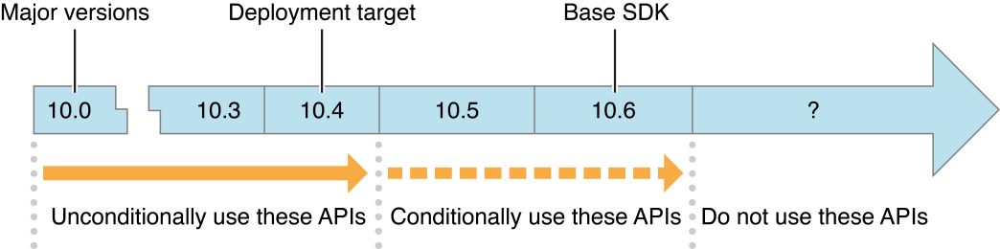

> 导航：[总目录](../../../README.md) · [documentation](../../../_indexes/documentation.md) · [SDK Compatibility Guide](Introduction.md)


[Next](Using%20SDK-Based%20Development.md)[Previous](Overview%20of%20SDK-Based%20Development.md)

# Configuring a Project for SDK-Based Development

This chapter describes the configuration of installed iOS and OS X SDKs and explains how to set up your Xcode project to use a particular SDK.

When you install Xcode, the installer creates a `/Developer/SDKs` directory. This directory contains one or more subdirectories, each of which provides the complete set of header files and stub libraries that shipped for a particular version of iOS or OS X. An OS X SDK is named by major version, such as `MacOSX10.6.sdk`, but represents the latest minor version available for the major version.

The Xcode installer for iOS places SDKs in the `/Developer/Platforms` directory, within which is a directory for each platform, such as `iPhoneOS.platform`. Each platform directory, in turn, contains a `Developer/SDKs` directory specific to that platform. The iOS SDKs are named by minor versions of iOS, such as `iPhoneOS4.2.sdk`.

Choosing the latest SDK for your project lets you use the new APIs introduced in the OS update that corresponds to that SDK. When new functionality is added as part of a system update, the system update itself does not typically contain updated header files reflecting the change. The SDKs, however, do contain updated header files.

Each `.sdk` directory resembles the directory hierarchy of the operating system release it represents: It has `usr`, `System`, and `Developer` directories at its top level. OS X `.sdk` directories also contain a `Library` directory. Each of these directories in turn contains subdirectories with the headers and libraries that are present in the corresponding version of the operating system with Xcode installed.

The libraries in an iOS or OS X SDK are stubs for linking only; they do not contain executable code but just the exported symbols. SDK support works only with native build targets.

To use a particular SDK for an Xcode project, make two selections in your project’s build settings. These choices determine which operating system features your project can use, as follows:

- __Choose a deployment target.__ This identifies the earliest OS version on which your software can run. By default, Xcode sets this to the version of the OS corresponding to the base SDK version and later.

  The Xcode build variable names for this setting are `MACOSX_DEPLOYMENT_TARGET (OS X Deployment Target)` and `IPHONEOS_DEPLOYMENT_TARGET (iOS Deployment Target)`.

  You can unconditionally use features from OS versions up to and including your deployment target setting.
- __Choose a base SDK.__ Your software can use features available in OS versions up to and including the one corresponding to the base SDK. By default, Xcode sets this to the newest OS supported by Xcode.

  The Xcode build setting name for this parameter is `SDKROOT (Base SDK)`.

  You can use features from system versions later than the deployment target—up to and including the OS version you've selected as your base SDK—but you must check for the availability of new features, as described in [Using Weakly Linked Classes in iOS](Using%20SDK-Based%20Development.md#apple-f4xwc4dqnrsv64tfmyxwi33df52wszbpgiydambsgaydalktk4zq) and [Using Weakly Linked Methods and Functions](Using%20SDK-Based%20Development.md#apple-f4xwc4dqnrsv64tfmyxwi33df52wszbpgiydambsgaydaljrgeytinjtg4).

For possible values and more information about build settings in Xcode, see [Building for Multiple Releases of an Operating System](../Xcode%20Project%20Management%20Guide/Building%20Products.md#apple-f4xwc4dqnrsv64tfmyxwi33df52wszbpkridimbqgazdmojtfvjvomzy) in _[Xcode Project Management Guide](../Xcode%20Project%20Management%20Guide/Introduction.md#apple-f4xwc4dqnrsv64tfmyxwi33df52wszbpkridimbqga3dsmjx)_, _[Xcode Build System Guide](../Xcode%20Build%20System%20Guide%20%282016%29.md#apple-f4xwc4dqnrsv64tfmyxwi33df52wszbpkridimbqgaztsmzr)_ and Running Applications in _iOS Development Guide_.

When you build your application, your deployment target is reflected in the `MinimumOSVersion` entry in the application’s `Info.plist` file. For iOS apps, the `MinimumOSVersion` entry is used by the App Store to indicate the iOS release requirement.

Figure 2-1 shows a timeline that explains the relationship between deployment target and base SDK.

__Figure 2-1__  SDK development timeline



The figure describes a project with a deployment target of OS X v10.4 and a base SDK of OS X v10.6. (The version numbers in the figure represent all releases of that version, including system updates.)

In this example, the software can freely use any features from OS X v10.0 through the newest update of version 10.4. It can conditionally take advantage of features from OS X v10.5 and 10.6, after ensuring that each such feature is available.

The effects of these settings at compile time and run time are as follows. If your code uses a symbol:

- Not defined in the base SDK (for example, a symbol from a newer OS), you get a compile-time error.
- Defined in the base SDK but marked as deprecated, you get a compile-time warning.
- Defined in the deployment target, your code links and builds normally. At run time:

  - On a system running an OS earlier than the deployment target, your code may fail to load if you use symbols unavailable in that OS.
  - On a system running an OS equal to or later than the deployment target, your code has null pointers for symbols not available in that OS. Prepare your code for this as described in [Using Weakly Linked Methods and Functions](Using%20SDK-Based%20Development.md#apple-f4xwc4dqnrsv64tfmyxwi33df52wszbpgiydambsgaydaljrgeytinjtg4) and [Using Weakly Linked Classes in iOS](Using%20SDK-Based%20Development.md#apple-f4xwc4dqnrsv64tfmyxwi33df52wszbpgiydambsgaydalktk4zq).

Always check to see if you are using deprecated APIs; though still available, deprecated APIs are not guaranteed to be available in the future. The compiler warns you about the presence of deprecated APIs in your code, as described in [Finding Instances of Deprecated API Usage](Using%20SDK-Based%20Development.md#apple-f4xwc4dqnrsv64tfmyxwi33df52wszbpgiydambsgaydalktk42q).

When you change the base SDK setting, in addition to changing the headers and stub libraries your code builds against, Xcode adjusts the behavior of other features appropriately. For example, symbol lookup, code completion, and header file opening are based on the headers in the base SDK, rather than those of the currently running OS (if the two differ). Similarly, the Xcode Quick Help affinity mechanism ensures that documentation lookup uses the doc set corresponding to the base SDK.

In addition to setting the base SDK and deployment target for your project as a whole, you can set these values individually for each build target. Target settings override project settings. (However, some Xcode features that attempt to correlate with the base SDK setting, such as symbol definition and documentation lookup, may work differently.)

The Xcode compiler uses availability macros, attached to the symbols in Apple framework headers, to determine whether symbols are weakly or strongly linked. These macros state in which version of the operating system a feature first appeared. For example, the macro in the following declaration indicates that the [enumerateObjectsUsingBlock:](https://developer.apple.com/documentation/foundation/nsarray/1415846-enumerateobjects) method (in the `NSArray` class) is available starting in OS X v10.6 and iOS 4.0:

```objc
- (void)enumerateObjectsUsingBlock:(void (^)(id obj, NSUInteger idx, BOOL *stop))block NS_AVAILABLE(10_6, 4_0);
```

When a symbol in a framework is defined as weakly linked, the symbol does not have to be present at runtime for a process to continue running. The static linker identifies a weakly linked symbol as such in any code module that references the symbol. The dynamic linker uses this same information at run time to determine whether a process can continue running. If a weakly linked symbol present in a code module is not present in the framework, the code module can continue to run as long as it does not reference the symbol. If a weakly linked symbol is present in its framework, the code can use it normally.

In the case of a deprecated symbol, the availability macro contains further syntax to indicate the version of the operating system in which the symbol was deprecated. In all cases, the reference documentation for a symbol states its availability and, if applicable, its deprecation information. The availability macros are defined in `Availability.h` and `AvailabilityMacros.h` in the `/usr/include/` directory.

The Xcode compiler interprets each availability macro in light of the base SDK and deployment target settings for a project. The compiler uses these settings to assign appropriate values to the `MAC_OS_X_VERSION_MIN_REQUIRED` and `MAC_OS_X_VERSION_MAX_ALLOWED` macros.

For example, suppose in Xcode you set the deployment target (minimum required version) to “`OS X v10.5`” and the base SDK (maximum allowed version) to “`OS X v10.6`”. During compilation, the compiler would weakly link interfaces that were introduced in OS X v10.6 while strongly linking interfaces defined in earlier versions of the OS. This would allow your application to run in OS X v10.5 and take advantage of newer features when available.

Before using any symbol introduced in a version of iOS or OS X that is later than your deployment target, check whether the symbol is available. If the symbol is not available, provide an alternate code path. See [Using SDK-Based Development](Using%20SDK-Based%20Development.md#apple-f4xwc4dqnrsv64tfmyxwi33df52wszbpgiydambsgaydalktk43a) for more information.

If you have a makefile-based project, you can also take advantage of SDK-based development, by adding the appropriate options to your compile and link commands. Using SDKs in makefile-based projects requires GCC 4.0 or later. To choose an SDK, you use the `-isysroot` option with the compiler and the `-syslibroot` option with the linker. Both options require that you specify the full path to the desired SDK directory. To set the deployment target in a makefile, use a makefile variable of the form: `ENVP= MACOSX_DEPLOYMENT_TARGET=10.4`. To use this variable in your makefile, include it in front of your compile and link commands.

Xcode supports prefix files, header files that are included implicitly by each of your source files when they're built. Many Xcode project templates generate prefix files automatically, including umbrella frameworks appropriate to the selected type of application. For efficiency, prefix files are precompiled and cached, so Xcode does not need to recompile many lines of identical code each time you build your project. You can add directives to import the particular frameworks on which your application depends.

If you are using SDK-based development, you must ensure that your prefix file that takes into account the selected SDK. That is, don’t set the prefix file to an umbrella header file using an absolute path, such as `/System/Library/Frameworks/Cocoa.framework/Versions/A/Headers/Cocoa.h`. This absolute path does not work because the specified header is from the current system, rather than the chosen SDK.

To include umbrella framework headers, add the appropriate `#import <Framework/Framework.h>` directives to your prefix file. With this technique, the compiler always chooses the headers from the appropriate SDK directory. For example, if your project is named TestSDK and it has a prefix file `TestSDK_Prefix.pch`, add the following line to that file:

```objc
#import <Cocoa/Cocoa.h>
```

If you are using Objective-C, it’s preferable to use the `#import` directive rather than `#include` (which you must use in procedural C programs) because `#import` guarantees that the same header file is never included more than once.

[Next](Using%20SDK-Based%20Development.md)[Previous](Overview%20of%20SDK-Based%20Development.md)

