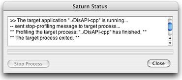
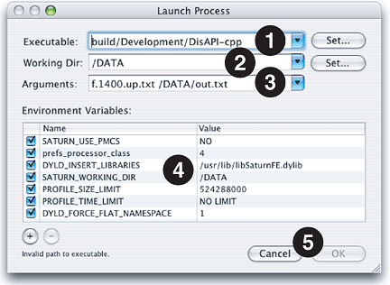
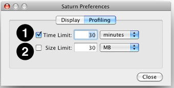
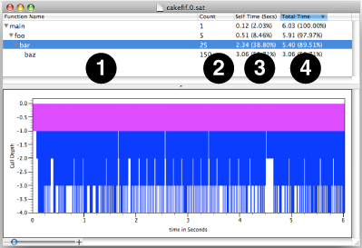
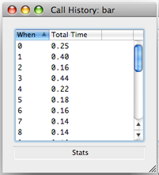
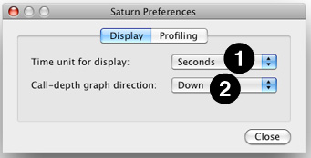

> 导航：[总目录](../../../README.md) · [documentation](../../../_indexes/documentation.md) · [Saturn 4.5 User Guide](Overview.md)

[Next](The%20Saturn%20Back-end.md)[Previous](Overview.md)

# The Saturn Front-end

The Saturn front-end is the application used to visualize the information recorded in an output file containing profiles generated by the Saturn back-end. Because these profiles are deterministic, with _every_ function entry and exit recorded, Saturn is able to precisely display the selection of functions . This can be seen in the graphical visualization in the front-end document window([Figure 1-4](#apple-f4xwc4dqnrsv64tfmyxwi33df52wszbpkridimbqga2tcnjxfvbuqmznknlti)). You can also use the Saturn front-end to launch your programs and, optionally, to set up what performance events you want to monitor.

The Saturn front-end features a persistent status panel that provides prompts and other messages indicating what the front-end is doing or about to do, or whether a procedure has failed and why. It is always available (using the _Window→Status Panel_ item, or by pressing _Command-1_). If things do not seem to going smoothly, then you should check the status panel for messages from Saturn.

__Figure 1-1__  Status Panel

The Saturn status window has four controls:

1. __Message View__— This area lists messages about the operation of Saturn. Use the scroll bar at the right side to look at older messages, if necessary.
2. __Progress bar__— This displays a colored bar graph that fills with blue from left to right, with progress reflecting the percentage of the task completed, as Saturn performs any command, such as loading a profile.
3. __Stop Process Button__— This button is enabled only while a child process, launched using the _Launch Panel_ (see [Launching Processes for Profiling](#apple-f4xwc4dqnrsv64tfmyxwi33df52wszbpkridimbqga2tcnjxfvbuqmznknlte)), is running. Pressing it causes the process to finish writing its Saturn data to disk and then exit.
4. __Close Button__— This dismisses the Saturn status panel. You normally will not need to use this, unless you have limited screen area.

The Saturn front-end can help you control applications that you are profiling using the Saturn back-end. In particular, it lets you launch applications with all of the correct environment settings already set. After profiling, it can automatically find and open the resulting profiles.

Saturn can help you launch your applications with proper settings for recording profiling data. It does this by providing an interface for supplying parameters and automatically presetting several key environment variables for you. You need to have previously compiled your source code with function profiling by specifying the `-finstrument-functions` option at compile time. Alternatively, on PowerPC Macs only, you may use the `-pg` option, instead. In this case, Saturn _must_ be used to launch your process, because it needs to override the profiling functions inserted by `gcc` with its own code. See [The Saturn Back-end](The%20Saturn%20Back-end.md#apple-f4xwc4dqnrsv64tfmyxwi33df52wszbpkridimbqga2tcnjxfvbuqnjnknlte) for more information.

__Figure 1-2__  Launch Process Panel

To launch an application from Saturn, use the _Saturn→Launch Process…_ menu item (or _Command-L_). This will bring up the “Launch Process” Panel, illustrated in Figure 1-2, where you need to “fill in the blanks” in order to tell Saturn how to launch your application. Several default environment variables used by Saturn’s profiling library will already be completed for you. Beyond this, you must at least choose an executable file before pressing “OK” and continuing. However, you can also supply many other bits of information to Shark in order to simulate the launching of your application from a command-line shell prompt, and specify a couple of options to help limit capture of spurious samples.

1. __Executable__— The _full_ path to the executable. You can either type it here or press the “Set...” button and then find it using a normal Mac “Open File...” dialog box. For Mac applications, you can set this to be either the entire application or the core binary file inside of it.
2. __Working Dir__— The _full_ path to the working directory that the application will start using. By default, this is the path where the executable is located, but you may point it anywhere else that you like, either by typing a path or pressing the “Set...” button and using the resulting “Open File...” dialog box to choose a directory. When the application is executed, it will appear to have been started from a shell that had this directory as its working directory (i.e. the output of `pwd`) just before executing the command. Hence, relative paths to data files will be resolved starting from this directory. Folders and files containing Saturn profiling results will also be placed in this directory.
3. __Arguments__— Enter any arguments here that you would have normally entered onto your shell command line after the name of the executable. Saturn will feed them into the application just as if they had come from a normal shell. Note that since Saturn’s “shell” does not have any text I/O, you will need to provide `< stdin.txt` and `> stdout.txt` redirection operations here if your executable expects to use `stdin` and/or `stdout` “files.”
4. __Environment Variables__— Supply _any_ environment variables that must be set before your application starts in this table. Otherwise, Saturn will start your application with _no_ environment variables set other than the few it uses to control profiling (it even clears out any “defaults” that you may have had before invoking Saturn). Pressing the “+” and “–” buttons below the table allows you to add or remove environment variables, respectively. Once added, you can freely edit the names of the variables and their value in the appropriate table cells. In general, you should not touch any of the default variables that Saturn supplies for you. However, it is possible to control the `PROFILE_SIZE_LIMIT` and `PROFILE_TIME_LIMIT` variables using the Saturn [Profiling Preferences](#apple-f4xwc4dqnrsv64tfmyxwi33df52wszbpkridimbqga2tcnjxfvbuqmznknlto). These settings help prevent runaway profiling from filling up your hard disk space with a gigantic Saturn data file. By default, the file size is limited to 30 MB and the profiling time to 30 minutes, whichever comes first.
5. __Cancel & OK__— Saturn will start your application and sample it _immediately_ after you hit OK. If you change your mind, Cancel will leave without starting any child processes.

__Figure 1-3__  Preference Panel – Profiling Tab

Saturn’s preference panel, opened using the menu item _Saturn→Preferences…_ menu item (or _Command-,_), contains two tabs. The second, “Profiling” (illustrated in Figure 1-3) lets you control the `PROFILE_SIZE_LIMIT` and `PROFILE_TIME_LIMIT` environment variables that Saturn passes to profiled applications when executing them. Each variable is controlled independently:

1. __Time Limit__— The first row of controls sets the `PROFILE_TIME_LIMIT` environment variable. If the checkbox is not set, then a value of `NO LIMIT` is used, and no time limit will be imposed on profiling. Otherwise, Saturn passes the time value expressed in the center edit box and pop-up menu on the right. You can specify the time in seconds, minutes, or hours. Because the `PROFILE_TIME_LIMIT` variable is expressed in seconds, Saturn will automatically convert the values you provide into seconds before setting the variable.
2. __Size Limit__— The second row of controls sets the `PROFILE_SIZE_LIMIT` environment variable. If the checkbox is not set, then a value of `NO LIMIT` is used, and the profile output file size will only be limited by the size of your hard disk. If you are writing the output to your startup disk, this can cause serious problems for your Mac. Otherwise, Saturn passes the size value entered into the center edit box and pop-up menu on the right. You can specify the size in kilobytes (KB), megabytes (MB), or gigabytes (GB). Because the `PROFILE_SIZE_LIMIT` variable is expressed in bytes, Saturn will automatically multiply the values you provide by the appropriate conversion factors before setting the variable.

After you record a profile, Saturn allows you to examine it using an interactive, graphical profile browser by choosing the _File→Open…_ menu item (or _Command-O_) and then selecting the profile data file produced during your sample execution with the resulting standard “Open File...” dialog box. You may also see this result in a more automated fashion after executing your program from within Saturn. Saturn’s graphical interface lets you see the same results that are presented textually in `gprof` output, but in a dynamic way that can be flexibly sorted and rearranged in order to allow you to find the most interesting parts of the profile more easily.

Saturn is most useful as a tool for understanding the function call behavior of your code. Using Saturn it is possible to understand four types of calling characteristics:

1. __Call Count__— Call count is useful as a sanity check for your program’s behavior. You should ensure that the profile call count matches your expectations. Each function call incurs a fixed calling overhead, so making a large number of calls to a short function that performs very little useful work per call is inefficient. Hence, functions with large call counts and short execution times are good candidates for inlining.
2. __Call Time__— In general, an application spends a large fraction of its time in a small fraction of its code. Therefore, the most efficient way to utilize limited programmer time is to concentrate on optimizing those functions that take up the largest portion of execution time.
3. __Call Depth__— Call depth is directly proportional to the amount of calling overhead your program incurs in order to get to the function(s) that do the actual work. Modern programming principles such as layering, abstraction and polymorphism lighten the burden of programming and code maintenance, but often at the expense of calling overhead and obfuscated calling behavior. Deep call stacks that terminate in functions with short call tenure suffer from an inordinate amount of calling overhead. In these cases, it is often beneficial to inline all or some of the functions in the callstack in order to reduce this overhead.

When you open a profile data file, Saturn presents the profiled information in a single, unified window. After a delay that can be up to several minutes for profiles with a high function call count, a window summarizing the profile results will appear (see Figure 1-4 for a sample). Since Saturn profile data files can be very large, you will probably want to keep an eye on the status panel progress bar and message view during the process of loading the file, in order to make sure that no problems occur.

__Figure 1-4__  Profile Window

The upper half of a Saturn profile window shows the top of _Call Tree_ view of profiled functions. Each row of the table represents one function in the call tree, and presents key profiling information about that function. This view is useful for understanding the average behavior of your program, such as which functions were executing most often and how often they were called. This information is often useful because you can use it to quickly focus in on the functions in your program that are executing most often or being called most frequently.

The columns of the call tree view from left to right are:

1. __Function Name__— The name of the function, as listed in the process’ symbol table, associated with the data on this row of the table. Except for leaf functions (ones that do not call others), there is a disclosure triangle next to each function name. Click the triangle next to a function of interest in order to reveal all child functions called by it on one or more new rows. Simply click it again to hide the child functions again.
2. __Count__— The number of times this function was called.
3. __Self Time__— The amount of time spent executing this function’s own code (but not including time spent in its children).
4. __Total Time__— The total amount of time spent executing this function _and_ its children (other functions called by this function).

You may click on the any of the column headers to have Saturn sort the profile results of _sibling_ functions by the information in that column. The order of functions at different levels or on different branches of the call tree will not be affected by this, because children are always listed directly below their parents and the group of sibling functions at each branch/level of the tree is only sorted within that group. Clicking on the small arrow at the right end of the selected column header allows you to choose an ascending or descending sort order. Usually, sorting by “total” or “self” time is most useful, but sometimes it can be helpful to sort based on call counts, if you are trying to find small functions that are called an extraordinarily large number of times.

Double-clicking on any row of the table opens up an inspector window for that function. The inspector window lists all of the individual call times (see Figure 1-5) for the given function. For non-leaf functions, both self and total values are displayed.

__Figure 1-5__  Function Inspector Window

The lower half of the window is a _Chart_ view that shows the depth of your program’s callstack (plotted vertically) over time (plotted horizontally). Callstack levels are indicated by differing shades of blue, which cycles vertically. Each function’s tenure, or time that it was executing, is depicted by the width (horizontal size) of its area in the callstack graph. Look at this view to explore your profile data chronologically. This can help you understand the sequence of calls used in your program, as opposed to the overall summary calling behavior shown in the _Call Tree View_. Using this chart, you can see at a glance if your program rarely/often calls functions and if there are any recurring patterns in the way your program calls functions. Based on this, you can often visually see different _phases_ of execution — areas where your program is executing different pieces of its code in different ways. This information is useful, because each phase of execution will usually need to be optimized in a different way.

The _Chart_ view is very dynamic. You can select a function’s execution by clicking on it in the graph. This action also selects the function in the _Call Tree_ view. Similarly, selecting a function in the _Call Tree_ view highlights all of the tenures of that function in the _Chart_ view. If the area of interest on the graph is too small for you to see, then you can simply drag your mouse (click and hold) over the desired rectangular area to have Saturn zoom into and magnify that area to fill the whole view. When you wish to return back to seeing the entire chart, zooming out is accomplished by _Option-Clicking_ anywhere in the chart area.

__Figure 1-6__  Preference Panel – Display Tab

Saturn’s preference panel, opened using the menu item _Saturn→Preferences…_ menu item (or _Command-,_), contains two tabs. The first, “Display” (illustrated in Figure 1-6) lets you control two options regarding the display in each profile window. Both options can also be controlled using menu items in Saturn, if desired. The options are:

1. __Time unit for display__— The first pop-up menu lets you choose the time units for displaying results in the self/total time columns of the _Call Tree_ view here. You can choose between seconds, milliseconds, microseconds, and nanoseconds. This can also be set using the various commands in Saturn’s _Time_ menu.
2. __Call-depth graph direction__— The second pop-up menu lets you choose to have the graph on Saturn’s _Chart_ view grow down from the top (the default) or up from the bottom. This is purely a matter of personal preference, as the same information is presented either way. These options may also be chosen using Saturn’s _Graph→Stack Grows→_ submenu.

This menu allows you to control how much information Saturn displays, by allowing you to focus its display on particular parts of your trace. In very long or complex traces, this can be very helpful. The menu contains three options:

1. __Follow Longest Time Path__— This reveals the callstack pattern that has the most time attributed to it, either through one or many calls. Because the function executing most often will often be the first place you will want to consider optimizing your programs, this is a good command to use when first examining a profile.
2. __Prune Path__— This will hide all functions outside of the function you are currently examining and any child functions that it calls. All parent functions in the callstack and functions that this function or its children never call are simply eliminated from the display. This allows you to focus on only the effects of this function and anything that it calls.
3. __Restore Root__— This restores any pruned-off paths, returning you back to the view of the entire Saturn trace.

[Next](The%20Saturn%20Back-end.md)[Previous](Overview.md)

