> 导航：[总目录](../../../README.md) · [documentation](../../../_indexes/documentation.md) · [Shark User Guide](Introduction.md)


[Next](Advanced%20Session%20Management%20and%20Data%20Mining.md)[Previous](Other%20Profiling%20and%20Tracing%20Techniques.md)

# Advanced Profiling Control

Although the _Start_ button makes starting and stopping Shark quite simple, sometimes it can be impractical, or even impossible to use. For example, how can you press the start button on a headless server? Profiling application launch can be hard to accomplish by hand as well. And what if you are only interested in profiling one particular “hot” loop, buried somewhere deep within your application?

This section discusses various advanced ways to control _what_ Shark profiles, _when_ it profiles, and _how_ the resulting profile relates to your target execution.

It’s not always beneficial to profile the entire system — often there is just too much information. For this reason, Shark allows you to target any process in the system individually, further focusing your profile. In this mode, Shark will only save samples from the target process, while discarding any others.

__Figure 5-1__  Process Attach

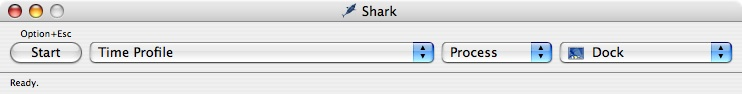

When you enter this mode by selecting _Process_ from the Target popup in Shark’s main window(or use _Command-2_), the Shark window will expand, adding a new popup — the _Process List_, as we show in Figure 5-1. By default, the Process List is sorted by process name, and you will only see processes that you own. To change these defaults, open the preferences by selecting the _Shark_→_Preferences_ menu item (_Command-Comma_) and adjust the values for the Process List under the “Appearance” tab [Shark Preferences](Getting%20Started%20with%20Shark.md#apple-f4xwc4dqnrsv64tfmyxwi33df52wszbpkridimbqga2temztfvbuqmrnknltk).

Attempting to profile launch times for your application by hand can be a frustrating endeavor. Profiling an application (or part of one) that only runs for a short time can be similarly difficult. For this reason, Shark allows you to launch your application directly, from within Shark. To instruct Shark to launch your process, enter _Process Attach_ mode, by selecting _Process_ from the Target popup (_Command-2_). Now, select the “Launch...” target from the top of the process list (or use _Command-Shift-L_). Choosing this “process” and then pressing “Start” will bring up the Process Launch Panel, shown below in Figure 5-2.

__Figure 5-2__  Launch Process Panel

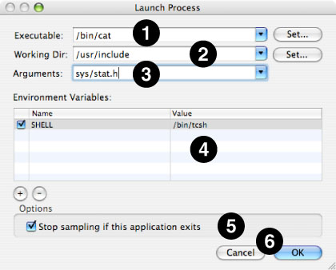

Once the Process Launch Panel has appeared, you need to “fill in the blanks” in order to tell Shark how to launch your application. If you reach here by choosing _Debug_→_Launch Using Performance Tool_→_Shark_ in Xcode, most of these blanks will be completed for you. At the very least, you must choose an executable file before pressing “OK” and continuing. However, you can also supply many other bits of information to Shark in order to simulate the launching of your application from a command-line shell prompt, and specify a couple of options to help limit capture of spurious samples.

1. __Executable__— The _full_ path to the executable. You can either type it here or press the “Set...” button and then find it using a normal Mac “Open File...” dialog box. For Mac applications, you can set this to be either the entire application or the core binary file inside of it.
2. __Working Dir__— The _full_ path to the working directory that the application will start using. By default, this is the path where the executable is located, but you may point it anywhere else that you like. When the application is executed, it will appear to have been started from a shell that had this directory as its working directory (i.e. the output of `pwd`) just before executing the command. Hence, relative paths to data files will start being determined from this directory.
3. __Arguments__— Enter any arguments here that you would have normally entered onto your shell command line after the name of the executable. Shark will feed them into the application just as if they had come from a normal shell. Note that since Shark’s “shell” does not have any text I/O, you will need to provide `< stdin.txt` and `> stdout.txt` redirection operations here if your executable expects to use `stdin` and/or `stdout` “files.”
4. __Environment Variables__— Supply _any_ environment variables that must be set before your application starts in this table. Otherwise, Shark will start your application with _no_ environment variables set (it even clears out any “defaults” that you may have had before invoking Shark). Pressing the “+” and “–” buttons below the table allows you to add or remove environment variables, respectively. Once added, you can freely edit the names of the variables and their value in the appropriate table cells.
5. __Stop sampling if this application exits__— If checked, Shark stops sampling immediately after your application completes. Hence, this will prevent Shark from capturing a bunch of samples that have nothing to do with your application if it completes quickly.
6. __Cancel & OK__— Shark will start your application and sample it _immediately_ after you hit OK. If you change your mind, Cancel will return you back to the main Shark window.

Batch mode queues up any sessions recorded without displaying them. Pending sessions are listed in the main Shark window. Batch mode allows multiple sessions to be recorded in quick succession, by not immediately incurring the overhead of displaying the viewers for each session. To enter Batch Mode, select the _Sampling→Batch Mode_menu item (or _Command-Shift-B_).

__Figure 5-3__  Batch Mode

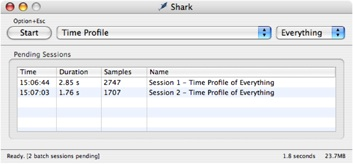

Batch mode is most useful when paired with remote control from within your application’s code, profiling multiple hot loops in quick succession, during a single program execution. Using a different session label for each loop, you can rapidly obtain multiple profiles for later investigation. See [Performance Counter Spreadsheet Advanced Settings](Other%20Profiling%20and%20Tracing%20Techniques.md#apple-f4xwc4dqnrsv64tfmyxwi33df52wszbpkridimbqga2temztfvbuqnrnknlti) for information on using this technique.

For measuring hard to repeat scenarios, Shark provides the Windowed Time Facility (abbreviated as _WTF_) with the Time Profile and System Trace configurations. The Windowed Time Facility directs Shark to only record and process a finite buffer of the most recently acquired samples, allowing it to run _continuously_ for long periods of time in the background. This continuous behavior allows you to stop profiling just _after_ something interesting occurs. At this point, Shark processes the samples in the _window_ of time just before profiling was terminated. This allows you to determine what part of your program’s execution is “interesting” _after_ it occurs, instead of trying to anticipate it in advance. Now, you effectively have the benefit of hindsight for finding hard to repeat problems.

Another way of describing how WTF mode works is how it modifies Shark’s normal “start” and “stop” behavior. Generally, Shark processes _all_ the data between the “start” and “stop” trigger events, as is shown in Figure 5-4. Most commonly, users start Shark just before entering an “interesting” period of execution and stop it when leaving the area of interest. However, you may not always know when you will encounter the “interesting” region of your program in advance. WTF mode sidesteps this problem by eliminating the need to “start” normally. While Shark stops in the normal way, as we show in Figure 5-5, the starting position is just a fixed number of samples (or effectively amount of time, with Time Profiling) before the end, instead of at a user-specified point.

__Figure 5-4__  Normal Profiling Workflow

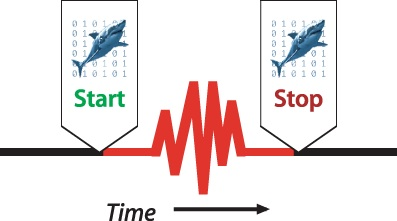

__Figure 5-5__  Windowed Time Facility Workflow

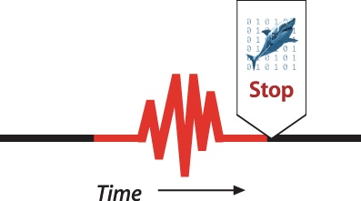

Tracing the execution around an asynchronous event, such as inter-thread communication, the arrival of a network packet, or OS event such as a page fault, are all situations when WTF mode can make profiling easier, especially when these “glitches” occur at hard-to-predict times.

This mode of profiling is especially useful for game programming; often, the timing of calls to performance-critical code regions is highly dependent upon a player’s actions, which can be hard to reproduce. For example, assume you are developing a video game engine and occasionally see the frame rate drop and/or video glitches. If the conditions for causing the glitch are unpredictable and inconsistent, then you would normally have to start sampling, attempt to reproduce the problem, and then stop sampling afterwards. If the glitch is rare, then odds will be low that you will catch the glitch within the limited sampling window, creating an extremely frustrating workflow. With WTF mode, in contrast, you can just start Shark and forget about it — until the glitch actually occurs, when a quick press of the “stop” button will capture the sequence of samples involving the glitch.

WTF mode can be enabled in several different ways. In order of increasing complexity, it can be turned on through any of the following three options:

- You can select the _Time Profile_ and _System Trace_ configurations with “WTF” included in the name from the Configuration popup (see [Main Window](Getting%20Started%20with%20Shark.md#apple-f4xwc4dqnrsv64tfmyxwi33df52wszbpkridimbqga2temztfvbuqmrnknlti)).
- WTF is an option for the “normal” _Time Profile_ and _System Trace_ configurations which may be enabled by checking the “WTF Mode” check boxes in the mini-configuration editors associated with these configurations (see [Taking a Time Profile](Time%20Profiling.md#apple-f4xwc4dqnrsv64tfmyxwi33df52wszbpkridimbqga2temztfvbuqmznknltemy) and [Basic Usage](System%20Tracing.md#apple-f4xwc4dqnrsv64tfmyxwi33df52wszbpkridimbqga2temztfvbuqnbnknltenq)).
- You may include this option in your own configurations that use the “Timed Samples & Counters” or “System Trace” data source plugins (see [Simple Timed Samples and Counters Config Editor](Custom%20Configurations.md#apple-f4xwc4dqnrsv64tfmyxwi33df52wszbpkridimbqga2temztfvbuqobnknltcmq) and [System Trace Data Source PlugIn Editor](Custom%20Configurations.md#apple-f4xwc4dqnrsv64tfmyxwi33df52wszbpkridimbqga2temztfvbuqobnknltcoi)).

In addition, WTF mode works perfectly well with _all_ of the different ways to effectively press “start” and “stop” described in this chapter. For example, instead of manually pressing “stop” at the end of your WTF region, you might have code in your program detect “glitch” conditions and programmatically fire a “stop” signal using the techniques described in [Programmatic Control](#apple-f4xwc4dqnrsv64tfmyxwi33df52wszbpkridimbqga2temztfvbuqmjtfvjvomjw).

In most ways, WTF mode functions exactly the same when used with both the Time Profile and System Trace configurations. However, there are two notable differences.

First, since System Trace is event-driven, and not time interval-driven, the “window” is actually a fixed number of _system events_ per processor, and not a fixed window of time. Therefore, the actual period of time represented by the window is highly dependent on the rate that system events occur for each processor. If these events occur very rapidly, the window might be quite short in time; if these events occur infrequently, the window might represent a long interval.

Second, the beginning of a WTF System Trace Timeline (see Figure 5-6) can appear a bit strange; different processors might first appear at vastly different points in the timeline. In the figure below, the timeline for the processor at (1) begins well before the other three processor timelines at (2). This occurs because each processor maintains its own “window” of samples, and system events can occur at vastly different rates on each processor. As a result, each processor’s window of samples can correspond to different periods of time. Since all processors’ timelines end at the same time, the effect of this is that some processors won’t show up in the timeline until much later than other processors.

__Figure 5-6__  The Windowed Time Facility Timeline

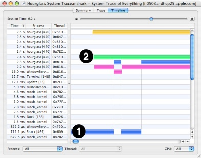

During the development process, there may come a point where your application goes unresponsive, and the dreaded spinning rainbow cursor is displayed (). Often, the situations in which this happens can be hard to repeat. For these situations, Shark provides _Unresponsive Application_ Triggering, allowing you to automatically sample whenever an application becomes unresponsive. This method of triggering is enabled by selecting the _Sampling_→_Unresponsive Applications_ menu item (_Command-Shift-A_). When Unresponsive Application Triggering is enabled, Shark will automatically switch to Batch Mode and display unresponsive application triggering options, as shown below.

__Figure 5-7__  Unresponsive Application Triggering

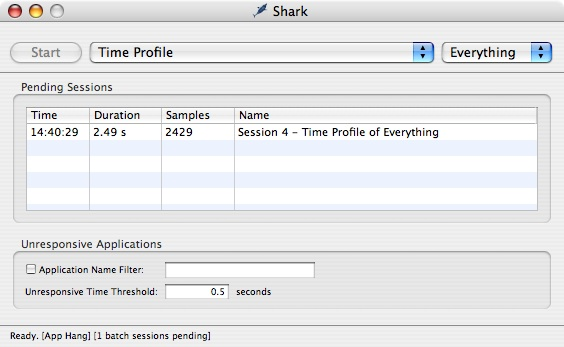

Unresponsive application profiling can be limited to a single application by setting the _Application Name Filter_ check box and filling in a name or partial name in the associated text field. The threshold for the amount of time an application is unresponsive (does not respond to mouse or keyboard events) can be set by entering a value (in seconds) in the _Unresponsive Time Threshold_ text field. With this, you can eliminate sampling of expected, brief bits of unresponsive time and focus instead on the really long and painful occurrences.

In some situations, such as profiling on headless servers, it is not possible to use the graphical user interface at all. For these cases, use `/usr/bin/shark`. Command line `shark` supports the major features of its graphical counterpart for data collection, but does not do much with the recorded data beyond saving sessions. In general, it is intended that you use it to collect sessions and then review your results with a graphical copy of Shark later. This section will discuss some common ways to use command line `shark`. A more complete description of the options available when using command line `shark` is available in its man page, `shark(1)`.

There are four main ways to use command-line `shark`. With the exception of network mode, which can run along with interactive and remote modes, any one invocation of `shark` is locked into using only one of these modes for its entire duration.

By default, command-line `shark` works in a simple interactive mode. After starting up, it records sessions on demand through a simple, three-step process:

1. `shark` waits in the background until it spots a “hot key” press, and then it starts sampling. On your local system, the hot key same as graphical Shark (_Option-Escape_, by default), while on remote terminals it defaults to _Control-\_, since this key combination can be transmitted through a generic terminal.
2. When you press the same “hot key” again, `shark` will stop sampling and begin analyzing its samples to produce a standard Shark session file. It displays progress as this occurs, and then writes out the session file to disk, using the name `session_XX.mshark` (XX = a number) and the current terminal directory by default. When complete, shark waits for another “hot key” press.
3. If you press _Control-c_ instead of a “hot key,” then `shark` will terminate and return you to the shell prompt.

After `shark` completes, you will have a sequence of Shark session files that you may then examine at your leisure with graphical Shark. Of course, there are many ways to modify this basic methodology, described in the next few sections.

Command line `shark` also supports _immediate_ mode, where it starts sampling immediately after it is launched with no user interaction, and quits after it finishes profiling — usually after 30 seconds, or when the user presses _Control-C_. This is often useful for invocation from shell scripts. To launch `shark` in this mode, use the `-i` option, as follows:

```
shark -i
```


A third way to use command line `shark` is _remote_ mode, which works much like the remote mode supported by graphical Shark and described in [Interprocess Remote Control](#apple-f4xwc4dqnrsv64tfmyxwi33df52wszbpkridimbqga2temztfvbuqmjtfvjvomjx). Once started in this mode, `shark` will wait for start/stop signals from other processes to arrive in any one of three ways:

1. A program instrumented with `chudStartRemotePerfMonitor()` and `chudStopRemotePerfMonitor()` calls can start and stop `shark`, respectively. This works the same as the equivalent functionality described in [Programmatic Control](#apple-f4xwc4dqnrsv64tfmyxwi33df52wszbpkridimbqga2temztfvbuqmjtfvjvomjw).
2. The utility program `chudRemoteCtrl` can start and stop `shark`. This works the same as the equivalent functionality described in [Command Line Remote Control](#apple-f4xwc4dqnrsv64tfmyxwi33df52wszbpkridimbqga2temztfvbuqmjtfvjvomjy).
3. The UNIX `SIGUSR1` and `SIGUSR2` signals can be sent to `shark`’s PID by your program or the UNIX `kill` utility with the “`-s USR1`” and “`-s USR2`” options. It will interpret `SIGUSR1` as a start/stop toggle and `SIGUSR2` as a command to stop sampling and generate a session.

To launch `shark` in this mode, use the `-r` option, as follows:

```
shark -r
```


Finally, command line `shark` supports _network_ mode, where it is controlled remotely by graphical Shark running on another computer. When enabled, `shark` starts up in interactive (or remote) mode, and works normally that way. However, it also listens for network connections from graphical Shark running on different Macintoshes. You can then use a combination of local start/stop operations and network start/stop operations while `shark` is running. To launch `shark` in this mode, use the `-N` option, as follows:

```
shark -N
```

A full description of network shark usage is in [Network/iPhone Profiling](#apple-f4xwc4dqnrsv64tfmyxwi33df52wszbpkridimbqga2temztfvbuqmjtfvjvomjz).

Many of Shark’s configurations, such as _Time Profile_ and _System Trace_, support common options such as time and sample limits. Command line `shark` allows you to change these limits for configurations that support them. These common options include:

- _Time Limit_— `shark -T` allows you to change the time limit. Valid times are any integer followed by “u,” “m,” or “s,” corresponding to microseconds, milliseconds, and seconds, respectively.
- _Time Interval_ — `shark -I` allows you to change the sampling interval for configurations that support a sampling interval. Valid times are entered the same way as for time limits.
- _Sample Limit_ — `shark -S` allows you to specify the maximum number of samples to record during each session.

Some other, less commonly used options change the behavior of `shark`:

- _Quiet Mode_— `shark -q` will limit terminal output to reporting of errors only.
- _Ignore task exits_— `shark -x` will instruct shark to ignore task exit notifications. Normally, shark gets notified when tasks are about to exit while it is profiling. This allows shark to collect some basic information about the task just before it is allowed to quit. It is possible, though not likely, that this can cause gaps in profiling. Use of this option is discouraged. This is equivalent to the use of the similarly named preference in [Shark Preferences](Getting%20Started%20with%20Shark.md#apple-f4xwc4dqnrsv64tfmyxwi33df52wszbpkridimbqga2temztfvbuqmrnknltk).
- _Change default filename_— `shark -o` allows you to change the default session file name from `session_XX.mshark` to a user supplied name. This name will be appended with a unique number to create a unique file name. For example, `shark -o myfile` will result in session files names `myfile_01.mshark`, `myfile_02.mshark`, and so on.
- _Change session file path_— `shark -d` allows you to specify the directory where shark will save session files, instead of the current working directory.

With command line `shark`, you can choose to launch and attach `shark` to a process, or attach `shark` to a currently running process, using options similar to the ones described previously in [Process Attach](#apple-f4xwc4dqnrsv64tfmyxwi33df52wszbpkridimbqga2temztfvbuqmjtfvjvomjs) and [Process Launch](#apple-f4xwc4dqnrsv64tfmyxwi33df52wszbpkridimbqga2temztfvbuqmjtfvjvomjt) for graphical Shark. To launch a process, simply append the process invocation as you normally would to the end of the shark command line. The following example would launch `/bin/ls ~/Documents`, and start `shark` profiling immediately:

```
shark -i /bin/ls ~/Documents
```

Instead, if you wanted to attach to a running _Apache_ daemon process, you might try this line:

```
shark -i -a [pid of httpd]
```

Making things even simpler, if you do not know the PID of the process in which you are interested, you can specify a full or partial name as the argument to the `-a` option. If there are multiple matches to a partial name, Shark will take its best guess. For these situations, it is often best to supply a PID instead.

Command line shark supports generation of textual reports, either from session files that you’ve already created, or from new sessions as they are generated. These reports can be simple summaries (`-g` or `-G` options), or complete analysis reports (`-t` option).

When creating a summary report, you can either create one from a session that is already saved on disk, with `shark -g`, or create it for new sessions, with `shark -G`. Both options result in the creation of a sidecar file, whose name will be the original session file name with `-report.txt` appended.

Creating a full analysis, either from previously saved sessions, or for any new sessions, requires passing the `-t` flag to `shark`. The `-t` flag optionally takes a filename as an argument. If no file name is specified, `shark` will allow you to take sessions as normal, except it will write one additional file per session — the full analysis report. If you specify a file name, `shark` will instead only generate the full analysis report sidecar file, and immediately quit. In both cases, the report filename will be the session file name, with `-full.txt` appended.

Because of its command line nature, `shark` can only operate on configurations already created by its graphical counter-part as discussed in [Custom Configurations](Custom%20Configurations.md#apple-f4xwc4dqnrsv64tfmyxwi33df52wszbpkridimbqga2temztfvbuqobnknltc). To use a custom configuration on a headless server, export it from Shark by opening the Configuration Editor, selecting the desired Configuration, and clicking the “Export...” button in the Configuration Editor (as described in [The Config Editor](Custom%20Configurations.md#apple-f4xwc4dqnrsv64tfmyxwi33df52wszbpkridimbqga2temztfvbuqobnknltcmy)). Copy the resulting `.cfg` file to `~/Library/Application Support/Shark/Configs` on the target machine so that command-line `shark` can find it.

Running `shark -l` will list all installed configurations, including any custom configurations (which will be near the bottom of the list). Using a capital `-L` instead will additionally list a short summary of what each configuration does, what plugins are active with each one, and their settings.

Instruct `shark` to use your custom config by passing its corresponding number to the `-c` argument. For example, if your new configuration was listed as number 13, you might use the following command line to load that configuration into command line `shark`:

```
shark -c 13
```

Alternatively, you can specify the configuration file to use directly, using `-m`:

```
shark -m custom.cfg
```

For more information on creating and using custom profiling configurations, see [Custom Configurations](Custom%20Configurations.md#apple-f4xwc4dqnrsv64tfmyxwi33df52wszbpkridimbqga2temztfvbuqobnknltc).

This section has presented some of the most common options and techniques for using command-line `shark`. For more detailed information on all available options, please read the man page: `shark(1)`.

In some cases, it is best to have your programs start and stop Shark’s sampling at precisely chosen points in their execution. Shark supports two major forms of start/stop “remote control” from other processes: _programmatic control_ allows you to insert code directly into your application to start and stop profiling, while command line remote control allows you to insert commands in your `perl` or shell scripts to start and stop profiling. In order for a remote client to activate Shark, Shark must first be placed in remote mode using the _Shark_→_Sampling_→_Programmatic_ (_Remote_) menu item. Similarly, you can use `shark -r` to start command line `shark` in remote mode (as mentioned in [Remote Mode](#apple-f4xwc4dqnrsv64tfmyxwi33df52wszbpkridimbqga2temztfvbuqmjtfvjvomy)).

It may be useful to narrow down what is profiled by Shark to a particular section of code within your application. You can start and stop sampling from within your application’s code by calling the `chudStartRemotePerfMonitor()` and `chudStopRemotePerfMonitor()` functions, defined in the `CHUD.framework`. This can be accomplished in one of two ways:

1. _Remote Profiling_— instrument your code with calls to `chudStartRemotePerfMonitor()`/ `chudStopRemotePerfMonitor()`. Shark should then be placed in remote monitoring mode via the _Sampling_➝_Programmatic (Remote)_ menu item (_Command-Shift-R_) before running your instrumented program. For every pair of start/stop calls, Shark will create a new sampling session. This can be especially useful with [Adding Shortcut Equations](Other%20Profiling%20and%20Tracing%20Techniques.md#apple-f4xwc4dqnrsv64tfmyxwi33df52wszbpkridimbqga2temztfvbuqnrnknlte).
2. _Thread Marking_— When using Hardware Performance Counters on a PowerPC machine, as discussed in [Hardware Counter Configuration](Hardware%20Counter%20Configuration.md#apple-f4xwc4dqnrsv64tfmyxwi33df52wszbpkridimbqga2temztfvbuqmjqfvjvomi), you can use `chudMarkPID()` to mark your process or `chudMarkCurrentThread()` to mark the current thread around your critical sections of code. If you configure Shark to sample only marked performance events, only code in the critical sections will be profiled.

It is important to keep in mind that many profiling techniques used by Shark employ statistical sampling in order to generate a profile. If the sampling interval is longer than the time it takes to execute the instrumented section of code, you may see few or no samples in the resulting profile. Statistical sampling is most useful when at least several hundred samples are taken.

We will use the Towers of Hanoi puzzle as an example of controlling Shark from within source code. The French mathematician Edouard Lucas invented the Towers of Hanoi puzzle in 1883 . The puzzle begins with a tower of N disks, initially stacked in decreasing size on one of three pegs. The goal is to transfer the entire tower to one of the other pegs, moving only one disk at a time and never a larger one onto a smaller one. A common solution to the Towers of Hanoi problem is a recursive algorithm (see Listing 5-1, below).

__Listing 5-1__  Towers of Hanoi Source Code

```
/* This functions takes a tower of n disks and moves from peg   */
/* 'source' to peg 'destination'.  Peg 'temp' may be used       */
/* temporarily.                                                 */
void Hanoi(char source, char temp, char destination, int n){
   if(n>0) {
      Hanoi (source, destination, temp, n-1);
      Hanoi (temp, source, destination, n-1);
   }
}
```

As a demonstration of source code instrumentation, we insert calls to start and stop Shark into the Towers of Hanoi test program (see Listing 5-2, below). Shark is then placed in _Remote Monitoring_ mode and set to use the standard _Time Profile_ configuration. The test program is run for N=10..20 disks. Shark records a session for each pair of start and stop calls.

__Listing 5-2__  Instrumented Towers of Hanoi

```c
#include <CHUD/CHUD.h>

   chudInitialize();

   chudAcquireRemoteAccess();

    for(i=n_min; i<=n_max; i++) {
      sprintf(label_str, "Hanoi #%d", i);
      chudStartRemotePerfMonitor(label_str);

      Hanoi('A','B','C',i);

      chudStopRemotePerfMonitor();
   }

   chudReleaseRemoteAccess();
```

The Towers of Hanoi test program demonstrates the need for a sampling interval that is much shorter than the time between the calls to start and stop Shark (see Figure 5-8). Less than 100 samples are taken unless the problem size is at least 15 disks. As a result, you will often find that it is better to sample your entire application and use Shark’s powerful [Data Mining](Advanced%20Session%20Management%20and%20Data%20Mining.md#apple-f4xwc4dqnrsv64tfmyxwi33df52wszbpkridimbqga2temztfvbuqnznknltc) mechanisms to narrow down what is displayed after sampling.

__Figure 5-8__  Samples Taken for Towers of Hanoi N=10..20

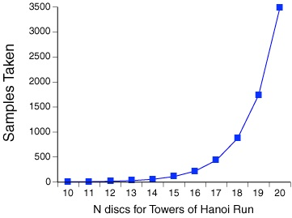

You can also start sampling remotely through the command-line using the `chudRemoteCtrl` command-line tool. Again, in order for remote clients to activate Shark, Shark must first be placed in remote mode using the _Shark_→_Sampling_→_Programmatic_ (_Remote_) menu item.

To start profiling from within your shell scripts (or by hand), issue the following command:

```
chudRemoteCtrl -s MySessionLabel
```

The argument to `-s`, above, is an arbitrary, user-specified label that will be applied to the generated session. To stop profiling, issue the following command:

```
chudRemoteCtrl -e
```

When used to stop profiling, `chudRemoteCtrl` will not return until Shark has stopped profiling. In the case of command-line `shark`, `chudRemoteCtrl` will not exit until the session file is written to disk. More information on chudRemoteCtrl is available from its man page, `chudRemoteCtrl(1)`.

Shark allows you to share computers for profiling over a network and to discover other computers sharing their copies of Shark using _Bonjour_ or manual IP address entry. This allows you to record profiles on two separate Macs on your desk (good for fullscreen application profiling), Macs in another room (useful when you are profiling servers), or even Macs halfway around the world (for travelers).

In addition, the same user interface can be used to control Shark running on any iPhone (or other device that runs the iOS, such as the iPod Touch). Shark is included by default in the iOS developer tools, so once they are installed onto your device it can be controlled by Shark running on any Mac simply by docking the device and attaching the dock to one of the Mac’s USB ports.

To use Network Profiling, select the _Shark_→_Sampling_→_Network/iPhone Profiling..._ menu item (_Command-Shift-N_), and the main window will expand to show the _Network/iPhone Manager_ pane below the main controls, as shown in Figure 5-9.

__Figure 5-9__  Network/iPhone Manager

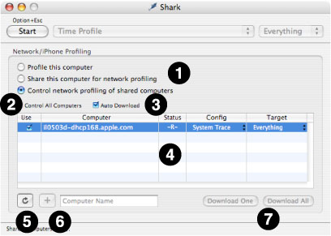

The controls in this window are described below:

1. __Modes of Operation__— Choose the overall network operation mode here:

   - _Profile this computer_— Profile the system that is running this instance of Shark; this is the “normal” way of running Shark, and effectively disables Network/iPhone Mode.
   - _Share this computer for network profiling_— Shark will advertise itself as a shared profiling service to networked computers. In this shared profiling mode, the user interface for starting and stopping profiling on the local machine is disabled.
   - _Control network profiling of shared computers_— Any computers on the network (in the local domain) running Shark in “shared” network mode will automatically be listed as available for control by this instance of Shark. In addition, all iOS devices in docks attached directly to this computer will also appear as “shared computers” if they have Shark installed (because it cannot be controlled directly on the device, Shark is automatically started in “shared” mode on these devices when necessary). In “Control” mode, clicking on Shark’s _Start_ button triggers profiling on the selected shared computer(s). “Distant” computers that are outside of the local network domain can be added to the list of controlled computers by entering the computer’s network name in the field below the shared computer table and clicking the Add (+) button.
2. __Control All Computers checkbox__— When selected, _all_ of the currently listed shared computers will be automatically selected for control. Any new computers that become available in the list (either by Bonjour auto-discovery or by being manually added by name to the table) will be automatically selected for control, as well. All computers will start and stop sampling together, at approximately the same time. Additionally, changing the config or target of _any_ shared computer causes all the controlled computers’ settings to change to the same setting, if it is available. This option is very useful when you are attempting to control a large cluster of identical computers.
3. __Auto Download checkbox__— When selected, the shared computers controlled by this copy of Shark will automatically deliver sessions to the the controller. The name of the system that generated each session is included in the title of each session document window. Otherwise, the sessions will be saved locally on the controlled machines for later download. This can be a better policy if you are taking many sessions in quick succession, and network bandwidth becomes a limiting factor or impacts your measurements adversely.
4. __Computer table__— This is the list of all the Macs running the Shark application in shared profiling mode and attached iOS devices. These computers can be selected for profiling control by this Shark application. Columns are discussed in the order they are presented onscreen, left-to-right:

   - _Use_— Toggles whether or not to control Shark on a shared computer.
   - _Computer_— The name of each shared computer
   - _Status_— This shows the current “state” of Shark running on the remote system. There are several different possible states of a shared computer running Shark in network mode:

     - Unknown (–?–): Computer is not connected.
     - Ready (–R–): Shark can start sampling.
     - Sampling (–S–): Shark is actively collecting profile data.
     - Processing (–P–): Shark is creating a profile session.
     - Transmitting (–T–): The new session is being sent.
   - _Config_— The currently active _Sampling Configuration_ on the shared computer. The entries in this column are menus, just like the one in Shark’s main window (see [Main Window](Getting%20Started%20with%20Shark.md#apple-f4xwc4dqnrsv64tfmyxwi33df52wszbpkridimbqga2temztfvbuqmrnknlti)). The selected configuration on the remote shared computer can be changed by changing the selection in the menu
   - _Target_— The currently active _Profiling Target_ on the shared computer. The entries in this column are menus, just like the one in Shark’s main window (see[Main Window](Getting%20Started%20with%20Shark.md#apple-f4xwc4dqnrsv64tfmyxwi33df52wszbpkridimbqga2temztfvbuqmrnknlti)). The targeted process (if any) on the remote shared computer can be changed by changing the selection in the menu.
   - _Cached Sessions (not pictured)_— This column is only visible if “Auto Download” is not active. It lists the number of complete profile sessions cached on each shared computer, and waiting for download to the controlling system.
5. __Refresh button__— Click this button to clear the table and search for shared computers and attached iOS devices again. Computers that you have added by hand will not be cleared from the list when you refresh.
6. __Add Computer button and Name field__— Pressing this button attempts to add the computer with the name or IP address entered into the computer name field to the list of shared computers. The specified computer must be attached to the network and running Shark in shared profiling mode, or this will fail.
7. __Download One and Download All buttons__— If the _Auto Download_ checkbox is not selected, then computers that are being controlled across the network will cache the session files they generate for later download rather than sending them immediately to the controlling Shark application. The number of sessions available to download is listed in the Shared Computer table’s _Cached Sessions_ column. Clicking the _Download One_ button will download a single session, while clicking the Download All button will download all available sessions. Sessions are always retrieved in the order that they were created.

Although the graphical Shark application can be placed in “Share this computer” mode, it is more typical to use command line `shark` on any remote, shared computers. You can use `ssh(1)` to connect to a remote computer. Once connected, launch command line `shark` with the `–N` option. The remote run of `shark` will then respond to network requests to start and stop profiling. A sample transcript of a remote command line shark in “Network Sharing” mode is shown in Figure 5-10. For more information on the usage and configuration of command line `shark`, see [Timed Counters: The Performance Counter Spreadsheet](Other%20Profiling%20and%20Tracing%20Techniques.md#apple-f4xwc4dqnrsv64tfmyxwi33df52wszbpkridimbqga2temztfvbuqnrnknlto).

__Figure 5-10__  Command Line Shark in Network Profiling Mode

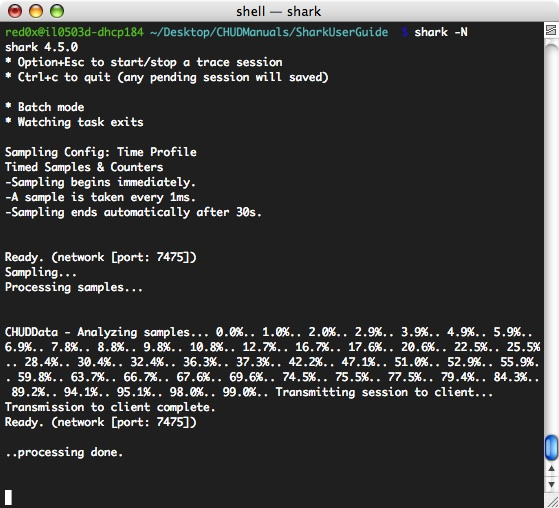

The sharing firewall on Mac OS X can prevent Shark’s network profiling from working in either sharing or control mode. When the Shark Network Manager successfully opens a network connection, the communication port number Shark is using is listed in brackets. This is normally port number 7475. Unfortunately, this port is not “open” through the firewall by default. If you attempt to enter “Shared Profiling” or “Network Control” mode while the firewall is enabled, you will be presented with a warning dialog, as illustrated in Figure 5-11

__Figure 5-11__  Sharing Firewall Warning Dialog

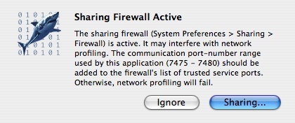

Click the _Sharing..._ button in the warning dialog to bring up the _System Preferences_ window _Sharing_ tab. Otherwise click the _Ignore_ button to dismiss the dialog, but note that doing so may result in the inability to use Shark over the network. Once in the _Sharing Preference_ window of _System Preferences_, select the _Firewall_ tab. If you have never before added settings for Shark, then click the _New…_ button, and fill in the sheet as shown in Figure 5-12, and click the _OK_ button.

__Figure 5-12__  Firewall Sharing Preferences, while adding a new port range for Shark

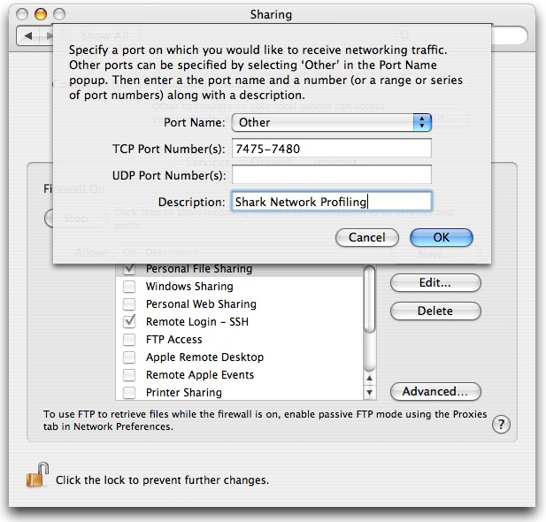

[Next](Advanced%20Session%20Management%20and%20Data%20Mining.md)[Previous](Other%20Profiling%20and%20Tracing%20Techniques.md)

