> 导航：[总目录](../../../README.md) · [documentation](../../../_indexes/documentation.md) · [Shark User Guide](Introduction.md)

[Next](Custom%20Configurations.md)[Previous](Advanced%20Profiling%20Control.md)

# Advanced Session Management and Data Mining

Often, the profile analysis windows can provide you with a very helpful view of your application’s behavior using the default settings. However, there are also many tools available in Shark that can help you sort through the large quantity of data that Shark can collect quite quickly. This chapter describes many of the techniques that you can use to adjust how data is presented if the profiles are providing you with too little or too much information.

A common problem encountered by Shark users is a profile filled with instruction address ranges, instead of actual names, for all of the symbols (functions) in the program. Shark is very good at finding and using symbol information created by the compiler, but you do need to make sure that the compiler and linker actually record the correct symbol information, or you will be stuck deciphering cryptic address ranges instead of the names that you were expecting. This section explains how to solve some of the most common problems that can prevent Shark from finding and displaying the symbol names in your code.

Shark records samples from the system in both user and supervisor code. In order to look up symbols for user space samples, the corresponding process is temporarily suspended while its memory is examined for symbols. Symbol lookup of user space samples will fail if the option to catch exiting processes (see [Shark Preferences](Getting%20Started%20with%20Shark.md#apple-f4xwc4dqnrsv64tfmyxwi33df52wszbpkridimbqga2temztfvbuqmrnknltk)) is disabled and the process is no longer running. In addition, if you need to profile a task which will exit before profiling is finished, then you should execute it with an absolute path (e.g. `/usr/local/bin/foo`) rather than a relative path (e.g. `../foo`). Otherwise you may not be able to examine program code in a Code Browser. Supervisor space symbol lookup is done by reconstructing the kernel and driver memory space from user accessible files: `/System/Library/Extensions` for drivers and other kernel extensions and `/mach_kernel` for kernel symbols. Samples from kernel extensions or drivers not in the locations specified on Shark’s Search Paths Preference pane (see [Shark Preferences](Getting%20Started%20with%20Shark.md#apple-f4xwc4dqnrsv64tfmyxwi33df52wszbpkridimbqga2temztfvbuqmrnknltk)) will fail symbol lookup. Developers who download the KernelDebugKit SDK and mount the disk image are able to see source information for the kernel and base IOKit kernel extension classes (families).

If symbol lookup fails, Shark may present the missing “symbols” in two different ways. If the memory of the process is readable — for example, a binary that has had its symbols stripped — Shark tries to determine the range of the source function by looking for typical compiler-generated function prologue and epilogue sequences around the address of the sampled instruction. Symbol ranges gathered in this manner are listed as `address [length].` If the memory of a process is completely unreadable, the sample will be listed with the placeholder symbol `address [unreadable].`

In order for Shark to look up symbol information, the sampled application must contain debugging information generated by a compiler or linker.

It is almost always more useful to profile a release build rather than a debug build because compiler optimizations can drastically alter the performance profile of an application. Debug-style code is most often compiled without any optimizations at all `(-O0`). This makes debugging simpler, but produces non-optimal code. A profile of unoptimized code is misleading because it will often have different performance bottlenecks than optimized code.

To generate debugging information in Xcode, select _Project→Edit Active_ Target and go to the _GNU C/C++ Compiler_ panel. Make sure that the _Generate Debug Symbols_ checkbox is enabled. If you want to have your _Release_ style products left unstripped (with symbol information), select the _Unstripped Product_ checkbox. Make sure that the `COPY_PHASE_STRIP` variable, if it is defined, is set to `NO`.

If you are using command-line compilers such as GCC, XLC/XLF, and/or makefiles, use the “-g” compiler flag to specify that debugging information is generated

It’s common practice for software built for public release to be stripped of debugging information (symbols and source locations). Although this reduces the overall size of the product and helps protect proprietary code against prying eyes, it makes it much more difficult to understand profiles taken with Shark. Shark doesn’t require debugging information to work, but it can be much more helpful if it’s available. In case you record a Shark session and discover that symbols have not been captured, then you can attempt to have Shark add them in afterwards.

__Figure 6-1__  Session Inspector: Symbols

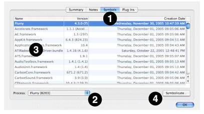

The most common way to “symbolicate” or add symbols (along with other debugging information) to your session is to simply use the _File→Symbolicate..._ command. With this command, you can quickly choose a symbol-rich application binary to attach to your Shark session, even if the original measurement was taken using a symbol-free binary.

Shark’s _Session Inspector_ window (see [Session Windows and Files](Getting%20Started%20with%20Shark.md#apple-f4xwc4dqnrsv64tfmyxwi33df52wszbpkridimbqga2temztfvbuqmrnknlto)) also allows you to add debugging information to a session. This technique requires more steps, but is recommended if you are adding symbols from a dynamic library used by your application, instead of the application itself, or if you need to selectively add symbols from many different application binary files. The _Symbols_ tab (1) in the window shows you the list of all the profiled executables in the session, along with the libraries and frameworks they were linked with. The _Process_ popup (2) allows you to select the application you’re interested in inspecting or symbolicating. Each row of the table lists the name, version (if available) and creation date of each binary. The full path of each binary is displayed as a tooltip for each entry in the _Name_ column (3). To symbolicate any particular binary, double-click on its entry in the table or select it and click the _Symbolicate_ button (4).

No matter which way you choose to get here, you will be presented with a _Symbolication_ dialog (Figure 2-20).

__Figure 6-2__  Symbolication Dialog

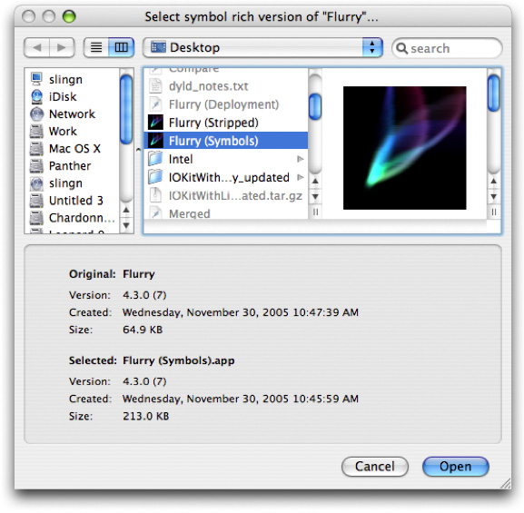

Use this dialog to select a symbol-rich (but otherwise identical) version of the binary you are symbolicating. The version, creation date and size is shown for both the original and selected binary. For maximum flexibility Shark does not restrict what you can select in any way. But it does indicate when something might be wrong with the selection you have made by highlighting potential problems. Ideally, this is the list of attributes that Shark expects for a good match:

- The name of the original and symbol-rich binaries should match (for bundles, this is the bundle name). Also, for bundles, the version strings should match.
- The creation date of the symbol-rich binary should be the same or earlier than the stripped version.
- The size of the symbol-rich binary should be larger than the stripped version.

Shark will warn you if you select a binary that is potentially problematic. If you do happen to select an executable that isn’t a good match, the profile results will be incorrect. Heavy View and Tree View show an example session before and after symbolication.

__Figure 6-3__  Before Symbolication

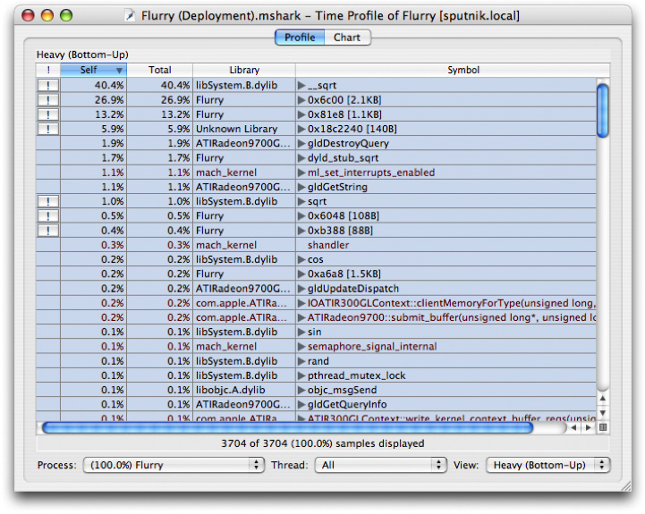

__Figure 6-4__  After Symbolication

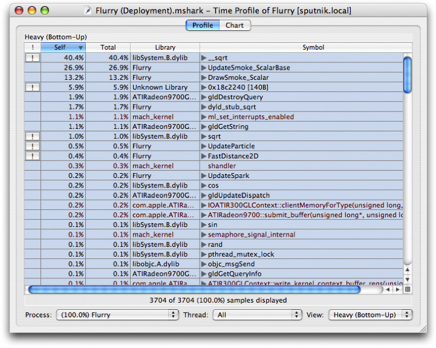

If you have multiple sessions measuring the same application, it is possible to use Shark to compare or merge those sessions with each other.

Shark can be used for tracking performance regressions. Shark allows you to compare the contents of two session files sampling the same process through the _File_→_Compare_... menu item (_Command-Option-C_). Note that processes are identified by name rather than process ID (PID) by default when comparing sessions, so do not change the name of your program between sessions if you want to use this command.

When used, a new session is created from two existing ones: Session A and Session B. The first session (Session A) is given a negative scaling factor, and the second session (Session B) is given a positive scaling factor. The result of a compare operation is a new session with negative profile entries for more samples in the earlier session (Session A), and positive profile entries for more samples in the later session (Session B).

The magnitude of the scaling factor is adjusted according to the number of samples in each session so that both sessions are given equal total weight. In the case of comparing two sessions with an equal number of samples, the scaling factor for Session A is -1.0, and for Session B is +1.0.

As an example of how the session comparison algorithm works, let’s say that Session A has 400 samples in process `foo`, and Session B has 440 samples in process `foo`. The total weight for process `foo` in the combined session will be 840.

If in Session A there were 80 samples for function `bar()` in process `foo`, and in Session B there were 120 samples for function `bar()` in process `foo`, the value of `bar()` is 120 – 80 = +40. The value shown for `bar()` would be (+40 / 840) \* 100 = +4.8%. Note that the meaning of percentage is consistent with the standard time profile display — the baseline is the total count for the currently selected scope (system, process or thread).

If you have profiled the individual components that make up a workload separately, you may want to merge the resulting sessions into a single file. Shark can merge two session files through a process similar to comparing them. The only difference is that each source session file is given a scaling factor of +1.0. Select the _File_→_Merge_... menu item (_Command-Option-M_).

By default, Shark groups samples by symbol (although other groupings such as address, library and source line are also possible using the controls described previously in [Automatic Symbolication Troubleshooting](#apple-f4xwc4dqnrsv64tfmyxwi33df52wszbpkridimbqga2temztfvbuqnznknlti)). Although this is often sufficient, judiciously filtering out pieces of a profile can in some cases make it easier to analyze. Data mining allows you to hide samples that may obscure important behavioral or algorithmic characteristics in a profile.

In order to understand how to use data mining to better understand your application, it is necessary to first understand a few fundamental concepts about samples and callstacks. Each Shark session contains some number of samples. Each sample contains contextual information such as where and when it was taken (process and thread ID, timestamp) as well as the callstack information for how the sampled thread of execution arrived at the current program counter address. An example of several callstacks is shown in Figure 6-5.

Each callstack is made up of _N_ stack frames (_N_=4 in the case of Sample 1). Note that when a sample is taken, the program’s stack pointer points to the leaf entry at _N_-1 (`cos` in the first sample). When Shark builds up a call tree to analyze how routines call each other, “self” counts in the profile browser are simply the number of samples where this routine is the leaf entry function. Therefore, the “self” count represents the amount of time that code within the function was executing. In contrast, “total” counts are the number of samples where this function appears at _any_ point in a callstack, and therefore represents the summation of a function’s execution time _and_ the time of all functions that it calls.

Shark can combine samples into call trees in two different ways. Figure 6-6 depicts the “Heavy” call tree assembled from the example samples, while Figure 6-7 shows the corresponding “Tree” view. As you can see, the “heavy” view starts from the leaf functions and builds towards the base of the callstack, while the “tree” view starts at the base of the callstack and works down to the leaves. The former view is usually better for finding out which parts of your program are executing most often, while the latter is often better for finding large routines farther down the callstack that call many other routines in the course of their execution. Once you have a clear picture of how callstacks are converted into call trees, it is easier to understand the application of the data mining operations.

__Figure 6-5__  Example Callstacks

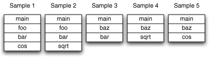

__Figure 6-6__  Heavy View

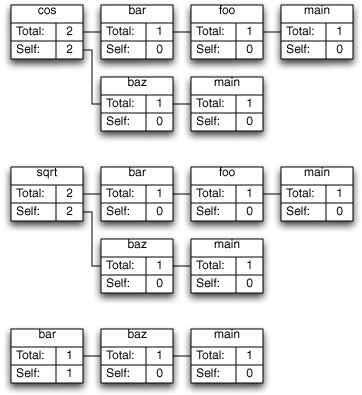

__Figure 6-7__  Tree View

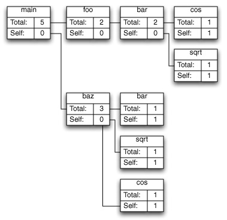

Shark’s Data Mining operations allow you to prune down call trees in order to make them easier to understand. While the small call trees in the preceding figures are fairly simple, in real applications with hundreds and thousands of symbols, the call trees can be huge. As a result, it is often useful to consolidate or prune off sections of the call trees that do not add useful information, in order to simplify the view that Shark provides in controlled ways. For example, you often won’t care about the exact places that samples occur within MacOS X’s extensive libraries — only which of _your_ functions are calling them too much. Data Mining can help with simplifications like this. It is accessible in three different ways.

__Figure 6-8__  Data Mining Advanced Settings

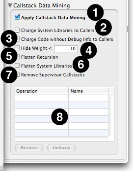

The _Advanced Settings_ drawer (Figure 6-8), in its lower half, contains the following controls that apply filtering to an entire session. This is a great way for making a few common quick trims to too-complex callstack trees.

1. __Apply Callstack Data Mining__— Global control that toggles the use of all data mining controls en masse, good for quickly comparing your results before and after data mining.
2. __Charge System Libraries to Callers__— Removes any callstack frames from system libraries and frameworks, effectively reassigning time spent in those functions to the callers. This is often quite useful, as you cannot usually modify the system libraries directly, but only your code that calls them. Samples from system libraries that aren’t called from user code, such as the system idle loop, disappear entirely.
3. __Charge Code without Debug Info to Callers__— Removes any callstack frames from code without debugging information, effectively reassigning time spent in those functions to the callers. In a typical development environment, this will effectively show all samples only in source code that you own and compiled using a flag such as ‘–g’ with GCC or XLC, and in the process eliminating a lot of user-level code that you probably do not have control over. Samples from code that isn’t called from debug-friendly code are eliminated entirely.
4. __Hide Weight < N__— Hides any granules that have a total weight less than the specified limit. This macro helps reduce visual noise caused by granules (i.e. symbols) that only trigger a sample or two, making it easier to see the overall profile.
5. __Flatten Recursion__— For each branch in the call tree, this collapses functions that call themselves into a single entry, removing all of the recursive calls entirely from the trace.
6. __Flatten System Libraries__— Chops off the top of callstacks beyond the entry points into system libraries, so that any samples from the libraries are only identified by the entry points.
7. __Remove Supervisor Callstacks__— Completely removes (_without_ charging to the callers) all samples in the profile from supervisor code (kernel and drivers).
8. __Granule List__— Displays a list of particular granules that you have identified for data mining, using the menu controls described next, along with the name of the operation applied to that granule. You can modify the operation used to mine them using the menu associated with this name.

A_Data Mining_ menu appears in the menu bar whenever a Shark session is open. The menu contains the following items that allow you to selectively apply data mining to particular granules in your code:

1. __Charge Symbol _X_ to Callers__— Removes any callstack frames containing the symbol _X_, and frames of functions called by _X_, effectively reassigning time spent in those functions to the callers.
2. __Charge Library to _X_ Callers__— Removes any callstack frames containing the specified library, effectively reassigning samples to the callers of the library.
3. __Flatten Library _X___— Removes all but the first callstack frame for the specified library, attributing all samples in interior functions to the entry points of the library.
4. __Remove Callstacks with Symbol _X___— All callstacks that contain the specified symbol are removed from the profile; samples in matching callstacks are discarded.
5. __Retain Callstacks with Symbol _X___— Overrides all of the above operations for any callstack that contains the specified symbol.
6. __Restore All__— Undo all _Charge To_, _Flatten_, _Remove_, and _Retain_ operations.
7. __Focus Symbol _X___— Makes the specified symbol the root of the call tree; removes symbols and samples above (callers to) this symbol in the call tree and remove callstacks that do not contain this symbol. This allows you to quickly eliminate all samples but those from an interesting part of a program.
8. __Focus Library _X___— Makes the specified library the root of the call tree; removes symbols and samples above (callers to) this library in the call tree and remove callstacks that do not contain this library.
9. __Focus Callers of Symbol _X___— Removes functions called by the specified symbol and removes callstacks that do not contain the specified symbol.
10. __Focus Callers of Library _X___— Removes functions called by the specified library and removes callstacks that do not contain the specified library.
11. __Unfocus All__— Undo all _Focus_ operations.

This same menu appears as a contextual menu on entries in the _Heavy_, _Tree_ and _Callstack_ results tables. While the mouse is held over a line in a table, you can control-click (or right-click) to bring up the menu, as is shown in (Figure 6-9).

__Figure 6-9__  Contextual Data Mining Menu

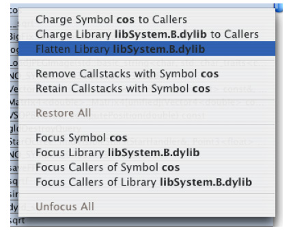

In addition to data mining based on callstack symbol and library information, it is also possible to filter out samples based on associated performance count information (if available), using the _Perf Count Data Mining_ palette (Figure 6-10). The available “perf count” data mining operations are:

- __Equal (==)__— Removes callstacks with perf counts equal to the specified value.
- __Not Equal (!=)__— Removes callstacks with perf counts not equal to the specified value.
- __Greater Than (>)__— Removes callstacks with perf counts greater than the specified value.
- __Less Than (<)__— Removes callstacks with a perf counts less than the specified value.

The _Perf Count Data Mining_ palette also supplies a global enable/disable toggle, much like the one available with conventional data mining, and check boxes for toggling the visibility of perf count information (the eye column) and whether or not the perf count data is accumulated across processors (the Σ column), on a per-counter basis.

__Figure 6-10__  Perf Count Data Mining Palette

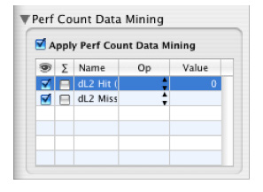

Our first example uses Shark’s data mining tools to help isolate a performance problem from a time profile of the Sketch demo program. If you want to follow along with the demo, it is available in `/Developer/Applications/Examples/AppKit/Sketch`.

1. Launch Sketch (located in `/Developer/Applications/Examples/AppKit/Sketch/build/` after you build the project with Xcode)
2. Make four shapes as shown in Figure 6-11

   __Figure 6-11__  Example Shapes

   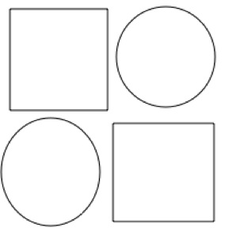
3. Repeat the following steps until the app becomes sluggish (takes a half second or second to select all):

   - Select All (_Command-A_)
   - Copy (_Command-C_)
   - Paste (_Command-V_)

   This should take 8-10 times (maybe more) depending on hardware. When you are done it should look something similar to Figure 6-12

   __Figure 6-12__  Example Shapes, Replicated

   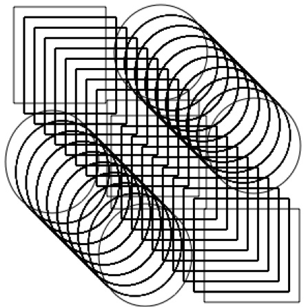
4. Click in blank area of the window to deselect all the shapes.
5. Do select all and notice how long it takes for all of them to be selected. This is a performance problem.

1. Launch Shark (in `/Developer/Applications/Performance Tools/`)
2. Target your application by selecting the “Sketch” process, as shown in Figure 6-13.

   The start button will start and stop sampling. The Everything/Process pop-up will let you choose whether you wish to sample the entire system or just a single process. The Time Profile pop-up will let you choose different types of sampling that you can perform. In this case we will switch the System/Process pop-up to Process (to target a single process.)

   This reveals a third pop-up button that you can use to target your application. Select Sketch from the list of running applications.

   __Figure 6-13__  Sampling a Specific Process

   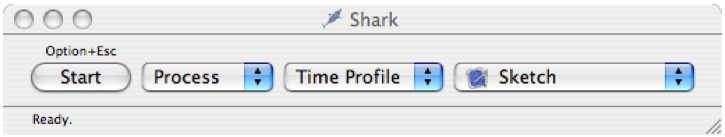
3. Switch back to Sketch and make sure nothing is selected.
4. Move the Sketch window to expose the Shark window (optional but makes things easier).
5. Press _Option-Escape_ to start sampling.
6. Press _Command-A_ to select all and wait for the operation to complete.
7. Press _Option-Escape_ to stop Sampling and you will get a window that looks like Figure 6-14.

   __Figure 6-14__  Default Profile View

   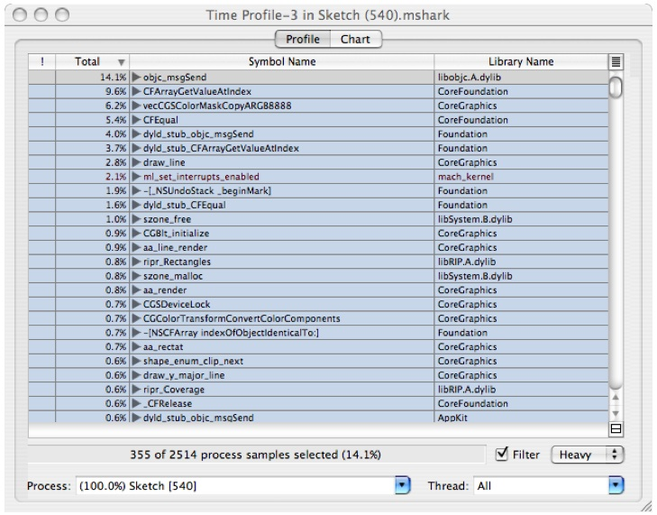

The session window gives you by default a summary of all the functions that the sampler found samples in and the percentage of the samples that were found there. So in the example, 14.1% of the samples were found in `objc_msgSend`. This view is very useful for doing analysis of performance when the bottlenecks occur in leaf functions. As you can see, the above window gives you a lot of detail about where your program is spending time, but unfortunately it is at too low a level to be of use to the developer of Sketch, or even the developers of the Frameworks that Sketch depends on.

To get at the parts of the program that are of most interest to the developer of Sketch, you can do the following:

1. In the _Window_ menu, choose _Show Advanced Settings..._. This will open a drawer with the data mining palette, among other things, as was shown in [Advanced Session Management and Data Mining](#apple-f4xwc4dqnrsv64tfmyxwi33df52wszbpkridimbqga2temztfvbuqnznknlte). We will go over each of these areas in more detail later. For now, let's turn on a couple of cool features. In the _Profile Analysis Palette_, do the following:

   - Click on the _Stats Display_ pop-up and select _Value_. This lets you the actual counts for the samples rather than percentage. This may be more intuitive for some users than weighting by %, especially while you are going through this tutorial. Use whichever you prefer.
   - Click on the _Weight by:_ pop-up and select _Time_. You will see the samples displayed as the time spent in that function rather than counts.
   - Check the _Color by Library_ checkbox. This will display the text of symbols and library names in different colors based on the library they came from. This is handy for visually identifying groups of related functions.
2. In the _Data Mining Palette_ box, check _Charge System Libraries to Callers_. This will eliminate system libraries and frameworks, and charge the cost of their calls to the application level functions or methods that are calling them.
3. Click on the callstack  button on the lower right corner of the table to reveal the callstack pane, as shown in Figure 6-15. As you click on symbols on the left, the callstack pane will show you the stack leading up to the selected symbol. Since system libraries and frameworks were filtered out in the previous step, you will only see your application's symbols. Note that if you click on a symbol in the callstack pane, the outline on the left will automatically expand the outline to show that symbol.

   __Figure 6-15__  Navigation Via the Call-Stack Pane

   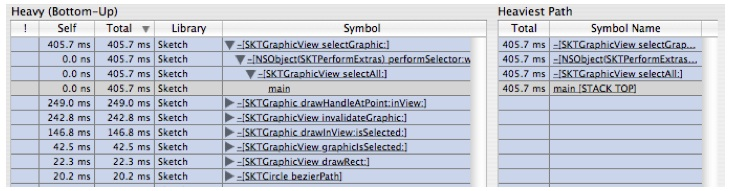
4. Click on the 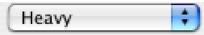 pop-up menu on the lower right corner of the window and select 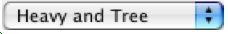 to split it in half. The top half will continue to show the Heavy View ("Bottom-Up View") of the samples and the bottom will show the Tree View ("Top-Down View").

   If you click on the symbol main in the bottom pane, you will see that the callstack view on the right will show the stack, as shown in Figure 6-16. This view will control navigation for whichever outline that was last selected

   __Figure 6-16__  Navigation Via the Call-Stack Pane with Tree View

   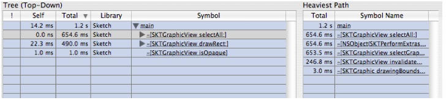
5. Looking at this outline, we see there are two areas where a lot of time is being spent: `-[SKTGraphicView drawRect:]` and `-[SKTGraphicView selectAll:]`. Let's look at the `selectAll` method first.

The following is an example of doing interior analysis across a few levels of function calls.

1. Open up the tree view as shown in Figure 6-16.
2. Double click on the symbol `-[SKTGraphicView selectAll:]` in the tree view above. You will see a source window that looks like Figure 6-17

   __Figure 6-17__  Source View: SKTGraphicView selectAll

   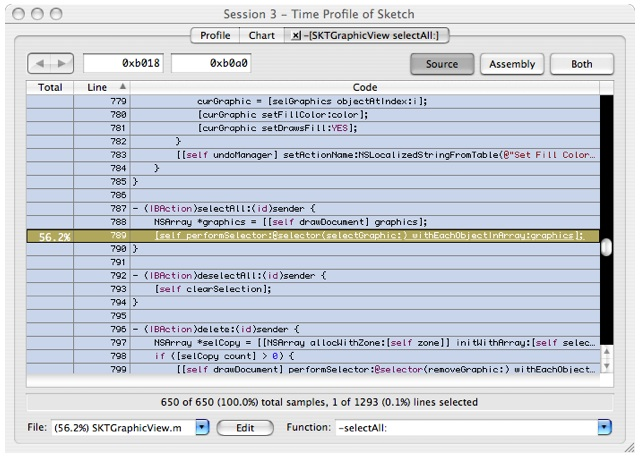

   The code browser uses yellow to indicate sample counts that occur in this function or functions called by that function.
3. Double-click on the yellow colored line to navigate to the function (performSelector) called here. When the new source window comes up, double-click in the yellow area marked with 2.7 s. This will display the counts for this code, which should look like Figure 6-18:

   __Figure 6-18__  Source View: NSObject

   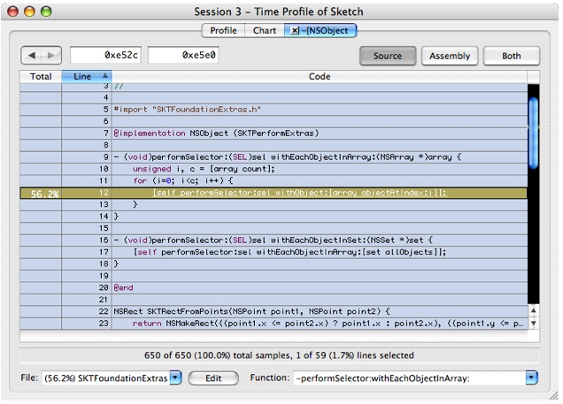

   Before we go on, please notice that this is a `for` loop that iterates over all the items in the array, which in this case is the array of all the graphic objects stored in Sketch's model.
4. Double-click on the yellow colored line `[self performSelector: sel withObject:[array ObjectAtIndex:i]];` and you'll get Figure 6-19:

   __Figure 6-19__  Source View: SKTGraphicView selectGraphic

   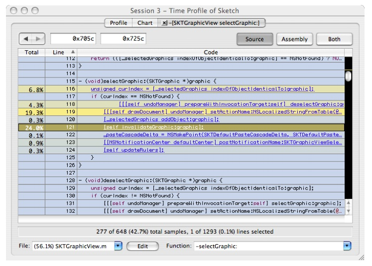

   There are several hotspots here:

   - At line 116, there is a call to `indexOfObjectIdenticalTo:graphic`. This is a linear search of the selected graphics. Since we are doing a "select all" operation, this is a linear search inside of a linear search. You have just found a fundamentally O(N2) operation. Interestingly, this is not where most of the time is being spent.
   - The operation in lines 118 and 119 appears to be an expensive framework call. This should be hoisted out of the `performSelector: OnEachObjectInArray` loop and done once, if possible. If we were the framework developers, it might also be interesting to investigate why these calls are so costly.
   - Line 121 shows a call out to `-[SKTGraphicView invalidateGraphic]`. Let's dig deeper into this since this is in Sketch's code.
5. Double-click on `[self invalidateGraphic:graphic];` and you'll get Figure 6-20. This contains one line of expensive code that tests for nested objects.

   __Figure 6-20__  Source View: SKTGraphicView invalidateGraphic

   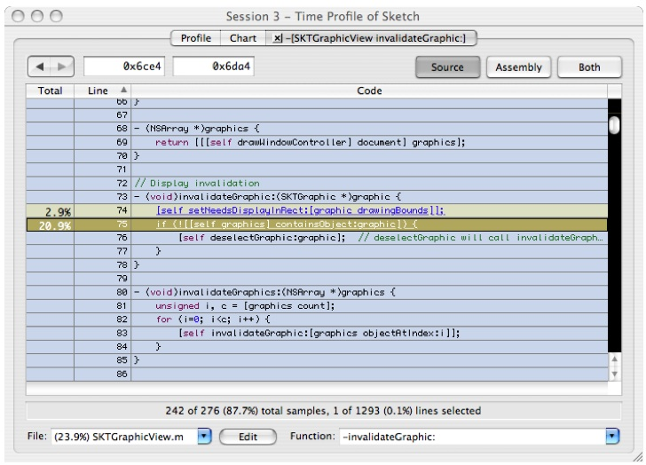

It is interesting to note that even with this fairly quick analysis we have already identified several glaring problems. The first problem we found was O(N2) behavior introduced by our code implementation hiding within functions and the use of abstraction. In general it is good to create and use abstraction in your coding. However, doing so can unintentionally introduce unnecessary performance pitfalls. Each of these functions is well conceived locally, but when they are used together they combine to have poor scalability. Second, we used expensive framework calls (in this case, to the undo manager) inside of a loop. Since undoing each step of a “select all” operation really isn’t necessary, the expensive call can be moved up to a higher level, in order to just undo all of the selects at once. This is an example of hoisting functionality to a higher level in the execution tree. Finally, the `invalidateGraphic` routine was doing some heavyweight testing, and it would clearly be worthwhile to see if we can move this testing outside of the inner loops, if possible.

This example will take us through analyzing the behavior of drawing the selected rectangles. Here, we will develop ideas for analyzing larger and more complex programs (or frameworks) that involve multiple libraries. In doing so, we will introduce the Analysis menu/context menu and the ideas of focusing and filtering. This example will use system frameworks to demonstrate the ideas but the principles apply just as well to any large-scale application built as a collection of modules.

1. Close all the source windows from the analysis of `-[SKTGraphicView selectAll:]` by clicking on the close buttons in the tabs of the tab view.
2. Switch to the profile tab and do option click on the top most disclosure triangle to close all of the triangles.
3. Open the first two levels so it looks like Figure 6-21:

   __Figure 6-21__  Tree view before focusing

   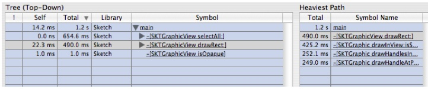
4. Select `-[SKTGraphicView drawRect:]` and control-click to bring up a contextual menu which contains the focus and exclusion operations available in Shark (the operations in this menu are also available via the _Data Mining_ Menu in the menu bar). It looks like Figure 6-22.

   __Figure 6-22__  Data Mining Contextual Menu

   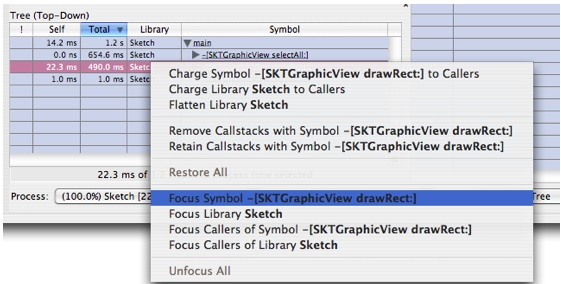

   In this tutorial we'll describe and demonstrate a few of them as well. A full description of these operations is given in [Callstack Data Mining](#apple-f4xwc4dqnrsv64tfmyxwi33df52wszbpkridimbqga2temztfvbuqnznknltenq).
5. Choose "Focus Symbol `-[SKTGraphicView drawRect:]`" and you will get something that looks like Figure 6-23

   __Figure 6-23__  After Focus Symbol -[SKTGraphicView drawRect:]

   ![After Focus Symbol -[SKTGraphic View drawRect:]](../Art/Figure1-16-After_Focus.jpg)![After Focus Symbol -[SKTGraphic View drawRect:]](../Art/Figure1-16-After_Focus.jpg)

   The bottom pane (Tree view) is now rooted on the symbol that we focused on and the items in the top pane (Heavy view) have changed to reflect only the leaf times relative to the execution tree under this new root. In the Heavy view, we see that the most time is spent in `-[SKTGraphic drawHandleAtPoint: inView]`. We'll come back to this in a bit.

   It is also worth noting that if you look in the _Advanced Settings_ drawer at the bottom of the data mining controls (you may need to scroll down the drawer if your document window is small), you will see an entry for the symbol you just focused in the list of symbols. You can change the focus behavior here at any time by clicking in the pop-up next to the symbol name.
6. Expand `-[SKTGraphicView drawRect:]` in the bottom outline a few times until it looks likes likeFigure 6-24:

   __Figure 6-24__  After focus and expansion

   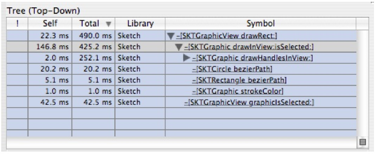

   There are two interesting things here:

   - The self time is pretty large in this function
   - A lot of time is spent in `-[SKTGraphic drawHandleAtPoint: inView]`

   Let's look at the self time first.
7. Double click on `-[SKTGraphic drawInView:isSelected]` to see the source, as shown in Figure 6-25:

   __Figure 6-25__  Source View: SKTGraphic drawInView:isSelected:

   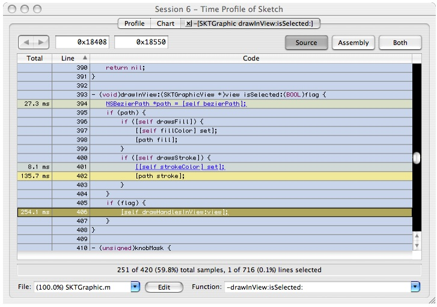

   Here we see that time is split pretty evenly between the AppKit graphics primitive `[path stroke]` and the call to `-[SKTGraphic drawHandleAtPoint: inView]`. The only option for a developer to deal with the AppKit graphics primitive is to consider using raw Quartz calls, an option that we'll look into using NSBezierPath a bit later. For now, let's take a look at `-[SKTGraphic drawHandleAtPoint:inView]`.
8. Double click on line 406 on the text `-[self drawHandlesInView: view]` and you'll get Figure 6-26:

   __Figure 6-26__  Source View: SKGraphic drawHandlesInView:

   ![-[SKGraphic drawHandlesAtPoint:inView]](../Art/Figure1-19-SKGraphic.jpg)![-[SKGraphic drawHandlesAtPoint:inView]](../Art/Figure1-19-SKGraphic.jpg)

   This continues on with other calls to `[self drawHandleAtPoint: inView]`, so it's been elided for brevity.
9. Double click on line 502 in the text `[self drawHandleAtPoint: ...]` and it will take you to the code for `[SKTGraphicview drawHandleAtPoint: ...]` which is shown in Figure 6-27

   __Figure 6-27__  Source View: SKGraphic drawHandleAtPoint:inView:

   ![-[SKGraphic drawHandleAtPoint:inView]](../Art/Figure1-20.jpg)![-[SKGraphic drawHandleAtPoint:inView]](../Art/Figure1-20.jpg)

   Here we see another call into an NS drawing primitive. At this point, if you are a developer, your only option is to investigate using other graphics primitives such as direct calls to Quartz. In this example we'll do some further analysis to show some techniques useful for analyzing larger apps and frameworks.

To dig deeper we will turn off “Charge System Libraries to Callers” and go through a more step-by-step analysis of what is involved in drawing the shapes for Sketch. This will be focus more on demonstrating various data mining operations and less on particular issues in the frameworks.

1. Go to the filter box in the advanced drawer and un-check the "Charge System Libraries to Callers" checkbox. Since we are still focused on `-[SKTGraphicView drawRect:]` we avoid seeing all the framework code that went brought us to that draw routine, and thereby avoid being overwhelmed with symbols. In the heavy view you will now find all sorts of system symbols, so we may need some help to make sense of these. A powerful tool for pruning useless symbols is “Filter Library.”
2. We're going to work with the “Heavy View” (the upper profile) for a bit. So click the and set it back to .
3. Select the first symbol in the upper profile, as shown in Figure 6-28.

   __Figure 6-28__  Heavy View of Focused Sketch

   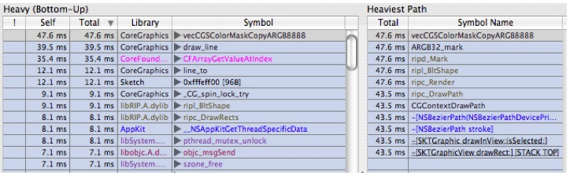

   Notice that the stack view on the right shows a backtrace leading up to our old friend `-[SKTGraphicView drawRect:]`.
4. In the callstack view on the right click on `-[SKTGraphicView drawRect:]` and you'll get Figure 6-29:

   __Figure 6-29__  Expanded Heavy View of Focused Sketch

   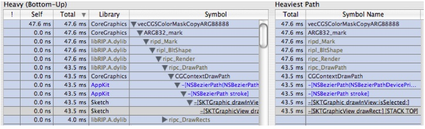

   Suppose we are interested in understanding the calls made into CoreGraphics. This is challenging because AppKit calls CoreGraphics, which calls libRIP.A.dylib, which then calls back into CoreGraphics. This is a lot of interdependency to sort out.

   Fortunately there is a way to hide this complexity and see just what we are interested in. We use what are called the exclusion commands. One of the most powerful ones is “Charge Library.” This command tells Shark to hide all functions in a particular library and charge the costs of those functions to the functions calling into that library. We'll show this in action in our example:
5. In the left hand outline select the symbol `ripd_mark` and control+click on it to bring up the data mining contextual menu. Choose "Charge Library __libRIP.A.dylib__" and you get Figure 6-30:

   __Figure 6-30__  After Charge Library libRIP.A.dylib

   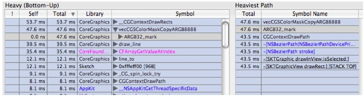

   Notice that the symbols for __libRIP.A.dylib__ are gone from the samples. Now this is a bit cleaner, but there are still multiple layers in CoreGraphics. Notice that we have `CGContextDrawPath` both in the caller chain to `vecCGSColorMaskCopyARGB8888` and as a leaf function. What we really want to see is how much time we're spending in `CGContextDrawPath`.

   This is most easily accomplished with “Flatten Library.” “Flatten Library” is similar to “Charge Library,” except that it leaves the first function (entry point) into the library intact. It in effect collapses the library down to just its entry points. There is a quick click button in the _Advanced Settings_ Drawer’s Data Mining Palette that lets you flatten all system libraries. This is a good quick shortcut for flattening all the system libraries, which greatly simplifies your trace in one shot.
6. Do a control+click on `vecCGSColorMaskCopyARGB8888` and choose "Flatten Library __CoreGraphics__" and you'll get Figure 6-31

   __Figure 6-31__  After Flatten Library

   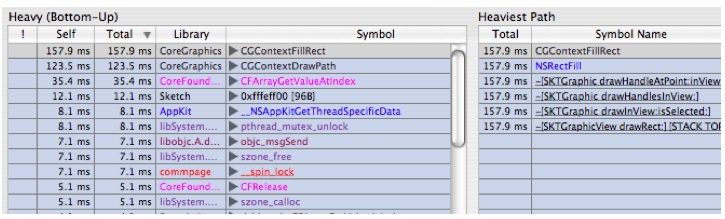

   Now this is getting interesting. Time spent has converged into `CGContextFillRect` and `CGContextDrawPath`. These two call trees represent the two different places we saw hot spots in our top down analysis. But now we have exposed more detail. The CoreGraphics team could now choose to use the “Focus on Symbol” commands to study either piece of the execution tree in detail.

This example is a bit simplistic, but it shows the power of the exclusion operations to strip out unnecessary information and identify where the real choke points are in the middle part of the execution tree. Please note that using the data mining operations does not change the underlying sample data that you've recorded. It just changes how the data is displayed, and so you can always remove all data mining choosing “Restore All” and “Unfocus All” from the Data Mining Menu at any time. As you master the use of these operations, you will learn how to identify the dynamic behavior of complex programs and frameworks faster than you ever thought possible.

The previous example demonstrated how to use various filtering/focusing data mining techniques to identify hot spots in your program. All of these also apply to sampling by malloc events (heap tracing), in addition to samples obtained by time profiling.

However, _graphical analysis_ is also a useful technique for examining the results Shark provides, when used in conjunction with the time based analysis described previously. This technique involves looking at the actual execution pattern using Shark’s _Chart_ view tab (see [Chart View](Time%20Profiling.md#apple-f4xwc4dqnrsv64tfmyxwi33df52wszbpkridimbqga2temztfvbuqmznknltemi)). While time analysis helps us prioritize which areas of complexity we wish to attack first, graphical analysis helps us identify the patterns of complexity within these regions in a way that just doesn't come through when looking at the “average” summaries seen in the profile browsers. While this concept applies to all configurations, it is particularly critical with the _Malloc Trace_ configuration (see [Malloc Trace](Other%20Profiling%20and%20Tracing%20Techniques.md#apple-f4xwc4dqnrsv64tfmyxwi33df52wszbpkridimbqga2temztfvbuqnrnknltcnq)), because analyzing the precise memory allocation/deallocation patterns, and determining which calls are causing these allocations and deallocations, is often more important than just looking at the averages seen with the browsers.

Please note an important distinction between malloc tracing and time profiling. With time profiling, you generally want choose a data set that will take an interestingly long amount of time so that you can get a good set of samples. In contrast, with exact tracing you generally want to scale back your operation size so that you do one operation on just a few items, in order to keep the number of trace elements manageable.

This example uses the same Sketch demo build environment as the previous one. Complete that one up to the end of [A Performance Problem...](#apple-f4xwc4dqnrsv64tfmyxwi33df52wszbpkridimbqga2temztfvbuqnznknltgni) if you have not already gone through it in order to follow along.

1. Switch to “Sketch” with your array of replicated shapes from [A Performance Problem...](#apple-f4xwc4dqnrsv64tfmyxwi33df52wszbpkridimbqga2temztfvbuqnznknltgni). Do a “Select All” to select all of the shapes before continuing.
2. Launch Shark (in `/Developer/Applications/Performance Tools/`).
3. Target your application and choose “Malloc Trace” instead of “Time Profile,” as with Figure 6-32.

   __Figure 6-32__  Malloc Trace Main Window

   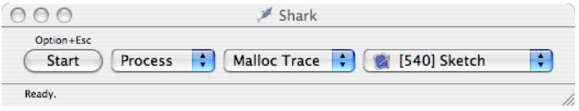
4. Switch back to Sketch.
5. Move the Sketch window to expose the Shark window (optional but makes things easier).
6. Make sure everything is selected.
7. Press _Option+Escape_ to start sampling.
8. Choose _Edit→Copy_ and wait for the menu bar highlight to go away.
9. Press _Option+Escape_ to stop Sampling.
10. Hit _Command-1_ to switch the weighting to by count (or do it via the Weighting popup in the _Advanced Settings_ drawer).

The window should look like Figure 6-33, if you have gone through Tutorial 1 first. Otherwise, it will look similar but not exactly the same.

__Figure 6-33__  Result of Malloc Sampling

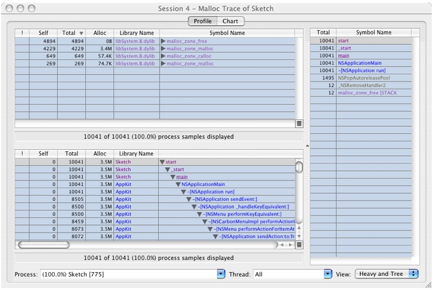

1. Click on the _Chart_ Tab and you'll get a window that looks like Figure 6-34.

   __Figure 6-34__  Chart View

   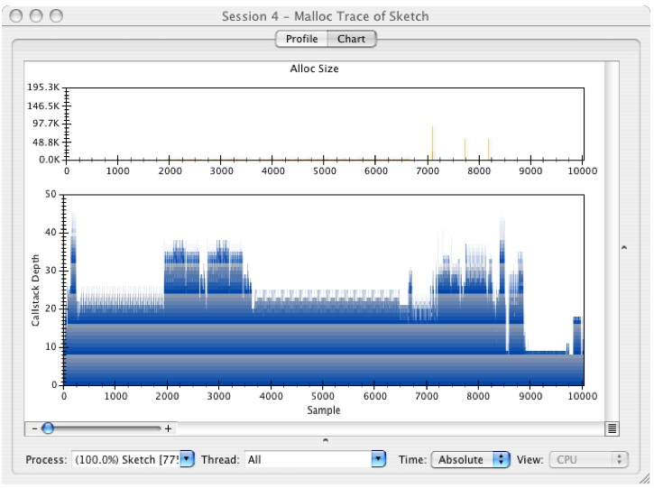

   The lower graph a standard plot of the callstacks, with sample number on the X axis and stack depth on the Y axis, while the upper graph is a plot of the size of each allocated block plotted against the sample number.

   This plot is useful for identifying repeated execution paths in your code due to the fact that execution trees leave a form of “fingerprint” that is often quite readily visible. Basically, if you see similar patterns in the graph, it is a strong indication that you are going through the same code path. It may be acting on different data each time, but these repeated patterns often represent good opportunities for improving performance. Often, you can hoist some computation outside of the innermost loop in each nesting and make the actual work done in the loop smaller while performing the same actual work. This kind of change would show up in the graph by reducing the size and the complexity of the repeated structure.

   Let's show an example of a repeated structure.
2. Select the first hump just before sample 6,000 and enlarge it, as shown in Figure 6-35:

   __Figure 6-35__  Place to Select

   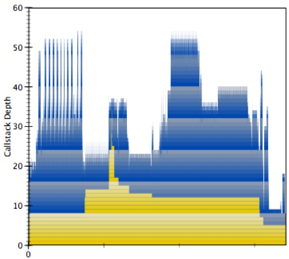

   The yellow indicates the tenure of different stack frames. Stack frame 0 is main and it is active the entire time. As you get deeper into the stack the tenures get narrower and narrower. Tall skinny spikes of yellow indicate deep chains of calls that do little work and this should be avoided.
3. Now use the slider on the bottom left of the window to adjust zoom. Play with this a bit. As you zoom in and out you'll see that there are multiple levels of unfolding complexity — much like a fractal. Here is a sequence of zooms that show complexity at different levels:

   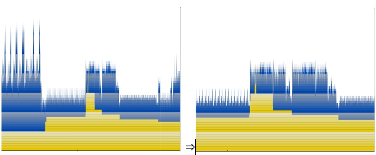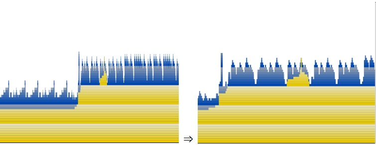

   It is a good idea to explore around your execution trace and identify every range of repeated structure and understand what it is doing in each case. The reason this has a fractal like quality is that Mac OS X’s library calls have many layers of libraries that encapsulate one another. Each of these layers can introduce levels of iteration that is nested inside of other layers. This is like the problem with the nested iteration that we showed in [Analysis Via Source Navigation](#apple-f4xwc4dqnrsv64tfmyxwi33df52wszbpkridimbqga2temztfvbuqnznknltima), but on a system wide scale. In order to drastically improve performance you must attack this problem of complexity creep and eliminate it as much as possible. Application developers obviously can't fix framework issues, but they can strive to eliminate similar complexity issues in their libraries.
4. We'll finish up with another good application of this graphical analysis. Click on the call stack  button to reveal the call stack for this sample, as shown in Figure 6-36:

   __Figure 6-36__  Graph View with Call-Stack Pane

   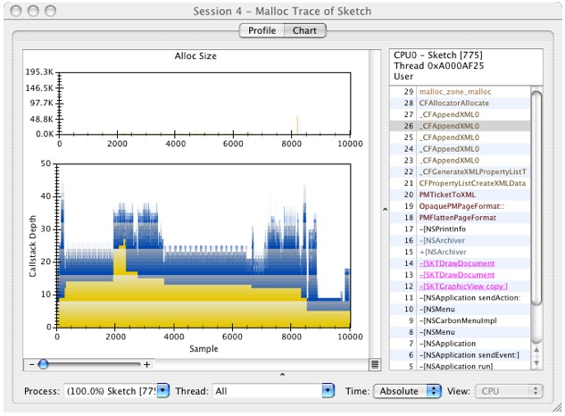

   Using the callstack view, notice that a bunch of XML parsing to build up some kind of _NSPrintInfo_ is occurring. This is surprising since all we did was a clipboard copy. In fact, all of the malloc events from about 5,000 to 15,000 are involved with manipulating printer stuff. It turns out that this is due to Sketch actually exporting a full PDF onto the clipboard rather than using a “promise” that it has material to put there if the user actually switches applications and then performs a “paste” operation — the uncommon case, generally. This is a great example of how doing something fairly innocuous at the application level can cause the system libraries to do a lot of extra work. It is also a great example of a cross-library problem that needs to be optimized on multiple levels, ranging from the application to the printing framework to the XML parsing code.)

[Next](Custom%20Configurations.md)[Previous](Advanced%20Profiling%20Control.md)

