> 导航：[总目录](../../../README.md) · [documentation](../../../_indexes/documentation.md) · [Shark User Guide](Introduction.md)

[Next](Hardware%20Counter%20Configuration.md)[Previous](Advanced%20Session%20Management%20and%20Data%20Mining.md)

# Custom Configurations

Up until now, you have been using the configuration menu in Shark’s main window (in Figure 7-1) to select from various built-in sampling methods. Each of these sampling methods is called a _configuration_ (abbreviated as “configs"), and Shark saves each configuration as a separate configuration file (which is also often called a “config”). Each config file describes a variety of settings for Shark which enable it to sample or profile your application in a particular way, plus a summary of any hardware requirements that are necessary to use it.

__Figure 7-1__  Main Configuration Menu

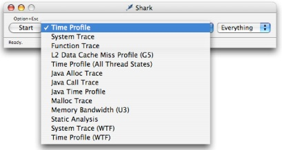

Once you have gained some experience with Shark, you might want to change some of the settings or adjust some of the types of data Shark collects when a particular config is active. For example, you might adjust the default sample rate of the Time Profiling config to sample more often, if your examinations routinely need higher sampling resolution. This chapter gives an overview as to how this can be accomplished using Shark’s sophisticated _Configuration Editor_.

The _Configuration Editor_ lets you individually modify settings for any of Shark’s modules, which are called _PlugIns_. The properties available in each PlugIn differ depending on the nature of the work that particular PlugIn is designed to do. Shark uses three types of PlugIns:

- __Data Source__ – These are responsible for collecting and/or generating session data. Many user-modifiable parameters are typically available to control the sampling or profiling performed by these modules.
- __Analysis__ – These process raw data and produce intermediate results that are typically shared by more than one viewer. Only a few settings are available for these modules.
- __Viewer__ – These display analysis results and performance data. Because users typically want immediate feedback to viewer adjustments, options for these are set by interacting directly with the visible display or through the _Advanced Settings Drawer_ (see [Advanced Settings Drawer](Getting%20Started%20with%20Shark.md#apple-f4xwc4dqnrsv64tfmyxwi33df52wszbpkridimbqga2temztfvbuqmrnknlts)) attached to each analysis window, instead of here in the Configuration Editor.

Once you have decided that the built-in configs are not sufficient for the work that you are doing, the first step to creating or editing your own configurations is to start the _Configuration Editor_ using one of two techniques:

- Select the _Config→New..._ (_Command-N_) command to start a new config from scratch.
- Select _Config→Edit..._ (_Command-Option-Shift-C_) to modify the current config.

Either technique will bring up the _Configuration Editor_ dialog box, which allows you to examine and modify any part of a configuration. Adding Shortcut Equations points out the four main major parts of this editor:

1. __The Config Listing__ — This contains an entry for every configuration Shark knows about. This includes documents stored in `/System/Library/Application Support/Shark/Configs` folder, and any custom config documents stored in `$USER/Library/Application Support/Shark/Configs` in your home folder. Some config file names may be dimmed in the list. This means they are not compatible with the system Shark is currently running on, and therefore cannot be enabled for sampling or profiling, but you can still select and modify them here in the Configuration Editor. The rest of the Configuration Editor controls always modify the selected entry in this list.

   Next to the main listing, various controls support basic file operations to manage these config files:

   - You can _Duplicate_ any config in the list. This is usually the best way to begin making a custom config. In fact, selecting “New...“ from the Config Menu just makes a duplicate of the current config in order to provide a starting baseline.
   - You can _Delete_ any custom config in the list, but not built-in config files. A verification message will appear when you click the Delete button. A deleted config will be erased from the appropriate Configs folder when you finally press the OK button.
   - You can _Rename_ any custom config in the list, but not built-in config files. A renamed config will be changed in the appropriate Configs folder immediately.
   - You can _Import_ any config that you may have saved on your system or a mounted fileserver. Imported configs are copied to your home `$USER/Library/Application Support/Shark/Configs` folder. You can also perform this function without invoking the Configuration Editor by using the _Config→Import..._ menu command.
   - You can _Export_ any listed config to an arbitrary file on your system or a fileserver. This is a great way to share configs between computers or user accounts. You can also perform this function without invoking the Configuration Editor by using the _Config→Export..._ menu command.
2. __The Summary__ — Explains the details of the selected config and all the PlugIn settings that will be used to collect data.
3. __The PlugIn List__ — Each PlugIn type in the configuration may optionally provide an editor for its properties in the configuration. You can select the PlugIn to edit by clicking on the desired PlugIn name here. You can also enable or disable PlugIns using the checkboxes.

   The order of the plugins has a different meaning depending upon on the type of plugin. For data source plugins, the vertical order of the enabled plugins indicates the order in which data sources will be started and stopped. Analysis plugin order indicates the order of their creation, and viewer plugin order determines the order of viewer tabs in the resulting Shark session window. The position of a plugin can be changed using the _Up_ and _Down_ arrow buttons to the lower left of the _PlugIn List_.
4. __The PlugIn Property Editor__ — This displays user-tunable options, if any, for the PlugIn currently selected in the _PlugIn List_. Some PlugIns have no or only a few controls, while other PlugIns (such as the “Timed Samples & Counters” Data Source plugin) have many properties, and require multiple tabbed window panes to organize all the various settings available.
5. __The Property View Pop-up__: Each plugin’s property editor can optionally support two modes of operation: _Simple_ (the default) and _Advanced_. This menu allows you to select between them, if they are both present. In addition, this control modifies the _PlugIn List_ as follows:

   - In _Simple_ mode, only plugins enabled by the currently selected config that have property editors are listed.
   - In _Advanced_ mode, all of the available plugins are listed with a checkbox next to each indicating whether or not it is enabled in the current config.

__Figure 7-2__  Config Editor

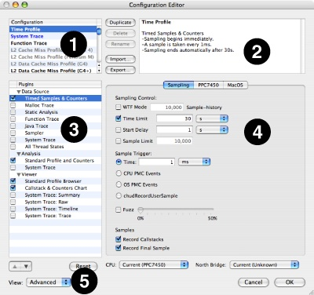

The remainder of this chapter describes Shark’s wide variety of PlugIn editors that are controllable through the _Configuration Editor_. In addition, because it is very complex, the “Advanced” mode of the “Timed Samples and Counters” config editor is described in [Hardware Counter Configuration](Hardware%20Counter%20Configuration.md#apple-f4xwc4dqnrsv64tfmyxwi33df52wszbpkridimbqga2temztfvbuqmjqfvjvomi).

The Timed Samples and Counters data source is used for collecting system-wide time and performance count profiles. This is used for several default configurations, including the Time Profiling one described in [Time Profiling](Time%20Profiling.md#apple-f4xwc4dqnrsv64tfmyxwi33df52wszbpkridimbqga2temztfvbuqmznknltc). In _Simple_ mode, there are two types of settings that can be modified in the editor:

- __Sampling Tab__ – The controls on this tab (see Figure 7-3) determine when to start and stop recording samples.

  1. __Windowed Time Facility__— If enabled, Shark will collect samples until you explicitly stop it. However, it will only store the last N samples, where N is the number entered into the sample history field (10,000 by default). This mode is also described in [Windowed Time Facility (WTF)](Advanced%20Profiling%20Control.md#apple-f4xwc4dqnrsv64tfmyxwi33df52wszbpkridimbqga2temztfvbuqmjtfvjvomi).
  2. __Start Delay__— Amount of time to wait after the user selects “Start” before data collection actually begins. This helps prevent Shark from sampling itself.
  3. __Time Limit__— The maximum amount of time to record samples. This is ignored if WTF mode is enabled.
  4. __Sample Interval__— Determines the sampling rate. The interval can be a time period (1 ms default), CPU performance event count, or OS performance event count . If no performance counters (CPU or OS) are configured as triggers, the sample interval is assumed to be a time interval, and hence only the time entry field is enabled.

  __Figure 7-3__  Simple Timed Samples and Counters Data Source - Sampling Tab

  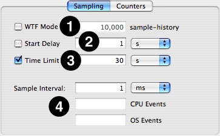
- __Counters Tab__— This tab (see Figure 7-4) presents a fast and simple way to search and configure the _Processor_ (CPU), _Operating System_ (OS), and _Northbridge_ (MEM) performance counters. Enter an event keyword or partial description in the search field to see a list of matching counter events. Use the _Mode_ column to select the performance counter mode (__None__, __Counter__, or __Trigger__). Only a small subset of possible counter options are available here. For more, you will have to use the Advanced settings, described in [Hardware Counter Configuration](Hardware%20Counter%20Configuration.md#apple-f4xwc4dqnrsv64tfmyxwi33df52wszbpkridimbqga2temztfvbuqmjqfvjvomi).

  __Figure 7-4__  Simple Timed Samples and Counters Data Source - Counter Settings

  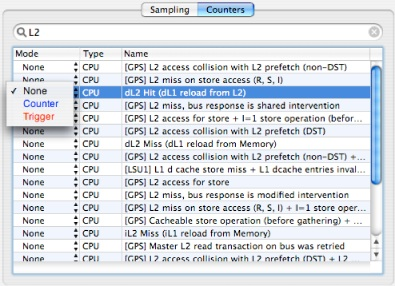

The Malloc data source is used for the Malloc Trace config described in [Malloc Trace](Other%20Profiling%20and%20Tracing%20Techniques.md#apple-f4xwc4dqnrsv64tfmyxwi33df52wszbpkridimbqga2temztfvbuqnrnknltcnq). It is used for collecting a memory allocation profile from a particular executable. All of its configurable controls are contained in a single tab (see Figure 7-5), which modifies the timing of starting and stopping of memory allocation recording behavior:

__Figure 7-5__  Malloc Data Source - Sampling Settings

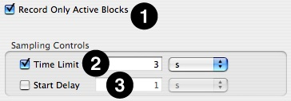

1. __Record Only Active Blocks__— If enabled, Shark will collect samples only in memory regions that were allocated during a profile and not released. Otherwise, any allocation or deallocation that takes place is recorded.
2. __Time Limit__— The maximum amount of time to record samples.
3. __Start Delay__— Amount of time to wait after the user selects “Start” before data collection actually begins.

The Static Analysis data source is used by the Static Analysis default configuration, described in [Static Analysis](Other%20Profiling%20and%20Tracing%20Techniques.md#apple-f4xwc4dqnrsv64tfmyxwi33df52wszbpkridimbqga2temztfvbuqnrnknltcoi). It is used to search for potential performance issues by looking for problems that might crop up through some other (as yet untested) code path. All of its configurable controls are contained in a single tab (see Figure 7-6), which modifies the type and severity of potential problems that can be identified using the mechanism:

__Figure 7-6__  Static Analysis Data Source - Settings

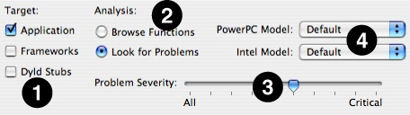

1. __Target Selection__— These options allow you to narrow down the area of memory examined by Shark.

   - _Application_— Looks for potential performance issues in the main text segment of the target process
   - _Frameworks_— Looks for potential performance issues in the frameworks that are dynamically loaded by the target
     process.
   - _Dyld Stubs_— Looks for any potential performance or behavior anomalies in the glue code inserted into the binary by the link phase of application building.
2. __Analysis Options__— These allow you to enable or disable analysis.

   - _Browse Functions_— Gives each function in the text image of a process a reference count of one. This allows you to browse all of the functions of a given process with Shark’s code browser. No analysis (or problem weighting) is performed.
   - _Look For Problems_ — search all functions in the text image of a process for problems of at least the level of severity specified by the Problem Severity slider. Any address with a problem instruction or code is given a reference count equivalent to its severity.
3. __Problem Severity Slider__— This slider acts as a filter, adjusting the minimum “importance” of problems to report using a predefined problem weighting built into Shark. The further to the right the slider, the less output is generated, as more and more potential problems are ignored because their “importance” is not high enough.
4. __Processor Settings__— Shark needs to know which model of processor is your target before it can examine code and find potential problems. Separate menus are provided for PowerPC and Intel processors because it can analyze for one model of each processor family simultaneously.

   - _PowerPC Model_— Selects the PowerPC model to use when searching for and assigning problem severities .
   - _Intel Model_— Selects the Intel model to use when searching for and assigning problem severities .

The Java Trace data source supports three types of Java tracing: _Time_, _Alloc_, and _Method_. All of these have default configurations described in [Java Tracing Techniques](Other%20Profiling%20and%20Tracing%20Techniques.md#apple-f4xwc4dqnrsv64tfmyxwi33df52wszbpkridimbqga2temztfvbuqnrnknltemq). These types of tracing only work on a single Java process at a time, as there is no systemwide Java tracing. The controls on the tab (see Figure 7-7) determine what type of Java Tracing to perform, and the time between samples for a Java Time Trace.

__Figure 7-7__  Java Trace Data Source - Sampling Settings

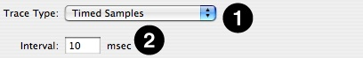

1. __Trace Type PopUp Menu__— Chooses one of the four types of Java tracing available:

   - _Timed Samples_— Selects the Java _Time Trace_ mode. This is similar to a regular Time Profile. It periodically stops the Java process and takes samples of the running threads.
   - _Memory Allocations_— Selects the Java _Alloc Trace_ mode. Memory allocations and the sizes of the objects allocated are recorded.
   - _Method Trace_— This type of Java tracing is still under development, and should not be used yet.
   - _Call Trace_— Selects the Java _Call Trace_ mode. This records each entry into every method during the execution of your program. Hence, this is an exact trace of the methods called (within the limitations of the Java VM).
2. __Interval field__— Enter the time between samples here, for the _Timed Samples_ mode.

The Sampler data source provides the same functionality as the separate _Sampler_ application and command-line tool. It is not used for any of the default configurations provided with Shark, as most of its functionality has been superseded by features of the much more sophisticated “Timed Samples and Counters” PlugIn. All configurable features can be modified on a single tab (see Figure 7-8), which adjusts basic timing parameters:

__Figure 7-8__  Sampler Data Source - Settings

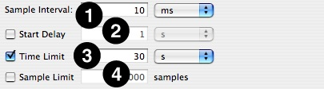

1. __Sample Interval__— Determines the sampling rate. The interval is a time period (10 ms default).
2. __Start Delay__— Amount of time to wait after the user selects “Start” before data collection actually begins.
3. __Time Limit__— The maximum amount of time to record samples.
4. __Sample Limit__ — The maximum number of samples to record. Specifying a maximum of _N_ samples will result in at most _N_ samples being taken, even on a multi-processor system, so this should be scaled up as larger systems are sampled.

This data source collects data for the _System Trace_ default configuration, described in [System Tracing](System%20Tracing.md#apple-f4xwc4dqnrsv64tfmyxwi33df52wszbpkridimbqga2temztfvbuqnbnknltcmq). All configurable features can be modified on a single tab (see Figure 7-9), which adjusts basic timing parameters:

__Figure 7-9__  System Trace Data Source - Settings

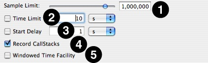

1. __Sample Limit__ — The maximum number of samples to record. Specifying a maximum of _N_ samples will result in at most _N_ samples being taken, even on a multi-processor system, so this should be scaled up as larger systems are sampled. On the other hand, you may need to reduce the sample limit if Shark runs out of memory when you attempt to start a system trace, because it must be able to allocate a buffer in RAM large enough to hold this number of samples. When the sample limit is reached, data collection automatically stops, unless the _Windowed Time Facility_ is enabled (see below). The Sample Limit is always enforced, and cannot be disabled.
2. __Time Limit__— The maximum amount of time to record samples. This is ignored if _Windowed Time Facility_ is enabled, or if Sample Limit is reached before the time limit expires.
3. __Start Delay__— Amount of time to wait after the user selects “Start” before data collection actually begins.
4. __Record Callstacks__— When enabled, Shark will collect the function backtrace along with the program counter value for each sample. This should normally be enabled, but can be disabled if you need to record longer traces with a limited amount of memory or if the performance impact of recording the callstacks is too high.
5. __Windowed Time Facility__— If enabled, Shark will collect samples until you explicitly stop it. However, it will only store the last N samples, where N is the number entered into the Sample Limit field. This mode is also described in [Windowed Time Facility (WTF)](Advanced%20Profiling%20Control.md#apple-f4xwc4dqnrsv64tfmyxwi33df52wszbpkridimbqga2temztfvbuqmjtfvjvomi).

This data source collects data for the _Time Profile (All Thread States)_ default configuration, described in [Time Profile (All Thread States)](Other%20Profiling%20and%20Tracing%20Techniques.md#apple-f4xwc4dqnrsv64tfmyxwi33df52wszbpkridimbqga2temztfvbuqnrnknltcoa), which samples the callstacks of all threads on the system simultaneously, whether they are running or blocked. All configurable features can be modified on a single tab (see Figure 7-10), which adjusts basic timing parameters:

__Figure 7-10__  All Thread States Data Source - Settings

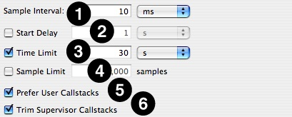

1. __Sample Interval__— Determine the trigger for taking a sample. The interval is a time period (10 ms default).
2. __Start Delay__— Amount of time to wait after the user selects “Start” before data collection actually begins.
3. __Time Limit__— The maximum amount of time to record samples. This is ignored if Sample Limit is enabled and reached before the time limit expires.
4. __Sample Limit__ — The maximum number of samples to record. Specifying a maximum of _N_ samples will result in at most _N_ samples being taken, even on a multi-processor system, so this should be scaled up as larger systems are sampled. When the sample limit is reached, data collection automatically stops. This is ignored if the _Time Limit_  is enabled and expires first.
5. __Prefer User Callstacks__— When enabled, Shark will ignore and discard any samples from threads running exclusively in the kernel. This can eliminate spurious samples from places such as idle threads and interrupt handlers, if your program is not affected by these.
6. __Trim Supervisor Callstacks__— When enabled, Shark will automatically trim the recorded callstacks for threads calling into the kernel down to the kernel entry points, and discarding the parts of the stack from within the kernel itself. These shortened stacks are usually sufficient, since most performance problems in your programs can be debugged without knowing about how the kernel is running internally. You just need to know how and when your code is blocking, and not how Mac OS X is actually processing the blocking operation itself.

All Data Source PlugIns include configuration editors. However, most of the analysis and viewer editors do not. While you generally will not need to spend much time worrying about these plugins during the configuration process, you will still need to enable or disable the correct PlugIns in your configuration in order to be able to see your results in the way you expect. The lists in this section give you an overview of when to enable or disable various PlugIns.

There are only a few analysis PlugIns. They just need to be matched to the data source and viewer PlugIns used before and after them, since they connect these PlugIns together:

- __Standard Profile and Counters__— This should be enabled for all configurations except ones that use “System Trace” or “Timed Samples and Counters” configurations that only use the “Counter Spreadsheet” viewer.
- __Counter Spreadsheet__— This can only be used with the “Timed Samples and Counters” data source and the matching “Counter Spreadsheet” viewer. Unlike the rest of the analysis and viewer PlugIns, it actually has an editor for configuring a preset list of “shortcut equations.” See [Counter Spreadsheet Analysis PlugIn Editor](#apple-f4xwc4dqnrsv64tfmyxwi33df52wszbpkridimbqga2temztfvbuqobnknltcoa), below, for details.
- __System Trace__— This can only be used with the “System Trace” data source and any of the four “System Trace” viewers.

There are several viewer PlugIns. When these are enabled, the matching tabs will appear across the top of any session windows made with these configurations, in the order that the configurations are listed in the _Configuration Editor_. Like the analysis PlugIns, you can only enable these usefully when other PlugIns are also enabled, as we note below.

- __Standard Profile Browser__— This is the standard tabular browser view of symbols and sample counts used by most configurations, as is described in [Profile Browser](Time%20Profiling.md#apple-f4xwc4dqnrsv64tfmyxwi33df52wszbpkridimbqga2temztfvbuqmznknltcoi). To use it, you need to enable the “Standard Profile and Counters” analysis PlugIn.
- __Callstack & Counters Chart__— This is the the _Chart View_ used by many configurations to graphically display the callstacks of samples over time, as is described in [Chart View](Time%20Profiling.md#apple-f4xwc4dqnrsv64tfmyxwi33df52wszbpkridimbqga2temztfvbuqmznknltemi). To use it, you need to enable the “Standard Profile and Counters” analysis PlugIn.
- __Counter Spreadsheet__— This presents the counter spreadsheet view described in [Timed Counters: The Performance Counter Spreadsheet](Other%20Profiling%20and%20Tracing%20Techniques.md#apple-f4xwc4dqnrsv64tfmyxwi33df52wszbpkridimbqga2temztfvbuqnrnknlto). To use it, you must have the “Timed Samples and Counters” data source enabled and the “Counter Spreadsheet” analysis PlugIn enabled.
- __System Trace: Summary__— This can only be used with the “System Trace” data source and analysis PlugIns. It displays the Summary tab used by System Trace and described in [Summary View In-depth](System%20Tracing.md#apple-f4xwc4dqnrsv64tfmyxwi33df52wszbpkridimbqga2temztfvbuqnbnknltgmi).
- __System Trace: Trace__— This can only be used with the “System Trace” data source and analysis PlugIns. It displays the Trace tab used by System Trace and described in [Trace View In-depth](System%20Tracing.md#apple-f4xwc4dqnrsv64tfmyxwi33df52wszbpkridimbqga2temztfvbuqnbnknltcmi).
- __System Trace: Timeline__— This can only be used with the “System Trace” data source and analysis PlugIns. It displays the Timeline tab used by System Trace and described in [Timeline View In-depth](System%20Tracing.md#apple-f4xwc4dqnrsv64tfmyxwi33df52wszbpkridimbqga2temztfvbuqnbnknlti).
- __System Trace: Raw__— This can only be used with the “System Trace” data source and analysis PlugIns. It displays raw and unprocessed samples recorded by System Trace, and is normally not used by end users.

When PMCs are active during sampling, this analysis plugin can be enabled. The controls on this editor allow you to create new results equations called _shortcuts_. The shortcuts will show up in the counter spreadsheet as extra columns of data that you can plot in the counter spreadsheet’s chart view. With these shortcuts, you can effectively create new types of results data that use the event counts from the sampling to derive new information about the way the event counts may relate to each other, without forcing you to first export the data into another application, such as a spreadsheet. These derivative results can then be viewed just as if they were any other bit of “raw” counter data sampled by Shark.

When using the editor, you will first be presented with the view shown in Figure 7-11:

__Figure 7-11__  Counter Spreadsheet Analysis

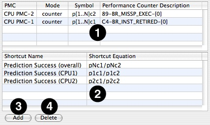

This view contains the following constituent parts:

1. __PMC Sumary Table__ – This table summarizes all the performance counters (PMCs) that are currently selected and enabled in the Timed Samples and Counters data source.

   - _PMC column_— This is a short description of the counter and the device in which this performance monitor counter is found.
   - _Mode column_— The counter’s current mode. This is typically _counter_, because _unused_ and _trigger_ PMCs are filtered out and not listed in this table.
   - _Symbol column_— This display’s the counter’s _term_. This is the algebraic symbol that represents the counter in the shortcut equations .
   - _PMC Description column_— The name of the event type currently being counted by the selected PMC, which is also used as the header for the results column for this PMC in the Counter Spreadsheet.
2. __Shortcut Equation Table__ – This table will list any equations that you have defined to generate extra results in the counter spreadsheet viewer. You can edit the names of the shortcut equations in the left column, and their formulas in the right.
3. __Add Button__ – Creates a new shortcut equation.
4. __Delete Button__– Erases the existing shortcut equation that you are currently editing.

If you decide that you would like to combine the existing counter results into a new, derivative result, then simply click the _Add_ button. A new line will be added to the _Shortcut Equation Table_, where you can type a name in the left column and the equation itself in the right. The name can be whatever you like, but the equation must follow a proscribed format consisting of input terms (using the notation in the table below) combined together using basic four-function math symbols (+ for addition, - for subtraction, \* for multiplication, and / for division) and using parenthesis to order the operations, if necessary. You may also include numeric constants at any point in an equation. These are most often used when you need to convert between different types of units.

Once created, each shortcut equation is applied to each row of results (i.e. on a per-sample basis). Shark adds a new column titled with the shortcut name to its “spreadsheet” of counter results in order to hold the newly calculated values.

| Shortcut Equation Terms | Description |
| --- | --- |
| __pXcY__ | Represents __p__rocessor-_X_, __c__ounter-_Y_. For example: `p2c1` is the term that represents counter #1 on processor #2.  _X_ = CPU number, numbered 1, 2, 3, ...  _Y_ = PMC number, numbered 1, 2, 3, ... |
| __pNcY__ | Represents a summation of results from all processors on __c__ounter-_Y_. For example: `pNc1` is the term that represents event count samples for every active processor’s counter #1, all added together. You could get the same effect with an equation of your own like `(p1c1+p2c1+p3c1+p4c1)`, but this would only work correctly on a four processor system. On a two processor system, it would fail, since processors 3 and 4 do not exist, while on an eight processor system it would get incorrect results because it would miss results from processors 5–8.  _Y_ = PMC number, numbered 1, 2, 3, ... |
| __mXcY__ | Represents __m__emory Controller-_X_, __c__ounter-_Y_. For example: `m1c1` is the term that represents counter #1 on memory controller #1.  _X_ = Memory controller number, numbered 1, 2, 3, ... (At present, there are no Macs with more than one memory controller.)  _Y_ = PMC number, numbered 1, 2, 3, ... |
| __oXcY__ | Represents __o__perating System-_X_, __c__ounter-Y. For example: `o1c1` is the term that represents counter #1 in operating system image #1.  _X_ = OS image number, numbered 1, 2, 3, ... (At present, there are no Macs with multiple operating system images.)  _Y_ = PMC number, numbered 1, 2, 3, ... |
| __aXcY__ | Represents __a__pple Processor Interface-_X_, __c__ounter-Y. For example: `a1c1` is the term that represents counter #1 in API #1.  _X_ = Apple Processor Interface (API) number, numbered 1, 2, 3, ... (At present, there are no Macs with multiple APIs.)  _Y_ = PMC number, numbered 1, 2, 3, ... |
| __tbX__ | Represents __t__imebase Register in core _X_. For example: `tb1` is the term that represents the timebase register in core #1.  _X_ = Core to take the timebase from, numbered 1, 2, 3, ... |
| __eqX__ | Represents __e__quation-_X_ . For example: `eq01` is the term that represents the result already calculated by the first shortcut equation in the results table. In this way, new equations can be built using results already calculated. |

Because this editor is very flexible and powerful, an example can be helpful to illustrate how it might be used. Starting with a predefined config, we will add some performance counter events, and activate the _Performance Counter Spreadsheet_ plugins. Last, we will add some shortcut equations to the analysis.

Select the configuration named “Processor Bandwidth (Intel Core 2)” (Figure 7-12).

__Figure 7-12__  Choosing a counter-based starting configuration

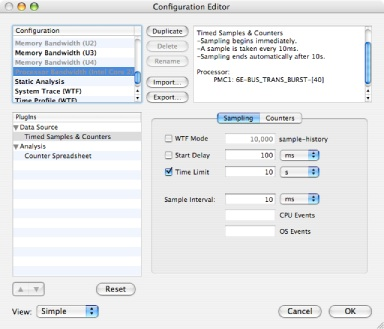

Click the _Duplicate button_. Change the name of the new configuration to be “Core CPI (Intel Core 2).”

Make sure that “Simple” is selected in the _View popup_. Now click the _Counters_ tab in the _Config Editor_ window. Add the following two performance counter events to the profile config:

1. Find the entry in the performance counter event list that reads “CPU_CLK_UNHALTED.CORE.” Select “Counter” in the _Mode column_. The event name will change color (blue) to indicate that the selected event is to be used as a counter.
2. Next search the list by typing “INST” into the search field, as is shown in Figure 7-13. Select the “INST_RETIRED” entry and change the mode to “Counter” as with the first event.

   __Figure 7-13__  Enabling two performance counters

   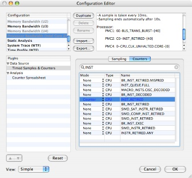

Click on the _Counter Spreadsheet_ line in the list of PlugIns to see the _Performance Counter Spreadsheet_. You will see the editor described previously in [Using the Editor](#apple-f4xwc4dqnrsv64tfmyxwi33df52wszbpkridimbqga2temztfvbuqobnknltcna). To add a new equation to the Shortcut Equation table click the _Add button_. Enter a shortcut name (e.g. “CPI” – this equation will compute the average number of CPU cycles per instruction for each sample).

Next, enter the equation `pNc3/pNc2`, as is shown in Figure 7-14. This will automatically calculate the number of cycles per completed instruction, or CPI, and allow you to display it alongside the “raw” counts of CPU cycles, instructions completed, and the bus bandwidths already calculated by the original “Processor Bandwidth” configuration.

__Figure 7-14__  Performance Spreadsheet: Shortcut Equation

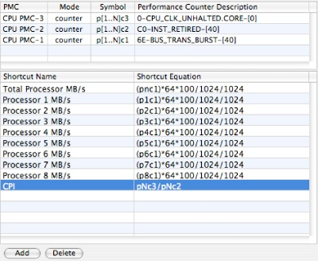

[Next](Hardware%20Counter%20Configuration.md)[Previous](Advanced%20Session%20Management%20and%20Data%20Mining.md)

