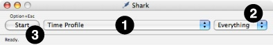
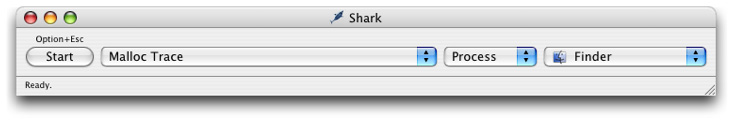
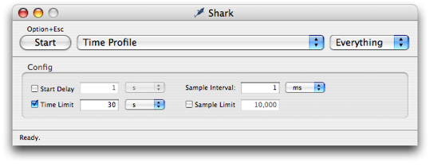
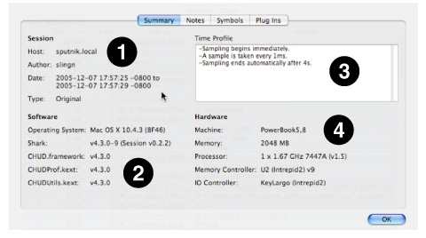
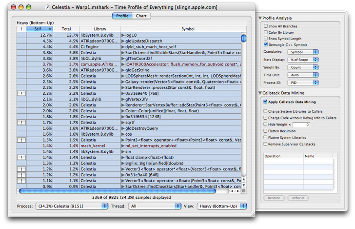
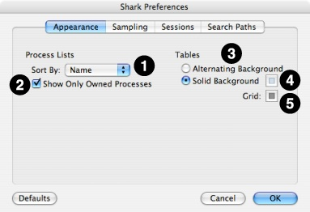
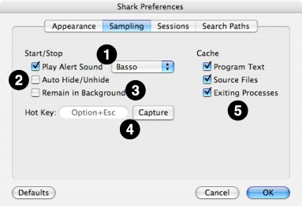
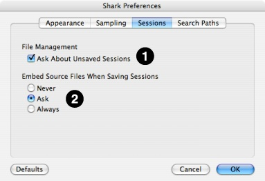
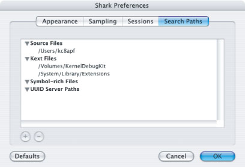

> 导航：[总目录](../../../README.md) · [documentation](../../../_indexes/documentation.md) · [Shark User Guide](Introduction.md)

[Next](Time%20Profiling.md)[Previous](Introduction.md)

# Getting Started with Shark

Starting to use Shark is a relatively simple process. You only need to choose one or two items from menus and press a big “Start” button in order to start sampling your applications. This chapter describes these basic steps and a few other general Shark features, such as its preferences.

__Figure 1-1__  Main Window

After launching Shark, you will be presented with Shark’s main window, as illustrated in Figure 1-1. The default sampling configuration is timer-based sampling (_Time Profile_) of everything running on the system. By default, the _Time Profile_ configuration uses a 1 ms timer as the trigger for sampling and will record for 30 seconds (30,000 samples per processor). Opening the _Sampling Configuration_ menu (#1) allows you to select from various built-in profiling configurations. Here is a list:

- __Time Profile__— This configuration, the default, performs timer-based sampling, interrupting your system after a regular interval and taking a sample of what is executing. It is a great starting point, as it allows you to very quickly see what code in your application is actually executing most frequently. Knowing this is the first step to successfully optimizing CPU-bound applications. See [Time Profiling](Time%20Profiling.md#apple-f4xwc4dqnrsv64tfmyxwi33df52wszbpkridimbqga2temztfvbuqmznknltc) for more information.
- __System Trace__— This configuration records an exact trace of calls into the Mac OS X kernel by your program, and which threads are running. It is useful for examining your program’s interactions with Mac OS X and for visualizing how your threads are interacting in multithreaded programs. System Trace is discussed in depth in [System Tracing](System%20Tracing.md#apple-f4xwc4dqnrsv64tfmyxwi33df52wszbpkridimbqga2temztfvbuqnbnknltcmq).
- __Time Profile (All Thread States)__— This variation on time profiling also records the state of all blocked, inactive threads. As a result, it’s a great way to see how much and why your threads are blocked. This is quite helpful in the development of multithreaded programs that do a lot of synchronization. This configuration is described in [Time Profile (All Thread States)](Other%20Profiling%20and%20Tracing%20Techniques.md#apple-f4xwc4dqnrsv64tfmyxwi33df52wszbpkridimbqga2temztfvbuqnrnknltcoa).
- __Malloc Trace__— If your program allocates and deallocates a lot of memory, performance can suffer and the odds of accidental memory leaks increase. Shark can help you find and analyze these allocations. [Malloc Trace](Other%20Profiling%20and%20Tracing%20Techniques.md#apple-f4xwc4dqnrsv64tfmyxwi33df52wszbpkridimbqga2temztfvbuqnrnknltcnq) talks about this more.
- __Static Analysis__— Shark can provide some basic optimization hints without actually running code. See [Static Analysis](Other%20Profiling%20and%20Tracing%20Techniques.md#apple-f4xwc4dqnrsv64tfmyxwi33df52wszbpkridimbqga2temztfvbuqnrnknltcoi) for more information.
- __Java Profiling__— Because Java programs run within the Java Virtual Machine (JVM), normally sampling them with Shark produces little useful information. However, Shark also includes several configurations that simulate the normal _Time Profile_, _Malloc Trace_, and even an exact trace of method calls, but while collecting information about what the JVM is executing instead of the native machine. A full description of these options and how to attach Shark to your Java programs is given in [Using Shark with Java Programs](Other%20Profiling%20and%20Tracing%20Techniques.md#apple-f4xwc4dqnrsv64tfmyxwi33df52wszbpkridimbqga2temztfvbuqnrnknltema).
- __Hardware Measurements__— The _L2 cache miss_ and _Processor Bandwidth_ (x86 systems) or _Memory Bandwidth_ (PowerPC systems) configurations measure memory system activity using counters built into the hardware. They are a great way to see how your program is being slowed because of poor cache memory use. See [Event Counting and Profiling Overview](Other%20Profiling%20and%20Tracing%20Techniques.md#apple-f4xwc4dqnrsv64tfmyxwi33df52wszbpkridimbqga2temztfvbuqnrnknltemi) for an overview of Shark’s counter measurement capabilities.

These built-in configurations are adequate for sampling most applications. After you have used Shark for awhile, however, you may decide that you would like to sample something in your application that is not covered by the built-in collection of options. In particular, you may want to perform hardware measurements using counters that are not used by the default hardware measurement configurations. The process for building your own configurations is described in [Custom Configurations](Custom%20Configurations.md#apple-f4xwc4dqnrsv64tfmyxwi33df52wszbpkridimbqga2temztfvbuqobnknltc). This process is complex enough that you should probably familiarize yourself with Shark before attempting the creation of configurations.

By default, Shark samples your entire system, as indicated by the “Everything” item selected for you in the _Target_ pop-up menu (#2). Popping open this menu allows you to select a specific process or file (Figure 1-2). You may also choose different targets using the keyboard: _Command-1_ for everything, _Command-2_ for an executing process, and _Command-3_ for a file. For a _Time Profile_, it is unnecessary to select a specific target, but others like _Malloc Trace_ and _Static Analysis_ require you to target a specific process or file. If you select the “Process” target, you can also choose to launch a new process. See [Process Attach](Advanced%20Profiling%20Control.md#apple-f4xwc4dqnrsv64tfmyxwi33df52wszbpkridimbqga2temztfvbuqmjtfvjvomjs) and [Process Launch](Advanced%20Profiling%20Control.md#apple-f4xwc4dqnrsv64tfmyxwi33df52wszbpkridimbqga2temztfvbuqmjtfvjvomjt) for full instructions on the process attaching and launching target selection techniques.

__Figure 1-2__  Process Target

Each configuration typically has a few parameters that are frequently modified. Shark allows you to edit these easily using the _mini configuration editors_ associated with each configuration. You can enable mini configuration editors by selecting the _Config_→_Show Mini Config Editor_ menu item (_Command-Shift-C_). Most mini configuration editors are similar to the one depicted in Shark Preferences, but all have small configuration-specific variations. The selection of controls available in each min configuration editor are described in the chapters associated with each type of configuration.

__Figure 1-3__  Mini Configuration Editor

After you choose what you would like to sample (or trace, with some configurations) and how, then actually using Shark to sample your program is extremely simple. There are two main ways to start sampling:

1. Click the _Start_ button (#3 in Main Window).
2. Press the current “Hot Key” (_Option-Esc_, by default).

Shark will emit a brief tone and the Shark icon in the dock will turn bright red to let you know that Shark is now actively sampling. At this point, you should exercise your program appropriately to trigger the execution of code that you want to measure. Sometimes this may require no active input on your part, but if you are measuring something like user interface performance then you may need to manually perform several steps while Shark samples.

After you have finished sampling the interesting portion of your program, you will need to stop Shark’s sampling. Again, this is a simple process. You will typically use one of the following three options:

1. Click the _Stop_ button, which is what the “Start” button becomes once sampling has started.
2. Press the current “Hot Key” (_Option-Esc_, by default).
3. Wait for the maximum profiling time or number of samples specified by the configuration to pass. When either of these conditions is met, Shark will automatically stop.

After Shark stops sampling, you will see a progress bar appear at the bottom of the main Shark window as samples are processed and symbols are gathered. During processing, Shark sorts samples both by process and by thread. Shark also looks up the symbols corresponding to each sampled address and caches any other information that may be needed for later browsing of your program. All of this work is done only _after_ sampling is complete, in order to minimize the system overhead of Shark _during_ sampling.

If you would like to use the “Hot Key” technique, but your application already uses _Option-Esc_ for another purpose, then you should reassign Shark’s “Hot Key” to another key combination. See [Shark Preferences](#apple-f4xwc4dqnrsv64tfmyxwi33df52wszbpkridimbqga2temztfvbuqmrnknltk) for information on how to do this.

In addition to the basic timing options shown here, Shark also offers many other techniques for very fine selection of the time used for Shark’s sampling, should you need more control. See [Advanced Profiling Control](Advanced%20Profiling%20Control.md#apple-f4xwc4dqnrsv64tfmyxwi33df52wszbpkridimbqga2temztfvbuqmjtfvjvomjv) if you find that the basic start/stop operation described here is not enough to focus Shark’s sampling on the parts of your application that you would like to measure.

Once you’ve recorded samples or a trace, Shark will open up a new _session window_ to display the results. Depending upon the configuration you chose, the appearance of this window will vary. See the chapter on the particular configuration that you chose for more information (in [Time Profiling](Time%20Profiling.md#apple-f4xwc4dqnrsv64tfmyxwi33df52wszbpkridimbqga2temztfvbuqmznknltc), [System Tracing](System%20Tracing.md#apple-f4xwc4dqnrsv64tfmyxwi33df52wszbpkridimbqga2temztfvbuqnbnknltcmq), and [Other Profiling and Tracing Techniques](Other%20Profiling%20and%20Tracing%20Techniques.md#apple-f4xwc4dqnrsv64tfmyxwi33df52wszbpkridimbqga2temztfvbuqnrnknltcny)). Nevertheless, all session windows have some basic features in common.

Shark allows you to work with multiple sampling sessions at a time, displaying a separate window for each session. This is useful for comparing two or more sampling sessions side-by-side. The currently displayed session can be changed using the _Window_ menu. By default, sessions are listed in the order they are loaded or created. In addition, each new session is given a unique name, in the format of “Session # - Configuration.”

Shark makes it easy to save any sessions to `.mshark` “session” files at any time. There are several reasons why you might want to do this: for later analysis, to keep as archives to track performance regressions, or to share your results. These files are particularly convenient when attached to performance bug reports, as a session file that records samples of slow code offers a simple and effective way to document the performance problem. Each session file contains all of the necessary data (symbols, source, and — optionally — even program text, see [Shark Preferences](#apple-f4xwc4dqnrsv64tfmyxwi33df52wszbpkridimbqga2temztfvbuqmrnknltk)) needed to display and explore the session on _any_ computer running Mac OS X, independent of that system’s hardware or software configuration. Because of this, you can freely share your session files with any other coworkers using Shark, without regard to what type of Mac they might have.

A session is saved to disk as a single, compressed file when you use the _File_→_Save_ menu item (_Command-S_). The first time you save a session, you will need to name the new session. This name will be used to name the new session file and to replace the “Session #” part of the original window name. If you want to save the session again at any point in time using a new name, then just choose the _File_→_Save as..._ menu item (_Command-Shift-S_).

You may even choose to have Shark email your session file to someone else at any time, using the _File_→_Mail This Session_ menu item. When chosen, this will send your default email program a remote message asking it to start up a new email message for sending. Subsequently, Shark will automatically attach a session file of the current session (saving it first, if necessary). You may then finish composing your message and send it using the normal procedures for your email program.

You can see many underlying details about the session by using _File_→_Get Info_ (_Command-I_). This will drop down the sheet shown in Session Report over the top of your session window.

__Figure 1-4__  Session Inspector Panel

This panel contains four tabbed panes:

- __Summary__— Because Shark records samples at a very low level, the configuration of the sampled system can often be critical when interpreting results. This pane, shown in Session Report, displays many facts about the system setup when the session was originally recorded. This is very useful if you send a session file to another person, as they can call up your system’s configuration with a single key combination. Four different types of information are presented in the four quadrants of the view:

  1. _Basic Statistics_— This section of the pane contains basic information about the system at the time the session was recorded. The system’s name, the current user, date, and time are available here.
  2. _Software Configuration_— This shows version information about Shark and the underlying Mac OS X and frameworks.
  3. _Sampling Configuration_— This shows a text description of the configuration used for recording the session. This is the same sort of summary description that you can see in the upper right corner of the custom configuration window (as shown in [The Config Editor](Custom%20Configurations.md#apple-f4xwc4dqnrsv64tfmyxwi33df52wszbpkridimbqga2temztfvbuqobnknltcmy)).
  4. _Hardware Configuration_— This shows key characteristics about the machine used for sampling and its underlying hardware components: processor, main memory, memory controller, I/O subsystem controller, and such.
- __Notes__— This pane is just a text box. You can type any notes and messages that you want here, and they will be saved with the session file. This is helpful when you would like to record some additional information about how the session was recorded, making notes about insights gained by you during analysis, and the like.
- __Symbols__— Here you can see a list of all binaries (application binaries, dynamic libraries, and the like) that were sampled during the session. It also provides controls for selecting and “symbolicating” (adding symbols to) samples taken from those binaries. See [Manual Session Symbolication](Advanced%20Session%20Management%20and%20Data%20Mining.md#apple-f4xwc4dqnrsv64tfmyxwi33df52wszbpkridimbqga2temztfvbuqnznknltg) for instructions on how to do this.
- __Plug Ins__— This pane displays a list of the Shark PlugIns that were used to record, analyze, and view the session. See [Custom Configurations](Custom%20Configurations.md#apple-f4xwc4dqnrsv64tfmyxwi33df52wszbpkridimbqga2temztfvbuqobnknltc) for more information on these.

At any time, you may open a window containing a brief text summary of your session’s findings by using the _File_→_Generate Report..._ menu item (_Command-J_). This report includes some information about what the configuration was, the underlying system configuration, and a brief summary of the recorded samples. If you need to give a quick overview of a session to someone who does not have Shark on their computer, then this can be a useful command. Otherwise, it is probably easier just to send them your entire session file.

Most session windows in Shark have a variety of settings that can modify how the information in that window is presented. For consistency, the controls for these settings are always presented in the _Advanced Settings Drawer_, a drawer that can slide in and out of the right side of the session window by choosing the _Window_→_Show Advanced Settings_ menu item (_Command-Shift-M_). An example is depicted below in Main Window. The controls presented will vary depending upon the current session viewer visible in the window, and so instructions on how to use these controls are provided in sections following the descriptions of the session viewers themselves.

__Figure 1-5__  Sample Window with Advanced Settings Drawer visible at right

Shark’s global preferences are accessed from the _Shark_→_Preferences..._ menu item. This window allows you to set some global options that Shark uses while recording and displaying all of your sessions. Shark’s preference panel is divided into four tabbed panes:

- __Appearance__— The first tab lets you control the appearance of Shark’s main window (1–2) and session windows (3–5).

  1. _Sort Process Lists By_— Choose whether you want the process menu in Shark’s main window to be sorted by name or process ID here.
  2. _Show Only Owned Processes_— This option, selected by default, reduces clutter in the process menu by removing root (mostly daemon) processes and any processes from other users, on a multi-user system.
  3. _Alternating/Solid Table Background_— For tabular session window views, such as the profile browsers and code browsers described in [Profile Browser](Time%20Profiling.md#apple-f4xwc4dqnrsv64tfmyxwi33df52wszbpkridimbqga2temztfvbuqmznknltcoi) and [Code Browser](Time%20Profiling.md#apple-f4xwc4dqnrsv64tfmyxwi33df52wszbpkridimbqga2temztfvbuqmznknltema), Shark can use either a solid background color behind the text or alternate between a color and white on every row. Select the viewing option that you prefer here.
  4. _Background Color_— Choose either the solid background color or the color to alternate with white by clicking on this color well.
  5. _Grid Color_— Choose the color to use as a grid between rows in tabular session views by clicking on this color well. If it is the same as the background color, previous, then the grid will essentially disappear.

  __Figure 1-6__  Shark Preferences — Appearance

  
- __Sampling__— The options in this tab let you vary some of Shark’s behaviors as it starts and stops sampling.

  1. _Play Alert Sound_— Choose whether or not you want to have Shark play an alert sound when you start and stop sampling. This is on by default, but if you are sampling for a very short time or are testing out something like an audio application, you may want Shark to stay quiet, instead. If you choose to have Shark play these alert sounds, then you can choose any alert sound installed on your system using the popup menu.
  2. _Auto Hide/Unhide_— When checked, this option causes Shark to automatically hide its windows whenever sampling starts and unhide them afterwards. It is useful if you need to see another application covering the entire screen during sampling. Because you cannot press the “Stop” button while Shark is hidden, this option is of most use if you use the “hot key” chosen below to start and stop Shark.
  3. _Remain in Background_— Shark normally brings itself to the front when sampling completes. This means that it will be the main application while it analyzes samples and then displays a session window. Generally, this is the desirable behavior, because most users want to examine their sampled sessions immediately. However, if you want to quickly capture several sessions in a row, then this option will force Shark to stay in the background while it processes samples. Because you cannot press the “Stop” button without bringing Shark to the front first, this option is of most use if you use the “hot key” chosen below to start and stop Shark.
  4. _Hot Key Capture_— The current “hot key” used to start Shark, as described in [Perform Sampling](#apple-f4xwc4dqnrsv64tfmyxwi33df52wszbpkridimbqga2temztfvbuqmrnknltq), can be set here. _Option-Esc_ is the default, because it is rarely used by other programs, but you may want to use a different key if this collides with one of your own key combinations. Press the Capture button and then press the new key combination immediately afterwards to change the setting.
  5. _Cache Options_— Caching of _Program Text_, _Source Files_, and _Exited Processes_ allows Shark to provide useful information for short-lived processes after they complete, but may require more memory usage and increase sample processing time. You can disable these features if your applications of interest will not normally exit during sampling.

  __Figure 1-7__  Shark Preferences — Sampling

  
- __Sessions__— This tab contains some options about the saving of source files.

  1. _Ask About Unsaved Sessions_— With Shark, you can optionally disable the usual behavior of asking if you want to individually save each session file when closing it or quitting Shark. Some users tend to examine their data right after sampling, and therefore will rarely need to save Shark session files. If you tend to work this way, then you might find the default behavior annoying and wish to uncheck this box.
  2. _Embed Source Files_— Shark allows you to optionally embed source information right into your sessions when you save them, as discussed in [Session Files](#apple-f4xwc4dqnrsv64tfmyxwi33df52wszbpkridimbqga2temztfvbuqmrnknltm), allowing anyone who opens the session to see source code, even if the source files are not actually available on their system at the time. This is usually very convenient, but may be problematic if you have a large amount of source code — since the session file can become enormous — or if you may be sending the file to a person who does not have permission to see all of the source. In these situations, you can choose not to include source code. For your convenience, this preference lets you tell Shark to never embed source, to always embed source, or to ask each time if you want to embed source (the default).

  __Figure 1-8__  Shark Preferences — Sessions

  
- __Search Paths__— This tab lets you add (using the “+” button) or delete (using the “–” button) default directories where Shark will search for various types of files when it needs them. Shark lets you specify default paths for four different types of files:

  1. _Source_— Shark will usually find source files automatically if they are not moved between compilation and session viewing times. If you must move the source at all, however, then you will need to specify a path to the new source location here so that Shark can find your source. Probably the most common reason why you might need to use this is if you compile the source on one system and then execute your code and examine your session on another.
  2. _Kext_— This tells Shark where to look for kernel extension binaries in order to find debugging information for non-user code. By default, the standard system paths for kernel extensions are included here.
  3. _Symbol-Rich_— Shark will use these paths when it looks for symbol-rich binary files during attempts at Symbolication of sessions, as described in [Automatic Symbolication Troubleshooting](Advanced%20Session%20Management%20and%20Data%20Mining.md#apple-f4xwc4dqnrsv64tfmyxwi33df52wszbpkridimbqga2temztfvbuqnznknlti).
  4. _UUID Server_— Shark can use these paths to automatically look up symbol-rich binary files and libraries by matching the UUID information in the stripped version of the binary to the symbol-rich versions of the files located here.

  __Figure 1-9__  Shark Preferences — Search Paths

  

[Next](Time%20Profiling.md)[Previous](Introduction.md)

