> 导航：[总目录](../../../README.md) · [documentation](../../../_indexes/documentation.md) · [Shark User Guide](Introduction.md)

[Next](Command%20Reference.md)[Previous](Custom%20Configurations.md)

# Hardware Counter Configuration

The different CPUs and North bridge chipsets available in Macintosh systems have widely varying performance monitoring capabilities. Because there are such a wide variety of counters and ways in which they can be combined to get useful information, the default configurations supplied with each version of Shark can only scratch the surface of the immense variety of possible configurations. As a result, this is one of the main areas where building custom Shark configurations can be helpful — but for the same reason it is also one of the most complex aspects of Shark configuration.

Above and beyond its basic, system-wide sampling functionality, Shark’s main “Timed Samples and Counters” data source offers access to this rich selection of performance counters. Its basic sampling configuration options were already covered briefly in [Simple Timed Samples and Counters Config Editor](Custom%20Configurations.md#apple-f4xwc4dqnrsv64tfmyxwi33df52wszbpkridimbqga2temztfvbuqobnknltcmq). However, there are many more options available in _Advanced_ mode of the configuration editor (see [The Config Editor](Custom%20Configurations.md#apple-f4xwc4dqnrsv64tfmyxwi33df52wszbpkridimbqga2temztfvbuqobnknltcmy) for how to get here), where multiple separate tabs provide access to _all_ of the settings that the PlugIn has. Depending upon factors such as the underlying hardware capabilities, the number of tabs can vary. In general, Shark will present the advanced __Sampling__ tab, one to four processor and/or North bridge tab(s), and the __MacOS__ performance counter tab. The “processor” tab(s) allow configuration of processor performance counters, and are titled with the make and model of the processor. For most processors, all counter configuration fits in a single tab, but in the case of the PowerPC 970 CPU there are so many settings that a second __IMC__ tab is also added. Finally, if the North bridge chipset in the system has hardware performance counters, then there will be one or two tab(s) titled with the model of the chipset.

This chapter describes how you can configure the wide variety of hardware counters using the customized controls available in these configuration editor panes. It will start by describing the advanced data source PlugIn settings available on the most modern Macs and work through describing the PlugIn tabs supporting the older systems’ CPUs and North bridge performance monitor counters (PMCs), in detail.

The _Sampling_ tab is always the __first__ tab presented when one chooses to edit the “Timed Samples and Counters” data source in “Advanced” mode. This tab controls how to start and stop sampling, and when samples are taken. The remainder of this section discusses the various features of the tab.

Once you have decided which counters you want to measure, and thought a bit about how you might want to control sampling, there are several configuration steps that must be performed using the controls on the _Sampling_ tab, illustrated in Figure 8-1.

__Figure 8-1__  Timed Samples & Counters Data Source - Advanced Sampling Tab

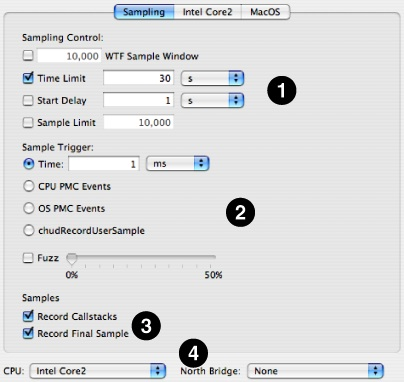

1. __Sampling Control__— First, you must choose ways to start and stop sampling using the options at the top of the configuration controls. These options are essentially identical to the basic options used to control “Timed Samples and Counters.”

   - _WTF Mode_— If enabled, Shark will collect samples until you explicitly stop it. However, it will only store the last N samples, where N is the number entered into the sample history field (10,000 by default). This mode is also described in [Windowed Time Facility (WTF)](Advanced%20Profiling%20Control.md#apple-f4xwc4dqnrsv64tfmyxwi33df52wszbpkridimbqga2temztfvbuqmjtfvjvomi).
   - _Time Limit_— The maximum amount of time to record samples. This is ignored if WTF mode is enabled.
   - _Start Delay_— Amount of time to wait after the user selects “Start” before data collection actually begins. This helps prevent Shark from sampling itself.
   - _Sample Limit_— Sets the maximum number of samples to record. Specifying a maximum of _N_ samples will result in at most _N_ samples being taken on a uniprocessor machine or _C_\*_N_ samples taken on a multiprocessor system with _C_ processors. This prevents the sample buffers from growing too large in case you happen to choose a combination of a large time limit and high sampling rate.
2. __Sample Trigger__— Next, choose when you want samples to be taken between the “start” and “stop” events using the options in the middle of the configuration controls. There are a variety of ways, one of which is unique to performance monitor work.

   - _Timed Sampling_— The most common way to use counters is to record the values of all counters periodically, when a timer fires. This produces a distribution of events over time, much like a Time Profile. Because the events are counted for the entire time between sample points, and not just _at_ the sample points, they are only approximately correlated with the program counter information sampled by Shark.
   - _Event-Triggered Sampling_— An alternative is to let performance events trigger sampling themselves. As a result, this is only possible when performance monitoring counters are used. One counter at a time can be set to a special _Trigger_ mode which initiates sampling when the event count reaches a preset _Sample Interval_. If the event occurs frequently, many samples will be taken, while if it occurs infrequently then only a few samples will be taken. There are pros and cons to this mode. First, you can only trigger on one event type at a time. However, each sample point will be taken _immediately_ after the event occurs, so you can accurately determine which lines of code from your program are causing the events. Hence, this mode is most helpful when you are trying to determine which code is triggering a particular event.
   - _Programmatic Sampling_— A third alternative is to let your program determine when to take a sample. Your program can link to the CHUD framework and call chudRecordUserSample, which will force a performance counter sample to be taken. In this way, you will be able to see events at a rate that is precisely controlled by you. This is useful when you want to examine issues such as how your program’s behavior varies over time, from one loop iteration to another.

   Once you have chosen a technique for controlling the sampling, just check the appropriate box in this section of the tab and fill out any necessary parameters.

   - _Time_— A sample is taken every _T_ time units (1 millisecond, by default). This is the same control used ot vary the sampling frequency of a standard time profile.
   - _CPU PMC Events_— A sample is taken every _N_ CPU PMC events from the selected CPU PMC. Only one trigger PMC can be selected at a time. In a multi-processor system, any CPU can trigger the collection for all CPUs.
   - _OS PMC Events_— A sample is taken every _N_ OS performance monitor counter (PMC) events from a selected OS PMC. Only one trigger PMC can be selected at a time.
   - _chudRecordUserSample_— A sample is recorded for every call to the `CHUD.framework``chudRecordUserSample()` function. This is analogous to using signposts ([Sign Posts](System%20Tracing.md#apple-f4xwc4dqnrsv64tfmyxwi33df52wszbpkridimbqga2temztfvbuqnbnknlteny)) with system trace.

   Finally, once you have chosen a sampling mode, there is one additional variation that can be applied to the nominal sampling rate. The __Fuzz__ feature, when enabled, randomizes the sampling interval by ±N% around the specified nominal value. For example, if timer sampling is selected, the sampling period is 1ms and _Fuzz_ is set to 5%, the actual sampling period will vary randomly between 0.95ms and 1.05ms. _Fuzz_ helps prevent harmonic relationships between the sampling interval and execution behavior. You should use this if your code performs the same work repeatedly, with very little variation in its patterns.
3. __Samples__—Down at the bottom of the tab are a couple of “miscellaneous” options.

   - _Record Callstacks_— When enabled, Shark will collect the function backtrace along with the program counter value for each sample. This is used by default, but can be disabled if you need to record an extremely large number of samples into Shark’s kernel buffers or if the callstack recording is impacting performance (a possibility if sample rates are very high).
   - _Record Final Sample_— By default, when sampling is stopped all collection is terminated _immediately_. In a multiprocessor system, this can cause the last sample from some processors to be dropped if they are a little bit behind the “main” processor and therefore have not quite completed a time interval or reached an interrupt state when Shark is stopped. This setting will force collection of the last sample from all processors, even if it is not a “full” sample.
4. __Device Selection__— Finally, below the tab itself are menus that let you choose a device to target. While this will often simply be the processor and/or North bridge on your own machine, Shark also allows you to choose other processors that aren’t even installed on your machine. This latter option is quite useful if you are making measurements of a different machine over a network [Network/iPhone Profiling](Advanced%20Profiling%20Control.md#apple-f4xwc4dqnrsv64tfmyxwi33df52wszbpkridimbqga2temztfvbuqmjtfvjvomjz).

   - _CPU PopUp Menu_— This selects the processor type to configure. By default, the CPU in the running system is selected. If _any_ CPU performance counters are enabled (in either Counter or Trigger mode, as described in [Counter Control](#apple-f4xwc4dqnrsv64tfmyxwi33df52wszbpkridimbqga2temztfvbuqmjqfvjvomy)), then the configuration will only be compatible with machines that have the specified CPU.
   - _North Bridge PopUp Menu_— This selects the memory controller type to configure. By default, the North bridge in the running system is selected, or “none” if no North bridge counters are available in the system. If _any_ memory controller performance counters are enabled (in Counter mode, as described in [Counter Control](#apple-f4xwc4dqnrsv64tfmyxwi33df52wszbpkridimbqga2temztfvbuqmjqfvjvomy)), then the configuration will only be compatible with machines that have the specified memory controller. Please note that currently there are no supported North bridge performance counters in Intel-based Macs.

   Changing either of these settings will not have a visible effect on the “Sampling” tab. However, both will change the contents of the relevant hardware tab(s), the name of those tab(s) will update immediately, and the controls for setting up events will change if one of the hardware tabs is visible.

All of the various performance counter configuration tabs have many unique elements, as the various processors and North bridges supported by MacOS X are significantly different from each other in many ways. However, Shark uses several common interfaces throughout these various tabs in order to make it reasonably easy for you to work with more than one variety of Macintosh. To avoid repeating these descriptions for every tab, they are discussed here.

Every performance counter is controlled with a consistent set of three controls, like those illustrated below in Figure 8-2. This section describes how they work, for any variety of hardware.

__Figure 8-2__  A typical set of performance counter controls

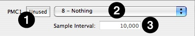

There are three controls associated with every performance counter

1. __Enable Button__— This button turns the counter on and off. If it is on, then it further controls whether the counter is used as the event trigger source or not. As a result, every time it is pressed it will toggle among three different states:

   - _Unused_— The counter will not count, and is ignored by Shark.
   - _Counter_— The counter counts the event selected using the _Event List_ menu. Its contents will be recorded every time that Shark takes a sample.
   - _Trigger_— The counter is enabled as the sampling trigger. Whenever it has counted the number of events listed in the _Sample Interval_ box, it will cause Shark to record another sample. Only one counter at a time can be in this mode; you must switch any previous counter to use one of the other two modes before it is possible to select this mode with a second counter. Also, note that this mode is not available on the counters in all types of Macintosh hardware (particularly older processors and North bridges).
2. __Event List__— This list displays the names of all events that can be counted by this counter. It may also include some “reserved” event types that can be chosen, but are not actually implemented on the hardware in any useful way. For most types of hardware, these lists are constant. However, in the case of the PowerPC 970, the event lists can change depending upon the settings of the other controls in the tab. See [PPC 970 (G5) Performance Counter Event List](PPC%20970%20%28G5%29%20Performance%20Counter%20Event%20List.md#apple-f4xwc4dqnrsv64tfmyxwi33df52wszbpkridimbqga2temztfvbuqmrxfvjvomi) for more details.
3. __Sample Interval__— This is the number of events that must occur before this PMC will trigger sampling. It is ignored unless this particular counter has been set to _Trigger_ mode using the _Enable Button_. If a counter cannot support _Trigger_ mode, then this box will not be present.

With the various performance counters, it is often possible to filter events such that only events from user-level code or only events from privileged (supervisor mode) are counted. Shark disables this option if it is not applicable to the currently selected sampling trigger.

- __Any__ — Record all performance counter events of this type.
- __User__— Record performance counter events of this type only when running user-level code.
- __Supervisor__— Record performance counter events of this type only when running supervisor-level code in the OS kernel.

With the various performance counters, Shark can filter events such that only events from a user-defined selection of “marked” processes are actually counted. In this way, you could limit counting to events from your own application’s process, for example, while ignoring all others. Alternatively, a user may choose to record events from all “unmarked” processes. This is a good choice when you want to tell Shark to ignore a few processes — probably background ones like daemons or the Finder — while recording events from everything else.

- __Any__— Record all events, no matter when they occur
- __Marked__— Record only events that occur in “marked” processes or threads that you have selected.
- __Unmarked__— Record only events that occur in “unmarked” processes or threads.

You can mark processes with Shark’s _Process Marker_ (Figure 8-3). The _Process Marker_ can be opened via the _Sampling_→_Mark Process_ menu item. Shark disables this menu item for timer sampling, because the marked bit is ignored in that case.

__Figure 8-3__  Process Marker

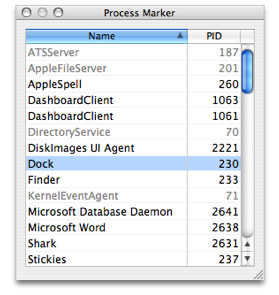

It is also possible to enable thread marking programmatically, using the `chudMarkPID(pid_t pid, int markflag)` call (in the CHUD framework) to set the marked flag to a value of TRUE (`markflag` = 1) or FALSE (`markflag` = 0) for any arbitrary process.

While this mechanism is powerful, it does have some limitations imposed on it by how the OS internally tracks the “marked” state of each thread. New threads created by a process _after_ you have marked it will not be marked; you will need to mark the process again to make sure all of the newly created threads are marked. In addition, the marked bit is not copied to supervisor space during system calls or other supervisor state code done on behalf of the marked process, so if you choose to record “marked” events only you will only see events triggered by your user-level code.

This tab, illustrated in Figure 8-4, is always the rightmost tab in the editor. It provides access to a variety of counters for operating system events, such as page faults. These OS counters support trigger mode, privilege level filtering, and marked thread filtering on all Macintosh platforms. However, all OS performance counters must share the same settings for privilege level and marked thread filtering. The events counted by the operating system’s counters can be divided into the following categories:

- __Virtual Memory:__ Events such as page faults, zero fill faults, copy-on-write faults, and page cache hits
- __System Calls:__ Transfers into the kernel requested by user code, divided up into BSD and Mach syscalls
- __Scheduler Events:__ Events such as context switches, “thread ready” events, and stack handoffs
- __Disk I/O Events:__ Disk reads and writes, with optional breakdown by type (data, disk control metadata, VM page-in, and VM page-out) and timing (synchronous and asynchronous)

No unique controls are needed to control these counters; for information on all of the controls, see [Counter Control](#apple-f4xwc4dqnrsv64tfmyxwi33df52wszbpkridimbqga2temztfvbuqmjqfvjvomy).

__Figure 8-4__  MacOS X Performance Counters Configuration

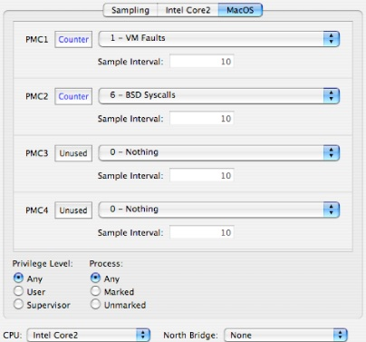

This section describes how you can make custom configurations for Macs equipped with Intel processors. Macs equipped with Intel Core processors have access to two fully programmable performance counters, and Macs equipped with Intel Core 2 processors have an additional three fixed-purpose counters. The two families can both count a similar but not identical list of events on the programmable processors. Full event listings are provided in [Intel Core Performance Counter Event List](Intel%20Core%20Performance%20Counter%20Event%20List.md#apple-f4xwc4dqnrsv64tfmyxwi33df52wszbpkridimbqga2temztfvbuqmrsfvjvomi) and [Intel Core 2 Performance Counter Event List](Intel%20Core%202%20Performance%20Counter%20Event%20List.md#apple-f4xwc4dqnrsv64tfmyxwi33df52wszbpkridimbqga2temztfvbuqmrtfvjvomi) for the Core and Core 2, respectively.

Figure 8-5 shows the single configuration tab for the Intel Core 2 processor (the one for the Core is virtually identical, but lacks PMCs 3–5). For the most part, it uses the standard controls from [Counter Control](#apple-f4xwc4dqnrsv64tfmyxwi33df52wszbpkridimbqga2temztfvbuqmjqfvjvomy). A nice feature of these cores is that control over user/supervisor event counting selection is provided _independently_ for each counter on these cores. On the other hand, “marked” threads and processes cannot be used.

One unique control is necessary with these cores: the __Event Mask Bits__ control. This control, which is used more extensively in the Core 2 than in the Core processor, acts to fine-tune the type of events counted. For example, instead of just counting all line fetches from the L2 cache, you can use these bits to only count line fetches of lines in particular states (such as “exclusive,” or only in this L2 cache). The selection of bits available and their behavior varies depending upon the type of event being counted. The description of the effect that mask bits will have on the event counting is described in a tooltip both on the event name, as you are choosing among the various event types, and also in a tooltip that appears if you wave your mouse cursor over each of the bit-names in the mask list. Any bit in the list labeled \*Reserved\* should not be enabled. A brief summary of which bits are active for any particular event is included in the event lists in [Intel Core Performance Counter Event List](Intel%20Core%20Performance%20Counter%20Event%20List.md#apple-f4xwc4dqnrsv64tfmyxwi33df52wszbpkridimbqga2temztfvbuqmrsfvjvomi) and [Intel Core 2 Performance Counter Event List](Intel%20Core%202%20Performance%20Counter%20Event%20List.md#apple-f4xwc4dqnrsv64tfmyxwi33df52wszbpkridimbqga2temztfvbuqmrtfvjvomi).

__Figure 8-5__  Intel Core 2 Configuration Tab

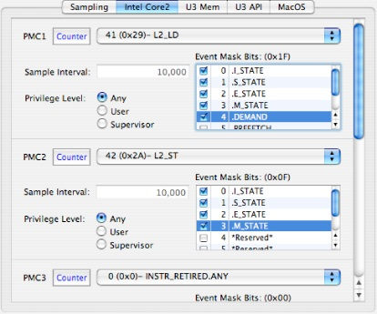

This section describes how you can make custom configurations for Macs equipped with PowerPC G3, G4, and G4+ processors. Macs equipped with these processors have access to four (G3, G4) or six (G4+) fully programmable performance counters. The list of available events varies significantly from processor to processor, since many new event types were added with each generation of PowerPC chips. Full event listings are provided in [PPC 750 (G3) Performance Counter Event List](PPC%20750%20%28G3%29%20Performance%20Counter%20Event%20List.md#apple-f4xwc4dqnrsv64tfmyxwi33df52wszbpkridimbqga2temztfvbuqmrufvjvomi), [PPC 7400 (G4) Performance Counter Event List](PPC%207400%20%28G4%29%20Performance%20Counter%20Event%20List.md#apple-f4xwc4dqnrsv64tfmyxwi33df52wszbpkridimbqga2temztfvbuqmrvfvjvomi), and [PPC 7450 (G4+) Performance Counter Event List](PPC%207450%20%28G4%2B%29%20Performance%20Counter%20Event%20List.md#apple-f4xwc4dqnrsv64tfmyxwi33df52wszbpkridimbqga2temztfvbuqmrwfvjvomi) for the G3, G4, and G4+ processor cores, respectively.

Figure 8-6 shows the single configuration tab for the G4+ processor (the one for the G3 and G4 is virtually identical, but lacks PMCs 5–6). For the most part, it uses the standard controls from [Counter Control](#apple-f4xwc4dqnrsv64tfmyxwi33df52wszbpkridimbqga2temztfvbuqmjqfvjvomy). Both user/supervisor event counting selection and “marked” threads and processes can be used, but all counters must use the same settings at once.

Three relatively minor additional controls are provided with all of these cores, to adjust features specific to these processors. The three controls are numbered on Figure 8-6, and are:

1. __Threshold:__ This sets a lower limit on the number of processor cycles that a wide variety of stall events must take before they are actually recorded, in case you want to filter out short stalls and thereby focus in only on the most lengthy and problematic stalls.
2. __TB Select:__ This is the divider used for timebase events that cause processor exceptions, and selects from four different division ratios.
3. __Branch Folding:__ PowerPC G3 and G4 CPUs have a feature that allows them to coalesce multiple branch instructions into one instruction, instead of issuing multiple branch instructions. When this feature is enabled (the default) performance events counting branch instructions and predictions can be inaccurate. Hence, for best results when counting performance events dealing with branch instructions, you should usually disable this feature. See your processor’s User Manual for more details.

   _Warning:_If you leave branch folding disabled and exit Shark, branch folding will _remain_ disabled. While this will not cause any correctness problems or crashes, it can adversely affect performance.

__Figure 8-6__  PowerPC G4+ Configuration Tab (G3 and G4 are similar)

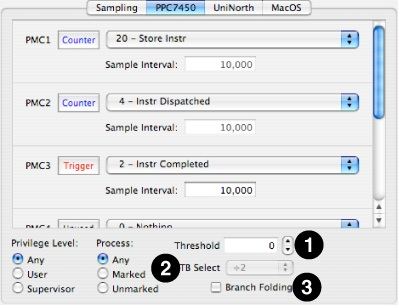

This section describes how you can make custom configurations for Macs equipped with PowerPC G5 (970) processors. Macs equipped with these processors have access to eight fully programmable performance counters that can count an incredible number of different performance events, as listed in [PPC 970 (G5) Performance Counter Event List](PPC%20970%20%28G5%29%20Performance%20Counter%20Event%20List.md#apple-f4xwc4dqnrsv64tfmyxwi33df52wszbpkridimbqga2temztfvbuqmrxfvjvomi). Because there are so many different types of events, the G5 uses a unique system of multiplexers to pre-filter many types of events before they reach the event counters. Depending upon the settings supplied for these various multiplexers, it is possible to enable vastly different selections of events in the performance counter event menus.

Figure 8-7 shows the first of two configuration tabs used by the G5 processor’s configuration control. The top half and lower left corner just use standard controls from [Counter Control](#apple-f4xwc4dqnrsv64tfmyxwi33df52wszbpkridimbqga2temztfvbuqmjqfvjvomy). Both user/supervisor event counting selection and “marked” threads and processes can be used, but all counters must use the same settings at once.

In addition, several additional controls are provided. Most are multiplexer controls to switch the various event pre-filtering multiplexers, but the last two adjust features specific to these processors. These controls are numbered on Figure 8-7, and are:

1. __TTM0 Event Selector:__ This first-stage mux selects collections of events from different processor functional units for all four second-stage muxes (FPU = floating point unit, ISU = instruction sequencer unit, IFU = instruction fetch unit, and VMX = Altivec processing unit).
2. __TTM1 Event Selector:__ This first-stage mux selects collections of events from different processor functional units for all four second-stage muxes (IDU = instruction dispatch unit, ISU = instruction sequencer unit, and GPS = storage subsystem).
3. __TTM3 Event Selector:__ This stage 1 mux selects collections of events from load/store unit #1 (LSU1), in four different patterns for second-stage muxes 2 and 3 only (2/3 = lane 2 & 3 both “upper” LSU1 events, 2/7 = lane 2 “upper” & 3 “lower” LSU1 events, 6/3 = lane 2 “lower” & 3 “upper” LSU1 events, 6/7 = lane 2 & 3 both “lower” LSU1 events).
4. __Even Lane Event Selectors:__ These two second-stage muxes select inputs for performance counters 1, 2, 5, and 6 from among the different first-stage muxes or directly from the load/store units (LSU0/LSU1).
5. __Odd Lane Event Selectors:__ These two second-stage muxes select inputs for performance counters 3, 4, 7, and 8 from among the different first-stage muxes or directly from the load/store units (LSU0/LSU1).
6. __Speculative Event Selector:__ This enables speculative event recording and performance counters 5 and/or 7. A full discussion of these counts is beyond the scope of this document. See the [PowerPC 970 Documentation](http://www.ibm.com/chips/techlib/techlib.nsf/products/PowerPC_970_and_970FX_Microprocessors) for more information.
7. __Threshold:__ This sets a lower limit on the number of processor cycles that a wide variety of stall events must take before they are actually recorded, in case you want to filter out short stalls and thereby focus in only on the most lengthy and problematic stalls.
8. __TB Select:__ This is the divider used for timebase events that cause processor exceptions, and selects from four different division ratios. More information is available in the [PowerPC 970 Documentation](http://www.ibm.com/chips/techlib/techlib.nsf/products/PowerPC_970_and_970FX_Microprocessors).

__Figure 8-7__  PowerPC 970 Processor Performance Counters Configuration

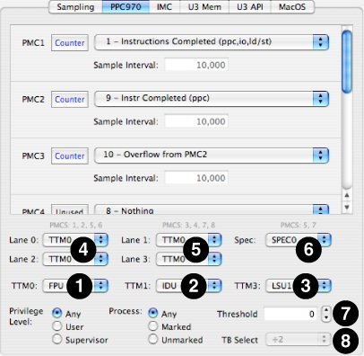

Figure 8-8 shows the second tab used to configure the PowerPC 970 performance counters, the __IMC__ tab. This tab provides access to the Instruction Fetch Unit's instruction marking and the Instruction Dispatch Unit’s instruction sampling feature, a pair of mechanisms that allow you to count individual instruction types as they are executed on the PowerPC 970.

The IFU instruction matching facility provides a CAM array to match PowerPC instructions by opcode or extended opcode as they are fetched. When a PowerPC instruction is fetched from memory, the IFU instruction matching facility compares the instruction with the opcode/extended opcode mask values in each of its CAM array rows. If a PowerPC instruction matches one or more IMC array row masks, you may have it “mark” the instruction in the L1 instruction cache. Thereafter, every time it is executed special performance counter events may occur to count it. Please note that as long as an instruction resides in the L1 instruction cache, its match bit will remain unchanged. Hence, if the match condition for an instruction changes, then the L1 instruction cache should be flushed to force the lines to be reloaded and the “match” bits to be recalculated.

Another level of instruction matching — performed in the IDU — allows you to mark instructions (or their constituent microinstructions, for the more complex PowerPC instructions) on the basis of some categories related to how they interact with the PowerPC 970 pipeline, such as whether or not they are internally broken up into microcode. Because this comes later in the processor’s pipeline, it is possible that it can override previous IFU marking.

Due to the very flexible and complex nature of these mechanisms, it is highly recommended that you read the pertinent sections of the [PowerPC 970 Documentation](http://www.ibm.com/chips/techlib/techlib.nsf/products/PowerPC_970_and_970FX_Microprocessors), Sections 10.9 and 10.10 in the main user’s manual.

__Figure 8-8__  PowerPC 970 IMC (IFU) Configuration Tab

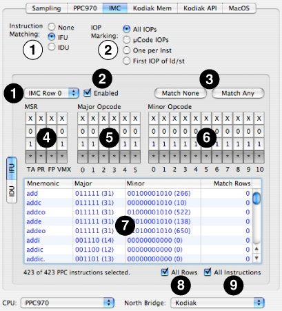

In the top part of the IMC pane are some general controls (black numbers on white):

1. __Instruction Matching__— This selects the type of instruction matching to setup and use.

   - _None_  – (default) No instruction matching will take place
   - _IFU_ – Use the Instruction Fetch Unit’s IMC capability.
   - _IDU_ – Use the Instruction Dispatch Unit’s sampling capability.
2. __IOP Marking__ – This pre-filter will limit the type of internal PowerPC microinstructions (IOPs) that are matched or sampled.

   - _All IOPs_  – (default) Any IOP will pass
   - _µCode IOPs_ –Only IOPs resulting from microcode expansion will pass.
   - _One Per Inst_ – Only pass one IOP per PowerPC instruction.
   - _1st IOP of ld/st_ – Only pass the first IOP to go to an LSU for every PowerPC load/store instruction, a less restrictive form of the previous filter.

Below that, a variety of controls (white numbers on black) operate on either the IFU’s instruction matching or IDU’s sampling. In Figure 8-8, the IFU instruction matching pane is shown:

1. __IMC Row PopUp__— There are six CAM rows that can be configured to match instructions in the IFU. Use this to select one of the six rows to manage.
2. __IMC Row Enable__— Enable and disable the IMC rows with this check box.
3. __IMC Match None/All Buttons__— Flips the configuration bits to match no PowerPC or all PowerPC instructions with a single button press. If you only want to match a small number of instructions, start with “none” and enable the instructions you want, while if you want to match many then start with “all” and knock off ones you don’t need.
4. __MSR Configuration Bits__— Selects instructions to match on the basis of a few large and coarse categorizations about when they may execute (matching specific bits in the machine status register, or MSR). In general, you will want to leave these set to “any” (asterisk), but you may optionally narrow down the possible list by setting these to 0 or 1.

   - _TA_ — (Target) Leave this set to “any” (asterisk), since it is ignored in all cases.
   - _PR_— (Privilege) Matches instructions on the basis of their privilege requirements.

     - _0_ — Matches only instructions executable in both user and supervisor mode.
     - _1_— Matches only privileged instructions executable in supervisor mode only.
   - _FP_— (Floating Point Unit Availablity) This matches instructions on the basis of whether or not they need and FPU to be present.

     - _0_ — Matches only non-FPU instructions.
     - _1_— Matches only FPU instructions..
   - _VMX_— (Vector Unit Availability) This matches instructions on the basis of whether or not they need an Altivec vector unit to be present.

     - _0_ — Matches only non-Altivec unit instructions..
     - _1_— Matches only Altivec unit instructions.
5. __Major Opcode Bits__— This allows you to select marked instructions on the basis of their six major opcode bits (bits 0–5 of each PowerPC instruction). There is a column for each bit, and you can individually control matching on the basis of each bit.

   - _X_— (default) Ignore the bit
   - _0_— Only match if this bit is a zero
   - _1_— Only match if this bit is a one
   - _\* (any)_— Match any state.
6. __Minor Opcode Bits__— This allows you to select marked instructions on the basis of their eleven minor opcode bits (bits 21–30 of each PowerPC instruction). There is a column for each bit, and you can individually control matching on the basis of each bit. Note that you should only use these for major opcodes 4 (Altivec instructions), 19 (branch unit operations), 31 (integer instructions), 59 (FP instructions), and 63 (FP instructions); these bits are not used as part of the opcode by other types of instructions.

   - _X_— (default) Ignore the bit
   - _0_— Only match if this bit is a zero
   - _1_— Only match if this bit is a one
   - _\* (any)_— Match any state.
7. __Instruction Table__— This allows you to see which instructions are actually being matched on the basis of your various settings.

   - _Mnemonic column_— This lists the assembly language mnemonic for an instruction.
   - _Major opcode column_— This shows the actual major opcode for the instruction.
   - _Minor opcode column_— This shows the actual minor opcode for the instruction, or zero for instructions that do not use the minor opcode.
   - _Match Rows column_— This shows which row(s) in the IMC are the cause of any match(es), so you can see which ones need to be turned on or off as a result.
8. __All Rows__— If checked, the _Instruction Table_ shows instructions that are matched by any of the IMC rows, all combined together. This is usually the most useful view since it shows all instructions that will be marked. Otherwise, only instructions that match the row currently selected in the _IMC Row PopUp_ are displayed.
9. __All Instructions__— If checked, the _Instruction Table_ shows non-selected instructions in a grayed-out form. Otherwise, they are completely omitted from the table.

Finally, in Figure 8-9, the IDU instruction filtering pane is shown:

1. __Microinstruction Table__— This allows you to see which classes of instructions are actually being matched on the basis of your various settings.

   - _BSFL column_— This lists the __BSFL__ (__B__ranch instruction, instruction that will be __S__plit, __F__irst instruction in a dispatch group, and __L__ast instruction in a dispatch group) bits associated with every instruction in the L1 cache.
   - _Classification column_— This gives the name of every microinstruction class.
2. __IMRMASK bits__— These bits mask off an instruction’s _BSFL_ bits before matching.

   - _0_— AND this bit position with 0, requiring an IMRMATCH of 0 here.
   - _1_— AND this bit position with 1, enabling full matching with the IMRMATCH bits here.
3. __IMRMATCH bits__— These bits select the value to match for any corresponding IMRMASK bits set to 1.

   - _0_— Match this bit position with 0. Note that this _must_ be 0 for any IMRMASK bit positions that equal 0, or no matches will ever occur.
   - _1_— Match this bit position with 1. Normally only desired if the corresponding IMRMASK bit is 1, or if you want to intentionally match nothing.

__Figure 8-9__  PowerPC 970 IMC (IDU) Configuration Tab

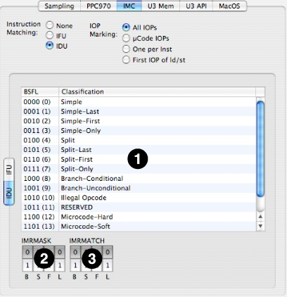

This section describes how you can make custom configurations to examine counters in some of the North Bridge (memory interface) chips of Macs equipped with PowerPC processors, using the “Advanced” configuration interface. Because some of the “useful” options for these counters require fairly complex combinations of settings, we strongly suggest that you start using the “Simple” settings at first, as described in [Simple Timed Samples and Counters Config Editor](Custom%20Configurations.md#apple-f4xwc4dqnrsv64tfmyxwi33df52wszbpkridimbqga2temztfvbuqobnknltcmq), at least until you learn which combinations of settings are best at producing useful information.

Memory controller counters are available on PowerPC machines with UniNorth v1.5 and later memory controllers. Unfortunately, no equivalent exists for Intel processors. These counters do not support event-triggered interrupts (PMI, or “trigger” mode), privilege level filtering, or marked thread/process filtering. However, on most of the chips they do support filtering on the basis of which interface generated the performance event (see the description of each chipset for details).

This section describes how you can make custom configurations for Macs equipped with the U1.5/U2 North bridge chipset used in some PowerPC G4 Macs. Macs equipped with these North bridge chipsets have access to four fully programmable performance counters that can record various memory system event types, as listed in [UniNorth-2 (U1.5/2) Performance Counter Event List](UniNorth-2%20%28U1.5-2%29%20Performance%20Counter%20Event%20List.md#apple-f4xwc4dqnrsv64tfmyxwi33df52wszbpkridimbqga2temztfvbuqmryfvjvomi).

Figure 8-10 shows the configuration tab for the U1.5/2’s configuration control. All controls for each of the PMC are just standard controls from [Counter Control](#apple-f4xwc4dqnrsv64tfmyxwi33df52wszbpkridimbqga2temztfvbuqmjqfvjvomy), except for the _Event Sources_ checkboxes along the bottom. These allow filtering of events based on which North bridge interface is involved. These sources are chosen via checkbox, so you can selectively look at events from all sources or only a specific subset of sources that you choose. You may choose to enable or disable events from any of the following interfaces:

1. _CPU1–CPU2_— Processor interface(s)
2. _AGP_— The AGP interface
3. _PCI_— The PCI interface
4. _FireWire/Enet_— The dedicated FireWire and Ethernet I/O ports

__Figure 8-10__  U1.5/U2 Configuration Tab

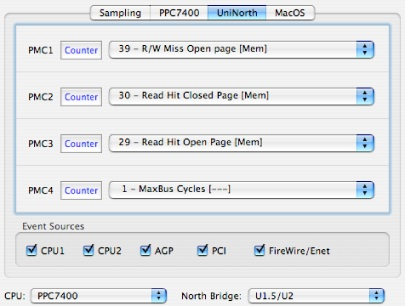

This section describes how you can make custom configurations for Macs equipped with the U3 North bridge chipset used in some PowerPC G5 Macs. Macs equipped with these North bridge chipsets have access to two sets of six fully programmable performance counters, on both the memory interface controller and the Apple processor interface (API) controller. These can count a wide variety of different event types, as listed in [UniNorth-3 (U3) Performance Counter Event List](UniNorth-3%20%28U3%29%20Performance%20Counter%20Event%20List.md#apple-f4xwc4dqnrsv64tfmyxwi33df52wszbpkridimbqga2temztfvbuqmrzfvjvomi), and also filter events on the basis of their source interface and type of access.

Figure 8-11 shows the first of two configuration tabs used by the U3’s configuration control, the memory interface configuration panel. The first line of each PMC’s controls are just standard controls from [Counter Control](#apple-f4xwc4dqnrsv64tfmyxwi33df52wszbpkridimbqga2temztfvbuqmjqfvjvomy). Below this are four custom controls that may be set independently for each of the different PMCs:

1. __Access PopUp__— This popup menu lets you restrict the event counting to only certain types of memory accesses, either reads or writes.

   1. _None_— Disables the counter.
   2. _Write_— Only store requests to memory can increment the counter.
   3. _Read_— Only load requests from memory can increment the counter.
   4. _Any_ — All memory requests cause a counter increment, read or write.
2. __Divider PopUp__— Because U3 PMCs are 32-bit, you may overflow a counter if you are counting high-frequency events or are counting continuously for a long time. You can use this popup to set up a division factor that will slow the rate of incoming events by a fixed power of 2 in order to make it more difficult to overflow the main counter. Choices of every even power of 2 from 1 (no division) to 128 (effectively adds 7 bits to the counter) are available using this menu.
3. __Page State__— U3’s events involving DRAM access can be filtered on the basis of the current SDRAM page state for the accessed DIMM. This allows you to monitor the effectiveness of different memory paging policies, such as how long to keep a page open before closing it.

   1. _Open Hit_— DRAM access events are counted if they hit on an open page in the addressed DIMM. This is the most desirable case, and will generate the minimum latency because the data can be returned immediately from the DRAM’s page cache.
   2. _Open Miss_— DRAM access events are counted if they miss on a currently open page in the addressed DIMM. This is the least desirable case, because it will generate the maximum latency when the old DRAM page is closed and then the new one is opened before data can be returned.
   3. _Closed_— DRAM access events are counted if the addressed DIMM does not have an open page. This is an intermediate case, because while a new page must be opened before data can be returned, at least we do not have to wait for a previously-accessed page to be closed first.
4. __Source Filter__— Events can be filtered before they reach U3’s PMCs on the basis of the interface where they originate. These sources are chosen via checkbox, so you can selectively look at events from all sources or only a specific subset of sources that you choose. You may choose to enable or disable events from any of the following interfaces:

   1. _CPU1–CPU4_— Processor interface(s)
   2. _HT_— The Hypertransport interface
   3. _CV_, _NCV_— Obsolete interfaces, do not use
   4. _PCI_— The PCI interface
   5. _AGP_— The AGP interface

__Figure 8-11__  U3 Memory Configuration Tab

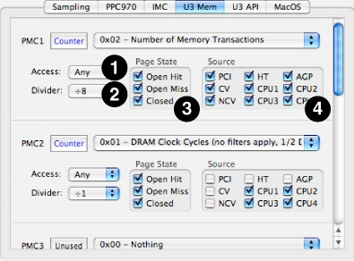

Figure 8-12 shows the second of U3’s two configuration tabs, the API configuration panel. As with the memory tab, the first line of each PMC’s controls are just standard controls from [Counter Control](#apple-f4xwc4dqnrsv64tfmyxwi33df52wszbpkridimbqga2temztfvbuqmjqfvjvomy). Below this is a pair of custom controls that may be set independently for each of the different PMCs:

1. __Source PopUp__— The API controller chip has 51 different selectable event sources, mostly different types of request queues within the chip. You must select one of these sources in order to count its events. To count events from multiple sources simultaneously, you will have to use different PMCs for each source. A full list of these sources is listed in [UniNorth-3 (U3) Performance Counter Event List](UniNorth-3%20%28U3%29%20Performance%20Counter%20Event%20List.md#apple-f4xwc4dqnrsv64tfmyxwi33df52wszbpkridimbqga2temztfvbuqmrzfvjvomi).
2. __Divider PopUp__— This is the same as the Divider PopUp on the memory tab.

__Figure 8-12__  U3 API Configuration Tab

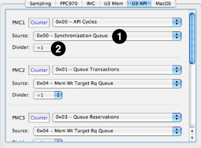

This section describes how you can make custom configurations for Macs equipped with the U4 (Kodiak) North bridge chipset used in some PowerPC G5 Macs. Macs equipped with these North bridge chipsets have access to two sets of six fully programmable performance counters, on both the memory interface controller and the Apple processor interface (API) controller. These can count a wide variety of different event types, as listed in [Kodiak (U4) Performance Counter Event List](Kodiak%20%28U4%29%20Performance%20Counter%20Event%20List.md#apple-f4xwc4dqnrsv64tfmyxwi33df52wszbpkridimbqga2temztfvbuqmzqfvjvomi), and also filter events on the basis of their source interface and type of access.

Figure 8-13 shows the first of two configuration tabs used by the U4’s configuration control, the memory interface configuration panel. The first line of each PMC’s controls are just standard controls from [Counter Control](#apple-f4xwc4dqnrsv64tfmyxwi33df52wszbpkridimbqga2temztfvbuqmjqfvjvomy). Below this are three custom controls that may be set independently for each of the different PMCs:

1. __Access PopUp__— This popup menu lets you restrict the event counting to only certain types of memory accesses, either reads or writes.

   1. _None_— Disables the counter.
   2. _Write_— Only store requests to memory can increment the counter.
   3. _Read_— Only load requests from memory can increment the counter.
   4. _Any_ — All memory requests cause a counter increment, read or write.
2. __Divider PopUp__— Because Kodiak PMCs are 32-bit, you may overflow a counter if you are counting high-frequency events or are counting continuously for a long time. You can use this popup to set up a division factor that will slow the rate of incoming events by a fixed power of 2 in order to make it more difficult to overflow the main counter. Choices of every even power of 2 from 1 (no division) to 128 (effectively adds 7 bits to the counter) are available using this menu.
3. __Source Filter__— Events can be filtered before they reach Kodiak’s PMCs on the basis of the interface where they originate. These sources are chosen via checkbox, so you can selectively look at events from all sources or only a specific subset of sources that you choose. You may choose to enable or disable events from any of the following interfaces:

   1. _CPU1–CPU4_— Processor interface(s)
   2. _HT_— The Hypertransport interface
   3. _CPCIE_— The PCIE interface (for coherent requests)
   4. _NCPCIE_— The PCIE interface (for non-coherent requests)

__Figure 8-13__  U4 (Kodiak) Memory Configuration Tab

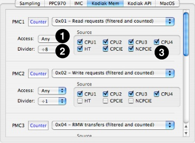

Figure 8-14 shows the second of U4’s two configuration tabs, the API configuration panel. As with the memory tab, the first line of each PMC’s controls are just standard controls from [Counter Control](#apple-f4xwc4dqnrsv64tfmyxwi33df52wszbpkridimbqga2temztfvbuqmjqfvjvomy). Below this are four custom controls that may be set independently for each of the different PMCs:

1. __Source PopUp__— The API controller chip has 33 different selectable event sources, mostly different types of request queues within the chip. You must select one of these sources in order to count its events. To count events from multiple sources simultaneously, you will have to use different PMCs for each source. A full list of these sources is listed in [Kodiak (U4) Performance Counter Event List](Kodiak%20%28U4%29%20Performance%20Counter%20Event%20List.md#apple-f4xwc4dqnrsv64tfmyxwi33df52wszbpkridimbqga2temztfvbuqmzqfvjvomi).
2. __Access PopUp__— This is the same as the Access PopUp on the memory tab.
3. __Divider PopUp__— This is the same as the Divider PopUp on the memory tab.
4. __Source Filter__— This is the same as the filter on the memory tab, except that all PCIE events are grouped together into a single source, whether or not they are coherent.

__Figure 8-14__  U4 (Kodiak) API Configuration Tab

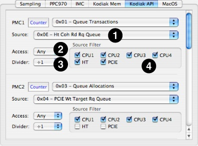

This section describes how you can make custom configurations for iOS devices with ARM11 processors. These devices have two identical, fully programmable performance counters plus one counter (#1) that can record cycle counts only. Full event listings are provided in [ARM11 Performance Counter Event List](ARM11%20Performance%20Counter%20Event%20List.md#apple-f4xwc4dqnrsv64tfmyxwi33df52wszbpkridimbqga2temztfvbuqmzrfvjvomi).

Figure 8-15 shows the configuration tab for the ARM11 processor. It just uses three sets of the standard PMC controls from [Counter Control](#apple-f4xwc4dqnrsv64tfmyxwi33df52wszbpkridimbqga2temztfvbuqmjqfvjvomy), although each PMC also includes a “help” field that describes what the currently-selected counter actually counts with some additional text.

__Figure 8-15__  ARM11 Counter Configuration Tab

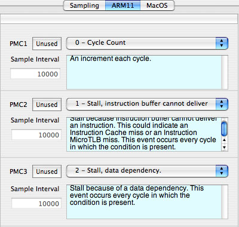

[Next](Command%20Reference.md)[Previous](Custom%20Configurations.md)

