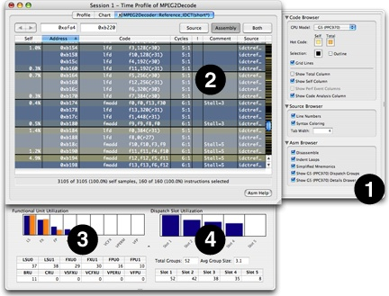
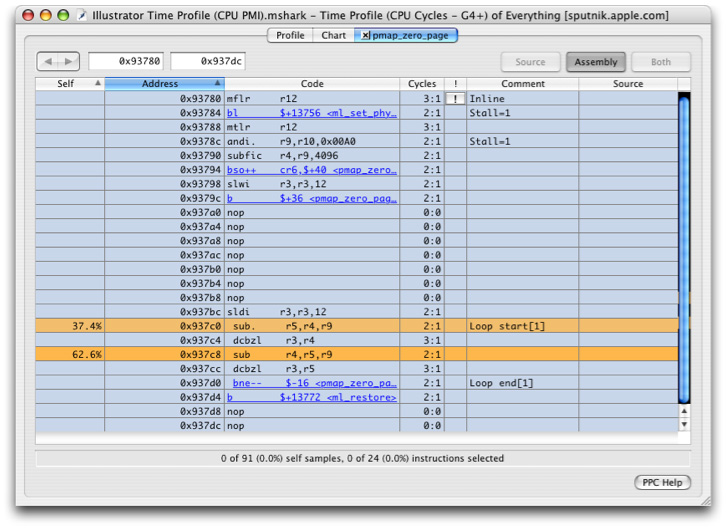

> 导航：[总目录](../../../README.md) · [documentation](../../../_indexes/documentation.md) · [Shark User Guide](Introduction.md)

[Next](Intel%20Core%20Performance%20Counter%20Event%20List.md)[Previous](Command%20Reference.md)

# Miscellaneous Topics

Shark offers several features designed to help the programmer understand instruction execution behavior on the G5 (PPC970). From the _Advanced Settings_ drawer’s _Assembly Browser_ tab, you can set the _Assembly Browser_ to display an estimate of G5 dispatch group formations, using the check box near item #1 in Figure B-1. After this is checked, the assembly display around item #2 has dark lines added to indicate breaks between instruction dispatch groups. If you look closely, you will see that all of Shark’s samples generally fall on the first or last instructions of dispatch groups, due to the way program counters are captured by Shark on the G5 processor. A key factor in optimizing performance on the G5 is maximizing dispatch group sizes. A detailed explanation of G5 dispatch group formation rules is beyond the scope of this document, but Shark accurately models the CPU behavior as much as possible using static analysis. See the PowerPC970 User Manual (see the [PowerPC 970 documentation](http://www.ibm.com/chips/techlib/techlib.nsf/products/PowerPC_970_and_970FX_Microprocessors)) for a complete description of dispatch groups.

Functional unit utilization and dispatch slot utilization are two more features that Shark offers to visualize G5 execution behavior. When the user selects Show G5 (PPC970) _Details Drawer_ in the _Advanced Settings_ drawer (at #1 in Figure B-1), the user will see the _G5 Resource Utilization_ drawer. The _Functional Unit Utilization_ chart and table (item #3) provide visual feedback to the programmer about how effectively instructions are spread among the various functional units within the G5. Similarly, the number of dispatch groups and instructions flowing into each G5 dispatch slot are shown in the _Dispatch Slot Utilization_ chart and table (item #4). Please note that the data in the _G5 Resource Utilization_ drawer is based on the currently selected instructions in the Code Table, or on the entire code sequence if nothing is selected. The user can specify a subset of instructions within the current _Code Table_, and the _G5 Resource Utilization_ charts and tables will update dynamically.

__Figure B-1__  PPC970 Resource Modeling

Supervisor space samples come from either the Mach kernel or kernel extensions. If you are a driver writer or simply interested in the workings of the Mac OS X kernel, you may encounter inconsistent results between timer sampling and event sampling when profiling code that executes with interrupts disabled. For example, consider the PowerPC-specific virtual memory (VM) page-zeroing code in the kernel. When profiled with timer sampling, Shark displays the output shown in Figure B-2. Because `pmap_zero_page()` disables interrupts, any timer interrupts that occur in it are not serviced until interrupts are reenabled in `ml_restore()`. It is for this reason that all of the timer samples appear to come from the isync instruction at `0x96da8` (see Figure B-2).

__Figure B-2__  Timer Sampling in the Kernel

A more accurate picture of the kernel behavior can be seen with event sampling (Figure B-3). This is because CPU event sampling reads the SIAR (sampled instruction address register) rather than the originating PC when the performance monitor interrupt is serviced. Whenever a CPU performance monitor interrupt (PMI) occurs, the SIAR register is set to the currently executing PC (program counter) . As in the timer sampling case, the PMI is not actually serviced until interrupts are reenabled.

__Figure B-3__  CPU PMI Sampling in the Kernel

[Next](Intel%20Core%20Performance%20Counter%20Event%20List.md)[Previous](Command%20Reference.md)

