> 导航：[总目录](../../../README.md) · [documentation](../../../_indexes/documentation.md) · [Shark User Guide](Introduction.md)

[Next](Advanced%20Profiling%20Control.md)[Previous](System%20Tracing.md)

# Other Profiling and Tracing Techniques

Not every performance problem stems from computation in a program or a program’s interaction with the operating system. For these other types of problems, Shark provides a number of profiling and tracing configurations that focus on individual types of performance problems. Any of them may be chosen using the configuration list in the main Shark window before pressing “Start.”

When doing certain types of operations, a program can temporarily stop running while it waits on some other event to finish. This is commonly referred to as _blocking_. Blocking can be the source of many performance problems. Portions of programs, such as startup routines, making heavy use of library calls can accidentally waste a significant amount of time blocked at various points within those calls. In heavily multithreaded programs, time spent blocking at locks and barriers is another serious source of performance loss.

Since a program is not running while it is blocked, _Time Profile_ will not take many samples in routines that spend large amounts of time being blocked. To provide some insight into blocking, Shark offers the _Time Profile (All Thread States)_ configuration. This configuration is similar to _Time Profile_, but with one key difference: it takes samples of _all_ threads, whether they are blocked or running. With this information, you can get a good idea about how often your threads are blocked, and where in your code the blocking calls are being made.

Like _Time Profile_, _Time Profile (All Thread States)_ can be used to look at blocking behavior of a single application or the whole system by selecting the appropriate option in the target list in Shark’s main window. While the default settings for this configuration are often sufficient, you can also select many useful options in the mini-configuration editor (see [Mini Configuration Editors](Getting%20Started%20with%20Shark.md#apple-f4xwc4dqnrsv64tfmyxwi33df52wszbpkridimbqga2temztfvbuqmrnknltcma)), as shown in Figure 4-1. Here is a list of options:

1. __Start Delay__— Amount of time to wait after the user selects “Start” before data collection actually begins.
2. __Sample Interval__— Determine the trigger for taking a sample. The interval is a time period (10 ms default).
3. __Time Limit__— The maximum amount of time to record samples. This is ignored if Sample Limit is enabled and reached before the time limit expires.
4. __Sample Limit__ — The maximum number of samples to record. Specifying a maximum of _N_ samples will result in at most _N_ samples being taken, even on a multi-processor system, so this should be scaled up as larger systems are sampled. When the sample limit is reached, data collection automatically stops. This is ignored if the _Time Limit_  is enabled and expires first.
5. __Prefer User Callstacks__— When enabled, Shark will ignore and discard any samples from threads running exclusively in the kernel. This can eliminate spurious samples from places such as idle threads and interrupt handlers, if your program is not affected by these.
6. __Trim Supervisor Callstacks__— When enabled, Shark will automatically trim the recorded callstacks for threads calling into the kernel down to the kernel entry points, and discarding the parts of the stack from within the kernel itself. These shortened stacks are usually sufficient, since most performance problems in your programs can be debugged without knowing about how the kernel is running internally. You just need to know how and when your code is blocking, and not how Mac OS X is actually processing the blocking operation itself.

__Figure 4-1__  Time Profile (All Thread States) mini configuration editor

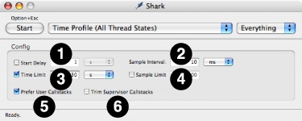

After you record a _Time Profile (All Thread States)_ session, you will be presented with a profile browser window that looks almost exactly like one you might see after recording a conventional _Time Profile_. However, there are some subtle differences, as you can see in the profile of “Safari” while idle in Figure 4-2 and Figure 4-3.

All threads have exactly the same number of samples, since Shark recorded samples for them whether they were running or not. With 9 threads, as we have in this example, all threads have exactly 1/9 of the samples, or 11.1%. This “even-division-of-samples” rule will always hold true for _Time Profile (All Thread States)_ sessions, unless you happen to sample an application that is actively creating and destroying threads while it is being measured, because _Time Profile (All Thread States)_ always records samples for all threads at each sample point, whether they are blocking or not. This trend can be less obvious if your threads are actively calling many different routines over the course of the measurement, but it generally holds. This kind of behavior is much less common in conventional _Time Profile_s, because almost all threads block occasionally during the time that Shark samples them.

With “Heavy” view, as shown in Figure 4-2, you will mostly see Mac OS X’s primitive blocking routines like `pthread_mutex_lock`, `pthread_cond_wait`, `mach_msg_trap`, `semaphore_timedwait_signal_trap`, `select`, and similar functions popping up to the top of the browser window. This view is mostly useful for showing you how much time your threads are blocked and how often they are running. As a result, it is a good “sanity check” technique to make sure that threads that are supposed to be CPU-bound are not accidentally wasting time blocked, and that threads that are supposed to be blocked really are idle.

__Figure 4-2__  Time Profile (All Thread States) session, heavy view

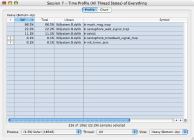

Unfortunately, this does not tell you the most important information: why _your_ code is calling these routines and hence blocking. It is possible to get this information by opening up disclosure triangles in “Heavy” view, but generally “Tree” view, as shown in Figure 4-3, is the best way to track down this information. By flicking a few disclosure triangles open, this view lets you logically follow your code paths until you reach a point where they call blocking library routines. At that point, and possibly with the help of a code browser, you should be able to get a good idea of which parts of your code are blocking, and how frequently this blocking is occurring.

__Figure 4-3__  Time Profile (All Thread States) session, tree view

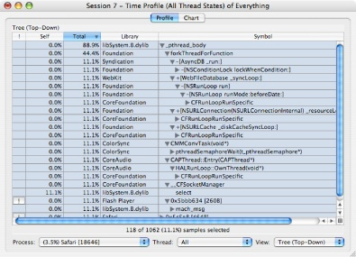

_Time Profile (All Thread States)_ can often allow you to track down and solve multithreaded blocking problems in your applications by itself. However, it also works well in conjunction with _System Trace_. After you identify _which_ code that is blocking too often with _Time Profile (All Thread States)_, if you cannot determine _why_ the code is blocking, then the precise recording of blocking timing provided by _System Trace_ can often help by letting you see the precise timing of blocks as multiple threads compete for resources. Conversely, using _System Trace_ without _Time Profile (All Thread States)_ can often be difficult, because it is fairly easy to get overwhelmed with data while examining a _System Trace_. Performing a _Time Profile (All Thread States)_ first can be very helpful, since it can let you know _which_ bits of blocking code are the most important before you look for them in a _System Trace_.

In today’s large and complex software applications, it is often informative to understand the scope and pattern of memory allocations and deallocations. If you understand how your software objects are being created and destroyed, you can often improve the overall performance of your application significantly, since memory allocation is a very expensive operation in Mac OS X, especially for large blocks of memory. If your program suffers from memory leaks, _Malloc Trace_ is also a good way to identify locations in your program that may be the culprits.

To collect an exact trace of memory allocation and freeing function calls, select _Malloc Trace_ in the configuration list. Unlike with most configurations in Shark, you _must_ choose a particular process to examine with this configuration. In its mini configuration editor (see [Mini Configuration Editors](Getting%20Started%20with%20Shark.md#apple-f4xwc4dqnrsv64tfmyxwi33df52wszbpkridimbqga2temztfvbuqmrnknltcma)), shown in Figure 4-4, _Malloc Trace_ offers the following tuning options to help refine the memory events that are collected:

1. __Record Only Active Blocks__— Collect only memory allocations that were not released during the collection period (the default). It is most useful for catching memory leaks. If turned off, any allocation or deallocation that takes place is recorded, an option that is more useful when you are just attempting to reduce the overall number of allocations that occur.
2. __Time Limit__— Specify a maximum length of time to collect a profile. After this amount of time has elapsed since the start of collection, Shark will automatically stop collecting the profile.
3. __Start Delay__— Specify a length of time that Shark should wait after being told to start collecting a profile before the collection begins. If the program action to be profiled requires a sequence of actions to start, this option can be used to delay the start until after the setup actions have been completed.

__Figure 4-4__  Malloc Trace mini configuration editor

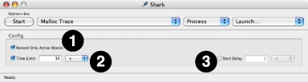

Once you have recorded a _Malloc Trace_, there are several ways that you can analyze the resulting trace, which comes up in a window that superficially resembles a standard time profile. Here are a few of the most common techniques:

- __Profile Browser: Get an Overview__— The profile browser from a _Malloc Trace_, as shown in Using a Malloc Trace, looks a lot like what you might obtain with a normal _Time Profile_, but it contains an extra column listing the amount of memory allocated. In addition, the “Self” and “Total” columns are based on the number of allocations made using that call instead of execution time. These figures are highlighted in the figure. By sorting on the “Total” or “Alloc Size” columns in a “Heavy” view, you can see which routines in your program either make the largest number of allocations or allocate the most memory at a glance. It is often a good idea to look over the routines near the top of this list and make sure that both the routines allocating memory are the ones you _think_ should be allocating memory, and that the amount of memory allocated by each routine makes sense.

  __Figure 4-5__  Malloc Trace session, profile browser

  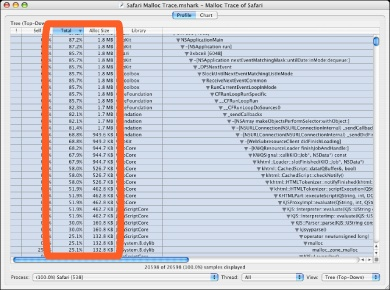
- __Code Browsers: Locate Allocating Code__— If you see a potentially troublesome routine, double-clicking it will bring it up in a code browser window. Unlike the code browsers associated with _Time Profile_ sessions, lines in a _Malloc Trace_ session are colored based on how many memory allocations they perform. With this feedback, you can see _exactly_ which lines of code were the cause of memory allocation. Often these lines will be fairly obvious, but with object-oriented languages like Objective-C and C++ it is surprisingly easy to accidently allocate and free memory implicitly, as a side effect of object method calls. Using a code browser from a _Malloc Trace_ session can allow you to identify which method calls are performing memory allocation and focus your optimization efforts on these. In addition, knowing what code is performing memory allocation implicitly can help you track down memory leaks, as these allocations are easy to forget about when one is cleaning up and freeing memory allocations.
- __Chart View: Look for Patterns__— The chronological view of allocations presented by the extra memory allocation graph added below the usual callstack plot in _Chart_ view can easily reveal unexpected repetitive allocation and deallocation activity in your software, like the pattern shown in the highlighted part of Figure 4-5. When you see patterns like this, it can be helpful to try and adjust your code to move memory allocation and deallocation operations outside of loops, so that you can reuse the same memory buffers repeatedly without reallocating them each time through the loop. Similarly, if you see repetitive allocation without matching deallocations, then you are most likely seeing a major memory leak in progress!

  __Figure 4-6__  Malloc Trace session, chart view

  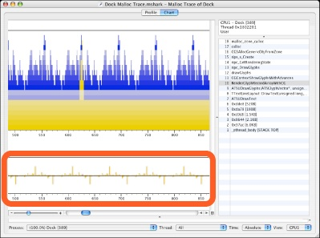

Using techniques like these, you can identify and isolate memory allocation locations and patterns within your code. This is the first step to actually eliminating these memory problems from your code, and hopefully improving performance in the process.

Each Malloc Trace records a few additional pieces of information at each allocation event. These are not displayed by default, but can be useful in some situations. Display of these values can be enabled by using the “Performance Counter Data Mining” pane in the Advanced Settings Drawer of the session window (see [Advanced Settings Drawer](Getting%20Started%20with%20Shark.md#apple-f4xwc4dqnrsv64tfmyxwi33df52wszbpkridimbqga2temztfvbuqmrnknlts)), as shown below in Figure 4-7, and then clicking on the check boxes in the “eye” column of each row to show that data element.

__Figure 4-7__  Enabling Malloc Trace Advanced Options

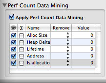

Five different types of information can be enabled or disabled in this manner:

- _Alloc Size_— The size in bytes of each memory allocation. This is enabled by default, as it is almost always useful.
- _Heap Delta_— The change in size of the heap since the start of the trace. This is sometimes useful for spotting memory leaks, which can be seen when the heap grows but never shrinks. Note that it is also possible to get this data by using the “summation” option (as described in [Perf Count Data Mining](Advanced%20Session%20Management%20and%20Data%20Mining.md#apple-f4xwc4dqnrsv64tfmyxwi33df52wszbpkridimbqga2temztfvbuqnznknltinq)) with _Alloc Size_.
- _Lifetime_— The number of allocation/deallocation events between matched allocation and deallocation pairs. This option is only useful if you disabled the “Record Only Active Blocks” option before taking your Malloc Trace, because otherwise that option automatically screens out all matched pairs from the trace and leaves no interesting lifetimes remaining in the trace.
- _Address_— The address of the memory block allocated or freed. For performance analysis purposes, this is only rarely helpful, but it can sometimes be useful during debugging of memory allocation behavior.
- _Is allocation?_— This binary value records a 1 for allocations and 0 for frees.

When you enable display of a particular type of data, it will appear in several places. First, columns displaying it will appear in the Profile Browser (as shown previously in [Figure 4-5](#apple-f4xwc4dqnrsv64tfmyxwi33df52wszbpkridimbqga2temztfvbuqnrnknltcna)), although this type of display is really only meaningful for _Alloc Size_. Raw values are displayed in the list of samples at the bottom of the Chart View (as shown in Figure 4-8), and all types of displays are useful here. Finally, charts appear in the main part of the chart view displaying all of the sample values graphically for your inspection. These are useful with _Alloc Size_ (enabled by default), _Heap Delta_, and _Lifetime_.

__Figure 4-8__  Additional Malloc Trace Charts

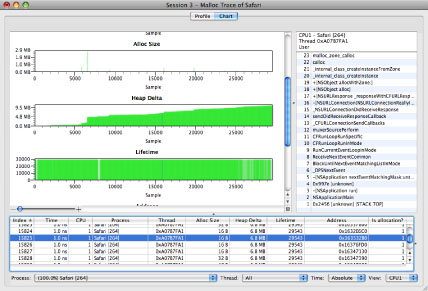

The rest of the “Performance Counter Data Mining” pane, which is described more fully in the context of performance counter analysis in the section [Perf Count Data Mining](Advanced%20Session%20Management%20and%20Data%20Mining.md#apple-f4xwc4dqnrsv64tfmyxwi33df52wszbpkridimbqga2temztfvbuqnznknltinq), also has other features that can be useful. For example, if a Malloc Trace contains allocations of wildly varying size, use of these options may be necessary in order to make the allocation size chart readable, as no means for vertical scaling or scrolling are provided by Shark. A particularly quick way of focusing the view on allocations of particular sizes is to use the “remove !=,” “remove <,” or “remove >” screening options to chop off most allocations that are vastly different in size from the ones that you are trying to examine.

All other features accessible through the Advanced Settings Drawer work just like they do for Time Profiling (see [Profile Display Preferences](Time%20Profiling.md#apple-f4xwc4dqnrsv64tfmyxwi33df52wszbpkridimbqga2temztfvbuqmznknltemq) for the “Profile Analysis” pane and [Data Mining](Advanced%20Session%20Management%20and%20Data%20Mining.md#apple-f4xwc4dqnrsv64tfmyxwi33df52wszbpkridimbqga2temztfvbuqnznknltc) for the “Callstack Data Mining” pane).

Most of Shark’s profiling methods limit their code analysis to those functions that appear dynamically in functions that are executed during the profiling. Dead or otherwise unused code is not analyzed or presented for optimization precisely because it has very little effect on the measured performance. However, it can sometimes be useful to statically analyze and examine infrequently used code paths in a piece of code to look for problems that might crop up if those code paths _do_ become important at some point, such as with a different input data set.

Shark is capable of statically analyzing either a running process or a binary file with the _Static Analysis_ configuration, but not your entire system. To analyze a running application, select _Process_ in the target list and then select the process you wish to analyze in the process list. To analyze an executable file, select _File_ in the target list and then select the file in file selection window.

_Static Analysis_’ mini config editor (see [Mini Configuration Editors](Getting%20Started%20with%20Shark.md#apple-f4xwc4dqnrsv64tfmyxwi33df52wszbpkridimbqga2temztfvbuqmrnknltcma)), shown in Figure 4-9, offers a number of tuning options to refine what types of problems to look for and where in the program to look for them. The available options are:

1. __Target Selection__— These options allow you to narrow down the area of memory examined by Shark.

   - _Application_— Looks for potential performance issues in the main text segment of the target process
   - _Frameworks_— Looks for potential performance issues in the frameworks that are dynamically loaded by the target
     process.
   - _Dyld Stubs_— Looks for any potential performance or behavior anomalies in the glue code inserted into the binary by the link phase of application building.
2. __Analysis Options__— These allow you to enable or disable analysis.

   - _Browse Functions_— Gives each function in the text image of a process a reference count of one. This allows you to browse all of the functions of a given process with Shark’s code browser. No analysis (or problem weighting) is performed.
   - _Look For Problems_ — search all functions in the text image of a process for problems of at least the level of severity specified by the Problem Severity slider. Any address with a problem instruction or code is given a reference count equivalent to its severity.
3. __Problem Severity Slider__— This slider acts as a filter, adjusting the minimum “importance” of problems to report using a predefined problem weighting built into Shark. The further to the right the slider, the less output is generated, as more and more potential problems are ignored because their “importance” is not high enough.
4. __Processor Settings__— Shark needs to know which model of processor is your target before it can examine code and find potential problems. Separate menus are provided for PowerPC and Intel processors because it can analyze for one model of each processor family simultaneously.

   - _PowerPC Model_— Selects the PowerPC model to use when searching for and assigning problem severities .
   - _Intel Model_— Selects the Intel model to use when searching for and assigning problem severities .

__Figure 4-9__  Static Analysis mini configuration editor

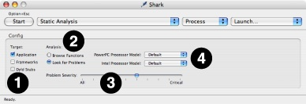

Once you have created a _Static Analysis_ session, you can examine it to see Shark’s optimization suggestions for your program. Both the profile browser and code browser views offer optimization hints similar to those you can see after a normal _Time Profile_ run, and they can be used to help you analyze your application in much the same manner.

Shark’s profiling and tracing techniques will work just fine with programs written in virtually any compiled language. Your compiler processes your source code in these languages and creates binary files where the various instructions in the binary are PowerPC or x86 instructions that correspond closely with your original source code operations. Shark records program counters and callstacks from the native machine execution as it profiles, and can use this information to reference back to your source code. Because Mac OS X imposes requirements on how its binaries are formatted, compilers for any language use the same techniques to record which machine instructions correspond with which source files, making it possible for Shark to show you symbol information and source code in languages as disparate as C and Fortran.

This system breaks down when your source code is written in a compiled language that runs within a runtime virtual machine, such as Java, or interpreted scripting languages. In these cases, Shark’s samples will only tell you what code is executing _within_ the virtual machine or interpreter, which will not help you optimize _your_ programs. For Shark to return useful information, it must move “up” a level in the software hierarchy (as shown in Figure 4-10) and record the location within the virtual machine code or script that is executing, instead. While support for recording this information is unavailable with most script interpreters, recent versions of Sun’s Java virtual machine included with Mac OS X _do_ provide an interface that Shark can use. As a result, Shark includes some special, Java-only configurations that use this interface to allow you to usefully profile your Java applications.

__Figure 4-10__  How Shark-for-Java differs from regular Shark configurations

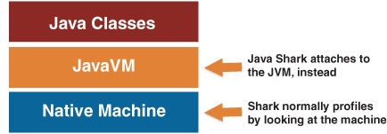

Shark supports three different techniques for examining your Java applications:

- __Java Time Profile:__ This is the Java version of _Time Profile_. The targeted Java program is periodically interrupted and Shark records the method that was running and the callstack of method calls leading up to the current method. You may examine the results using browsers that are almost identical to the normal _Time Profile_ ones described in [Profile Browser](Time%20Profiling.md#apple-f4xwc4dqnrsv64tfmyxwi33df52wszbpkridimbqga2temztfvbuqmznknltcoi), except that they only list Java methods and libraries. Note that, because a fair amount of code must be executed to communicate with the JVM, overhead requirements for a Java Time Profile are somewhat higher than for a conventional time profile. Using the mini-config editor (see [Mini Configuration Editors](Getting%20Started%20with%20Shark.md#apple-f4xwc4dqnrsv64tfmyxwi33df52wszbpkridimbqga2temztfvbuqmrnknltcma)), you can adjust the sampling rate at the millisecond level.
- __Java Call Trace:__ This is the Java analog to the separate Saturn program. Java Call Trace records each call into and exit from _every_ Java method during the execution of your program. As a result, it records an _exact_ trace of all the method calls, much like a normal _System Trace_ records an exact trace of all system calls. The amount of time spent in each method is also recorded. While this provides very exact and detailed information about the execution of your program, with no potential for sampling error, it also incurs a significant amount of system overhead due to the frequent interruptions of your code to pass information back to Shark. As a result, Shark’s overhead may distort the timing of your program to a certain extent, and this factor should be considered if you have code that is sensitive to external timing adjustments. Also, due to the large amount of data that can be collected very quickly, you probably want to limit the use of this to relatively short timespans. When complete, Shark presents the information that it has collected in a browser virtually identical to one produced by a Java Time Profile.
- __Java Alloc Trace:__ This records memory allocations and the sizes of the objects allocated, and is analogous to a regular _Malloc Trace_ ([Malloc Trace](#apple-f4xwc4dqnrsv64tfmyxwi33df52wszbpkridimbqga2temztfvbuqnrnknltcnq)). Not surprisingly, the resulting session window produced by Shark is very similar to one produced by _Malloc Trace_. As with _Malloc Trace_, the display is just that of a _Time Profile_ — albeit a Java Time Profile, in this case — with an added “allocation size” column. As with the previous two techniques, the overhead imposed by the Shark while doing a Java Alloc Trace is large enough that it may affect some programs that are very sensitive to external timing adjustments. Also, due to the large amount of data that can be collected very quickly, you probably want to limit the use of this to relatively short timespans.

In order to let Shark connect to your JVM and access its internals, to get the detailed information used by all of the techniques described earlier, the Java Virtual Machine first needs to load the “Shark for Java” extension. The method for doing this varies, depending upon which version of the JVM you’re using (use the command `java -version` to see which one you are running):

- __JVM 1.3 or earlier:__ Shark will not work with these, as they do not have the necessary external debugging support.
- __JVM 1.4:__ Add the following flag to your Java VM command line options: `–XrunShark`.
- __JVM 1.5 or later:__ Add the following flag to your Java VM command line options: `-agentlib:Shark`.

If you are using Xcode to build your Java application, edit the program’s target. Under the _Info.plist Entries_, select _Pure Java Specific_. In the _Additional VM Options_ field, add `-XrunShark` or `-agentlib:Shark` as appropriate.

When you run a Java program with Shark for Java, the program will output to the shell (or console for a double-clickable target) a message similar to the following:

`2004-06-27 03:33:24 java[4489] Shark for Java is enabled...`

As soon as you see this message you can begin sampling with Shark. When you choose one of the Java tracing configurations in Shark’s main window, the process list will change to only display Java processes that are running with Shark for Java loaded. Non-Java processes and Java processes that have been started without Shark support will both be eliminated.

To use source navigation, the program’s source must be on disk in package hierarchy structure. Shark does _not_ support inspection within jar files. If you have a jar such as `/System/Library/Frameworks/JavaVM.framework/Home/src.jar`, you will need to extract it into a directory hierarchy (`jar -xvf src.jar` for the example). When adding a path to the _Source Search Path_ (see [Shark Preferences](Getting%20Started%20with%20Shark.md#apple-f4xwc4dqnrsv64tfmyxwi33df52wszbpkridimbqga2temztfvbuqmrnknltk)), add only the path to the root of the source tree.

After analyzing an application using a _Time Profile_, you may find it informative to count system events or even sample based on system events in order to understand why your application spends time where it does. The best way to do this is to take advantage of the performance counters built into your Mac’s processors (usually called PMCs) and Mac OS X itself. Shark provides built-in configurations to help you access this information in meaningful ways:

- _Processor Bandwidth_ (x86) or _Memory Bandwidth_ (PowerPC): These configurations track off-chip memory traffic over time. Because of differences in the implementation of the counters, the PowerPC version measures memory bandwidth only, while the x86 version measures processor bus bandwidth, including traffic to memory, I/O, and other processors.
- _L2 (Data) Cache Miss Profile:_ This configuration provides an event-driven profile of L2 cache misses. As each L2 cache miss causes the processor to stall for a significant amount of time while it accesses main memory, algorithms that arrange accesses to memory in ways that minimize these misses will tend to run faster than ones that do not.

The rest of this section attempts to describe how you can use these default configurations to get useful information about your system with Shark, and learn about performance counters in the process. However, the default configurations only scratch the surface of what Shark’s counter recording mechanisms can do. Using the mini-configuration editor (see [Mini Configuration Editors](Getting%20Started%20with%20Shark.md#apple-f4xwc4dqnrsv64tfmyxwi33df52wszbpkridimbqga2temztfvbuqmrnknltcma)) associated with each of these configurations, you can adjust the same parameters used with a normal _Time Profile_ mini-config editor (see [Taking a Time Profile](Time%20Profiling.md#apple-f4xwc4dqnrsv64tfmyxwi33df52wszbpkridimbqga2temztfvbuqmznknltemy)) to control things like sampling rate, time limit, and the like. Beyond this, using the full _Configuration Editor_, you can set up a variety of other configurations to count or sample a variety of hardware or software events, such as instruction stalls or page misses. See [Custom Configurations](Custom%20Configurations.md#apple-f4xwc4dqnrsv64tfmyxwi33df52wszbpkridimbqga2temztfvbuqobnknltc) and [Hardware Counter Configuration](Hardware%20Counter%20Configuration.md#apple-f4xwc4dqnrsv64tfmyxwi33df52wszbpkridimbqga2temztfvbuqmjqfvjvomi) for more information.

This section uses the built-in _Processor Bandwidth_ and _Memory Bandwidth_ configurations as an example of how to use Shark’s Performance Counter Spreadsheet, its mechanism for analyzing and displaying sessions that record performance counters in a regular, timed fashion.

After you perform sampling with one of these configurations, you will be presented with a session window containing a _Performance Counter Spreadsheet_ like the one shown in Figure 4-11. This window contains many features:

1. __Column Control Table__— This optional table lists the columns in the Results and PMC Summary tables to the right, providing longer names and allowing you to hide columns. It may be hidden or exposed using the window splitter on its right edge or a checkbox in the _Advanced Settings_ drawer (see [Performance Counter Spreadsheet Advanced Settings](#apple-f4xwc4dqnrsv64tfmyxwi33df52wszbpkridimbqga2temztfvbuqnrnknlti)). Selecting rows in this list also selects the corresponding columns in the counter table, graphing them. Use _Command-clicks_ (for discontiguous selection) and/or _Shift-clicks_ (for contiguous selection) to select multiple rows simultaneously.

   1. _“Eye” Column_— Uncheck the checkboxes in this column to hide columns in the results table(s). This is very helpful if you have a large number of columns.
   2. _Term Column_— Contains the short names for the columns, which can be used as terms in “shortcut equations,” as described below.
   3. _Description Column_— Contains the long names for the columns, for your reference. This can be useful when you have many columns with long names that do not fit into the name cells at the tops of the columns.
2. __Results Table__— This table shows the actual results from performance counters and any derived results calculated from them. You can Control-click (or right click) anywhere on this table to bring up the _Counters_ menu, described in [The Counters Menu](#apple-f4xwc4dqnrsv64tfmyxwi33df52wszbpkridimbqga2temztfvbuqnrnknltm).

   1. _Column Names_— These provide a brief description of the contents of the column. If you find a name too terse, then you may want to open up the _Column Control Table_ and see the longer description there. In addition, clicking on these names selects one or more columns of data to be graphed below in the _Results Chart_. Use _Command-clicks_ (for discontiguous selection) and/or _Shift-clicks_ (for contiguous selection) to select multiple columns simultaneously. By default, the first performance counter column (“M/C Read/write request beats,” in this example) is automatically selected and graphed when the window is first opened. Finally, you can resize any columns by clicking-and-dragging on the lines separating these cells from each other.
   2. _Index Column_— Lists an integer value associated with each sample, counting from 1 on up, for your reference. This column can be hidden from display using the appropriate checkbox in the _Advanced Settings_ drawer (see [Performance Counter Spreadsheet Advanced Settings](#apple-f4xwc4dqnrsv64tfmyxwi33df52wszbpkridimbqga2temztfvbuqnrnknlti)). This column may not be selected or graphed.
   3. _Timebase Column(s)_— Contains the time between each sample, with one column for each processor in the system. Normally, these should be essentially constant, but you may see occasional glitches where a sample took slightly longer than normal to record due to interrupt contention on a processor. The first and/or last samples may also show some timing variation. In addition, you will see significant variation here if you choose to view results from an event-driven counter run (see [Event-Driven Counters: Correlating Events with Your Code](#apple-f4xwc4dqnrsv64tfmyxwi33df52wszbpkridimbqga2temztfvbuqnrnknltk)) using the counter “spreadsheet.” These columns may be shown or hidden using checkboxes in the _Column Control Table_ to the left.
   4. _Counter Result Column(s)_— These columns show the “raw” results recorded from performance counters, one column per active counter. These columns may be shown or hidden using checkboxes in the _Column Control Table_ to the left.
   5. _Shortcut Result Column(s)_— These columns show the performance counter results after they have been processed by the math in any “shortcut” equations. These columns may be shown or hidden using checkboxes in the _Column Control Table_ to the left, and the “shortcut” equations may be viewed or edited using the controls in the _Advanced Settings_ drawer (see [Performance Counter Spreadsheet Advanced Settings](#apple-f4xwc4dqnrsv64tfmyxwi33df52wszbpkridimbqga2temztfvbuqnrnknlti) and [Adding Shortcut Equations](#apple-f4xwc4dqnrsv64tfmyxwi33df52wszbpkridimbqga2temztfvbuqnrnknlte)).
3. __PMC Summary Table__— This window pane extends the _Results Table_ with additional rows that list the total, average (arithmetic mean), geometric mean, minimum, and maximum values for each column. This pane can be hidden from display using the appropriate checkbox in the _Advanced Settings_ drawer (see [Performance Counter Spreadsheet Advanced Settings](#apple-f4xwc4dqnrsv64tfmyxwi33df52wszbpkridimbqga2temztfvbuqnrnknlti)) or the window splitter at the top of the pane.
4. __Results Chart__— This graph charts the values in the selected column(s) in the Results Table. There are many options for controlling this graph in the _Advanced Settings_ drawer (see [Performance Counter Spreadsheet Advanced Settings](#apple-f4xwc4dqnrsv64tfmyxwi33df52wszbpkridimbqga2temztfvbuqnrnknlti)). The chart starts out scaled so that it fits entirely within the window allocated, but you can also magnify the chart and the scroll to any part of the magnified chart using the magnifier sliders and scroll bars along both the right side and bottom. In addition, you can print the contents of this graph using a command in the _Counters_ menu (see [The Counters Menu](#apple-f4xwc4dqnrsv64tfmyxwi33df52wszbpkridimbqga2temztfvbuqnrnknltm)) and vary the percentage of the window’s space allocated to the chart using the window splitter at its top edge.
5. __Session Summary__— This line of text summarizes key facts about the session, including the number of processors, the number of samples taken, and the total time that elapsed during counter sampling.

In Figure 4-11, the last two columns have been selected and their contents displayed together in the chart. These last two columns are not actual event counts, but the results of “Shortcut Equations.” These equations are simple mathematical combinations of the “raw” counts recorded by Shark. Shortcut equations can be added to the configuration before a profile is taken, or just as easily be added to a session afterwards. In this session, the “Read MB/s,” and “Write MB/s” columns were generated by performing some simple arithmetic on the entries in the two “M/C Read/write request beat” columns (reads to left, writes to right). Every counter sample is multiplied by 16 (bytes per beat), multiplied by 100 (samples per second) and divided by 220 (bytes per megabyte), which yields MB/s in each new column. For a brief introduction to adding equations to your sessions, see [Adding Shortcut Equations](#apple-f4xwc4dqnrsv64tfmyxwi33df52wszbpkridimbqga2temztfvbuqnrnknlte), below. For a complete description of how to write performance counter equations, including how to add them permanently to your configurations, see [Counter Spreadsheet Analysis PlugIn Editor](Custom%20Configurations.md#apple-f4xwc4dqnrsv64tfmyxwi33df52wszbpkridimbqga2temztfvbuqobnknltcoa).

__Figure 4-11__  Performance Counter Spreadsheet

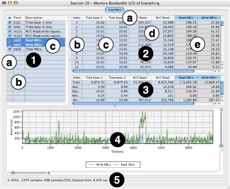

When you switch to the _Counters_ tab in a session made with timed performance counters, a _Counters_ menu will appear in the menu bar. You can also access this menu by control-clicking (or right-clicking, with a 2-button mouse) in the _Results table_, as shown in Figure 4-12.

__Figure 4-12__  Counters Menu

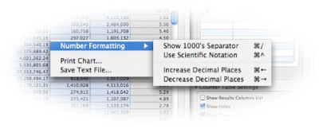

This menu contains several commands that allow you to work with the performance results:

- __Number Formatting__— This submenu lets you adjust how the (often quite large) numbers are displayed in the _Results Table_:

  - _Show 1000’s Separator_— Add thousands separators (typically commas) to the values. You can also choose this using the keyboard shortcut _Command-/_.
  - _Use Scientific Notation_— Toggles between standard (e.g. 100) and scientific (1.0E2) notation. You can also choose this using the keyboard shortcut _Command-^_.
  - _Increase Decimal Places_— Increases the number of digits of precision used to display floating-point values by one decimal place. Because performance event counts are integers, this normally only affects shortcut equation results and timebase columns. You can also choose this using the keyboard shortcut _Command-←_.
  - _Decrease Decimal Places_— Decreases the number of digits of precision used to display floating point values by one decimal place. Because performance event counts are integers, this normally only affects shortcut equation results and timebase columns. You can also choose this using the keyboard shortcut _Command-→_.
- __Print Chart…__— Allows you to print the currently displayed chart, using a standard Mac _Print_ dialog box.
- __Save Text File…__— Exports the current _Results Table_ values as a comma-separated value (CSV) format text file. This resulting text can be imported into an application like Excel for further analysis.

With the session window in the foreground, select _Window_→_Show Advanced Settings_ (_Command-Shift-M_), as we described earlier in [Advanced Settings Drawer](Getting%20Started%20with%20Shark.md#apple-f4xwc4dqnrsv64tfmyxwi33df52wszbpkridimbqga2temztfvbuqmrnknlts). The palette of advanced controls will appear (Performance Counter Spreadsheet Advanced Settings).

__Figure 4-13__  Performance Counter Spreadsheet: Advanced Settings

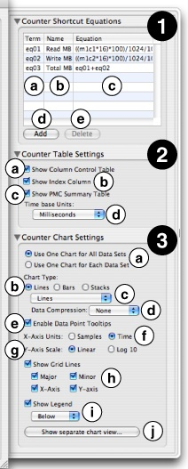

This drawer contains three main panels, each with many different controls that affect the presentation of results:

1. __Counter Shortcut Equations__— This table displays the “Shortcut Equations” used to generate each of the computed results columns in the _Results Table_, one equation per row. Both equations that were included right in the configuration and ones that you add yourself after the session has been recorded are listed here, and you can freely edit any of them here. The table consists of a few fairly straightforward parts:

   1. _Term column_— This column lists the “term” name for this equation (usually eq01, eq02, etc.). This is the shorthand name that you can use to include the results of this equation in a subsequent, dependent equation. These “term” names, plus the “term” names for the original performance counter data, are also listed in the _Column Control Table_ described previously in [Timed Counters: The Performance Counter Spreadsheet](#apple-f4xwc4dqnrsv64tfmyxwi33df52wszbpkridimbqga2temztfvbuqnrnknlto).
   2. _Name column_— Here is where you may edit the label that will appear as the column header for this shortcut equation’s results.
   3. _Equation column_— You can define or edit the equation used to calculate the entries in the shortcut column here, using the techniques described below in [Adding Shortcut Equations](#apple-f4xwc4dqnrsv64tfmyxwi33df52wszbpkridimbqga2temztfvbuqnrnknlte).
   4. _Add button_— Creates a new “shortcut equation” and a _Results Table_ column for it..
   5. _Delete button_— Removes the selected shortcut(s) and their associated columns from the _Results Table_.
2. __Counter Table Settings__— This section of the drawer lets you adjust the appearance of the tables within the counter spreadsheet window.

   1. _Show Column Control Table_— Toggles display of the _Column Control Table_ to the left side of the _Results Table_.
   2. _Show Index Column_— Toggles view of the index column in the _Results Table_.
   3. _Show PMC Summary Table_— Toggles display of the _PMC Summary Table_ below the _Results Table_.
   4. _Timebase Units popup_— Allows you to change the units used in the time base column(s) to something more appropriate. Selections are listed in order of increasing size: CPU cycles, bus cycles, microseconds, milliseconds (default), and seconds.
3. __Counter Chart Settings__— This section of the drawer lets you adjust the appearance of the chart within the counter spreadsheet window.

   1. _Multiple Data Set Chart Mode_— These buttons select how you would like the chart to display when multiple columns are selected:

      - One combined chart for all selected result columns
      - Separate charts for each selected column
   2. _Chart Type_— Selects the type of chart that will be displayed:

      - _Lines_— Display results as line charts. There are several sub-options for displaying these charts, which can be selected using the two menus below.
      - _Bars_— Display results using a vertical bar chart. Bars from multiple selected columns will be superimposed over one another.
      - _Stacks of Bars_— Display results as stacked vertical bar charts, with the values from all selected columns added together at each sample point. This chart is identical to the standard bar chart if only one column is selected
   3. _Line Chart Subtype_— This menu fine-tunes line charts by controlling the display of symbols at data points on the line charts:

      - _Lines and Markers_— Display both symbols at each data point and lines to join them up.
      - _Lines_— (default) Only displays lines joining the data points together.
      - _Markers_— Only displays symbols at each data point.
      - _Small Markers_— Same as previous, but the symbols are significantly smaller.
   4. _Line Chart Data Compression_— This menu lets you apply filters to smooth out the data plotted using a line chart. These filtering options are not allowed with bar and stacked bar charts.

      - _Average_— Applies a moving average (FIR) filter to the data in order to smooth it out.
      - _IIR Filter_— Applies an IIR averaging filter to the data to smooth it out.
      - _None_— (default) No smoothing applied, so you see only actual values.
   5. _Enable Data Point Tool Tips_— When enabled, hovering the mouse pointer over a data point in a data set shows the x- and y-values for that point in a pop-up window.
   6. _X-Axis Units_— The horizontal scale can be plotted in two ways:

      - _Elapsed Time_— The elapsed time since the beginning of the session, in the units specified with the _Timebase Units popup_ above.
      - _Sample count_— The sample index, or values from the index column.
   7. _Y-Axis Scale_— Data can be plotted vertically on a linear or logarithmic (base 10) scale.
   8. _Show Grid Lines_— This lets you control the display of grid lines within the chart. You can toggle all grid lines together or independently toggle major grid lines, minor grid lines, x-axis (all vertical) grid lines, and y-axis (all horizontal) grid lines.
   9. _Show Legend_— Toggles whether or not to show a legend, displaying color-to-data column associations, along with the chart. When enabled, you can select the position of the legend for the chart — above, to the right, or below — using the popup menu just below.
   10. _Show/Hide Separate Chart View..._— This opens or closes a separate window for the chart view, freeing it from its normal position below the _Results Table_. While it does not enable any new functionality, this option can be useful if you have a widescreen display, and want to position the _Results Table_ and _Results Chart_ side-by-side instead of top-and-bottom, or if you have multiple monitors attached to your Macintosh and would like to put the _Results Table_ and _Results Chart_ on different screens.

This section gives a brief summary of how to add new “shortcut equation” results columns to your performance counter spreadsheet. For a full description of all the capabilities of shortcut equations, see [Using the Editor](Custom%20Configurations.md#apple-f4xwc4dqnrsv64tfmyxwi33df52wszbpkridimbqga2temztfvbuqobnknltcna).

1. Open up the _Advanced Settings_ drawer, if you do not already have it open.
2. Click the “Add” button, in the _Counter Shortcut Equations_ palette, and enter a name for your new equation.
3. Double-click on the “Equation” field in the row for your new equation, and enter your equation. You may use any terms from previous columns (using the short names in the term list from the _Column Control Table_) and numeric constants, combined using simple 4-function arithmetic — addition (+), subtraction (-), multiplication (\*), and division (/).
4. Press _Enter_ when you are done editing your equation. A new column will immediately appear in the Results Table with the results from your computation. You may then examine, graph, or use the numbers in that column in subsequent equations, just as if they had been there from the start.

Like Time Profiling, using performance counters in “timed counter” mode only performs timed sampling of the various counters, giving you a set of samples with a statistical view of how your application works. However, you may want record more exact information, more like what you can record using System Trace. This is possible using _event sampling_, which is used by the default _L2 Cache Miss Profile_ configurations. In this case, you set up a performance counter to interrupt the processor and record a new sample after it has counted a predetermined number of events. Because hardware events happen quickly, you will usually want to have this be a fairly large number, but with some lower-frequency counters it is possible to set the value as low as 1, allowing you to get an exact event trace.

When complete, a standard profile browser will appear, which looks much like the ones created for _Time Profiling_ (see [Profile Browser](Time%20Profiling.md#apple-f4xwc4dqnrsv64tfmyxwi33df52wszbpkridimbqga2temztfvbuqmznknltcoi)). However, the results must be interpreted quite differently. Because of the unusual way that sampling is triggered, the sample percentages (or counts) do not represent _time_ percentages, but instead show _event_ percentages. This distinction is _not_ clearly marked on the columns, so you must be careful when reading and interpreting the results. With these results presented in this way, you can get a good idea about which routines and even which lines of code are responsible for causing the largest number of performance-draining events, such as L2 cache misses, in a manner that is completely analogous to interpreting a conventional _Time Profile_.

Event sampling can only be triggered by a single PMC at a time, so you can only trigger on a single event type (such as L2 misses or off-chip data movement) per session. The value of other counters can be recorded at the same time, but they cannot be used as triggers. While this can be a serious disadvantage, it is balanced out by the fact that you are able to capture your program’s callstack _exactly_ where the event is occuring, allowing you to see exactly which lines of code are causing the events, instead of the approximate locations returned by “counter” mode profiling. In general, if you need to visualize system-wide or process-wide performance events over time without associating performance events to a specific piece of code, the timed counter method is appropriate. On the other hand, if you need to associate performance events precisely with source code that is causing the event to occur, then event sampling is the better choice. These various pros and cons are summarized below:

|  | Timer Sampling | Event Sampling |
| --- | --- | --- |
| Pros | - Measure multiple performance events over time. - Produce meaningful system and process level chart of performance events. - Works with any processor. - Results are easy to interpret on multiprocessors. | - Very precise; can relate performance events to a small window of instructions. |
| Cons | - Normally no correlation with your code. - With callstack recording enabled (see below), event-code correlation is very approximate. | - Trigger on only a single performance event per session. - No chart of performance events. - It is harder to interpret results on multiprocessors, since events do not occur simultaneously on all processors. - Not available on older PowerPC processors (G3 and G4). |

While none of the default configurations use this capability, it is also possible to essentially record callstacks like a _Time Profile_ simultaneously with timed counter information, giving you timed counter recording with a way to approximately correlate results with your code, by building your own custom configuration. In this case, the chart view adds new graphs that allow you to look for correlations between performance monitor counts and what code was running at the time a sample was taken, merging elements of the Counters viewer in with the standard _Time Profile_ chart view. An example of using the Chart view with PMCs in counter mode (raw values graphed over time) is shown in Figure 4-14. With these graphs, you can click on them at any point to see the callstacks that correspond with that part of the profile. However, be aware that the callstack locations only record _approximately_ what code was executing at the time the counts were recorded, and may not be representative if the sampling rate is significantly lower than the rate at which your program calls functions. This potential defect is the reason why none of the default configurations use this technique, even though it can sometimes be useful if used judiciously.

__Figure 4-14__  Chart View with additional timed counter graphs

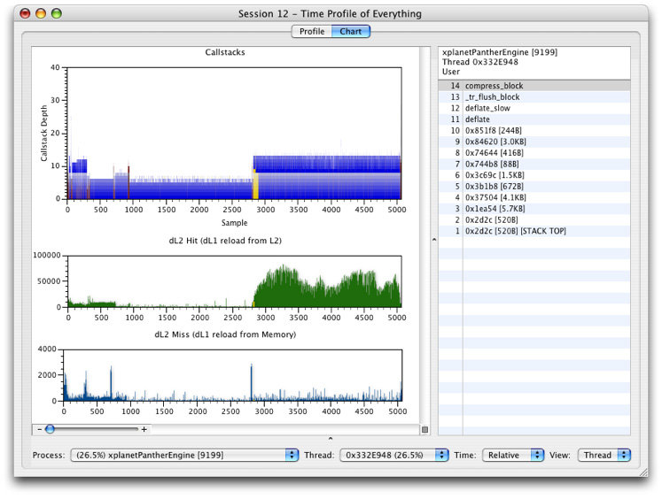

[Next](Advanced%20Profiling%20Control.md)[Previous](System%20Tracing.md)

