> 导航：[总目录](../../../README.md) · [documentation](../../../_indexes/documentation.md) · [Shark User Guide](Introduction.md)


[Next](Other%20Profiling%20and%20Tracing%20Techniques.md)[Previous](Time%20Profiling.md)

# System Tracing

Shark’s _System Trace_ configuration records an exact trace of system-level events, such as system calls, thread scheduling decisions, interrupts, and virtual memory faults. _System Trace_ allows you to measure and understand how your code interacts with Mac OS X and how the threads in your multi-threaded application interact with each other. If you would like to gain a clear understanding of the multi-threaded behavior of a given program, characterize user vs. system processor utilization, or understand the virtual memory paging behavior of your application, then _System Trace_ can give you the necessary insight.

_System Trace_ complements Shark’s default _Time Profiling_ configuration (see [Time Profiling](Time%20Profiling.md#apple-f4xwc4dqnrsv64tfmyxwi33df52wszbpkridimbqga2temztfvbuqmznknltc)) by allowing you to see _all_ transitions between OS and user code, a useful complement to the statistical sampling techniques used by _Time Profiling_. For example, in Basic Usage we can see an example of a thread of execution sampled by both a _Time Profile_ (on top) and a _System Trace_ (on the bottom). Time profiling takes evenly-spaced samples over the course of time, allowing us to get an even distribution of samples from various points of execution in both the user and system code segments of the application. This gives us a statistical view of what the processor was doing, but it does not allow us to see all user-kernel transitions — the first, brief visit to the kernel is completely missed, because it falls between two sample points. System tracing, in contrast, records an event for each user-kernel transition. Unlike time profiling, this does not give us an overview of _all_ execution, because we are looking only at the transition borders and never in the execution time between them, but we gain an _exact_ view of all of the transitions. This precision is often more useful when debugging user-kernel and multithreading problems, because these issues frequently hinge upon managing the precise timing of interaction _events_ properly in order to minimize the time that threads spend waiting for resources (blocked), as opposed to minimizing execution time.

__Figure 3-1__  Time Profile vs. System Trace Comparison

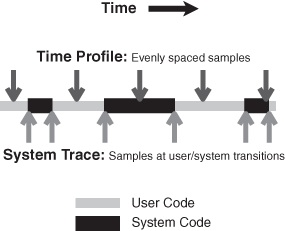

As with most other profiling options available from Shark, System Trace requires no modification of your binaries, and can be used on released products. However, it is possible to insert arbitrary events into the System Trace Session using _Sign Posts_, which are discussed in detail in [Sign Posts](#apple-f4xwc4dqnrsv64tfmyxwi33df52wszbpkridimbqga2temztfvbuqnbnknltc), if the built-in selection of events simply does not record enough information.

In its simplest usage, all you need to do is select System Trace from the Configuration Popup and start sampling. Shark will then capture up to 1,000,000 system events per-processor (a user-tunable limit), process the results, and display a session (see [Interpreting Sessions](#apple-f4xwc4dqnrsv64tfmyxwi33df52wszbpkridimbqga2temztfvbuqnbnknlte)). In most cases, this should be more than enough data to interpret. Note that you cannot select a single process before you start tracing using the standard pop-up menu (from [Main Window](Getting%20Started%20with%20Shark.md#apple-f4xwc4dqnrsv64tfmyxwi33df52wszbpkridimbqga2temztfvbuqmrnknlti)); instead, if you only want to see a trace for a specific process or thread, you must narrow the _scope_ of the traced events _after_ the session is recorded (see [Interpreting Sessions](#apple-f4xwc4dqnrsv64tfmyxwi33df52wszbpkridimbqga2temztfvbuqnbnknlte)).

In order to allow direct correlation of system events to your application’s code, Shark records the following information with each event:

- Start Time
- Stop Time
- A backtrace of the user-space function calls (callstack) associated with each event
- Additional data customized depending on the event type that triggers recording (see [Trace View In-depth](#apple-f4xwc4dqnrsv64tfmyxwi33df52wszbpkridimbqga2temztfvbuqnbnknltcmi) for details)

In the course of profiling your application, it may become necessary to trim or expand the number of events recorded. Most of the typical options are tunable by displaying the Mini Config Editor, depicted in Figure 3-2.

__Figure 3-2__  System Trace Mini Config Editor

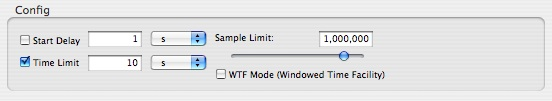

The Mini Config Editor adds the following profiling controls to the main Shark window:

1. __Start Delay__— Amount of time to wait after the user selects “Start” before data collection actually begins.
2. __Time Limit__— The maximum amount of time to record samples. This is ignored if _Windowed Time Facility_ is enabled, or if Sample Limit is reached before the time limit expires.
3. __Sample Limit__ — The maximum number of samples to record. Specifying a maximum of _N_ samples will result in at most _N_ samples being taken, even on a multi-processor system, so this should be scaled up as larger systems are sampled. On the other hand, you may need to reduce the sample limit if Shark runs out of memory when you attempt to start a system trace, because it must be able to allocate a buffer in RAM large enough to hold this number of samples. When the sample limit is reached, data collection automatically stops, unless the _Windowed Time Facility_ is enabled (see below). The Sample Limit is always enforced, and cannot be disabled.
4. __Windowed Time Facility__— If enabled, Shark will collect samples until you explicitly stop it. However, it will only store the last N samples, where N is the number entered into the Sample Limit field. This mode is described in [Windowed Time Facility (WTF)](Advanced%20Profiling%20Control.md#apple-f4xwc4dqnrsv64tfmyxwi33df52wszbpkridimbqga2temztfvbuqmjtfvjvomi).

If the user-level callstacks associated with each system event are of no interest to you, it is possible to disable their collection from within the Plugin Editor for the System Trace Data Source (see [System Trace Data Source PlugIn Editor](Custom%20Configurations.md#apple-f4xwc4dqnrsv64tfmyxwi33df52wszbpkridimbqga2temztfvbuqobnknltcoi)), further reducing the overhead of system tracing. With callstack recording disabled, Shark will still record the instruction pointer associated with each event, but will not record a full callstack. Since most system calls come from somewhere within library code, you may lose some ability to relate system events to your code with callstack recording disabled.

Upon opening a System Trace session, Shark will present you with three different views, each in a separate tab. Each viewer has different strengths and typical usage:

- The _Summary View_ provides an overall breakdown of where and how time was spent during the profiling session, and is very analogous to the _Profile Browser_ used with Time Profile. You can use this information to ensure your application is behaving more-or-less as expected. For example, you can see if your program is spending approximately the right amount of time in system calls that you were expecting. You can even click on the System Call Summary to find out _which_ system calls are being used and open the disclosure triangles to see where, _in your code_, these calls are happening.
- The _Trace View_ provides a complete trace of system events during the profiling session. Does the Summary View show that your CPU-bound threads are only getting an average of 200 microseconds of processor time every time they are scheduled? Flip to the Trace View to see why your threads are blocking so soon.
- The _Timeline View_ provides a complete picture of system activity over the course of a session, similar to Time Profile’s _Chart View_. You can use it to verify that your worker threads are running concurrently across all the processors in your system, or to visually inspect when various threads block.

All views show trace events from a configurable _scope_ of your System Trace. The default scope is the entire system, but you can also focus the session view on a specific process, and even a specific thread within that process. Independently, you can choose to only view events from a single CPU. For example, when focusing on CPU 1 _and_ thread 2, you will see only the events caused by thread 2 that also occurred on CPU 1. The current settings for the scope are set using the three popup menus at the bottom of all System Trace session windows, which select process, thread, and CPU, respectively.

The _Summary View_ is the starting point for most types of analysis, and is shown in Figure 3-3. Its most salient feature is a pie chart that gives an overview of where time was spent during the session. Time is broken down between user, system call, virtual memory fault, interrupt, idle, and other kernel time.

__Figure 3-3__  Summary View

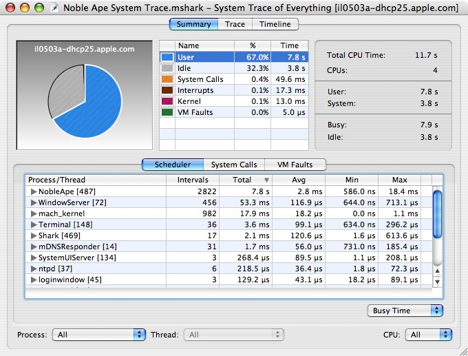

Underneath the pie chart, there are individual summaries of the various event types. Each of these is discussed in turn in the following subsections.

The _Scheduler Summary_ tab, shown in Figure 3-4, summarizes the overall scheduling behavior of the threads running in the system during the trace. Each thread is listed in the outline underneath its owning process, as shown at (1). To the left of each thread’s name, Shark displays the number of run intervals of that thread (or all threads within a process) that it recorded in the course of this session.

__Figure 3-4__  Summary View: Scheduler

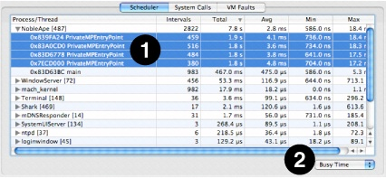

The _Total_, _Avg_, _Min_ and _Max_ columns list the total, average, minimum, and maximum values for the selected metric. A popup button below the outline (2) lists the supported metrics:

- __Busy Time__— Total time spent running, including both user and non-idle system time
- __User Time__— Total time spent running in user space
- __System Time__— Total time spent running in supervisor space (kernel and driver code)
- __Priority__— Dynamic thread priority used by the scheduler

Information about how your application’s threads are being scheduled can be used to verify that what is actually happening on the system matches your expectations. Because the maximum time that a thread can run before it is suspended to run something else (the maximum _quantum_ or _time slice_) is 10ms on Mac OS X, you can expect that a CPU-bound thread will generally be scheduled for several milliseconds per thread tenure. If you rewrite your CPU-bound, performance-critical code with multiple threads, and System Trace shows that these threads are only running for very short intervals (on the order of microseconds), this may indicate that the amount of work given to any worker thread is too small to amortize the overhead of creating and synchronizing your threads, or that there is a significant amount of serialization between these threads.

The _System Calls Summary_ tab, shown in Figure 3-5, allows you to see the breakdown of system call time for each specific system call. Because System Trace normally records the user callstack for each system call, you can use this view to correlate system call time (and other metrics) directly to the locations in your application’s code that make system calls. This view is quite similar to Time Profile’s standard profile view, described in [Profile Browser](Time%20Profiling.md#apple-f4xwc4dqnrsv64tfmyxwi33df52wszbpkridimbqga2temztfvbuqmznknltcoi). In fact, many of the same tools are available. For example, the system call profile can be viewed as either a heavy or tree view (selected using the popup menu at the bottom). Similarly, data mining can be used to simplify complex system call callstacks (see [Data Mining](Advanced%20Session%20Management%20and%20Data%20Mining.md#apple-f4xwc4dqnrsv64tfmyxwi33df52wszbpkridimbqga2temztfvbuqnznknltc)).

More settings for modifying this display are available in the _Advanced Settings_ drawer, and are described in [Summary View Advanced Settings](#apple-f4xwc4dqnrsv64tfmyxwi33df52wszbpkridimbqga2temztfvbuqnbnknltemi).

__Figure 3-5__  Summary View: System Calls

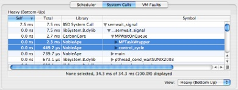

The _VM Faults Summary_ tab, depicted in Figure 3-6, allows you to see what code is causing virtual memory faults to occur. The purpose of this view is to help you find behavior that is normally transparent to software, and is obscured in a statistical time profile. Functionally, it acts just like the _System Calls Summary_ tab.

By default, virtual memory faults are broken down by type:

- __Page In__— A page was brought back into memory from disk.
- __Page Out__— A page was pushed out to disk, to make room for other pages.
- __Zero Fill__— A previously unused page marked “zero fill on demand” was touched for the first time.
- __Non-Zero Fill__— A previously unused page _not_ marked “zero fill on demand” was touched for the first time. Generally, this is only used in situations when the OS knows that page being allocated will immediately be overwritten with new data, such as when it allocates I/O buffers.
- __Copy on Write (COW)__— A shared, read-only page was modified, so the OS made a private, read-write copy for this process.
- __Page Cache Hit__— A memory-resident but unmapped page was touched.
- __Guard Fault__— A page fault to a “guard” page. These pages are inserted just past the end of memory buffers allocated using the special MacOS X “guard malloc” routines, which can be used in place of normal memory allocations during debugging to test for buffer overrun errors. One of these faults is generated when the buffer overruns.
- __Failed Fault__— Any page fault (regardless of type) that started and could not be completed. User processes will usually die when these occur, but the kernel usually handles them more gracefully in order to avoid a panic.

In some cases, virtual memory faults can represent a significant amount of overhead. For example, if you see a large amount of time being spent in zero fill faults, and correlate it to repeated allocation and subsequent deallocation of temporary memory in your code, you may be able to instead reuse a single buffer for the entire loop, reallocating it only when more space is needed. This type of optimization is especially useful in the case of very large (multiple page) allocations.

More settings for modifying this display are available in the _Advanced Settings_ drawer, and are described in [Summary View Advanced Settings](#apple-f4xwc4dqnrsv64tfmyxwi33df52wszbpkridimbqga2temztfvbuqnbnknltemi).

__Figure 3-6__  Summary View: VM Faults

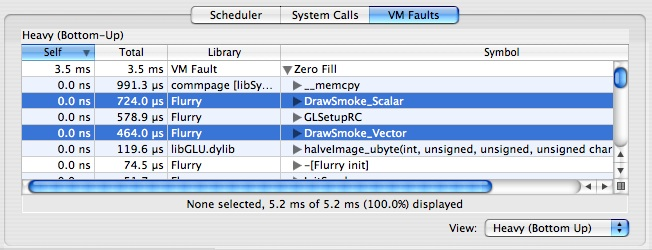

When you are viewing the _System Calls Summary_ and _VM Faults Summary_ tabs, several options are available in the _Advanced Settings_ drawer (see [Advanced Settings Drawer](Getting%20Started%20with%20Shark.md#apple-f4xwc4dqnrsv64tfmyxwi33df52wszbpkridimbqga2temztfvbuqmrnknlts)), as seen in Figure 3-7:

1. __Weight By Popup__— the summary can construct the profile of system calls using several metrics. The following metrics can be selected:

   - _CPU Time_— Total system call or fault time spent actively running on a processor
   - _Wait Time_— Total system call or fault time spent blocked waiting on a resource or event
   - _Total Time_— Total system call or fault time, including both CPU and waiting time
   - _Count_— Total system call or fault count
   - _Size_— (VM fault tab only) Total number of bytes faulted, since a single fault can sometimes affect more than one page
2. __Display Popup__— This lets you choose between having the _Self_ and _Total_ columns display the raw _Value_ for the selected metric or the percent of total system call or fault time. You can also change the columns between these modes individually by double clicking on either column.
3. __Group by System Call/VM Fault Type__— By default, the metrics are listed for each of the different _types_ of system calls or faults in the trace. You can see summary statistics for all system calls or faults by deselecting this.
4. __Callstack Data Mining__— The System Call and VM Fault summaries support Shark’s data mining options, described in [Data Mining](Advanced%20Session%20Management%20and%20Data%20Mining.md#apple-f4xwc4dqnrsv64tfmyxwi33df52wszbpkridimbqga2temztfvbuqnznknltc), which can also be used to customize the presentation of the data.

__Figure 3-7__  Summary View Advanced Settings Drawer

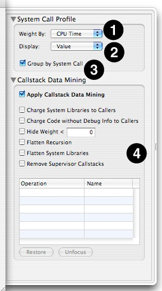

The _Trace View_ lists _all_ of the events that occurred in the currently selected scope. Because events are most commonly viewed with “System” scope (all processes _and_ all CPUs), each event list has a _Process_ and a _Thread_ column describing the execution context in which it took place.

As with the _Summary View_, the _Trace View_ is sub-divided according to the class of event. The events in each _event class_ (scheduler events, system calls, and VM Faults) are separately indexed, starting from 0. Each tab in the _Trace View_ lists the index of the event (specific to each event class) in the _Index Column_.

Each tab in the _Trace View_ supports multi-level (hierarchical) sorting of the event records, based on the order that you click column header row cells. This provides an extremely flexible means for searching the event lists. For example, clicking on the “CPU Time” column title will immediately sort by CPU Time. If you then click on the “Name” column title Shark will group events by Name, and then within each group of identically named events it will sort secondarily by CPU Time.

You may click on events in the table to select them. As with most Mac tables, you may Shift-click to extend a contiguous selection or Command-click to select discontiguous events. Below the main _Trace View_ table, Shark presents a line summarizing key features of the selected trace event(s). This is particularly convenient if you select multiple events at once, because Shark will automatically add up key features of the selected events together and present the totals here.

You should note that double-clicking on any event in the trace list will jump to that event in the _Timeline View_. This is a helpful way to go directly to a spot of interest in a System Trace, because you can reliably scroll to the same point by double-clicking on the same trace element.

The remainder of this section will examine the three different tabs in the trace view window.

The _Scheduler Trace_ Tab, shown in Figure 3-8, lists the intervals that threads were running on the system. The meanings of the columns are as follows:

- __Index__— A unique index for the thread interval, assigned by Shark
- __Process__— Shows the process to which the scheduled thread belongs. The process’ PID is in brackets after the name, which can be helpful if you have multiple copies of a process running simultaneously.
- __Thread__— The kernel’s identifier for the thread
- __Time__— Total time (the sum of user and system time) that the thread ran
- __User Time__— Time that the thread spent executing user code during the interval
- __Sys Time__— Time that the thread spent executing system (kernel) code during the interval
- __Δt Prev__— Time since this thread was previously scheduled
- __Reason__— Reason that the thread tenure ended (described in [Thread Run Intervals](#apple-f4xwc4dqnrsv64tfmyxwi33df52wszbpkridimbqga2temztfvbuqnbnknltemy))
- __Priority__— Dynamic scheduling priority of the thread

__Figure 3-8__  Trace View: Scheduler

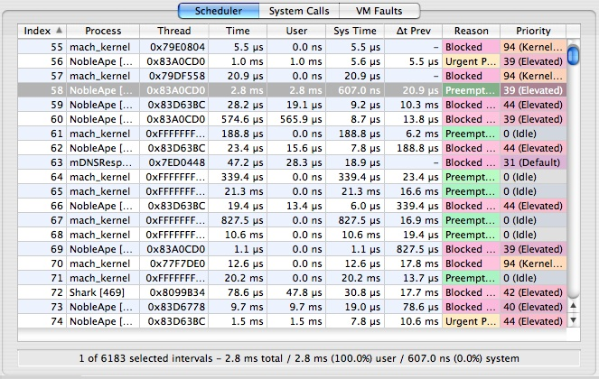

The _System Call Trace_ Tab, shown in Figure 3-9, lists the system call events that occurred during the trace. In most respects, this Tab behaves much like the scheduler tab described previously, but it does have a couple of new features.

You can inspect the first five integer arguments to each system call by selecting an entry in the table and looking at the `arg` fields near the bottom of the window.

The current user callstack is recorded for each system call. You can toggle the display of the _Callstack Table_ by clicking the 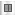 button in the lower right corner of the trace table. When visible, the _Callstack Table_ displays the user callstack for the currently selected system call entry.

The meanings of the columns are as follows:

- __Index__— A unique index for the system call event, assigned by Shark
- __Interval__— Displays thread run interval(s) in which the system call occurred. Each system call occurs over one or more thread run intervals . If the system call begins and ends in the same thread interval, the _Interval Column_ for that event lists only a single number: the index of the thread interval in which the event occurred. Otherwise, the beginning and ending thread interval indices are listed. Because it is possible for an event to start before the beginning of a trace session, or end after a trace session is stopped, event records may be incomplete. Incomplete events are listed with “?” for the unknown thread run interval index, and have a gray background in the event lists.
- __Process__— Shows the process in which the system call occurred. The process’ PID is in brackets after the name, which can be helpful if you have multiple copies of a process running simultaneously.
- __Thread__— Thread in which the system call occurred
- __Name__— Name of the system call
- __Return__— Shows the return value from the system call. Many system calls return zero for success, and non-zero for failure, so you can often spot useless system calls by looking for multiple failures. Eliminating streams of these can reduce the amount of time an application spends in wasted system call overhead.
- __CPU Time__— Time spent actively running on a processor
- __Wait Time__— Time spent blocked waiting on a resource or event

__Figure 3-9__  Trace View: System Calls

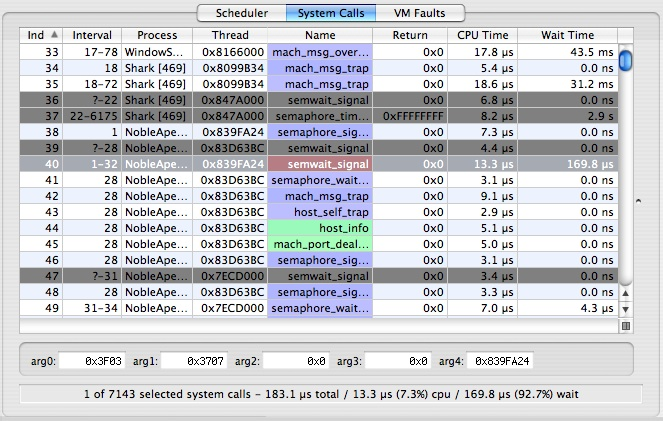

The _VM Fault Trace_ Tab, illustrated in Figure 3-10, lists the virtual memory faults that occurred. The current user callstack, if any, is recorded for each VM fault.

You can toggle the display of the _Callstack Table_, which displays the user callstack for the currently selected VM fault entry, by clicking the  button in the lower right corner of the trace table.

The columns in the trace view have the following meanings in this tab:

- __Index__— A unique index for the VM fault event, assigned by Shark
- __Interval__— Displays thread run interval(s) in which the VM fault occurred. Each fault occurs over one or more thread run intervals. If the fault begins and ends in the same thread interval, the _Interval Column_ for that event lists only a single number: the index of the thread interval in which the event occurred. Otherwise, the beginning and ending thread interval indices are listed. Because it is possible for an event to start before the beginning of a trace session, or end after a trace session is stopped, event records may be incomplete. Incomplete events are listed with “?” for the unknown thread run interval index, and have a gray background in the event lists.
- __Process__— Shows the process in which the VM fault occurred. The process’ PID is in brackets after the name, which can be helpful if you have multiple copies of a process running simultaneously.
- __Thread__— Thread in which the VM fault occurred
- __Type__— Fault type (see [Virtual Memory (VM) Faults Summary](#apple-f4xwc4dqnrsv64tfmyxwi33df52wszbpkridimbqga2temztfvbuqnbnknlteoi) for descriptions)
- __CPU Time__— Time spent actively running on a processor
- __Wait Time__— Time spent blocked waiting on a resource or event
- __Library__— In the case of a code fault, this lists the framework, library, or executable containing the faulted address. In contrast, it is blank for faults to data regions, such as the heap or stack.
- __Address__— Address in memory that triggered the fault
- __Size__— Number of bytes affected by the fault, an integral multiple of the 4096-byte system page size

__Figure 3-10__  Trace View: VM Faults

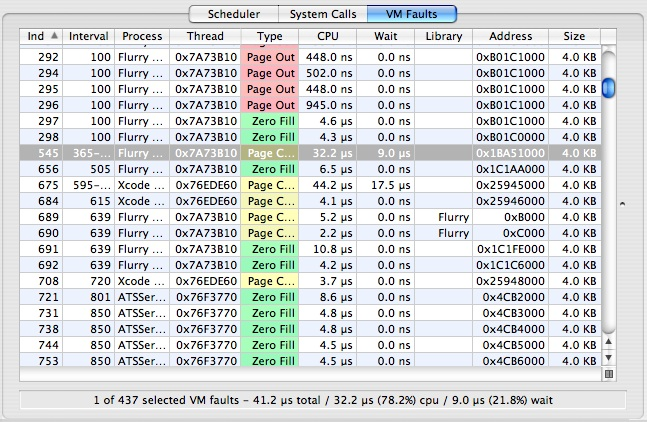

The _Timeline View_, displayed in Figure 3-11, allows you to visualize a _complete_ picture of system events and threading behavior in detail, instead of just summaries. Each row in the timeline corresponds to a traced thread, with the horizontal axis representing time. At a glance, you can see when and why the threads in your system start and stop, and how they interact with the system when they are running.

Session timelines are initially shown in their entirety. Because a typical session has thousands or millions of events in it, this initially means that you can only see a broad overview of when threads are running. Events such as system calls and VM faults are labeled with icons, but these icons are automatically hidden if there is insufficient space to display them, as is usually the case when the trace is completely zoomed out. Hence, to see and examine these events, you will need to zoom in on particular parts of the timeline display and then maneuver around to see other parts of the display. There are 3 main ways to perform this navigation:

- __Scroll/Zoom Bars__— Use the scroll bar at the bottom of the window to scroll side to side, and zoom with the slider at the top of the window.
- __Mouse Dragging__— Click and drag anywhere (or “rubber-band”) within the main Timeline View to form a box. When you release the mouse bottom, the Timeline View will zoom so that the horizontal portion of the box fits on screen (until you reach the maximum zoom level).
- __Keyboard Navigation__— After highlighting a Thread Run Interval by clicking on it, the Left or Right Arrow keys will take you to the previous or next run interval from the same thread, respectively. If you highlighted a System Call, VM Fault, or Interrupt, the arrow keys will scroll to the next event of any of these types. Holding the Option key, however, will scroll to the next event of the _same_ type. For example, if you had clicked on a Zero Fill Fault, the Right Arrow would take you to the next event on the same thread, whether it was a System Call, VM Fault, or Interrupt, but Option-Right Arrow would take you to the next Zero Fill Fault on the same thread.

If you have too many threads, the _Timeline View_ allows you to limit the scope of what is displayed using the standard scope-control menus described in [Interpreting Sessions](#apple-f4xwc4dqnrsv64tfmyxwi33df52wszbpkridimbqga2temztfvbuqnbnknlte), at the bottom of the window. There are also many options for filtering out events in the _Advanced Settings_ drawer, as described in [Timeline View Advanced Settings](#apple-f4xwc4dqnrsv64tfmyxwi33df52wszbpkridimbqga2temztfvbuqnbnknltemq).

__Figure 3-11__  Timeline View

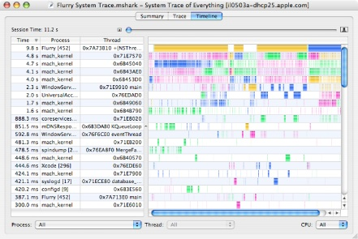

Each time interval that a thread is actively running on a CPU is a _thread run interval_. Thread run intervals are depicted as solid rectangles in the _Timeline View_, as is shown in Figure 3-12, with lines depicting context switches joining the ends of the two threads running before and after each context switch.

__Figure 3-12__  Timeline View: Thread Run Intervals

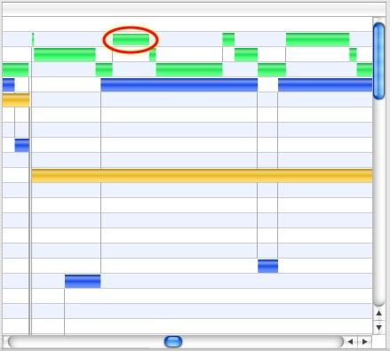

Thread interval lines can be colored according to several metrics, including the CPU on which the thread ran, its dynamic priority, and the reason the thread was switched out. See [Timeline View Advanced Settings](#apple-f4xwc4dqnrsv64tfmyxwi33df52wszbpkridimbqga2temztfvbuqnbnknltemq) for more information on how to control this.

You can inspect any thread run interval in the Timeline View by clicking on it. The inspector (see Figure 3-13) will indicate the amount of time spent running in user mode and supervisor mode, the reason the thread was switched out, and its dynamic priority.

__Figure 3-13__  Thread Run Interval Inspector

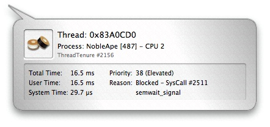

There are five basic reasons a thread will be switched out by the system to run another thread:

- __Blocked__— The thread is waiting on a resource and has voluntarily released the processor while it waits.
- __Explicit Yield__— The thread voluntarily released its processor, even though it is not waiting on any particular resource.
- __Quantum Expired__— The thread ran for the maximum allowed time slice, normally 10ms, and was therefore interrupted and descheduled by the kernel.
- __Preemption__— A higher priority thread was made runnable, and the thread was interrupted in order to switch to that thread. It is also possible to be “urgently” preempted by some real-time threads.
- __Urgent Preemption__— Same as previous, except that the thread preempting us _must_ have the processor immediately, usually due to real-time constraints.

System calls represent explicit work done on behalf of the calling process. They are a secure way for user-space applications to employ kernel APIs. On Mac OS X, these APIs can be divided into four groups:

- __BSD__— Syscall, ioctl, sysctl APIs
- __Mach__— Basic services and abstractions (ports, locks, etc.)
- __Locks__— _pthread mutex_ calls that trap to the kernel. These are a subset of Mach system calls.
- __MIG Message__— Mach interface generator routines, which are usually only used within the kernel

__Figure 3-14__  Timeline View: System Calls

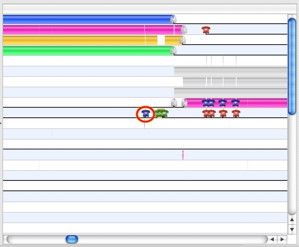

Calls from all of these groups are visible in Figure 3-14. Clicking on the icon for a system call will bring up the System Call Inspector, as seen in Figure 3-15. The resulting inspector displays many useful pieces of information which you can use to correlate the system call to you application’s code. The listed information includes:

- __Type__— The system call icon and a textual description
- __Name__— The system call name
- __Number__— The system call’s event index number (its number in the Trace View)
- __Callstack__— A backtrace of user space function calls that caused the system call
- __Time__ — Total, CPU, and wait time
- __Result__— The return value from the call
- __Arguments__— The first four integer arguments

__Figure 3-15__  System Call Inspector

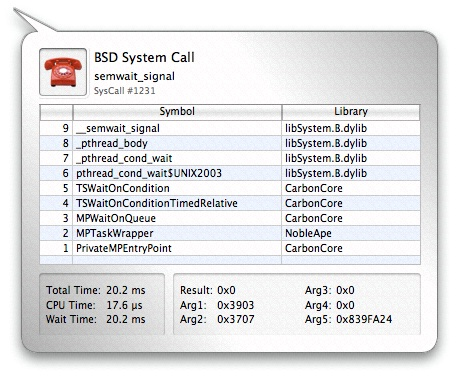

As is the case with almost all modern operating systems, Mac OS X implements a virtual memory system. Virtual memory works by dividing up the addressable space (typically 4GB on a 32-bit machine, currently 256 TB on 64-bit machines) into pages (typically 4 KB in size). Pages are brought into available physical memory from a backing store (typically a hard disk) on demand through the page fault mechanism. In addition to efficiently managing a system’s available physical memory, this added level of indirection provided by the virtual to physical address mapping allows for memory protection, shared memory, and other modern operating system capabilities. There are five virtual memory events on Mac OS X, all of which are faults (running code is interrupted to handle them the first time the page is touched) except for page outs, which are completed asynchronously.

- __Page In__— A page was brought back into memory from disk.
- __Page Out__— A page was pushed out to disk, to make room for other pages.
- __Zero Fill__— A previously unused page marked “zero fill on demand” was touched for the first time.
- 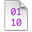__Non-Zero Fill__— A previously unused page _not_ marked “zero fill on demand” was touched for the first time. Generally, this is only used in situations when the OS knows that page being allocated will immediately be overwritten with new data, such as when it allocates I/O buffers.
- __Copy on Write (COW)__— A shared, read-only page was modified, so the OS made a private, read-write copy for this process.
- __Page Cache Hit__— A memory-resident but unmapped page was touched.
- __Guard Fault__— A page fault to a “guard” page. These pages are inserted just past the end of memory buffers allocated using the special MacOS X “guard malloc” routines, which can be used in place of normal memory allocations during debugging to test for buffer overrun errors. One of these faults is generated when the buffer overruns.
- __Failed Fault__— Any page fault (regardless of type) that started and could not be completed. User processes will usually die when these occur, but the kernel usually handles them more gracefully in order to avoid a panic.

__Figure 3-16__  Timeline View: VM Faults

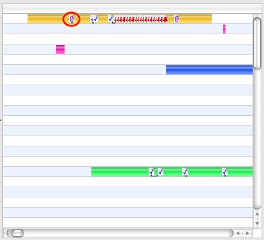

Three of these types of faults are visible in Figure 3-16. A zero-fill fault is circled to highlight it. Clicking on a VM Fault Icon will bring up the VM Fault Inspector, as seen in Figure 3-17. This inspector functions much like the System Call Inspector, except instead of listing arguments and return values, the VM Fault Inspector lists the fault address, size, and — for code faults — the library in which it occurred.

__Figure 3-17__  VM Fault Inspector

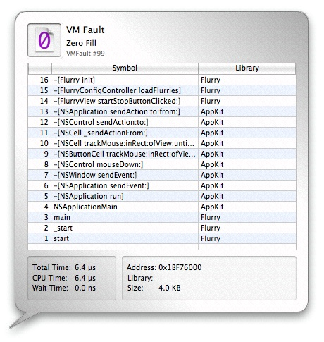

Interrupts are asynchronous signals that external hardware devices use to communicate to the processor that they require servicing. Most are associated with I/O devices, and signal either that new data has been received by an input device or that an output device needs more data to send. However, there are also other sources of interrupts inside of the computer system, such as DMA controllers and clock timers.

Here is an interrupt icon: 

Because interrupts occur asynchronously, there is no correlation between the source of the interrupt and the thread being interrupted. As a result, and because most users of System Trace are primarily interested in examining the threading behavior of their own programs, the display of interrupt events in the _Timeline View_ is disabled by default. See [Timeline View Advanced Settings](#apple-f4xwc4dqnrsv64tfmyxwi33df52wszbpkridimbqga2temztfvbuqnbnknltemq) for instructions on how to enable these.

Clicking on an Interrupt icon will bring up the Interrupt Inspector. This inspector lists the amount of time the interrupt consumed, broken down by CPU and wait time.

__Figure 3-18__  Interrupt Inspector

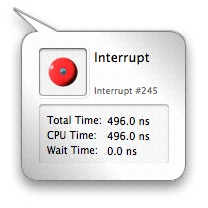

You can often get a good idea of your application’s current state by inspecting the user callstacks associated with the built-in VM fault and system call events that occur in your application. But an even more precise technique is to instrument your application with _Sign Post_ events at critical points in your code (see [Sign Posts](#apple-f4xwc4dqnrsv64tfmyxwi33df52wszbpkridimbqga2temztfvbuqnbnknltc) for instructions as to how you can do this). For example, if you are developing an application that operates on video frames, you can insert a sign post marker whenever the processing of a new frame starts.

Here is a sign post icon: 

Sign posts are displayed in the timeline alongside the other events. You can inspect each sign post by clicking its icon in the timeline. The inspector will indicate which thread it came from, its event name, the 4 user-specified ancillary data values for both the begin and the end point, and the associated user callstack (if any). If the sign post is an “interval” sign post, an under-bar will indicate its duration on the timeline, and the inspector will list the amount of time spent on the CPU and time spent Waiting between the begin and end event. Since you can supply different arguments to the start and end points of an interval sign post, the inspector supplies “Begin” and “End” tabs that display the arguments supplied to the start and end points, respectively.

__Figure 3-19__  Sign Post Inspector

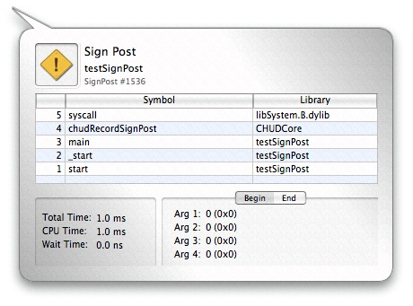

While you are in _Timeline View_, several options are available in the _Advanced Settings_ drawer (see [Advanced Settings Drawer](Getting%20Started%20with%20Shark.md#apple-f4xwc4dqnrsv64tfmyxwi33df52wszbpkridimbqga2temztfvbuqmrnknlts)), as seen in Figure 3-20.

1. __Enable Thread Coloring__— When enabled (the default), Shark attempts to color-code the threads in the timeline display using one of the algorithms selected below.
2. __Color By__— Assuming that you do choose to use thread coloring, this menu allows you to choose from among several different color schemes that allow you to see different trends:

   - __CPU__— Each CPU is assigned a different color, so you can see both how a processor is bouncing from one thread to another or, alternately, how a thread is bouncing from one processor to another. This is the default, and usually the most useful coloration.
   - __Priority__— Thread priority is assigned a color on a gradient from deep blue-violet colors (low priority) to bright, hot yellows and oranges (high priority). Mac OS X changes thread priority dynamically, depending upon how much CPU time each thread gets, so this color scheme is useful to see the effects of these dynamic changes over time.
   - __Reason__— Colors each thread run tenure based on the reason that it ended. See [Thread Run Intervals](#apple-f4xwc4dqnrsv64tfmyxwi33df52wszbpkridimbqga2temztfvbuqnbnknltemy) for a list of the possible reasons that are used to color-code thread tenures.
3. __Color Key__— Displays the colors that Shark is currently using to display your threads.
4. __Draw Context Switch Lines__— Check this to enable (default) or disable the thin gray lines that show context switches, linking the thread tenures before and after the switch that ran on the same CPU core.
5. __Detailed Event Icons__— Deselecting this instructs Shark turn off the icons that identify the various types of VM faults and system calls and just replace them with generic “plain page” VM fault and “gray phone” system call icons.
6. __Label Events__— These checkboxes allow you to enable or disable the display of event icons either entirely, by type group, or on an individual, type-by-type basis. For example, you can use them to enable interrupt icons or to remove icons for events, such as VM faults, that you may not be interested in at the present time.

__Figure 3-20__  Timeline View Advanced Settings Drawer

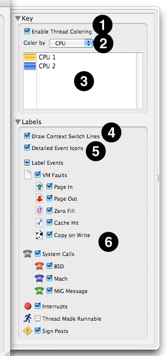

Even with all of the system-level instrumentation already included in Mac OS X, you may sometimes find that it is helpful or even necessary to further instrument your code. Whether to orient yourself within a long trace, or to time certain operations, _Sign Posts_ can be inserted in your code to accomplish these and other tasks.

Shark supports two types of Sign Posts:

- Point events (no duration)
- Interval events (with beginning _and_ ending points)

Point events can be used to orient yourself within a larger trace. For example, if you are developing an application that operates on video frames, you can insert a sign post marker whenever the processing of a new frame has begun. Interval events can be used to time operations, such as the length a particular lock is held, or how long it takes to decode a frame of video.

In order to use Sign Posts, you must first make Shark aware of your Sign Posts’ definitions. Do so by creating a _Sign Post File_. In your home directory, Shark creates a folder in which you can place Sign Post Files: `~/Library/Application Support/Shark/KDebugCodes`. A Sign Post File is _any_ file that contains specially formatted lines which associate a code value with a Sign Post name. This name can be anything you like. To create a Sign Post File, simply create a new text file in the above directory and edit it, adding one Sign Post definition per line. Each line should only contain a hexadecimal value followed by an event name, as illustrated in the following example:

__Listing 3-1__  ~/Library/Application Support/Shark/KDebugCodes/myFirstSignPosts

```
0x31 LoopTimer
0x32 LockHeld
```

Sign Post values can take any value from 0x0 to 0x3FFF, inclusive.

Once you’ve added your Sign Post File(s) to the `KDebugCodes` directory, you can add Sign Posts to your code. There are two ways to accomplish this, depending on where your code runs:

- __User Applications using CHUD Framework:__ User Applications that link with the `CHUD.framework`, and can simply call `chudRecordSignPost()`, which has the following API:

```
int chudRecordSignPost(unsigned code, chud_signpost_t type,
    unsigned arg1, unsigned arg2, unsigned arg3, unsigned arg4);
```
- __User Applications not using CHUD Framework:__ User Applications for which you prefer not to link with the `CHUD.framework` can still create signposts using explicit system calls. You will need to include `<sys/syscall.h>` and `<sys/kdebug.h>`, and then use the following call (with a “type” suffix of `NONE` for a point signpost, `START` for begin interval, and `END` for end interval):

```
syscall(SYS_kdebug_trace, APPSDBG_CODE(DBG_MACH_CHUD, <your code number>) |
    DBG_FUNC_<<type>>, arg1, arg2, arg3, arg4);
```
- __Kernel Extensions:__ Kernel Extensions _must_ call `kernel_debug()` directly, using the `APPS_DEBUG()` macro as the `debugid` argument. Using this function and macro requires you to include `<sys/kdebug.h>`, and then make your call like this (the “type” suffixes are the same as in the `syscall` case):

```
KERNEL_DEBUG(APPSDBG_CODE(DBG_MACH_CHUD, <your code number>) |
    DBG_FUNC_<<type>>, arg1, arg2, arg3, arg4, 0);
```

In both cases, the caller can record up to 4 values of user-defined data with each Sign Post that will be recorded and displayed with the session.

The Sign Post `type` must be one of the following:

- `chudPointSignPost` for a point event with no duration.
- `chudBeginIntervalSignPost` for the start point of an interval Sign Post.
- `chudEndIntervalSignPost` for the end point of an interval Sign Post.

When using interval Sign Posts, the start and end points will be coalesced into one Sign Post with a duration equal to the elapsed time between the two events. You must ensure that the same `code` value is given for both the start and end points of the interval Sign Post. It is possible to “nest” sign posts - just be sure you match the code value for each start and end point.

The example uses the Sign Post defined in the above Sign Post File to create an interval Sign Post that times a loop in a user-space application:

__Listing 3-2__  signPostExample.c

```c
#include <CHUD/CHUD.h>
#include <stdint.h>

/* This corresponds to the sign post defined above, LoopTimer */
#define LOOP_TIMER 0x31
#define ITERATIONS 1000

uint32_t ii;
  ```  ``` 
/* The last 4 arguments are user-defined, ancillary data */
chudRecordSignPost(LOOP_TIMER, chudBeginIntervalSignPost, ITERATIONS, 0, 0, 0); ```  ``` 
for(ii = 0; ii < ITERATIONS; ii++) {
    do_some_stuff();
    do_more_stuff();
}

/* notice that the code value used here matches that used above */
chudRecordSignPost(LOOP_TIMER, chudEndIntervalSignPost, 0, 0, 0, 0); ```  ``` 
```

To accomplish the same task in a kernel extension, use `kernel_debug()` as follows:

__Listing 3-3__  testKernelSignPost.c

```c
#include <sys/kdebug.h>
#define LOOP_TIMER 0x31
#define ITERATIONS 1000

uint32_t ii;

/*
 * Use the kernel_debug() method when in the kernel (arg5 is unused),
 * DBG_FUNC_START corresponds to chudBeginIntervalSignPost.
 */
kernel_debug(APPS_DEBUG(DBG_MACH_CHUD, LOOP_TIMER) | DBG_FUNC_START, ```  ``` 
    ITERATIONS, 0, 0, 0, 0); ```  ``` 
for(ii = 0; ii < ITERATIONS; ii++) {
    do_some_stuff();
    do_more_stuff();
}

/* remember to use the same debugid value, with DBG_FUNC_END */
kernel_debug(APPS_DEBUG(DBG_MACH_CHUD, LOOP_TIMER) | DBG_FUNC_END, ```  ``` 
    0, 0, 0, 0, 0); ```  ``` 
```

You should note that when using Sign Posts in the kernel, it is not necessary to add CHUD to the list of linked frameworks. Adding the above code to your drivers will cause Sign Posts to be created in the System Trace session without it. Similar code using the `syscall(SYS_kdebug_trace,...` invocation instead of `kernel_debug` does exactly the same thing, but works from user code, instead.

This section will list common things to look for in a _System Trace_, what they may mean, and how to improve your application’s code using the information presented. The tips and tricks listed herein are organized according to the view most commonly used to infer the associated behavior.

- __Summary View__

  - _Short average run intervals for worker threads:_

    This can indicate that the amount of work given to each worker thread is too small to amortize the cost of creating and synchronizing your threads. Try giving each thread more work to do, or dynamically tune the amount of work given to each thread based on the number and speed of processors present in the system (these values can be introspected at runtime using the `sysctl()` or `sysctlbyname()` APIs).

    It can also indicate that your threads frequently block while waiting for locks. In this case, it is possible that the short intervals are inherent to your program’s locking needs. However, you may want to see if you can reduce the inter-thread contention for locks in your code so that the locks are not contested nearly as much.
  - _Inordinate count of the same system call:_

    Sometimes, things like `select()` are called too often. For system calls such as this, try increasing the timeout value. You might also want to rethink your algorithm to reduce the number of system calls made, if possible. Because System Trace records the user callstack associated with each system call by default, it’s relatively easy to find the exact lines of code that cause the frequent system call(s) in question.
  - _Large amount of time spent in Zero Fill Faults:_

    This can indicate that your application is frequently allocating and deallocating large chunks of temporary memory. If you correlate the time spent in Zero Fill Faults to allocation and deallocation of temporary memory, then try eliminating these allocation/deallocation pairs and just reuse the chunks of memory whenever possible. This optimization is especially useful with very large chunks of memory, since a large amount of time can be wasted on zero-fill faults after every reallocation.
- __Trace View__

  - _System calls repeatedly failing:_

    As above, when system calls repeatedly return failure codes, inspect your algorithm and ensure that you still need to be calling them. The overhead of a system call is considerable, and any chance to avoid making a system call, such as checking for known failure conditions prior to making the call, can improve the performance of your code considerably.
  - _System calls repeated too frequently (redundant system calls):_

    This can be indicated either by the same system call being called multiple times in a row as displayed in the Trace View, or by a large count value when _Weight By_ is set to _Count_ in the _Summary View_. Inspect your algorithm to ensure the repeated system call needs to be called as often as reported — there’s a good chance you could be doing redundant work.
  - _Sign Posts were generated during session, but are not displayed:_

    If you’ve already taken a System Trace session in which your application or driver generated Sign Posts, but no Sign Posts are displayed in the Trace view, it is possible that the correct Sign Post definition file(s) were not in place when you launched Shark. First, save your session — if Sign Posts were generated, they will be saved in the session regardless of whether or not they are displayed. Ensure the correct Sign Post Files are in place in `~/Library/Application Support/Shark/KDebugCodes/` and relaunch Shark. Opening your session should now display the Sign Posts.
- __Timeline View__

  - _Multi-threaded application only has only one thread running at a time:_

    First of all, ensure you’ve performed the System Trace on a multiprocessor machine. You can do this by pressing _Command+I_ to bring up the session inspector, which will list the pertinent hardware information from the machine on which the session was created. Usually, this is not an issue.

    Second, ensure your selected scope is not limited to a single CPU.

    Once you’ve verified the session was taken on a multi-processor machine and is displaying data for all processors, look in the timeline for _Lock_ icons (see [System Calls](#apple-f4xwc4dqnrsv64tfmyxwi33df52wszbpkridimbqga2temztfvbuqnbnknlteoa)). Their presence indicates _pthread mutex_ operations that have resulted in a trap to the kernel, usually as a result of lock contention. This may indicate a serialization point in your algorithm.

    Correlate the locking operations to your application’s code using the inspector (single-click the icon). If the serialization point is not necessary, remove it. Otherwise, try to reduce the amount of time spent holding the lock. You might also instrument your code with [Sign Posts](#apple-f4xwc4dqnrsv64tfmyxwi33df52wszbpkridimbqga2temztfvbuqnbnknltc) in order to characterize the amount of time spent holding the lock.
  - _Worker thread run intervals are shorter than expected:_

    Remember, the default scheduling quantum on Mac OS X is 10ms. If the thread run intervals are near 10ms, there may not be any benefit to continuing this investigation.

    If the thread run intervals are much shorter than 10ms, single-click the short thread run intervals, making sure not to click any event icons. The resulting inspector will list the reason why the thread in question was switched out. If it blocked, the inspector will list the blocking event and its index. Use the trace view to correlate this event (usually a system call) to your application’s code.

    An alternate approach is to look for event icons which have an underbar that extends past the end of the thread run intervals. This generally indicates that the event in question — such as an I/O system call or mutex lock — caused the thread to block. Clicking the event icon will display the associated user callstack (if any), allowing you to correlate it directly to your application’s code.

    If you find your threads are frequently blocking on system calls such as `stat(2)`, `open(2)`, `lseek(2)`, and the like, you may be able to use smarter caching for file system actions. If you see multiple threads context switching back and forth, identify their purpose. If they are CPU-bound, this is not necessarily a problem. However, if these threads are communicating with each other, it may be prudent to redesign your inter-thread communication protocol to reduce the amount of inter-thread communication.

    Another possibility is that you’ve simply not given your worker threads enough work to do. Verify this theory using the tip from the summary view suggestions above.
  - _One processor doesn’t show any thread run intervals until much later than another:_

    If this happens, chances are you are using the Windowed Time Facility. This is due to a fundamental difference in how the data is recorded when using this mode. When using _WTF_ Mode, the user-specified number of events are right-aligned, as described in [Windowed Time Facility (WTF)](Advanced%20Profiling%20Control.md#apple-f4xwc4dqnrsv64tfmyxwi33df52wszbpkridimbqga2temztfvbuqmjtfvjvomi). Because of this right-alignment, you’ll notice that all the CPUs tend to end around the same point in time in the timeline, but may start at vastly different times.

    This difference in start time is expected, and most likely means that any CPU which starts later in the timeline was generating system events at a higher rate (on average) than CPUs that start earlier.
  - _My application is supposed to be creating and destroying more threads than are shown:_

    On Mac OS X, thread identifiers (thread IDs) are not always static, unique numbers for the duration of a profiling session. In fact, thread IDs are merely addresses in a zone of memory used by the kernel. When your application creates and destroys threads in rapid succession, the kernel must also allocate and free threads from this zone of memory. Not only is this a huge amount of overhead, but it makes it possible to create a new thread that will have the exact same thread ID as a thread which you just destroyed.

    There are a couple of ways to avoid this confusion. The first, simple option is to “park” your threads when profiling. Simply don’t let your threads exit, and your thread IDs are guaranteed to be unique. A second, arguably better option is to utilize a work queue model for your threads. Create just enough worker threads to fully populate the number of processors in your system, and two queues: one to hold IDs of free threads and another to hold task records describing new “work” to be completed. When a worker thread completes a task, do not destroy it. Either assign it a new task from the task queue, or place it on the free thread queue until another task is available. This not only reduces the overhead of allocating and freeing memory in the kernel, but also ensures that your thread IDs will be unique while profiling.
  - _I see an inordinate amount of interrupt icons:_

    If you see a large number of interrupt icons during the run intervals of your threads, you may be communicating with the underlying hardware inefficiently. Sometimes, it is possible to assemble your hardware requests into larger batch requests for better performance. Inspect your algorithm and find any places to group hardware requests.
  - _I need to return to a particular point X on the timeline:_

    If you might be returning to a location later, take a moment to note the index number and type of a nearby event, by clicking on that event and reading the event inspector. To return, or to send someone else there, look up that event in the _Trace View_ and double-click on it. This will bring you directly back to the interesting spot.

[Next](Other%20Profiling%20and%20Tracing%20Techniques.md)[Previous](Time%20Profiling.md)

