> 导航：[总目录](../../../README.md) · [documentation](../../../_indexes/documentation.md) · [Shark User Guide](Introduction.md)

[Next](System%20Tracing.md)[Previous](Getting%20Started%20with%20Shark.md)

# Time Profiling

The first and most frequently used Shark configuration is the _Time Profile_. This produces a statistical sampling of the program’s or system’s execution by recording a new sample every time that a timer interrupt occurs, at a user-specified frequency (1 KHz, for 1ms sampling intervals, by default). At each interrupt, Shark records a few key facts about the state of each processor for later analysis: the process and thread ID of the executing process, the program counter, and the callstack of the routine that was executing. From this sampled information, Shark reconstructs exactly what code from which functions was executing as samples were taken.

This sampling process provides an approximate view of what is executing on the system. Figure 2-1 shows the worst case of an application with a sample interval greater than the lifespan of typical function calls, while Figure 2-2 shows the corresponding statistical sample, after post processing. In the first interval (marked #1), sampling correctly identifies long-running routines executing in the sample interval. However, when encountering short functions, two effects are seen because execution time is attributed to functions only at the granularity of the sampling rate:

- As seen in the third sample (marked #2), short-lived function calls can be missed entirely, so they are underrepresented in the samples.
- In contrast, when brief functions occur right on the sample points, as illustrated in the seventh sample (marked #3), they are recorded as taking an entire time quantum and hence overrepresented in the samples.

Luckily, over a large number of samples these errors average out in most cases, producing a collection of samples that fairly accurately represent the actual time spent executing each function in the application. In the example from Figure 2-1 and Figure 2-2, the rare occasions when the small subroutine `bar()` is measured as taking an entire time quantum balances out the numerous times that it is missed entirely, providing a fairly accurate measurement of the time spent executing the routine overall. As a result, execution time measurements for the most critical routines, where the program spends most of its time executing, are generally very good.

__Figure 2-1__  Execution Before Sampling

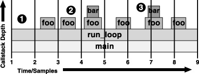

__Figure 2-2__  Sampling Results

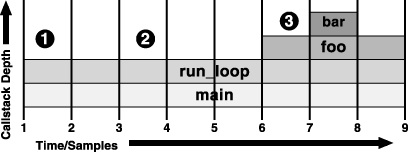

In exchange for this inevitable measurement error, statistical sampling incurs very little overhead as it takes measurements, typically less than 2% with default settings. A major problem with performance-measuring tools is that the tool often affects the very performance it attempts to measure. The profiling tool requires a certain amount of processor time, system RAM, cache memory footprint, and other limited system resources in order to function. Inevitably, “stealing” these resources from the measured process adds artificial overhead to the program under test, sometimes skewing the performance measurements.

Statistical sampling minimizes this impact in two key ways. First, samples are taken at a relatively low frequency when compared with most event-monitoring mechanisms. The sampling mechanism's low intervention rate consumes only a small amount of processor time and memory, thereby minimizing the risk of skewed results. Second, and more subtly, samples can occur _anytime_ during the execution of the program; side effects of the sampling mechanism are spread out to affect most areas of measured execution more or less equally. In contrast, most event counting-based mechanisms, such as function or basic block counting, record data at preset code locations, and therefore distort performance more near the preset sample points than elsewhere.

Statistical sampling provides helpful information about what executes most frequently, down to the level of individual assembly-language instructions, without the additional overhead required for an event-based profile at the instruction level. After sampling has ended, Shark correlates samples with the original binary to determine which assembly-language instructions or lines of original source code were executing when each interrupt occurred. Shark then accumulates results across samples, determining which individual lines of code were executing most often. In contrast, the overhead from adding the necessary code to profile at this level of detail in a non-statistical way would distort the results enough to render them virtually useless.

Recording a _Time Profile_ is generally very simple. Just use the general session-capture instructions presented in the previous chapter with the _Time Profile_ configuration selected, and you will capture one. Because _Time Profile_ is usually the default configuration, recording a session can be a matter of just starting Shark and pressing the “Start” button. Using the process selection menu, you may choose between capturing samples from just one process, or of the entire system at once. The former mode is usually better for analyzing most standalone applications, while the latter is better for seeing how applications interact.

If you need more control over the sampling behavior, the mini-configuration editor (Figure 2-3) contains the most common options. The list is reasonably short:

1. __Windowed Time Facility__— If enabled, Shark will collect samples until you explicitly stop it. However, it will only store the last N samples, where N is the number entered into the sample history field (10,000 by default). This mode is also described in [Windowed Time Facility (WTF)](Advanced%20Profiling%20Control.md#apple-f4xwc4dqnrsv64tfmyxwi33df52wszbpkridimbqga2temztfvbuqmjtfvjvomi).
2. __Start Delay__— Amount of time to wait after the user selects “Start” before data collection actually begins. This helps prevent Shark from sampling itself after you press “Start.”
3. __Sample Interval__— Enter a sampling period here to determine the sampling rate. The interval is 1 ms by default.
4. __Time Limit__— The maximum amount of time to record samples. This is ignored if WTF mode is enabled or if the sampling rate is high enough that the _Sample Limit_ is reached first.
5. __Sample Limit__ — The maximum number of samples to record. Specifying a maximum of _N_ samples will result in at most _N_ samples being taken, even on a multi-processor system, so this should be scaled up as larger systems are sampled. When the sample limit is reached, data collection automatically stops. With the _Windowed Time Facility_ mode, its sample history field replaces this one, and if the _Time Limit_ is very small it may be reached first.

__Figure 2-3__  Time Profile mini-configuration editor

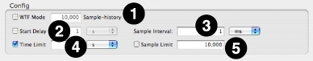

After you record a _Time Profile_ session, Shark displays the a summary of the samples from the dominant process in a tabular form called a _Profile Browser_. An example is shown in Figure 2-6. Samples are grouped (usually by symbol), and the groups with the most samples are listed first. This ordering is known as the “Heavy” view, and is described further below in [Heavy View](#apple-f4xwc4dqnrsv64tfmyxwi33df52wszbpkridimbqga2temztfvbuqmznknltcna). This view can be modified using the _View_ popup menu (#8), if you would rather see the “Tree” view, which is described in [Tree View](#apple-f4xwc4dqnrsv64tfmyxwi33df52wszbpkridimbqga2temztfvbuqmznknltcni) and organizes the sample groups according to the program’s callgraph tree, or “Heavy and Tree” view, which splits the window and shows both simultaneously.

__Figure 2-4__  The Profile Browser

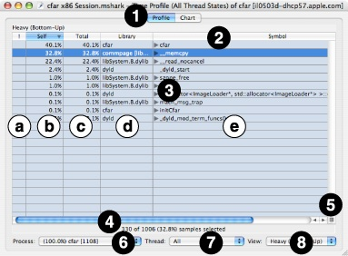

The window consists of several main parts:

1. __Pane Tabs__— These tabs let you select to view your samples using this pane, the Chart view (see [Chart View](#apple-f4xwc4dqnrsv64tfmyxwi33df52wszbpkridimbqga2temztfvbuqmznknltemi)), or from among one or more Code Browsers (see [Code Browser](#apple-f4xwc4dqnrsv64tfmyxwi33df52wszbpkridimbqga2temztfvbuqmznknltema)).
2. __Results Table Column Headers__— Click on any column title to select it, causing the rows to be sorted based on the contents of that column. You will usually want to sort by the “Self” or “Total” columns in this window. You can also select ascending or descending sort order using the direction triangle that appears at the right end of the selected header.
3. __Results Table__— The results table summarizes your samples in a simple, tabular form. User space code is normally listed in black text while supervisor code (typically the Mac OS X kernel or driver code) is listed in dark red text. However, this color scheme can be adjusted using the _Advanced Settings_, described below in [Profile Display Preferences](#apple-f4xwc4dqnrsv64tfmyxwi33df52wszbpkridimbqga2temztfvbuqmznknltemq).

   The _Edit→Find→Find_ command (_Command-F_) and the related _Edit→Find→Find Next_ (_Command-G_) and _Edit→Find→Find Previous_ (_Command-Shift-G_) commands are very useful when you are searching for particular entries in a profile browser listing many symbols. Simply type the desired library or symbol name into the _Find..._ dialog box, and Shark will automatically find and highlight the next instance of that library or symbol.

   The table consists of five columns:

   1. _Code Tuning Advice_— When possible, Shark points out performance bottlenecks and problems. The availability of code tuning advice is shown by a  button in the _Results Table_. Click on the button to display the tuning advice in a text bubble, as shown in ISA Reference Window.

      __Figure 2-5__  Tuning Advice

      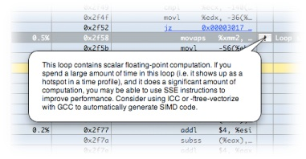
   2. _Self_— The percentage of samples falling within this granule (i.e. symbol) _only_. Sorting on this column is a good way to locate the functions that were actively executing the most, and as a result is a good choice for use with the bottom-up “Heavy” view. By double-clicking on this, you can view the raw number of samples for each row in the table.
   3. _Total_— In the “Heavy” view, this column lists the portion of each leaf entry’s time that passes through the given function (at the root level, therefore, it is equal to the _Self_ column). In the “Tree” view this column lists the percentage of samples that landed in the given granule or anything called by it (self plus descendants or “children”). Sorting on this column is a good way to locate the top of callstack trees rapidly, and as a result is a good choice for use with the top-down “Tree” view. By double-clicking on this, you can view the raw number of samples for each row in the table.
   4. _Library_— The name of the library (binary file) where the code of the sampled symbol is located. If no library information is available — unlikely but not impossible — the address of the beginning of the library is shown, instead.
   5. _Symbol_— The symbol where this sample was located. Most of the time, this is the name of the function or subroutine that was executing when the sample was taken, but the precise definition is controlled by the compiler. One particular area for wariness is with macros and inline functions. These will usually be labeled according to the name of the calling function, and not the macro or inline function name itself. If no symbol information is available, the address of the beginning of the symbol is shown, instead.

      You may click the disclosure triangle to the left of the symbol name to open up nested row(s) containing the name of all caller(s) (“Heavy” view) or callee(s) (“Tree” view). If you Option-Click on the triangle, instead, then all disclosure triangles nested within will open, too, allowing you to open up the entire stack with a single click.
4. __Status Bar__— This line shows you the number of active samples, the number of samples in any selected row(s) of the _Results Table_, and the percent of samples that are selected. Note that the number of active samples being displayed can be reduced dramatically using controls such as the _Process_ pop-up, _Thread_ pop-up, and data mining operations (see [Data Mining](Advanced%20Session%20Management%20and%20Data%20Mining.md#apple-f4xwc4dqnrsv64tfmyxwi33df52wszbpkridimbqga2temztfvbuqnznknltc)).
5. __Callstack View Button__— Pressing this button opens up the function _Callstack Table_, shown in Figure 2-6, which allows you to view deep calling trees more easily. The most frequently occurring callstack within the selected granule (address/symbol/library) is displayed. Once open, you can click rows of the _Callstack Table_ to navigate quickly to other granules that are present in the selected callstack.

   __Figure 2-6__  Callstack Table

   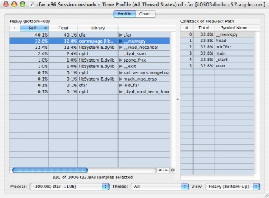
6. __Process Popup Menu__— This lists all of the sampled processes, in order of descending number of samples in the profile, plus an “All” option at the top. When you choose an option here, the _Results Table_ is constrained to only show samples falling within the selected process. Each entry in the process list displays the following information: the percent of total samples taken within that process, process name, and process ID (PID). This information is similar to the monitoring information provided by tools such as the command-line `top` program.
7. __Thread Popup Menu__— When you select a single process using the _Process Popup_, this menu lets you choose samples from a particular thread within that process. By default, the samples from all of the threads within the selected process are merged, using the “All” option.
8. __View Popup Menu__— This popup menu lets you choose from among the two different view options (“Heavy” and “Tree”) described below, or to split the window and display both views at once (“Heavy and Tree”).

The “Heavy” view is not flat – each symbol name has a disclosure triangle next to it (closed by default). Opening the disclosure triangles shows you the call path or paths that lead to each function. This allows you first to understand which functions are most performance-critical and second to see the calling paths to those functions.

__Figure 2-7__  Heavy Profile View Detail

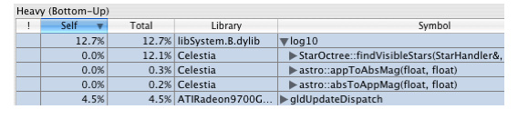

For example, Figure 2-7 shows a close-up of the “Heavy” profile view `log10()` entry. The library function `log10()` represents 12.7% of the time spent in the `Celestia` process. The 12.7% of the overall time spent in `log10()` is distributed between three calling paths. The _Total_ column shows that the first path (through `StarOctree::findVisibleStars()`) accounts for 12.1% of the overall time. The rest of the total time spent in `log10()` is through calls made by two other functions in the example shown above

In addition to the default “Heavy” or bottom-up profile view, Shark supports a call tree or top-down view (select “Tree” in the _Profile View_ pop-up button).

The “Tree” view gives you an overall picture of the program calling structure. In the sample profile (Figure 2-8), the top-level function is [`CelestiaOpenGLView drawRect:]`, which in turn calls `[CelestiaController display]`, which then calls `CelestiaCore::draw()`, and so on.

In “Tree” view, the _Total_ column lists the amount of time spent in a function and its descendants, while the _Self_ column lists the time spent only inside the listed function.

__Figure 2-8__  Tree Profile View

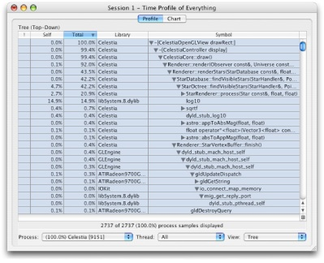

Profile analysis can help you better understand the data presented in the _Profile Browser_ by tailoring the formatting of the sampled information to suit your application’s code. Analysis settings are controlled separately for each session. The analysis controls are accessed per session by opening a drawer on the Profile Window, shown in Advanced Session Management and Data Mining, using _File_→_Show Advanced Settings_ (_Command-Shift-M_).

__Figure 2-9__  Profile Analysis Preferences

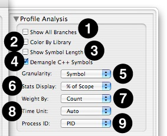

This part of the _Advanced Settings_ drawer contains many different controls:

1. __Show All Branches__— The default “Heavy” view lists only the leaf entries (where samples landed) for the sampled callstacks. As a result, each sample only appears once in the profile. Opening disclosure triangles in the “Heavy” view reveals the contribution of each calling function to the “leaf” function’s total, if you are interested in seeing what is calling those functions. With _Show All Branches_ on, a “sample” is counted for _all_ symbols (root, interior and leaf), rather than only leaf entries. This results in actual samples with deep callstacks being over-represented in the profile, since they are counted many times, but makes it easier to find symbols for frequently-occurring but non-leaf functions, since one no longer must drill down through multiple levels of disclosure triangles to find them.

   While Shark will allow you to use this mode with “tree” view, it is not recommended.
2. __Color By Library__— Uses colors to differentiate libraries in the _Results_ table.
3. __Show Symbol Length__— Displays the sum of instruction lengths in bytes for each symbol.
4. __Demangle C++ Symbols__— Translates compiler-generated symbol names to user-friendly names in C++ code, stripping off the name additions required to support function polymorphism.
5. __Granularity__— Determines the grouping level that Shark uses to bind samples together.

   1. _Address_— Group samples from the same program address.
   2. _Symbol_— Group samples from the same symbol (usually there is a one-to-one correspondence between symbols and functions).
   3. _Library_— Group samples from the same library.
   4. _Source File_— Group samples from the same source file.
   5. _Source Line_— Group samples from the same line of source code.
6. __Stats Display__— Selects units and a baseline number of samples.

   1. _Value_— Shows raw sample counts rather than percentages.
   2. _% of Scope_— Shows percentages based on currently selected process and/or thread.
   3. _% of Total_— Shows percentages based on total samples taken.
7. __Weight By__— In Shark’s default weighting method (weight by sample count), each sample contributes a count of one. During sample processing, any time a sample lands in a particular symbol’s address range (in the case of symbol granularity) the total count (or weight) of the granule is incremented by one. In addition to context and performance counter information, each sample also saves the time interval since the last sample was recorded. When samples are weighted by time, each granule is weighted instead by the sum of the sampling interval times of all of its samples.
8. __Time Unit__— Selects the time unit (µs, ms, s) used to display time values. _Auto_ will select the most appropriate time unit for each value when weighting by “Time.”
9. __Process ID__— Shark normally differentiates between processes according to their process ID (PID) – a unique integer assigned to each process running on the system. Thus, Shark groups together samples from the same PID. Shark can also identify processes by name. In this case, samples from processes with the same name (and possibly different PIDs) would be grouped together. This is particularly useful for programs that are run from scripts or that fork/join many processes.

The remainder of the controls visible in the Advanced Settings Drawer, which control Data Mining, are described in [Data Mining](Advanced%20Session%20Management%20and%20Data%20Mining.md#apple-f4xwc4dqnrsv64tfmyxwi33df52wszbpkridimbqga2temztfvbuqnznknltc).

Click Shark’s _Chart_ tab to explore sample data chronologically, from either a thread- or CPU-based perspective. This can help you understand the chronological calling behavior in your program, as opposed to the summary calling behavior shown in the _Results Table_. Using this chart, you can see at a glance if your program rarely/often calls functions and if there are any recurring patterns in the way your program calls functions. Based on this, you can often visually see different _phases_ of execution — areas where your program is executing different pieces of its code. This information is useful, because each phase of execution will usually need to be optimized in a different way.

Shark’s _Chart_ and _Profile_ views are tightly integrated. The same level of scope (system/process/thread) is always displayed on both. Selected entries in the _Results Table_ are highlighted in the _Chart_ view. Filtering of samples using the _Profile Analysis_ or _Data Mining_ panes (see [Data Mining](Advanced%20Session%20Management%20and%20Data%20Mining.md#apple-f4xwc4dqnrsv64tfmyxwi33df52wszbpkridimbqga2temztfvbuqnznknltc)) also affects the selection of samples shown in the _Chart_ view. As with the _Callstack Table_ shown in the _Profile_ Browser, double clicking on any entry in the table opens a new _Code Browser_ tab.

By default, Shark displays the currently selected scope (system, process, or thread) against an “absolute” time x-axis. This view displays gaps wherever the currently selected process or thread was not running. Use the _Time Axis_ pop-up button to switch between absolute and relative time, which compresses out these out-of-scope areas.

__Figure 2-10__  Chart View

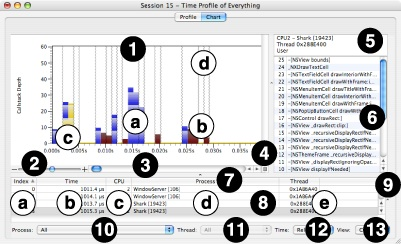

The chart view shown in Figure 2-10 has several parts:

1. __Callstack Chart__— This chart displays the depth (y-axis) of the callstack for each sample, chronologically from left-to-right over time (x-axis). The figure also clearly shows several key features of the chart:

   1. _User Callstack_— Most callstacks, in blue, represent user-level code from your program.
   2. _Supervisor Callstack_— Callstacks in dark red represent supervisor-level code stacks that were sampled.
   3. _Selected Callstack_— A yellow “pyramid” of callstacks is highlighted when you click on the graph to select a sample. Once you have chosen a sample, you can use the left and right arrow keys to navigate to the previous or next unique callstack “pyramid.” After highlighting the chosen sample, Shark examines the callstacks to either side and automatically extends the selection outwards to the left and right wherever the adjacent callstacks have the same symbol. In this way, you can easily see the full tenures for each function (length of time that function is in the callstack). Because functions at the base of the callstack, like `main`, have much longer tenures than the leaf functions at the top of the callstack, the shape of the highlighted area will always be a pyramid of some sort.

      It is also possible to select one or more individual _symbols_ within the chart view by selecting them in the Profile Browser and then switching over to the chart view. After you switch to the chart view, all of the dots on the chart representing calls to the selected symbol(s) will be highlighted in yellow, allowing you to find and examine samples containing those symbol(s) more easily in complex charts. It is usually easy to differentiate these “symbol selections” from the “sample selections” made by clicking within the chart view itself, because only elements of each callstack corresponding to the selected symbols are highlighted in the former case, and not entire samples or “pyramids,” as in the latter.
   4. _Context Switch Lines_— These lines indicate where the operating system switched another process or thread into the processor. Note that because Shark uses statistical sampling, it is possible to miss very short thread contexts. They are only visible at high levels of magnification in “absolute” time mode (as chosen in #12, below), when you select the option to show them in the _Advanced Settings_.
   5. _Out-of-Scope Callstack_— (not shown) Callstacks in gray, visible only in “absolute” time mode, are just placeholders for samples that are outside the current process/thread scope. In “relative” mode, they are eliminated from the graph.
2. __Zoom Slider__— You can zoom in or out of the chart by dragging this slider towards the “+” and “–” ends, respectively. You can also use the mouse to zoom into a subset of the displayed samples by dragging the mouse pointer over the desired region of the chart. Zooming out can also be accomplished by _Option-Clicking_ on the chart.
3. __Chart Scroll Bar__— If you have magnified the chart, then you can use this scroll bar to move left-and-right within it.
4. __Callstack Table Button__— Press this button to expose or collapse the _Callstack Table_, below.
5. __Callstack Table Header__— This area summarizes the CPU number, process ID, thread ID, and user/supervisor code status of the sample. This is displayed or hidden using the _Callstack Table Button_ (#4).
6. __Callstack Table__— This displays the functions within the callstack for the currently selected sample, with the leaf function at the top and the base of the stack at the bottom. As you select different samples in the chart, this listing will update to reflect the location of the current selection. This is displayed or hidden using the _Callstack Table Button_ (#4).
7. __Sample Table Headers__— Like most tables in Shark, you can click here to select the column used to sort the samples in this table, and then click on the arrow at the right end of the selected header cell to choose to sort in ascending or descending order. Choosing a column here has no other effect besides controlling the sort order, however.
8. __Sample Table__— This table lists a summary of all samples recorded within the session. It lists several key facts that are recorded with each sample:

   1. _Index_— Number of the sample within the session, starting from 1 and going up.
   2. _Time_— Time that has passed between this sample and the previous one. Normally, this will be a constant amount of time equal to the sampling period, but there are some sampling modes that allow variation here.
   3. _CPU_— Number of the CPU on your system where this sample was recorded, starting from 1 and going up.
   4. _Process_— Process ID for this sample’s process, including the name of the application.
   5. _Thread_— Thread ID for this sample’s thread.
9. __Sample Table Callstacks__— If you pull this window splitter to the left, you will expose a table listing all symbol names within the callstacks of each sample, in a large grid. Effectively, this is like looking at multiple _Callstack Table_s rotated 90 degrees and placed side-by-side. Most of the time, this level of detail about your samples is not necessary, but there may be some occasions when you might find this view helpful.
10. __Process Popup Menu__— This lists all of the sampled processes, in order of descending number of samples in the profile, plus an “All” option at the top. When you choose an option here, the _Callstack Chart_ is constrained to only show samples falling within the selected process. Each entry in the process list displays the following information: the percent of total samples taken within that process, process name, and process ID (PID). This information is similar to the monitoring information provided by tools such as the command-line `top` program.
11. __Thread Popup Menu__— When you select a single process using the _Process Popup_, this menu lets you choose samples from a particular thread within that process. By default, the samples from all of the threads within the selected process are merged, using the “All” option.
12. __Time Popup Menu__— This popup lets you choose between two different viewing modes. The first, “absolute” time mode, shows _all_ samples from a particular processor, no matter what was executing. Samples from outside the current process/thread scope are grayed out, but are still plotted. On the other hand, in “relative” time mode, all out-of-scope samples are eliminated and the chart’s x-axis is adjusted to account for the smaller number of samples.
13. __View Popup Menu__— This popup lets you choose to view sets of samples from different processor cores.

The first pane of the _Advanced Settings_ drawer displays a new set of options if you switch to a _Chart_ view (Figure 2-11). These controls affect the appearance of the chart, and are generally fairly minor:

1. __Draw Context Switch Lines__— Enables or disables the drawing of gray lines between samples that are from different process and/or thread contexts. They are quite useful, but can clutter the display at low levels of magnification.
2. __Hide Samples Not In Scope__— When chosen, this hides all samples from processes or threads outside of the ones in the current scope, as chosen by the _Process_ and _Thread_ pop-up menus. Any remaining samples are compressed together to remove any gaps. This process is similar to switching to “Relative” time using the _Time_ pop-up menu, but the results are slightly different.
3. __Coalesce Samples__— When chosen, this combines adjacent samples containing the same callstacks together, so they are no longer individually selectable. If your Time Profiles often contain large blocks of identical samples, the use of this option can make maneuvering through the samples using the arrow keys somewhat easier.
4. __Chart Type__— Selects which type of chart to plot. You will rarely need to change this, but other options are available:

   1. _Saturn_— The default chart type, this presents a graph consisting of a solid bar representing the callstack at each sample point.
   2. _Trace_— This chart type is similar to the Saturn graph type, except that it only draws an outline around the bars instead of coloring them completely. Selections are made only on a sample-by-sample basis, instead of in “pyramids.”
   3. _Delta_— This is much like the trace view, including the point selections. However, it only shows _changes_ in the callstacks, and not their exact depth. As a result, it is of most use when you are looking for rare changes in the callstack depth or trends over time.
   4. _Hybrid_— This graph looks like a Trace graph, but uses the full “pyramid” selection capability of the Saturn graph type.
5. __Weight By__— Choose how to present the x-axis scale for the chart view. You may have Shark present this axis in terms of sample count or by time. You may also use the keyboard equivalents _Command-1_ to use sample counts or _Command-2_ to use time.
6. __Time Unit__— Selects the time unit to use in the _Time_ column of the _Sample Table_. Normally you should just leave this on the default, “Auto,” but if you would prefer you may explicitly choose to have the numbers displayed in µs, ms, or s.
7. __Color Selection__— Choose colors to use for user sample callstacks, kernel sample callstacks, and the selection area by clicking on these color wells.

__Figure 2-11__  Advanced Settings for the Chart View

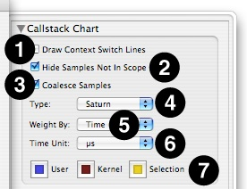

The remainder of the controls visible in the Advanced Settings Drawer, which control Data Mining, are described in [Data Mining](Advanced%20Session%20Management%20and%20Data%20Mining.md#apple-f4xwc4dqnrsv64tfmyxwi33df52wszbpkridimbqga2temztfvbuqnznknltc).

Double-clicking on an entry in the _Results Table_ or _Callstack Table_ will open a _Code Browser_ view for that entry, as shown in Figure 2-12. If available, the source code for the selected function is displayed. Source line and file information are available if the sampled application was compiled with debugging information (see [Debugging Information](Advanced%20Session%20Management%20and%20Data%20Mining.md#apple-f4xwc4dqnrsv64tfmyxwi33df52wszbpkridimbqga2temztfvbuqnznknltimy)). The _Code Browser_ shows the code from the selected function and colorizes each instruction according to its reference count (the number of times it was sampled).

__Figure 2-12__  Code Browser

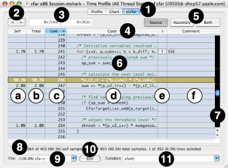

The Code Browser window consists of several different parts:

1. __Code Browser Tab__— When you double-click on an entry in a Profile Browser or Chart View, Shark dynamically adds a tab to the top of the window. This tab contains the code browser for the symbol that you double-clicked. If you return to one of the original browsers and double-click on another symbol, another tab will be added for that symbol. Unlike the default tabs, these additional tabs all have small close boxes on the left end. When clicked, the tab will be eliminated. If you open up more than about 3–5 code browsers, this may be necessary because of limited space at the top of the window.
2. __Browse Buttons__— You can use these buttons to maneuver through function calls. After you double-click on a function call (denoted by blue text) and go to the actual function, the “back” button here (left arrow) will be enabled. To return to the caller, just click on the “back” button. After you have maneuvered through a function call, you can navigate through code forward and backward just as you would navigate web pages in a web browser.
3. __Address Range__— This is used with the Assembly Browser (see [Assembly Browser](#apple-f4xwc4dqnrsv64tfmyxwi33df52wszbpkridimbqga2temztfvbuqmznknltgma)).
4. __Code Table Headers__— Click on any column title to select it, causing the rows to be sorted based on the contents of that column. You will usually want to sort by the “Line” column in this window, so that you can view your code in the original sequence order. You can also select ascending or descending sort order using the direction triangle that appears at the right end of the selected header.
5. __View Buttons__— Use these buttons to choose between:, _Assembly View_, or a split-screen view showing both side-by-side.

   - _Source View_: This displays the original source code for the function. It is the default, if Shark can find source code for the function. To make sure that Shark can find your source, you first need to have debugging information enabled in your compiler (see [Debugging Information](Advanced%20Session%20Management%20and%20Data%20Mining.md#apple-f4xwc4dqnrsv64tfmyxwi33df52wszbpkridimbqga2temztfvbuqnznknltimy)). Also, it is best to avoid moving the files after you compile them, so all source paths embedded in debugging information will still be accurate. Otherwise, you may need to adjust Shark’s source paths, as described in [Shark Preferences](Getting%20Started%20with%20Shark.md#apple-f4xwc4dqnrsv64tfmyxwi33df52wszbpkridimbqga2temztfvbuqmrnknltk).
   - _Assembly View_: This displays the raw assembly language for the function. Because it is extracted directly from the program binary, this option is always available, even for library code. See the Assembly Browser section ([Assembly Browser](#apple-f4xwc4dqnrsv64tfmyxwi33df52wszbpkridimbqga2temztfvbuqmznknltgma)) for more information.
   - _Both_: This displays both views side-by-side, and is useful when you are comparing your source input to the compiler’s output.
6. __Code Table__— This table allows you to examine your source code and see how samples were distributed among the various lines of code. Each row of the table is automatically color-coded based on the number of samples associated with that line — by default, hotter colors mean more samples — allowing you can see at a glance which code is executing the most.

   You can use the _Edit→Find→Find_ command (_Command-F_) and the related _Edit→Find→Find Next_ (_Command-G_) and _Edit→Find→Find Previous_ (_Command-Shift-G_) commands to search through your code, much like you can in most text editors. Just type the desired text into the _Find..._ dialog box, and Shark will automatically find and highlight the next instance of that text in your code. You can also use this to search for comments, if you need to look for repeated instances of a tip in the comments, for example.

   The table consists of several columns. Some of these are optional, and are enabled or disabled using checkboxes in the _Advanced Settings_ drawer.

   1. _Self_— This optional column lists the percentage of displayed references for each instruction or source line, using only the samples that fell within this particular address range. To see sample counts instead of percentages, double-click on the column.
   2. _Total_— This optional column lists the percentage of displayed references for each instruction or source line, including called functions. To see sample counts instead of percentages, double-click on the column.
   3. _Line_— The line number for each line from your original source code file. This column is particularly useful for sorting the browser window, in order to keep the line numbers there in sequence.
   4. _Code_— This column lists your original source file, line-by-line. Double-clicking on this column will take you to the equivalent location in the _Assembly_ display. Double-clicking on any function calls (denoted by blue text), will take you to the source code for that function.
   5. _Code Tuning Advice_— When possible, Shark points out performance bottlenecks and problems. The availability of code tuning advice is shown by a  button in this column. Click on the button to display the tuning advice in a text bubble, as shown in ISA Reference Window. The suggestions provided in the code browser will usually be more detailed and lower-level than the ones visible within the profile browser.
   6. _Comment_— This column gives a brief summary of the code tuning advice, allowing you to determine which code tuning suggestions are likely to be helpful without clicking on every last advice button.
   7. _Performance Event Column_— (Not shown) This optional column, which is only available when you are looking at a code browser while using a configuration that uses performance counters (as described in [Event Counting and Profiling Overview](Other%20Profiling%20and%20Tracing%20Techniques.md#apple-f4xwc4dqnrsv64tfmyxwi33df52wszbpkridimbqga2temztfvbuqnrnknltemi)), shows raw counts from those counters. It cannot be enabled with normal time profiles.
7. __Code Table Scrollbar__— This scrollbar (Figure 2-13) is customized to show an overview of sampling hot spots; the brightness of a location in the scrollbar is proportional to the sampling reference count of the corresponding instruction in the _Code Table_. Since programmer time is best spent optimizing code that makes up a large portion of the execution time, this visualization of hot spots helps you to quickly see and focus your development effort on the code that has the greatest influence on overall performance.

   __Figure 2-13__  Hot Spot Scrollbar

   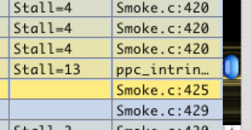
8. __Status Bar__— This line shows you the number of active samples in the currently displayed memory range, the number of active samples in the entire session, and/or the number of samples in any selected row(s) of the _Code Table_. Either or both of the active samples will be eliminated from this line if the “Self” or “Total” columns in the code table are disabled. In addition, the percent of samples that are in each of these categories is displayed.
9. __Source File Popup Menu__—A given memory range can contain source code from more than one file because of inlining done by the compiler. You can select which source file to view using this menu.
10. __Edit Button__— You can open the currently displayed source file in Xcode by selecting the _Edit_ button. The file will open up and scroll to your selected line, or the line with the most samples if nothing is selected.
11. __Function Popup Menu__— This pop-up menu allows you to jump quickly to different functions in the current source file. Please note that sample counts are only shown for the source lines in the current memory range — other functions not in the current memory range may be visible, and you can still look at them, but they will show no sample counts).

In addition to displaying the source code from the current memory range, Shark also provides a detailed assembly-level view (Figure 2-14) that can be enabled by clicking on the _Assembly_ button or combined with a source browser by clicking on the _Both_ button. This browser will also pop up in place of a source browser if Shark cannot find source code for the address range that you are examining. This will often be the case with common system libraries, the kernel, and precompiled applications.

Often, it is useful to examine the relationship between a line of source code and its compiler-generated instructions. Shark encourages this type of exploration: either use the _Both_ button to view source and assembly simultaneously or double-click on a line in the _Source_ or _Code_ columns in the _Assembly Code Browser_ to jump to the corresponding source line in the _Source Code Browser_. Conversely, double-click on a line of code in the _Source Code Browser_ to jump back to the corresponding instructions in the _Assembly Code Browser_.

Many parts of this browser are identical to their counterparts in the _Source Browser_, including Self, Total, tuning advice, and Comment columns. However, there are a few differences:

1. __Browse Buttons__— You can use these buttons to maneuver through branches. After you double-click on a branch with a static target address (denoted by blue text) and go to the destination, the “back” button here (left arrow) will be enabled. To return to the branch itself, just click on the “back” button. After you have maneuvered through branches, you can navigate through code forward and backward just as you would navigate web pages in a web browser.
2. __Address Range__— Samples are displayed only for the address range between these two boxes (usually one symbol). Code outside of this range may have samples, but they will not be displayed.
3. __Code Table__— About half of the columns have functions that are identical to the basic source browser, but the others are new or slightly different:

   1. _Address Column_— This displays the address of the assembly-language instruction displayed on this row. With PowerPC, this value simply increases by 4 with every row, but with x86 this will change by 1–18 bytes per row, depending upon the variable length of each instruction. You can double-click on this column to switch to relative decimal or hexadecimal offsets from the beginning of the address range.
   2. _Code Column_— This column displays the assembly code used by your routine. Using _Advanced Settings_, you can choose to disable disassembly and to have Shark automatically find and indent loops based on backwards branches in the code (the default). Within this column, you can double-click on a branch with a static target address (denoted by blue text) to follow a branch to its target address; after double-clicking, the function containing the target instruction will be loaded, if necessary, and the target instruction will be highlighted. Finally, double-clicking on this column will take you to the equivalent location in the corresponding _Source_ display.
   3. _Cycles Column_— (not shown) This PowerPC-only column displays the latency (processor cycles before an instruction’s result is available to dependent instructions) and repeat rate (processor cycles between completing instructions of this type when the corresponding pipeline is full) of the assembly instruction on this line, in processor cycles. In general, you will want to minimize the use of instructions with high latency, especially if the values that they produce are used by immediately following instructions. Use of instructions with poor (high number) repeat rates may also impact your performance if you try to issue them too frequently.
   4. _Comment Column_— In addition to its usual function of providing short versions of the code analysis tips, on PowerPC the comment column also displays information about how long the instruction must stall as a result of long latency by prior instructions. You will find that very low-level optimization hints, focused on particular assembly instructions, are provided here.
   5. _Source Column_— This shows the source file name and line number of where in the source code this instruction originated, when this is available. As with the _Code Column_, you can double-click here to get back to the _Source_ display, scrolled to the line listed here.
4. __Asm Help Button__— Press this button to get help for the selected assembly-language instruction, as described in [ISA Reference Window](#apple-f4xwc4dqnrsv64tfmyxwi33df52wszbpkridimbqga2temztfvbuqmznknlto).

__Figure 2-14__  Assembly Browser

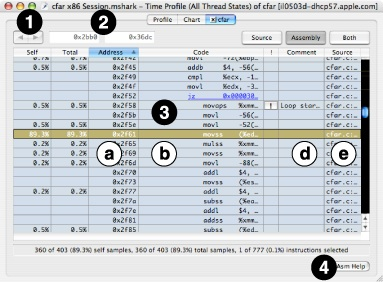

The _Advanced Settings_ drawer displays a new set of options if you switch to a _Code Browser_ view (Manual Session Symbolication). These options allow you to customize the viewing of source and assembly code and turn on and off various features of the browser. These are many controls in this view:

- __Code Browser__— This section affects the display of both source and assembly-language browsers.

  1. __CPU Model__— By default, Shark uses a model of the current system’s CPU architecture when analyzing code sequences in order to determine instruction latencies and hints. You can select other CPU architectures by changing this setting.
  2. __Hot Code Colors__— Choose the colors that Shark uses to display the “hotness” of code here.
  3. __Selection Formatting__— Choose the color and whether or not an outline is used for code selections.
  4. __Grid Lines__— Adds grid lines between each line of code when checked (the default).
  5. __Show Total Column__— Toggles display of the column that lists the percentage of displayed references for each instruction or source line, including called functions.
  6. __Show Self Column__— Toggles display of the column that lists the percentage of displayed references for each instruction or source line, but _not_ including called functions.
  7. __Show Perf Event Column(s)__— If the current profile contains performance counter information, this setting toggles display of that data within the browser. Otherwise, it will be disabled.
  8. __Show Code Analysis Columns__— Toggles display of the columns that provide optimization tips.
- __Source Browser__— This section affects the display of the source browser only.

  1. __Line Numbers__— Toggles display of the column that lists the line number from the source code.
  2. __Syntax Coloring__— Enable this to have Shark color source code keywords, constants, comments, and such.
  3. __Tab Width__— Shark auto-indents loops by this number of spaces for every loop nest level.
- __Asm Browser__— This section affects the display of the assembly-language browser only.

  1. __Disassemble__— Choose whether to display disassembled mnemonics or raw hexadecimal values for the instructions.
  2. __Indent Loops__— Choose whether or not to have Shark auto-indent loops in the code here. Loops are found based on analysis of backwards branches in typical compiled code.
  3. __Simplified Mnemonics__— (PowerPC-only) Choose whether or not to enable full disassembly of instructions with constant values that specify special instruction modes, or to only disassemble to fundamental opcodes and leave the modifying constants intact for your examination.
  4. __Show G5 (PPC970) Dispatch Groups__— (PowerPC-only) Displays outlines on the main assembly-language grid showing the breakdown of the instructions into dispatch groups. Further details on is can be found in [Code Analysis with the G5 (PPC970) Model](Miscellaneous%20Topics.md#apple-f4xwc4dqnrsv64tfmyxwi33df52wszbpkridimbqga2temztfvbuqmjufvjvomq). This function is always disabled for sessions recorded on Macs with other processor architectures.
  5. __Show G5 (PPC970) Details Drawer__— (PowerPC-only) Shark can display graphs of instruction dispatch slot and functional unit utilization in an additional, G5-specific “details” drawer. Further details on is can be found in [Code Analysis with the G5 (PPC970) Model](Miscellaneous%20Topics.md#apple-f4xwc4dqnrsv64tfmyxwi33df52wszbpkridimbqga2temztfvbuqmjufvjvomq). This function is always disabled for sessions recorded on Macs with other processor architectures.

__Figure 2-15__  Advanced Settings for the Code Browser

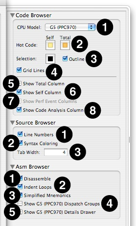

Other architectures have slightly different options for items 3–5 of the __Asm Browser__ settings. For x86-based systems, illustrated in , these options are:

- __Syntax__— Chooses whether to display the x86 instructions in Intel assembler syntax or AT&T syntax (the default).
- __Show Prefixes__— If checked, instruction prefixes (like `lock` and temporary mode shifts) will be displayed.
- __Show Operand Sizes__— If checked, each instruction explicitly encodes its operand size into the mnemonic (AT&T syntax) or operand list (Intel syntax). Otherwise, the code will be streamlined but it may not be possible to tell 8, 16, 32, and 64-bit versions of instructions apart.

__Figure 2-16__  x86 Asm Browser Advanced Settings

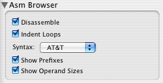

For ARM-based systems, illustrated in , the only option is:

- __ISA__— Selects to decode the instructions in the block as ARM (32-bit) instructions or Thumb (16-bit) instructions. The iOS uses both types of ARM instructions for different functions, so you may need to use this menu to switch from one to the other on a symbol-by-symbol basis.

__Figure 2-17__  ARM Asm Browser Advanced Settings

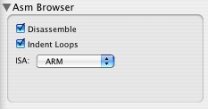

In order to understand the low-level analysis displayed in Shark’s _Assembly Browser_, it may be helpful to view the underlying machine’s instruction set architecture (ISA). You can display the PowerPC or Intel ISA Reference Manual (Figure 2-18) by clicking on the _Asm Help_ button in the _Assembly Browser_ or choosing the appropriate command from the _Help_ menu: _Help→PowerPC ISA Reference_, _Help→IA32 ISA Reference_, or _Help→EM64T ISA Reference_.

The _ISA Reference Window_ provides an indexed, searchable interface to the PowerPC, IA-32 (32-bit x86), or EM64T (64-bit x86) instruction sets. The reference is also integrated with selection in the Shark _Assembly Browser_ – selecting an instruction in the table causes the _ISA Reference Window_ to jump to that instruction’s definition in the manual.

__Figure 2-18__  ISA Reference Window

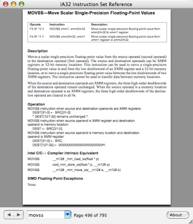

This section points out a few things that you might see while looking at a _Time Profile_, what they may mean, and how to optimize your code if you see them. The tips and tricks listed herein are organized according to the view most commonly used to infer the associated behavior.

- __Profile Browser__

  - _Where should I start? :_

    When first presented with a Profile Browser, you will want to begin in “Heavy View” sorted by “Self” and see what pops to the top. These will be the functions that execute the most, and probably have inner loops that may be susceptible to optimization. Do not forget to pop open disclosure triangles to see what functions are calling these functions; sometimes it is easier to optimize outer loops in these calling functions, instead of inner loops in the leaf functions. If any of these outer functions look promising, you may want to consider flipping to “Tree” view in order to see the caller-callee relationships a little more clearly.
  - _No Samples Taken:_

    Shark will come up and report that it has not taken any samples if all of the threads in your application are blocked when you choose to sample one process using [Process Attach](Advanced%20Profiling%20Control.md#apple-f4xwc4dqnrsv64tfmyxwi33df52wszbpkridimbqga2temztfvbuqmjtfvjvomjs) or [Process Launch](Advanced%20Profiling%20Control.md#apple-f4xwc4dqnrsv64tfmyxwi33df52wszbpkridimbqga2temztfvbuqmjtfvjvomjt). In this case, you probably want to use _Time Profile (All Thread States)_ (see [Time Profile (All Thread States)](Other%20Profiling%20and%20Tracing%20Techniques.md#apple-f4xwc4dqnrsv64tfmyxwi33df52wszbpkridimbqga2temztfvbuqnrnknltcoa)) to see where your threads are blocking.

    If you are using programmatic control of Shark’s start and stop points (see [Programmatic Control](Advanced%20Profiling%20Control.md#apple-f4xwc4dqnrsv64tfmyxwi33df52wszbpkridimbqga2temztfvbuqmjtfvjvomjw)), having no samples taken may also indicate that you are starting and stopping so quickly that there was simply no chance to take any meaningful samples. In this case, you should either adjust your start and stop points to increase the amount of time between them, increase the sampling rate (see [Taking a Time Profile](#apple-f4xwc4dqnrsv64tfmyxwi33df52wszbpkridimbqga2temztfvbuqmznknltemy)), or both.
  - _Too many symbols displayed:_

    If there is just too much clutter in the profile browser, then you need to use data mining. See [Data Mining](Advanced%20Session%20Management%20and%20Data%20Mining.md#apple-f4xwc4dqnrsv64tfmyxwi33df52wszbpkridimbqga2temztfvbuqnznknltc) for details on how to do this. Sometimes, switching between “Tree” and “Heavy” view can help organize the symbols in a more helpful way, also.

    If you are looking for a small number of known symbols in a large browser window, the _Edit→Find→Find_ command (_Command-F_) and the related _Edit→Find→Find Next_ (_Command-G_) and _Edit→Find→Find Previous_ (_Command-Shift-G_) commands are probably your best bet. With these commands, Shark will automatically find and highlight the next instance of that library or symbol for you.
  - _Lots of symbols have almost equal weight:_

    If you have many symbols popping up to the top of the list, the best thing is to quickly examine several of them using the Code Browser, while keeping an eye out for functions with loops that look easy-to-optimize.
- __Chart View__

  - _Different parts of the chart look visibly different:_

    Different-looking areas were probably created by different code in your program as it executes different program _phases_ of execution. In most applications, each of these will need to be optimized separately. As a result, you may want to sample these with different Shark sessions, so that you can examine the different phases separately. Alternately, you may sample them all in one session and then use data mining (see [Data Mining](Advanced%20Session%20Management%20and%20Data%20Mining.md#apple-f4xwc4dqnrsv64tfmyxwi33df52wszbpkridimbqga2temztfvbuqnznknltc)) to focus more selectively on each phase as you examine the session.
  - _What is executing at a point in the chart? :_

    Click on the chart at the point of interest and then open up the Callstack Table to see the stack for that sample (#4–6 in [Figure 2-10](#apple-f4xwc4dqnrsv64tfmyxwi33df52wszbpkridimbqga2temztfvbuqmznknltq)). You can also double-click on the chart to open a Code Browser for the function executing at that point.
- __Code Browser__

  - _The assembly browser shows lots of MOV (x86) or LD/ST (PowerPC) instructions:_

    If well over half of the instructions in your Assembly Browsers are memory access instructions, instead of actual computation, then it is quite likely that you forgot to turn on compiler optimization. One of the most important compiler optimizations is _register allocation_, which assigns variables to processor registers temporarily between operations. Without this — such as when you use Xcode’s `gcc` with `-O0` optimization — the compiler will typically load and store all values to-and-from memory with every operation, resulting in multiple data movement instructions per computation instruction. WIth register allocation, however, the compiler will use registers to route data right from one computation instruction directly to another, resulting in significantly fewer instructions and hence faster code.

    As a result of the significant “free” performance improvement possible using this and other optimizations, we suggest that you always use compiler optimization _before_ using Shark (with Xcode’s `gcc` we suggest `-O2`, `-Os`, or `-O3`).
  - _I do not see any source:_

    Shark finds source code based on the full path to the source at the time it was compiled, but it recovers this source as you examine the session. If your source code moved or changed between compilation and session examination, or if you are recording and examining your session on a different Mac than you used for compilation, then you are likely to have trouble finding source. In this case, you will want to either recompile your source, in order to reset the paths correctly, or add the path to your source to Shark’s list of source search paths, in [Shark Preferences](Getting%20Started%20with%20Shark.md#apple-f4xwc4dqnrsv64tfmyxwi33df52wszbpkridimbqga2temztfvbuqmrnknltk).

    Another common source of this problem is omitting the `-g` flag when you compile. You should only use Shark on fully-optimized, release-quality code, but default settings in development environments such as Xcode often turn off debugging options like `-g` when set to produce optimized code. As a result, you will often need to manually adjust the build settings to enable this option when using Shark. Please note that in Xcode you will need to adjust the build settings for the _Target_ that you are testing and the correct (optimized) _build configuration_. Unfortunately, it is quite easy to set options for the wrong target or build configuration accidentally.
  - _I want to see code coloring based on time spent here and in functions called by this code:_

    By default, the code browser only shows the _Self_ value column, and code is colored based on these values, which are the percent of samples spent executing each line of code within the displayed function. If you are examining your code line-by-line, this is generally how you will want to see the weighting displayed. However, you may also be interested in seeing time spent within the function _and_ all descendant functions that it calls. In this case, you will want to enable the _Total_ column using the _Advanced Settings_ drawer. The code browser’s color scheme will then change to show weight coloring based on the values in this column, instead.

In this section, Shark is used to increase the performance of the reference implementation of the MPEG-2 decoder (from mpeg.org) by 5.7x on a Mac Pro with 3.0 GHz Intel® Core 2™ processor cores.

Before beginning any performance study, it is critical to define your performance metric and to justify its relevance. Measurement of your metric should be both precise and consistent. Our performance metric for MPEG-2 was defined as the frame rate, in frames per second, of the decoder when decoding a reference movie. Unlike most video decoders, our test harness for the mpeg.org reference code let it decode as quickly as possible, without trying to keep the frame rate fixed at the rate at which it was originally recorded. As a result, the frame rate was a direct function of how fast the processor was able to do the actual decoding. This kind of unlimited decoding speed is used for offline video decoding/encoding, a task performed almost constantly by video editing programs as they read and write video clips. In addition, higher decoding speed in playback settings where the processor is limited to a fixed frame rate is still a useful metric, because means that the processor will have more time between frames to do other tasks, decode larger frames, or simply shut down and save power for a longer time between frames.

The reference MPEG-2 decoder source code consists of over 120 densely coded functions spread across more than 20 files. As a result, if one were handed the code and told to optimize it, the task would appear virtually hopeless — there is simply too much code to review in a reasonable amount of time! However, as in many programs, a large majority of the code handles initialization tasks and unusual corner cases, and is therefore only rarely executed. As a result, the actual quantity of code that needs modification in order to dramatically speed up the application is probably small, but Shark is required to locate it efficiently.

After compiling and running the reference decoder, Shark generated the session displayed in Figure 2-19. Just by pressing the “Start” and “Stop” button, we get a session that lets us see that about half the execution time is spent in a combination of the `Reference_IDCT()` function and the `floor()` function. By clicking the callout () button to the left of the `floor()` function in the display, we see that Shark suggests we replace the `floor()` function with a simple, inline replacement. Following this advice garners a __1.12x__ performance increase. This is not a huge improvement, but is very good for something that only takes a few minutes to perform.

Looking at the code more closely shows _why_`floor()` was required: the IDCT (Inverse Discrete Cosine Transform) function takes short integer input, converts to floating point for calculation, and then converts the results back to short integers. While this is a good way to keep the mathematics simple in the sample “reference” platform, the numerous type conversions and slow floating point arithmetic make this routine slow.

Converting to integer mathematics throughout avoids expensive integer→FP→integer conversions and slow FP mathematics, at the expense of more convoluted math in the code. This code is available in the mpeg2play implementation (also available on mpeg.org). Switching the implementation to integer math resulted in a much more dramatic speedup over the original code of __1.86x__.

__Figure 2-19__  Original Time Profile, with Tuning Advice

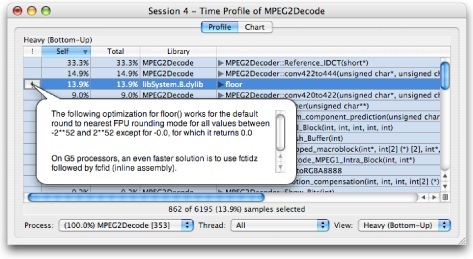

Optimizing the `Reference_IDCT()` function by converting it from floating point to integer also presented another possible optimization that could be helpful: SIMD vectorization. All Intel Macintoshes support the SSE instruction set extensions, allowing them to process 128-bit vectors of data, and most PowerPC Macintoshes support the very similar AltiVec™ extensions. Although the methodology for vectorizing your code is beyond the scope of this document, there is a plethora of documentation and sample code available to you online at [http://developer.apple.com/hardwaredrivers/ve/index.html](https://developer.apple.com/hardwaredrivers/ve/index.html). The very regular, mathematically intensive inner loops of the IDCT routine are perfect candidates for this kind of vectorization. Following the suggestion supplied by Shark in Figure 2-20 led to converting the IDCT routine to use SSE. Surprisingly, performance only increased to __2.05x__, with only a 10% improvement from vectorization.

At a point like this, where our optimization efforts result in non-intuitive results, it is generally a good idea to use Shark again to see how conditions have changed since our first measurement. This additional run of Shark produced the session in Figure 2-21. The vectorized IDCT function, `IWeightIDCT()`, now takes up less than 5% of the total execution time. The mystery is solved: as the IDCT function was optimized while other routines were not modified, those other, unoptimized routines became the performance bottleneck instead. Further examination with Shark quickly identified the key loops in several new functions. Because, like IDCT, they were performing complex math in tight inner loops, most of the new bottlenecks were also good targets for vectorization. As seen in Table 2-1, final optimization of motion compensation (`Flush_Buffer()` and `Add_Block()`), colorspace conversion (`dither()`), and pixel interpolation (`conv420to422()` and `conv422to444()`) achieved a speedup of __5.69x__ over the original code — a dramatic improvement made possible in a relatively short amount of time thanks to the feedback provided by Shark.

__Figure 2-20__  Code Browser with Vectorization Hint

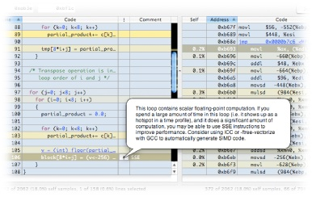

__Figure 2-21__  Time Profile after Vectorizing IDCT

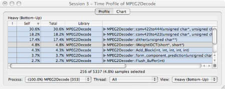

__Table 2-1__  MPEG-2 Performance Improvement

| Optimization Step | Speedup |
| Original | 1.00x |
| Fast `floor()` | 1.12x |
| Integer IDCT | 1.86x |
| Vector IDCT | 2.05x |
| All Vector | 5.69x |

[Next](System%20Tracing.md)[Previous](Getting%20Started%20with%20Shark.md)

