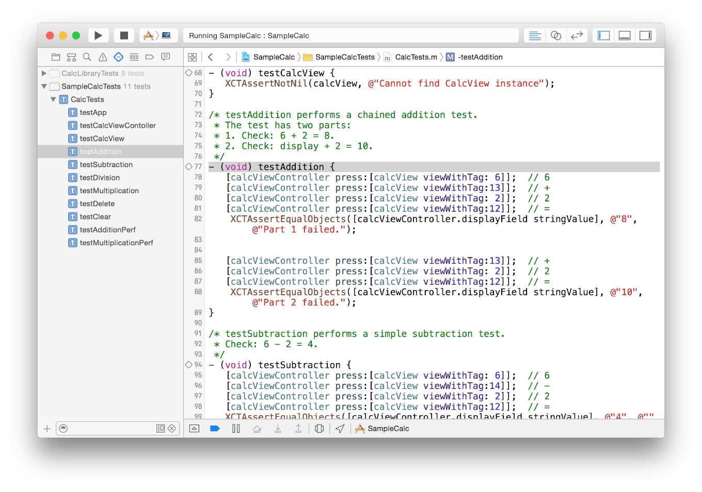

> 导航：[总目录](../../../README.md) · [documentation](../../../_indexes/documentation.md)

[Next](Quick%20Start.md)

# About Testing with Xcode

Xcode provides you with capabilities for extensive software testing. Testing your projects enhances robustness, reduces bugs, and speeds the acceptance of your products for distribution and sale. Well-tested apps that perform as expected improve user satisfaction. Testing can also help you develop your apps faster and further, with less wasted effort, and can be used to help multiperson development efforts stay coordinated.

In this document you’ll learn how to use the testing features included in Xcode. The XCTest framework is automatically linked by all new test targets.

- __Quick Start.__ Beginning with Xcode 5 and the introduction of the XCTest framework, the process of configuring projects for testing has been streamlined and automated with the test navigator to ease bringing tests up and running.
- __Performance Measurement.__ Xcode 6 and later includes the ability to create tests that allow you to measure and track performance changes against a baseline.
- __UI Testing.__ Xcode 7 adds capabilities for writing tests that exercise an app’s UI. It includes the ability to record UI interactions into source code that you can transform into tests.
- __Continuous Integration and Xcode Server.__ Xcode tests can be executed using command-line scripts or configured to be executed by bots on a Mac running Xcode Server automatically.

You should be familiar with app design and programming concepts.

See these session videos from WWDC for a good look at Xcode testing capabilities.

- WWDC 2013: [Testing in Xcode 5 (409)](https://developer.apple.com/videos/wwdc/2013/?id=409)
- WWDC 2014: [Testing in Xcode 6 (414)](https://developer.apple.com/videos/wwdc/2014/?id=414)
- WWDC 2015: [UI Testing in Xcode 7 (406)](https://developer.apple.com/videos/wwdc/2015/?id=406)
- WWDC 2015: [Continuous Integration and Code Coverage in Xcode 7 (410)](https://developer.apple.com/videos/play/wwdc2015/410/)
[Next](Quick%20Start.md)

